# Linux进程环境变量
# 环境变量
## 基本概念
环境变量(environment variables)一般是指在操作系统中用来指定操作系统运行环境的一些参数

+ 如：我们在编写C/C++代码的时候，在链接的时候，从来不知道我们的所链接的动态静态库在哪里，但是照样可以链接成功，生成可执行程序，原因就是有相关环境变量帮助编译器进行查找。
+ 环境变量通常具有某些特殊用途，还有在系统当中通常具有全局特性

## 认识环境变量
我们对于Linux的理解，指令就是程序，我们写的C语言代码也是一个程序，那么有一个问题，为什么Linux的指令他直接就可以在bash（终端）上运行，为什么我们写的代码生成的可执行文件


+ 在我们运行程序的时候，需要知道此程序在哪个位置

在Linux的中的命令，它为什么不需要指定路径来执行呢？是因为有个叫【PATH】的环境变量，在我们输入指令后，会在指定路径下查找，如果找不到要执行的指令就会返回错误【command not found】


因为【PATH】变量没有记录我们输入的指令的位置信息，所以我们必须手动指定指令的位置。那么我们可以总结出指令(程序)是如何执行的

> 我们可以查看一下PATH下有哪些路径
>

```bash
echo $PATH
```

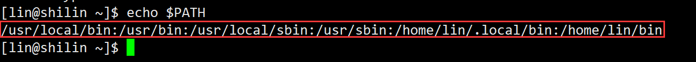

+ 可以看到上面是有各种路径每个路径是一下【:】分割，我们可以看到有一个`/usr/bin`目录，那么**我们写的这个程序也就可以拷贝到这个目录下就可以不指定路径直接执行了**

**第二个方法是将我当前这个目录的路径添加到这个环境变量中，这样也可以**

> 我们可以用下面的这条指令来修改系统变量
>

```bash
export PATH=路径
```


+ 发现我们刚刚查看的变量不在了，ls也无法执行了


+ 这个时候不要慌，我们可以另外再开一个终端再看

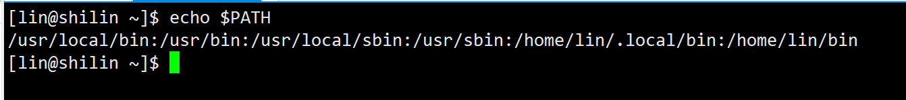

+ 那么我们如何正确的向[PATH]添加一个路径呢？我们用到下面的指令：

```bash
export PATH=$PATH:路径
```

+ 这就完成了添加一个环境变量的操作

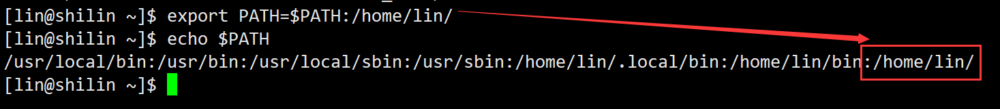

+ 那么为什么新开了一个终端它就又恢复了呢？
    - 这是因为在我们默认查看的环境变量是**<font style="color:#DF2A3F;background-color:#FBDE28;">内存级</font>**的
+ 最开始的环境变量不是在内存中，是在对应的配置文件中，登录Linux系统的时候它会首先加载到bash进程中（内存）

那么这个配置文件在哪？

```bash
.bash_profile # 当前登录用户环境变量
.bashrc       # 当前登录用户环境变量
/etc/bashrc   # 全局环境变量
```

## 查看当前shell环境下的环境变量与内容
```bash
env
```

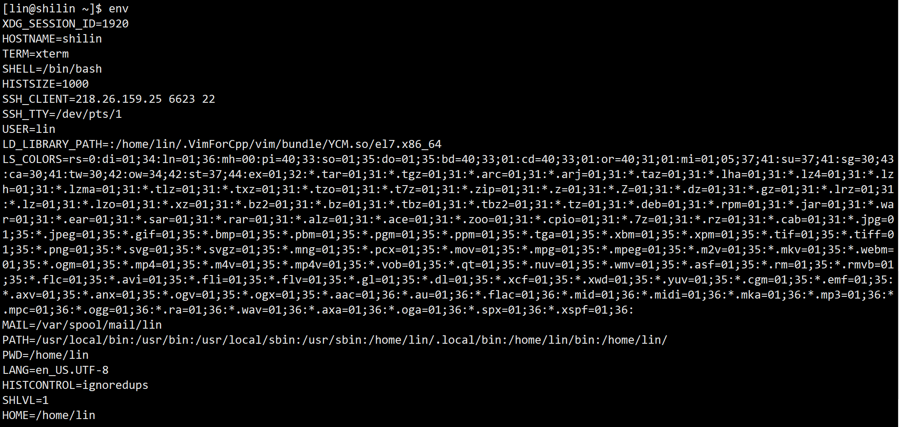

+ PATH : 指定命令的搜索路径
+ HOME : 指定用户的主工作目录(即用户登陆到Linux系统中时,默认的目录)
+ SHELL : 当前Shell,它的值通常是/bin/bash。

可以通过`echo $NAME`查看你的环境变了，其中NAME:你的环境变量名称

环境变量是随着启动操作系统时生成的，也就是说，环境变量是属于bash的。

+ 指令是一个程序，在bash上执行，那么这个程序就是bash的子进程
+ 我们平时所用的pwd命令就是有一个环境变量叫pwd，这个环境变量存储着用户当前的所在位置


我们也可以自己实现一个pwd指令

## getenv
在实现的时候需要了解一个函数getenv，我们用man手册查看一下

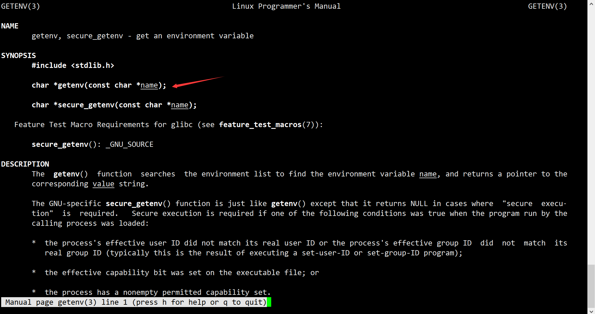

```c
#include<stdio.h>
#include<stdlib.h>
int main()
{
  char* ret = getenv("PWD");
  printf("%s\n",ret);
  return 0;
}
```

可以看到我们就实现了这个


+ 我们在bash上运行的程序，是bash的子进程，而环境变量是属于bash的，子进程为什么能用父进程的环境变量？这是因为：**子进程可以继承父进程的环境变量！并且，****<font style="color:#DF2A3F;background-color:#FBDE28;">环境变量一定是全局属性的</font>****！**

每个程序都会收到一张环境表，环境表是一个字符指针数组，每个指针指向一个以’\0’结尾的环境字符串

## main函数参数
在子进程是如何继承环境变量的？子进程是不是有一个主函数？这个主函数我们平时使用时是没有参数的，但实际上它是可以带参数的！还能带三个！

```c
#include<stdio.h>
#include<stdlib.h>
int main(int argc, char* argv[], char* environ[])
{
    return 0;
}
```

+ 第一个参数代表的意思为：指令参数的个数(包括指令)；
+ 第二个参数代表的意思为：指令参数的指针数组(因为指令参数是一个字符串)；
+ 第三个参数代表的意思为：环境变量的指针数组(因为环境变量是一个字符串)。我们一般不使用第三个参数，而是使用操作系统提供的外部的指针数组指针【char** environ】或者是系统提供的接口函数`getenv()`。

我们就可以实现一个带参数的指令，就像ls类似的

```c
#include <stdio.h>
#include <string.h>
int main(int argc,char* argv[])
{
    if(argc < 2)
    {
        printf("指令参数太少！\n");
        return 1;
    }
    if(strcmp(argv[1],"-a")==0)
    {
        printf("执行-a\n");
    }
    else if(strcmp(argv[1],"-b")==0)
    {
        printf("执行-b\n");
    }
    else
    {
        printf("指令有误！\n");                                                                                                                                                        
    }
    return 0;
}
```

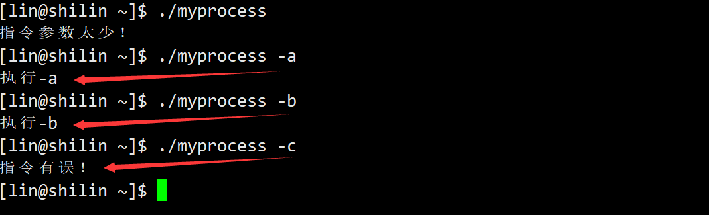

+ 我们可以再写一个代码来验证一下

```c
#include <stdio.h>
#include <string.h>
int main(int argc,char* argv[])
{
    printf("%d\n",argc);
    int i=0;                                                                                                                                                                           
    for(i=0;i<argc;i++)
    {
        printf("%s\n",argv[i]);
    }
    return 0;
}
```

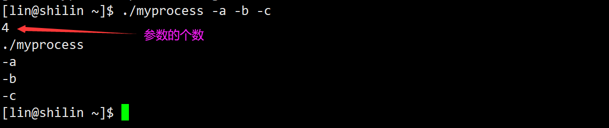

+ 从上面 可以看出 [argc]是存储指令参数的个数的(包括指令)，[char* argv[]]这个指针数组是存储指令参数的(包括指令) 
+ 对于第三个参数，是一个指针数组，存储的是各个环境变量的内容，因为这些内容是字符串常量，而表示字符串常量通常使用其首字符地址
+ 我们是很少使用第三个参数的，因为这个数组存储了所有的环境变量，想要找到特定的环境变量还是挺困难的，那么我们使用这段代码，证明第三个参数存储了环境变量：

```c
#include <stdio.h>
#include <string.h>
int main(int argc,char* argv[],char* environ[])
{
    int i = 0;                                                                                                                                                                         
    for(i = 0; environ[i]; i++)
    {
        printf("[%d]-->%s\n",i, environ[i]);
    }
    return 0;
}
```

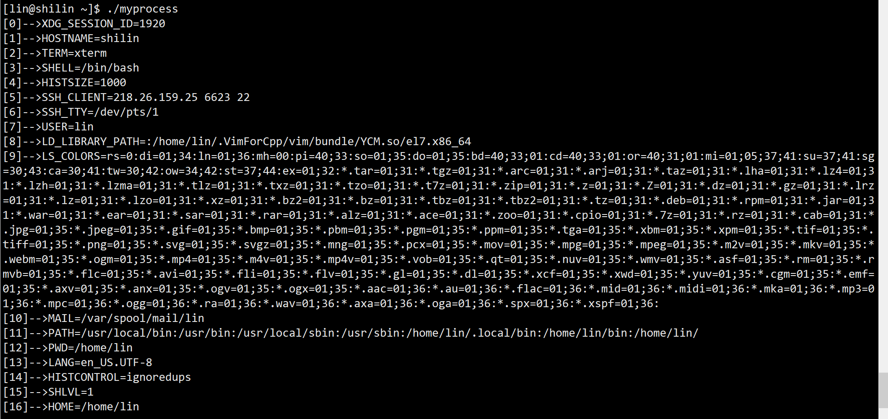

+ 或者使用另一种写法（引入）可以完成

libc中定义的全局变量environ指向环境变量表，environ没有包含在任何头文件中，所以在使用时要用extern声明。

```c
#include <stdio.h>
#include <string.h>
int main(int argc,char* argv[])
{
    extern char** environ;
    int i=0;                                                                                                                                                                         
    for(i=0;environ[i];i++)
    {
        printf("[%d]-->%s\n",i,environ[i]);
    }
    return 0;
}
```

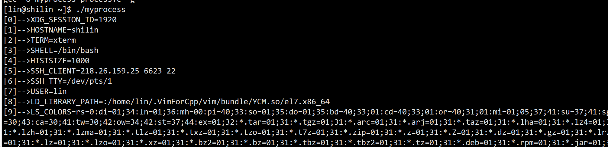

+ 环境变量是具有全局属性的，也就意味着子进程只能继承父进程的具有全局属性的环境变量。称作**本地变量（只在父进程的本bash内部有效）**。

---

+ 进程会记录下来自己的工作路径-->cwd，那么父进程bash也有cwd，在bash进程自己的`task_struct`内部保存，以父进程`task_struct`为模板创建子进程。

使用系统调用来查看当前的工作路径：

需要使用`getcwd`来实现：

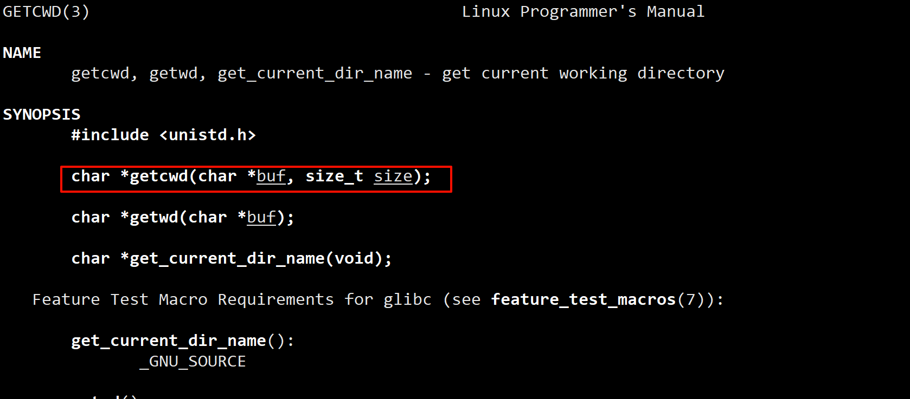

即可写出这样的代码：

```c
#include <stdio.h>
#include <unistd.h>
#include <string.h>
#include <stdlib.h>

int main(){
    char buff[128];
    char *pwd = getcwd(buff,sizeof(buff));
    printf("%s\n",buff);
    printf("%s\n",pwd);
    return 0;
}
```


如果要想写一个只有自己能执行的程序就可以使用环境变量来实现

```c
#include <stdio.h>
#include <unistd.h>
#include <string.h>
#include <stdlib.h>

int main(){
    char *str = getenv("USER");
    if(strcmp(str,"lin"))
    {
        printf("不是你的程序，不能执行！user: %s\n",str);
        return 1;
    }
    printf("是你的程序，可以执行！user: %s\n",str);
    return 0;
}
```

使用lin用户执行：


使用root用户执行


## 设置本地变量
如何设置本地变量呢？我们只需要在bash上面按这个格式敲指令：

+ 变量中间不能有空格

```bash
[变量名]=[内容]       
```

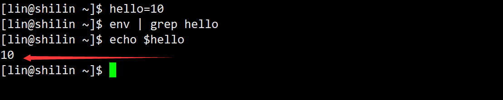

+ 我们发现使用env来查看我们设置的变量，并不能显示出结果，证明了我们刚刚设置的变量是本地变量

可以通过手动查看本地环境变量

+ 使用【echo】命令还可以查看到，因为echo是可以操作环境变量的，所用echo命令是可以操作所有的变量的，不管是本地变量还是环境变量。因为这是内建命令，就比如cd，ls那些...

大部分命令是可执行程序。需要通过创建子进程的性质执行Linux中，有一部分命令，执行的时候，没有风险，需要bash自己执行我们把这种命令叫做**<font style="color:#DF2A3F;background-color:#FBDE28;">内建命令</font>**！

```shell
echo $NAME 
```

+ 其中NAME:你的环境变量名称

子进程并没有继承父进程的本地变量，那我们如何使本地变量变成环境变量呢？我们输入下面这个指令：

```bash
export [变量名称]     
```


如何查看本地变量，或者说如何查看所有的变量？我们使用下面这条命令：

```bash
set
```

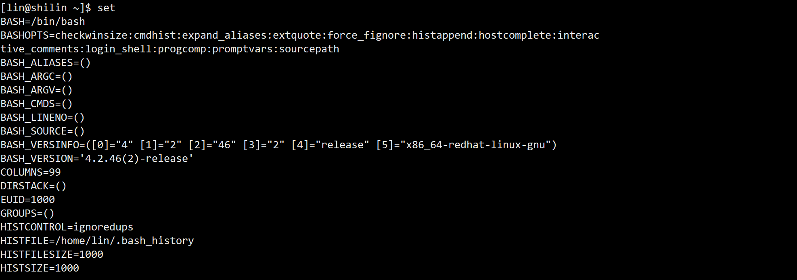

+ 取消变量刚刚定义的可以使用下面这条命令

```bash
unset [变量名]
```

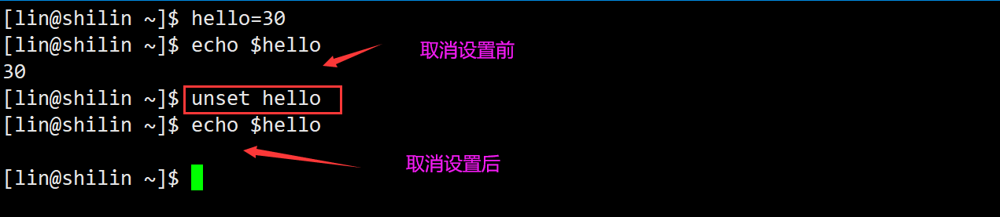

## 通过修改配置文件
每次打开shell的时候都会bash都需要加载一下环境变量配置，那么这个配置一般是在下面这几个文件中

```shell
.bash_profile # 当前登录用户环境变量
.bashrc       # 当前登录用户环境变量
/etc/bashrc   # 全局环境变量
```

那么我们就可以修改这个配置里的文件，让每次打开shell的时候自动加载一下

例如：在`.bashrc`配置文件中加上这条

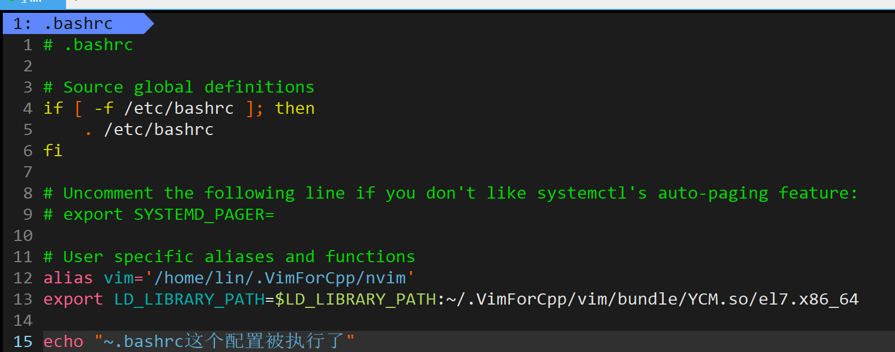

配置也可以成功加载了

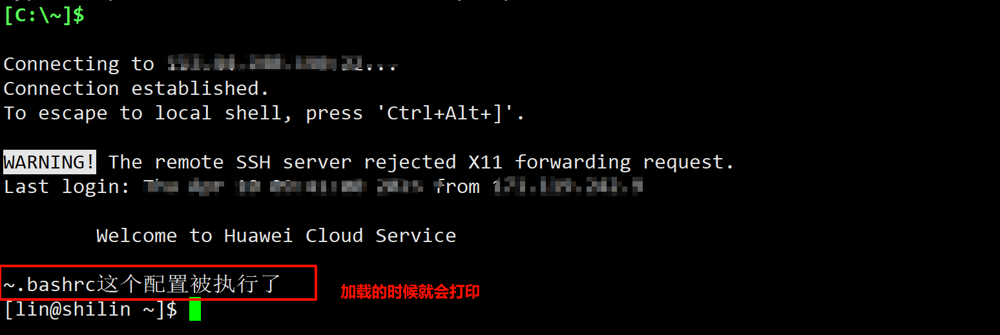

---

在`.bash_profile`加上这条：

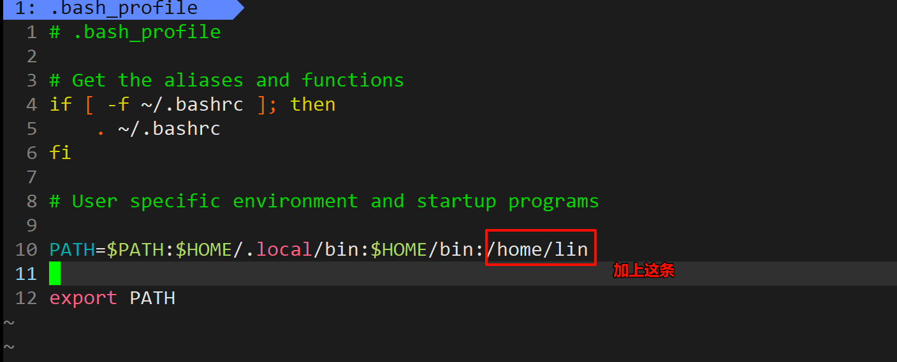

程序可以不用通过加`./`来执行


