# Linux进程间通信
# 前言
1. 进程为什么要通信？
+ 进程也是需要某种协同的，所以如何协同的前提条件就是**通信。**
+ 数据是由类别的，通知就绪的，有一些就是单纯的要传递给我数据，控制相关的信息。

> 事实：进程是具有独立性的。**进程 = 内核数据结构 + 代码和数据。**
>

2. 进程如何通信？
+ 进程间通信的本质，必须让不同的进程看到同一份“**资源**”。
+ “**资源**”就是特定形式的内存空间。
+ 这个资源是由**操作系统**来提供的，那么为什么不是我们两个进程中的一个？假设一个进程提供，这个资源属于谁，这个进程独有，破坏进程独立性，第三方空间。
+ 我们进程访问这个空间，进行通信，本质就是访问操作系统！
    - 进程代表的就是用户，“资源”从创建，使用（一般），释放资源我们需要使用**系统调用接口。**
    - 从底层设计，从接口设计，都要由操作系统独立设计，一般操作系统会有一个独立的通信模块，属于文件系统 **（IPC通信模块），标准（system V && posix）**
    - system V：**三种方式**：消息队列、**共享内存**、信号量

> 还有一种就是基于文件级别的通信方式---->**管道**
>

# 管道
+ 管道是`Unix`中最古老的进程间通信的形式。
+ 我们把从一个进程连接到另一个进程的一个数据流称为一个“管道”。

管道是一个基于文件系统的一个内存级的单向通信的文件，主要用来进行进程间通信(IPC)。

## 匿名管道
+ 一个文件被打开两次`struct_file`是要被创建两个的，**第二次**打开同一个文件的时候，**不需要再次加载文件**

在创建一个子进程的时候，不会再次加载文件，因为**进程要保持独立性，和文件没有关系。**

> 为什么父子进程会向同一个显示器终端打印数据？
>

因为子进程会继承父进程的文件描述符表，会指向同一个文件，进程会默认打开三个标准输入输出错误：0，1，2，怎么做到的？

其实我们所有的在命令行中都是**bash的子进程**，bash打开了，所有的子进程默认也就打开了，我们只要做好约定即可。

> 为什么我们主动`close(0/1/2)`，不影响父进程继续使用显示器文件呢？
>

+ 其实在struct_file里面包含了一个**引用计数**，是一个**内核级**的，这也就能解释了。

---

进程间通信的本质，必须让不同的进程看到同一份“**资源**”，这个资源是由操作系统来分配的，我们看到的同一份“**资源**”就是**内核级的文件缓冲区。**

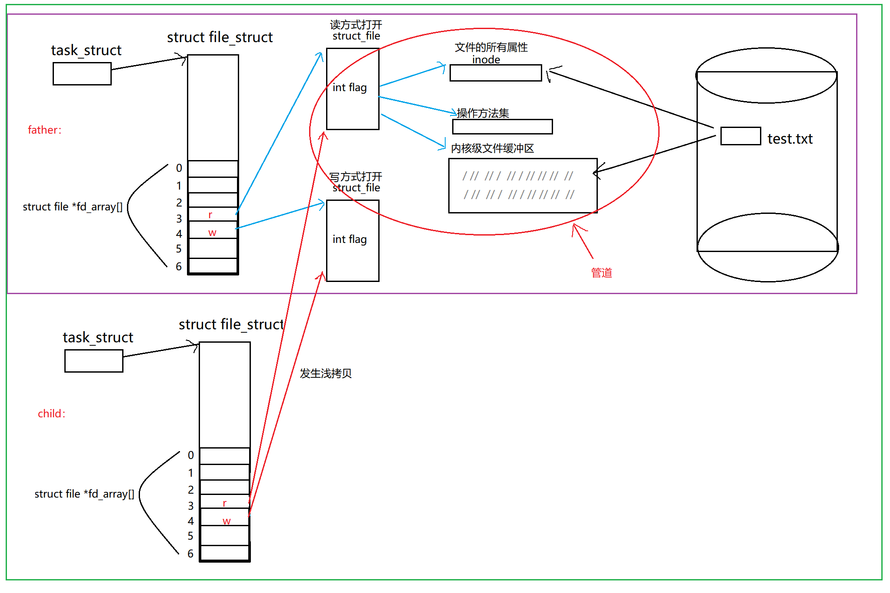

**管道只允许单向通信**，因为它**简单，那么如何通信呢？**

+ 子进程想写就关闭读的文件描述符（3），父进程就关闭写的文件描述符（4），此时，父进程就可以通过**3**号描述符进行**读**，子进程就可以通过**4**号文件描述符进行**写**，双方就可以写入同一个管道文件了。

> 父子既然要关闭不需要的fd，为什么曾经要打开呢？可以不关吗？
>

+ 如果只打开一个文件描述符的话，未来子进程继承的时候也就会继承一个，那么以读方式打开，继承只能继承读，一个管道不能同时存在读写，我们也不能以读写的方式打开，因为管道是**单向通信**的，万一失误了呢？这个方式很不好。
+ **所以总的来说就是为了让子进程继承下去**！
+ **可以不关吗**？可以！但是建议关了，万一读误写了呢？

> 还有就是为什么我们两个进程通信的时候，只是在内核级文件缓冲区，而不需要刷新到磁盘，所有虽然管道可以复用，但是还是要重新设计一下。
>

**其中fd[0]-->读，fd[1]-->写。**

因为这个管道是内存文件，没有文件名字，所以叫做匿名管道。

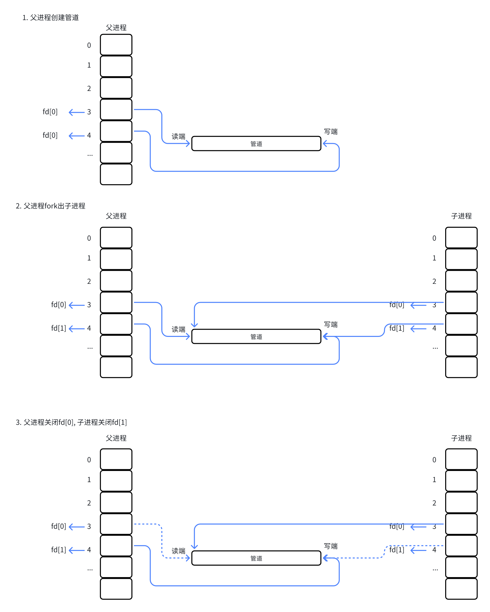

## pipe
接下来我们可以使用pipe来打开管道

```cpp
int pipe(int pipefd[2]);
```

+ `pipefd`是一个**输出形参数**
+ 不需要文件路径和文件名（**匿名文件/匿名管道**）

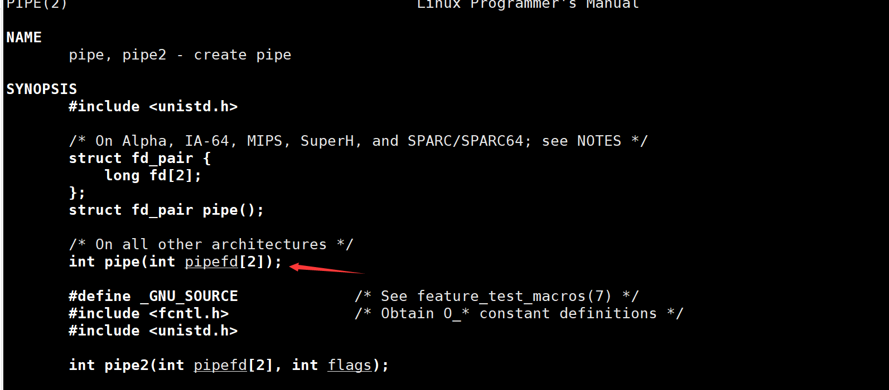

+ 成功返回`0`，失败返回`-1`，错误码被设置。

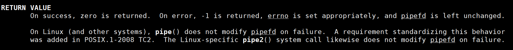

> 如果我想要双向通信呢？
>

那就使用两个管道

> 为什么单向通信？
>

+ 因为简单，只让它进行单向通信，符合这样的特点所以就叫管道。

## 测试管道接口 --> 代码验证
```cpp
#include <iostream>
#include <unistd.h>
#include <cerrno>
#include <cstring>
#include <string>
#include <sys/wait.h>
#include <sys/types.h>

const int size = 1024;

std::string getOtherMessage()
{
    // 计数
    static int cnt = 0;
    std::string massageid = std::to_string(cnt);
    cnt++;

    // 获取pid
    pid_t self_id = getpid();
    std::string id = std::to_string(self_id);

    std::string massage = "massage:";
    massage += massageid;
    massage += " my pid is: ";
    massage += id;
    return massage;
}

void SubProcessWrite(int wfd)
{
    int pipesize = 0;
    std::string massage = "father, I am your son prcess!";
    char c = 'A';
    while (true)
    {
        std::cerr << "++++++++++++++++++++++++++++++++++++++++++" << std::endl;
        std::string info = massage + getOtherMessage(); // 子进程写给父进程的消息
        write(wfd, info.c_str(), info.size());
        std::cerr << info << std::endl;

        // 测试管道可以写多少
        // write(wfd, &c, 1);
        // std::cout << "pipesize: " << ++pipesize << std::endl;
        // c++;
        // if(c == 'G') break;
        sleep(1);
    }
    std::cout << "child quit..." << std::endl;
}

void FatherProcessRead(int rfd)
{
    char inbuffer[size];
    while (true)
    {
        sleep(2);
        std::cout << "-------------------------------------------" << std::endl;
        ssize_t n = read(rfd, inbuffer, sizeof(inbuffer) - 1); // 注意是sizeof
        if (n > 0)
        {
            inbuffer[n] = 0;
            std::cout << "father get massage: " << inbuffer << std::endl;
        }
        else if (n == 0)
        {
            // read返回值为0表示写端关闭了，读到了文件的结尾
            std::cout << "client quit, father get return val: " << n << "father quit tool!" << std::endl;
            break;
        }
        else if (n < 0)
        {
            std::cerr << " read error" << std::endl;
            break;
        }
    }
}

int main()
{
    // 1.创建管道
    int pipefd[2]; // pipefd里的0号下标保存的是读，1号下标保存的是写
    int n = pipe(pipefd);
    if (n != 0)
    {
        std::cerr << "errno:" << errno << ":"
                  << "errstring:" << strerror(errno) << std::endl;
        return 1;
    }

    std::cout << "pipefd[0]: " << pipefd[0] << " pipefd[1]: " << pipefd[1] << std::endl;

    // 2.fork创建出父子进程
    pid_t id = fork();
    if (id == 0)
    {
        std::cout << "子进程关闭不需要的fd了，准备发消息了" << std::endl;
        sleep(1);

        // 子进程 --- write
        // 3.关闭不需要的文件描速符
        close(pipefd[0]);

        SubProcessWrite(pipefd[1]);

        // 不用了就关闭
        close(pipefd[1]);
        exit(0);
    }
    std::cout << "父进程关闭不需要的fd了，准备收消息了" << std::endl;

    // 父进程 --- read
    sleep(1);
    // 3.关闭不需要的文件描述符，写端
    close(pipefd[1]);

    FatherProcessRead(pipefd[0]);

    // 不用了就关闭
    close(pipefd[0]);

    int status = 0;
    pid_t rid = waitpid(id, nullptr, 0);
    if (rid > 0)
    {
        std::cout << "wait child process done, exit sig: " << (status & 0x7f) << std::endl;
        std::cout << "wait child process done, exit code(ign): " << ((status >> 8) & 0xFF) << std::endl;
    }
    return 0;
}
```

### 管道的4种情况
1. 管道是空的，写端没有关闭，读进程就阻塞
2. 管道写满，读端不读，进程就阻塞
3. 读端一直读，写端关闭，读返回0，表示读完
4. 读端直接关闭，写端一直在写，写端进程会被操作系统直接使用**13信号**关掉，**相当于进程出现了异常。**

### 管道的5种特征
1. 匿名管道，只是用来进行具有血缘关系的进程之间进行通信，具有明显的**顺序性**。
2. 管道内部，自带进程之间的**同步机制**（同步机制就是多执行流执行代码的时候，具有明显顺序性）。
3. **管道文件的生命周期是随进程的。**
4. 管道文件在通信的时候，是面向**字节流**的，write的次数和读取的次数不是一一匹配的。
5. 管道的通信模式，是一种特殊的**半双工**模式。

---

使用上面的代码验证：

> ubuntu20.04管道的大小是4096Byte（4kb）  
我们平时在命令行中使用的`|`就是匿名管道
>

单次向管道里面写入，写如的字节数小于`PIPE_BUF`（这是一个宏），写入操作就是原子的，而原子可以这样理解：要么不做，要做就做完，没有第三状态！

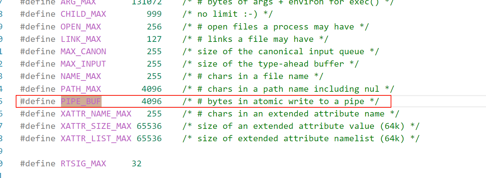

## 进程池案例
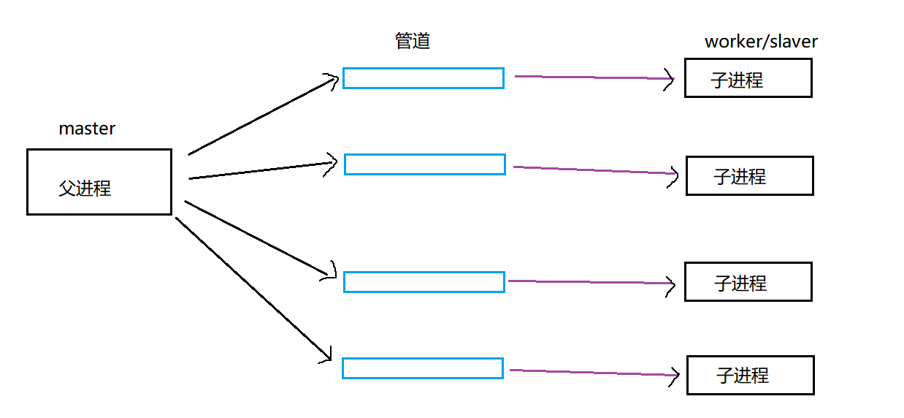

+ 管道里没有数据，worker进程就在阻塞等待，等待任务的到来。
+ master向哪一个管道进行写入，就是唤醒哪一个子进程来处理任务。
+ 父进程要进行后端任务划分的负载均衡。

### ProcessPool.hpp
```cpp
#ifndef __PROCESS_POOL_HPP__
#define __PROCESS_POOL_HPP__

#include <iostream>
#include <cstdlib>
#include <vector>
#include <functional>
#include <limits.h>
#include <assert.h>

#include <unistd.h>
#include <sys/types.h>
#include <sys/wait.h>


#include "Task.hpp"

enum CTRLSUBPROCESS
{
    Polling, // 轮询
    Random   // 随机
};

// 定义回调函数
using callback_t = std::function<void(int fd)>;

// 信道
class Channel
{
public:
    Channel() = default;
    ~Channel() = default;
    Channel(int fd, pid_t id, std::string &name)
        : _wfd(fd), _sub_id(id), _name(name)
    {
    }

    int Fd() { return _wfd; }
    pid_t Id() { return _sub_id; }
    std::string Name() { return _name; }
    void Close() { close(_wfd); }
    void Wait()
    {
        pid_t rid = waitpid(_sub_id, nullptr, 0);
        if (rid < 0)
            std::cerr << "rid fial!" << std::endl;
    }

private:
    int _wfd;
    pid_t _sub_id;
    std::string _name;
};

class ProcessPool
{
public:
    ProcessPool(int sub_num)
        : _sub_num(sub_num)
    {
        srand(time(0) ^ getpid() ^ 17777);
    }
    ~ProcessPool()
    {
        // 等待子进程
        WaitSubProcesses();
    }

    // 初始化进程池
    bool InitProcessPool(callback_t cb)
    {
        for (int i = 0; i < _sub_num; i++)
        {
            sleep(1);
            // 创建管道
            int pipefd[2] = {0};
            int n = pipe(pipefd);
            if (n < 0)
                return false;

            // 创建子进程
            pid_t id = fork();
            if (id < 0)
                return false;
            if (id == 0)
            {
                // 子进程除了要关闭自己的写端，同时也要关闭自己从父进程继承下来的w端
                // _channels本身是被子进程继承下去的.
                // 1. 子进程不要担心，父进程会影响自己的_channels.
                // 2. fork之后，当前进程，只会看到所有的历史进程的wfd,并不受后续父进程emplace_backd的影响
                std::cout << "进程:" << getpid() << ", 关闭了: ";
                if(!_channels.empty())
                {
                    for(auto &e : _channels)
                    {
                        std::cout << e.Fd() << " ";
                        e.Close();
                    }
                    std::cout <<"\n";
                }

                ///////////////////// child----read
                // 关闭写
                close(pipefd[1]);

                // 子进程开始干活
                cb(pipefd[0]);

                exit(0); // 子进程退出
            }

            ///////////////////// parent----write
            // 关闭读
            close(pipefd[0]);

            std::string name = "channel:" + std::to_string(i);
            // 创建完后push进vector进行管理
            // _channels.push_back({pipefd[1], id, name});
            _channels.emplace_back(pipefd[1], id, name);
        }
        return true;
    }

    // 控制子进程
    void CtrlSubProcess(enum CTRLSUBPROCESS ctrl_sub_process_mode, int count = INT_MAX)
    {
        if (count < 0)
            return;

        // 轮询方式
        if (Polling == ctrl_sub_process_mode)
        {
            int index = 0;
            // 轮询选择一个信道
            while (count--)
            {
                index %= _channels.size(); // 防止越界
                CtrlSubProcessHelper(index);
                index++;
            }
        }
        else if (Random == ctrl_sub_process_mode) // 随机方式
        {
            while (count--)
                CtrlSubProcessHelper((rand() ^ getpid() ^ 17777) % _channels.size());
        }
        else
        {
            assert(false);
        }
    }

private:
    // 随机选择一个信道，然后让子进程执行任务
    void CtrlSubProcessHelper(int index)
    {
        // 随机选择一个任务
        int x = rand() % tasks.size();
        // 让子进程执行任务
        std::cout << "选择信道: " << _channels[index].Name() << ", sub_id : " << _channels[index].Id() << std::endl;

        // 进行唤醒子进程，给管道写入子进程要执行的tasks的下标-->一个整数，然后让子进程读取到下标后，执行任务！
        write(_channels[index].Fd(), &x, sizeof(x));
        sleep(1); // 一秒执行一个任务
    }

    // 需要注意！！！
    void WaitSubProcesses()
    {
        // 方法三：就顺序关闭，但是需要在创建子进程的时候关闭多余的写端
        for(auto& c: _channels)
        {
            c.Close();
            c.Wait();
        }

        // 方法二：倒着关闭
        // for (int i = _channels.size() - 1; i >= 0; i--)
        // {
        //     _channels[i].Close();
        //     _channels[i].Wait();
        // }

        // 方法一：先全部关闭管道写，然后进行等待子进程
        // for(auto& c : _channels)
        // {
        //     c.Close();
        // }
        // for(auto& c : _channels)
        // {
        //     c.Wait();
        // }
    }

private:
    std::vector<Channel> _channels; // 所有的信道
    int _sub_num;                   // 子进程的数量
};

#endif
```

### Task.hpp
```cpp
#ifndef __TASK_HPP__
#define __TASK_HPP__

#include <iostream>
#include <functional>
#include <vector>

using task_t = std::function<void()>;

void Print()
{
    std::cout << "I am print task" << std::endl;
}

void DownLoad()
{
    std::cout << "I am DownLoad task" << std::endl;
}

void Flush()
{
    std::cout << "I am Flush task" << std::endl;
}

void Log()
{
    std::cout << "I am Log task" << std::endl;
}

// 保存任务
std::vector<task_t> tasks;

class TaskInit
{
public:
    TaskInit()
    {
        tasks.push_back(Print);
        tasks.push_back(DownLoad);
        tasks.push_back(Flush);
        tasks.push_back(Log);
    }
};

// 任务初始化
TaskInit tasks_init;

#endif
```

### main.cc
```cpp
#include "ProcessPool.hpp"


void sub_execute_task(int fd)
{
    while (true)
    {
        // 子进程执行任务
        int index = 0; // 执行任务的下标
        ssize_t n = read(fd, &index, sizeof(index)); // 从管道中读父进程给我要执行任务的下标
        if (n == sizeof(index)) // 如果读取成功了
        {
            std::cout << "子进程被唤醒: " << getpid() << std::endl;
            if (index >= 0 && index < tasks.size()) // 需要保持在tasks的范围内
                tasks[index](); // 执行任务
            else
                std::cerr << "父进程给我的任务码是不对的: " << index << std::endl;
        }
        else if (n == 0)
        {
            // 子进程读到0后就会自动退出
            std::cout << "子进程应该退出了: " << getpid() << std::endl;
            break;
        }
        else
        {
            std::cerr << "read fd: " << fd << ", error" << std::endl;
            break;
        }
    }
}

int main()
{
    // 创建子进程，5个子进程
    ProcessPool pp(5);

    // 初始化进程池
    pp.InitProcessPool([](int fd){ sub_execute_task(fd); });

    // 父进程控制子进程    第一个参数是控制方式，第二个参数是让子进程执行多少次
    // pp.CtrlSubProcess(Polling); // 轮询方式控制
    pp.CtrlSubProcess(Random, 10); // 随机方式控制

    std::cout << "父进程控制子进程完成，父进程结束" << std::endl;
    return 0;
}
```

---

注意：

如果直接这样写的话，运行程序会被阻塞住

```cpp
for(auto& c: _channels)
{
    c.Close();
    c.Wait();
}
```

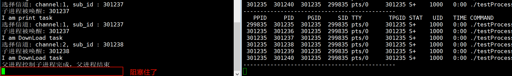

原理如图：

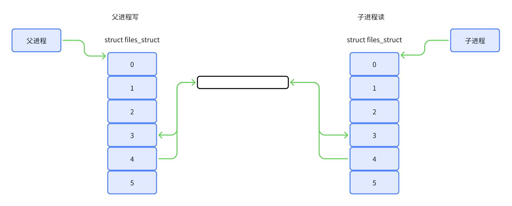

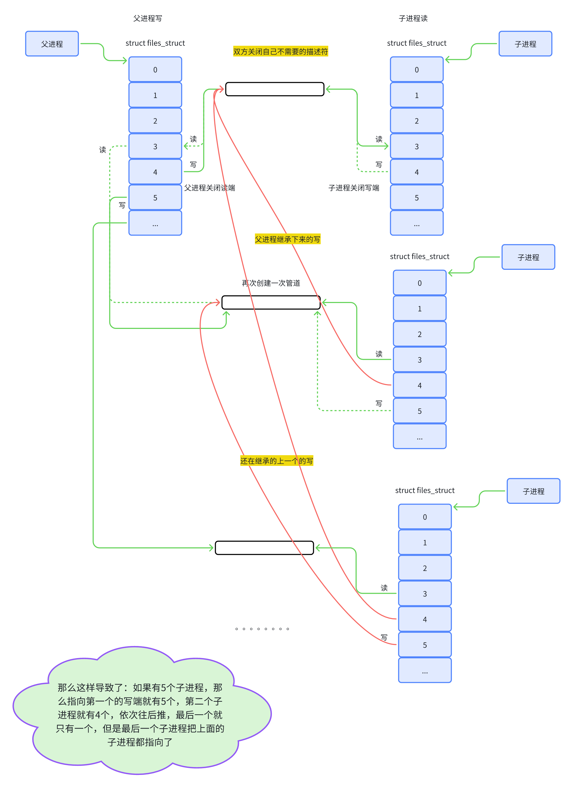

在`WaitSubProcesses`等待子进程的时候，需要注意：

方法一：先全部关闭管道写，然后进行等待子进程

```cpp
for(auto& c : _channels)
{
    c.Close();
}
for(auto& c : _channels)
{
    c.Wait();
}
```

方法二：倒着关闭

```cpp
for (int i = _channels.size() - 1; i >= 0; i--)
{
    _channels[i].Close();
    _channels[i].Wait();
}
```

方法三：就顺序关闭，但是需要在创建子进程的时候关闭多余的写端

```cpp
for(auto& c: _channels)
{
    c.Close();
    c.Wait();
}
```

子进程除了要关闭自己的写端，同时也要关闭自己从父进程继承下来的w端

_channels本身是被子进程继承下去的。

1. 子进程不要担心，父进程会影响自己的`_channels`。
2. fork之后，当前进程，只会看到所有的历史进程的wfd，并不受后续父进程emplace_back的影响。

```cpp
std::cout << "进程:" << getpid() << ", 关闭了: ";
if(!_channels.empty())
{
    for(auto &e : _channels)
    {
        std::cout << "进程:" << getpid() << ", 关闭了: ";
        e.Close();
    }
    std::cout <<"\n";
}
```

### 检测脚本
```bash
while :; do ps -axj | head -1 && ps -axj | grep testProcessPool | grep -v grep; echo "---------------------------------------------"; sleep 1; done;
```

### makefile
```bash
testProcessPool:main.cc
	g++ -o $@ $^ -std=c++11
.PHONY:clean
clean:
	rm -rf testProcessPool
```

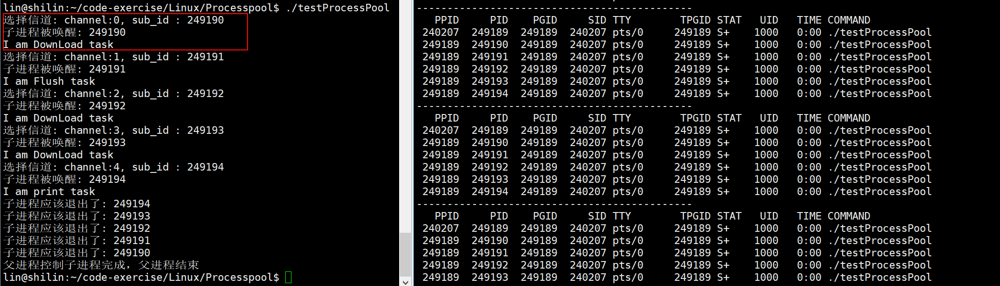

## 命名管道
1. 管道的生命周期随进程，本质是内核中的缓冲区，命名管道文件只是标识，用于让多个进程找到同一块缓冲区，删除后，之前已经打开管道的进程依然可以通信。
2. **匿名管道只能用于具有亲缘关系的进程间通信，命名管道可用于同一主机上的任意进程间通信**管道的通信本质是通过内核中一块缓冲区（内存）时间数据传输，而命名管道的管道文件只是一个标识符，用于让多个进程能够访问同一块缓冲区。

命名管道可以从命令行上创建，命令行方法是使用下面这个命令：

```bash
mkfifo filename
```

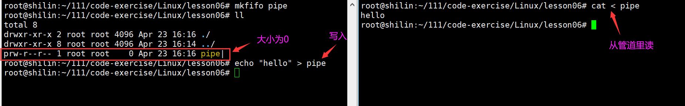

> **文件名+路径**就可以看到同一份资源
>

## 代码演示
### NamedPipe.hpp
```cpp
#ifndef __NAMED_PIPE_HPP__
#define __NAMED_PIPE_HPP__

#include <iostream>
#include <string>
#include <cstdio>

#include <unistd.h>
#include <sys/types.h>
#include <sys/stat.h>
#include <fcntl.h>

const std::string filename = "fifo";
mode_t mode = 0666;
#define SIZE 128
#define DefaultFd -1

#define Creater 1
#define USER 2

class NamedPipe
{
public:
    NamedPipe(const std::string &name, int who)
        : _name(name), _fd(DefaultFd), _who(who)
    {
        // 如果是server端就创建
        if (_who == Creater)
        {
            int n = mkfifo(filename.c_str(), mode);
            if (n < 0)
                perror("mkfifo");
            std::cout << "mkfifo success" << std::endl;
        }
    }

    bool OpenForRead()
    {
        return OpenNamedPipe(O_RDONLY);
    }

    bool OpenForWrite()
    {
        return OpenNamedPipe(O_WRONLY);
    }

    // const &: const std::string &XXX 输入
    // *      : std::string *  输出
    // &      : std::string &  输入输出
    bool Read(std::string *out)
    {
        char buffer[SIZE] = {0};
        ssize_t n = read(_fd, buffer, sizeof(buffer) - 1);
        if (n > 0)
        {
            buffer[n] = 0;
            *out = buffer;
        }
        else if (n == 0)
            return false;
        else
            return false;
        return true;
    }

    void Write(const std::string &in)
    {
        write(_fd, in.c_str(), in.size());
    }

    ~NamedPipe()
    {
        // 由server端来管理
        if (_who == Creater)
        {
            if (_fd != DefaultFd)
                close(_fd);

            int m = unlink(filename.c_str());
            if (m < 0)
                std::cerr << "unlink fail!" << std::endl;
            std::cout << "creater free named pipe" << std::endl;
        }
    }

private:
    bool OpenNamedPipe(mode_t mode)
    {
        _fd = open(filename.c_str(), mode);
        if (_fd < 0)
        {
            perror("open");
            return false;
        }
        std::cout << "open file success" << std::endl;
        return true;
    }

private:
    std::string _name; // 文件名字
    int _fd;           // 文件fd
    int _who;          // 标识是谁
};

#endif
```

### server.cc
```cpp
#include "NamedPipe.hpp"

int main()
{
    // server端创建管道
    NamedPipe named_pipe(filename, Creater);
    bool ret = named_pipe.OpenForRead(); // 打开管道文件，进行读
    if (!ret)
        exit(2);

    // 读
    std::string message;
    while (true)
    {
        bool ret = named_pipe.Read(&message);
        if (!ret)
            break;
        std::cout << "client say@" << message << "\n";
    }

    return 0;
}
```

### client.cc
```cpp
#include "NamedPipe.hpp"

int main()
{
    // client端只进行写
    NamedPipe named_pipe(filename, USER);
    bool ret = named_pipe.OpenForWrite(); // 打开管道文件，进行写
    if (!ret)
        exit(2);

    // 写
    while (true)
    {
        std::cout << "Please Enter# ";
        std::string line;
        std::getline(std::cin, line);
        named_pipe.Write(line);
    }

    return 0;
}
```

### makefile
```bash
.PHONY:all
all:server client

server:server.cc
	g++ -o $@ $^ -std=c++11

client:client.cc
	g++ -o $@ $^ -std=c++11

.PHONY:clean
clean:
	rm -f client
	rm -f server
```

+ 首先启动程序，对于读端而言，如果我们打开文件，但是写还没来，我会阻塞在open调用中，直到对方打开。
+ 关闭写端，读端会读到0，程序会结束。

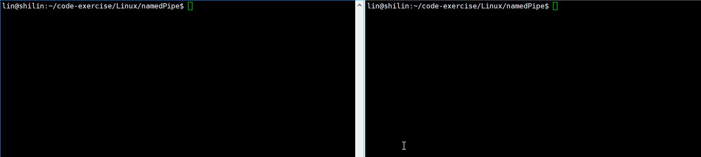

+ 这次我们先关闭读端，这个时候写端不会立即结束程序，当我们再次输入的时候程序才会退出

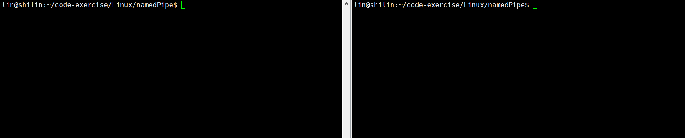

# 共享内存
## 共享内存原理
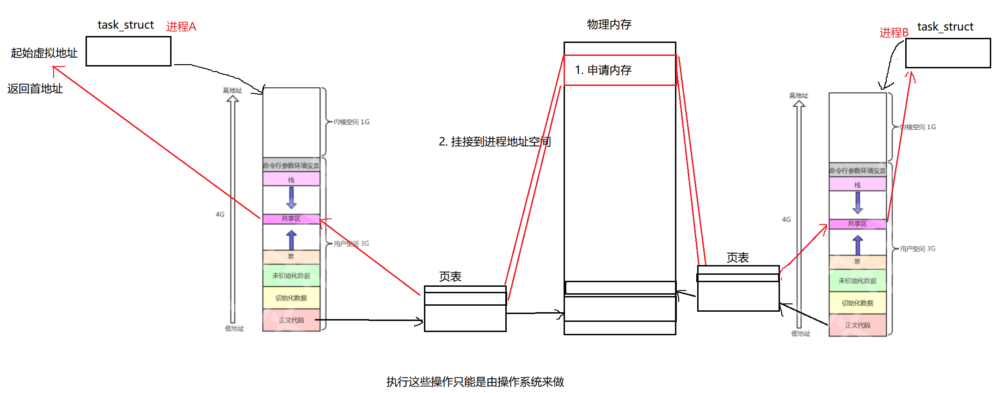

1. 上面操作都是OS做的
2. OS提供上面的`1，2`步骤的**系统调用**，供用户进程A，B进行调用 （系统调用）。
3. AB，CD，EF，XY----->共享内存在系统中存在多份，供不同个数，不同对进程同时通信。
4. OS注定了要对共享内存进行管理（**先描述，再组织**），共享内存不是简单的一段内存空间，也要有描述并管理共享内存的数据结构和匹配的算法。
5. 共享内存 = **内存空间（数据） + 共享内存的属性。**
6. **共享内存生命周期随内核**，**只要不删除，就一直存在于内核中**，**除非重启系统**（当然这里指的是非手动操作，可以手动删除）。
7. 共享内存的**本质就是开辟一块物理内存，让多个进程映射同一块物理内存到自己的地址空间进行访问**，实现数据共享的。
8. 共享内存的操作是**非进程安全**的，多个进程同时对共享内存读写是有可能会造成数据的交叉写入或读取，造成数据混乱。
9. 共享内存的删除操作并非直接删除，而是**拒绝后续映射**，只有在当前映射链接数为0时，表示没有进程访问了，才会真正被删除。

共享内存数据结构：

```c
/* Obsolete, used only for backwards compatibility and libc5 compiles */
struct shmid_ds {
	struct ipc_perm		shm_perm;	/* operation perms */
	int			shm_segsz;	/* size of segment (bytes) */
	__kernel_time_t		shm_atime;	/* last attach time */
	__kernel_time_t		shm_dtime;	/* last detach time */
	__kernel_time_t		shm_ctime;	/* last change time */
	__kernel_ipc_pid_t	shm_cpid;	/* pid of creator */
	__kernel_ipc_pid_t	shm_lpid;	/* pid of last operator */
	unsigned short		shm_nattch;	/* no. of current attaches */
	unsigned short 		shm_unused;	/* compatibility */
	void 			*shm_unused2;	/* ditto - used by DIPC */
	void			*shm_unused3;	/* unused */
};
```

## 补充指令集（IPC的指令）
### shmget
创建共享内存

```cpp
int shmget(key_t key, size_t size, int shmflg);
```

+ 第一个参数是key（后面介绍）
+ 第二个参数创建共享内存的大小（单位是字节）
    - 建议是4096的整数倍
+ 第三个参数就是位图（下面介绍）

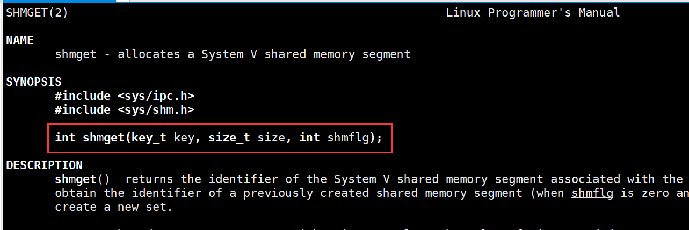

+ 成功返回**共享内存的标识符**，失败返回`-1`，错误码被设置。


+ **IPC_CREAT**：如果申请的共享内存不存在就创建，存在就获取共享内存并返回
+ **IPC_EXCL**：单独使用没有意义，只有和**IPC_CREAT**组合才有意义
+ **IPC_CREAT | IPC_EXCL**：如果要创建的共享内存不存在就创建，如果存在就出错返回，如果返回成功就**意味着这个shm是全新的**

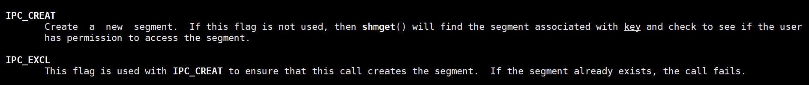

源码：

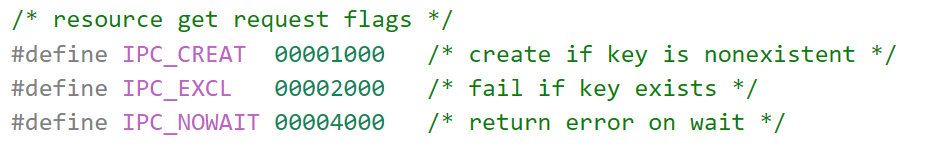

---

+ 那么如何保证让不同的进程看到同一个共享内存？
+ 怎么保证这个共享内存是存在还是不存在呢？

> 就是通过 **第一个参数**`key`
>

#### 谈谈key
1. key是一个数字，这个数字是几，不重要。关键在于必须在内核中具有**唯一性**，能够让不同的进程进行唯一标识。
2. 第一个进程key通过key创建共享内存，第二个之后的进程， 只要拿着同一个`key`，就可以和第一个进程看到同一个共享内存了。
3. 对于一个已经创建好的共享内存，key在哪？ ----> **key在共享内存的描述对象中。**
4. 第一次创建的时候，必须有一个key，怎么有？（一会谈）
5. key 类似之前的路径，都是**唯一的。**

### ftok
+ 形成key就使用下面的接口

```cpp
key_t ftok(const char *pathname, int proj_id);
```

+ 第一个参数是路径名字符串
+ 第二个参数是项目id

这两个参数**由用户自由指定**
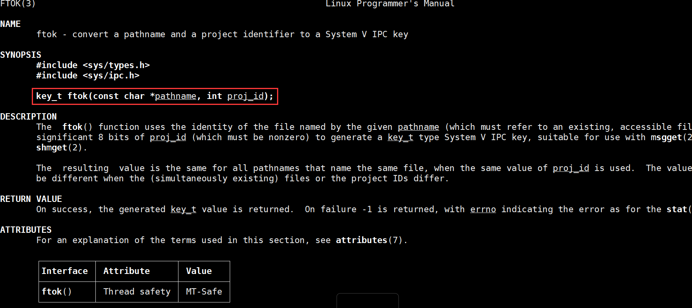

> 那么这个key值能不能由操作系统自动生成，为什么要用户去设置，主要原因是因为操作系统形成了一个key，另一个进程要用这个key，但是我们不知道，所以是由用户约定的，必须由用户层下达到操作系统。
>

**key**：操作系统内标定的唯一性。
**shmid**：只在你的进程内，用来表示资源的唯一性。

### ipcs
+ 共享内存的生命周期是随内核的，用户不主动关闭，共享内存会一直存在，**除非内核重启或者用户关闭。**

**查看共享内存**：

```bash
ipcs -m
```

**关闭共享内存**：

+ 这里的shmid是要关闭的共享内存，而不是key，**在用户层只能使用shmid，内核层用的key**

```bash
ipcrm -m shmid
```

+ 共享内存的大小一般建议是4096的整数倍，如果设置了不是整数倍，在内核层面上会进行4k对齐。

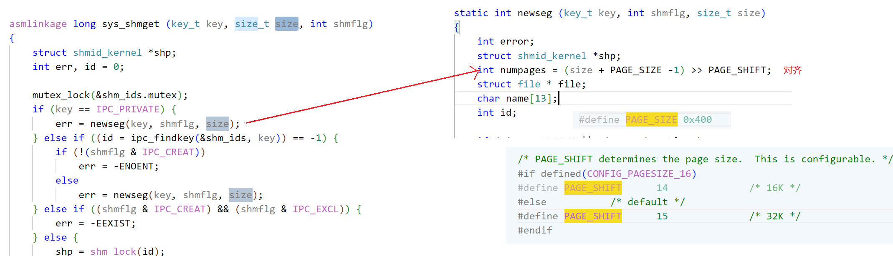

### shmat
+ 将共享内存挂接到程序地址空间当中

```c
void *shmat(int shmid, const void *shmaddr, int shmflg);
```

+ 第一个参数是shmid
+ 第二个参数是要挂接到哪个地址上，一般是nullptr
+ 第三个参数是挂接内存的访问权限，默认我们设置为0

**返回值**：失败返回nullptr，成功**返回共享内存的起始地址**
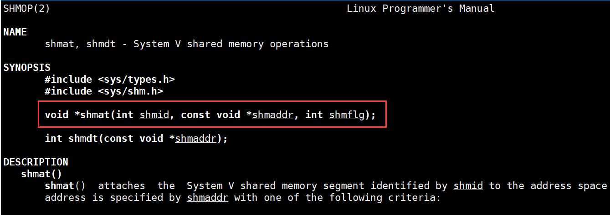

### shmdt
+ 从进程的地址空间中分离一个共享内存段

```c
int shmdt(const void *shmaddr);
```

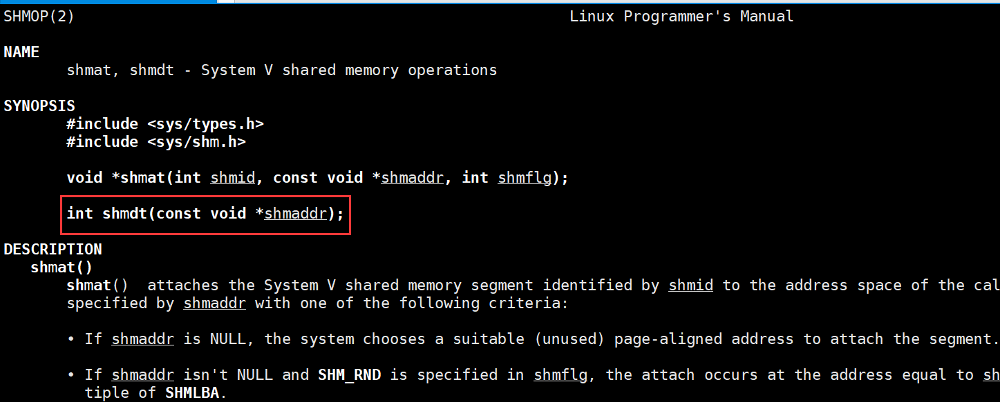

### shmctl
+ 删除共享内存&&获取共享内存的属性....

```c
int shmctl(int shmid, int cmd, struct shmid_ds *buf);
```

参数说明：

shmid：共享内存段的标识符，通常由 shmget 函数返回。

cmd：要执行的操作的命令，可以是以下值之一：

+ `IPC_STAT`：获取共享内存段的状态，并将结果写入`buf`所指向的`shmid_ds`结构。
+ `IPC_SET`：设置共享内存段的`shmid_ds`结构中的`shm_perm`字段，通常用于更改权限。
+ `IPC_RMID`：立即删除共享内存段。注意，只有当共享内存段的引用计数（即附加到它的进程数）为0时，该命令才会成功。
+ `buf`：一个指向`shmid_ds`结构的指针，该结构用于传递或接收关于共享内存段的信息。
+ 对于`IPC_STAT`命令，该结构用于接收信息；对于`IPC_SET`命令，该结构包含要设置的权限信息。

返回值：

+ 如果成功，返回0。
+ 如果失败，返回-1，并设置`errno`以指示错误原因。

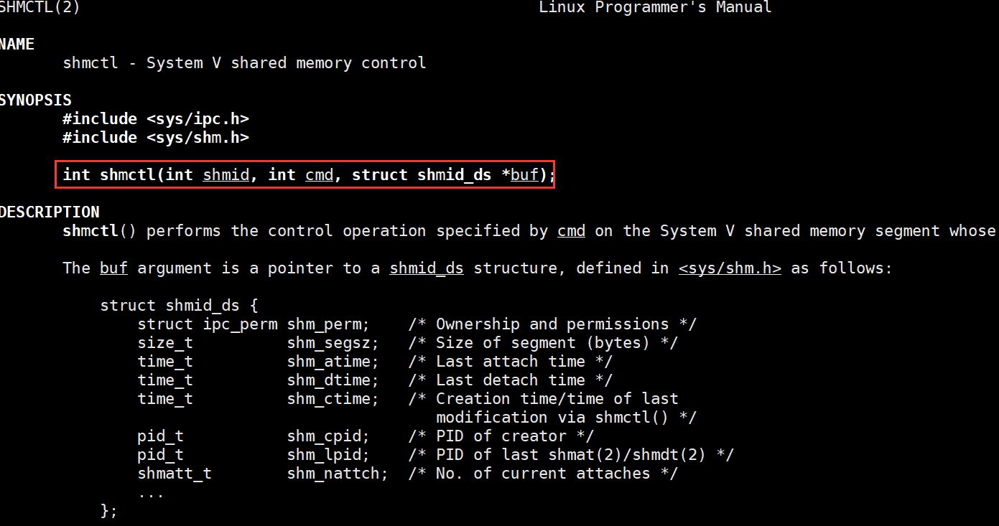

+ 共享内存不提供对共享内存的任何保护机制，这会导致数据不一致
+ 共享内存是所有进程IPC，速度最快的，因为共享内存大大减少了数据的拷贝次数！

## 代码验证（使用共享内存的相关接口）
### Shm.hpp
```cpp
#ifndef __SHM_HPP__
#define __SHM_HPP__

#include <iostream>
#include <cstdio>

#include <unistd.h>
#include <sys/types.h>
#include <sys/ipc.h>
#include <sys/shm.h>

#define Creater 0
#define User 1

#define gdefaultsize 4096 // 共享内存的大小

#define gpathname "."
#define gproj_id 0x77

class SharedMemory
{
private:
    bool CreateHelper(int flags)
    {
        _key = ftok(gpathname, gproj_id);
        if (_key < 0)
        {
            perror("ftok");
            return false;
        }

        printf("形成键值对%x\n", _key);

        // 创建全新的shm
        _shmid = shmget(_key, _size, flags);
        if (_shmid < 0)
        {
            perror("shmget");
            return false;
        }
        printf("shmid：%d\n", _shmid);
        return true;
    }

    void CreateAndGet()
    {
        // 服务端创建共享内存
        if (_who == Creater)
        {
            // 创建，设置权限
            if (!CreateHelper(IPC_CREAT | IPC_EXCL | 0666))
            {
                perror("创建失败");
                exit(2);
            }
        }

        // 用户端需要获取已经存在的共享内存
        if (_who == User)
        {
            // 获取
            if (!CreateHelper(IPC_CREAT))
            {
                perror("CreateHelper");
                exit(2);
            }
        }
    }

    void Attach()
    {
        // 挂接到自己的内存空间
        _start_addr = shmat(_shmid, nullptr, 0);
        if ((long long)_start_addr == -1)
        {
            perror("shmat");
            exit(3);
        }
        std::cout << "将指定的共享内存挂接到自己进程的地址空间" << std::endl;
        printf("_start_addr : %p\n", _start_addr);

        // 前四个字节保存共享内存的数据个数
        _num = (int *)_start_addr;

        // 设置数据范围
        _datastart = (char *)_start_addr + sizeof(int);
    }

    void Detach()
    {
        int n = shmdt(_start_addr);
        if (n < 0)
        {
            perror("shmdt");
            exit(1);
        }
        std::cout << "\n将指定的共享内存从进程的地址空间移除" << std::endl;
    }

    void Remove()
    {
        // 移除共享内存
        if (_who == Creater)
        {
            int n = shmctl(_shmid, IPC_RMID, nullptr);
            if (n < 0)
            {
                perror("shmctl");
                exit(1);
            }
            std::cout << "删除shm成功" << std::endl;
        }
    }

public:
    SharedMemory(int who = User, int size = gdefaultsize)
        : _who(who), _key(0), _size(size - sizeof(int)), _shmid(-1),
          _num(nullptr), _datastart(nullptr), _windex(0), _rindex(0)
    {
        // 创建、获取共享内存
        CreateAndGet();

        // 挂接
        Attach();
    }

    void PushChar(char ch)
    {
        if (*_num == _size - 1) // 预留一个位置用于处理边界情况
            return;

        ((char *)_datastart)[_windex++] = ch;
        ((char *)_datastart)[_windex] = '\0';

// #define DEBUG
#ifdef DEBUG
        printf("%s\n", _datastart);
#endif
        _windex = (_windex) % _size;
        (*_num)++;
    }

    void PopChar(char *ch)
    {
        if (*_num == 0)
            return;
        *ch = ((char *)_datastart)[_rindex++];
#ifdef DEBUG
        printf("%c", *ch);
        fflush(stdout);
#endif
        _rindex = (_rindex) % _size;
        (*_num)--;
    }

    ~SharedMemory()
    {
        // 分离
        Detach();

        // 移除
        Remove();
    }

private:
    // 管理共享内存
    int _who;
    key_t _key;
    int _size; // 共享内存的大小
    int _shmid;
    void *_start_addr; // 共享内存地址的开始

    // 管理数据
    int *_num;        // 共享内存数据的大小
    char *_datastart; // 实际数据范围
    int _windex;      // 写
    int _rindex;      // 读
};

#endif
```

### client.cc
```cpp
#include "shm.hpp"


int main()
{
    // 创建共享内存
    SharedMemory shm(User);

    // server--->write  通信
    for(char ch = 'A'; ch <= 'Z'; ch++)
    {
        shm.PushChar(ch);
        sleep(1);
    }

    return 0;
}
```

### server.cc
```cpp
#include "shm.hpp"


int main()
{
    // 创建共享内存
    SharedMemory shm(Creater);

    // server--->read  通信
    char c;
    while (true)
    {
        shm.PopChar(&c);
        putchar(c);
        fflush(stdout);
        if(c == 'Z')  break;
        sleep(1);
    }

    sleep(2);
    return 0;
}
```

### makefile
```makefile
all: server client

server:server.cc
	g++ -o $@ $^ -std=c++11

client:client.cc
	g++ -o $@ $^ -std=c++11

.PHONY:clean
clean:
	rm -rf server client
```

检测脚本

```shell
while :; do ipcs -m;sleep 1;done;
```

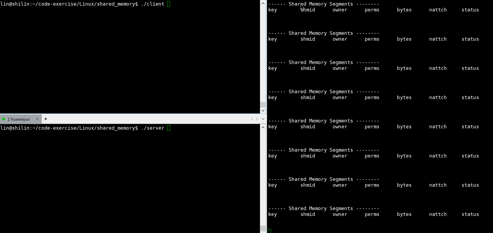

---

共享内存是有属性的

在server中添加一个接口：

```cpp
void PrintAttr()
{
    struct shmid_ds ds;
    int n = shmctl(_shmid, IPC_STAT, &ds);
    if(n < 0)
    {
        perror("shmctl");
        return;
    }

    // 打印输出shm相关属性
    printf("key: 0x%x\n", ds.shm_perm.__key);
    printf("size: %ld\n", ds.shm_segsz);
    printf("atime: %lu\n", ds.shm_atime);
    printf("nattach: %ld\n", ds.shm_nattch);
}
```

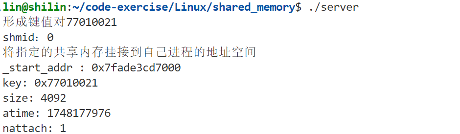

特征总结：

1. 生命周期随内核的
2. 共享内存是IPC中速度最快的，这是因为减少了数据拷贝的次数，并且不需要**系统调用**！

系统调用其实是有成本的，例如在c++之前学的stl，空间配置器，内存池，就可以减少系统调用

3. 共享内存，没有同步，互斥机制，来对多个进程的访问进行协同

# system V消息队列
+ 消息队列提供了一个从一个进程向另外一个进程发送一块数据的方法 
+ 每个数据块都被认为是有**一个类型**，**接收者进程接收的数据块可以有不同的类型值** 

特性方面：IPC资源必须删除，否则不会自动清除，除非重启，所以`system V IPC`资源的生命周期随内核

+ **消息队列是由操作系统来提供的**

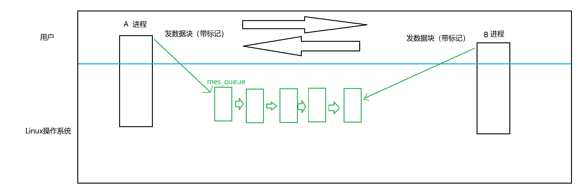

消息队列也要被操作系统进行管理，要管理就要：**先描述，再组织**！！！

消息队列接口：

获取：

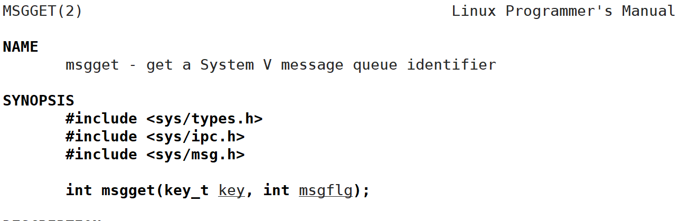

创建密钥

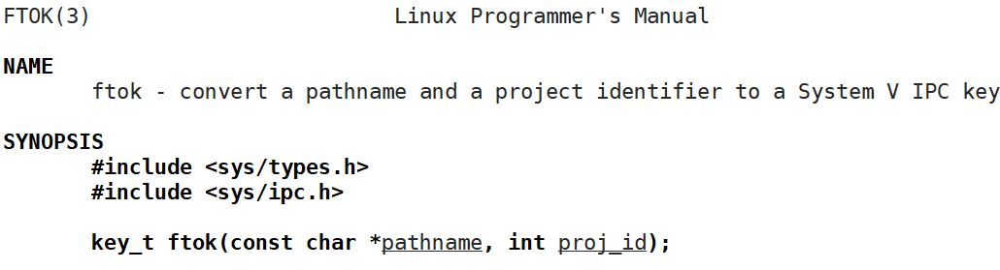

控制：

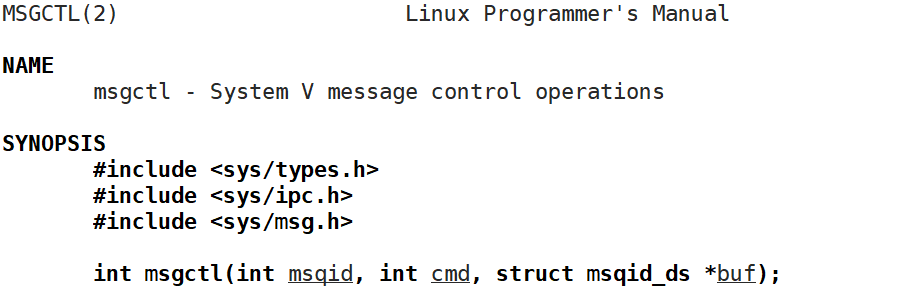

内核结构

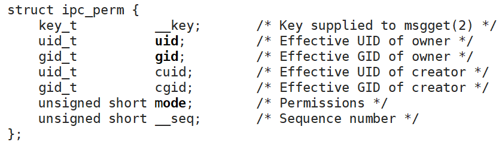

通过传入数据块

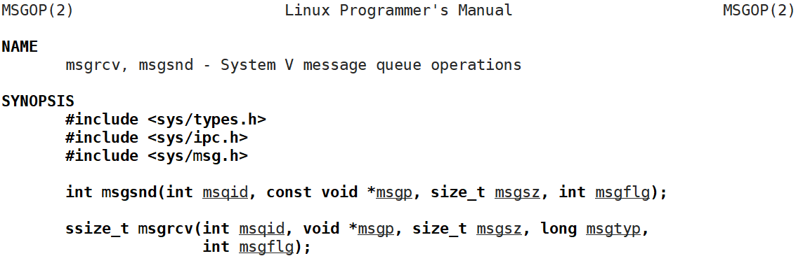

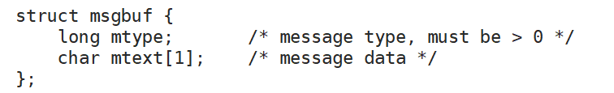

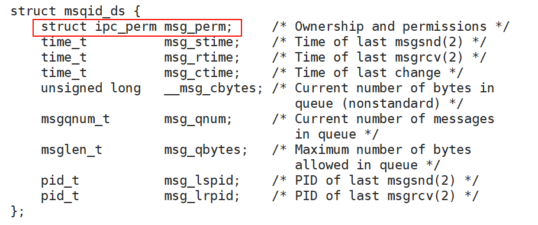

查看消息队列：


# 并发编程
多个执行流(进程), 能看到的同一份公共资源：共享资源

被保护起来的资源叫做临界资源

保护的方式常见：互斥与同步

任何时刻，只允许一个执行流访问资源，叫做互斥

多个执行流，访问临界资源的时候，具有一定的顺序性，叫做同步

系统中某些资源一次只允许一个进程使用，称这样的资源为临界资源或互斥资源。

在进程中涉及到互斥资源的程序段叫临界区。你写的代码=访问临界资源的代码(临界区)+不访问

临界资源的代码(非临界区)

所谓的对共享资源进行保护，本质是对访问共享资源的代码进行保护

# system V信号量
**5个概念：**

1. 多个执行流（进程），能看到的一份资源：**共享资源**
2. 被保护起来的资源 --->**临界资源**，**同步和互斥**，用互斥的方式保护共享资源，临界资源
3. 互斥：任何时刻只能有一个进程在访问公共资源
4. 资源：要被程序员访问，资源被访问也就是通过代码来访问（代码 = 访问共享资源的代码（临界区） + 不访问共享资源的代码（非临界区））
5. 所谓的对共享资源进行保护（临界资源）本质是对共享资源的代码进行保护

这里的信号量也就相当于是一个**计数器**

6. 申请计数器成功，**就表示具有访问资源的权限了**
7. 申请了计数器资源，我当前访问我要的资源了吗？**没有，申请了计数器资源是对资源的预定机制**
8. 计数器可以有效保证进入共享资源的执行流的数量
9. 所以每一个执行流，想访问共享资源中的一部分资源，**不是直接访问，而是先申请计数器**！

程序员把这个**计数器**，叫做**信号量。**

**操作方面：**

**申请资源，计数器--，P操作**

**释放资源，计数器++，V操作**

信号量也是IPC范畴！

接口：

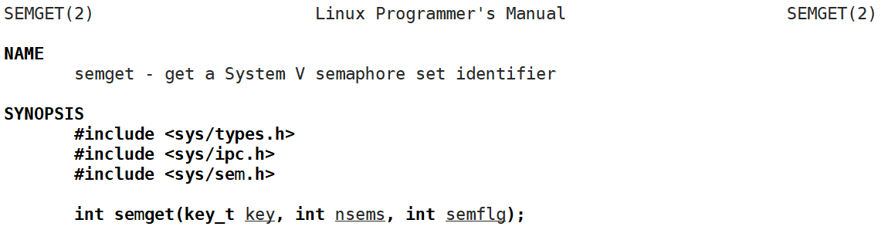

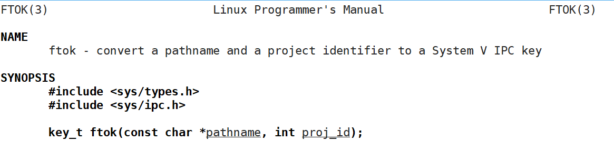

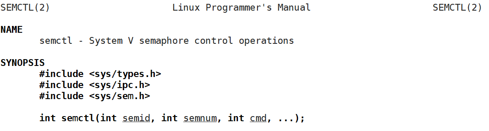

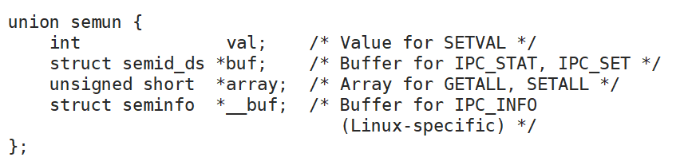

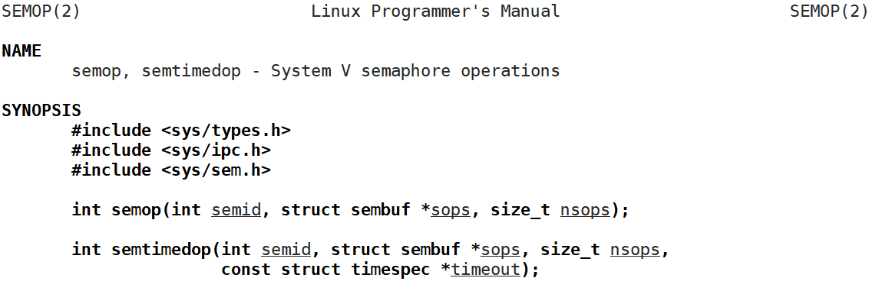

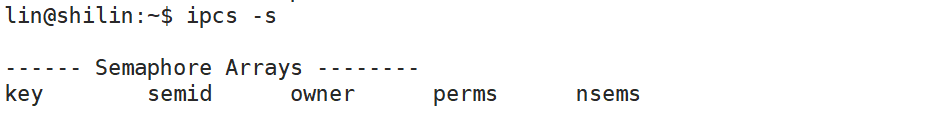


由于是属于IPC的，所以也可以使用`ipcs`来查看：

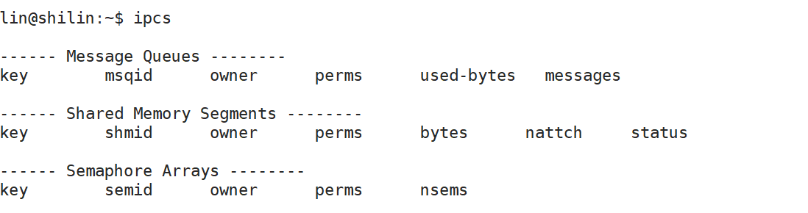

所有的systemV资源，声明周期，全部都随内核。

所有的systemV资源，都要被OS管理起来。

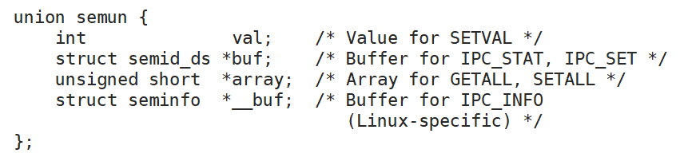

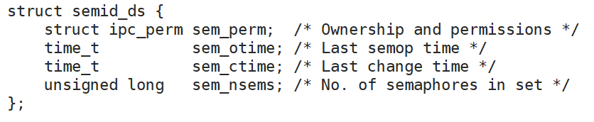

# 进程互斥
+ 由于各进程要求共享资源，而且有些资源需要互斥使用，因此各进程间竞争使用这些资源，进程的这种关系为进程的互斥
+ 系统中某些资源一次只允许一个进程使用，称这样的资源为临界资源或互斥资源。
+ 在进程中涉及到互斥资源的程序段叫临界区

特性方面：

+ IPC资源必须删除，否则不会自动清除，除非重启，所以system V IPC资源的生命周期随内核

# 内核是如何组织管理IPC资源的
C语言实现**多态**来进行管理

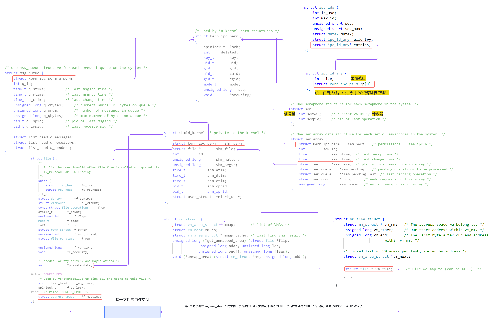

内核中管理IPC资源，用的是数组管理！

之前学的**shmid**也就是这个数组的下标！

# mmap文件映射
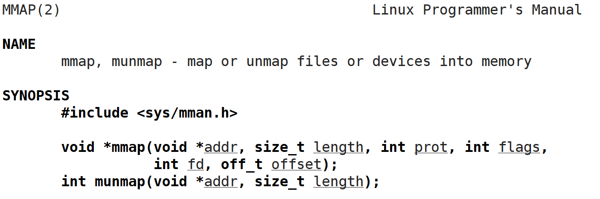

+ 允许用户空间程序将文件或设备的内容直接映射到进程的虚拟地址空间中。通过mmap ，程序可以高效地访问文件数据，而无需通过传统的`read`或`write`系统调用进行数据的复制。
+ mmap 还可以用于实现共享内存，允许不同进程间共享数据。

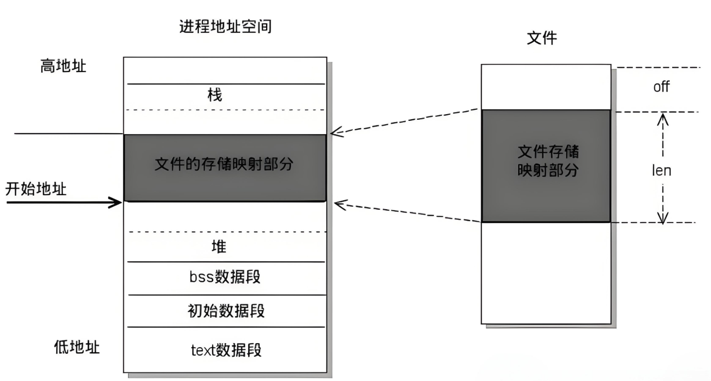

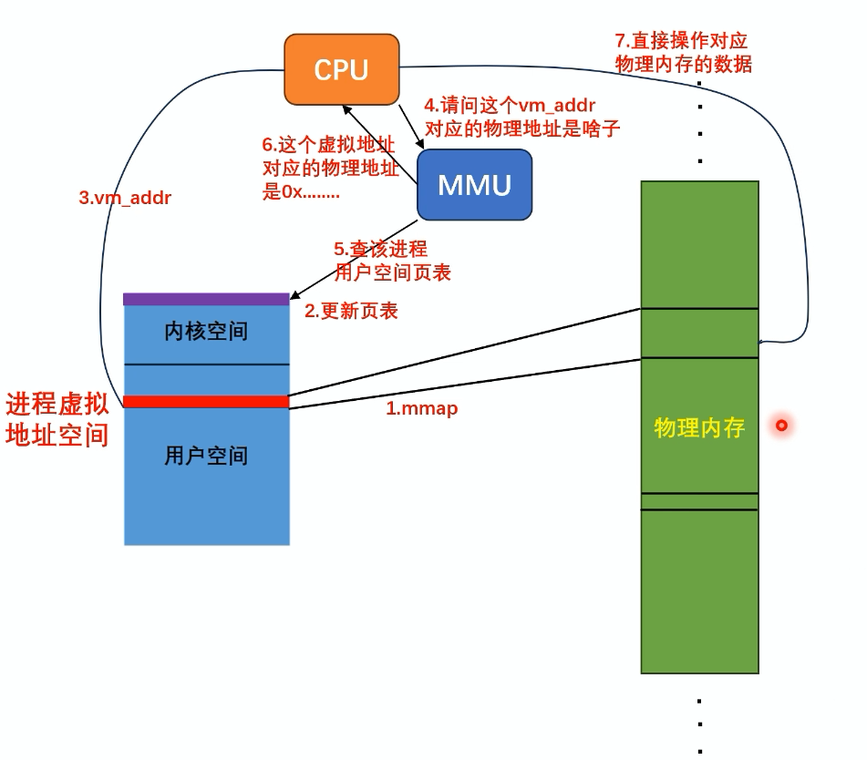

```c
void *mmap(void *addr, size_t length, int prot, int flags,
                  int fd, off_t offset);
int munmap(void *addr, size_t length);
```

## 参数介绍
+ `void *addr` :一个提示地址，表示希望映射区域开始的地址。然而，这个地址可能会被内核忽略，特别是当我们没有足够的权限来请求特定的地址时。如果addr是NULL ，则系统会自动选择一个合适的地址
+ `size_t length`：要映射到进程地址空间中的字节数。这个长度必须是系统页面大小的整数倍（通常是4KB ，但可能因系统而异）。如果指定的length不是页面大小的整数倍，系统可能会向上舍入到最近的页面大小边界(系统内存页大小为4KB（即4096字节），而请求的内存大小为3500字节，则按照向上舍入的原则，应分配4096字节的内存)
+ `int prot`：指定了映射区域的内存保护属性。可以是以下值的组合（使用按位或运算符）：
    - `PROT_READ`：映射区域可读。
    - `PROT_WRITE`：映射区域可写。
    - `PROT_EXEC`：映射区域可执行。
+ `int flags`: 指定了映射的类型和其他选项
    - `MAP_PRIVATE`：创建一个私有映射。对映射区域的修改不会反映到底层文件中。
    - `MAP_SHARED`：创建一个共享映射。对映射区域的修改会反映到底层文件中（前提是文件是以写方式打开的，并且文件系统支持这种操作）。
    - 其他选项（如`MAP_ANONYMOUS`、`MAP_ANONYMOUS_SHARED`等）可能也存在于某些系统上，用于创建不与文件关联的匿名映射。
+ `int fd`: 一个有效的文件描述符，指向要映射的文件或设备。对于匿名映射，这个参数可以是`-1`（在某些系统上，也可以使用`MAP_ANONYMOUS`或`MAP_ANON`标志来指定匿名映射，此时`fd`参数会被忽略）
+ `off_t offset`：文件中的起始偏移量，即映射区域的开始位置。`offset`和`length`一起定义了映射区域在文件中的位置和大小。

## 返回值
成功返回0，失败返回-1

## 写入映射
+ 默认文件大小是0，无法和mmap进行正确映射，这里需要调整文件大小，用0值填充

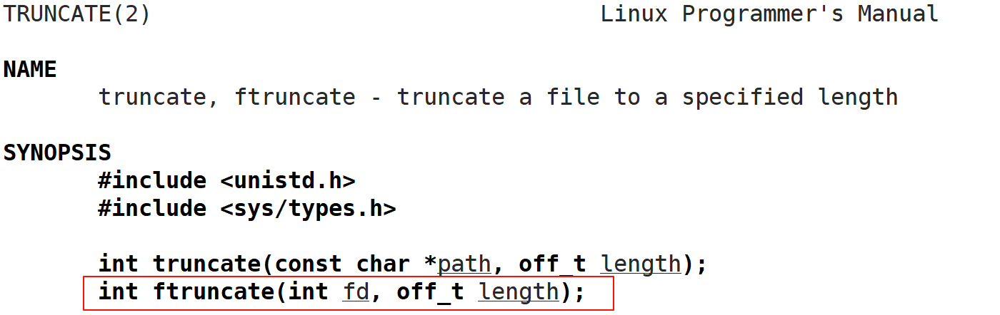

```cpp
#include <iostream>

#include <unistd.h>
#include <sys/types.h>
#include <sys/stat.h>
#include <fcntl.h>
#include <sys/mman.h>

#define SIZE 4096

int main(int args, char *argv[])
{
    if (args != 2)
    {
        std::cerr << "Usage: " << argv[0] << "filename" << std::endl;
        return 1;
    }

    // 1. 打开文件
    int fd = open(argv[1], O_TRUNC | O_CREAT | O_RDWR, 0666); // 要进行写
    if (fd < 0)
    {
        std::cerr << "open error" << std::endl;
        return 2;
    }

    // 2. 默认文件大小是0，无法和mmap进行正确映射，这里需要调整文件大小，用0值填充
    ftruncate(fd, SIZE);

    // 3. 建立映射
    char *mmapAddr = (char *)mmap(nullptr, SIZE, PROT_READ | PROT_WRITE, MAP_SHARED, fd, 0);
    if (mmapAddr == MAP_FAILED)
    {
        perror("mmap");
        return 3;
    }

    // 4. 操作文件
    for (int i = 0; i < 10; i++)
    {
        mmapAddr[i] = 'A';
    }

    // 5. 取消映射关闭文件
    int n = munmap(mmapAddr, SIZE);
    if(n < 0)
    {
        std::cerr << "munmap failed!" << std::endl;
        return 5;
    }
    close(fd);

    return  0;
}
```

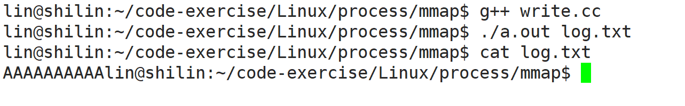

## 读取映射
获取文件真实大小

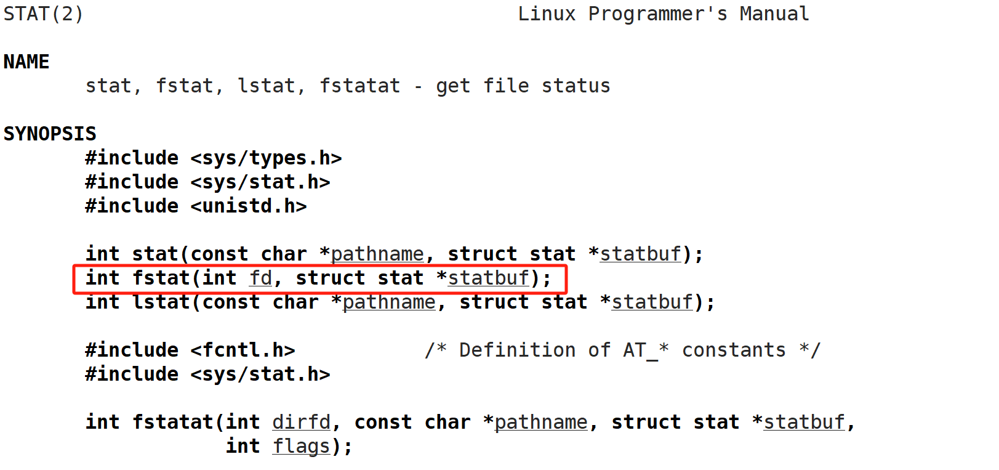

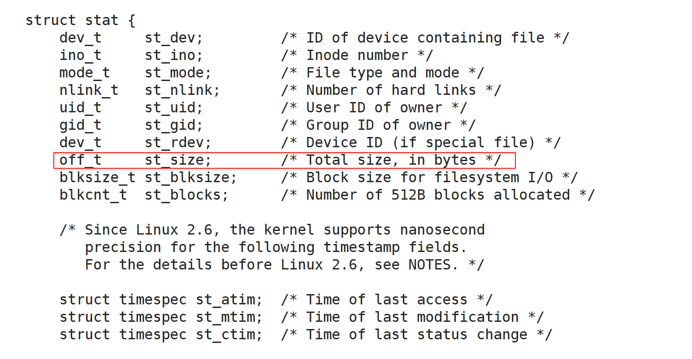

```c
fstat(fd, &st);
```

```c
#include <iostream>

#include <unistd.h>
#include <sys/types.h>
#include <sys/stat.h>
#include <fcntl.h>
#include <sys/mman.h>

#define SIZE 4096

int main(int args, char *argv[])
{
    if (args != 2)
    {
        std::cerr << "Usage: " << argv[0] << "filename" << std::endl;
        return 1;
    }

    // 1. 打开文件
    int fd = open(argv[1], O_RDONLY); // 要进行读
    if (fd < 0)
    {
        std::cerr << "open error" << std::endl;
        return 2;
    }

    // 2. 获取文件真实大小
    struct stat st;
    fstat(fd, &st);

    // 3. 建立映射
    char *mmapAddr = (char *)mmap(nullptr, st.st_size, PROT_READ, MAP_SHARED, fd, 0);
    if (mmapAddr == MAP_FAILED)
    {
        perror("mmap");
        return 3;
    }

    // 4. 操作文件
    std::cout << mmapAddr << std::endl;

    // 5. 取消映射关闭文件
    int n = munmap(mmapAddr, SIZE);
    if(n < 0)
    {
        std::cerr << "munmap failed!" << std::endl;
        return 5;
    }
    close(fd);

    return  0;
}
```


## 模拟实现malloc
```cpp
#include <iostream>

#include <unistd.h>
#include <sys/types.h>
#include <sys/stat.h>
#include <fcntl.h>
#include <sys/mman.h>

void *my_malloc(size_t size)
{
    void *ptr = mmap(nullptr, size, PROT_READ | PROT_WRITE, MAP_PRIVATE | MAP_ANONYMOUS, -1, 0);
    if (ptr == MAP_FAILED)
    {
        return nullptr;
        exit(1);
    }
    return ptr;
}

void my_free(void *ptr, size_t size)
{
    int n = munmap(ptr, size);
    if (n == -1)
    {
        perror("munmap");
        exit(2);
    }
}

int main()
{
    // 创建
    char *ptr = (char *)my_malloc(1024);
    if (ptr == nullptr)
    {
        perror("ptr");
        return 1;
    }

    // 使用
    for (int i = 0; i < 1024; i++)
    {
        ptr[i] = 'A';
    }
    printf(ptr);

    my_free(ptr, 1024);
    return 0;
}
```

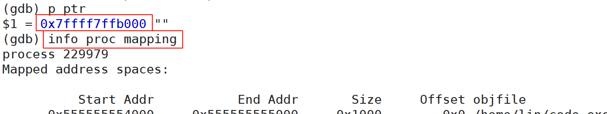

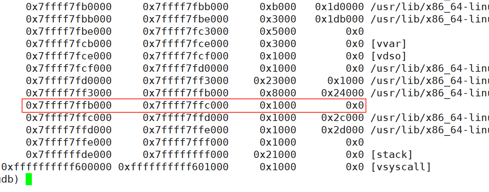

## mmap实现进程间通信

### SharedMem.hpp

```CPP
#pragma once

#include <iostream>
#include <sys/mman.h>
#include <semaphore.h>
#include <sys/types.h>
#include <sys/stat.h>
#include <fcntl.h>
#include <unistd.h>
#include <string.h>
#include <pthread.h>

#define SIZE 4096

class SafeObj
{
public:
    SafeObj()
    {
    }
    void InitObj()
    {
        // 初始化锁
        pthread_mutexattr_t mattr;
        pthread_mutexattr_init(&mattr);
        pthread_mutexattr_setpshared(&mattr, PTHREAD_PROCESS_SHARED); // 设置进程间共享
        pthread_mutex_init(&lock, &mattr);

        // 初始化条件变量
        pthread_condattr_t cattr;
        pthread_condattr_init(&cattr);
        pthread_condattr_setpshared(&cattr, PTHREAD_PROCESS_SHARED); // 设置进程间共享
        pthread_cond_init(&cond, &cattr);

        // 缓冲区清空
        memset(buffer, 0, sizeof(buffer));
    }
    void CleanupObj()
    {
        pthread_mutex_destroy(&lock);
        pthread_cond_destroy(&cond);
    }
    void LockObj()
    {
        int n = ::pthread_mutex_lock(&lock);
        (void)n;
    }
    void UnlockObj()
    {
        int n = ::pthread_mutex_unlock(&lock);
        (void)n;
    }
    void Wait()
    {
        int n = ::pthread_cond_wait(&cond, &lock);
        (void)n;
    }
    void Signal()
    {
        int n = ::pthread_cond_signal(&cond);
        (void)n;
    }
    void BroadCast()
    {
        int n = ::pthread_cond_broadcast(&cond);
        if (n != 0)
            std::cerr << "broadcast error" << std::endl;
        else
            std::cerr << "broadcast succcess" << std::endl;
    }
    void GetContent(std::string *out)
    {
        *out = buffer;
    }
    void SetContent(const std::string &in)
    {
        memset(buffer, 0, sizeof(buffer));
        strncpy(buffer, in.c_str(), in.size());
    }
    ~SafeObj()
    {
    }

private:
    pthread_mutex_t lock;
    pthread_cond_t cond;
    char buffer[SIZE]; // 未来进程共享的数据区域
};

// 映射的文件，必须以/开头，这是mmap的约定
#define SHARED_MEMORY_FILE "/shm"
#define SHARED_MEMORY_SIZE sizeof(SafeObj)

class MmapMemory
{
public:
    MmapMemory(const std::string &file, int size) : _file(file), _size(size), _fd(-1), _mmap_addr(nullptr)
    {
    }
    void OpenFile()
    {
        _fd = ::shm_open(_file.c_str(), O_CREAT | O_RDWR, 0666);
        if (_fd < 0)
        {
            perror("shm_open");
            exit(1);
        }
    }
    void TruncSharedMemory()
    {
        int n = ftruncate(_fd, _size);
        if (n < 0)
        {
            perror("ftruncate");
            exit(2);
        }
    }
    void *Mmap()
    {
        _mmap_addr = ::mmap(nullptr, _size, PROT_READ | PROT_WRITE, MAP_SHARED, _fd, 0);
        if (_mmap_addr == MAP_FAILED)
        {
            perror("mmap");
            exit(3);
        }
        return _mmap_addr;
    }
    void RemoveFile()
    {
        int n = ::shm_unlink(_file.c_str());
        if (n < 0)
        {
            perror("shm_unlink");
            exit(4);
        }
    }
    void *MmapAddr()
    {
        return _mmap_addr;
    }
    ~MmapMemory()
    {
        if (_fd > 0)
        {
            ::close(_fd);
            std::cout << "关闭mmap文件" << std::endl;
        }

        int n = ::munmap(_mmap_addr, _size);
        if (n == 0)
        {
            std::cout << "munmap 完成" << std::endl;
        }
    }

private:
    int _fd;
    int _size;
    std::string _file;
    void *_mmap_addr;
};

class MmapMemoryServer : public MmapMemory
{
public:
    MmapMemoryServer() : MmapMemory(SHARED_MEMORY_FILE, SHARED_MEMORY_SIZE)
    {
        MmapMemory::OpenFile();
        MmapMemory::TruncSharedMemory();
        MmapMemory::Mmap();
        obj = static_cast<SafeObj *>(MmapMemory::MmapAddr());
        obj->InitObj();
    }
    // 每个进程都有一次读取数据的机会
    void RecvMessage(std::string *out)
    {
        obj->LockObj();
        obj->Wait();
        obj->GetContent(out);
        obj->UnlockObj();
    }
    ~MmapMemoryServer()
    {
        obj->CleanupObj();
        MmapMemory::RemoveFile();
    }

private:
    SafeObj *obj;
};

class MmapMemoryClient : public MmapMemory
{
public:
    MmapMemoryClient() : MmapMemory(SHARED_MEMORY_FILE, SHARED_MEMORY_SIZE)
    {
        MmapMemory::OpenFile();
        MmapMemory::Mmap();
        obj = static_cast<SafeObj *>(MmapMemory::MmapAddr());
    }
    void SendMessage(const std::string &in)
    {
        obj->LockObj();
        obj->SetContent(in);
        // SafeSharedMemory::Signal(); //唤醒进程
        obj->BroadCast(); // 把他们全部叫醒，让他们自己判断，谁应该活动
        obj->UnlockObj();
    }
    ~MmapMemoryClient()
    {
    }

private:
    SafeObj *obj;
};
```


### Server.cc

```CPP
#include "SharedMem.hpp"
#include <sys/wait.h>
#include <sys/types.h>

void Active(MmapMemoryServer &svr, std::string processname)
{
    std::cout << "process is running: " << processname << std::endl;
    std::string who;
    while (true)
    {
        svr.RecvMessage(&who);
        if(who == processname || who == "all")
        {
            std::cout << processname << " is active!" << std::endl;
        }
        if(who == "end")
        {
            std::cout << processname << " is quit!" << std::endl;
            break;
        }
    }
}

int main()
{
    MmapMemoryServer svr;

    for (int i = 0; i < 10; i++)
    {
        pid_t id = fork();
        if (id == 0)
        {
            std::string name = "process-" + std::to_string(i);
            Active(svr, name);
            exit(0);
        }
    }
    Active(svr, "process-main");

    for(int i = 0; i < 10; i++)
    {
        wait(nullptr);
    }

    return 0;
}
```


### Client.cc

```CPP
#include "SharedMem.hpp"
#include <string.h>

int main()
{
    MmapMemoryClient cli;
    std::string who;
    while (true)
    {
        std::cout << "Please Enter# ";
        std::getline(std::cin, who);
        cli.SendMessage(who);
        if(who == "end")
        {
            break;
        }
    }

    return 0;
}
```

## mmap实现文件LRU缓存

### LRUCache.hpp

```CPP
#pragma once

#include <iostream>
#include <string>
#include <cstring>
#include <list>
#include <memory>
#include <unordered_map>
#include <sys/types.h>
#include <sys/stat.h>
#include <unistd.h>
#include <fcntl.h>
#include <sys/mman.h>

namespace LRUCache
{
#define BLOCK_ADDR_ALIGN(off) (off & ~(0xFFF)) // 清除低12位
#define NORMAL (1 << 0)
#define NEW (1 << 1)
#define VISIT (1 << 2)
#define DELETE (1 << 2)

    const int gdefaultfd = -1;
    const int gblocksize = 4096; // 4KB
    const int gcapacity = 3;     // 10个block

    class DataBlock
    {
    private:
        void UpdateStatus(unsigned status) { _status=0; _status |= status; }
        bool ConfirmStatus(unsigned status) { return _status & status; }

    public:
        DataBlock(off_t off, off_t size) : _off(off), _size(size), _addr(nullptr), _status(NEW)
        {
        }
        // 映射载入内存
        bool DoMap(int fd)
        {
            _addr = ::mmap(nullptr, _size, PROT_READ | PROT_WRITE, MAP_SHARED, fd, _off);
            if (_addr == MAP_FAILED)
            {
                perror("mmap"); // 在计算正确的情形下，不可能
                return false;
            }
            std::cout << "mmap && 加载 " << _off << " 成功" << std::endl;
            return true;
        }
        // 取消映射，从内存中移除
        bool DoUnmap()
        {
            int n = ::munmap(_addr, _size);
            if (n < 0)
            {
                perror("munmap");
                return false;
            }
            std::cout << "munmap && 移除 " << _off << " 成功" << std::endl;
            return true;
        }
        // 设置状态
        void Status2Normal() { UpdateStatus(NORMAL); }
        void Status2New() { UpdateStatus(NEW); }
        void Status2Visit() { UpdateStatus(VISIT); }
        void Status2Delete() { UpdateStatus(DELETE); }
        // 确认状态
        bool IsNormal() { return ConfirmStatus(NORMAL); }
        bool IsNew() { return ConfirmStatus(NEW); }
        bool IsVisit() { return ConfirmStatus(VISIT); }
        bool IsDelete() { return ConfirmStatus(DELETE); }
        // 获取基本属性
        off_t Off() { return _off; }
        void *Addr() { return _addr; }
        off_t Size() { return _size; }

        ~DataBlock()
        {
        }
        void DebugPrint()
        {
            std::cout << "_off: " << _off << std::endl;
            std::cout << "_size: " << _size << std::endl;
            std::cout << "_addr: " << _addr << std::endl;
            std::cout << "_status: ";
            if(IsNormal())
                std::cout << "NORMAL";
            if(IsNew())
                std::cout << "NEW";
            if(IsVisit())
                std::cout << "VISIT";
            if(IsDelete())
                std::cout << "delete";
            std::cout << std::endl;
        }

    private:
        off_t _off;       // 该block在文件中的起始偏移量，4KB对齐的
        off_t _size;      // 该block的大小
        void *_addr;      // 该block映射的虚拟地址是什么位置
        unsigned _status; // 该block的状态
    };

    class FileCache
    {
    private:
        // 要访问的块，是否在文件和合法范围内
        bool IsOffLegal(off_t off) { return off < _total; }
        // 目标块，是否已经被缓存了
        bool IsCached(off_t off) { return _hash.find(off) != _hash.end(); }
        // 缓存是不是满了
        bool IsCacheFull() { return _cache.size() > _cachemaxnum; }
        // 根据偏移量，获取实际对应的块大小
        off_t GetSizeFromOff(off_t off)
        {
            off_t size = gblocksize;
            if (off + gblocksize > _total)
            {
                // 文件不一定会被4KB整除，要求一下可能得剩余
                size = _total % gblocksize;
            }
            return size;
        }
        void DoLRU(off_t off)
        {
            if (!IsCached(off))
                return;
            if ((_hash[off]->IsNew())) // 如果是因插入触发的LRU，检测是否要移除尾部节点
            {
                _hash[off]->Status2Normal(); // 让节点成为普通节点
                if (IsCacheFull())
                {
                    // 1. 让尾部block映射的内存，从地址空间中移除
                    _cache.back()->DoUnmap();
                    // 2. 从hash表中移除尾部block
                    std::cout << "cache 移除: " << _cache.back()->Off() << std::endl;
                    _hash.erase(_cache.back()->Off());
                    // 从cache list中移除尾部block
                    _cache.pop_back();
                }
            }
            else if (_hash[off]->IsVisit()) // 如果是访问节点触发LRU，检测是否要移除尾部节点
            {
                _hash[off]->Status2Normal();
                _cache.remove(_hash[off]);     // 从缓存中移除
                _cache.push_front(_hash[off]); // 从新插入到缓存头部
                std::cout << "将 " << off << "移动到cache头部" << std::endl;
            }
            else
            {
                // TODO
            }
        }
        void DoCache(off_t off)
        {
            // 计算指定偏移量下的数据块大小,这个块大小，不一定完全是4KB大小哦
            off_t blocksize = GetSizeFromOff(off);
            // 构建block对象
            std::shared_ptr<DataBlock> block = std::make_shared<DataBlock>(off, blocksize);
            // 先加载并映射到地址空间
            block->DoMap(_fd);
            // 更新到hash表，方便随时提取
            _hash.insert(std::make_pair(off, block));
            // 头插到cache中，缓存起来
            _cache.push_front(block);
        }

    public:
        FileCache(const std::string &file) : _file(file), _fd(gdefaultfd)
        {
            _fd = ::open(_file.c_str(), O_RDWR); // 这个文件要存在，这样缓存才有意义
            if (_fd < 0)
            {
                perror("open");
                return;
            }
            struct stat status;
            int n = ::fstat(_fd, &status);
            if (n < 0)
            {
                perror("stat");
                return;
            }
            _total = status.st_size;
            _cachemaxnum = gcapacity;
        }
        std::shared_ptr<DataBlock> GetBlock(off_t off)
        {
            // 1. 偏移量不合法，就没必要玩了
            if (!IsOffLegal(off))
                return nullptr;
            // 2. 先根据偏移量，计算真实的块在文件中的起始地址
            off = BLOCK_ADDR_ALIGN(off);
            // 3. ok,在合法偏移量的位置, 下面查看cache是否命中
            if (_hash.find(off) != _hash.end()) // 命中
            {
                // 3-1 命中，更新block状态,标记为被访问
                _hash[off]->Status2Visit();
            }
            else
            {
                // 3-2 没有命中,执行加载
                DoCache(off);
            }
            DoLRU(off); // 检测并执行LRU算法
            return _hash[off];
        }
        void PrintCache()
        {
            std::cout << "---------cache 内容----------" << std::endl;
            for (auto &iter : _cache)
            {
                iter->DebugPrint();
                std::cout << "|" << std::endl;
            }
            std::cout << "nullptr" << std::endl;
            std::cout << "-----------------------------" << std::endl;
        }
        ~FileCache()
        {
            if (_fd != gdefaultfd)
            {
                ::close(_fd);
            }
        }

    private:
        std::string _file; // 文件名+路径
        int _fd;           // 文件fd
        off_t _total;      // 文件总大小
        std::list<std::shared_ptr<DataBlock>> _cache;
        int _cachemaxnum;
        std::unordered_map<off_t, std::shared_ptr<DataBlock>> _hash;
    };
}
```

### Main.cc

```cpp
#include "LRUCache.hpp"

int main(int argc, char *argv[])
{
    if (argc != 2)
    {
        std::cerr << "Usage: " << argv[0] << " filemame" << std::endl;
        return 1;
    }
    std::string filename = argv[1];
    LRUCache::FileCache fc(filename);
    int count = 0;
    // 依次对不存在的block测试获取
    while(count<10)
    {
        fc.GetBlock(count*4096);
        fc.PrintCache();
        count++;
        sleep(1);
    }

    // 测试对已经存在的block进行获取
    while(true)
    {
        off_t off;
        std::cout << "Please Enter Off# ";
        std::cin >> off;
        auto b = fc.GetBlock(off);
        std::cout << "block addr: " << b->Addr() << std::endl;
        fc.PrintCache();
    }
    return 0;
}
```

实验：

```CPP
dd if=/dev/zero of=log.txt bs=4096 count=10
```

