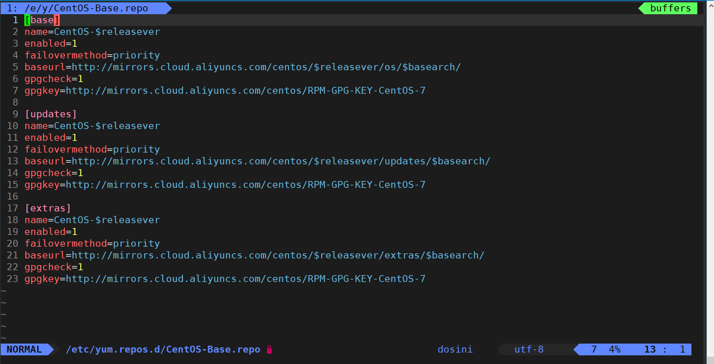
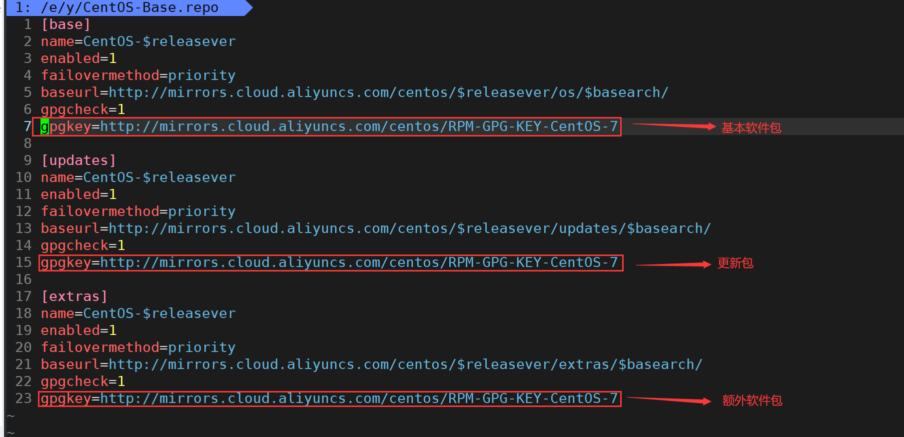
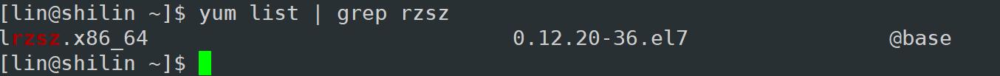
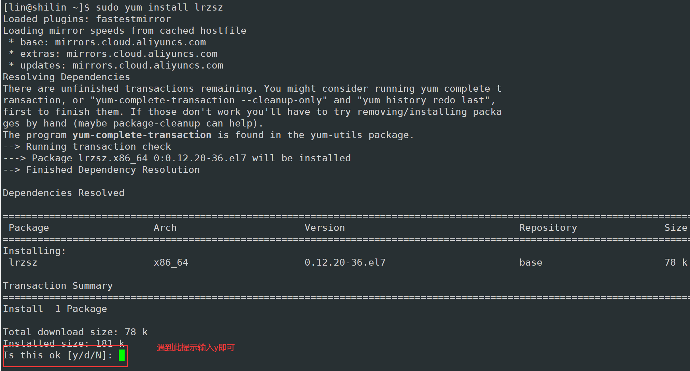

# Linux配置yum源以及基本yum指令
## 一、yum介绍
Yum（全称为 Yellow dog Updater, Modified）是一个在Fedora和**RedHa**t以及CentOS中的Shell前端软件包管理器。基于RPM包管理，能够从指定的服务器自动下载RPM包并且安装，可以自动处理依赖性关系，并且一次安装所有依赖的软件包，无须繁琐地一次次下载、安装。-->来自[百度百科](https://baike.baidu.com/item/yum/2835771?fr=ge_ala)

## 二、什么是软件包
在Linux下安装软件，一个通常的办法是下载到程序的源代码, 并进行编译, 得到可执行程序。  
但是这样太麻烦了, 于是有些人把一些常用的软件提前编译好, 做成软件包(可以理解成windows上的安装程序)放在一个服务器上, 通过包管理器可以很方便的获取到这个编译好的软件包, 直接进行安装.软件包和软件包管理器, 就好比 "App" 和 "应用商店" 这样的关系.

## 三、配置yum源
+ 使用`vi`或者`vim`打开这个源文件

```bash
sudo vim /etc/yum.repos.d/CentOS-Base.repo
```



+ [base] 仓库包含 CentOS 的基本软件包。baseurl 指定了软件包的基本URL地址，releasever 和basearch 是变量，分别代表当前系统版本和硬件架构。
+ [updates] 仓库包含 CentOS 的更新软件包。与 [base] 类似，**baseurl** 指定了更新软件包的URL地址。
+ [extras] 仓库包含一些可选的额外软件包。同样，**baseurl** 指定了额外软件包的URL地址
+ 其中如 `enabled` 表示该仓库是否启用，`failovermethod` 表示可用镜像的优先级顺序，`gpgcheck` 表示是否检查软件包的数字签名。
+ gpgkey 是用于验证软件包签名的GPG密钥的URL地址。
+ 也就是把需要的源替换到这里



上面我有语法高亮那些，可以参考[VimForCpp](https://gitee.com/HGtz2222/VimForCpp)

> 回到正题那么哪里找呢？
>

国外的yum源访问速度较慢，一般情况下建议替换成国内的免费yum源。国内提供了不少优秀的yum源，例如：

+ 搜狐开源镜像站：[http://mirrors.sohu.com/](http://mirrors.sohu.com/)
+ 网易开源镜像站：[http://mirrors.163.com/](http://mirrors.163.com/)
+ 中国科学技术大学:   [http://mirrors.ustc.edu.cn/](http://mirrors.ustc.edu.cn/)
+ 清华大学： [http://mirrors.tuna.tsinghua.edu.cn/](http://mirrors.tuna.tsinghua.edu.cn/)

## 四、一键配置yum源【三步走】
上面那种方法比较挫，我们可以直接使用配置好的文件，直接把名字换成和原来的一样，然后再更新

1. 首先**备份一下本地配置**，万一搞错了还能恢复

```bash
sudo mv /etc/yum.repos.d/CentOS-Base.repo /etc/yum.repos.d/CentOS-Base.repo.backup
```

2. 下载国内yum源配置文件到/etc/yum.repos.d/【**下面两个选一个，推荐阿里云**】

如果没有wegt的话，先安装一下：  
CentOS：`sudo yum install -y wget`  
ubuntu：`sudo apt install -y wget`

如果没有wget的话用curl，如果这个都没有的话看方法二！

+ 阿里源（推荐）：

```bash
sudo wget -O /etc/yum.repos.d/CentOS-Base.repo http://mirrors.aliyun.com/repo/Centos-7.repo
```

+ 网易源：

```bash
sudo wget -O /etc/yum.repos.d/CentOS-Base.repo http://mirrors.163.com/.help/CentOS7-Base-163.repo
```

3. 然后下一步**清理yum缓存，并生成新的缓存**

```bash
sudo yum clean all && yum makecache
```

**更新一下**

```bash
sudo yum update -y
```

这些开源镜像站一般都提供了对应Linux发行版的repo文件下载，例如网易开源镜像和阿里云开源镜像提供的Centos repo文件下载：

+ 网易开源镜像站Centos5: [http://mirrors.163.com/.help/CentOS5-Base-163.repo](http://mirrors.163.com/.help/CentOS5-Base-163.repo)
+ 网易开源镜像站Centos6: [http://mirrors.163.com/.help/CentOS6-Base-163.repo](http://mirrors.163.com/.help/CentOS6-Base-163.repo)
+ 网易开源镜像站Centos7: [http://mirrors.163.com/.help/CentOS7-Base-163.repo](http://mirrors.163.com/.help/CentOS7-Base-163.repo)
+ 阿里云开源镜像Centos5: [http://mirrors.aliyun.com/repo/Centos-5.repo](http://mirrors.aliyun.com/repo/Centos-5.repo)
+ 阿里云开源镜像Centos6: [http://mirrors.aliyun.com/repo/Centos-6.repo](http://mirrors.aliyun.com/repo/Centos-6.repo)
+ 阿里云开源镜像Centos7: [http://mirrors.aliyun.com/repo/Centos-7.repo](http://mirrors.aliyun.com/repo/Centos-7.repo)

---

方法二：打开源文件

```shell
sudo vi /etc/yum.repos.d/CentOS-Base.repo
```

直接复制下面的内容到文件中

```shell
# CentOS-Base.repo
#
# The mirror system uses the connecting IP address of the client and the
# update status of each mirror to pick mirrors that are updated to and
# geographically close to the client.  You should use this for CentOS updates
# unless you are manually picking other mirrors.
#
# If the mirrorlist= does not work for you, as a fall back you can try the 
# remarked out baseurl= line instead.
#
#
 
[base]
name=CentOS-$releasever - Base - mirrors.aliyun.com
failovermethod=priority
baseurl=http://mirrors.aliyun.com/centos/$releasever/os/$basearch/
        http://mirrors.aliyuncs.com/centos/$releasever/os/$basearch/
        http://mirrors.cloud.aliyuncs.com/centos/$releasever/os/$basearch/
gpgcheck=1
gpgkey=http://mirrors.aliyun.com/centos/RPM-GPG-KEY-CentOS-7
 
#released updates 
[updates]
name=CentOS-$releasever - Updates - mirrors.aliyun.com
failovermethod=priority
baseurl=http://mirrors.aliyun.com/centos/$releasever/updates/$basearch/
        http://mirrors.aliyuncs.com/centos/$releasever/updates/$basearch/
        http://mirrors.cloud.aliyuncs.com/centos/$releasever/updates/$basearch/
gpgcheck=1
gpgkey=http://mirrors.aliyun.com/centos/RPM-GPG-KEY-CentOS-7
 
#additional packages that may be useful
[extras]
name=CentOS-$releasever - Extras - mirrors.aliyun.com
failovermethod=priority
baseurl=http://mirrors.aliyun.com/centos/$releasever/extras/$basearch/
        http://mirrors.aliyuncs.com/centos/$releasever/extras/$basearch/
        http://mirrors.cloud.aliyuncs.com/centos/$releasever/extras/$basearch/
gpgcheck=1
gpgkey=http://mirrors.aliyun.com/centos/RPM-GPG-KEY-CentOS-7
 
#additional packages that extend functionality of existing packages
[centosplus]
name=CentOS-$releasever - Plus - mirrors.aliyun.com
failovermethod=priority
baseurl=http://mirrors.aliyun.com/centos/$releasever/centosplus/$basearch/
        http://mirrors.aliyuncs.com/centos/$releasever/centosplus/$basearch/
        http://mirrors.cloud.aliyuncs.com/centos/$releasever/centosplus/$basearch/
gpgcheck=1
enabled=0
gpgkey=http://mirrors.aliyun.com/centos/RPM-GPG-KEY-CentOS-7
 
#contrib - packages by Centos Users
[contrib]
name=CentOS-$releasever - Contrib - mirrors.aliyun.com
failovermethod=priority
baseurl=http://mirrors.aliyun.com/centos/$releasever/contrib/$basearch/
        http://mirrors.aliyuncs.com/centos/$releasever/contrib/$basearch/
        http://mirrors.cloud.aliyuncs.com/centos/$releasever/contrib/$basearch/
gpgcheck=1
enabled=0
gpgkey=http://mirrors.aliyun.com/centos/RPM-GPG-KEY-CentOS-7
```

然后再下一步**清理yum缓存，并生成新的缓存**

```bash
sudo yum clean all && yum makecache
```

**更新一下**

```bash
sudo yum update -y
```

## 五、yum指令
### 搜索软件
```bash
yum list | grep 软件名字
```

例如：【查找带有rzsz字符的所有软件】

```bash
yum list | grep rzsz
```

这样搜索会显示所有带有rzsz的软件



其中：

+ 软件包名称: 主版本号.次版本号，源程序发行号-软件包的发行号.主机平台.cpu架构.
+ "x86_64" 后缀表示64位系统的安装包, "i686" 后缀表示32位系统安装包. 选择包时要和系统匹配.
+ "el7" 表示操作系统发行版的版本. "el7" 表示的是 centos7/redhat7. "el6" 表示 centos6/redhat6. 
+ 最后一列, base 表示的是 "软件源" 的名称, 类似于 "小米应用商店", "华为应用商店" 这样的概念.

### 安装软件
+ 搜索到了软件，就轮到安装软件了

```bash
sudo yum install 软件名
```

例如：【安装lrzsz软件】

```bash
sudo yum install lrzsz
```

+ 遇到下面的提示输入`y`即可



+ 如果不想每次安装软件的时候输入`y`，那么我可以安装的时候带个选项`-y`即可

```bash
sudo yum install lrzsz -y
```

### 卸载软件
> 有了安装软件，那就一定有卸载软件
>

```bash
sudo yum remove 软件名
```

例如：【卸载lrzsz】

```bash
sudo yum remove lrzsz
```

## 六、其他yum指令
### 更新内核
```bash
sudo yum install kernel -y
```

### 更新软件
+ 升级所有包同时，也升级软件和系统内核；

```bash
sudo yum -y update
```

+ 只升级所有包，不升级软件和系统内核，软件和内核保持原样。

```bash
sudo yum -y upgrade
```

+ 更新软件包,自动解决依赖关系

```bash
yum upgrade --obsoletes -y
```

### 更新指定软件
```bash
sudo yum update 包名 -y
```

+ 升级系统yum upgrade
+ upgrade会删除旧的软件包，并重新安装新的软件包。

### 显示所有可更新的软件清单
```bash
sudo yum check-update
```

### 卸载指定包并自动移除依赖包
```bash
yum autoremove 包名
```

### 删除软件包，以及软件包数据和配置文件
```bash
yum erase 包名
```

+ 类似于Ubuntu的 apt autoremove --purge 包名

