# Linux重定向&&文件概念&&查找文件&&打包文件
## 一、more
**语法：** more \[选项][文件] 
**功能：** more命令，功能类似 cat
**常用选项：**

> -n 对输出的所有行编号
q 退出more

+ 我们接下来要学的指令是more，但是这个more要查看文件，我们就要创建一个文件，这次我们创建的文件就和之前不一样，我们来学一个新东西，叫重定向

### 1.1 输出重定向 > 和 >>
```shell
echo "hello Linux" > log.txt
```

+ 这里的echo就是往屏幕上打印东西，

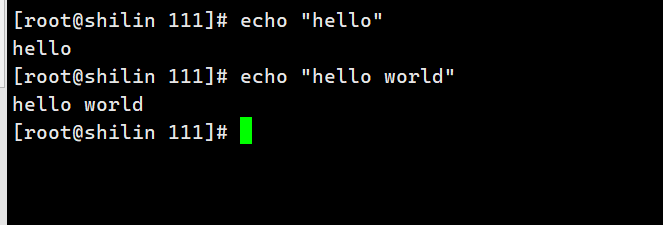

+ 然后我们在后面加一个符号`> log.txt`
+ 执行完这条命令就会发现什么也没有输出
+ 再看当前路径多出了一个`>`后面的文件名字
+ 然后我们`cat`打印一下这个文件，就会发现，刚刚应该打印到屏幕上的就写入到了文件里

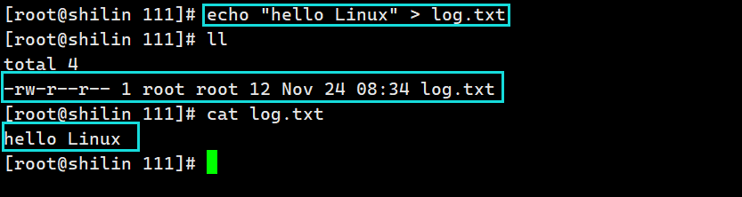

> 那我们是不是可以去掉前面的这个`echo`?
>

+ 我们再来试试

```bash
>hello.txt
```

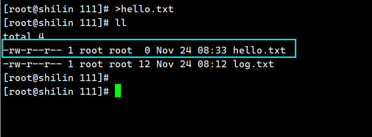

+ 可以看到，这样也可以创建文件，但是是空文件

---

> linux有一个设计理念，就是一些皆**文件**
>

> 对于任何文件来讲，读和写文件  
显示器设备->显示器文件->向显示器打印，向显示器文件进行写入
>

---

+ 对于上面的`>`就是输出重定向，本来应该写入到显示器文件的，但是通过了`>`就输出到了普通文件当中
+ 那我们再次输入字符串到这个文件，内容是追加还是删除原本内容再添加文件呢？

> 我们来试一下
>

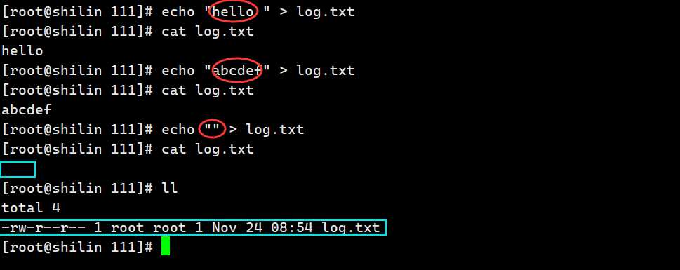

+ 可以看到，每次重定向一次字符串就会修改里面的内容，是会先删除原来的内容，然后再进行新的字符串写入
+ 最后一次操作是将一个空的字符输入到了文件，但是文件里还是有一个换行的，还是有大小的
+ 我们再一次用`>`创建一个文件，但是这个文件是没有大小的~~

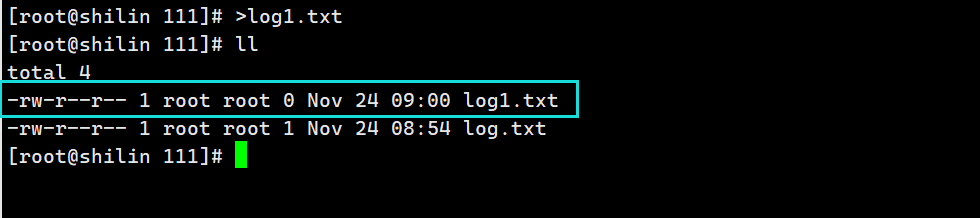

> 所以得出结论，`>`输出重定向就是从0开始写文件，换而言之，就是会删除原来的字符串，再进行新的字符串写入
>

+ 那我们不想删除原有的文件，向继续往后写数据，怎么办呢？
+ 接下来看

```c
echo "hello linux" >> log.txt
```

+ 这里的`>>`是**追加重定向**，就是不会删除原有的文件，继续往后添加数据

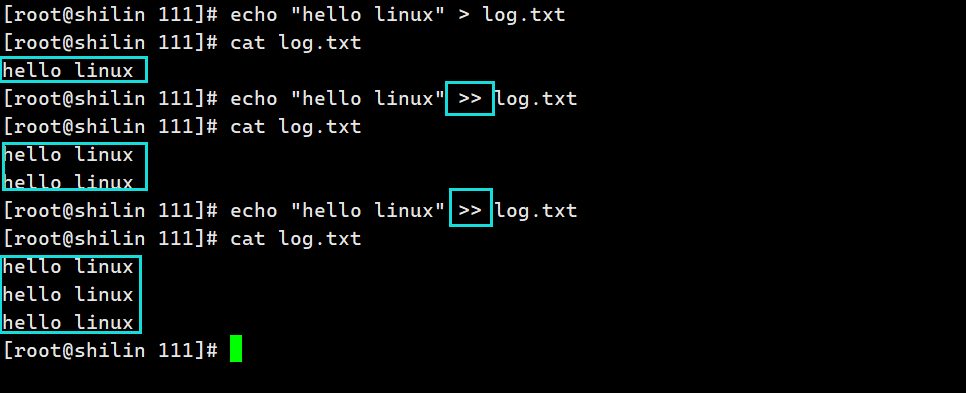

> 这里的一个`>`符号就相当于C语言中的文件操作以`w`方式写，每次写的时候都会清空文件
这里的一个`>>`符号就相当于C语言中的文件操作以`a`方式写,每次写的时候不会清空文件，直接往后面写入数据

就比如这里的`cat`命令，就是默认写入到显示器文件当中~~

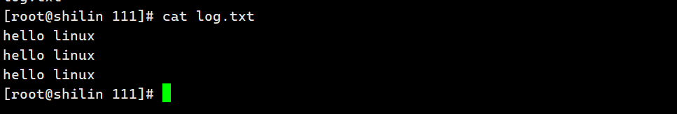

+ 我们还可以只输入一个cat命令

```bash
cat
```

+ 这里从键盘上读取字符，然后再输出到屏幕上
+ 按`ctrl + z`就退出了

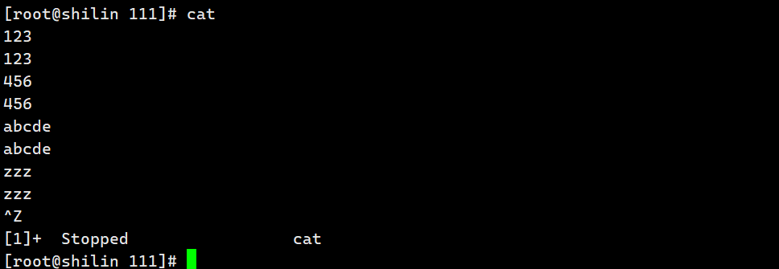

### 1.2 输入重定向<
```bash
cat < log.txt
```

+ 这里的`<`是输入重定向的意思
+ cat命令本来应该从键盘上读数据，但是这个输入重定向从文本读数据到显示器上了

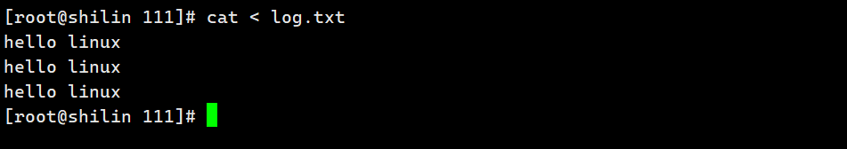

**小结一下：**

```bash
command > filename #输出重定向
command >> filename #追加重定向
command < filename #输入重定向
```

## 二、 再谈一切皆文件
+ 我们的终端其实是在linux系统里是有一个文件的，我们口说无凭，我们来证明一下

```bash
ll /dev/pts/
```

+ 这里只有这几个文件

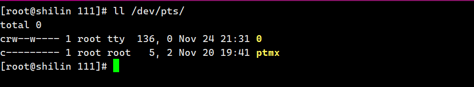

我们再来开一个窗口，可以看到多了一个文件

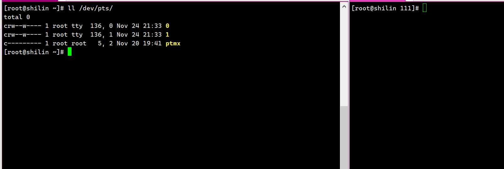

+ 这个时候我们就可以使用命令，将内容输入到刚刚查看的文件里

```bash
echo "hello linux" > /dev/pts/1
```

然后我们就可以看到执行命令后，那边就可以直接输出了

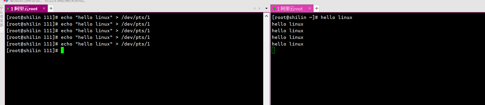

## 三、less指令【重要】
+ less 工具也是对文件或其它输出进行分页显示的工具，应该说是linux正统查看文件内容的工具，功能极其强大。
+ less 的用法比起 more 更加的有弹性。在 more 的时候，我们并没有办法向前面翻， 只能往后面看
+ 但若使用了 less 时，就可以使用\[pageup][pagedown] 等按键的功能来往前往后翻看文件，更容易用来查看一个文件的内容！
+ 除此之外，在 less 里头可以拥有更多的搜索功能，不止可以向下搜，也可以向上搜。

**语法：** 
less [参数] 文件

**功能：**
less与more类似，但使用less可以随意浏览文件，而more仅能向前移动，却不能向后移动，而且less在查看之前不会加载整个文件。  
**选项：**

> -i 忽略搜索时的大小写
-N 显示每行的行号
/字符串：向下搜索“字符串”的功能
?字符串：向上搜索“字符串”的功能
n：重复前一个搜索（与 / 或 ? 有关）
N：反向重复前一个搜索（与 / 或 ? 有关）
q:quit

+ 接下来我我们创建一个大文件，来演示

```bash
i=1;while [ $i -le 10000 ]; do echo "hello Linux $i"; let i++;done > big.txt
```

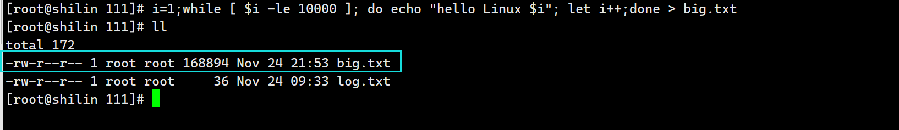

+ 我们回到上面的第一个命令：more

```bash
more big.txt
```

+ 回车就是一行一行的下翻，逐行阅读
+ 按q就退出了

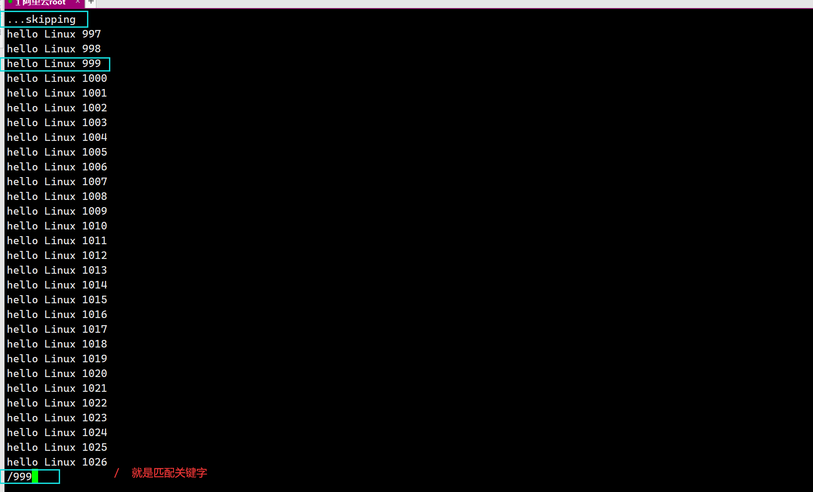

+ 我们更推荐下一个命令，less

使用基本和`more`一样，但是这个更方便，按键盘上的方向键就可以逐行查看，空格是一页一页的查

## 四、head指令
> head 与 tail 就像它的名字一样的浅显易懂，它是用来显示开头或结尾某个数量的文字区块，head 用来显示档案的开头至标准输出中，而 tail 想当然尔就是看档案的结尾。
>

**语法：**  head [参数]... [文件]... 
**功能：** 
head 用来显示档案的开头至标准输出中，默认head命令打印其相应文件的开头10行。  
**选项：**

> -n<行数> 显示的行数

```bash
head big.txt
```

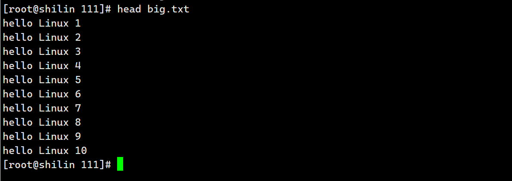

+ 我们想查看文件内容的前几行怎么查看呢？
+ 比如查看前20行

```bash
head -20 big.txt
```

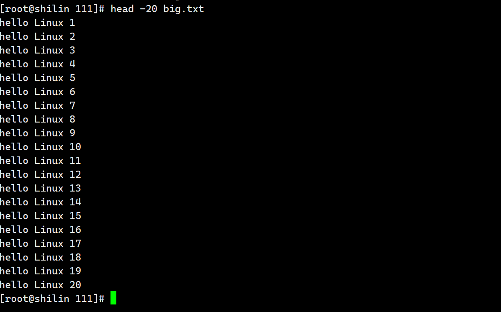

## 五、tail指令
> tail 命令从指定点开始将文件写到标准输出.使用tail命令的-f选项可以方便的查阅正在改变的日志文件,tail -f filename会把filename里最尾部的内容显示在屏幕上,并且不但刷新,使你看到最新的文件内容.
>

**语法：** tail\[必要参数]\[选择参数][文件]
**功能：**  用于显示指定文件末尾内容，不指定文件时，作为输入信息进行处理。常用查看日志文件。
**选项：**

> -f 循环读取
-n<行数> 显示行数

```bash
tail big.txt
```

+ 默认查看最后10行

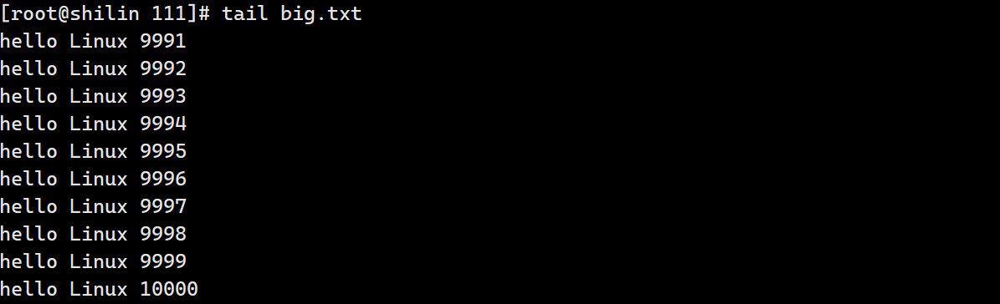

+ 指定查看最后的行数

```bash
tail -20 big.txt
```

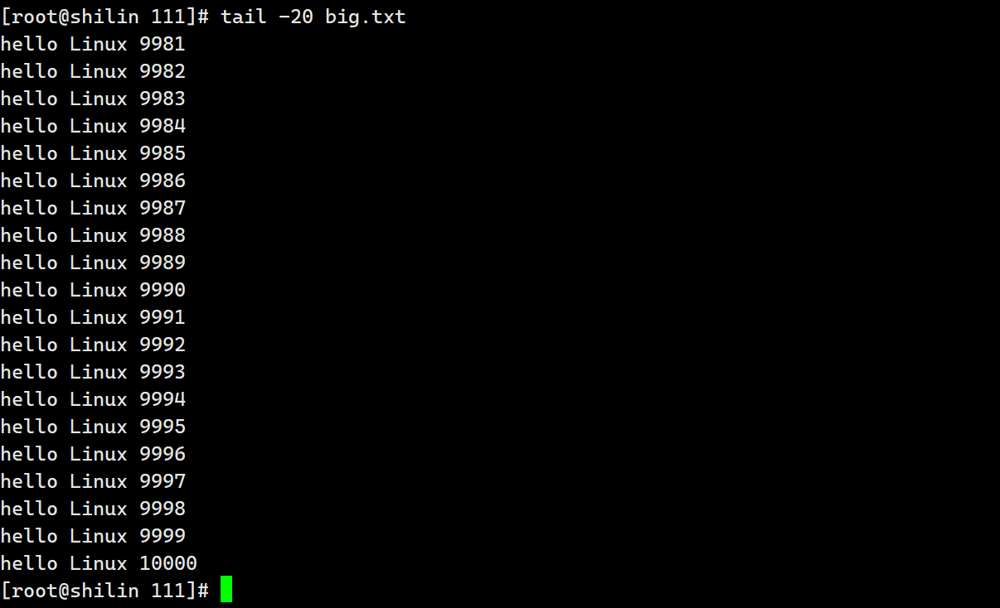

### 5.5 管道
那我想要查看中间的行，怎么办呢

+ 这里就要引入一个概念`管道`

```bash
head -8010 big.txt | tail -11
```

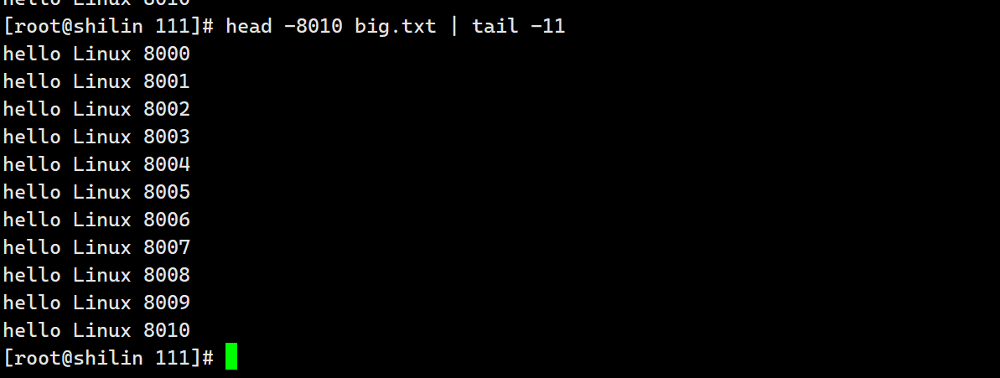

+ 这里的` | `就是管道的意思，将上一条的输出指令交给第二条指令

### 5.6 wc -l【补充命令】
+ 统计文件中有多少行

```bash
wc -l big.txt
```

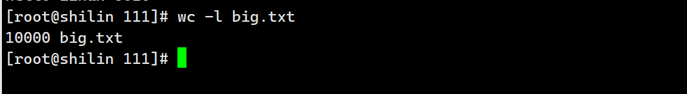

+ 那我们有有新的玩法了
+ 我们可以通过管道进行输出的统计有多少行

```bash
head -8010 big.txt | tail -11 | wc -l
```

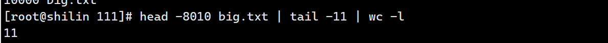

+ 我们还想逆置输出
+ 我们还可以通过管道来输出

```bash
head -8010 big.txt | tail -11 | tac
```

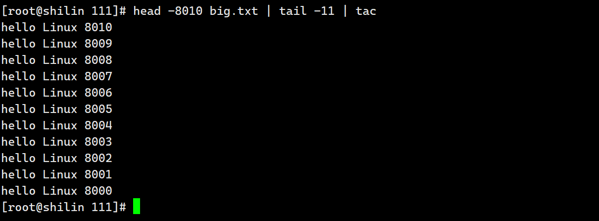

> 我们可以通过管道对指令进行集连
>

## 六、时间相关的指令
**date显示**
date 指定格式显示时间： date +%Y:%m:%d
date 用法：date [OPTION]... [+FORMAT]

1. 在显示方面，使用者可以设定欲显示的格式，格式设定为一个加号后接数个标记，其中常用的标记列表如下

> %H : 小时(00..23)
%M : 分钟(00..59)
%S : 秒(00..61)
%X : 相当于 %H:%M:%S
%d : 日 (01..31)
%m : 月份 (01..12)
%Y : 完整年份 (0000..9999)
%F : 相当于 %Y-%m-%d

2. 在设定时间方面

> date -s //设置当前时间，只有root权限才能设置，其他只能查看。
date -s 20080523 //设置成20080523，这样会把具体时间设置成空00:00:00
date -s 01:01:01 //设置具体时间，不会对日期做更改
date -s “01:01:01 2008-05-23″ //这样可以设置全部时间
date -s “01:01:01 20080523″ //这样可以设置全部时间
date -s “2008-05-23 01:01:01″ //这样可以设置全部时间
date -s “20080523 01:01:01″ //这样可以设置全部时间

3. 时间戳

> 时间->时间戳：date +%s
时间戳->时间：date -d@1508749502
Unix时间戳（英文为Unix epoch, Unix time, POSIX time 或 Unix timestamp）是从1970年1月1日（UTC/GMT的午夜）开始所经过的秒数，不考虑闰秒。

+ 我们查看时间的话就执行下面的命令

```bash
date
```

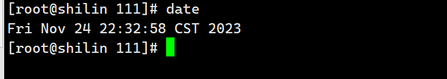

+ 这样显示感觉不是很方便查看，我们就可以自定义查看格式一下
+ 格式化的形式查看一下
+ 这里的`Y`必须是大写，还有时分秒

```bash
date +%Y-%m-%d_%H:%M:%S
```

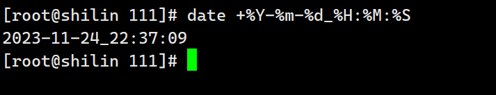

### 6.1 时间戳
我们可以使用

```bash
date +%s
```

来查看时间戳

+ 时间戳据说到2038年就不够了，具体可以百度一下，这个对计算机来说很重要

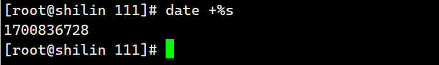

使用-d@+时间戳转换成时间

```shell
date +%Y-%d\ %H:%M:%S -d@0
```

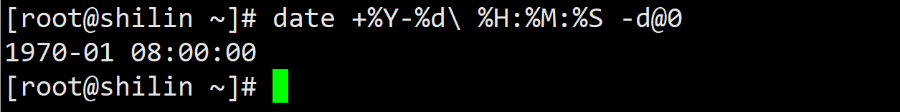

## 七、cal指令
cal命令可以用来显示公历（阳历）日历。公历是现在国际通用的历法，又称格列历，通称阳历。“阳历”又名“太阳历”，系以地球绕行太阳一周为一年，为西方各国所通用，故又名“西历”。

**命令格式：** cal \[参数]\[月份][年份]
**功能：** 用于查看日历等时间信息，如只有一个参数，则表示年份(1-9999)，如有两个参数，则表示月份和年份
**常用选项：**

> + -3 显示系统前一个月，当前月，下一个月的月历
> + -j 显示在当年中的第几天（一年日期按天算，从1月1号算起，默认显示当前月在一年中的天数）
> + -y 显示当前年份的日历
>

+ 这个命令很简单，直接就可以查看当前日期

```bash
cal
```

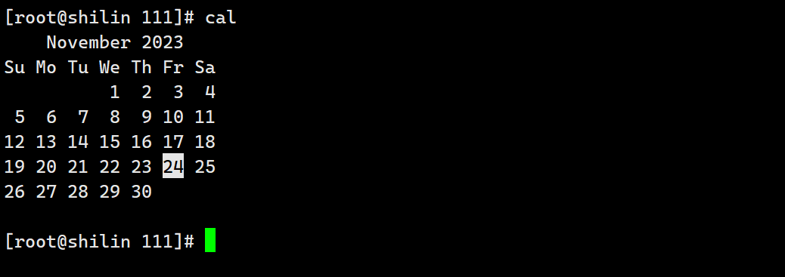

+ 我们还可以显示系统前一个月，当前月，下一个月的月历

```bash
cal -3
```

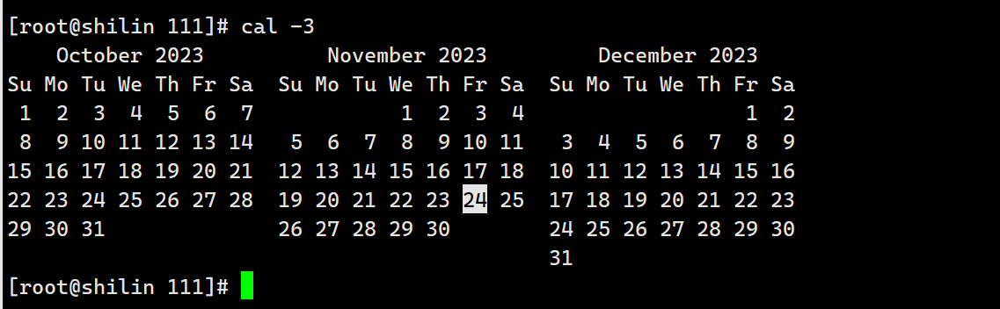

+ 这个是显示在当年中的第几天（一年日期按天算，从1月1号算起，默认显示当前月在一年中的天数）

```bash
cal -j
```

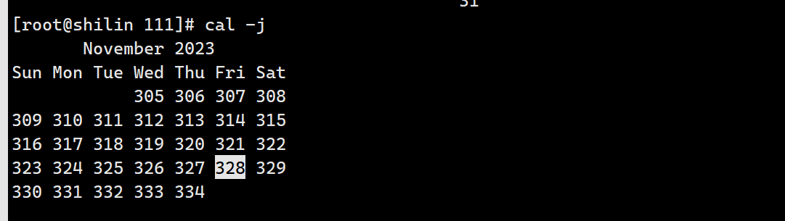

+ 显示当前年份的日历

```bash
cal -y
```

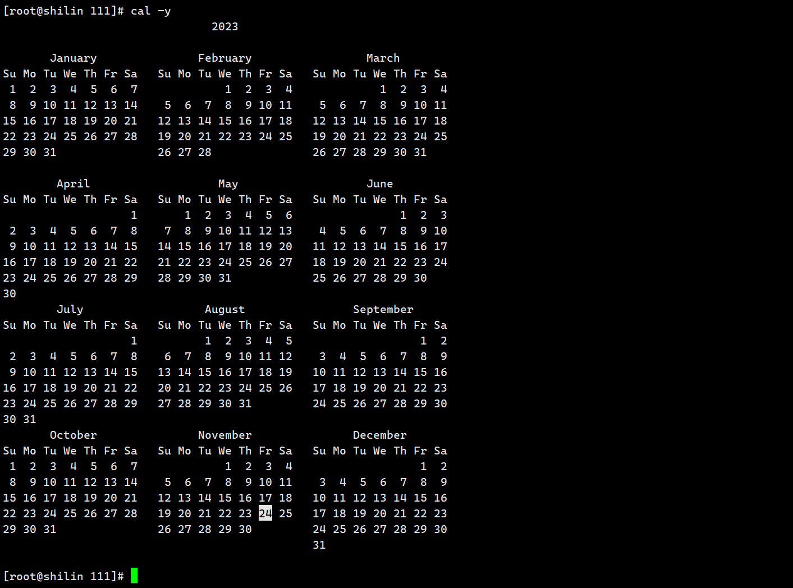

## 八、find指令：【灰常重要】-name
> + Linux下find命令在目录结构中搜索文件，并执行指定的操作。
> + Linux下find命令提供了相当多的查找条件，功能很强大。由于find具有强大的功能，所以它的选项也很多，其中大部分选项都值得我们花时间来了解一下。
> + 即使系统中含有网络文件系统( NFS)，find命令在该文件系统中同样有效，只你具有相应的权限。
> + 在运行一个非常消耗资源的find命令时，很多人都倾向于把它放在后台执行，因为遍历一个大的文件系统可能会花费很长的时间(这里是指30G字节以上的文件系统
>

**语法：** find pathname -options
**功能：** 用于在文件树种查找文件，并作出相应的处理（可能访问磁盘）
**常用选项：**

> + -name 按照文件名查找文件。
>

```bash
find 路径 -name 名称
```

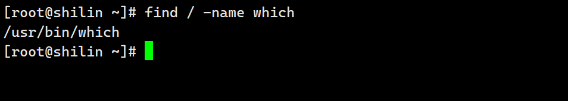

+ 或者我们可以使用通配符`*`

```bash
find / -name *.c
```

+ 就是查询所有以`.c`结尾的文件

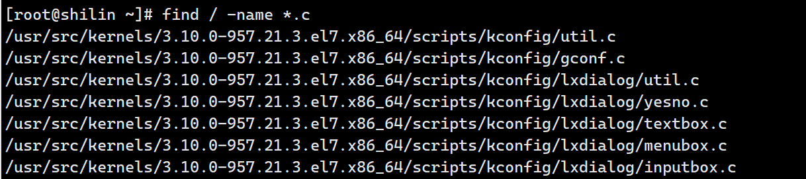

## 九、grep指令
**语法：** grep [选项] 搜寻字符串文件
**功能：** 在文件中搜索字符串，将找到的行打印出来
**常用选项：**

> -i ：忽略大小写的不同，所以大小写视为相同
>
> -n ：顺便输出行号
>
> -v ：反向选择，亦即显示出没有 '搜寻字符串' 内容的那一行

+ 我们先来看最简单的，就是直接匹配关键字进行查找
+ 999是要查找的关键字，后面跟上文件名

```bash
grap "999" big.txt
```

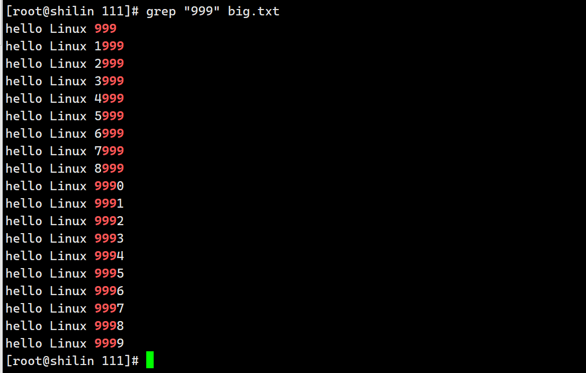

+ 我们创建了一个带有大小写的文件，然后进行演示

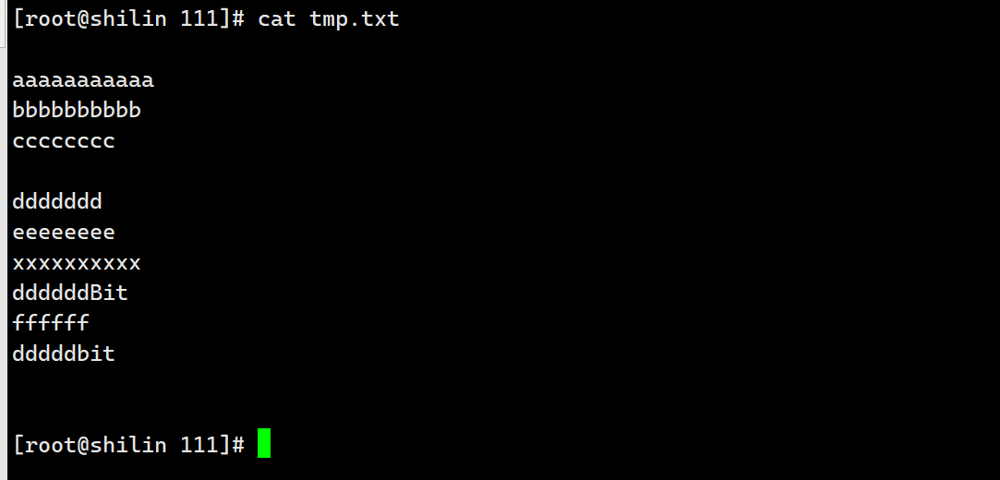

我们来看第一个选项

+ -i ：忽略大小写的不同，所以大小写视为相同
+ 大写和小写都可以打印出来

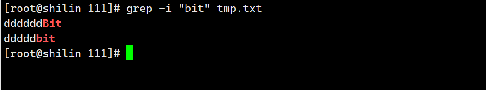

+ 如果不加`-i`的话只会匹配关键字

```bash
grep "bit" tmp.txt
```

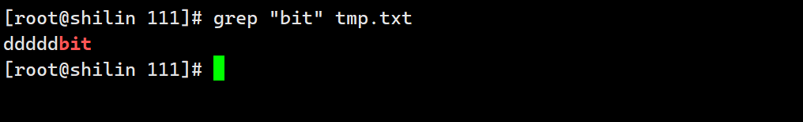

我们来看第二个选项

+ -n ：顺便输出行号

```bash
grep -i -n "bit" tmp.txt
```

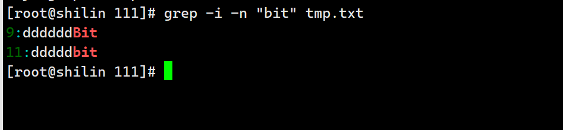

我们来看第三个选项

+ -v ：反向选择，亦即显示出没有 '搜寻字符串' 内容的那一行

刚刚有的就不打印，反向匹配

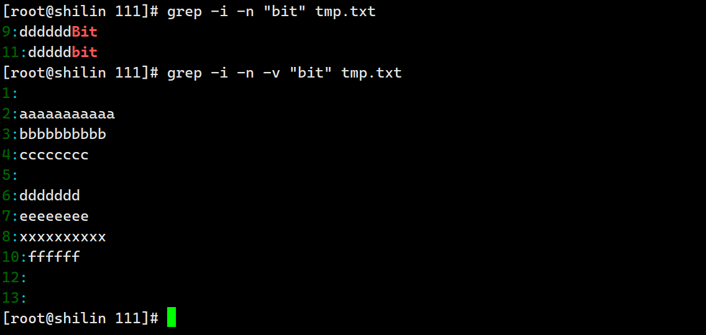

+ 其中这里面的`-`后面是可以连续写的

```bash
grep -inv "bit" tmp.txt
```

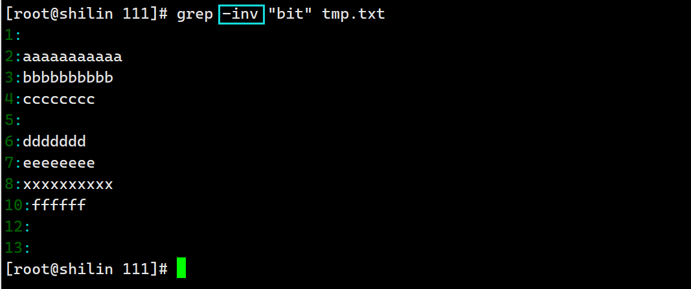

+ 我们还可以管道命令进行反向输出

```bash
grep -inv "bit" tmp.txt | tac
```

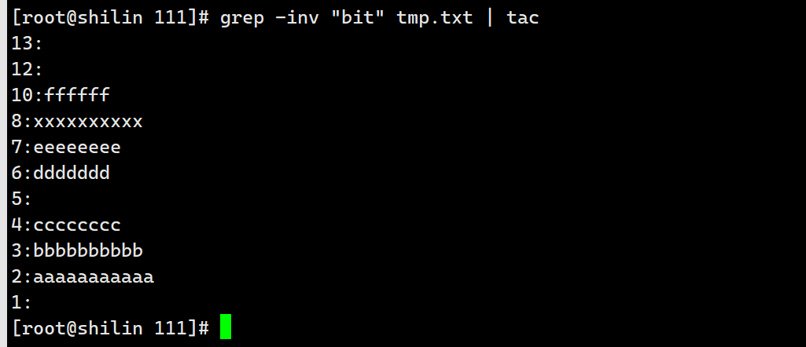

+ 还可以结合`cat`和统计行数`wc -l`命令

```bash
cat tmp.txt | grep -inv "bit" tmp.txt | tac | wc -l
```

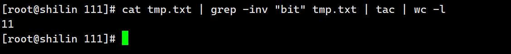

补充一个命令：

**top**

```shell
top -d 1 -n 5
```

-d：刷新的时间间隔

-n：刷新的次数

## 十、zip/unzip指令：
**语法：** zip 压缩文件.zip 目录或文件 
**功能：** 将目录或文件压缩成zip格式 
**常用选项：**

> + -r 递归处理，将指定目录下的所有文件和子目录一并处理
>

+ 我们先来看一看有没有这两个命令

```bash
which zip
```

```bash
which unzip
```

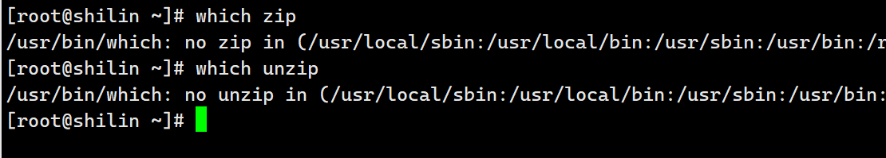

+ 如果和我上图一样的话就需要先安装一下

```bash
yum install -y zip unzip
```

+ 提示`complete`就说明安装成功了

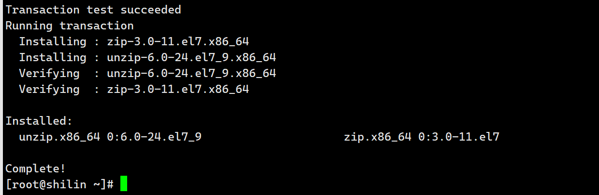

+ 我们创建这些文件来进行演示

```bash
touch file1 file2 file3 file4 file5
```

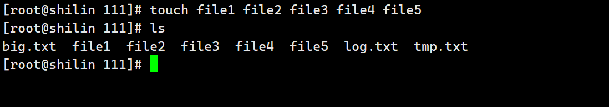

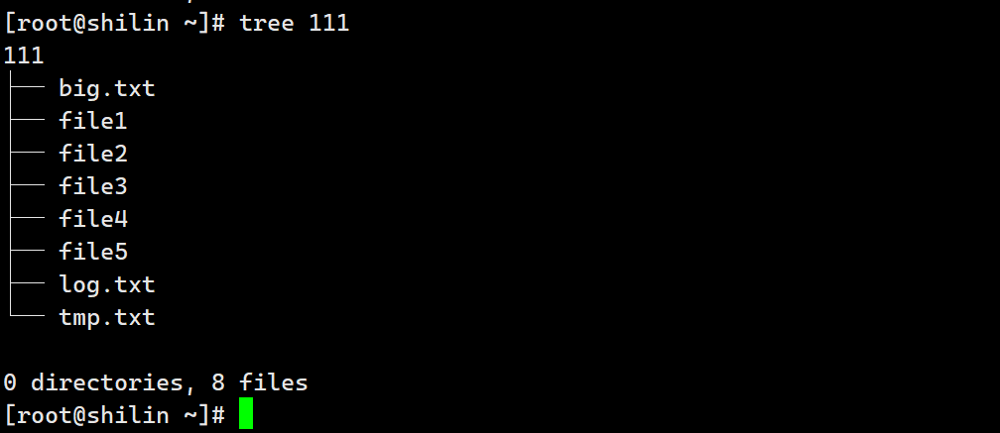

+ 我们要打包整个目录和内容要打包
+ **-r 递归处理，将指定目录下的所有文件和子目录一并处理**
+ **如果不加-r它只会打包一个目录，目录下的文件不会打印**

```bash
zip -r 111.zip 111
```

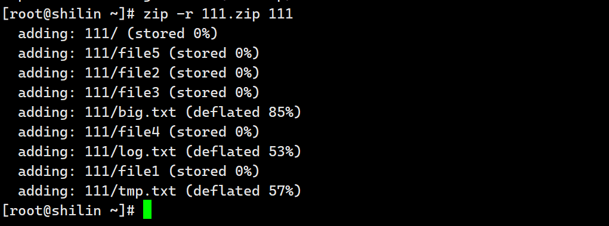

+ 解压zip包

```bash
unzip 111.zip
```

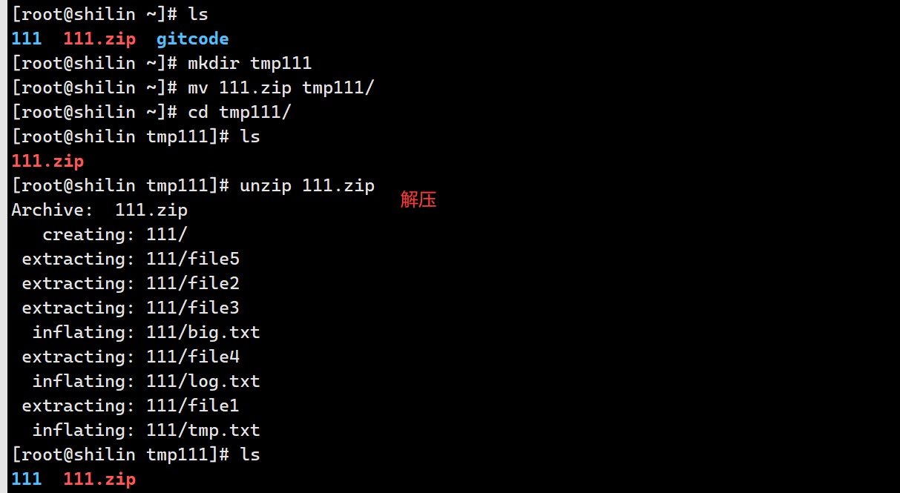

+ 可以看到刚刚打包的文件已经解压出来了

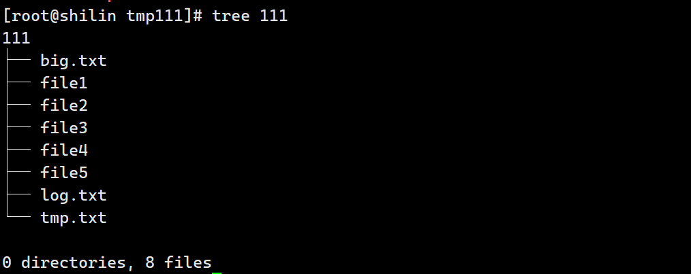

## 十一、tar指令【重要】
**tar [-cxtzjvf] 文件与目录 .... 参数：**

> + **-c ：建立一个压缩文件的参数指令(create 的意思)；**
> + **-x ：解开一个压缩文件的参数指令！**
> + -t ：查看 tarfile 里面的文件！
> + **-z ：是否同时具有 gzip 的属性？亦即是否需要用 gzip 压缩？**
> + -j ：是否同时具有 bzip2 的属性？亦即是否需要用 bzip2 压缩？
> + **-v ：压缩的过程中显示文件！这个常用，但不建议用在背景执行过程！**
> + -**f ：使用档名，请留意，在 f 之后要立即接档名喔！不要再加参数！**
> + **-C ： 解压到指定目录**
>

+ 根据上面的选项我们开始使用

```bash
tar -cvzf test.tgz 111
```

这四个选项就是压缩，比较常用

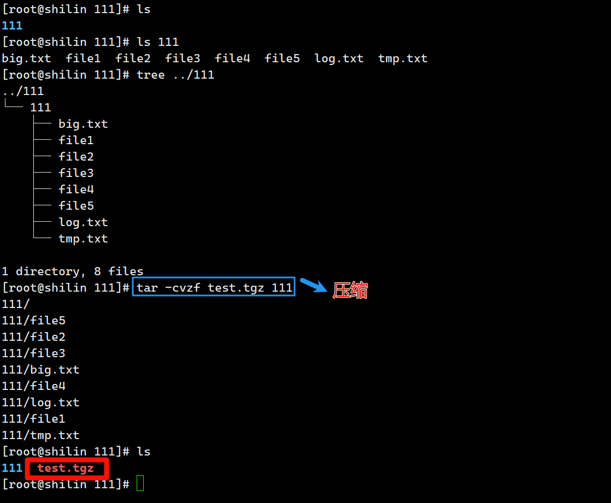

解压是4个选项

```bash
tar -xzvf test.tgz -C 222
```

这里的`-C`是指定路径

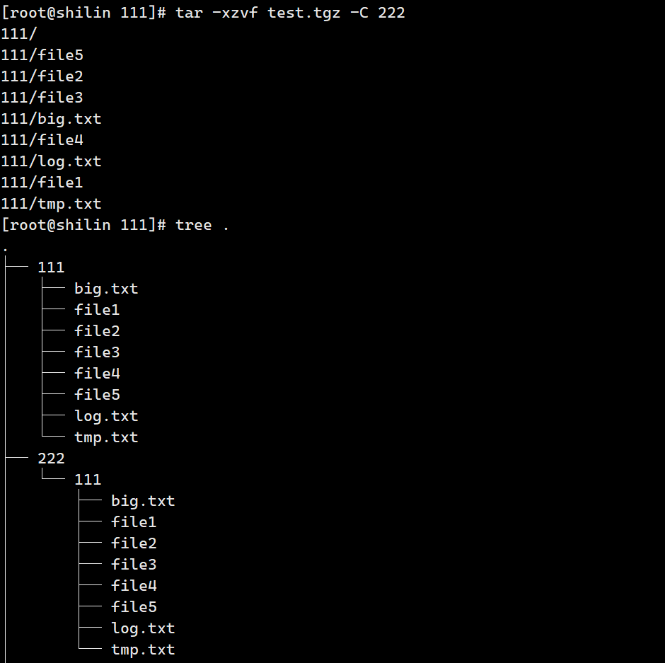

## 十二、bc指令
> bc命令可以很方便的进行各种运算
>

+ 这个命令没有什么可说的，直接输入就可以了，按下`ctrl + d`就退出了

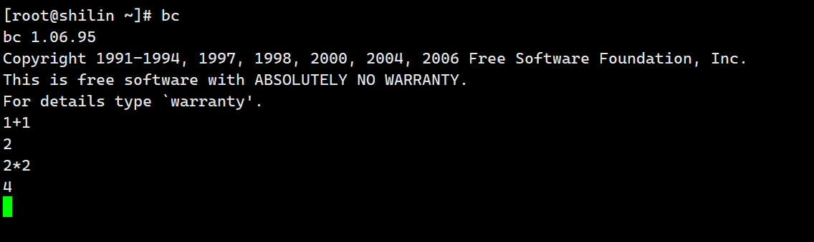

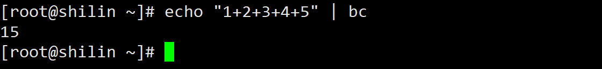

## 十三、uname –r指令
```bash
uname -r
```

**语法：** uname [选项]   
**功能：** uname用来获取电脑和操作系统的相关信息。  
**补充说明：** uname可显示linux主机所用的操作系统的版本、硬件的名称等基本信息。  
**常用选项：** -a或–all 详细输出所有信息，依次为内核名称，主机名，内核版本号，内核版本，硬件名，处理器类 型，硬件平台类型，操作系统名称

+ 这个命令也很简单，也就是直接使用，在需要的时候查看版本就可以了

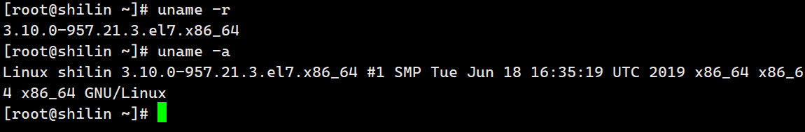

扩展命令：`lsb_release -a`

查看操作系统版本

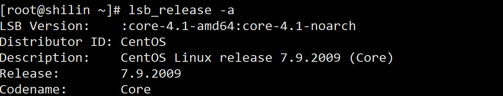

`uname –r`查硬件，`lsb_release -a`查软件

## 十三、关机指令
**语法**：shutdown [选项]

常见选项：

> + -h：将系统服务停止，立即关机
> + -r：在将系统的服务停掉之后就重新启动
> + -t sec：-t 后面加秒数，过秒后关机的意思
>

## 十四、<font style="color:rgb(31,35,41);">命令扩展</font>
**安装和登录命令：**login、shutdown、halt、reboot、install、mount、umount、chsh、

exit、last

**文件处理命令：**file、mkdir、grep、dd、find、mv、ls、diff、cat、ln

**系统管理相关命令：**df、top、free、quota、at、lp、adduser、groupadd、kill、crontab

**网络操作命令：**ifconfig、ip、ping、netstat、telnet、ftp、route、rlogin、rcp、finger、mail、nslookup

**系统安全相关命令：**passwd、su、umask、chgrp、chmod、chown、chattr、sudo ps、who

**其它命令：**tar、unzip、gunzip、unarj、mtools、man、unendcode、uudecode


