# Linux项目自动化构建工具之make_Makefile
## 一、背景
会不会写makefile，从一个侧面说明了一个人是否具备完成大型工程的能力

一个工程中的源文件不计数，其按类型、功能、模块分别放在若干个目录中，makefile定义了一系列的规则来指定，哪些文件需要先编译，哪些文件需要后编译，哪些文件需要重新编译，甚至于进行更复杂的功能操作makefile带来的好处就是——“自动化编译”，**一旦写好，只需要一个make命令，整个工程完全自动编译，极大的提高了软件开发的效率。**

make是一个命令工具，是一个解释makefile中指令的命令工具，一般来说，大多数的IDE都有这个命令，比如：Delphi的make，Visual C++的nmake，Linux下GNU的make。可见，makefile都成为了一种在工程方面的编译方法。

**make是一条命令，makefile是一个文件，两个搭配使用**，完成项目自动化构建。

## 二、如何使用？
make是一条命令，makefile是一个文件，下面我们来看一下：

+ 创建文件

```cpp
>makefile
```

+ 打开文件

```c
vim makefile
```

```bash
mytest:test.c
    gcc test.c -o mytest
```

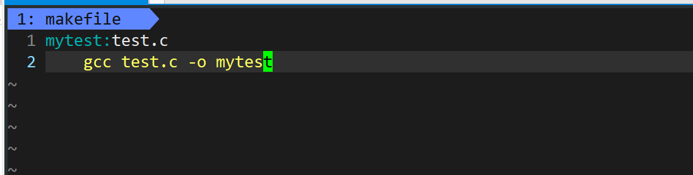

+ 最后在命令行输入`make`，**自动进行编译出可执行文件**

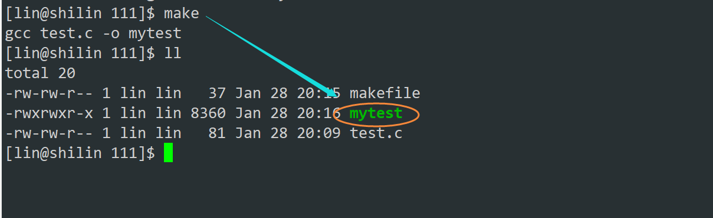

+ 我们再写一个清理文件

```bash
.PHONY:clean
clean:
    rm -f mytest
```

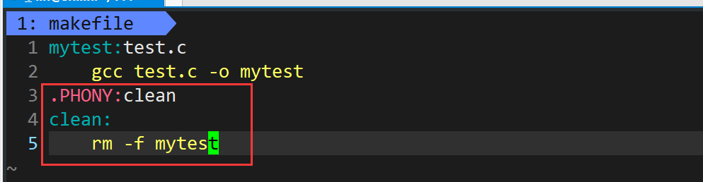

+ 再次执行`make clean`，就清理完成了

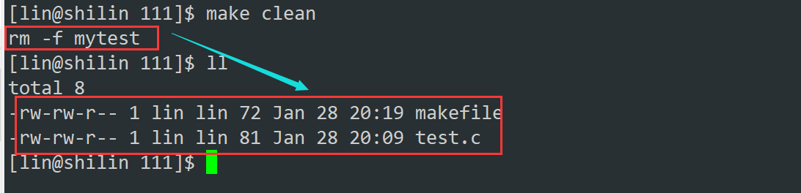

## 三、原理
+ **make**会根据**makefile**的内容，完成**编译/清理**工作

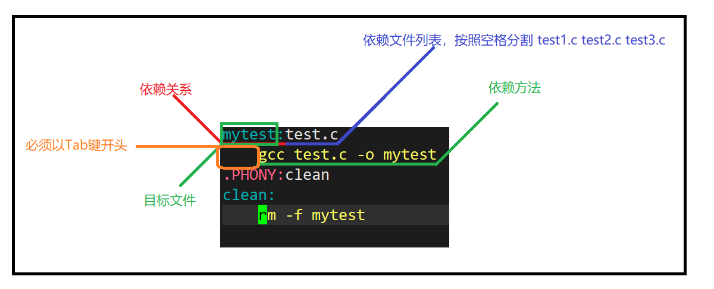

+ 我们在执行一下`make`
+ 执行到第二次的时候会发现不能执行了，已经是最新的

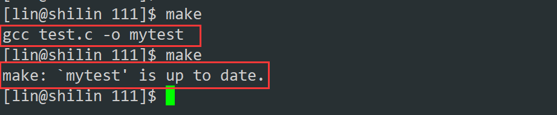

+ 执行`clean`的时候需要这样执行

```bash
make clean
```

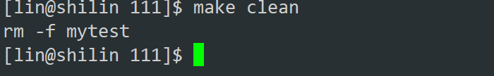

+ 那么也可以这样执行

```bash
make mytest
```

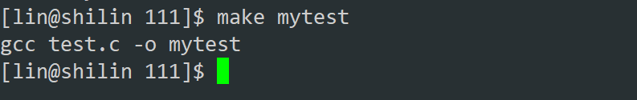

+ 我们在执行**make**的时候默认从上到下执行，**默认是执行一对依赖关系和依赖方法**

可是刚刚写的这个`.PHONY:clean`是什么东西呢？

+ 我们先不写试试：

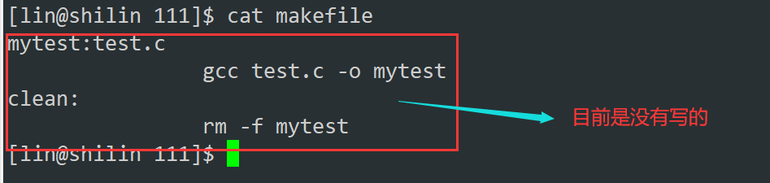

+ 下面执行的结果就只能执行一次，**再次执行就会提示已经是最新的了**

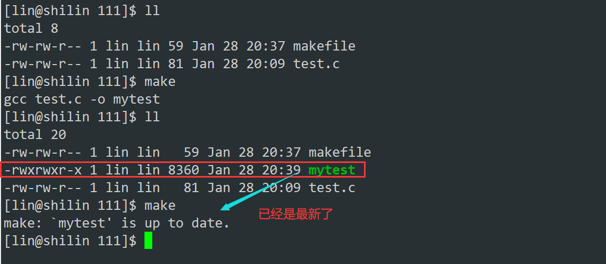

+ 这个时候我把`test.c`修改一下，然后再次执行

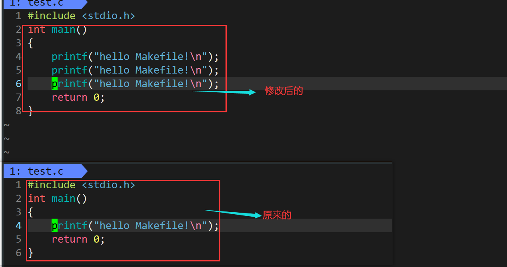

+ 再次执行make，也是一样的，修改文件后只能执行一次

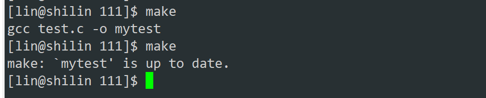

+ 那我就想让编译的这个操作一直被执行，不要给我提示

用`.PHONY`修饰的是一个伪目标：**伪目标总是被执行的**！

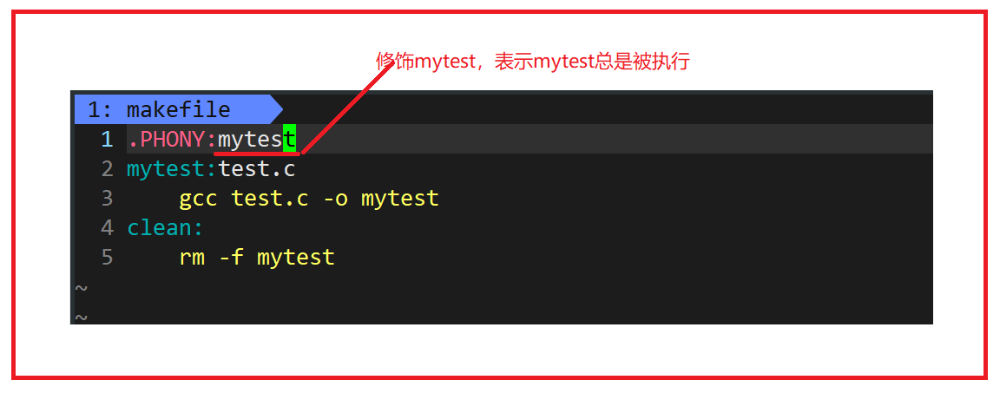

+ 所以一般写makefile的时候，**清理项目，希望总是被执行，所以被修饰**

## 四、关于make的问题
> 为什么makefile对最新的可执行程序，默认不想重新形成呢？是怎么做到的呢？
>

+ 在平时工作中一个项目很大，可能一次编译就要好几十分钟，如果可执行程序是新的就没有必要重复编译了，这样做的主要原因是为了提高效率
+ 其实我们可以使用stat命令来查看文件的最新修改时间

```bash
stat mytest
```

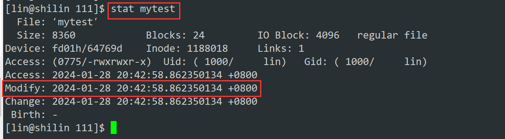

+ 源代码和可执行程序最近一次形成或修改的时间是**不可能**一样的

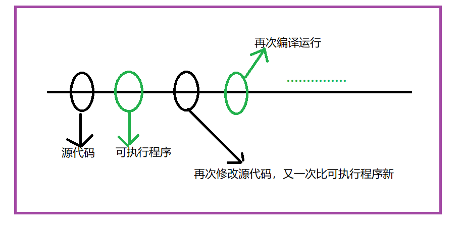

所以我们再次看下面

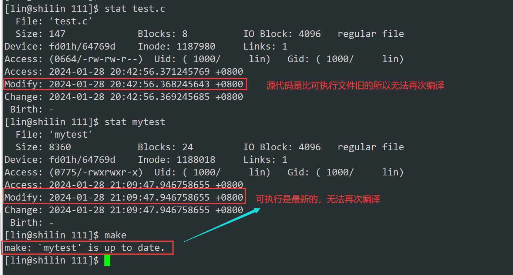

+ 这个时候更新一下源代码的最新时间

```bash
touch test.c
```

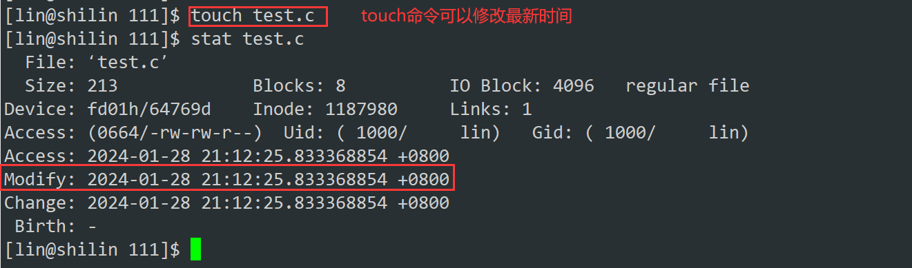

+ 就又可以编译了

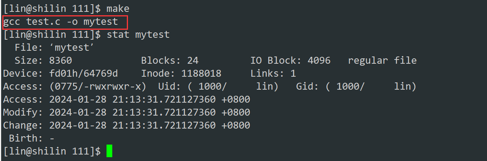

## 五、再次理解/编写makefile
+ 我们再次写了一个`makefile`，新学习两个符号`@` `^`

```bash
mytest:test.c    
    gcc -o $@ $^     
.PHONY:clean                                                                                                                           
clean:
    rm -f mytest 
```

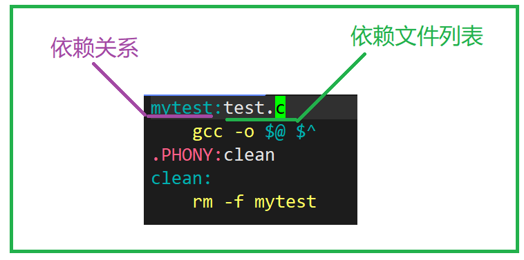

+ `$@`代表目标文件
+ `$^`依赖文件，今天的依赖文件列表只有一个，后面我们会有多个
    - `@`替换成依赖目标
    - `^`代表整个依赖文件列表
+ 所以我们在编译的时候`makefile`会自动给我们进行符号替换
+ `@`符号替换成目标文件，`^`替换成`test.c `
+ 我们再次写一个gcc编译C语言的**makefile**

```bash
hello:hello.o   
    gcc hello.o -o hello    
hello.o:hello.s     
    gcc -c hello.s -o hello.o    
hello.s:hello.i     
    gcc -S hello.i -o hello.s     
hello.i:hello.c     
    gcc -E hello.c -o hello.i
    
.PHONY:clean
clean:
  rm -f hello.i hello.s hello.o hello
```

### 依赖关系
+ 上面的文件 `hello` ,它依赖 `hell.o`
+ `hello.o` , 它依赖 `hello.s`
+ `hello.s` , 它依赖 `hello.i`
+ `hello.i` , 它依赖 `hello.c`

### 依赖方法
`gcc hello.* -option hello.*`,就是与之对应的依赖关系

+ 这个时候我们编译一下看看

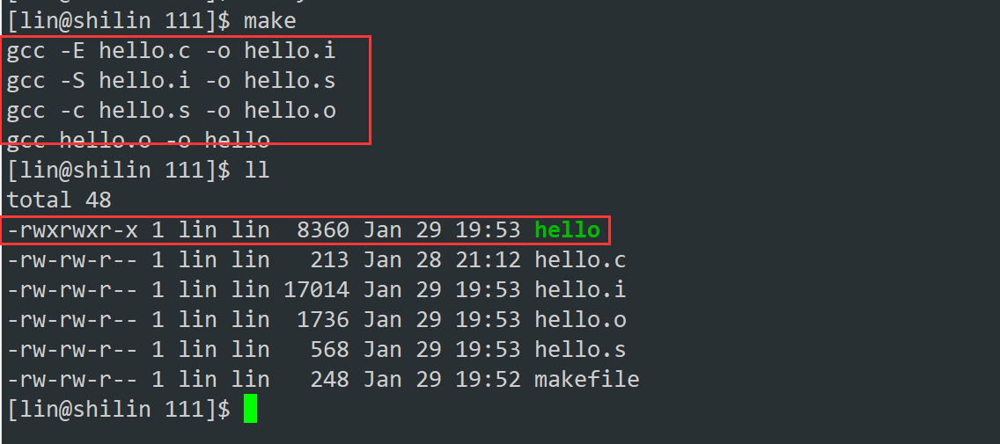

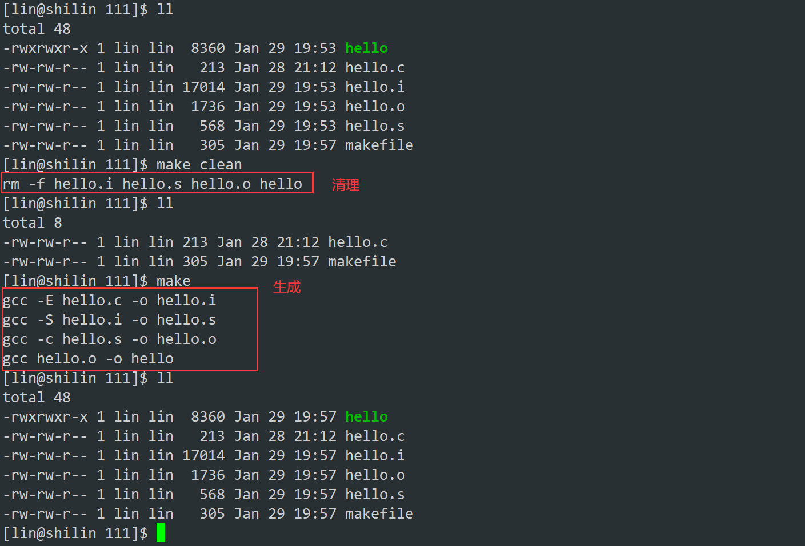

## 六、原理讲解
make是如何工作的，在默认的方式下，也就是我们只输入make命令。

1. make会在当前目录下找名字叫“Makefile”或“makefile”的文件。
2. 如果找到，它会找文件中的第一个目标文件（target），在上面的例子中，他会找到“hello”这个文件，并把这个文件作为最终的目标文件。
3. 如果hello文件不存在，或是hello所依赖的后面的hello.o文件的文件修改时间要比hello这个文件新（可以用 touch 测试），那么，他就会执行后面所定义的命令来生成hello这个文件。
4. 如果hello所依赖的hello.o文件不存在，那么make会在当前文件中找目标为hello.o文件的依赖性，如果找到则再根据那一个规则生成hello.o文件。（这有点像一个堆栈的过程）
5. 当然，你的C文件和H文件是存在的啦，于是make会生成 hello.o 文件，然后再用 hello.o 文件声明make的终极任务，也就是执行文件hello了。
6. 这就是整个make的依赖性，make会一层又一层地去找文件的依赖关系，直到最终编译出第一个目标文件。
7. 在找寻的过程中，如果出现错误，比如最后被依赖的文件找不到，那么make就会直接退出，并报错，而对于所定义的命令的错误，或是编译不成功，make根本不理。
8. make只管文件的依赖性，即，如果在我找了依赖关系之后，冒号后面的文件还是不在，那么对不起，我就不工作

### 项目清理
上面的makefile也写了清理

+ 像clean这种，没有被第一个目标文件直接或间接关联，那么它后面所定义的命令将不会被自动执行，不过，我们可以显示要make执行。即命令——“**make clean**”，以此来清除所有的目标文件，以便重编译。
+ 但是一般我们这种clean的目标文件，我们将它设置为伪目标,用 .PHONY 修饰,伪目标的特性是，总是被执行的。
+ 可以将我们的 hello 目标文件声明成伪目标，测试一下。

但是我们还是推荐我们这样写：

```bash
mytest:test.c
    gcc -o $@ $^ 
.PHONY:clean
clean:
    rm -f mytest
```

### makefile是支持变量的
> 我们还可以写成代码的样式：
>

+ 这里的`$()`就是提取括号里面的内容
+ makefie在执行的时候会自动替换括号里变量的内容

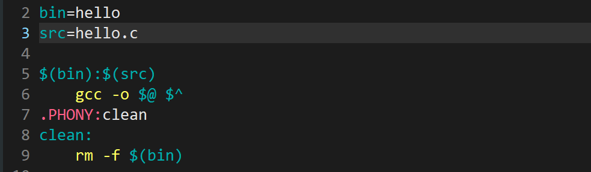

+ 保存退出，再次执行也是可以的

### 取消执行make后显示命令
+ 那我们打印的时候不想打印出这些咋做呢？

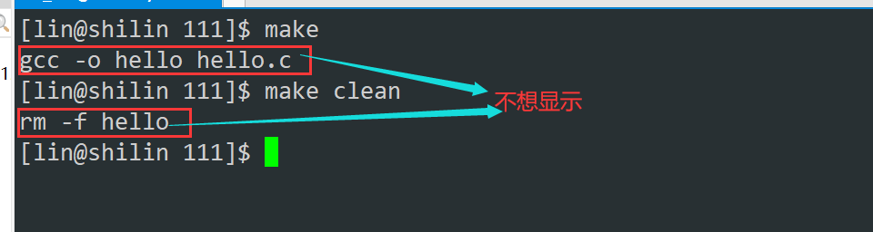

+ 那么我们就可以在这里加上一个`@`

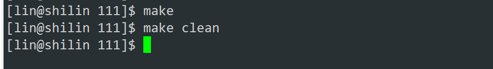

### 依赖方法可以多行
+ 这里的依赖方法可以多行，而且还可以使用变量

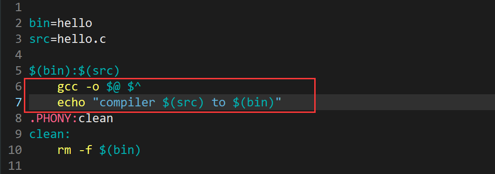

> 下面的依赖方法都是可以写shell命令的
>

## 七、补充语法
```shell
BIN=process               # 定义变量    
CC=gcc
SRC=$(wildcard *.c)       # 使用 wildcard 函数，获取当前所有.c文件名    
OBJ=$(SRC:.c=.o)          # 将SRC的所有同名.c 替换成为.o形成目标文件列表    
LFLAGS=-o                 # 链接选项
CFLAGS=-c                 # 编译选项
RM=rm -f                  # 引入命令
STD=-std=c11

$(BIN):$(OBJ)
	@$(CC) $(LFLAGS) $@ $^ $(STD)   # $@:代表目标文件名 $^:代表依赖文件列表
	@echo "链接$^ 成为 $@"
%.o:%.c                             # %.c 展开当前目录下所有的.c  %.o:同时展开同名.o     
	@$(CC) $(CFLAGS) $< $(STD)      # %<:对展开的依赖.c文件,一个一个的交给gcc    
	@echo "编译$< 成为 $@"          # @:不回显命令

.PHONY:clean
clean: 
	@$(RM) $(OBJ) $(BIN) 
	@echo "清理工程完毕"
```

