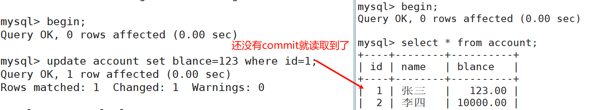
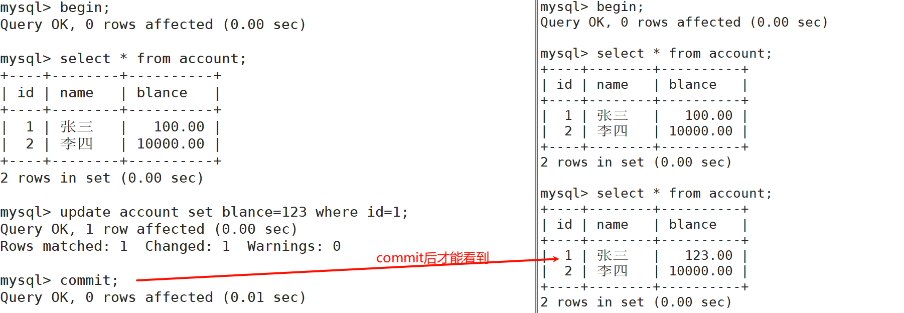
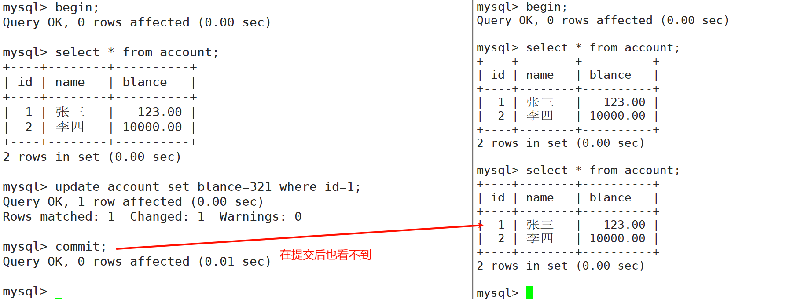
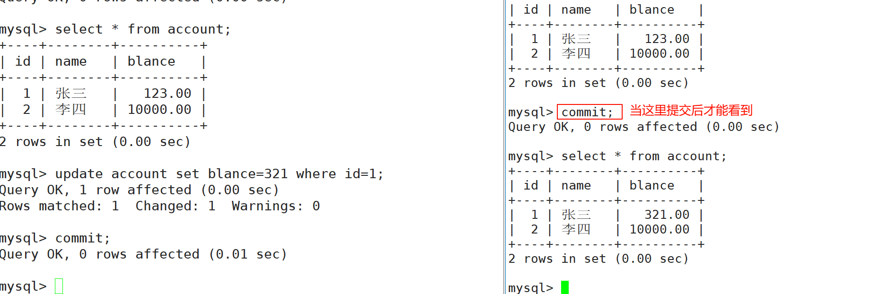
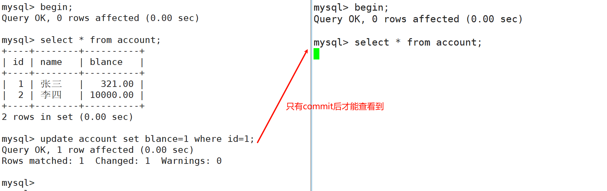
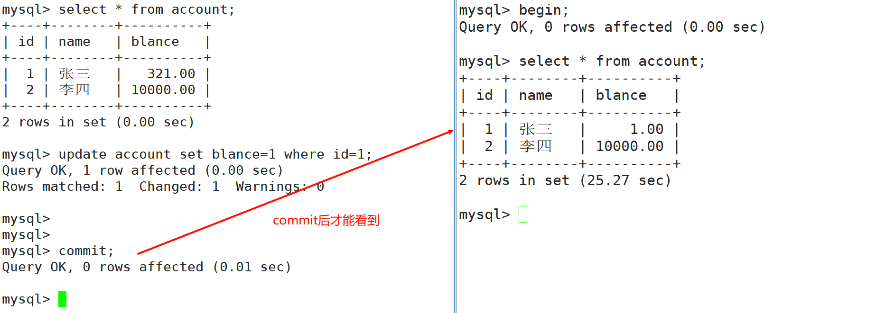
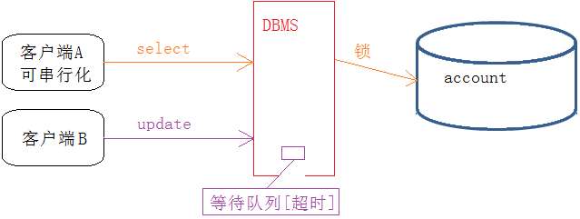

# 什么是事务
事务就是一组DML语句组成，这些语句在逻辑上存在相关性，这一组DML语句要么全部成功，要么全部失败，是一个整体。

+ 原子性（Atomicity，或称不可分割性） 
+ 一致性（Consistency）
+ 隔离性（Isolation，又称独立性） 
+ 持久性（Durability）。

事务本质上是为了应用层服务的

# 事务的版本支持
在 MySQL 中只有使用了 Innodb 数据库引擎的数据库或表才支持事务， MyISAM 不支持。

# 查看数据库引擎
```sql
show engines \G
```

# 事务提交方式
+ 自动提交
+ 手动提交

查看事务提交方式

```sql
mysql> show variables like 'autocommit';
+---------------+-------+
| Variable_name | Value |
+---------------+-------+
| autocommit    | OFF   |
+---------------+-------+
1 row in set (0.00 sec)
```

用 SET 来改变 MySQL 的自动提交模式：

`SET AUTOCOMMIT=0`禁止自动提交

```sql
mysql> SET AUTOCOMMIT=0;
Query OK, 0 rows affected (0.00 sec)

mysql> show variables like 'autocommit';
+---------------+-------+
| Variable_name | Value |
+---------------+-------+
| autocommit    | OFF   |
+---------------+-------+
1 row in set (0.00 sec)
```

`SET AUTOCOMMIT=1`开启自动提交

```sql
mysql> SET AUTOCOMMIT=1;
Query OK, 0 rows affected (0.00 sec)

mysql> show variables like 'autocommit';
+---------------+-------+
| Variable_name | Value |
+---------------+-------+
| autocommit    | ON    |
+---------------+-------+
```

# 事务常见操作方式
结论：

+ 只要输入`begin`或者`start transaction`，事务便必须要通过`commit`提交，才会持久化，与是否设置`set autocommit`无关。
+ 事务可以手动回滚，同时，当操作异常，MySQL会自动回滚对于InnoDB每一条SQL语言都默认封装成事务，自动提交。（select有特殊情况，因为MySQL 有MVCC ）

事务操作注意事项：

+ 如果没有设置保存点，也可以回滚，只能回滚到事务的开始。直接使用 rollback(前提是事务还没有提交)
+ 如果一个事务被提交了（commit），则不可以回退（rollback）
+ 可以选择回退到哪个保存点
+ InnoDB 支持事务， MyISAM 不支持事务

# 隔离级别
+ 读未提交【Read Uncommitted】： 在该隔离级别，所有的事务都可以看到其他事务没有提交的执行结果。（实际生产中不可能使用这种隔离级别的），但是相当于没有任何隔离性，也会有很多并发问题，如脏读，幻读，不可重复读等，我们上面为了做实验方便，用的就是这个隔离性。
+ 读提交【Read Committed】 ：该隔离级别是大多数数据库的默认的隔离级别（不是 MySQL 默认的）。它满足了隔离的简单定义:一个事务只能看到其他的已经提交的事务所做的改变。这种隔离级别会引起不可重复读，即一个事务执行时，如果多次 select， 可能得到不同的结果。
+ 可重复读【Repeatable Read】： 这是 MySQL 默认的隔离级别，它确保同一个事务，在执行中，多次读取操作数据时，会看到同样的数据行。但是会有幻读问题。
+ 串行化【Serializable】: 这是事务的最高隔离级别，它通过强制事务排序，使之不可能相互冲突， 从而解决了幻读的问题。它在每个读的数据行上面加上共享锁，。但是可能会导致超时和锁竞争 （这种隔离级别太极端，实际生产基本不使用）

<font style="color:rgb(77, 77, 77);">隔离级别如何实现：隔离，基本都是通过锁实现的，不同的隔离级别，锁的使用是不同的。常见有，表锁，行锁，读锁，写锁，间隙锁(GAP),Next-Key锁(GAP+行锁)等。</font>

# <font style="color:rgb(77, 77, 77);">查看与设置隔离性</font>
## 查看
<font style="color:rgb(77, 77, 77);">MySQL 5.7版本查看</font>

```sql
select @@tx_isolation;
```

<font style="color:rgb(77, 77, 77);">MySQL8查询事务应该使用</font>`<font style="color:rgb(77, 77, 77);">transaction_isolation</font>`<font style="color:rgb(77, 77, 77);">，</font>`<font style="color:rgb(77, 77, 77);">tx_isolation</font>`<font style="color:rgb(77, 77, 77);">在MySQL 5.7.20后被弃用。</font>

<font style="color:rgb(77, 77, 77);">输入以下命令查看事务隔离级别，其中transaction_isolation就是隔离级别</font>

```sql
mysql> show variables like 'transaction%';
+----------------------------------+-----------------+
| Variable_name                    | Value           |
+----------------------------------+-----------------+
| transaction_alloc_block_size     | 8192            |
| transaction_allow_batching       | OFF             |
| transaction_isolation            | REPEATABLE-READ |
| transaction_prealloc_size        | 4096            |
| transaction_read_only            | OFF             |
| transaction_write_set_extraction | XXHASH64        |
+----------------------------------+-----------------+
```

<font style="color:rgb(77, 77, 77);">或使用sql查看</font>

```sql
mysql> select @@transaction_isolation;
+-------------------------+
| @@transaction_isolation |
+-------------------------+
| REPEATABLE-READ         |
+-------------------------+
```

<font style="color:rgb(77, 77, 77);">mysql8</font>查看会话(当前)全局隔级别

```sql
mysql> select @@session.transaction_isolation;
+---------------------------------+
| @@session.transaction_isolation |
+---------------------------------+
| REPEATABLE-READ                 |
+---------------------------------+
1 row in set (0.00 sec)
```

<font style="color:rgb(77, 77, 77);">mysql5.7查看</font>

```sql
SELECT @@session.tx_isolation;
```

## <font style="color:rgb(77, 77, 77);">设置</font>
### <font style="color:rgb(77, 77, 77);">设置当前会话隔离性</font>
<font style="color:rgb(77, 77, 77);">设置串行化</font>

```sql
set session transaction isolation level serializable; 
```

+ 查看mysql8.0

```sql
mysql> select @@global.transaction_isolation; -- 查看全局
+--------------------------------+
| @@global.transaction_isolation |
+--------------------------------+
| REPEATABLE-READ                |
+--------------------------------+
1 row in set (0.00 sec)

mysql> select @@session.transaction_isolation; -- 查当前会话
+---------------------------------+
| @@session.transaction_isolation |
+---------------------------------+
| SERIALIZABLE                    |
+---------------------------------+
1 row in set (0.00 sec)

mysql> select @@transaction_isolation;
+-------------------------+
| @@transaction_isolation |
+-------------------------+
| SERIALIZABLE            |
+-------------------------+
1 row in set (0.00 sec)
```

+ 查看5.7

```sql
SELECT @@global.tx_isolation; -- 查看全局
SELECT @@session.tx_isolation; -- 查看当前会话
SELECT @@tx_isolation;
```

### <font style="color:rgb(77, 77, 77);">设置全局隔离性</font>
```sql
set global transaction isolation level READ UNCOMMITTED;
```

+ 查看：同上

## <font style="color:rgb(77, 77, 77);">读未提交【Read Uncommitted】</font>
+ <font style="color:rgb(77, 77, 77);">几乎没有加锁，虽然效率高，但是问题太多，严重不建议采用</font>

```sql

mysql> set global transaction isolation level read uncommitted; -- 设置
Query OK, 0 rows affected (0.00 sec)

-- 重新登录
mysql> quit
Bye

mysql> select @@transaction_isolation; -- 查看
+-------------------------+
| @@transaction_isolation |
+-------------------------+
| READ-UNCOMMITTED        |
+-------------------------+
1 row in set (0.00 sec)
```

+ 创建测试表

```sql
create table if not exists account(
  id int primary key,
  name varchar(50) not null default '',
  blance decimal(10,2) not null default 0.0
)ENGINE=InnoDB DEFAULT CHARSET=UTF8;
```

+ 插入数据

```sql
insert into account values(1, '张三', 100.0),(2, '李四', 10000.0);
```

+ <font style="color:rgb(77, 77, 77);">一个事务在执行中，读到另一个执行中事务的更新(或其他操作)但是未commit的数据，这种现象叫做脏读(dirty read)</font>



## <font style="color:rgb(77, 77, 77);">读提交【Read Committed】</font>
+ 设置

```sql
set global transaction isolation level read committed;
```

<font style="color:rgb(77, 77, 77);">重启客户端后再开启事务</font>



<font style="color:rgb(77, 77, 77);">此时还在当前事务中，并未commit，那么就造成了，同一个事务内，同样的读取，在不同的时间段(依旧还在事务操作中！)，读取到了不同的值，这种现象叫做不可重复读(non reapeatable read)！！</font>

## <font style="color:rgb(77, 77, 77);">可重复读【Repeatable Read】</font>
+ 设置

```sql
set global transaction isolation level repeatable read;
```

+ 关闭终端重启后开启事务





## 串行化【serializable】
<font style="color:rgb(77, 77, 77);">对所有操作全部加锁，进行串行化，不会有问题，但是只要串行化，效率很低，几乎完全不会被采用</font>

+ 设置

```sql
set global transaction isolation level serializable;
```

+ 关闭终端重启后开启事务







<font style="color:rgb(77, 77, 77);">总结：</font>

<font style="color:rgb(77, 77, 77);">其中隔离级别越严格，安全性越高，但数据库的并发性能也就越低，往往需要在两者之间找一个平衡点。</font>

<font style="color:rgb(77, 77, 77);">不可重复读的重点是修改和删除：同样的条件, 你读取过的数据,再次读取出来发现值不一样了幻读的重点在于新增：同样的条件, 第1次和第2次读出来的记录数不一样</font>

<font style="color:rgb(77, 77, 77);">说明： mysql 默认的隔离级别是可重复读，一般情况下不要修改上面的例子可以看出，事务也有长短事务这样的概念。事务间互相影响，指的是事务在并行执行的时候，即都没有commit的时候，影响会比较大。</font>

# <font style="color:rgb(77, 77, 77);">数据库并发的场景有三种</font>
<font style="color:rgb(77, 77, 77);">读-读：不存在任何问题，也不需要并发控制</font>

<font style="color:rgb(77, 77, 77);">读-写：有线程安全问题，可能会造成事务隔离性问题，可能遇到脏读，幻读，不可重复读</font>

<font style="color:rgb(77, 77, 77);">写-写：有线程安全问题，可能会存在更新丢失问题，比如第一类更新丢失，第二类更新丢失</font>

