# 日期函数
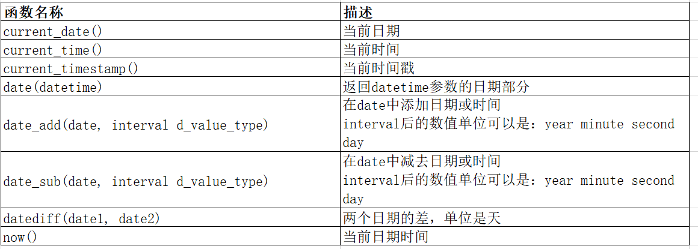

获得年月日：

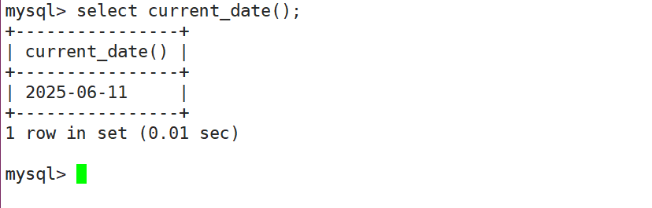

获得时分秒：

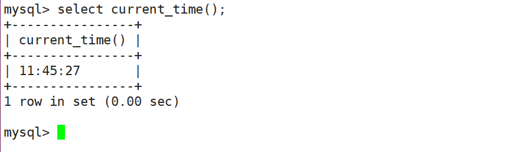

获得时间戳：

+ 自动转换成了日期和时间

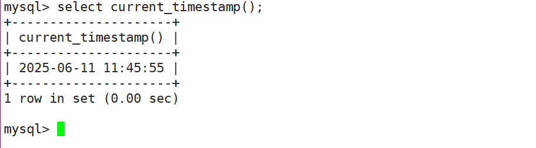

在日期的基础上加日期：

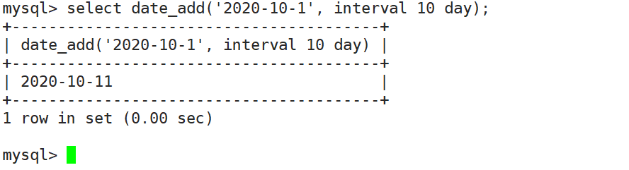

在日期的基础上减去时间：

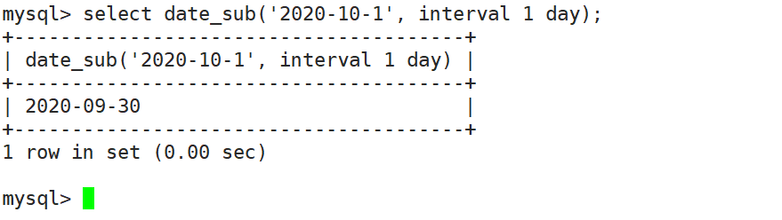

计算两个日期之间相差多少天：

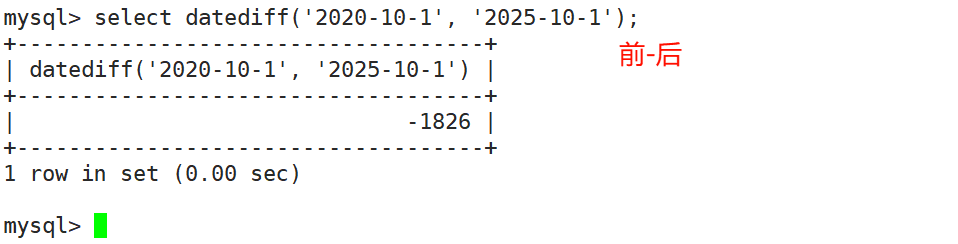

## 案例
创建一个留言表

```sql
create table msg (
  id int primary key auto_increment,
  content varchar(30) not null,
  sendtime datetime
);
```

插入数据

```sql
insert into msg(content,sendtime) values('hello1', now());
insert into msg(content,sendtime) values('hello2', now());
```

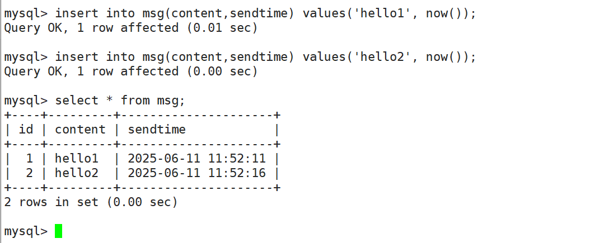

显示所有留言信息，发布日期只显示日期，不用显示时间

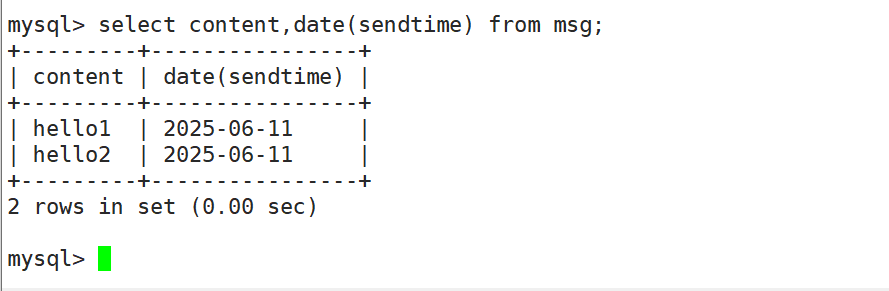

请查询在2分钟内发布的帖子

```sql
select * from msg where date_add(sendtime, interval 2 minute) > now();
```

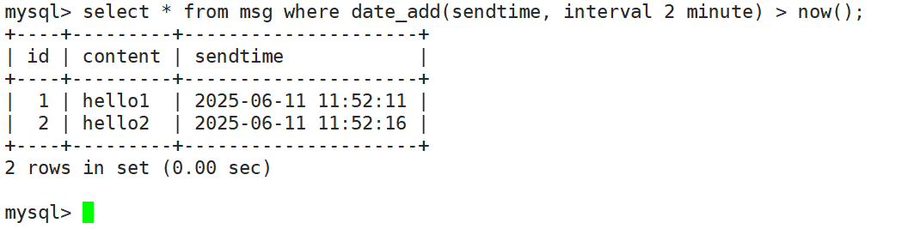

# 字符串函数
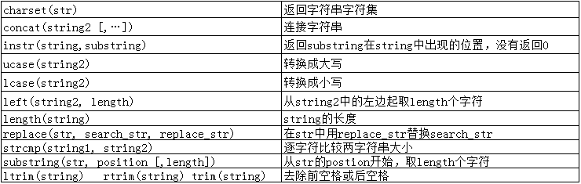

## 案例
获取emp表的ename列的字符集

```sql
select charset(ename) from emp;
```

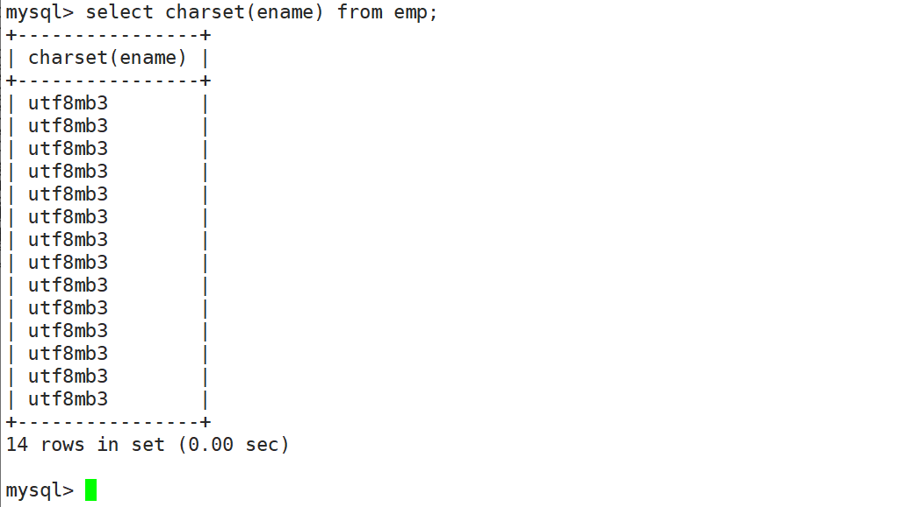

要求显示`exam_result`表中的信息，显示格式：“XXX的语文是XXX分，数学XXX分，英语XXX分”

```sql
mysql> select concat(name, '的语文是',chinese,'分，数学是',math,'分') as '分数' from exam_result;
+--------------------------------------------------+
| 分数                                             |
+--------------------------------------------------+
| 唐三藏的语文是67.0分，数学是99.0分               |
| 孙悟空的语文是87.5分，数学是78.0分               |
| 猪悟能的语文是88.0分，数学是98.5分               |
| 曹 孟德的语文是82.0分，数学是84.0分              |
| 刘玄德的语文是55.5分，数学是86.0分               |
| 孙权的语文是70.0分，数学是73.0分                 |
| 宋公明的语文是75.0分，数学是66.0分               |
+--------------------------------------------------+
7 rows in set (0.00 sec)
```

求学生表中学生姓名占用的**字节数**

+ 注意：length函数返回字符串长度，以字节为单位。如果是多字节字符则计算多个字节数；如果是单字节字符则算作一个字节。比如：字母，数字算作一个字节，中文表示多个字节数（与字符集编码有关）

```sql
mysql> select length(name), name from exam_result;
+--------------+------------+
| length(name) | name       |
+--------------+------------+
|            9 | 唐三藏     |
|            9 | 孙悟空     |
|            9 | 猪悟能     |
|           10 | 曹 孟德    |
|            9 | 刘玄德     |
|            6 | 孙权       |
|            9 | 宋公明     |
+--------------+------------+
7 rows in set (0.00 sec)
```

将EMP表中所有名字中有S的替换成'上海'

```sql
mysql> select replace(ename, 'S', '上海'), ename from emp;
+-------------------------------+--------+
| replace(ename, 'S', '上海')   | ename  |
+-------------------------------+--------+
| 上海MITH                      | SMITH  |
| ALLEN                         | ALLEN  |
| WARD                          | WARD   |
| JONE上海                      | JONES  |
| MARTIN                        | MARTIN |
| BLAKE                         | BLAKE  |
| CLARK                         | CLARK  |
| 上海COTT                      | SCOTT  |
| KING                          | KING   |
| TURNER                        | TURNER |
| ADAM上海                      | ADAMS  |
| JAME上海                      | JAMES  |
| FORD                          | FORD   |
| MILLER                        | MILLER |
+-------------------------------+--------+
14 rows in set (0.00 sec)
```

截取EMP表中ename字段的第二个到第三个字符

```sql
mysql> select substring(ename, 2, 2), ename from emp;
+------------------------+--------+
| substring(ename, 2, 2) | ename  |
+------------------------+--------+
| MI                     | SMITH  |
| LL                     | ALLEN  |
| AR                     | WARD   |
| ON                     | JONES  |
| AR                     | MARTIN |
| LA                     | BLAKE  |
| LA                     | CLARK  |
| CO                     | SCOTT  |
| IN                     | KING   |
| UR                     | TURNER |
| DA                     | ADAMS  |
| AM                     | JAMES  |
| OR                     | FORD   |
| IL                     | MILLER |
+------------------------+--------+
14 rows in set (0.01 sec)
```

以首字母小写的方式显示所有员工的姓名

```sql
mysql> select concat(lcase(substring(ename, 1, 1)), substring(ename, 2)) from emp;
+------------------------------------------------------------+
| concat(lcase(substring(ename, 1, 1)), substring(ename, 2)) |
+------------------------------------------------------------+
| sMITH                                                      |
| aLLEN                                                      |
| wARD                                                       |
| jONES                                                      |
| mARTIN                                                     |
| bLAKE                                                      |
| cLARK                                                      |
| sCOTT                                                      |
| kING                                                       |
| tURNER                                                     |
| aDAMS                                                      |
| jAMES                                                      |
| fORD                                                       |
| mILLER                                                     |
+------------------------------------------------------------+
14 rows in set (0.00 sec)
```

# 数学函数
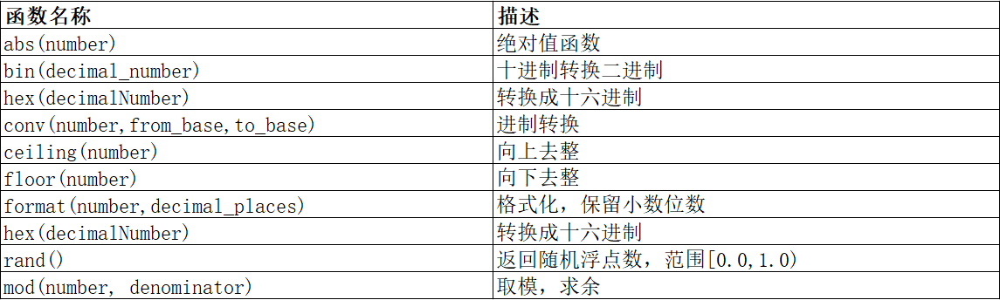

绝对值

```sql
mysql> select abs(-100.2);
+-------------+
| abs(-100.2) |
+-------------+
|       100.2 |
+-------------+
1 row in set (0.00 sec)
```

向上取整

```sql
mysql> select ceiling(23.01);
+----------------+
| ceiling(23.01) |
+----------------+
|             24 |
+----------------+
1 row in set (0.00 sec)
```

向下取整

```sql
mysql> select floor(23.9);
+-------------+
| floor(23.9) |
+-------------+
|          23 |
+-------------+
1 row in set (0.00 sec)
```

保留2位小数位数（小数四舍五入)

```sql
mysql> select format(3.1415, 2);
+-------------------+
| format(3.1415, 2) |
+-------------------+
| 3.14              |
+-------------------+
1 row in set (0.00 sec)
```

产生随机数

```sql
mysql> select rand();
+----------------------+
| rand()               |
+----------------------+
| 0.015211693956713838 |
+----------------------+
1 row in set (0.00 sec)
```

# 其它函数
user() 查询当前用户

```sql
mysql> select user();
+----------------+
| user()         |
+----------------+
| root@localhost |
+----------------+
1 row in set (0.00 sec)
```

md5(str)对一个字符串进行md5摘要，摘要后得到一个32位字符串

```sql
mysql> select md5('admin');
+----------------------------------+
| md5('admin')                     |
+----------------------------------+
| 21232f297a57a5a743894a0e4a801fc3 |
+----------------------------------+
1 row in set (0.00 sec)
```

database()显示当前正在使用的数据库

```sql
mysql> select database();
+------------+
| database() |
+------------+
| scott      |
+------------+
1 row in set (0.00 sec)
```

ifnull（val1， val2） 如果val1为null，返回val2，否则返回val1的值

```sql
mysql> select ifnull('abc', '123');
+----------------------+
| ifnull('abc', '123') |
+----------------------+
| abc                  |
+----------------------+
1 row in set (0.00 sec)

mysql> select ifnull(null, '123');
+---------------------+
| ifnull(null, '123') |
+---------------------+
| 123                 |
+---------------------+
1 row in set (0.00 sec)
```

