## 一、数据库基本操作
### 1.查看当前数据库
```sql
show databases;
```

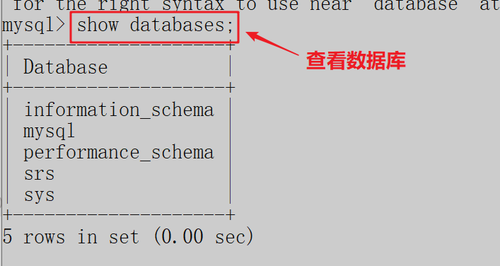

其中，set有两个概念

1. 集合(HashSet)
2. 这种(get / set)  
sec=>second(秒)
+ `show` 和 `databases`之间有一个或者多个空格
+ 注意是`databases`，不是`database`
+ 使用英文分号结尾（客户端里任何一个sql都需要使用分号来结尾）
+ 执行完一个sql之后，会得到一个反馈,反馈会会告诉咱们，当前执行结果有多少行记录，以及消耗多长时间~~

### 2.创建数据库
```sql
create  database [数据库名];
```

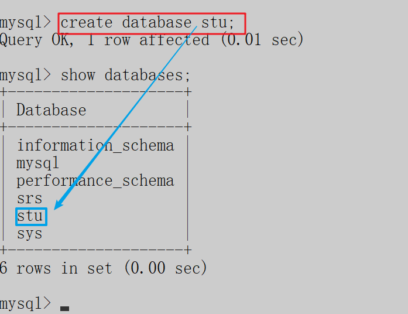

+ 是database,不是databases！！！
+ stu是数据库名字，数字，字母，下划线，数字不能开头,名字不能是sql中的关键字!!! 
+ 如果就是想拿关键字作为数据库~~可以使用反引号```把数据库名给引起来!!!
+ 创建数据库的时候,名字不能重复
+ 写sql的时候,sql的关键字啥的都是大小写不敏感的,大写和小写是一样的
+ 创建数据库的时候,还可以指定字符集~~

> 什么是字符集?
>

+ 计算机中，表示一个汉字，需要几个字节?  
不同的字符集下，结果是不同的，平时常用的字符集：
    - gbk (windows简体中文版,默认字符集)(2个字节表示一个汉字)
    - utf8 (更通用的字符集,不仅仅能表示中文)(通常是3个字节表示一个汉字)(在C语言中,VS默认也是gbk,所以你看到的一个汉字是两个字节)如果不指定字符集(用默认的),很可能插入中文就失败  
一般情况下,编程中都是使用`utf8`
    - unicode(算编码方式,严格的说不能算是一个完全的字符集)

#### 字符集和校验规则
```sql
show variables like 'character_set_database'; 
show variables like 'collation_database';
```

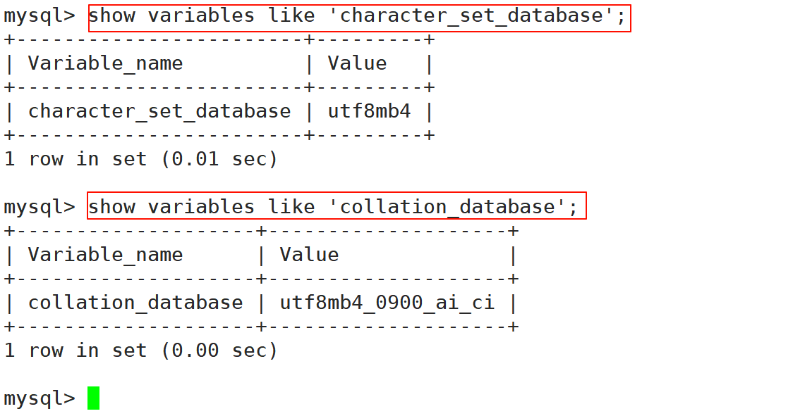

#### 查看数据库支持的字符集
```sql
show charset;
```

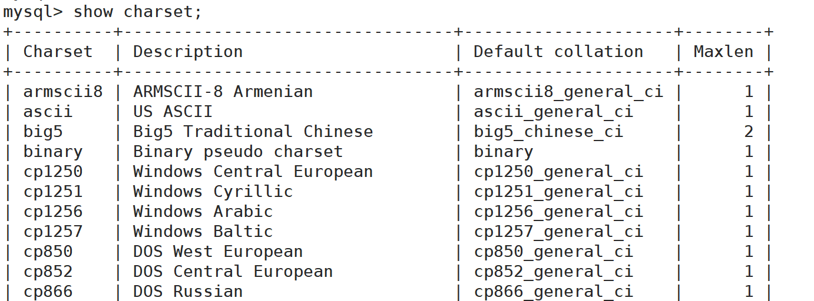

最常用的也就几个例如：**utf-8、gbk**

#### 查看数据库支持的字符集校验规则
```sql
show collation;
```

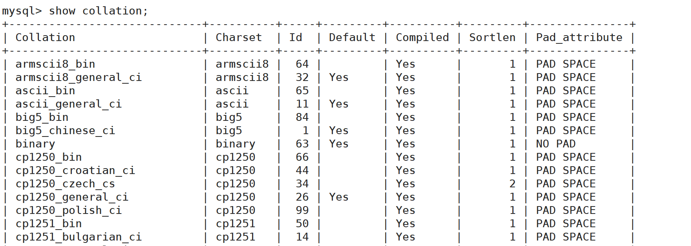

#### 设置数据库编码格式


字符集主要是控制用什么语言。比如utf8就可以使用中文。

#### 校验规则对数据库的影响
1. 不区分大小写

创建一个数据库，校验规则使用`utf8_ general_ ci`[不区分大小写]

```sql
mysql> create database test1 collate utf8_general_ci;
Query OK, 1 row affected, 1 warning (0.01 sec)

mysql> use test1;
Database changed
mysql> create table person(name varchar(20));
Query OK, 0 rows affected (0.04 sec)

mysql> insert into person values('a');
Query OK, 1 row affected (0.01 sec)

mysql> insert into person values('A');
Query OK, 1 row affected (0.00 sec)

mysql> insert into person values('b');
Query OK, 1 row affected (0.00 sec)

mysql> insert into person values('B');
Query OK, 1 row affected (0.01 sec)
```

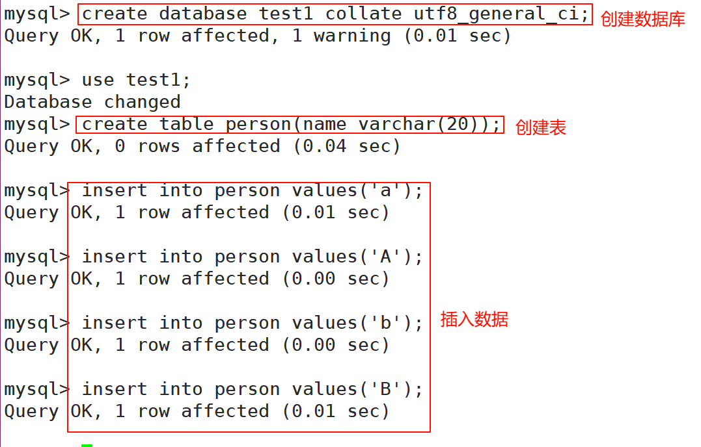

```sql
mysql> show tables;
+-----------------+
| Tables_in_test1 |
+-----------------+
| person          |
+-----------------+
1 row in set (0.00 sec)

mysql> select * from person where name='a';
+------+
| name |
+------+
| a    |
| A    |
+------+
2 rows in set (0.00 sec)
```

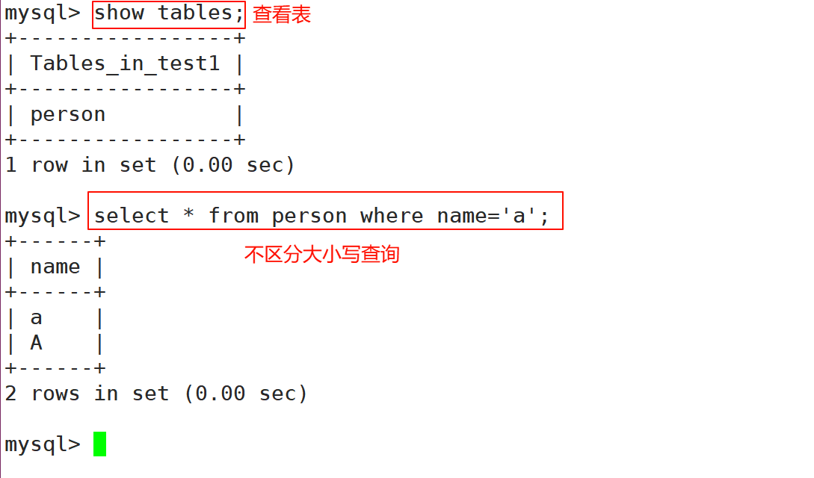

2. 区分大小写

```sql
mysql> create database test2 collate utf8_bin;
Query OK, 1 row affected, 1 warning (0.01 sec)

mysql> use test2;
Database changed
mysql> create table person(name varchar(20));
Query OK, 0 rows affected (0.03 sec)

mysql> insert into person value('a');
Query OK, 1 row affected (0.01 sec)

mysql> insert into person value('A');
Query OK, 1 row affected (0.00 sec)

mysql> insert into person value('b');
Query OK, 1 row affected (0.01 sec)

mysql> insert into person value('B');
Query OK, 1 row affected (0.00 sec)
```

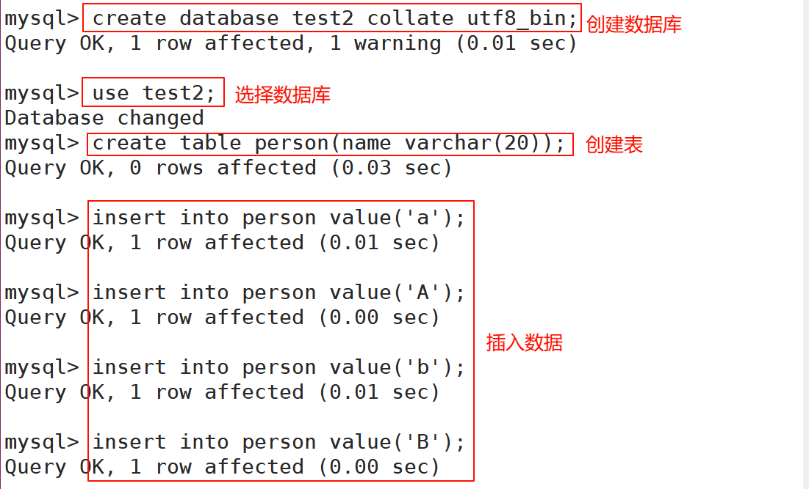

```sql
mysql> show tables;
+-----------------+
| Tables_in_test2 |
+-----------------+
| person          |
+-----------------+
1 row in set (0.00 sec)

mysql> select * from person;
+------+
| name |
+------+
| a    |
| A    |
| b    |
| B    |
+------+
4 rows in set (0.00 sec)

mysql> select * from person where name='a';
+------+
| name |
+------+
| a    |
+------+
1 row in set (0.00 sec)

```

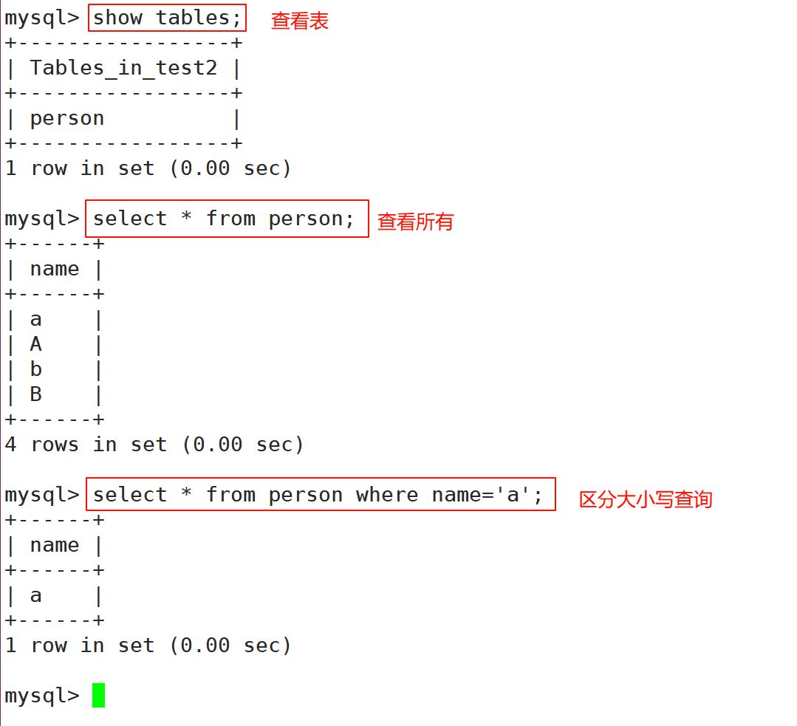

### 3.选中数据库
```sql
use 数据库名;
```

选中之后,会有个提示  
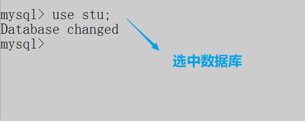

### 4.删除数据库
```sql
drop database 数据库名;
```

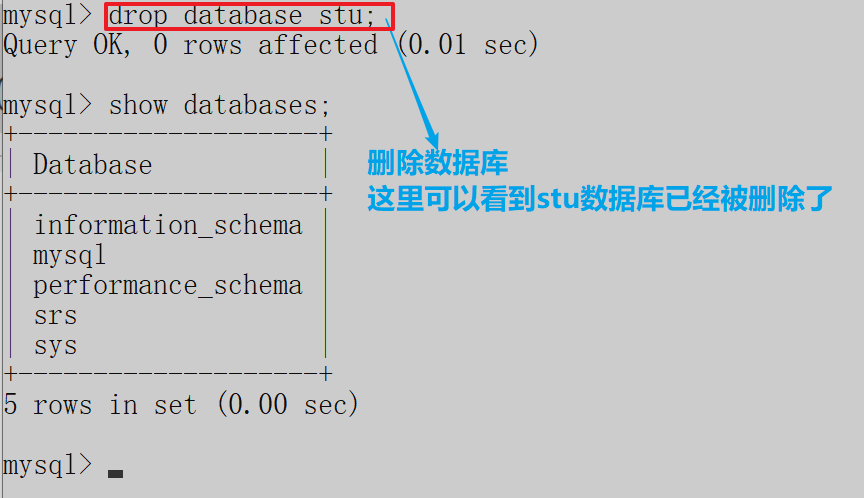

**注意:**  
删除操作非常非常危险!!!  
一旦删除了,数据就没有了,难以恢复~~   毁灭性打击

> 那么删库有办法恢复吗?
>

理论上有!!!,但是,恢复比较复杂,而且不能保证能100%恢复回来  
其实,计算机删除硬盘数据是逻辑删除(把这个数据标记成无效,而不是把数据抹掉)  
如果真删库了,赶紧停机~~,把硬盘拿下来,交给专业团队进行恢复,还有很大概率恢复出来的.

### 5.备份和恢复
1. 备份

```sql
mysqldump -P3306 -u root -p 密码 -B 数据库名 > 数据库备份存储的文件路径
```

例如：

```sql
mysqldump -P3306 -uroot -p123456 -B test1 > mysqltest.sql
```

```sql
-- MySQL dump 10.13  Distrib 8.0.42, for Linux (x86_64)
--
-- Host: localhost    Database: test1
-- ------------------------------------------------------
-- Server version	8.0.42-0ubuntu0.20.04.1

/*!40101 SET @OLD_CHARACTER_SET_CLIENT=@@CHARACTER_SET_CLIENT */;
/*!40101 SET @OLD_CHARACTER_SET_RESULTS=@@CHARACTER_SET_RESULTS */;
/*!40101 SET @OLD_COLLATION_CONNECTION=@@COLLATION_CONNECTION */;
/*!50503 SET NAMES utf8mb4 */;
/*!40103 SET @OLD_TIME_ZONE=@@TIME_ZONE */;
/*!40103 SET TIME_ZONE='+00:00' */;
/*!40014 SET @OLD_UNIQUE_CHECKS=@@UNIQUE_CHECKS, UNIQUE_CHECKS=0 */;
/*!40014 SET @OLD_FOREIGN_KEY_CHECKS=@@FOREIGN_KEY_CHECKS, FOREIGN_KEY_CHECKS=0 */;
/*!40101 SET @OLD_SQL_MODE=@@SQL_MODE, SQL_MODE='NO_AUTO_VALUE_ON_ZERO' */;
/*!40111 SET @OLD_SQL_NOTES=@@SQL_NOTES, SQL_NOTES=0 */;

--
-- Current Database: `test1`
--

CREATE DATABASE /*!32312 IF NOT EXISTS*/ `test1` /*!40100 DEFAULT CHARACTER SET utf8mb3 */ /*!80016 DEFAULT ENCRYPTION='N' */;

USE `test1`;

--
-- Table structure for table `person`
--

DROP TABLE IF EXISTS `person`;
/*!40101 SET @saved_cs_client     = @@character_set_client */;
/*!50503 SET character_set_client = utf8mb4 */;
CREATE TABLE `person` (
  `name` varchar(20) DEFAULT NULL
) ENGINE=InnoDB DEFAULT CHARSET=utf8mb3;
/*!40101 SET character_set_client = @saved_cs_client */;

--
-- Dumping data for table `person`
--

LOCK TABLES `person` WRITE;
/*!40000 ALTER TABLE `person` DISABLE KEYS */;
INSERT INTO `person` VALUES ('a'),('A'),('b'),('B');
/*!40000 ALTER TABLE `person` ENABLE KEYS */;
UNLOCK TABLES;
/*!40103 SET TIME_ZONE=@OLD_TIME_ZONE */;

/*!40101 SET SQL_MODE=@OLD_SQL_MODE */;
/*!40014 SET FOREIGN_KEY_CHECKS=@OLD_FOREIGN_KEY_CHECKS */;
/*!40014 SET UNIQUE_CHECKS=@OLD_UNIQUE_CHECKS */;
/*!40101 SET CHARACTER_SET_CLIENT=@OLD_CHARACTER_SET_CLIENT */;
/*!40101 SET CHARACTER_SET_RESULTS=@OLD_CHARACTER_SET_RESULTS */;
/*!40101 SET COLLATION_CONNECTION=@OLD_COLLATION_CONNECTION */;
/*!40111 SET SQL_NOTES=@OLD_SQL_NOTES */;

-- Dump completed on 2025-05-24 15:24:48
```

这时，可以打开看看 mytest.sql 文件里的内容，其实把我们整个创建数据库，建表，导入数据的语句都装载到了这个文件中。

2. 恢复

```sql
source 文件路径;
```

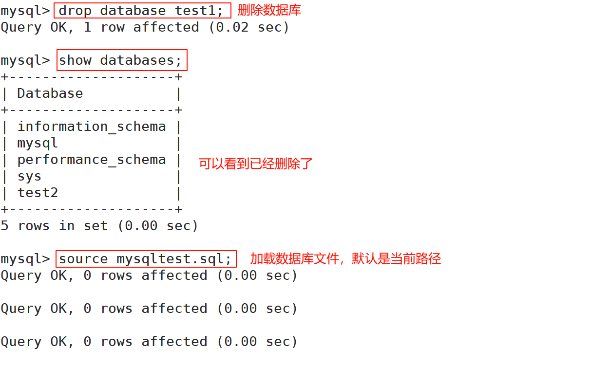

再次查看就已经有了：

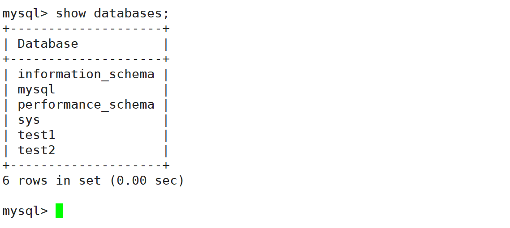

如果备份的不是整个数据库，而是其中的一张表，怎么做？

```sql
mysqldump -u root -p 数据库名 表名1 表名2 > D:/mytest.sql
```

同时备份多个数据库

```sql
mysqldump -u root -p -B 数据库名1 数据库名2 ... > 数据库存放路径
```

如果备份一个数据库时，没有带上`-B`参数， 在恢复数据库时，需要先创建空数据库，然后使用数据库，再使用`source`来还原。

### 6.查看当前数据库连接情况
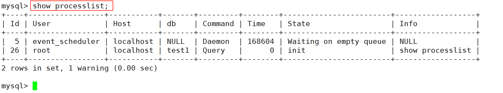

可以告诉我们当前有哪些用户连接到我们的MySQL，如果查出某个用户不是你正常登陆的，很有可能你的数据库被人入侵了。以后大家发现自己数据库比较慢时，可以用这个指令来查看数据库连接情况。

## 二、表操作
### 1.查看数据库中的表
```sql
show tables;
```

+ 这个操作有一个大前提,就是要先选中数据库才能操作表!!!

选中数据库

```sql
use 数据库名;
```

个别sql不输入，也能直接执行，但是我们无脑加`;`就好了  
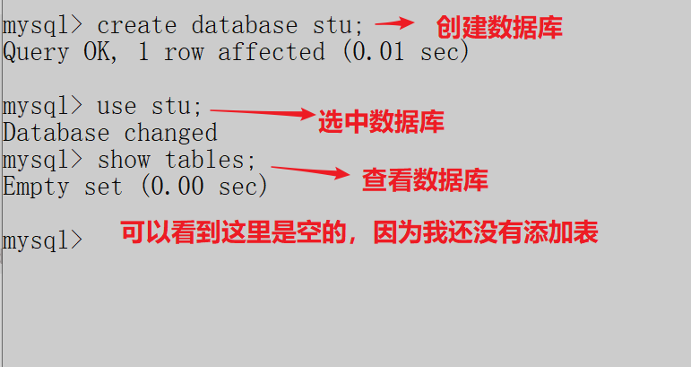

确认自己是在某个数据库中：

```sql
select database();
```

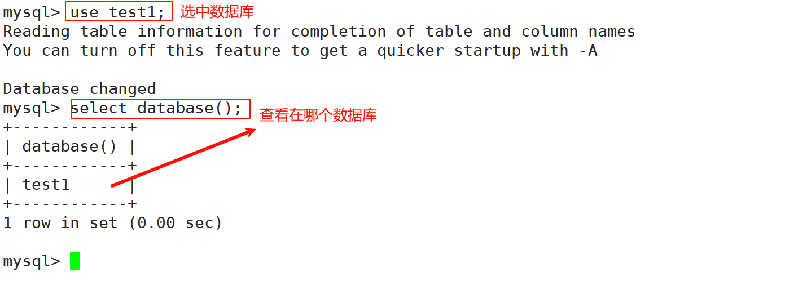

### 2.创建表
> 在创建表的时候，我们先了解一下有哪些数据类型？接下来我们就接着看
>

+ 数值类型

| 类型 | 大小 | 范围（有符号） | 范围（无符号） | 用途 |
| :--- | :--- | :--- | :--- | :--- |
| TINYINT | 1 Bytes | (-128，127) | (0，255) | 小整数值 |
| SMALLINT | 2 Bytes | (-32 768，32 767) | (0，65 535) | 大整数值 |
| MEDIUMINT | 3 Bytes | (-8 388 608，8 388 607) | (0，16 777 215) | 大整数值 |
| INT或INTEGER | 4 Bytes | (-2 147 483 648，2 147 483 647) | (0，4 294 967 295) | 大整数值 |
| BIGINT | 8 Bytes | (-9,223,372,036,854,775,808，9 223 372 036 854 775 807) | (0，18 446 744 073 709 551 615) | 极大整数值 |
| FLOAT | 4 Bytes | (-3.402 823 466 E+38，-1.175 494 351 E-38)，0，(1.175 494 351 E-38，3.402 823 466 351 E+38) | 0，(1.175 494 351 E-38，3.402 823 466 E+38) | 单精度 浮点数值 |
| DOUBLE | 8 Bytes | (-1.797 693 134 862 315 7 E+308，-2.225 073 858 507 201 4 E-308)，0，(2.225 073 858 507 201 4 E-308，1.797 693 134 862 315 7 E+308) | 0，(2.225 073 858 507 201 4 E-308，1.797 693 134 862 315 7 E+308) | 双精度 浮点数值 |
| DECIMAL | 对DECIMAL(M,D) ，如果M>D，为M+2否则为D+2 | 依赖于M和D的值 | 依赖于M和D的值 | 小数值 |


+ 日期类型

> 表示时间值的日期和时间类型为DATETIME、DATE、TIMESTAMP、TIME和YEAR。  
每个时间类型有一个有效值范围和一个"零"值，当指定不合法的MySQL不能表示的值时使用"零"值。
>

| 类型 | 大小 ( bytes) | 范围 | 格式 | 用途 |
| :--- | :--- | :--- | :--- | :--- |
| DATE | 3 | 1000-01-01/9999-12-31 | YYYY-MM-DD | 日期值 |
| TIME | 3 | '-838:59:59'/'838:59:59' | HH:MM:SS | 时间值或持续时间 |
| YEAR | 1 | 1901/2155 | YYYY | 年份值 |
| DATETIME | 8 | '1000-01-01 00:00:00' 到 '9999-12-31 23:59:59' | YYYY-MM-DD hh:mm:ss | 混合日期和时间值 |
| TIMESTAMP | 4 | '1970-01-01 00:00:01' UTC 到 '2038-01-19 03:14:07' UTC结束时间是第 **2147483647** 秒，北京时间 **2038-1-19 11:14:07**，格林尼治时间 2038年1月19日 凌晨 03:14:07 | YYYY-MM-DD hh:mm:ss | 混合日期和时间值，时间戳 |


+ 字符串类型

| 类型 | 大小 | 用途 |
| :--- | :--- | :--- |
| CHAR | 0-255 bytes | 定长字符串 |
| VARCHAR | 0-65535 bytes | 变长字符串 |
| TINYBLOB | 0-255 bytes | 不超过 255 个字符的二进制字符串 |
| TINYTEXT | 0-255 bytes | 短文本字符串 |
| BLOB | 0-65 535 bytes | 二进制形式的长文本数据 |
| TEXT | 0-65 535 bytes | 长文本数据 |
| MEDIUMBLOB | 0-16 777 215 bytes | 二进制形式的中等长度文本数据 |
| MEDIUMTEXT | 0-16 777 215 bytes | 中等长度文本数据 |
| LONGBLOB | 0-4 294 967 295 bytes | 二进制形式的极大文本数据 |
| LONGTEXT | 0-4 294 967 295 bytes | 极大文本数据 |


+ mysql是否有无符号类型呢？  
答案是有的！但是mysql官方文档里明确说，不建议使用无符号类型，而且会在未来的般版本中就不支持了

---

**创建表的操作：**

```sql
create table student(id int,name varchar(20));
```

+ 这里添加comment可以注释，但是这个注释不太好用，只能创建表的时候用
+ 更推荐`--`作为注释或者`#`也可以（这种注释不会在这里面看到，只会在源码里才能看到）

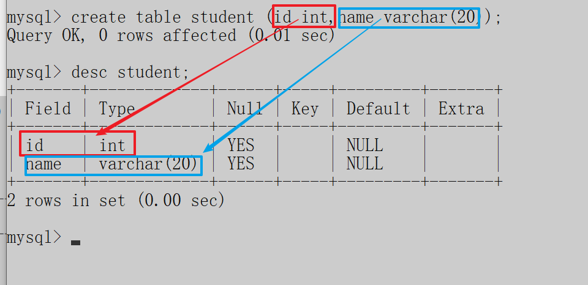

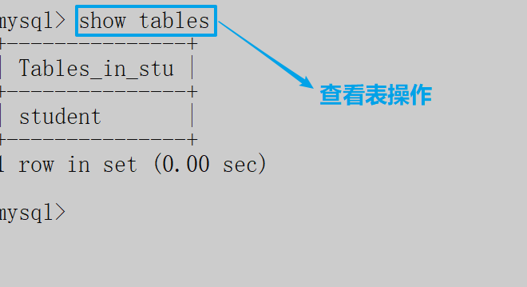

+ 这里可以看到列的名字在前，类型在后（违背日常的编码习惯），但是这也没有办法，他就是这样写的

语法：

```sql
CREATE TABLE table_name ( 
  field1 datatype, 
  field2 datatype, 
  field3 datatype 
) character set 字符集 collate 校验规则 engine 存储引擎;
```

+ 可以指定设置字符集和引擎

```sql
create table users ( 
  id int, 
  name varchar(20) comment '用户名', 
  password char(32) comment '密码是32位的md5值', 
  birthday date comment '生日' 
) character set utf8 engine MyISAM;
```

+ 默认是`innodb`

```sql
create table users ( 
  id int, 
  name varchar(20) comment '用户名', 
  password char(32) comment '密码是32位的md5值', 
  birthday date comment '生日' 
);
```

+ 不同的存储引擎，创建表的文件不一样。

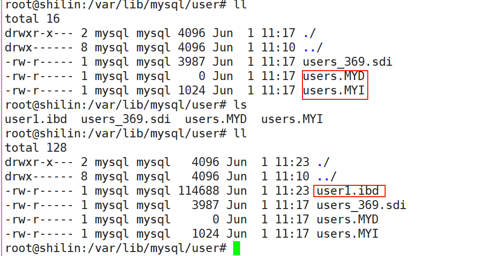

+ 可以查看之前创建的最新的记录

```sql
show create table user1 \G
```

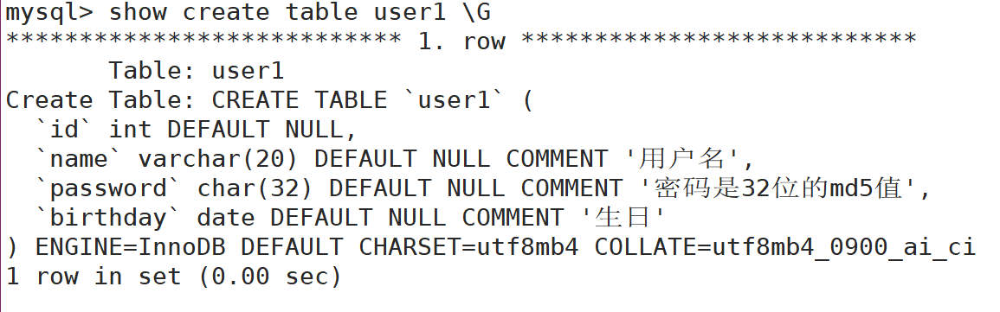

### 3.查看指定表的表结构
```sql
desc 表名；
```

+ desc ->describe的缩写（描述一个表是啥样子的）

示例：

+ Field这列代表字段名字
+ Type这列代表字段类型
+ NULL这列代表是否为
+ ke这列代表索引类
+ Default代表默认值
+ Extra这列代表扩充

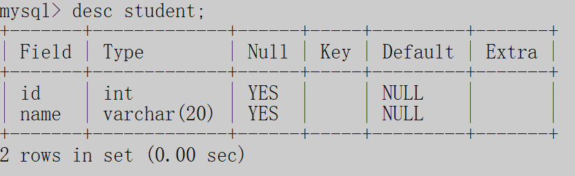

### 4.修改表
+ 先插入一些数据


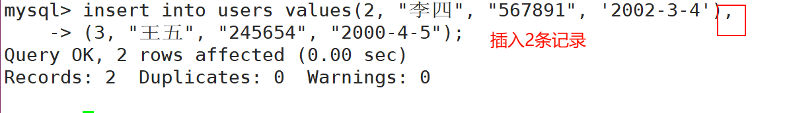

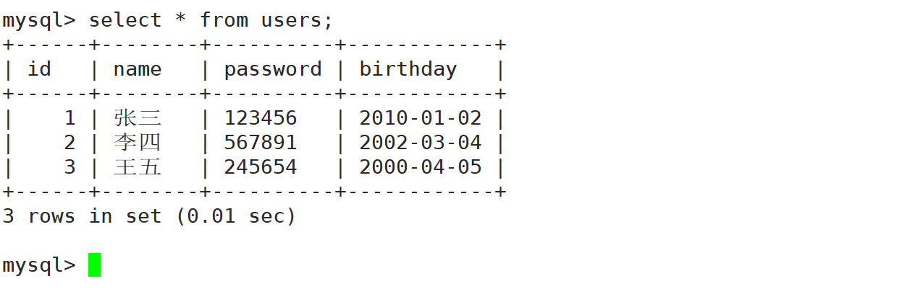

#### 添加字段
+ 进行修改，在users表添加一个字段，用于保存图片路径

```sql
alter table users add image_path varchar(100) after birthday;
```

插入新字段后，对原来表中的数据没有影响：

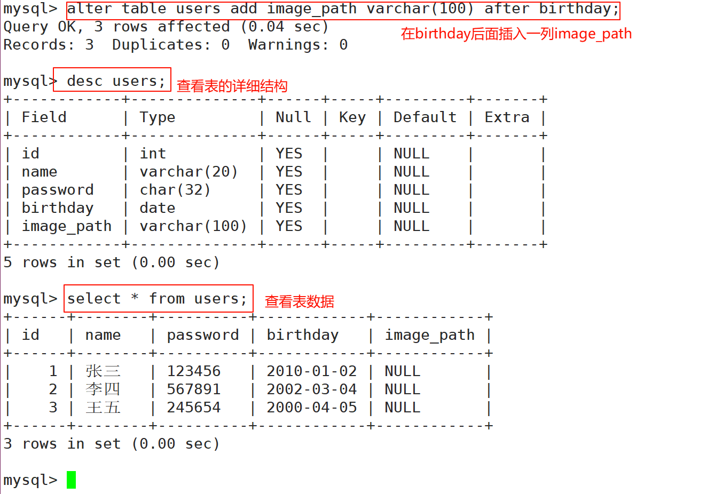

#### 修改字段类型
+ 修改name，将其长度改成60

```sql
alter table users modify name varchar(60);
```

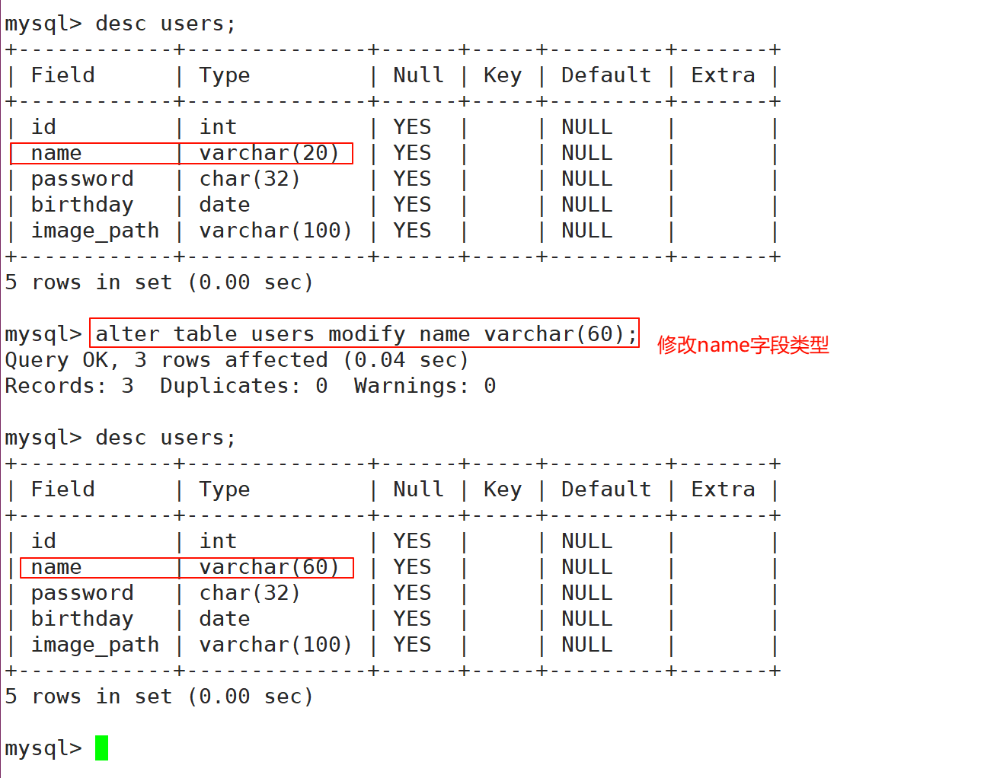

#### 删除字段
+ 删除password列

> 注意：删除字段一定要小心，删除字段及其对应的列数据都没了
>

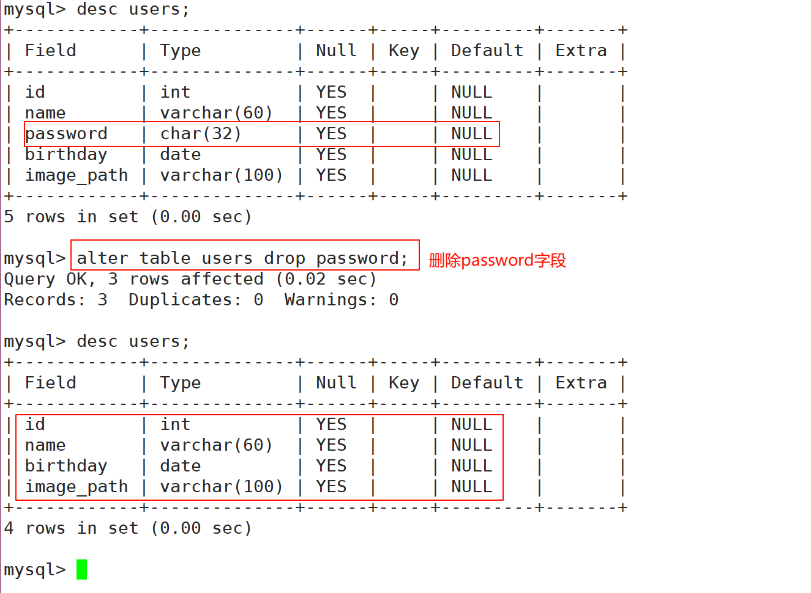

再次查看数据也就没有了

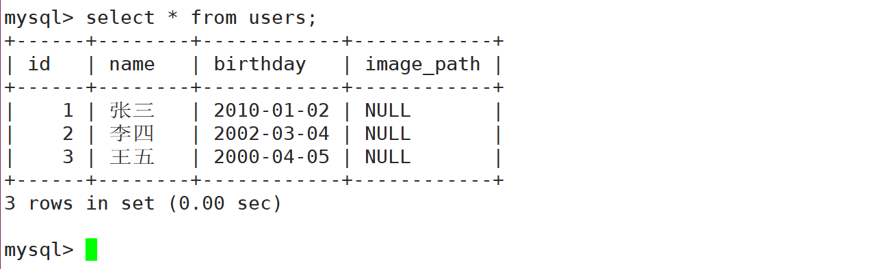

#### 修改表名
+ 修改表名为employee
+ to：可以省略掉

```sql
alter table users rename to employee;
```

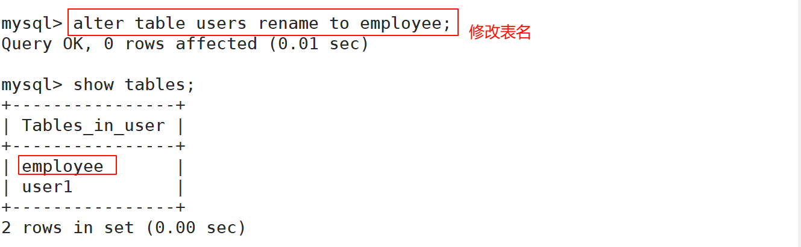

#### 修改字段
```sql
alter table employee change name xingming varchar(60);
```

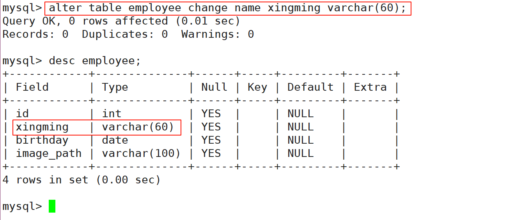

### 5.删除表
```sql
drop table 表名称;
```

语法格式：

```sql
DROP [TEMPORARY] TABLE [IF EXISTS] tbl_name [, tbl_name] ...
```

  
在创建数据库的时候也有一个`IF [NOT] EXISTS`

