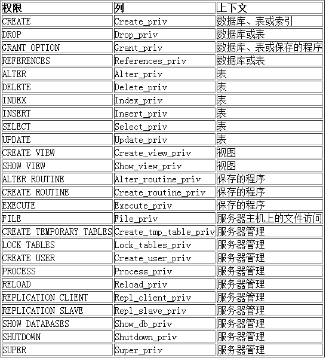

如果我们只能使用root用户，这样存在安全隐患。这时，就需要使用MySQL的用户管理。

# 用户
## 查看用户信息
MySQL中的用户，都存储在系统数据库mysql的user表中

```sql
mysql> use mysql;
mysql> select host,user from user;
+-----------+------------------+
| host      | user             |
+-----------+------------------+
| %         | lsl              |
| %         | root             |
| localhost | debian-sys-maint |
| localhost | mysql.infoschema |
| localhost | mysql.session    |
| localhost | mysql.sys        |
+-----------+------------------+
```

字段解释：

`host`： 表示这个用户可以从哪个主机登陆，如果是localhost，表示只能从本机登陆

`user`： 用户名

`authentication_string`： 用户密码通过password函数加密后的

`*_priv`： 用户拥有的权限

## 创建用户
```sql
create user '用户名'@'登陆主机/ip' identified by '密码';
```

例子：

```sql
create user 'shilin'@'localhost' identified by '123456';
```

```sql
mysql> select host,user from user;
+-----------+------------------+
| host      | user             |
+-----------+------------------+
| %         | lsl              |
| %         | root             |
| localhost | debian-sys-maint |
| localhost | mysql.infoschema |
| localhost | mysql.session    |
| localhost | mysql.sys        |
| localhost | shilin           |
+-----------+------------------+
```

## 删除用户
```sql
drop user '用户名'@'主机名'
```

## 修改用户密码
+ 自己改自己密码

```sql
set password=password('新的密码');
```

+ root用户修改指定用户的密码

```sql
set password for '用户名'@'主机名'=password('新的密码');
```

# 数据库的权限


## 给用户授权
刚创建的用户没有任何权限。需要给用户授权。

语法：

```sql
grant 权限列表 on 库.对象名 to '用户名'@'登陆位置' [identified by '密码']
```

说明：

权限列表，多个权限用逗号分开

```sql
grant select on ...
grant select, delete, create on ....
grant all [privileges] on ... -- 表示赋予该用户在该对象上的所有权限
```

+ `*.*` : 代表本系统中的所有数据库的所有对象（表，视图，存储过程等）
+ `库.*` : 表示某个数据库中的所有数据对象(表，视图，存储过程等)
+ `identified by`可选。 如果用户存在，赋予权限的同时修改密码,如果该用户不存在，就是创建用户

注意：如果发现赋权限后，没有生效，执行如下指令：

```sql
flush privileges;
```

## 回收权限
```sql
revoke 权限列表 on 库.对象名 from '用户名'@'登陆位置'；
```

