# 一、新增（Create）
**语法：**

```sql
INSERT [INTO] table_name
   [(column [, column] ...)] 
   VALUES (value_list) [, (value_list)] ...
value_list: value, [, value] ...
```

**案例：**

```sql
insert into student valuse (1,'张三');
```

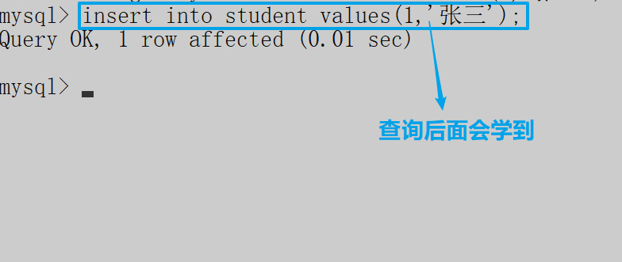

+ 这里的个数，类型，顺序和表头结构匹配
+ SQL没有字符类型，`‘’`和`“”`都可以表示字符串
+ 这里数据库在插入的有的时候是报错，这是因为在数据库不做任何修改，默认情况下创建数据库的字符集是`拉丁文`字符集，不能表示中文

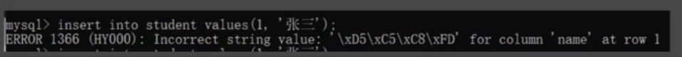

+ 此时我们要做的事情就是让我们的数据库，字符集和你输入的时候设置生`utf-8`

```sql
create database test charset utf8;
```

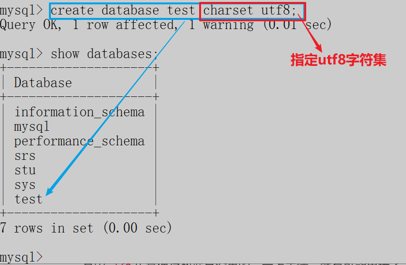

+ 现在就可以了，一般来说，我们的终端是utf8的，但是有的是gbk的；
+ 其中`utf8`正常保存数据是没事的，带上表情，就有可能出错了，而`utf8mb4`是更完整的utf8。

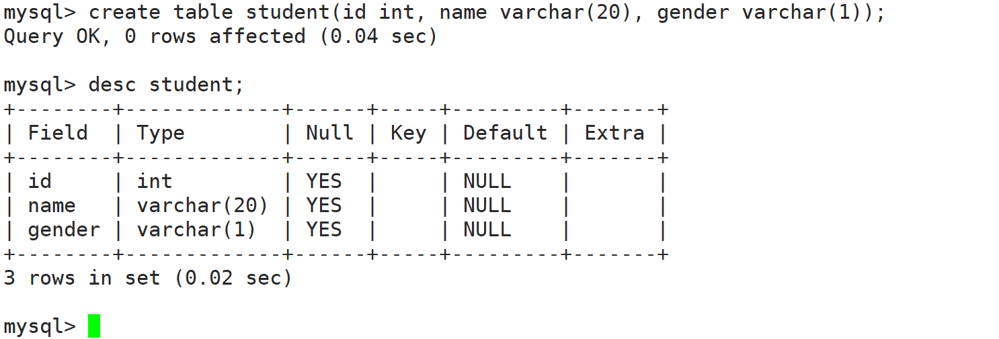

## 指定列插入 + 全列插入
+ 插入两条记录，`value_list`数量必须和指定列数量及顺序一致

```sql
insert into student (name,gender) values('张三','男');
```

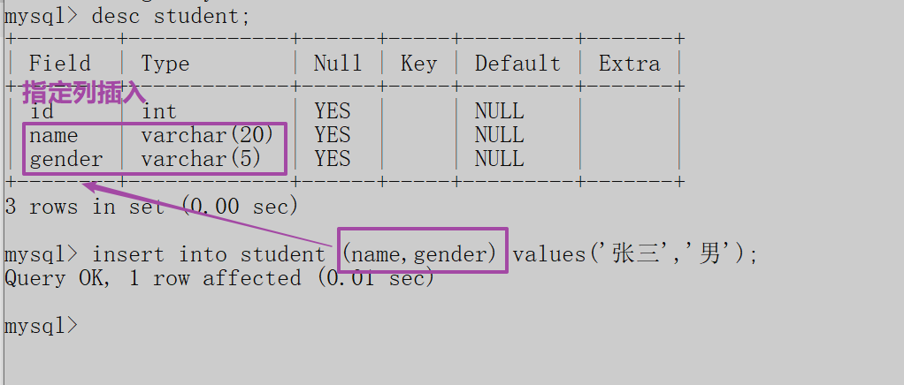

此时：`values`后面的内容就是和前面的`()`的内容匹配

+ 要想看到结果，就要使用查询语句
+ 可以看到，id是空着的，别的都有，这就是指定列插入

```sql
select * from student;
```

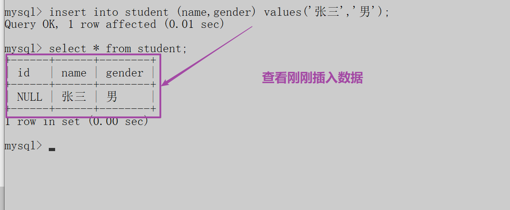

## 多行数据
+ 这里也可以一次性插入多条数据，那就是一次插入

```sql
insert into student values(2,'李四','男'),(3,'王五','男');
```

+ 一次插入n个记录，比一次插入一个数据，分n次插入，效率要高

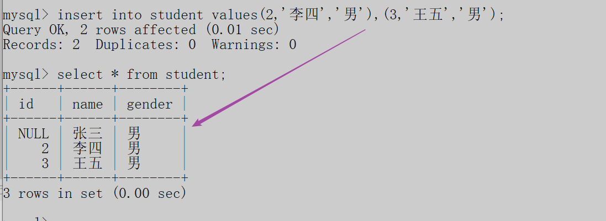

## 时间日期类型，数据的插入
```sql
create table homework (id int ,creatTime datetime);
```

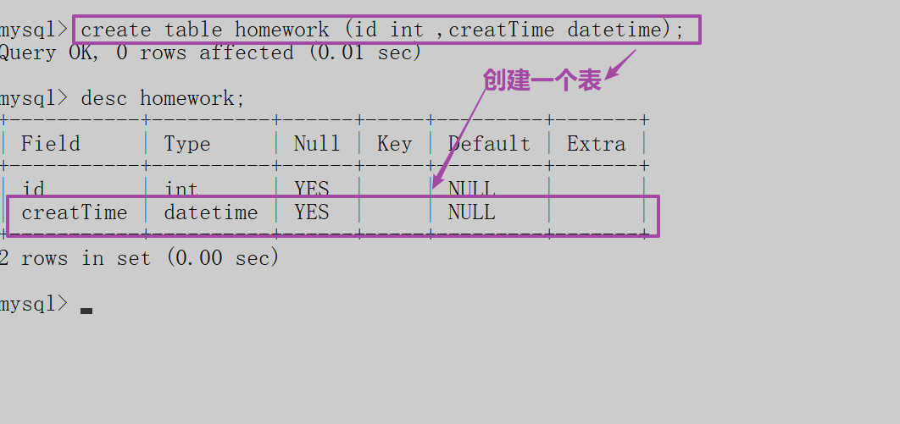

+ 插入时间的时候，是通过特定格式的字符串来表示时间日期的，如`‘2023-02-17 21:25:00’`

```sql
insert into homework values(1,'2023-02-17 21:25:00');
```

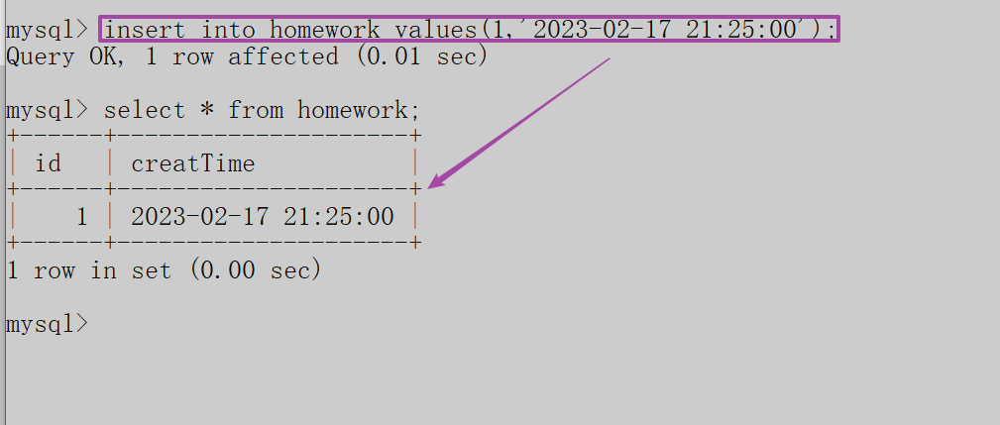

+ 那么我现在就想把这个时间日期设置成当前时刻，咋办？sql提供了一个特殊的函数，`now()`

```sql
insert into homework values(1,now());
```

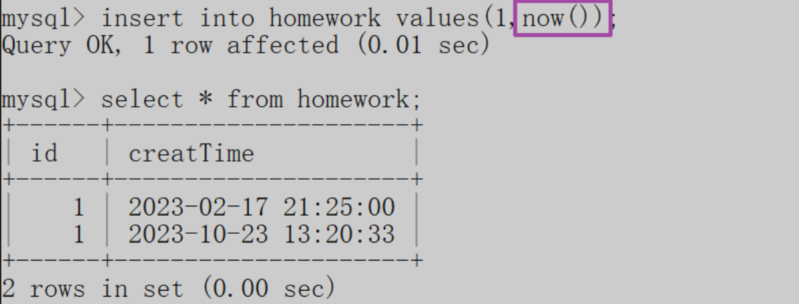

## 插入否则更新
+ 创建一张学生表

```sql
create table student(
  id int unsigned primary key auto_increment,
  sn int not null unique comment '学号',
  name varchar(20) not null,
  qq varchar(20)
);
```

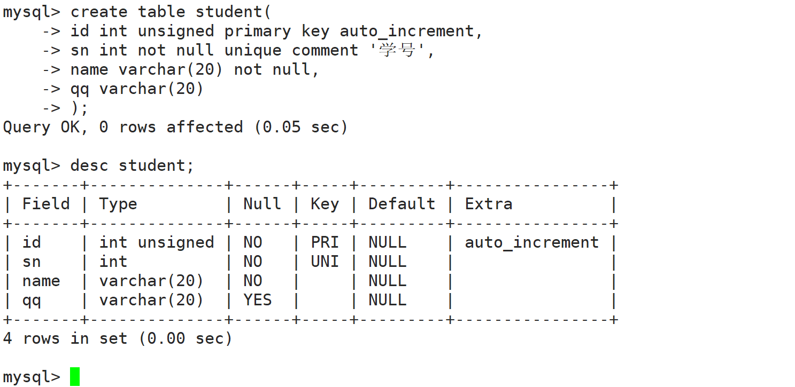

+ 插入数据

```sql
insert into student (id, sn, name)values (100, 10010, '唐大师');
```

由于`主键`或者`唯一键`对应的值已经存在而导致插入失败

```sql
mysql> insert into student (id, sn, name)values (100, 10010, '唐大师');
Query OK, 1 row affected (0.01 sec)

mysql> insert into student (id, sn, name)values (100, 10011, '唐三藏');
ERROR 1062 (23000): Duplicate entry '100' for key 'student.PRIMARY'
mysql> insert into student (id, sn, name)values(101, 10010, '曹阿瞒');
ERROR 1062 (23000): Duplicate entry '10010' for key 'student.sn'
mysql> 
```

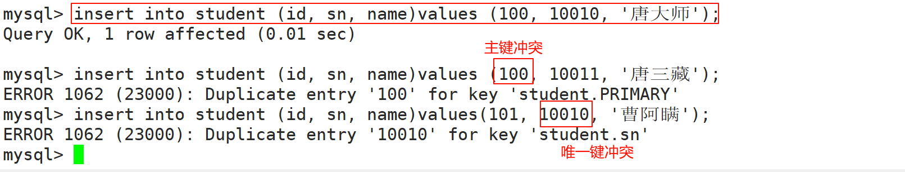

可以选择性的进行同步更新操作

语法：

+ `on duplicate key`当发生重复key的时候

```sql
insert into student (id, sn, name) values (100, 10010, '唐大师') 
  on duplicate key update sn=10011, name='唐大师';
```

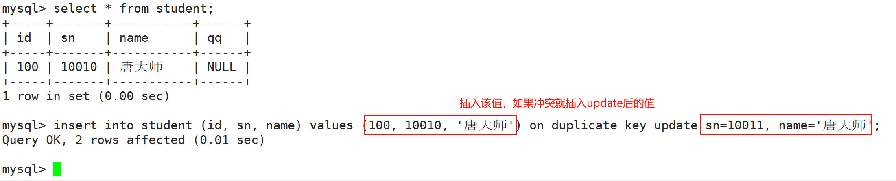

+ 0 row affected: 表中有冲突数据，但冲突数据的值和 update 的值相等
+ 1 row affected: 表中没有冲突数据，数据被插入
+ 2 row affected: 表中有冲突数据，并且数据已经被更新

通过`MySQL`函数获取受到影响的数据行数

```sql
select row_count();
```

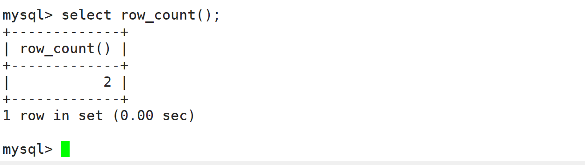

## 替换
+ 主键 或者 唯一键 没有冲突，则直接插入；
+ 主键 或者 唯一键 如果冲突，则删除后再插入

```sql
replace into student (sn, name) values(10011, '孙悟空');
```

+ 1 row affected: 表中没有冲突数据，数据被插入
+ 2 row affected: 表中有冲突数据，删除后重新插入

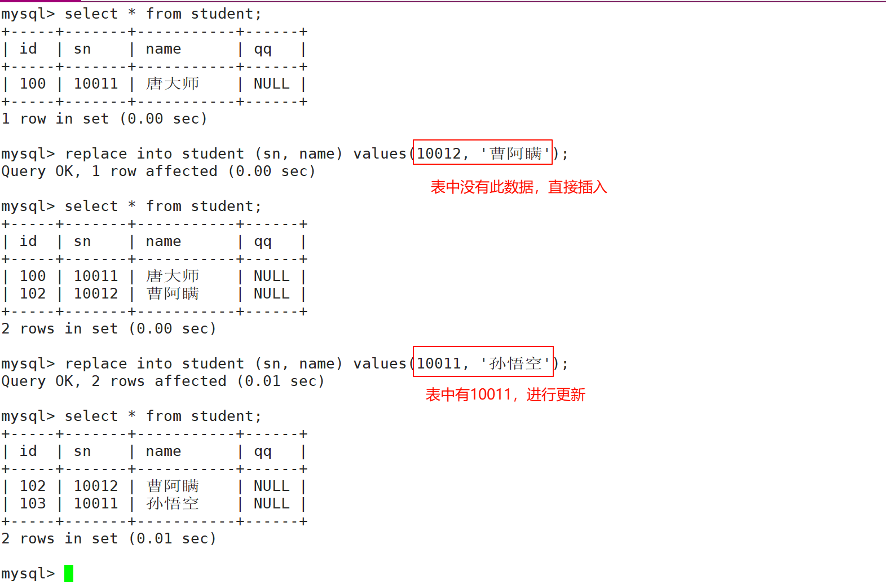

# 二、查询（Retrieve）
## 全列查找
全列查找（查找整个表的所有行，所有列）

```sql
select * from 表名
```

+ 这里面的`*`表示所有的列，这种特殊含义的符号，计算机中叫做【通配符】

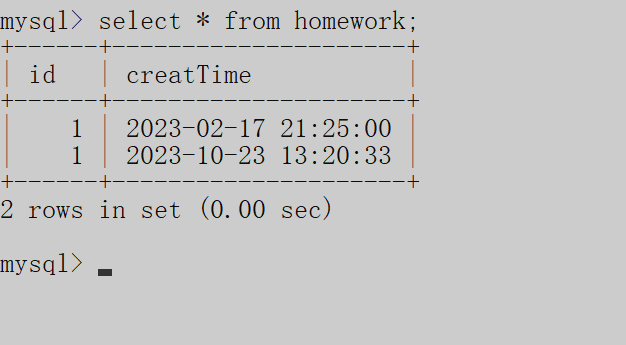

+ 但是这里执行`select *`操作，肯会非常危险
+ 如果数据量就几百几千，就没有什么事，如果数据量有几亿，几十亿`select *`操作就很麻烦了，这个操作会瞬间吃满硬盘带宽和网络带宽，就可能导致其他程序无法使用硬盘或者使用网络。

## 指定列查询
+ 指定列的顺序不需要按定义表的顺序来

```sql
select 列名,列名...from 表名;
```

+ 我们需要哪些列就查询哪些列

```sql
select name,gender from student;
```

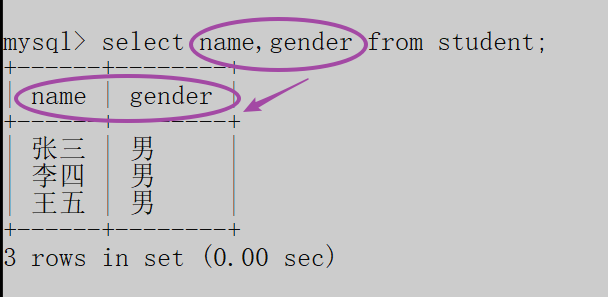

## 表达式查询
+ 查询过程中，可以做一些简单的运算~~
+ 这个是进行`列`和`列`之间的运算

```sql
create table exam_result (
  id int,
  name varchar(20),
  chinese decimal(3,1),
  math decimal(3,1),
  english decimal(3,1)
);
```

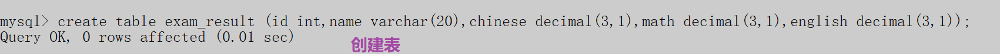

```sql
insert into exam_result (id,name,chinese,math,english) values 
    (1,'唐三藏', 67, 98, 56), 
    (2,'孙悟空', 87.5, 78, 77), 
    (3,'猪悟能', 88, 98.5, 90), 
    (4,'曹 孟德', 82, 84, 67), 
    (5,'刘玄德', 55.5, 85, 45), 
    (6,'孙权', 70, 73, 78.5), 
    (7,'宋公明', 75, 65, 30);
```

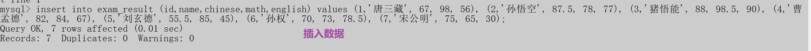  
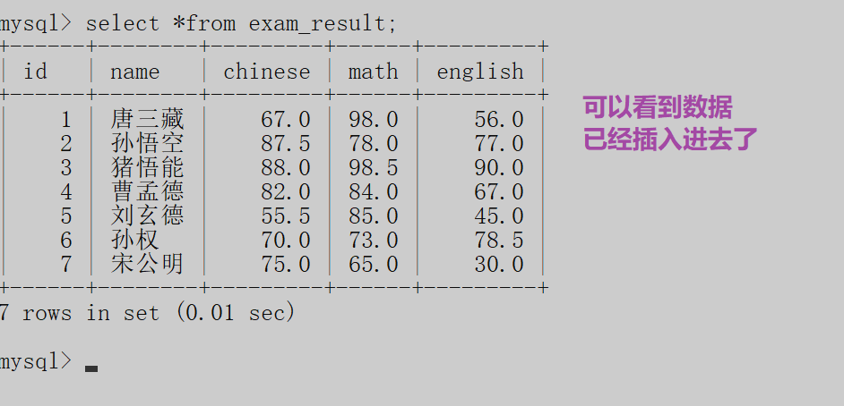

+ 接下来就看看查询字段为表达式
+ 可以在查询的时候，针对分数进行变换；比如让查询的math成绩都在原来的基础上 + 10分；

```sql
select name,math + 10 from exam_result;
```

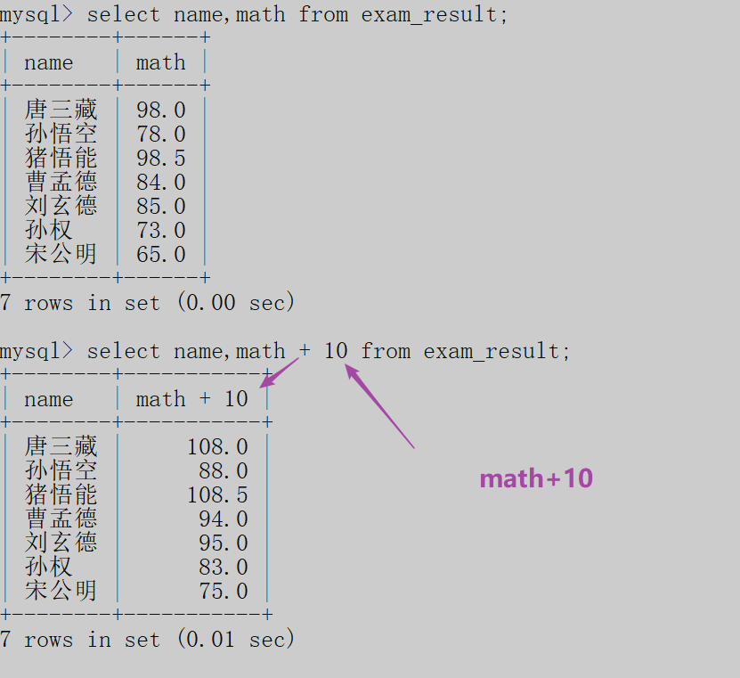

+ 这个结果都是在原有的分数上 + 10的
+ 上述这样的查询，数据库服务器硬盘的数据，是否发生了改变？
+ 如果我们再次查询math，此时的结果是 + 10之前的还是 + 10之后的呢？

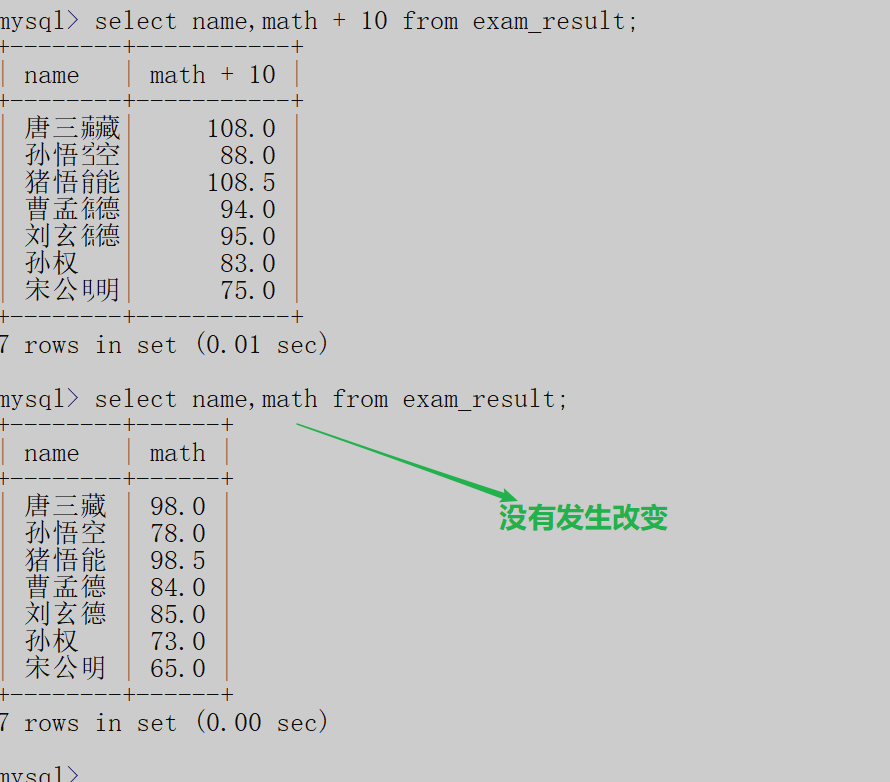  
**小结一下：**

+ 我们要要牢记一句话，mysql是一个“客户端-服务器”结构的程序！！！
+ 用户在客户端输入的sql，通过请求发送给服务器，服务器解析并执行sql，把查询的结果从硬盘读取出来，通过网络响应还给客户端，客户端把这些数据以`临时表`的形式展现出来
+ 这只是在客户端这里显示一下临时表，和服务器那边的硬盘上的表没啥关系

我们还可以查看总成绩：

```sql
select name,math + chinese + english from exam_result;
```

+ `表达式查询`是让列和列之间进行运算而不是行和行之间

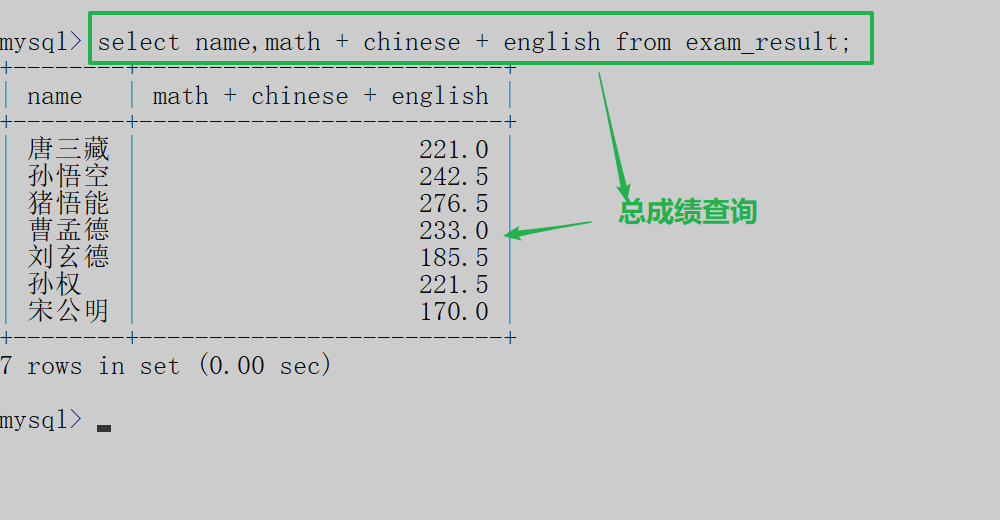  
后面还会学一个`聚合查询`，是行和行之间的运算~~

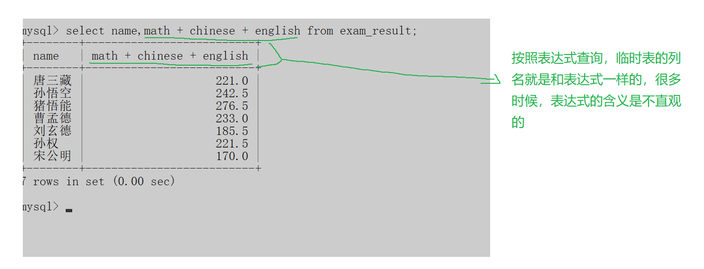

这就引出了一个查询的时候指定别名

## 指定别名查询
+ 指定别名，就相当于是 起了个“小名”更方便的来理解含义
+ 我们可以使用`as`关键字来查询

下面进行演示：

```sql
select name,math + chinese + english as total from exam_result;
```

+ 可以看到，我们查询出来的名字发生了变化

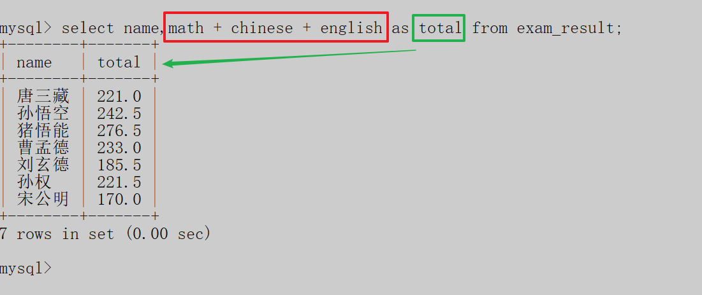

+ 其中 `as`可以省略，但是不建议

## 结果去重
+ 我们可以使用`distinct`关键字进指定列进行去重，把重复的行只保留一个

```sql
select distinct math from exam_result;
```

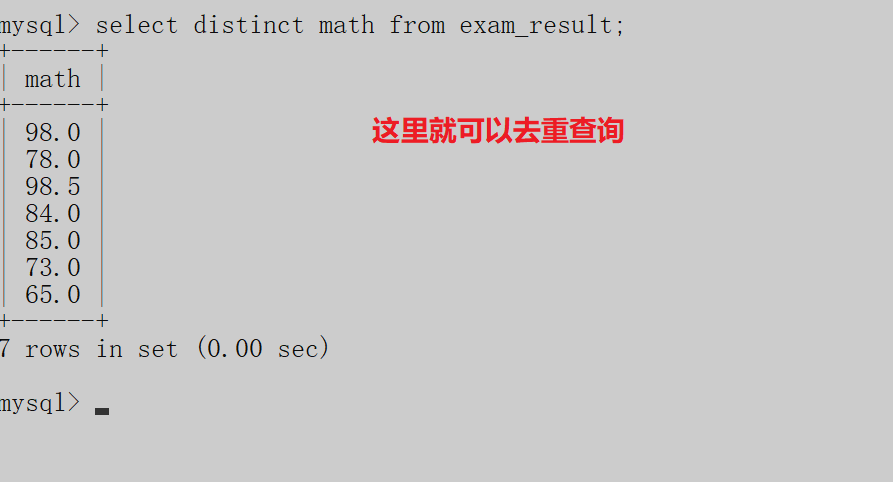

+ distinct指定多个列的时候，要求这些列的值都相同，才视为重复

## 查询结果排序
+ 使用了`order by`子句，指定某些列进行排序~~，排序可能是升序，也可能是降序
+ order by是可以根据多个列进行排序

比如说按照数学成绩进行升序排序

```sql
select name,math from exam_result order by math;
```

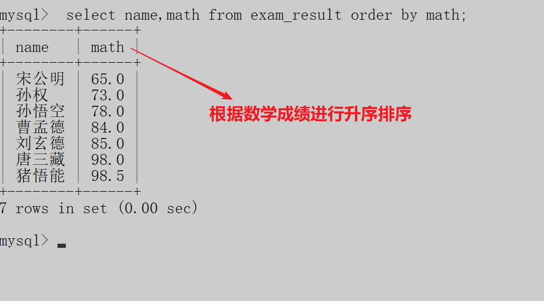

+ 对于MySQL来说，如果一个sql没有指定order by此时查询的结果的顺序，是`不可预期的`
+ 代码逻辑中，不能依赖这里的查询顺序的

刚刚是升序排序的，那么怎么降序排序呢？只需要在后面加上`desc`就可以了

```sql
select * from exam_result order by math desc;
```

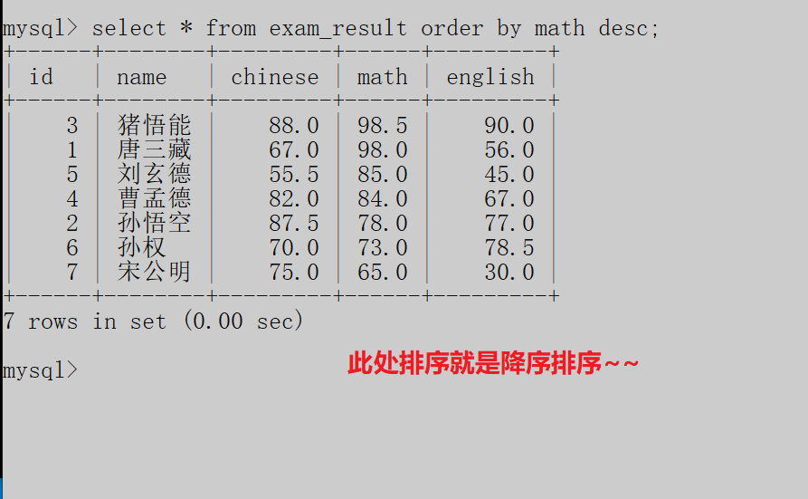

+ 此处的`desc`是`descend`单词的缩写,不是`describe`
+ 还可以使用`asc`表示升序排序，但是省略不写默认就是升序
+ 还可以指定多个列来排序，多个列之间使用`，`来分割 ，这个列越靠前，就是越关键的排序依据
+ 先按照第一列排序，如果第一列的值相同了，再按照第二列排序

```sql
select * from exam_result order by math desc,chinese desc;
```

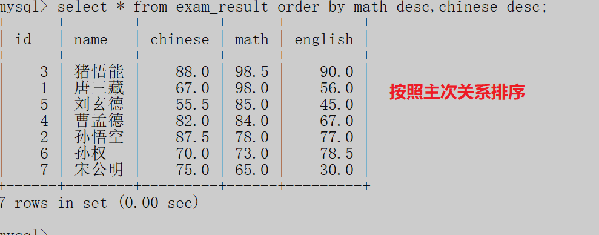

## 条件查询
> 在查询的时候指定筛选条件
>

+ 需要先描述条件，怎么描述条件呢？
+ sql通过一系列的运算符来表示条件

比较运算符：

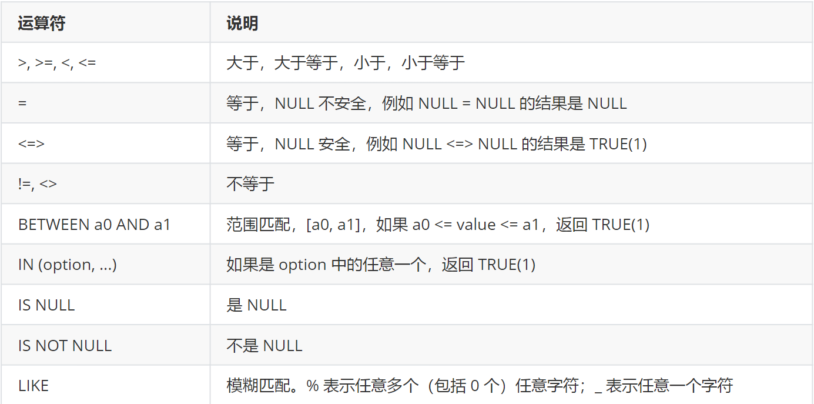

逻辑运算符：

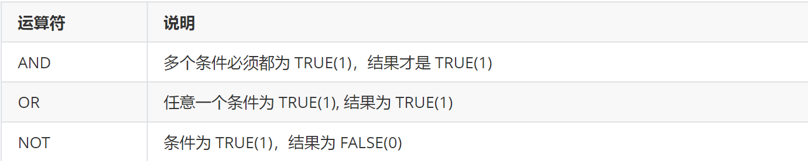

+ 通过where子句，再搭配上条件表达式，就可以完成条件查询

```sql
select * from exam_result where english < 60;
```

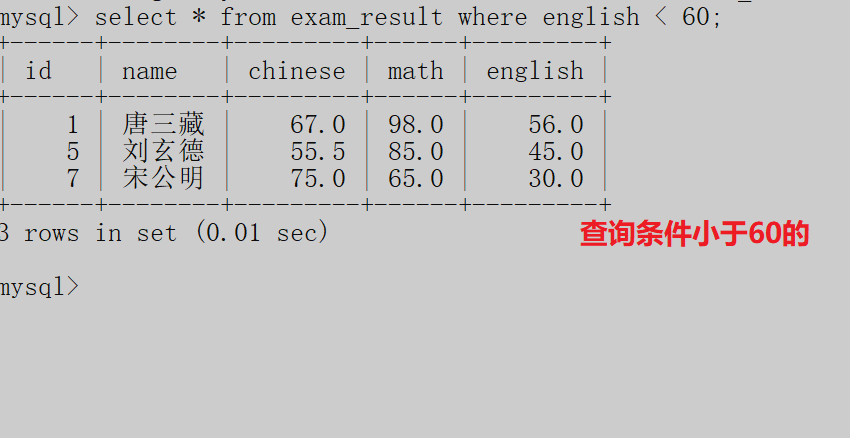

+ 其中的`where english < 60`相当于针对数据库的表进行遍历，取出每一行数据，把数据代入条件中，看条件是否符合
+ 如果是`真`，这个记录就保留，作为结果集的一部分
+ 如果是 假，这个记录就pass，下一条继续

---

+ 查询语文成绩好于英语成绩的同学
+ 条件查询，可以直接拿两个列进行比较~~

```sql
select * from exam_result where chinese > english;
```

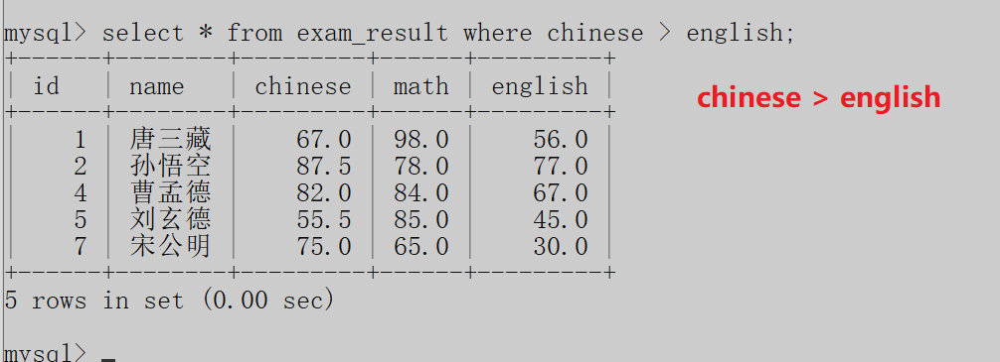

+ 这里和上面的`where english < 60`一样，都是取出每一行数据，把数据代入条件中，看条件是否符合

---

+ 查询总分在200分以下的同学
+ 条件查询，可以使用表达式来作为条件

```sql
select * from exam_result where chinese + english + math < 200;
```

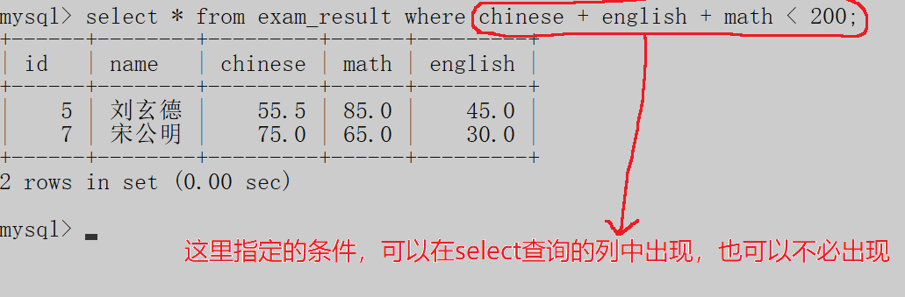

+ 这样写是不是不明显，那我们还可以下面这样写

```sql
select name,chinese+math+english from exam_result where chinese + english + math < 200;
```

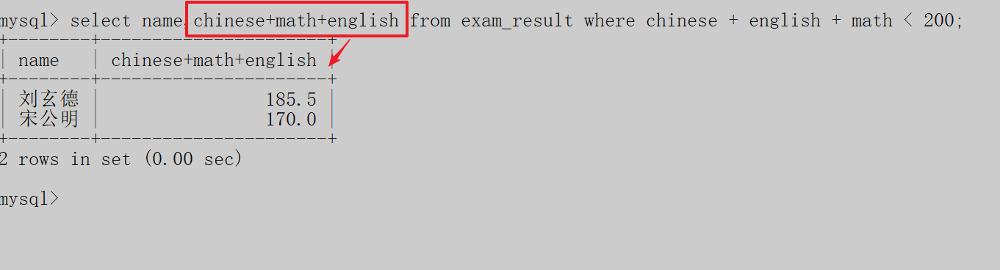

+ 这样写是不是更加直观
+ 还记得吗？有一个`as`的关键词
+ 那么是不是可以下面这样写？

```sql
select name,chinese + math + english as total from exam_result where total < 200;
```

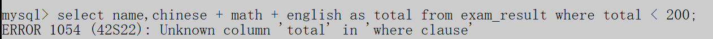

+ 可以看到是报错了~~
+ 在上面的代码中，写下一个sql，不是从前往后的执行，执行顺序是有特定的规则的

**执行规则：**

1. 遍历每一行
2. 把这一行代入where的条件中
3. 符合条件的结果，再根据select这里指定的列，再进行查询/计算

**注意：**

> 此处的total别名不能作为where条件，和当前sql的执行顺序有关，当然，这也是mysql对于语法规定的一部分~~
>

+ 所以只能写成原有的表达式

```sql
select name,chinese + math + english as total from exam_result where chinese + math + english < 200;
```

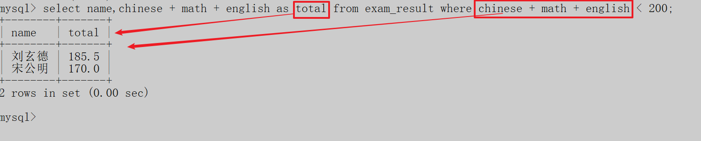

---

+ 查询语文成绩大于80分，且英语成绩大于80分的同学

```sql
select * from exam_result where chinese > 80 and english > 80;
```

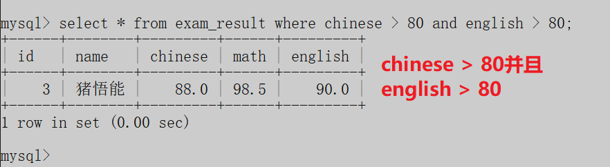

---

+ 查询语文成绩大于80分，或英语成绩大于80分的同学

```sql
select * from exam_result where chinese > 80 or english > 80;
```

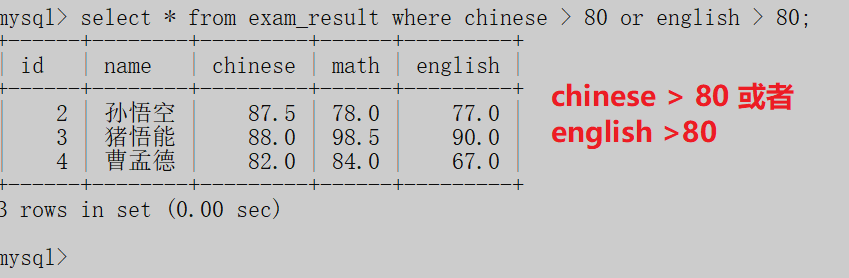

+ 如果一个`where`中既存在`and`有存在`or`，那么它们的优先级是先执行`and`后执行`or`

## 范围查询
**BETWEEN ... AND ...**

+ 约定的一个前闭后闭区间（包含两侧边界）
+ 查询语文成绩在[80，90]分的同学及语文成绩

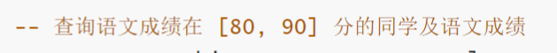

```sql
select * from exam_result where chinese >= 80 and chinese <= 90;
```

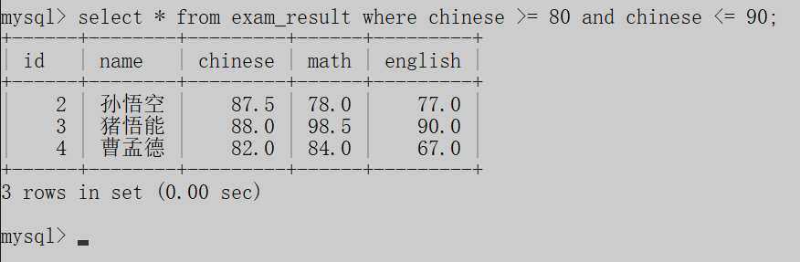

+ 或者也可以写成下面的代码，这两种写法本质上是一样的~~

```sql
select * from exam_result where chinese between 80 and 90;
```

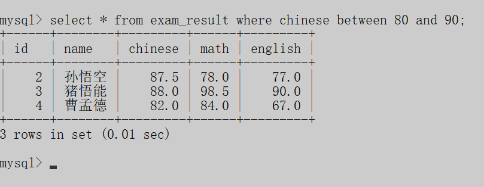

---

+ 查询数学成绩是58或者59或者98或者99分的同学及数学成绩

```sql
select * from exam_result where math = 58 or math = 59 or math = 98 or math = 99;
```

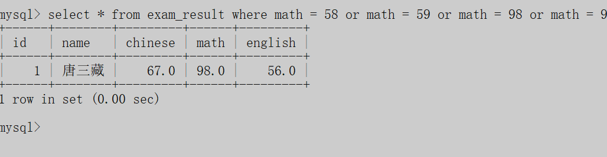

+ 或者也可以这样写：

```sql
select * from exam_result where math in(58,59,98,99);
```

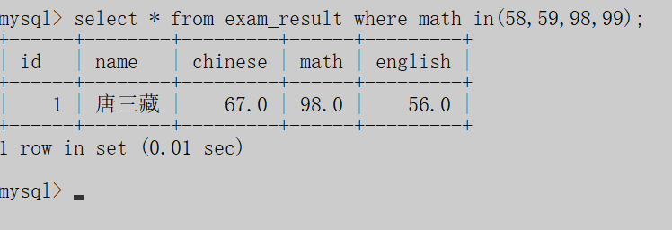

## 模糊查询
```sql
like
```

+ 模糊匹配，不要求元素完全相同，只要满足一定的规则就可以了
+ like 功能比正则表达式简单的多，

> 只支持两个用法：
>
> 1. 使用%代表任意0个字符或者N个字符
> 2. 使用_代表任意1个字符
>

例如：

+ 查询姓孙的同学

```sql
select * from exam_result where name like '孙%';
```

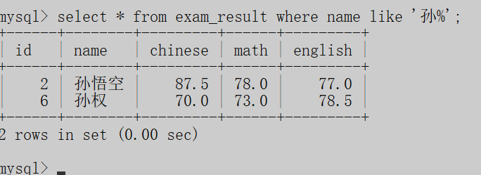

+ 可以看到查询出来了，列如用`_`来模糊查找：

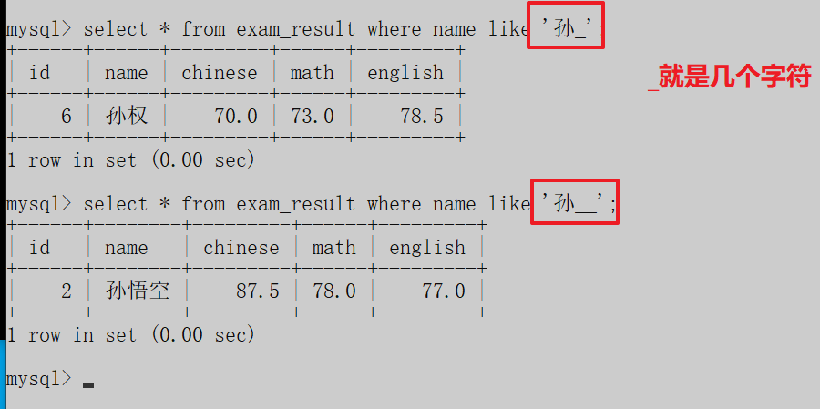

+ 还可以下面这样写：
+ `like '%孙'`查询结尾的
+ `like'%孙%'`查询包含孙的

---

+ mysql效率比较低的，很容易称为性能瓶颈，模糊匹配更是比较低效的写法，如果这里支持的功能更复杂，反而更拖慢数据库的效率
+ 使用数据库，就算优化出来，也达不到要求，我们的做法是不用数据库，数据都放在内存中搜索

## NULL 的查询
我们要想查询为空（null）的值，那么怎么查询吗？是下面这样吗？

```sql
select * from exam_result where chinese = null;
```

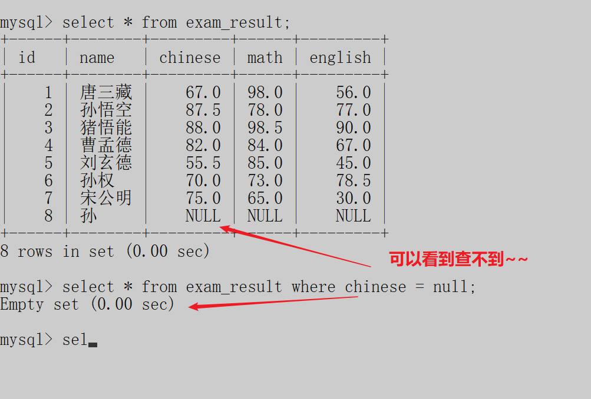

为什么会出现这样的情况？

+ null和其他数值进行运算，结果还是null；
+ null结果在条件中，想当于`false`
+ 所以null = null 结果等于null --> false;

针对这样的问题怎么解决呢？

+ 在sql里提供了这样的一个比较相等的`<=>`,使用这个比较相等运算，就可以处理null的比较

可以看到就可以查询成功了：

```sql
select * from exam_result where chinese <=> null
```

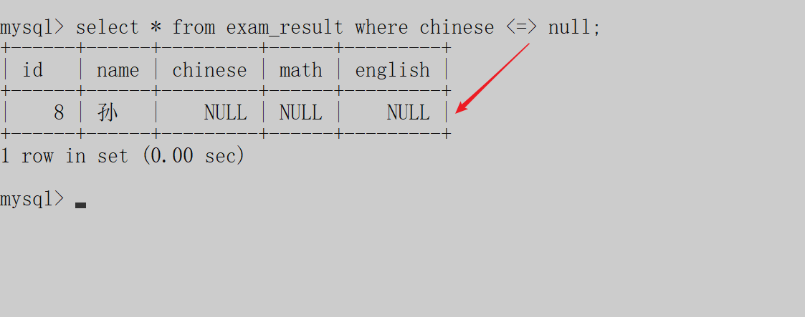

+ 或者也可以下面这样写，对空值进行判定

```sql
select * from exam_result where chinese is null;
```

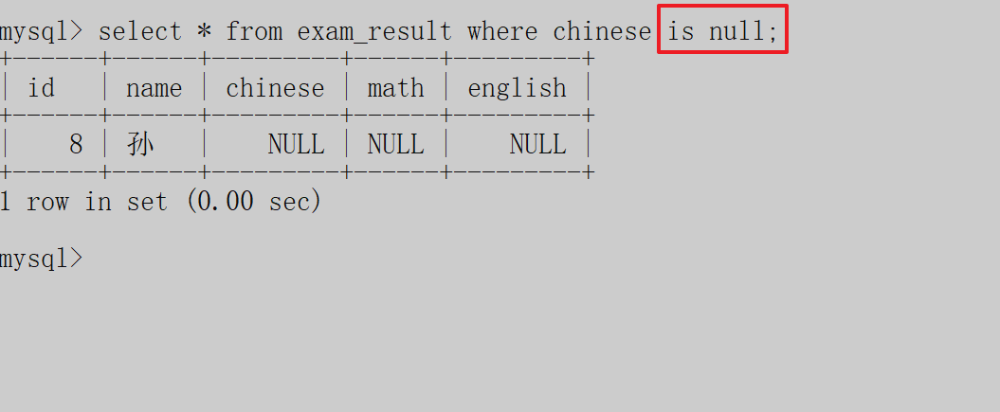

## 分页查询
这里所用到的关键字是`limit`

```sql
select * from exam_result limit 3;
```

+ 可以看到后面这里加上3，就是只显示3条

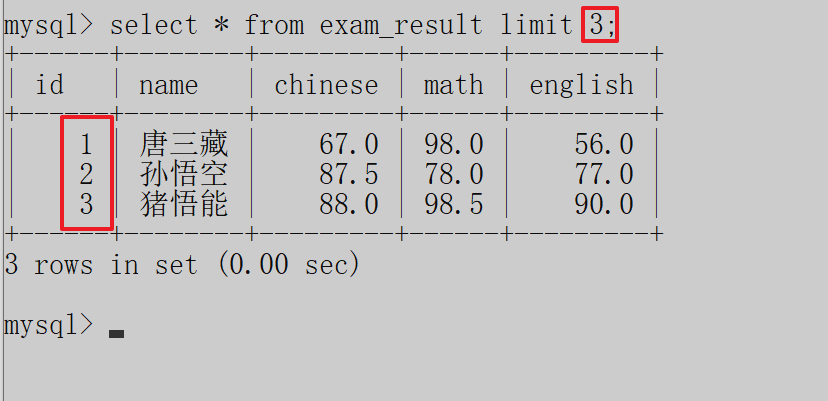

+ limit还可以搭配offset，声明从那一条开始查询（从0开始计数）

```sql
select * from exam_result limit 3 offset 3;
```

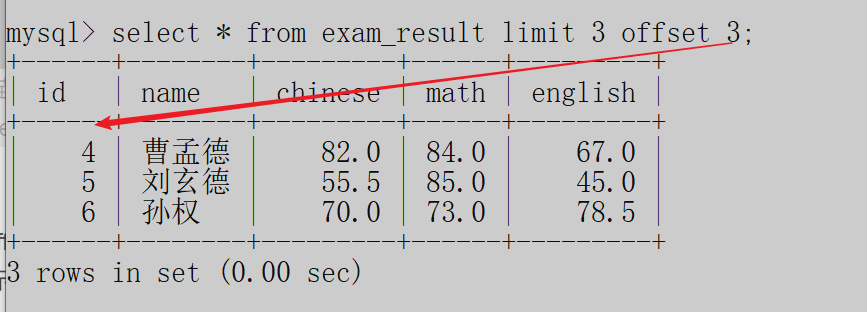

+ 还有一种写法：`limit 3 offset 6`等价于 `limit 6,3`
+ 这种写法不太推荐，很容易混淆
+ limit 这个东西是可以和前面的那些查询搭配使用的

列如：查询总分前三名的同学的信息：

1. 计算每个同学的总成绩（表达式）
2. 按照成绩排序（降序）
3. 取前三条记录

代码操作：

```sql
select name,chinese + english + math as total from exam_result order by total desc limit 3;
```

+ **注意**这里的`order by`是可以使用别名的

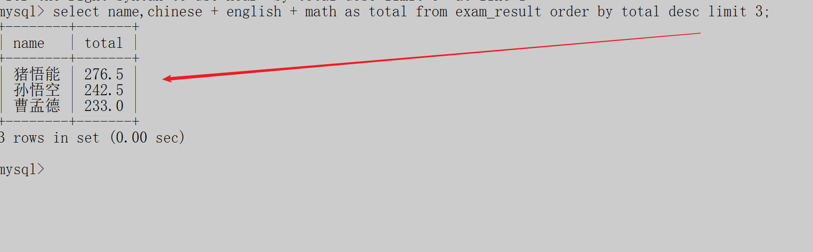

## group by子句的使用
+ 准备一个测试数据库

在select中使用group by 子句可以对指定列进行分组查询

指定列名，实际分组，是用该列的不同的行数据来进行分组的！

分组的条件，组内一定是相同的！可以被聚合压缩

分组，不就是把一组按照条件拆成了多个组，进行各自组内的统计，分组（“分表”），不就是把一张表按照条件在逻辑上拆成了多个子表，然后分别对各自的子表进行聚合统计

+ 显示每个部门的平均工资和最高工资

```sql
select deptno, avg(sal), max(sal) from emp group by deptno;
```

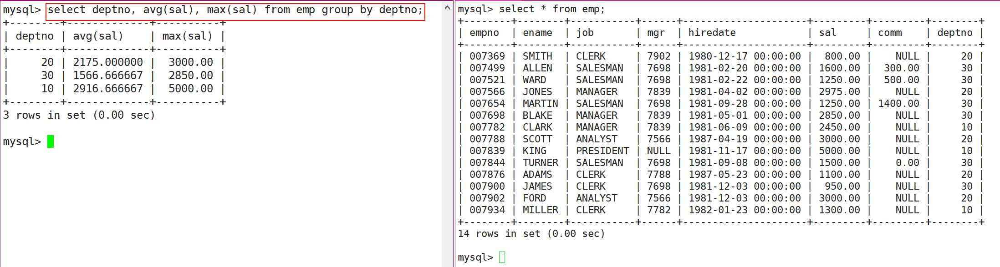

+ 显示每个部门的每种岗位的平均工资和最低工资

```sql
select deptno, job, avg(sal), min(sal) from emp group by deptnono, job;
```

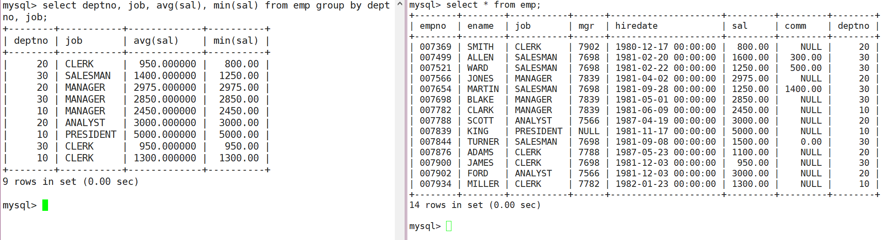

+ 显示平均工资低于2000的部门和它的平均工资
    - 统计各个部门的平均工资

```sql
select deptno, avg(sal) from emp group by deptno;
```

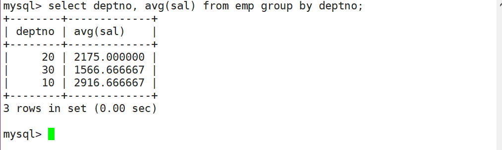

    - having和group by配合使用，对group by结果进行过滤

```sql
select deptno, avg(sal) from emp group by deptno having avg(sal) < 2000;
```

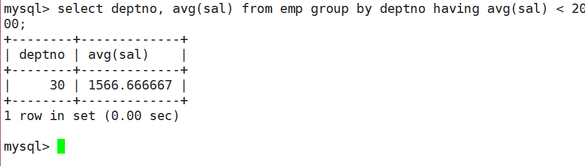

+ SMITH员工不进行统计

```sql
select deptno, job, avg(sal) myavg from emp where ename != 'SMITH' group by deptno, job having myavg < 2000;
```

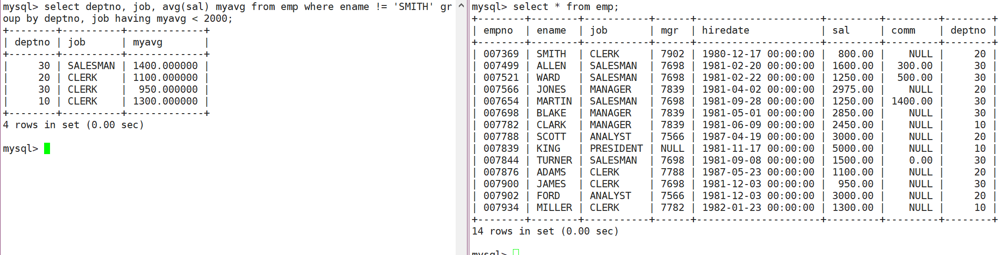

解释：

where ename != 'SMITH' 对具体的任意列进行条件筛选

having myavg < 2000  对分组聚合之后的结果进行条件筛选

# 三、修改（Update）
```sql
update 表名 set 列名 = 值... where 条件;
```

+ 将孙悟空同学的数学成绩变更为80分

```sql
update exam_result set math = 80 where name = '孙悟空';
```

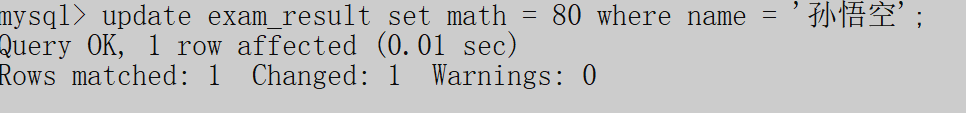

+ 我们再进行查看，可以看到已经修改成功了

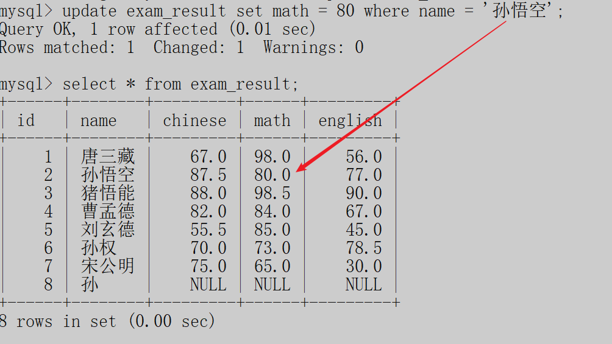

+ 将曹孟德同学的数学成绩变更为60分，语文成绩变更为70分

```sql
update exam_result set math = 60 ,chinese = 70 where name = '曹孟德';
```

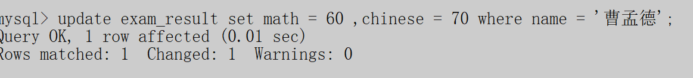

+ 将总成绩倒数前三的3位同学的数学成绩加上30分

```sql
select name, chinese + math + english  as total from exam_result order by total desc;
```

+ 首先我们查看有哪些同学是倒数三名的
+ null在排序的时候，视为最小的值

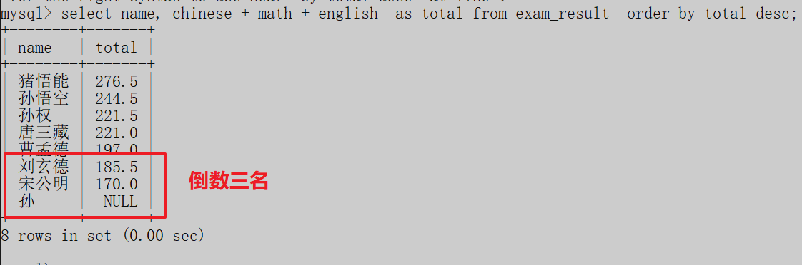

+ 然后我们接下来再进行将总成绩倒数前三的 3 位同学的数学成绩加上 30 分

```sql
update exam_result set math = math + 30 order by chinese + math + english asc limit 3;
```

+ 如果要加的的数字超出范围了，就会报错，原来的成绩不会修改

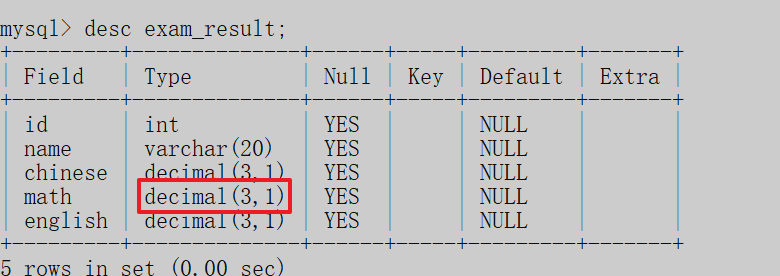

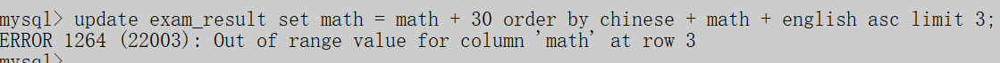

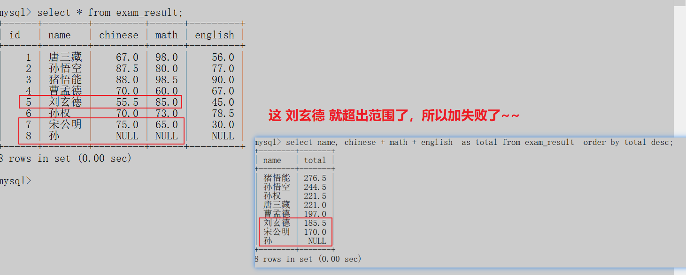

+ 我们加上10应该就不会报错了~~

```sql
update exam_result set math = math + 10 order by chinese + math + english asc limit 3;
```

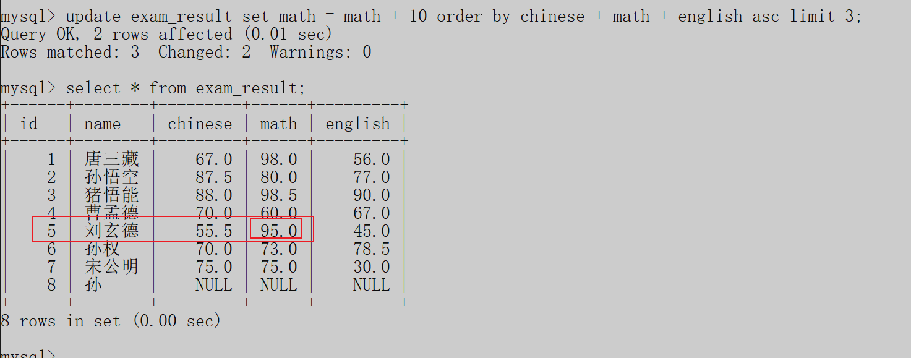

---

+ 将所有同学的语文成绩更新为原来的2倍
+ 这里如果要改成两倍的话，就会超出范围，我们就修改成0.5倍

```sql
update exam_result set chinese = chinese / 2;
```

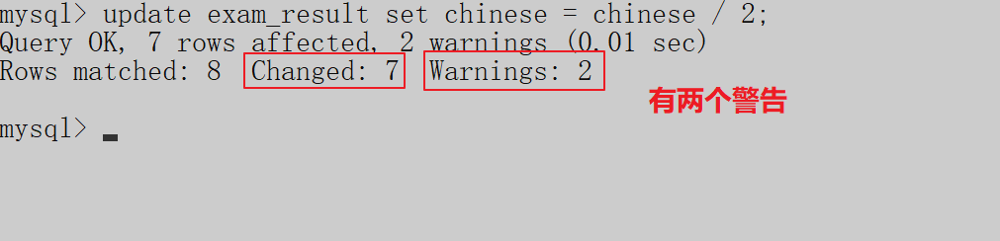

+ 我们这里可以查看警告

```sql
show warnings;
```

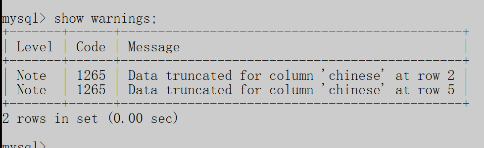

+ 其中里面的`truncated`意思就是截断！
+ 小数点后位数不够了，只能截断了

---

+ 这两个成绩已经是截断后的成绩了~~

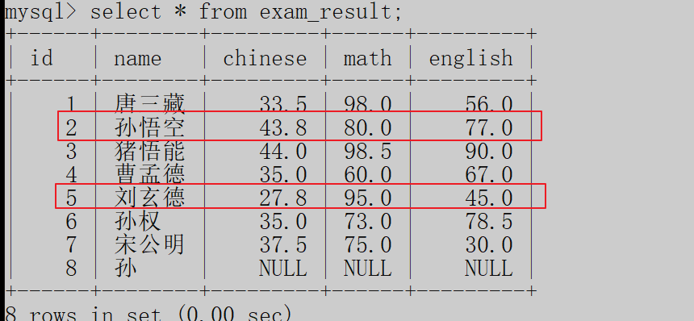

## 删除表中的的重复复记录，重复的数据只能有一份
+ 创建原数据表

```sql
CREATE TABLE duplicate_table (id int, name varchar(20));
```

+ 插入测试数据

```sql
INSERT INTO duplicate_table VALUES (100, 'aaa'), (100, 'aaa'), (200, 'bbb'), (200, 'bbb'), (200, 'bbb'), (300, 'ccc');
```

思路：

+ 创建一张空表 no_duplicate_table，结构和 duplicate_table 一样

```sql
CREATE TABLE no_duplicate_table LIKE duplicate_table;
```

+ 将 duplicate_table 的去重数据插入到 no_duplicate_table

```sql
INSERT INTO no_duplicate_table SELECT DISTINCT * FROM duplicate_table;
```

+ 通过重命名表，实现原子的去重操作

```sql
RENAME TABLE duplicate_table TO old_duplicate_table, no_duplicate_table TO duplicate_table;
```

+ 查看最终结果

```sql
SELECT * FROM duplicate_table;
```

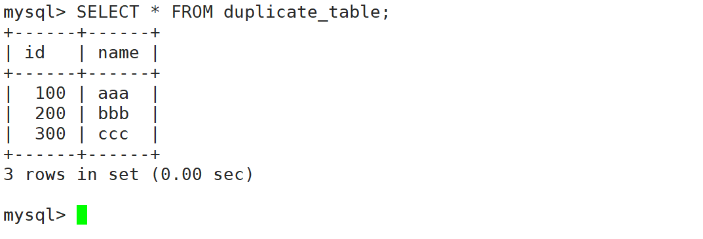

# 四、删除（Delete）
+ delete删除记录（行）

```sql
delete from 表名 where 条件;
```

+ 删除姓孙的考试成绩

```sql
delete from exam_result where name like '孙%';
```

+ 这里就是把条件匹配出来的结果，都删掉了！！

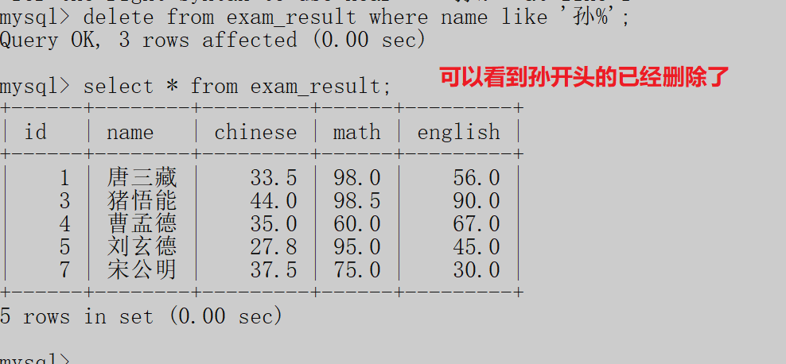

+ 后面不加条件，会不会里面的内容都会删除？`会的！！！`

```sql
delete from exam_result;
```

+ 可以看到已经全部删除了，这个操作基本相当于删表！！！

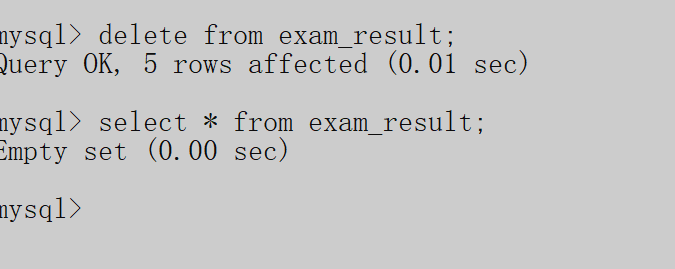

注意：如果使用delete删除表后表中的`AUTO_INCREMENT`不会重置，使用`TRUNCATE`则会重置！

## 截断表
1. 只能对整表操作，不能像 DELETE 一样针对部分数据操作；
2. 实际上 MySQL 不对数据操作，所以比 DELETE 更快，但是TRUNCATE在删除数据的时候，并不经过真正的事务，所以无法回滚。
3. 会重置`AUTO_INCREMENT`项
+ 创建表

```sql
CREATE TABLE for_truncate ( id INT PRIMARY KEY AUTO_INCREMENT, name VARCHAR(20) );
```

+ 插入数据

```sql
INSERT INTO for_truncate (name) VALUES ('A'), ('B'), ('C');
```

+ 截断整表数据，注意影响行数是 0，所以实际上没有对数据真正操作

```sql
TRUNCATE for_truncate;
```

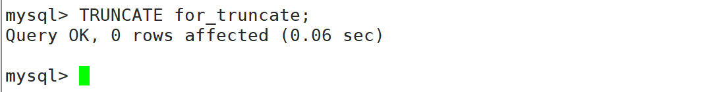

+ 查看删除结果

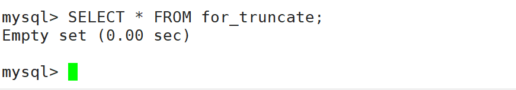

+ 再插入一条数据，自增 id 在重新增长

```sql
INSERT INTO for_truncate (name) VALUES ('D');
```

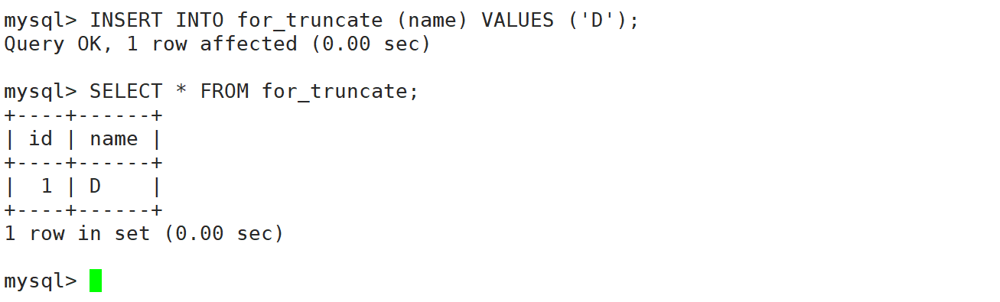

+ 查看表结构，会有 AUTO_INCREMENT=2 项

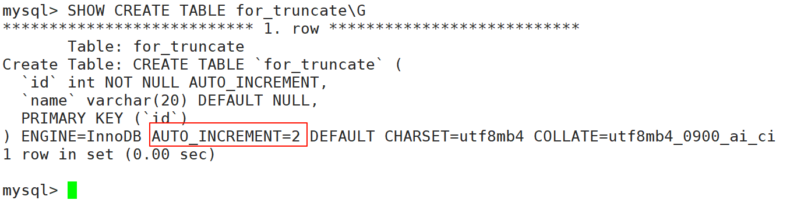

> 学习完上面的操作，那么增删改查都是什么呢？
>

+ 增：`insert into 表名...`
+ 删：`delete from 表名...`
+ 改：`update 表名...`
+ 查：`select from 表名...`

