# HTTPS协议
# HTTPS 是什么
HTTPS 也是一个应用层协议，是在 HTTP 协议的基础上引入了⼀个加密层。

HTTP 协议内容不管是GET还是POST都是按照文本的方式**明文传输**的，这就信息导致在传输过程中出现泄漏和被篡改的情况。所以在http和传输层直接添加一层软件层 —> ssl/tls(加密层)。

如果用的是http协议，就是http构建的请求经过网络然后交给对方http。
如果用的是https协议，从上到下要经过加密层把请求加密之后然后在经过网络发送给对方收到https请求之后也要进行解密。在双方本地信息都是明文的，在网络中是密文的。这样就能保证信息在网络中传输的安全。

那怎么知道收到的信息是加密还是没加密的呢？
如果信息没有加密请求的服务器端口采用的是80端口，信息加密的话请求的服务器端口采用的就是443端口。

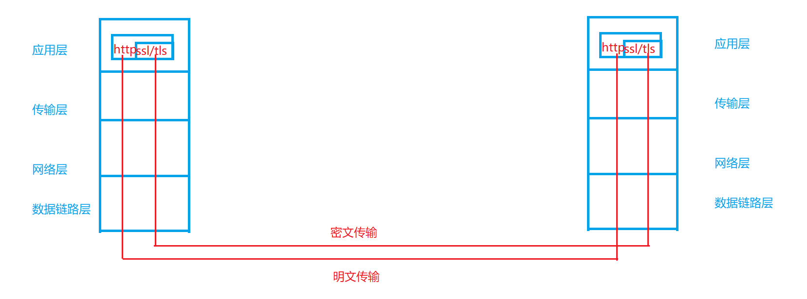

# 什么是"加密"
加密就是把 **明文** (要传输的信息) 进行一系列变换,，生成 **密文**。
解密就是把 **密文** 再进行一系列变换,，还原成 **明文** 。
在这个加密和解密的过程中,，往往需要一个或者多个中间的数据,，辅助进行这个过程，这样的数据称为 **密钥**。

下面举个简单例子理解一下。
int a = 100;
int key = 200;
int b = a ^ key;
int c = b ^ key;
c等于什么呢？
这里我们都知道，0 ^ a = a，b ^ b = 0，
并且 ^ 是支持交换率的a ^ b ^ c == a ^ c ^ b == c ^ b ^ a
所以这里c = b ^ key == a ^ key ^ key == a ^ 0 == a

现在我们有一个客户端和服务端。客户端发数据a，但并不是直接发的，我们把要发的a称为原始数据，把a和key做异或运算等于b，网络传送的时候把b传过去，服务器端收到b，服务端也必须要有一个key，然后b^key，最终等于a。

a---->原始数据
key---->密钥
a^key---->加密的过程
b---->密文
b---->解密

# 为什么要加密
比如说 **臭名昭著的 “运营商劫持”**

假设下载一个 网易云，未被劫持的效果，点击下载按钮，就会弹出网易云的下载链接。已被劫持的效果，点击下载按钮，就会弹出QQ浏览器的下载链接。

由于我们通过网络传输的任何的数据包都会经过运营商的网络设备(路由器，交换机等)， 那么运营商的网络设备就可以解析出你传输的数据内容，并进行篡改。
点击 “下载按钮”， 其实就是在给服务器发送了⼀个 HTTP 请求, 获取到的 HTTP 响应其实就包含了该APP 的下载链接。运营商劫持之后，就发现这个请求是要下载网易云， 那么就自动的把交给用户的响应给篡改成 “QQ浏览器” 的下载地址了。

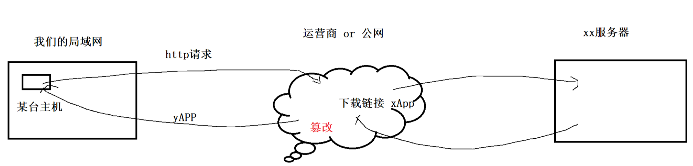

所以：因为http的内容是明文传输的，明文数据会经过路由器、wifi热点、通信服务运营商、代理服务器等多个物理节点，如果信息在传输过程中被劫持，传输的内容就完全暴露了。劫持者还可以篡改传输的信息且不被双方察觉，这就是**中间人攻击** ，所以我们才需要对信息进行加密。

不止运营商可以劫持，其他的**黑客**也可以用类似的收段进行劫持，来窃取用户隐私信息或者篡改内容。试想⼀下，如果黑客在用户登陆支付宝的时候获取到用户账户余额，甚至获取到用户的支付密码…

还有比如商场不知名的免费网络，如果你用手机连接上了这个wifi，当你用你的手机进行上网的时候，首先你请求发的报文是要先转发到这台提供免费网络的中间设备上，如果这个中间设备安装了类型与抓包分析报文的工具，就能拿到所有链接这个中间设备的数据了。不要连公共场所的网络！

在互联网上，**明文传输是比较危险的事情!!!**
HTTPS 就是在 HTTP 的基础上进行了加密, 进⼀步的来保证用户的信息安全~

# 常见的加密方式
**对称加密**

+ 采用单钥**密码系统**的加密方法，同**一个密钥**可以同时用作信息的加密和解密，这种加密方法称为对称加密，也称为单密钥加密，特征：加密和解密所用的密钥是相同的
+ 常见对称加密算法(了解)：DES、3DES、AES、TDEA、Blowfish、RC2等
+ 特点：算法公开、计算量小、加密速度快、加密效率高

对称加密其实就是通过同⼀个 “密钥” ，把明文加密成密文，并且也能把密文解密成明文。

**非对称加密**

+ 需要**两个密钥**来进行加密和解密，这两个密钥是公开密钥（public key，简称**公钥**）和私有密钥（private key，简称**私钥**）。
+ 常见非对称加密算法(了解)：RSA，DSA，ECDSA
+ 特点：算法强度复杂、安全性依赖于算法与密钥但是由于其算法复杂，而使得加密解密速度没有对称加密解密的速度快。

非对称加密要用到两个密钥, ⼀个叫做 “公钥”, ⼀个叫做 “私钥”.

公钥和私钥是配对的. 最大的缺点就是**运算速度非常慢**，比对称加密要慢很多.

+ 通过公钥对明文加密, 变成密文
+ 通过私钥对密文解密, 变成明文

也可以反着用

+ 通过私钥对明文加密, 变成密文
+ 通过公钥对密文解密, 变成密文

这里举一个简单的生活上的例子：

A 要给 B ⼀些重要的文件, 但是 B 可能不在. 于是 A 和 B 提前做出约定：
B 说: 我桌子上有个盒子, 然后我给你⼀把锁, 你把文件放盒子里用锁锁上, 然后我回头拿着钥匙来开锁取文件.
在这个场景中, 这把锁就相当于公钥, 钥匙就是私钥. 公钥给谁都行(不怕泄露), 但是私钥只有 B 自己持有. 持有私钥的人才能解密.

**对称密钥：一个秘钥，速度快**
**非对称密钥：两个密钥，公钥、私钥，速度慢**

如何理解加密的安全性？
从算力成本角度看，需要算力越大加密的安全性越大。如一条消息本身就值10块钱但是加密之后破解这条消息需要花10个亿成本，最终我们认为这个密钥本身是安全的。

# 数据摘要&&数据指纹
+ 数字指纹(数据摘要),其基本原理是利用**单向散列函数**(Hash函数)对信息进行运算,**生成一串固定长度的数字摘要**。**数字指纹并不是一种加密机制,但可以用来判断数据有没有被窜改**。

比如说今天有一篇非常大的文章，可以基于hash为原理对这篇文章做摘要，其实就是对这篇文章整体内容做hash，经过hash之后形成一个固定长度的字符串，这个字符串和这篇文章对应关系算是1:1的，意思就是今天哪怕对原始文章做任何一个局部的修改，最后经过hash映射形成的固定长度的字符串也会立马发生变化。

我们把一个大的内容经过hash变成一个固定长度的字符串这种唯一性非常强的字符串，我们称之为数据摘要。

+ 摘要常见算法：有MD5、SHA1、SHA256、SHA512等，算法把无限的映射成有限，因此可能会有碰撞（两个不同的信息，算出的摘要相同，但是概率非常低）
+ 摘要特征：和加密算法的区别是，**摘要严格意义不是加密，因为没有解密**，只不过从摘要很难反推原信息，**通常用来进行数据对比（对比两个文件是否是同一个文件）**

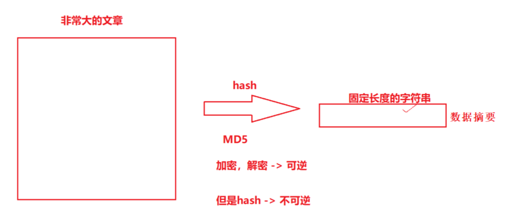  

如百度网盘秒传功能。假如你有一个百度网盘，你将一部黑客帝国的电影传到网盘中花了2个小时，然后网盘内经过hash映射形成一个固定大小的字符串。然后张三也想上传黑客帝国，那是不是注定百度网盘存在大量重复的资源，对于空间消耗太大了。百度网盘这时就可以将黑客帝国文件资源经过hash映射形成数据摘要。历史上所有网盘上存在的文件都形成摘要，另一个传资源的时候先在本地把要穿的资源形成摘要然后和百度网盘中所维护大量的摘要进行对比，找不到就上传，如果找到直接把这个资源在你的网盘目录下建立一个软连接执行这个资源，你们共用同一份资源，但是你们并不知道。这样就实现了秒传功能。

不管是大文本还是小文本都可以经过hash映射形成固定大小的字符串！

# 数字签名
摘要经过加密，就得到数字签名  
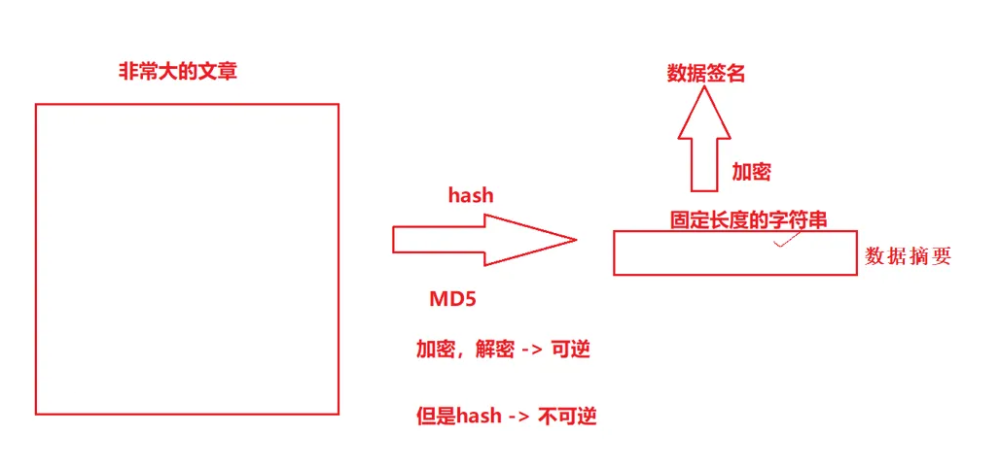

## 理解链 - 承上启下
+ 对http进行对称加密，是否能解决数据通信安全的问题？问题是什么？
+ 为何要用非对称加密？为何不全用非对称加密？

带着问题我们看接下来的内容。

# HTTPS 的工作过程探究
既然要保证数据安全, 就需要进行 “加密”.
网络传输中不再直接传输明文了, 而是加密之后的 “密文”
加密的方式有很多, 但是整体可以分成两大类: **对称加密** 和 **非对称加密**

其实在网络通信，我们要解决的是如下问题：

1. 数据被监听
2. 数据被篡改

## 方案一：只使用对称加密
如果通信双方都各自持有同一个密钥X，且没有别人知道，这两方的通信安全当然是可以被保证的（除非密钥被破解）
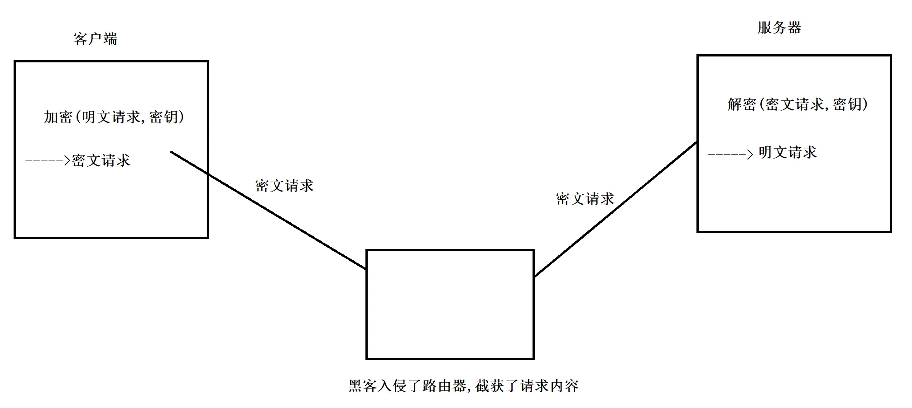 
引入对称加密之后, 即使数据被截获, 由于黑客不知道密钥是啥, 因此就无法进行解密, 也就不知道请求的真实内容是啥了.

但事情没这么简单. 服务器同一时刻其实是给很多客户端提供服务的. 这么多客户端, 每个⼈用的秘钥都必须是不同的(如果是相同那密钥就太容易扩散了, 黑客就也能拿到了). 因此**服务器就需要维护每个客户端和每个密钥之间的关联关系**, 这也是个很麻烦的事情~

但这不是最重要的，**最重要的是最开始的时候我们怎么保证客户端和服务器看到的是同一个密钥**。如果最开始客户端把密钥发给服务器，那这个密钥是明文传还是密文传？明文传那黑客不就拿到了，加密传那就需要对密钥进行加密，就仍然需要先协商确定一个 “密钥的密钥”，这不就是鸡生蛋还是蛋生鸡的问题吗？所以纯纯使用对称加密是不行的！

**因此在进行正常的加密数据通信之前，我们得先解决密钥如何被对方安全收到的问题！**

## 方案二：只使用非对称加密
通信之前先得交换密钥，鉴于非对称加密的机制，用公钥和私钥都可以加密，但用公钥加密就要使用私钥解密，使用私钥加密就要使用公钥解密。首先服务器先形成一对公钥私钥，客户端发起秘钥协商握手给服务器，服务器把公钥推送给客户端，这个公钥中间人一定能拿到，客户端拿到公钥，不管发什么数据都先要经过公钥非对称加密形成密文后然后发给服务端，虽然中间人还能看到，但是因为对应得公钥加密只能私钥解密，私钥加密只能公钥解密。只有服务端有私钥因此只有服务端能解密，即便是中间人拿到数据也没有办法因为数据是加密的。目前从客户端到服务器是安全的！

但是服务器给客户端返回数据就有问题了！别人给我的数据是安全的，我给别人的数据怎么保证安全。服务器直接用私钥加密数据给客户端发回去可以吗？这个公钥全世界人民都可以拿到，服务器用私钥加密不就相当于没加密吗？那服务器用公钥加密然后给客户端发回去，好现在这个数据安全了，但是客户端拿到这个经过公钥加密的密文，它又没有私钥，怎么解密？
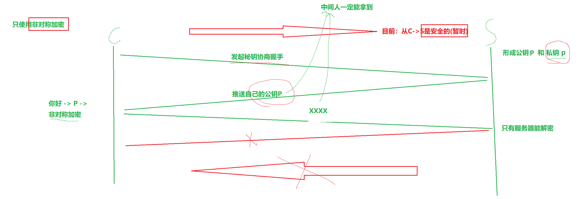

现在只能保证从C->S的安全性(暂时的安全)，没有办法解决S->C的安全性。
没事我们在提第三种方案。

## 方案三：双方都使用非对称加密
1. 服务端拥有公钥S与对应的私钥S’，客户端拥有公钥C与对应的私钥C’
2. 客户和服务端交换公钥
3. 客户端给服务端发信息：先用S对数据加密，再发送，只能由服务器解密，因为只有服务器有私钥S’
4. 服务端给客户端发信息：先用C对数据加密，在发送，只能由客户端解密，因为只有客户端有私钥C’

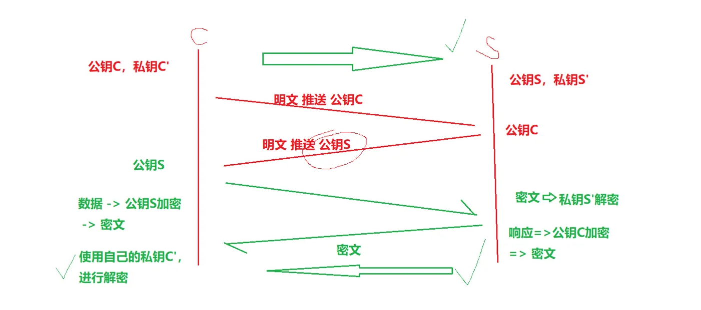  
虽然公钥是公开的但公钥是用来加密的，而私钥只有自己拥有，只能自己才能进行解密。这样通信方案貌似是无懈可击的，可是它有两个问题。

最开始说过，非对称加密算法非常复杂所以它非常慢！

1. 慢
2. 还是有安全问题，这是和方案二安全问题是一样的，下面在提它们的安全问题

## 方案四：非对称加密 + 对称加密
先解决慢的问题

+ 服务端具有非对称公钥S和私钥S’
+ 客户端发起https请求，获取服务端公钥S
+ 客户端在本地生成**对称密钥C**, 通过公钥S加密形成X, 发送给服务器.
+ 由于中间的网络设备没有私钥, 即使是截获了数据, 也无法还原出内部的原文, 也就无法获取到对称密钥(**真的吗?**)
+ 服务器拿到X通过私钥S’解密, 还原出客户端发送的对称密钥C. 并且使用这个对称密钥加密给客户端返回的响应数据.
+ 后续客户端和服务器的通信都只用对称加密即可. 由于该密钥只有客户端和服务器两个主机知道, 其他主机/设备不知道密钥即使截获数据也没有意义.

前半部分采用非对称加密：交换密钥，后半部分采用对称加密：双方不存在了安全问题。既安全，又高效。

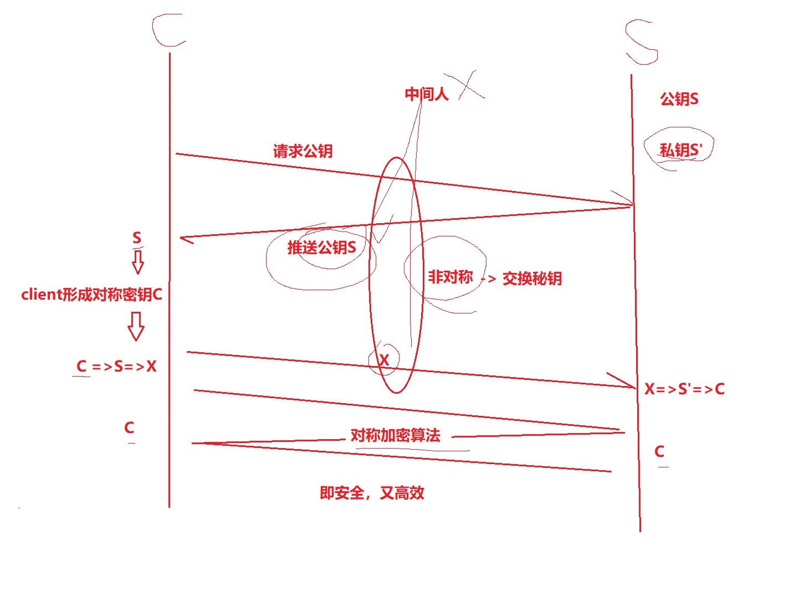 
但真的没有问题了吗？

方案二、方案三、方案四都存在一个问题，如果最开始，中间人就已经开始攻击了呢？

## 中间人攻击 - 针对上面的场景
确实，在方案2/3/4中，客户端获取到公钥S之后，客户端形成的对称秘钥C然后用服务端给客户端的公钥S对C进加密，中间人即使窃取到了数据，此时中间人确实无法解出客户端形成的密钥C，因为只有服务器有私钥S’。

但是中间人的攻击，如果在最开始握手协商的时候就进行了，那就不一定了，假设hacker在最开始的时候已经成功成为中间人

+ 服务器具有非对称加密算法的公钥S，私钥S’
+ 中间人具有非对称加密算法的公钥M，私钥M’
+ 客户端向服务器发起请求，服务器明文传送公钥S给客户端
+ 中间人劫持数据报文，提取公钥S并保存好，然后将被劫持报文中的公钥S替换成为自己的公钥M，并将伪造报文发给客户端
+ 客户端收到报文，提取公钥M(自己当然不知道公钥被更换过了)，自己形成对称秘钥C，用公钥M加密C，形成报文X发送给服务器
+ 中间人劫持后，直接用自己的私钥M’进行解密，得到通信秘钥C，再用曾经保存的服务端公钥S加密后，形成新的报文Y推送给服务器
+ 服务器拿到报文Y，用自己的私钥S’解密，得到通信秘钥C
+ 双方开始采用C进行对称加密，进行通信。但是⼀切都在中间⼈的掌握中，劫持数据，进行窃听甚至修改，都是可以的

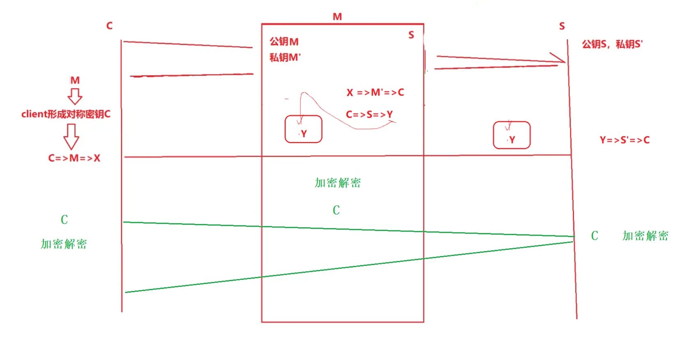 
所以前面非对称加密，后面对称加密也是有坑的。

上面的攻击方案，同样适用于方案2、方案3

问题本质出在哪里了呢？
**服务器返回公钥的时候，被中间人窃取并替换了&&客户端没有辨别公钥是否合法的能力**

下面要围绕 **客户端能够具有辨别服务器发过来的公钥的合法性！** 来解决问题。

## 引入证书
**CA认证**

服务端在使用HTTPS前，需要向CA机构申领一份数字证书，数字证书里含有证书申请者信息、公钥信息等。服务器把证书传输给浏览器，浏览器从证书里获取公钥就行了，**证书就如身份证，证明服务端公钥的权威性**。

CA证书说白了就是一个文本文件，这个文件是可以安装在你的系统中的，放在磁盘的某个目录下，当客户端首次请求浏览器把这个文件返回给客户端。

下面是证书申请的流程: 
作为申请方首先要形成公钥私钥对，然后确实申请信息，最后生成请求.csr文件，提交给CA机构审核，审核通过CA签发证书，返回给server，client发起请求，server先把证书给client，client对证书做验证，验证通过从证书里提取公钥，然后就像刚才的过程形成对称密钥，然后加密返回给server，然后双方就可以通信了。

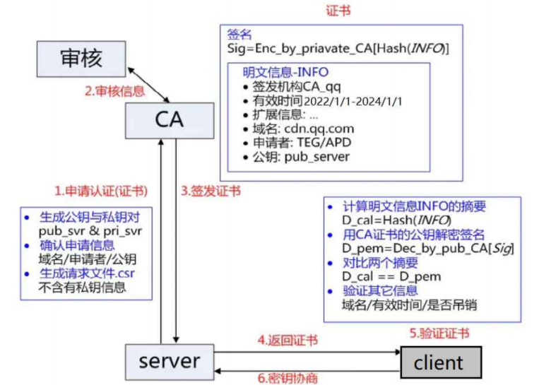

这个1、2、3过程只是在服务器申请证书才会做，申请好之后从此往后只有4、5、6过程。除非证书到期了才要重新申请证书。

**客户端能够具有辨别服务器发过来的公钥的合法性!** 我们说是通过证书来进行甄别的，那证书如何做到的呢？

## 理解数据签名
签名的形成是基于非对称加密算法的，注意，目前暂时和https没有关系，不要和https中的公钥私钥搞混了。

**签名**：

对一份文本(可以认为这里是CA证书内的明文信息)经过hash散列形成散列值，我们称之为数据摘要。然后用签名者的私钥(CA机构的**私钥**)对数据摘要加密形成了数据签名，更重要的把这个数据签名和这个明文信息合在一起，形成数字签名的数据。

**验证**：

把原始文本和签名分开，一个对原始文本使用相同的散列函数进行散列形成散列值，另一个对签名用签名者的公钥解密形成散列值，然后对比两个散列值，如果这两个散列值不一样，就注定有人要么改了原始文件，要么改了签名。只要这两个散列值一样，那么原始文本和它曾经形成的签名是一样的，说明这个原始文本没有被篡改过！

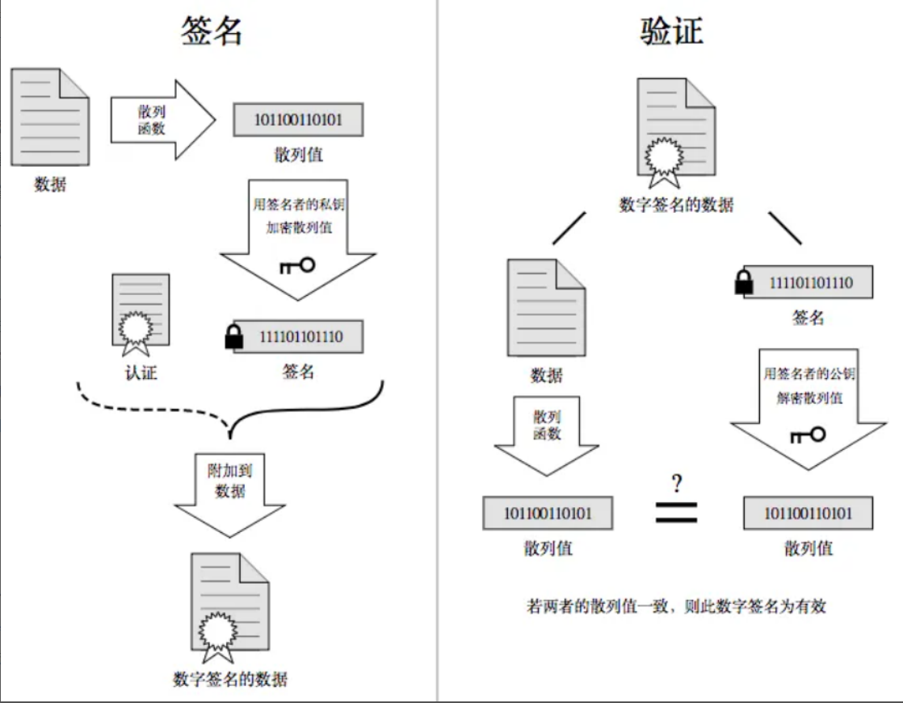

**数字签名的本质是为了防止篡改。**

下面我们在以画图的方式理解签名和验证的过程。

**签名**：

首先说一下，CA为了签发证书，CA也有自己的CA公钥，CA私钥。
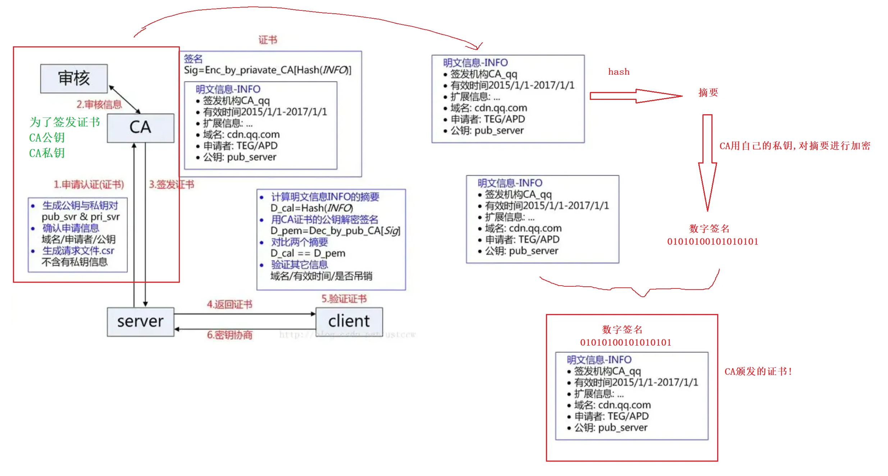

**因为我们使用CA的私钥形成数据签名，所以只有CA能形成可信任的证书！(CA私钥只在CA)**

**验证：**

当客户端首次向服务器发起请求，服务器会把签发好的证书推送给客户端，那客户端拿到证书不就是拿到公钥了吗，这个公钥不就是曾经服务端申请的公钥吗。

现在的问题就是如何保证这个公钥的合法性呢？
所以客户端要对收到的证书进行验证。

如何验证？

将证书上的明文数据和数字签名分开，把明文数据经过相同的hash映射(这个hash是公开的)形成**数据摘要**。因为**CA会在所有的浏览器中内置自己的公钥**！所以浏览器会拿着CA公钥对CA曾经的数字签名进行解密！得到**曾经原始数据的摘要**。然后对比两个摘要。两者相等说明证书内部没被串改，如果两者不相等说明证书被篡改过。

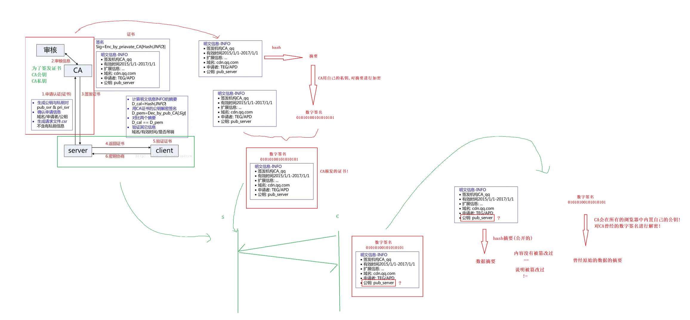

以前不是说中间人最开始的时候改公钥吗，现在把证书带上。

**中间人有没有可能篡改该证书？**

即使现在中间人把证书公钥给替换了，但数字签名中间人没有CA私钥，那数字签名就改不了。 未来在做hash形成数据摘要，和解密过的数字签名形成的数据摘要，一定不同，那客户端立马就知道这个证书是被改过的。因此公钥中间人不能改了。

那中间人把公钥改了，然后中间人拿自己的私钥做数字签名，可以吗？理论上可以，但是客户端根本不认识你这个数字签名，客户端用的是内置的CA公钥进行解密，解不开也是不行的。

**到目前为止中间人没有办法进行任何局部的替换。无论是明文，还是签名！**

**中间人整个掉包证书？**

中间人现在把整个证书全部替换掉可以吗？首先因为浏览器在做解密的会使用CA在所有的浏览器内置的CA公钥进行解密，就这一条就注定了你要对证书进行整体替换，你这个证书就必须是真的证书！是你这个中间人曾经向CA机构认证过的证书，首先没有这么傻的中间人，即使真有这样的人，行但你会发现另一个问题，每一个证书明文都有一个域名，客户端目标访问的网站是www.qq.com，即使中间人用真证书来改，但是注定了中间人用的这个域名和客户端访问的域名是不一样的(域名具有唯一性)。你的域名是www.xx.com，即使中间人你用的真证书把我应收到证书给换了，行客户端收到了，然后用CA公钥解密也可以，两个数字摘要也是一样的，好证书没被篡改过，但是客户端一对比就知道了，我要请求的是www.qq.com，但是你的证书怎么给我的是www.xx.com，虽然证书是真的但是域名不一样，客户端立马意思到不对。客户端照样能识别出来。

**中间人也没有办法进行整体替换**

## 方案五：非对称加密 + 对称加密 + 证书认证
非对称加密用来进行密钥交换，对称加密用来实际真实通信时加密数据的安全和效率问题，证书用来证明非对称加密之前在进行密钥协商阶段服务器公钥的合法性。
三位一体真正解决了问题。

下面看具体流程：

在客户端和服务器刚一建立连接的时候, 服务器给客户端返回一个 **证书**，证书包含了之前服务端的公钥, 也包含了网站的身份信息
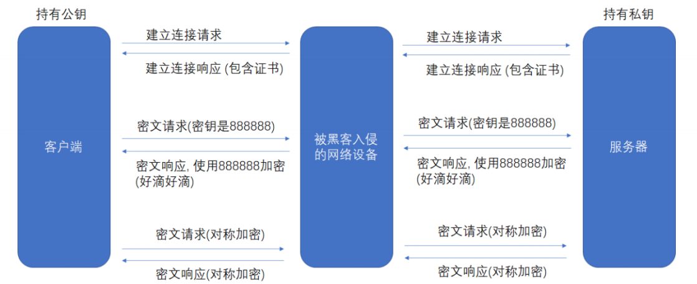 
**客户端进行认证**

当客户端获取到这个证书之后, 会对证书进行校验(防止证书是伪造的).

+ 判定证书的有效期是否过期
+ 判定证书的发布机构是否受信任(操作系统中已内置的受信任的证书发布机构).
+ 验证证书是否被篡改: 从系统中拿到该证书发布机构的公钥, 对签名解密, 得到⼀个 hash 值(称为数据摘要), 设为 hash1. 然后计算整个证书的 hash 值, 设为 hash2. 对比 hash1 和 hash2 是否相等. 如果相等, 则说明证书是没有被篡改过的。

### 常见问题
**为什么摘要内容在网络传输的时候一定要加密形成签名?**

这个问题其实我们前面就已经回到了，就比如证书，如果不对摘要加密形成签名，那中间人把证书改了，然后重新hash映射形成一个摘要放在证书里，客户端收到也用相同的hash把证书明文信息形成摘要，即使中间人改了证书，那客户端也看不出来。这个加密的过程是为了让CA参与进来，防止被篡改。

**为什么原始数据不直接加密形成签名，而是要先hash形成摘要?**

首先对文本做hash摘要会把文本变成一个固定大小的(比较短)的hash值是非常快的，并且对hash值做加密形成签名速度也非常快。其次有的算法对加密的文本长度是有要求的，对大的文本没有办法做整体加密。(缩小签名密文的长度，加快数字签名的验证签名的运算速度）

**如何成为中间人 - 了解**

+ ARP欺骗：在局域网中，hacker经过收到ARP Request广播包，能够偷听到其它节点的 (IP, MAC)地址。例， 黑客收到两个主机A, B的地址，告诉B (受害者) ，自己是A，使得B在发送给A 的数据包都被黑客截取
+ ICMP攻击：由于ICMP协议中有重定向的报文类型，那么我们就可以伪造一个ICMP信息然后发送给局域网中的客户端，并伪装自己是一个更好的路由通路。从而导致目标所有的上网流量都会发送到我们指定的接口上，达到和ARP欺骗同样的效果
+ 假wifi && 假网站等

### 完整流程
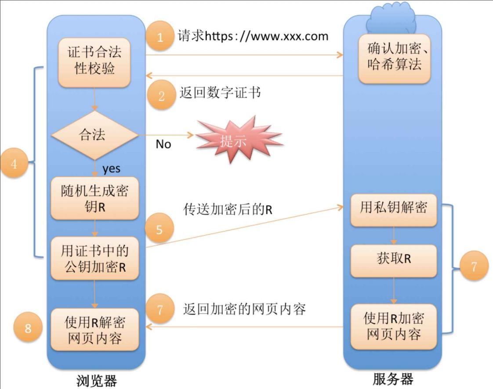

**总结**

HTTPS 工作过程中涉及到的密钥有三组

**第一组(非对称加密)(CA的公钥和私钥)**：用于校验证书是否被篡改。 服务器持有自己私钥(私钥在形成CSR文件与申请证书时获得)，客户端持有CA公钥(操作系统包含了可信任的 CA 认证机构有哪些， 同时持有对应的公钥)。服务器在客户端请求时，返回携带签名的证书。客户端通过这个CA公钥证书验证，保证证书的合法性，进一步保证证书中携带的服务端公钥权威性。

**第二组(非对称加密)(服务器的公钥和私钥)**：用于协商生成对称加密的密钥。客户端用收到的CA证书中的服务器公钥(是可被信任的)给随机生成的对称加密的密钥加密，传输给服务器，服务器通过自己私钥解密获取到对称加密密钥。

**第三组(对称加密)**： 客户端和服务器后续传输的数据都通过这个对称密钥加密解密。

其实一切的关键都是围绕这个对称加密的密钥，其他的机制都是辅助这个密钥工作的。

**第二组非对称加密的密钥是为了让客户端把这个对称密钥传给服务器  
****第一组非对称加密的密钥是为了让客户端拿到第二组非对称加密的公钥**

