# HTTP协议
虽然我们说, 应用层协议是我们程序猿自己定的. 但实际上, 已经有大佬们定义了一些现成的，又非常好用的应用层协议, 供我们直接参考使用. HTTP(超文本传输协议)就是其中之一。

在互联网世界中，HTTP（HyperText Transfer Protocol，超文本传输协议）是一个至关重要的协议。

它定义了客户端（如浏览器）与服务器之间如何通信，以交换或传输超文本（如HTML文档）。

HTTP协议是客户端与服务器之间通信的基础。客户端通过HTTP协议向服务器发送请求，服务器收到请求后处理并返回响应。HTTP协议是一个无连接、无状态的协议，即每次请求都需要建立新的连接，且服务器不会保存客户端的状态信息。

虽然我们现在关于http协议不知道它是什么。但我们知道你的http协议里面必有套接字，必有序列化和反序列的机制，也必须添加报头和分离报头的过程等等。

在说这个http协议之前，我们先做一个预备工作，我们知道OSI分七层前三层分别是应用层，表示层，会话层。在TCP/IP协议这三层合起来算一层应用层。

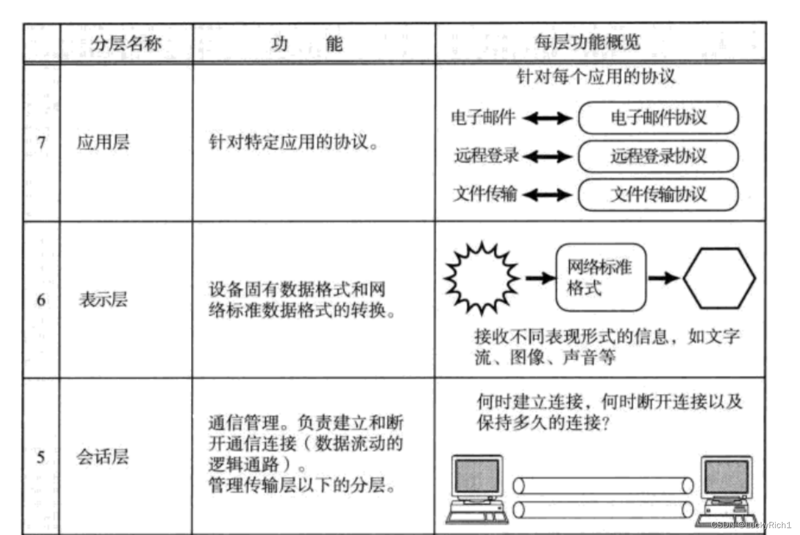  


OSI定义成七层，原因就是后面写代码时每一层都少不了。OSI为什么没把这三层压成一层呢？在于表示层有自定义的方案、Json方案、protobuf方案、xml方案等等，如果它某种方案写到内核里就固定下来了，而实际上我们并没有固定。

http作为应用层协议它也要解决刚才说的三个工作。

# 认识URL
平时我们俗称的 “网址” 其实就是说的 URL

[https://www.baidu.com/](https://www.baidu.com/)

https：协议

www.baidu.com：域名，域名等价于IP，这里会有一个域名解析的工作(把域名这个字符串结构转化成IP地址)，IP标识一台网络主机(Linux系统)

/：文件路径

URL的作用就是，浏览器通过拿着这个URL，找到这台Linux机器然后在这台机器上找对应的文件。把文件打开返回给浏览器。  
实际上URL有多种格式。

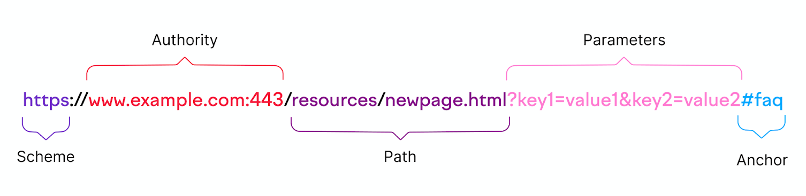

为什么我们刚才URL没有端口呢？

我们对应的协议是和端口号强相关的。服务器端口号是一个众所周知的端口号，一般不能随便改变，刚才URL没有写出来并不代表没有，因为客户端访问服务器端一定要知道服务端的是IP地址和端口号。这里没有但浏览器在真正请求时会给我们填上，浏览器结合我们用的协议就知道用的端口号是多少。默认一些协议对应的端口号：  
http：80  
https：443

---

这里在端口后面的/是什么？  
其实它并不是根目录，而是web根目录，一般而言，可以是Linux下的任意一个目录。这个任意目录必须要有对应请求的资源。(后面写代码的时候具体解释)

http是文本传输协议。说白了**http协议就是从服务器拿下来对应的 “资源”。**

---

什么是资源呢？  
凡是你在网络中看到的都是资源！(如：刷的短视频是视频文件、淘宝上看到的图片是图片文件，网易云听的音乐是音乐文件。。。)  
所有的资源都可以看做资源文件，在服务器中都是以文件形式存在磁盘中的文件系统中的某一个路径下，所以需要Linux系统的路径结构。当要的时候把磁盘中对应的路径所标识的资源返回给客户端。所以http协议本质上是从服务器上拿文件资源。  
因为文件资源的种类特别多，http都能搞定，所以**http是 “超文本传输协议”**。

# urlencode和urldecode
像 / ? : 等这样的字符， 已经被url当做特殊意义理解了。因此这些字符不能随意出现。比如， 某个参数中需要带有这些特殊字符，就必须先对特殊字符进行转义。  
如果原封不动会干扰url的正确解析，所以浏览器这端必须先编码然后提给服务端。

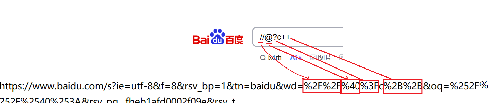

那如何编码&&如何解码，需要自己做吗？

编码转义的规则如下：  
将需要转码的字符转为16进制。一个字符占8个比特位，然后从右到左，取4个比特位转成16进制数(不足4位直接处理)，每2位16机制数前面加上%，编码成%XY格式

解码就是把收到的这些东西转成2进制的格式

我们写服务端如果从0开始写这个解码工作一定要自己做，但是我们在网上搜索`url decode C++`源码，当一个CV工程师。

如何验证这个过程？  
[urlencode工具](https://tool.chinaz.com/Tools/urlencode.aspx)

# HTTP协议格式
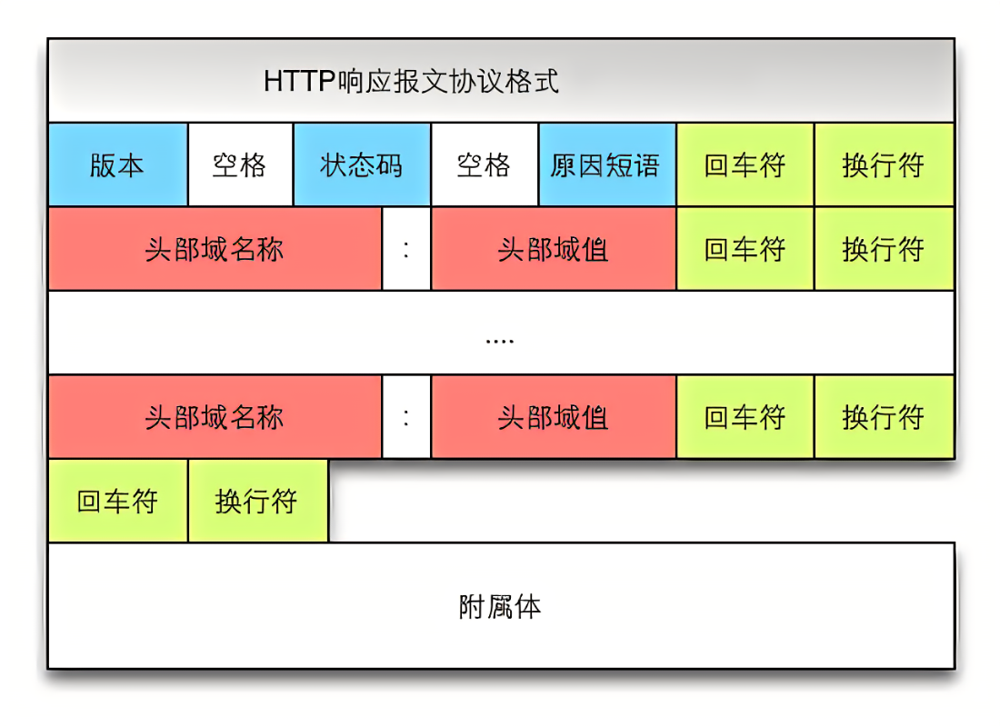

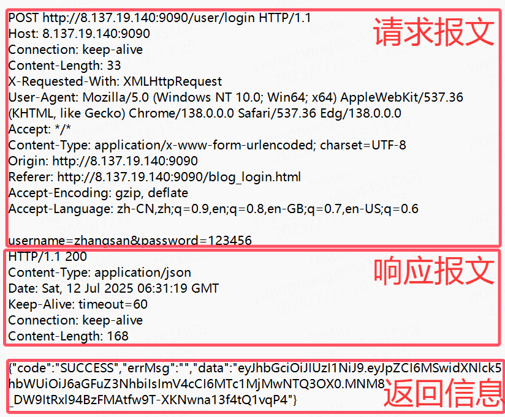

## 请求
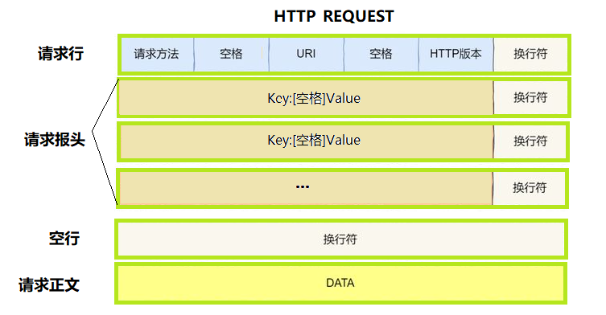

首行: [方法] + [url] + [版本]

Header: 请求的属性, 冒号分割的键值对;每组属性之间使用`\r\n`分隔遇到空行表示 Header 部分结束

Body: 空行后面的内容都是Body. Body允许为空字符串. 如果Body存在, 则在Header中会有一个Content-Length属性来标识Body的长度;

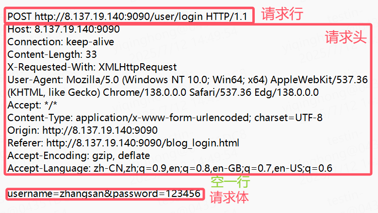

## 响应
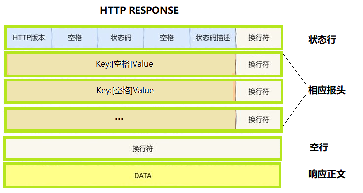

首行： [版本号] + [状态码] + [状态码解释]

Header: 请求的属性, 冒号分割的键值对; 每组属性之间使用`\r\n`分隔; 遇到空行表示Header部分结束Body: 空行后面的内容都是Body. Body允许为空字符串. 如果Body存在, 则在Header中会有一个Content-Length属性来标识Body的长度；如果服务器返回了一个html页面, 那么html页面内容就是在body中.

1. 请求和响应怎么保证应用层完整读取完毕了呢？

> 首先我们发现http请求都是字符串按行为单位，所以我可以读取完整的一行
>
> while(读取完整一行) --> 所有的请求行+请求行报文全部读完 --> 直到空行！
>
> 我们没说正文也是按行为单位分开的没有办法保证把正文读完，但是我们能保证把报头读完，而报头里有一个Content-Length：xxx（代表正文长度）
>
> 解析出来内容长度，在根据内容长度，读取正文即可！
>

2. 请求和响应是怎么做到序列化和反序列化的？

> http是用的特殊字符自己实现的。http序列化什么都不做直接发就好了，反序列化 ：第一行+请求/响应报头，只要按照\r\n将字符串1->n即可！不用借助任何东西如Json  
protobuf等。而正文序列化反序列也不用做直接发送就行了。如果你的正文携带结构化数据就要自己处理了。
>

# HTTP协议基本工作流程
下面我们用浏览器充当客户端发起请求看一下结果

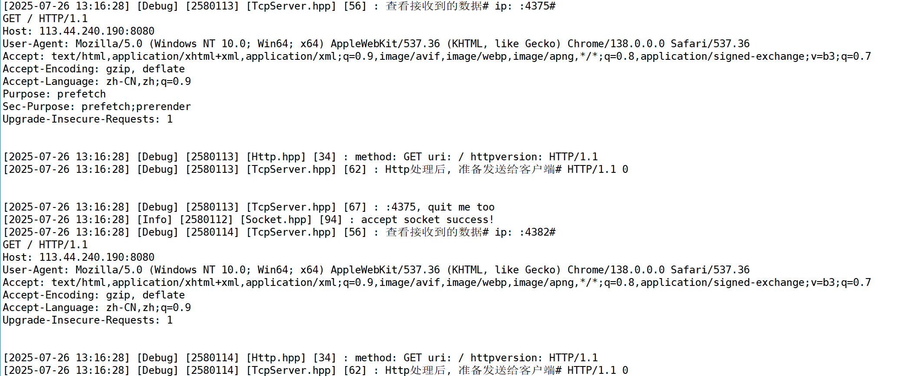

浏览器内部请求资源可能是一个多线程版的客户端，并且它请求可能不仅仅请求这个网站的网页，还可能获取网站的图标其他一些资源，它可能并行的向服务器发起请求。

<font style="color:rgb(77, 77, 77);">因为我们什么都没有返回，所以网页什么都看不到。</font>

<font style="color:rgb(77, 77, 77);">下面是我们的请求报文，服务器在打印的时候我们多打印了一个endl，所以会看到两个空行。实际应该是一个空行。</font>

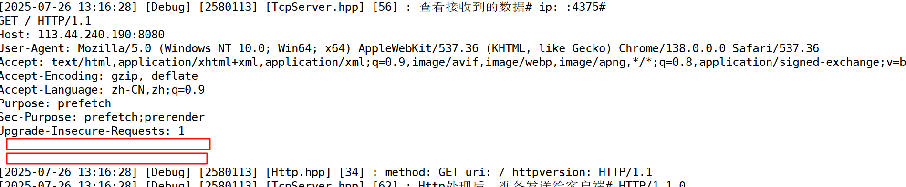

1. 第一行是请求方法，默认是GET方法。
2. 第二列url，这里是/，是因为我们只是告诉浏览器要访问某个ip的某个port并没有告诉请求什么资源，默认是/(web根目录)，它并不是把所有资源都给用户。http请求如果没有请求指定的资源，web server 会有默认的首页！
+ 比如说，我们默认请求百度www.baidu.com，后面什么都没带没告诉要访问百度那个网页，按回车默认就把百度首页返回了。
+ 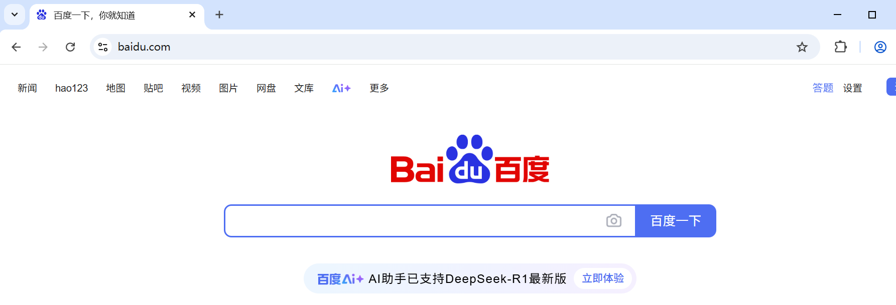
3. 第三列是http请求的版本，这里浏览器默认用的1.1的版本，未来响应返回的时候也要写版本。这里有个细节，http请求会交换bs通信双方的协议版本。
+ 我们在用一些软件的时候，有的软件会提醒你就行升级更新，有的人会升级有的人不会，一定会存在多种客户端版本的情况，所以服务器可能面临多种不同版本的客户端，如果是老版本的客户端一定用的是老版本的服务，服务端给它提供老版本的服务，同理是新版本客户端服务端给它提供的是新版本的服务，因此需要服务器提供对应的版本服务。

接下面一堆东西就是请求报头。

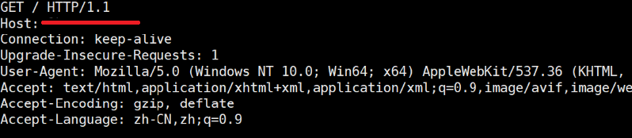

1. 第一行Host：是这个请求未来是要发给那个服务端的。未来客户端这个请求去到一个服务器，但这个服务器不提供服务，然后该服务器拿着我的Host知道我要请求谁，它替我去请求。这个中间服务器叫做代理服务器。
2. 第二行Connection：关于后面说长短链接的时候再说，目前这个是支持长链接的。
3. 第三行是支持协议升级，http是可以被升级的，http是cs/bs模式请求响应的模式，也就是说必须是客户端主动发起请求，服务器才能给它响应。可能在特殊场景下让服务器和客户端互发消息，客户端没有发任何消息，服务器主动发信息给客户端。
4. 第四行User-Agent：是客户端的信息，如操作系统是什么，浏览版本等
5. 下面几行Accept：是告诉服务器，客户端能接收什么文档格式、支持压缩格式、支持编码格式等等

---

报头后面再填，正文部分先搞一个网页，直接ai即可

```cpp
string body="<html lang=\"en\"><head><meta charset=\"UTF-8\"><title>for test</title><h1>hello world</h1></head><body><p>hello worldhello worldhello worldhello worldhello worldhello worldhello worldhello worldhello worldhello worldhello worldhello worldhello worldhello worldhello worldhello worldhello worldhello worldhello worldhello worldhello worldhello worldhello worldhello worldhello worldhello worldhello worldhello world</p></body></html>";
```

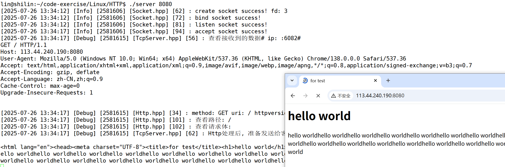

虽然我们在响应的时候没有带响应报头，但是我们的浏览器依旧是能识别的，这里想说的是现在浏览器很智能了，可以不用告诉它正文是什么也可以根据正文内容识别这是什么东西，但是有的浏览器做不到。这里我们用的是chrome浏览器。

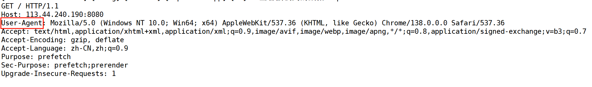

但是你浏览器能识别是你的事情，我们还是要把自己的事做好，告诉浏览器我给你发回的是什么东西。

所以我们要加一个报头里面可以带一些属性。如Content-Type ，告诉别人返回的是什么资源。网上可以搜一下**Content-Type 对照表，**<font style="color:rgb(77, 77, 77);">这里我们返回的是一个网页，类型是text/html</font>

可以查看这个：[**https://www.runoob.com/http/http-content-type.html**](https://www.runoob.com/http/http-content-type.html)

---

需要解决的问题：

1. 服务器和网页分离，然后通过服务器把网页返回
2. 前面我们说过，我们请求没带路径url会给我们一个/(默认web根目录)，这个根目录并不是liunx服务器下的根目录，而是web服务器自己的根目录，怎么理解呢？

实际上未来一个web服务器写好之后，可不仅仅有这些代码。每一个web服务器都有web根目录，未来所有图片、视频、音频等各种web资源都在这个目录下，按照目录结构组织号好，未来想请求资源就从url请求。那如何保证按照我们的需求在指定路径下去寻找呢？

默认路径：

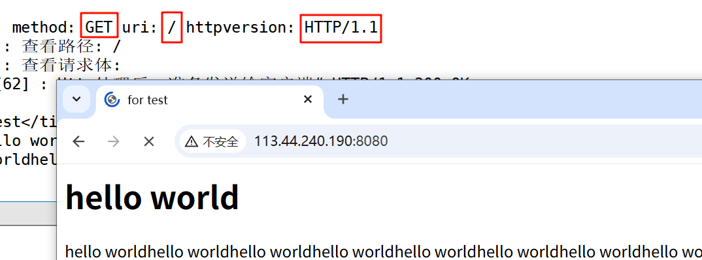

指定路径：

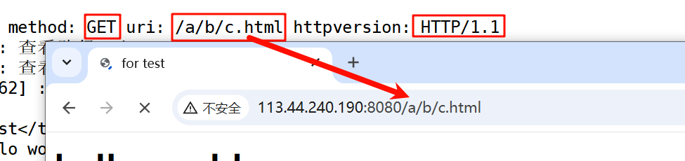

在url是这样请求的，但是实际上web服务器它会自己拼前缀，带着这个路径去找对应资源文件，如果有就返回，没有就返回404。

**服务器和网页分离：**

我们让body从文件中读取，因此添加一个`ReadContent`接口，把文件内容全部读到body里。

```cpp
bool ReadContent(const std::string &path)
{
    // 以二级制方式读取
    // 打开文件，二进制模式
    std::ifstream file(path, std::ios::binary);
    if (!file.is_open())
    {
        LOG(LogLevel::WARNING) << path << " 资源不存在!";
        file.close();
        return false;
    }

    // 定位到文件末尾获取文件大小
    file.seekg(0, std::ios::end);
    std::streampos fileSize = file.tellg(); // 获取文件大小
    file.seekg(0, std::ios::beg);

    // 创建足够大的字符串来保存数据
    _resp_body.resize(static_cast<size_t>(fileSize));

    // 读取文件内容到字符串
    file.read(&_resp_body[0], fileSize);
    file.close();

    return true;
}
```

并且修改代码：让访问的默认路径为：`/wwwroot/index.html`

现在我们使用ai出一个注册登录界面的功能功能，比如说网页是支持点击然后跳转链接的  
点击链接，http自动拼接然后重新请求

**再加上这里我们在首页在加一张图片。**

先把图片上传到`wwwroot/image`根目录下

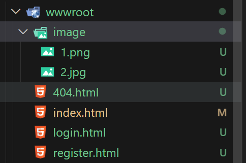

未来我们请求网页，它要做两件事情，第一要把这个网页本身加载出来，第二浏览器识别到网页还有一个资源叫做图片，所以它一要把网页给下载下来，二还要把网页中要用的图片下载下来，两个资源一合并组合才能给我们形成一个完整的网页信息！

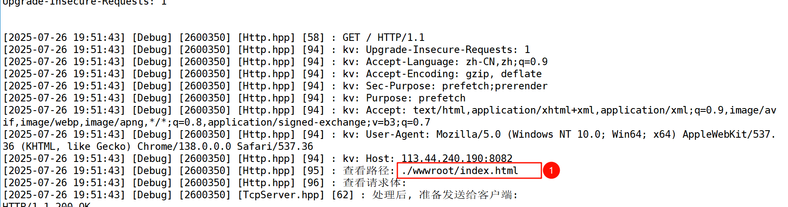

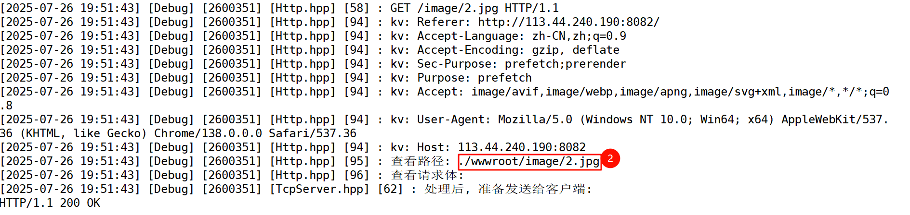

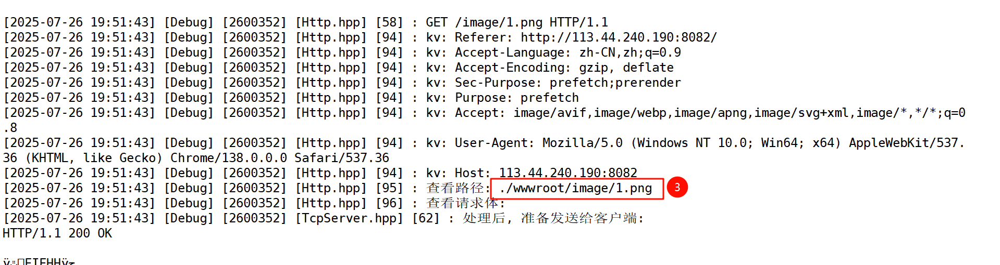

**一个用户看到的网页结果，可能是多个资源组合而成的！所以要获取一张完整的网页效果，我们的浏览器一定会发起多次http请求！**

## Content-Type
是网页Content-Type 类型text/html，图片呢？  
**所以我们需要不同的path所标定文件的类型返回特定不同的资源。**

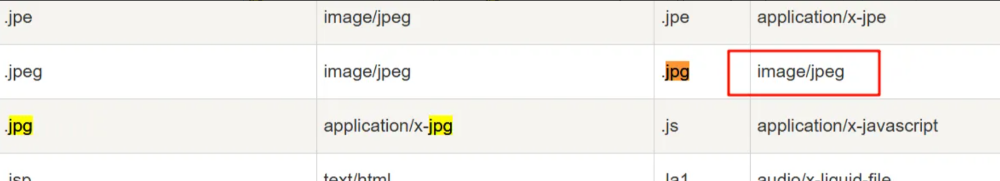

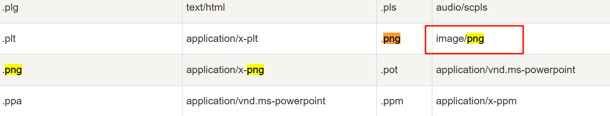

**我们要正确的给客户端返回资源类型，我们首先要自己知道！所有的资源都有后缀！！**

Http

```cpp
std::string Suffix2Desc(const std::string &suffix)
{
    if (suffix == ".html")
        return "text/html";
    else if (suffix == ".css")
        return "text/css";
    else if (suffix == ".js")
        return "application/x-javascript";
    else if (suffix == ".png")
        return "image/png";
    else if (suffix == ".jpg")
        return "image/jpeg";
    else if (suffix == ".txt")
        return "text/plain";
    else
        return "text/html";
}
```

HttpRequest

```cpp
std::string Suffix()
{
    if (_path.empty())
        return std::string();
    else
    {
        auto pos = _path.rfind(suffixsep);
        if (pos == std::string::npos)
            return std::string();
        else
            return _path.substr(pos); // 截取后缀
    }
}
```

测试：

html

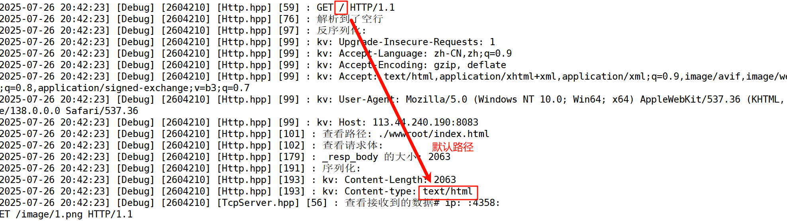

png类型：

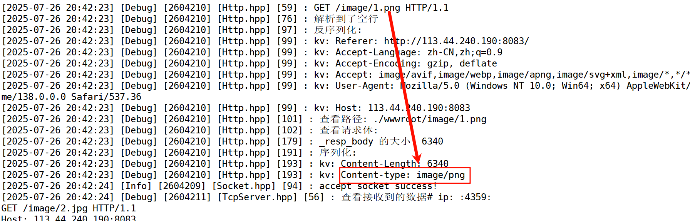

jpg类型

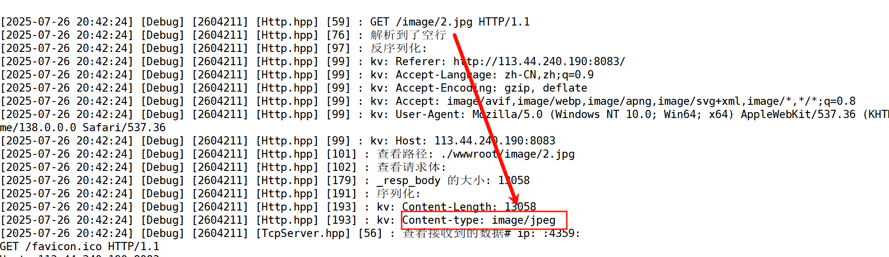


这里有个问题，你要请求的资源大小是多少？所以我们在报头再加一个

## Content-Length
HttpResponse

```cpp
std::string Serialize()
{
    // 添加状态行
    std::string respstr = _httpversion + innersep1 + std::to_string(_code) + 
                          innersep1 + _desc + linesep;
    // 添加Content-Length
    if(!_resp_body.empty())
    {
        std::string len = std::to_string(_resp_body.size());
        SetHeader("Content-Length", len);
    }
    
    // 添加相应报头
    for (auto &[x, y] : _req_handers)
    {
        respstr += x + innersep2 + y + linesep;
    }
    respstr += _black_line;  // 添加空行
    respstr += _resp_body;   // 添加正文
    return respstr;
}
```

http

```cpp
std::string HandlerRequest(std::string &requeststr)
{
    std::string respstr;
    HttpRequest req;                 // 请求
    if (req.Deserialize(requeststr)) // 反序列化
    {
        HttpResponse resp;                // 构建回复
        if (resp.ReadContent(req.Path())) // 读取内容
        {
            std::string suffix = req.Suffix();                 // 获取后缀
            std::string mime_type_value = Suffix2Desc(suffix); // 识别类型
            resp.SetHeader("Content-type", mime_type_value);   // 添加类型
            resp.SetCode(200);
        }
        else // 没有此路径的文件
        {
            std::string error_404 = webroot + "/" + defaultHtml404;
            req.SetPath(error_404);       // 设置状态码
            resp.ReadContent(req.Path()); // 读取内容

            std::string suffix = req.Suffix();                 // 获取后缀
            std::string mime_type_value = Suffix2Desc(suffix); // 识别类型
            resp.SetHeader("Content-type", mime_type_value);   // 添加类型
            resp.SetCode(404);
        }
        respstr = resp.Serialize(); // 序列化
    }
}
```

测试：

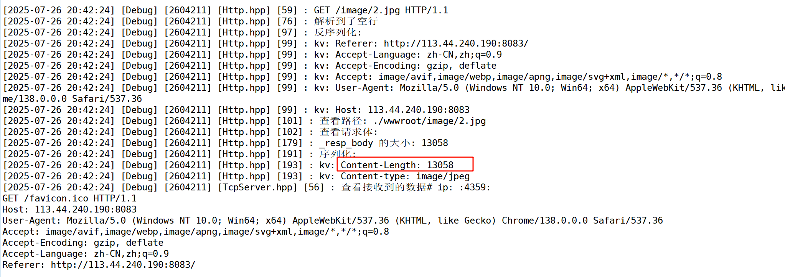

## HTTP的状态码
状态码有五大类

| **<font style="color:rgb(79, 79, 79);">状态码</font>** | **<font style="color:rgb(79, 79, 79);">描述</font>** |
| :---: | :---: |
| <font style="color:rgb(79, 79, 79);">1XX</font> | <font style="color:rgb(79, 79, 79);">提示信息，请求被成功接受</font> |
| <font style="color:rgb(79, 79, 79);">2XX</font> | <font style="color:rgb(79, 79, 79);">成功，请求被成功处理</font> |
| <font style="color:rgb(79, 79, 79);">3XX</font> | <font style="color:rgb(79, 79, 79);">重定向相关</font> |
| <font style="color:rgb(79, 79, 79);">4XX</font> | <font style="color:rgb(79, 79, 79);">客户端错误</font> |
| <font style="color:rgb(79, 79, 79);">5XX</font> | <font style="color:rgb(79, 79, 79);">服务端错误</font> |


**<font style="color:rgb(77, 77, 77);">常见状态码</font>**

| **<font style="color:rgb(79, 79, 79);">状态码</font>** | **<font style="color:rgb(79, 79, 79);">解释</font>** |
| :---: | :---: |
| <font style="color:rgb(79, 79, 79);">100</font> | <font style="color:rgb(79, 79, 79);">上传大文件时，服务器告诉客户端可以继续上传</font> |
| <font style="color:rgb(79, 79, 79);">200</font> | <font style="color:rgb(79, 79, 79);">（成功） 服务器已成功处理了请求。 通常，这表示服务器提供了请求的网页。</font> |
| <font style="color:rgb(79, 79, 79);">201</font> | <font style="color:rgb(79, 79, 79);">发布新文章，服务器返回文章创建成功的信息</font> |
| <font style="color:rgb(79, 79, 79);">204</font> | <font style="color:rgb(79, 79, 79);">删除文章后，服务器返回“无内容”表示操作成功</font> |
| <font style="color:rgb(79, 79, 79);">301</font> | <font style="color:rgb(79, 79, 79);">网站换域名后，自动跳转到新域名；搜索引擎更新网站链接时使用</font> |
| <font style="color:rgb(79, 79, 79);">302</font> | <font style="color:rgb(79, 79, 79);">用户登录成功后，重定向到用户首页</font> |
| <font style="color:rgb(79, 79, 79);">304</font> | <font style="color:rgb(79, 79, 79);">浏览器缓存机制，对未修改的资源返回304 状态码</font> |
| <font style="color:rgb(79, 79, 79);">400</font> | <font style="color:rgb(79, 79, 79);">填写表单时，格式不正确导致提交失败</font> |
| <font style="color:rgb(79, 79, 79);">401</font> | <font style="color:rgb(79, 79, 79);">访问需要登录的页面时，未登录或认证失败</font> |
| <font style="color:rgb(79, 79, 79);">403</font> | <font style="color:rgb(79, 79, 79);">尝试访问你没有权限查看的页面</font> |
| <font style="color:rgb(79, 79, 79);">404</font> | <font style="color:rgb(79, 79, 79);">（未找到) 服务器找不到请求的网页</font> |
| <font style="color:rgb(79, 79, 79);">500</font> | <font style="color:rgb(79, 79, 79);">（服务器内部错误） 服务器遇到错误，无法完成请求</font> |
| <font style="color:rgb(79, 79, 79);">502</font> | <font style="color:rgb(79, 79, 79);">使用代理服务器时，代理服务器无法从上游服务器获取有效响应</font> |
| <font style="color:rgb(79, 79, 79);">503</font> | <font style="color:rgb(79, 79, 79);">服务器维护或过载，暂时无法处理请求</font> |


### <font style="color:rgb(79, 79, 79);">响应头</font>
| **<font style="color:rgb(79, 79, 79);">响应头</font>** | **<font style="color:rgb(79, 79, 79);">描述</font>** |
| :---: | :---: |
| <font style="color:rgb(79, 79, 79);">Server</font> | <font style="color:rgb(79, 79, 79);">HTTP服务器的软件信息</font> |
| <font style="color:rgb(79, 79, 79);">Date</font> | <font style="color:rgb(79, 79, 79);">响应报文的时间</font> |
| <font style="color:rgb(79, 79, 79);">Expires</font> | <font style="color:rgb(79, 79, 79);">指定缓存过期时间</font> |
| <font style="color:rgb(79, 79, 79);">Set-Cookie</font> | <font style="color:rgb(79, 79, 79);">种Cookie</font> |
| <font style="color:rgb(79, 79, 79);">Last_Modified</font> | <font style="color:rgb(79, 79, 79);">资源最后修改时间</font> |
| <font style="color:rgb(79, 79, 79);">Content-Type</font> | <font style="color:rgb(79, 79, 79);">响应的类型和字符集，如Content-Type: application/json</font> |
| <font style="color:rgb(79, 79, 79);">Content-Length</font> | <font style="color:rgb(79, 79, 79);">内容长度</font> |
| <font style="color:rgb(79, 79, 79);">Connection</font> | <font style="color:rgb(79, 79, 79);">如Keep-Alive，表示保持tcp连接不关闭，不会保持连接，服务器可设置</font> |
| <font style="color:rgb(79, 79, 79);">Location</font> | <font style="color:rgb(79, 79, 79);">指向重定向的位置，新的URL地址，如304的情况</font> |


最常见的状态码, 比如 200(OK), 404(Not Found), 403(Forbidden), 302(Redirect, 重定向), 504(Bad Gateway）

以4开头是客户端错误。5开头是服务端错误。  
以3开头的状态码都是重定向

## 重定向
什么叫做重定向呢？  
就是访问百度，但是它会自动跳转出QQ新闻首页。

访问一个url，但是服务器响应会带以3开头的状态码还会带一个新的url，然后浏览器看到这个状态码会自动重新访问这个新的url。  
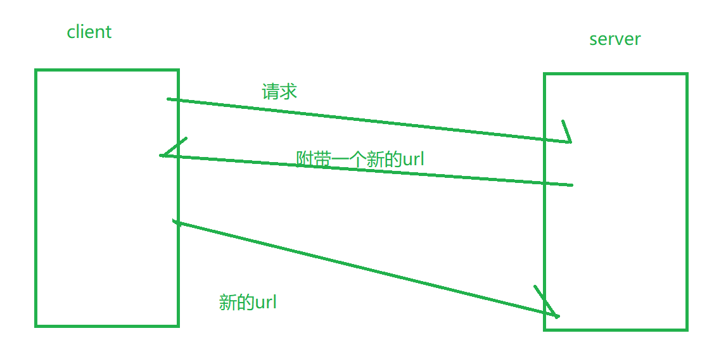

重定向分为临时重定向（307）和永久重定向（301）。

假如有一个www.a.com网站有100w用户，但是这个网站现在进行重新设计升级，搞了一个新网站www.b.com，但是老网站100w用户我还想要，因此在老网站这里用重定向，当你还在访问老网站时，老网站告诉你重定向，因此你的浏览器自动访问这个新网站。永久重定向从技术角度是更新你本地的书签。 临时重定向就是每次都做临时跳转如打开一个网站有时候给我跳转到淘宝，有时候跳转京东等(金钱的力量)。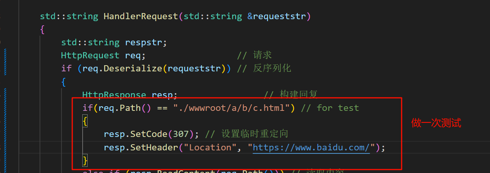

结果：

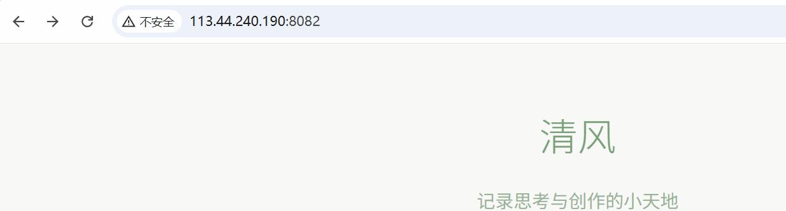

还可以直接重定向服务器上的文件：

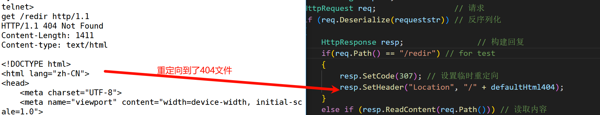


## Referer
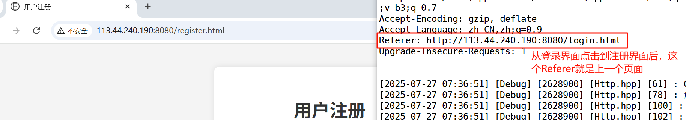


## HTTP常见Header
+ Content-Type: 数据类型(text/html等)
+ Content-Length: Body的长度
+ Host: 客户端告知服务器, 所请求的资源是在哪个主机的哪个端口上;
+ User-Agent: 声明用户的操作系统和浏览器版本信息;
+ referer: 当前页面是从哪个页面跳转过来的;
+ location: 搭配3xx状态码使用, 告诉客户端接下来要去哪里访问;
+ Cookie: 用于在客户端存储少量信息. 通常用于实现会话(session)的功能

## 长连接
我们知道其实一张我们看到的网页，实际上可能由多种元素构成，也就是说一张完整的网页需要多次http请求然后浏览器进行组合和渲染，这是我们在前面都见过的。

这里就会有这样一个问题，http网页中可能会包含多个元素，如果频繁发起http请求，http是基于tcp的，tcp是面向链接的，所以会导致频繁创建链接的问题。

如果有100张图片，http就要发起100请求，tcp建立100次链接，这成本就太大了。

所以这就需要client和server都要支持，**长连接**，客户端向服务器发起建立一次链接(这里并不是说与服务器建立好链接之后请求所有资源就永远用的是这一个链接 ，而是说我们请求服务器看到一张网页，这个网页里有很多元素)，与服务器这张网页建立好一条链接，获取一大份资源的时候，通过同一条链接完成。

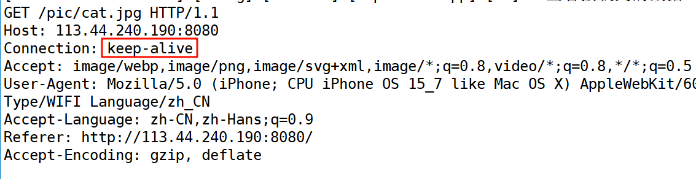  
这表示客户端和服务器协商好支持长连接。

Connection：close -----> 短链接（有多少请求，建立多少次tcp链接）


## HTTP的方法
请求方法：

| **请求方法** | **备注** |
| :---: | :---: |
| GET | 请求资源 |
| POST | 提交资源 |
| Head | 获取响应头 |
| PUT | 替换资源 |
| DELETE | 删除资源 |
| OPTIONS | 允许客户端查看服务器的性能 |
| TRACE | 回显服务端收到的请求，用于测试或诊断 |


请求头：

| **<font style="color:rgb(79, 79, 79);">请求头</font>** | **<font style="color:rgb(79, 79, 79);">描述</font>** |
| :---: | :---: |
| <font style="color:rgb(79, 79, 79);">Host</font> | <font style="color:rgb(79, 79, 79);">主机ip地址或域名</font> |
| <font style="color:rgb(79, 79, 79);">User-Agent</font> | <font style="color:rgb(79, 79, 79);">客户端相关信息，如操作系统、浏览器等信息</font> |
| <font style="color:rgb(79, 79, 79);">Accept</font> | <font style="color:rgb(79, 79, 79);">指定客户端接收信息类型，如：image/jpg、text/heml、application/json</font> |
| <font style="color:rgb(79, 79, 79);">Accept_Charset</font> | <font style="color:rgb(79, 79, 79);">可接受的字符集，如gb2312、iso-8859-1</font> |
| <font style="color:rgb(79, 79, 79);">Accept-Encoding</font> | <font style="color:rgb(79, 79, 79);">可接受的内容编码，如gzip</font> |
| <font style="color:rgb(79, 79, 79);">Accept-Language</font> | <font style="color:rgb(79, 79, 79);">可接受的语言，如Accept_Language:zh-cn</font> |
| <font style="color:rgb(79, 79, 79);">Authorization</font> | <font style="color:rgb(79, 79, 79);">客户端提供给服务端，进行权限认证信息</font> |
| <font style="color:rgb(79, 79, 79);">Cookie</font> | <font style="color:rgb(79, 79, 79);">携带的cookie信息</font> |
| <font style="color:rgb(79, 79, 79);">Referer</font> | <font style="color:rgb(79, 79, 79);">当前文档的URL，即从哪个链接过来的</font> |
| <font style="color:rgb(79, 79, 79);">Content-Type</font> | <font style="color:rgb(79, 79, 79);">请求体内容类型，如Content-Type: application/x-www-form-urlencoded; charset=UTF-8</font> |
| <font style="color:rgb(79, 79, 79);">Content-Length</font> | <font style="color:rgb(79, 79, 79);">数据长度</font> |
| <font style="color:rgb(79, 79, 79);">Cache-Control</font> | <font style="color:rgb(79, 79, 79);">缓存机制，如Cache-Control:cache</font> |
| <font style="color:rgb(79, 79, 79);">Pragma</font> | <font style="color:rgb(79, 79, 79);">防止页面被缓存，和cache-control:no-cache作用一样</font> |


当我们在进行网络访问的时候，实际是有两种行为的。

1. **获取资源**
2. **上传资源**

上面都是获取资源的，可是我们想上传资源呢？完成登录等。。怎么做呢？

实际上我们一般在进行网站交互的时候，其实是通过**表单**的方式进行提交的

比如baidu搜索

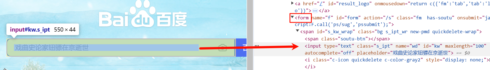

**所以我们进行数据提交的的时候，本质前端要通过form表单提交的，浏览器会自动将form表单中的内容转换成GET/POST方法请求**

> 默认是GET方法。
>

## GET
接下来我们在自己的首页加个表单

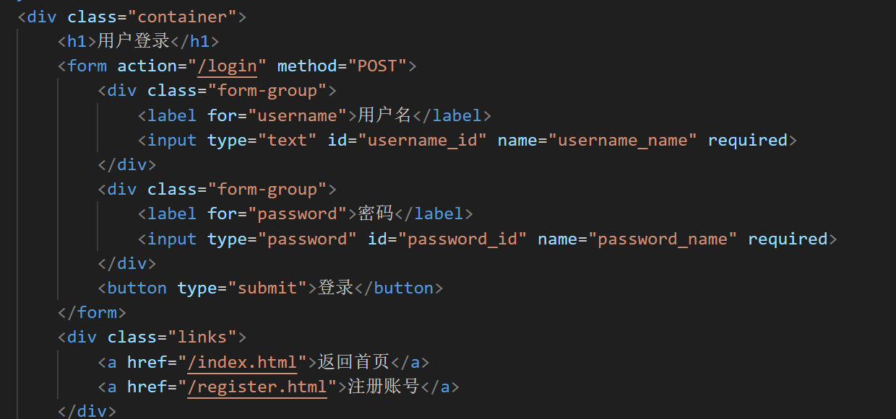

form是表单的整体结构，未来我们给服务器提供参数的话，为了很好提供参数的提取所以输入框它是KV的，未来不是在输入框写内容吗，可是我怎么知道你是想那个输入框写的内容呢，所以name就是这个输入框的名字。

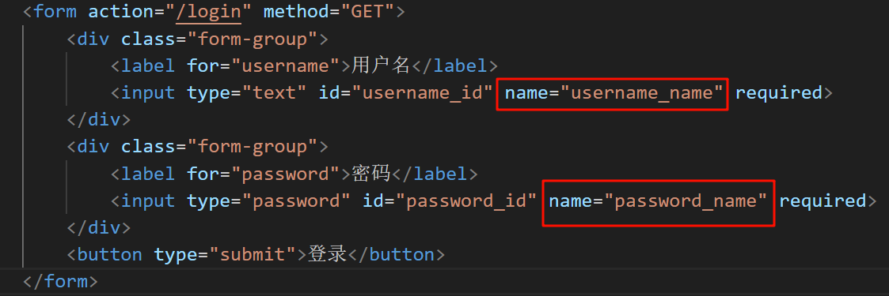

还有`input type="password"`，会把我们输入的内容全部变成黑点，text我们输入什么就显示什么。

action代表你想把你的表单的数据提交给后端的哪一个服务或者网页或者路径下。这里直接交给登录方法

method当你提交表单时你想采用什么方法提交，默认是GET

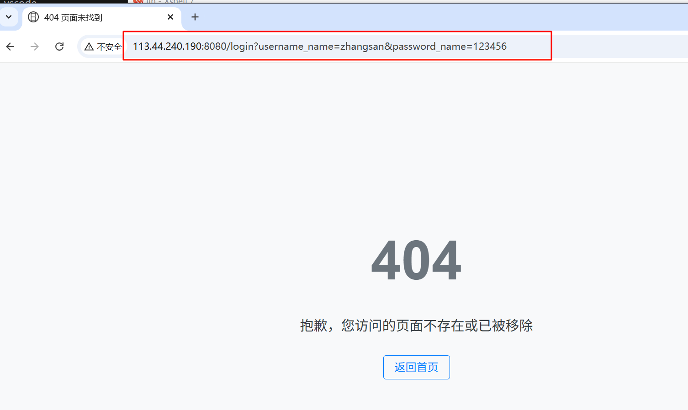  
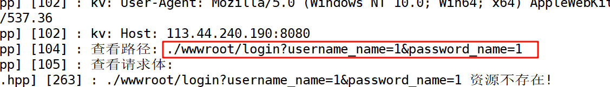

当我们登录时这里的login方法是不存在的，所以返回的是默认重定向到了404

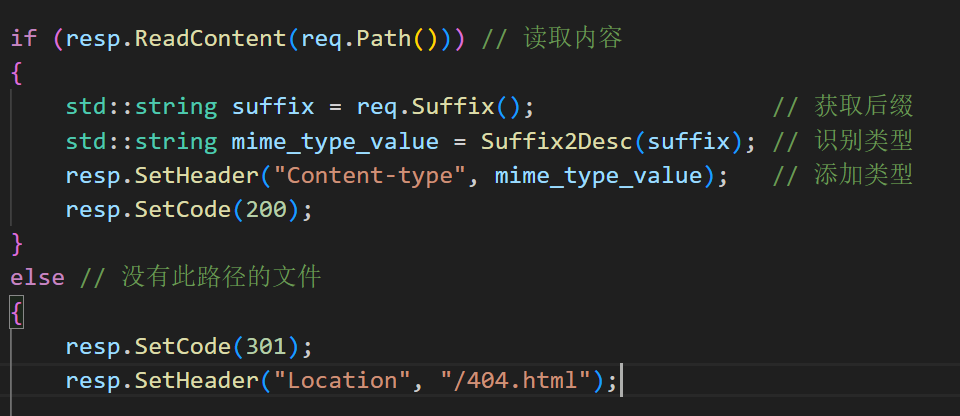

我们可以看到**GET方法提参的时候，它会把我们要提交的参数拼到url的后面**，把参数以url方式进行提交，然后以?为分割符，左侧是要访问网站的资源，右侧是我们提上来的参数。

> 所以get既可以获取信息也可以上传信息，上传信息是通过url传参的
>

Http可以连接url的方式，对外提供网络服务，进行交互式处理

服务器做一个功能路由的选择，不同路径调用不同的服务

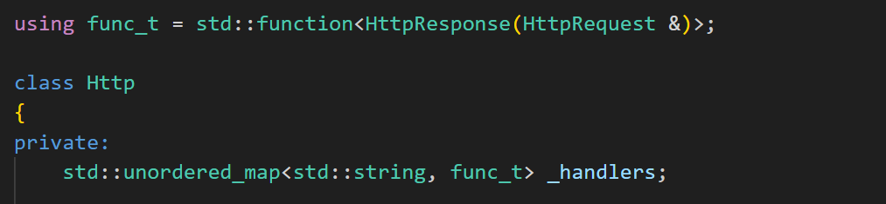

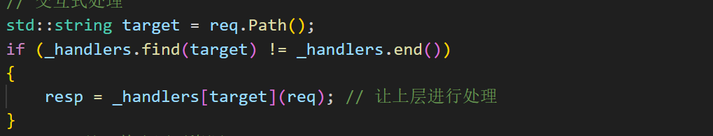

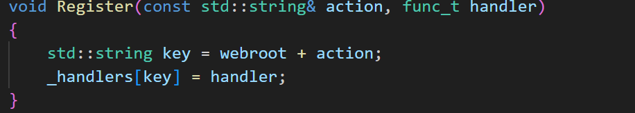

然后需要做参数解析，然后让上层知道传了哪些参数

参数解析：

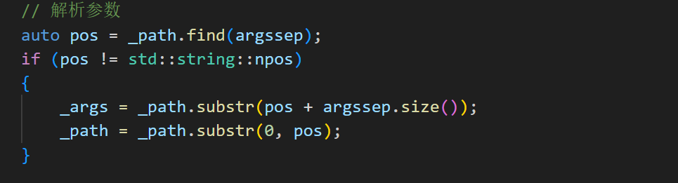

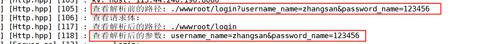

我们把这种的对外提供服务的方式叫做restful风格的接口，和函数调用一样

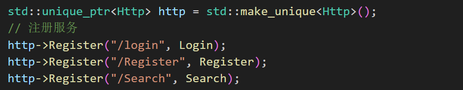

而百度就是这样的：

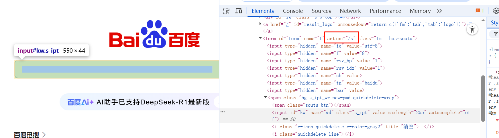

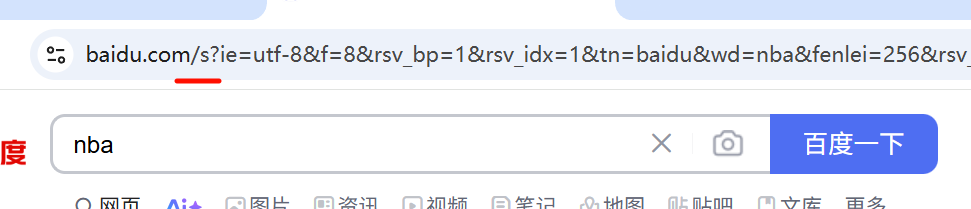

## POST
修改表单为POST方法

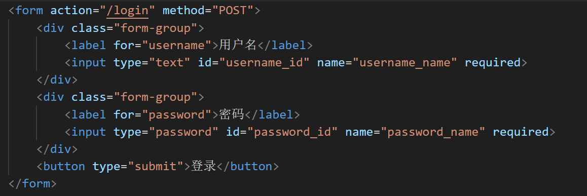

当我们用**POST方法提参时，url后面只有我们要访问什么资源，后面没有提交的参数，我们的参数是以请求的正文提交参数的。**

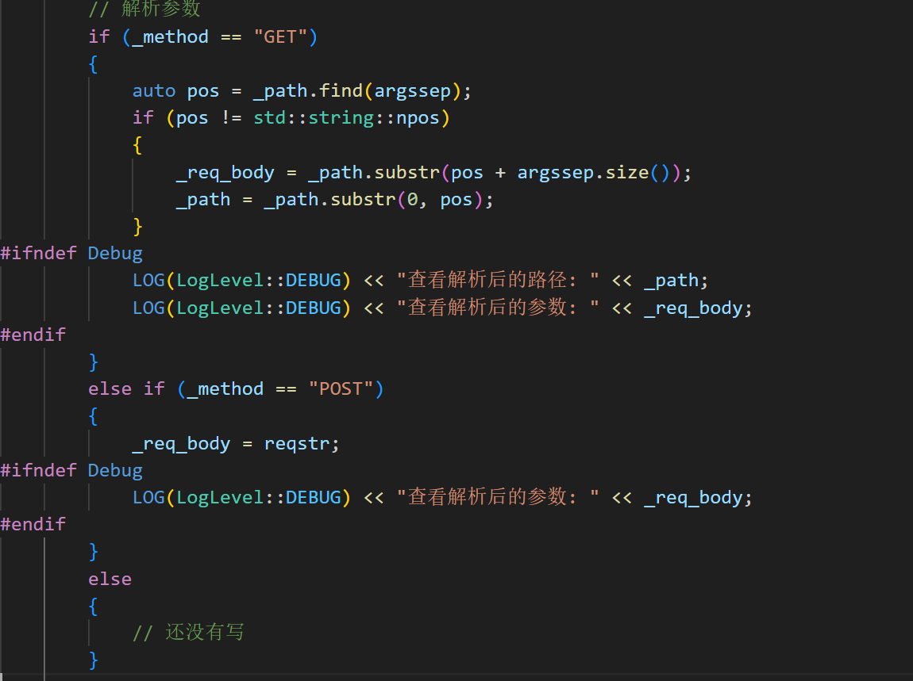

测试：

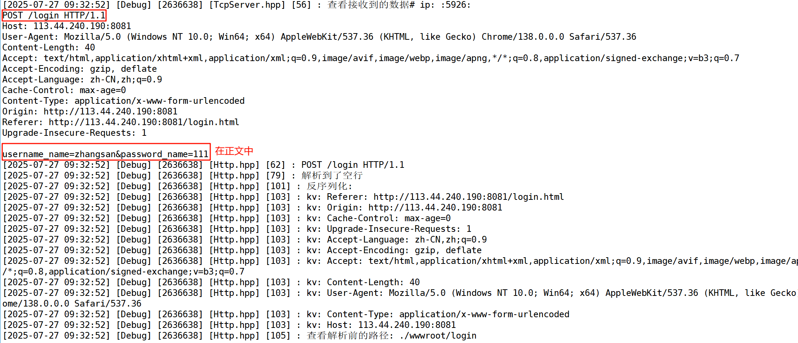

GET和POST提参区别

**GET通过url传递参数**，具体：http://ip:port/xxx/yy?name1=value1&name2=value2

**POST**提交参数**通过http请求正文提交参数**！

那用那个呢？

POST方法通过正文提交参数，所以一般用户看不到，私密性更好，但**私密性!=安全性**。  
GET方法不私密。

> 但无论是GET和POST方法，都不安全！要谈安全，必须加密 —> **https**。
>

并且通过URL传递参数，注定不能太大，但是POST方法，通过正文，正文可以很大，甚至可以是其他的东西。

现在思考这样的问题：

**1.我们提交给指定的路径，有什么意义？？**

不管是url提参还是正文提参都是把参数给服务器，服务器未来拿着对应的参数实现登录注册等，凭什么？服务器首先能拿到这个数据，可是怎么让服务器处理这个数据？其次服务器怎么知道未来想到对这个数据进行怎样的处理，就是说你只是提交请求而服务器怎么知道登录还是注册呢？

这一切的玄机都在这里，不管是GET和POST都要求在表单里把数据提交给某一个资源。

**2.除了GET和POST，还有那些方法，重要吗？？**  
有，但常用的是GET和POST方法。  
单纯把资源从远端获取 —> GET方法  
提参GET，POST都可以，提交的参数很小没有私密性可以用GET，参数大想有私密性用POST。

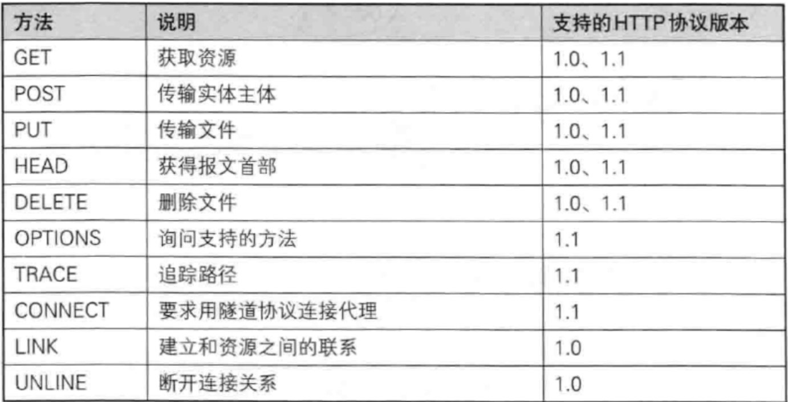


# 全部代码实现
## Http.hpp
```cpp
#pragma once

#include <string>
#include <vector>
#include <unordered_map>
#include <sstream>
#include <functional>

#include "Logger.hpp"

// #define Debug
static const std::string linesep = "\r\n";
static const std::string innersep1 = " ";
static const std::string innersep2 = ": ";
static const std::string webroot = "./wwwroot";
static const std::string defaulthome = "index.html";
// static const std::string webroot = "./wwwroot_blog";
// static const std::string defaulthome = "blog_login.html";
static const std::string defaultHtml404 = "404.html";
static const std::string suffixsep = ".";
static const std::string argssep = "?";

class HttpRequest
{
private:
    std::string ReadOneLine(std::string &reqstr, bool *status)
    {
        auto pos = reqstr.find(linesep);
        if (pos == std::string::npos)
        {
            *status = false; // 找不到
            return std::string();
        }
        std::string line = reqstr.substr(0, pos);
        reqstr.erase(0, pos + linesep.size()); // 删除读取到的元素
        return line;
    }

    void BuildKV(std::string &line, std::string *k, std::string *v)
    {
        auto pos = line.find(innersep2);
        if (pos == std::string::npos)
        {
            *k = *v = std::string();
        }
        *k = line.substr(0, pos);
        *v = line.substr(pos + innersep2.size());
    }

public:
    HttpRequest() {}

    bool Deserialize(std::string &reqstr)
    {
        bool status = true;
        std::string reqline = ReadOneLine(reqstr, &status); // 读取首行
        if (!status)
            return false;

        std::stringstream ss(reqline);
        ss >> _method >> _uri >> _httpversion;

#ifndef Debug
        LOG(LogLevel::DEBUG) << _method << " " << _uri << " " << _httpversion;
#endif

        for (;;) // 解析kv
        {
            status = true;
            reqline = ReadOneLine(reqstr, &status);
            if (status && !reqline.empty())
            {
                std::string k, v;
                BuildKV(reqline, &k, &v);
                if (k.empty() || v.empty())
                    continue;
                _req_handers.insert(std::make_pair(k, v));
            }
            else if (status)
            {
                LOG(LogLevel::DEBUG) << "解析到了空行";
                _back_line = linesep; // 解析到空行就退出
                break;
            }
            else
            {
                LOG(LogLevel::DEBUG) << "非法请求";
                // return false;
                break;
            }
        }

        _req_body = reqstr; // 剩下的就是内容
        _path = webroot;    // 默认目录

        if (_uri == "/")                // 如直接请求的默认就是/ 此时直接跳转到默认目录
            _path += "/" + defaulthome; // 默认文件
        else
            _path += _uri;

#ifndef Debug

        LOG(LogLevel::DEBUG) << "反序列化: ";
        for (auto &[x, y] : _req_handers)
            LOG(LogLevel::DEBUG) << "kv: " << x << ": " << y;

        LOG(LogLevel::DEBUG) << "查看解析前的路径: " << _path;
        LOG(LogLevel::DEBUG) << "查看请求体: " << _req_body;
#endif
        // 解析参数
        if (_method == "GET")
        {
            auto pos = _path.find(argssep);
            if (pos != std::string::npos)
            {
                _req_body = _path.substr(pos + argssep.size());
                _path = _path.substr(0, pos);
            }
#ifndef Debug
            LOG(LogLevel::DEBUG) << "查看解析后的路径: " << _path;
            LOG(LogLevel::DEBUG) << "查看解析后的参数: " << _req_body;
#endif
        }
        else if (_method == "POST")
        {
            _req_body = reqstr;
#ifndef Debug
            LOG(LogLevel::DEBUG) << "查看解析后的参数: " << _req_body;
#endif
        }
        else
        {
            // 还没有写
        }

        return true;
    }
    std::string Path()
    {
        return _path;
    }

    void SetPath(const std::string &path)
    {
        _path = path;
    }

    std::string Body()
    {
        return _req_body;
    }

    std::string Suffix()
    {
        if (_path.empty())
            return std::string();
        else
        {
            auto pos = _path.rfind(suffixsep);
            if (pos == std::string::npos)
                return std::string();
            else
                return _path.substr(pos); // 截取后缀
        }
    }

    ~HttpRequest() {}

private:
    std::string _method;
    std::string _uri;
    std::string _httpversion;
    std::unordered_map<std::string, std::string> _req_handers;
    std::string _back_line;
    std::string _req_body;

    std::string _path;
};

class HttpResponse
{
private:
    std::string Code2Desc(int code)
    {
        switch (code)
        {
        // 2xx Success
        case 200:
            return "OK";
        case 201:
            return "Created";
        case 202:
            return "Accepted";
        case 204:
            return "No Content";

        // 3xx Redirection
        case 301:
            return "Moved Permanently";
        case 302:
            return "Found";
        case 303:
            return "See Other";
        case 304:
            return "Not Modified";
        case 307:
            return "Temporary Redirect";
        case 308:
            return "Permanent Redirect";

        // 4xx Client Errors
        case 400:
            return "Bad Request";
        case 401:
            return "Unauthorized";
        case 403:
            return "Forbidden";
        case 404:
            return "Not Found";
        case 405:
            return "Method Not Allowed";
        case 408:
            return "Request Timeout";
        case 409:
            return "Conflict";
        case 413:
            return "Payload Too Large";
        case 415:
            return "Unsupported Media Type";
        case 429:
            return "Too Many Requests";

        // 5xx Server Errors
        case 500:
            return "Internal Server Error";
        case 501:
            return "Not Implemented";
        case 502:
            return "Bad Gateway";
        case 503:
            return "Service Unavailable";
        case 504:
            return "Gateway Timeout";

        default:
            return "";
        }
    }

public:
    HttpResponse() : _httpversion("HTTP/1.1"), _black_line(linesep) {}

    std::string Serialize()
    {
        // 添加状态行
        std::string respstr = _httpversion + innersep1 + std::to_string(_code) +
                              innersep1 + _desc + linesep;
        // 添加Content-Length
        if (!_resp_body.empty())
        {
            std::string len = std::to_string(_resp_body.size());
            LOG(LogLevel::DEBUG) << "_resp_body 的大小: " << _resp_body.size();

            SetHeader("Content-Length", len);
        }

        // 添加相应报头
        for (auto &[x, y] : _req_handers)
        {
            respstr += x + innersep2 + y + linesep;
        }

        // 添加cookies
        for (auto &cookie : _cookies)
        {
            respstr += cookie;
            respstr += linesep;
        }

#ifndef Debug
        LOG(LogLevel::DEBUG) << "序列化: ";
        for (auto &[x, y] : _req_handers)
            LOG(LogLevel::DEBUG) << "kv: " << x << ": " << y;
#endif

        respstr += _black_line; // 添加空行
        respstr += _resp_body;  // 添加正文
        // LOG(LogLevel::DEBUG) << "_resp_body 的内容: \n" << _resp_body;
        return respstr;
    }

    bool ReadContent(const std::string &path)
    {
        // 以二级制方式读取
        // 打开文件，二进制模式
        std::ifstream file(path, std::ios::binary);
        if (!file.is_open())
        {
            LOG(LogLevel::WARNING) << path << " 资源不存在!";
            file.close();
            return false;
        }

        // 定位到文件末尾获取文件大小
        file.seekg(0, std::ios::end);
        std::streampos fileSize = file.tellg(); // 获取文件大小
        file.seekg(0, std::ios::beg);

        // 创建足够大的字符串来保存数据
        _resp_body.resize(static_cast<size_t>(fileSize));

        // 读取文件内容到字符串
        file.read(&_resp_body[0], fileSize);
        file.close();

        return true;
    }

    void SetCode(int code)
    {
        if (code >= 100 && code < 600)
        {
            _code = code;
            _desc = Code2Desc(code);
        }
        else
        {
            LOG(LogLevel::DEBUG) << "非法的状态码: " << code;
        }
    }

    void SetHeader(const std::string &key, const std::string &value)
    {
        _req_handers[key] = value;
    }

    void SetCookie(const std::string& key, const std::string &value)
    {
        std::string cookie = key;
        cookie += ": ";
        cookie += value;
        _cookies.push_back(cookie);
    }

private:
    std::string _httpversion;
    int _code;
    std::string _desc;
    std::unordered_map<std::string, std::string> _req_handers;
    std::string _black_line;
    std::string _resp_body;

    std::vector<std::string> _cookies;
};

using func_t = std::function<HttpResponse(HttpRequest &)>;

class Http
{
private:
    std::unordered_map<std::string, func_t> _handlers;

private:
    std::string Suffix2Desc(const std::string &suffix)
    {
        if (suffix == ".html" || suffix == ".htm")
        {
            return "text/html";
        }
        else if (suffix == ".css")
        {
            return "text/css";
        }
        else if (suffix == ".js")
        {
            return "application/javascript"; // Updated from x-javascript to standard type
        }
        else if (suffix == ".png")
        {
            return "image/png";
        }
        else if (suffix == ".jpg" || suffix == ".jpeg")
        {
            return "image/jpeg";
        }
        else if (suffix == ".gif")
        {
            return "image/gif";
        }
        else if (suffix == ".txt")
        {
            return "text/plain";
        }
        else if (suffix == ".json")
        {
            return "application/json";
        }
        else if (suffix == ".pdf")
        {
            return "application/pdf";
        }
        else if (suffix == ".xml")
        {
            return "application/xml";
        }
        else if (suffix == ".svg")
        {
            return "image/svg+xml";
        }
        else if (suffix == ".ico")
        {
            return "image/x-icon";
        }
        else if (suffix == ".mp4")
        {
            return "video/mp4";
        }
        else if (suffix == ".webm")
        {
            return "video/webm";
        }
        else if (suffix == ".mp3")
        {
            return "audio/mpeg";
        }
        else if (suffix == ".woff")
        {
            return "font/woff";
        }
        else if (suffix == ".woff2")
        {
            return "font/woff2";
        }
        else
        {
            return "text/html"; // Default fallback
        }
    }

public:
    Http()
    {
    }
    void Register(const std::string &action, func_t handler)
    {
        std::string key = webroot + action;
        _handlers[key] = handler;
    }
    std::string HandlerRequest(std::string &requeststr)
    {
        std::string respstr;
        HttpRequest req;                 // 请求
        if (req.Deserialize(requeststr)) // 反序列化
        {
            HttpResponse resp; // 构建回复
            // 交互式处理
            std::string target = req.Path();
            if (_handlers.find(target) != _handlers.end())
            {
                resp = _handlers[target](req); // 让上层进行处理
            }
            else // 处理静态网页资源
            {
                if (resp.ReadContent(req.Path())) // 读取内容
                {
                    std::string suffix = req.Suffix();                 // 获取后缀
                    std::string mime_type_value = Suffix2Desc(suffix); // 识别类型
                    resp.SetHeader("Content-type", mime_type_value);   // 添加类型
                    resp.SetCode(200);
                }
                else // 没有此路径的文件
                {
                    resp.SetCode(301);
                    resp.SetHeader("Location", "/404.html");

                    // std::string error_404 = webroot + "/" + defaultHtml404;
                    // req.SetPath(error_404);       // 设置状态码
                    // resp.ReadContent(req.Path()); // 读取内容

                    // std::string suffix = req.Suffix();                 // 获取后缀
                    // std::string mime_type_value = Suffix2Desc(suffix); // 识别类型
                    // resp.SetHeader("Content-type", mime_type_value);   // 添加类型
                    // resp.SetCode(404);
                }
            }
            respstr = resp.Serialize(); // 序列化
        }
        return respstr;
    }

    ~Http()
    {
    }
};
```

## TcpServer.hpp
```cpp
#pragma once

#include <memory>
#include <functional>

#include <unistd.h>
#include <signal.h>

#include "Socket.hpp"
#include "InetAddr.hpp"

using callback_t = std::function<std::string(std::string&)>;

class TcpServer
{
public:
    TcpServer(uint16_t port, callback_t cb)
        : _port(port), _listensocket(std::make_unique<TcpSocket>()), _cb(cb)
    {
        _listensocket->BuildListenSocketMethod(_port);
    }

    void Run()
    {
        signal(SIGCHLD, SIG_IGN);

        for (;;)
        {
            InetAddr addr;
            std::shared_ptr<Socket> sockfd = _listensocket->Accept(&addr);
            if (sockfd == nullptr)
                continue;

            if (fork() == 0)
            {
                // child
                _listensocket->Close();
                HandlerRequest(sockfd, addr); // 处理
                exit(0);                      // 处理完后需要进行退出
            }
            sockfd->Close();
        }
    }

    ~TcpServer() {}

private:
    void HandlerRequest(std::shared_ptr<Socket> sockfd, InetAddr addr)
    {
        std::string inbuffer;
        for (;;)
        {
            ssize_t n = sockfd->Recv(&inbuffer); // 大概率我们直接就能读取到完整的http请求
            if (n > 0)
            {
                LOG(LogLevel::DEBUG) << "查看接收到的数据# ip: " <<  addr.ToString() << ": " << "\n" << inbuffer;
                
                // 回掉函数，交给上层处理
                std::string send_str = _cb(inbuffer);
                if(send_str.empty())
                    continue;
                // LOG(LogLevel::DEBUG) << "处理后, 准备发送给客户端: \n" << send_str;
                sockfd->Send(send_str);
            }
            else if (n == 0)
            {
                LOG(LogLevel::DEBUG) << addr.ToString() << ", quit me too";
                break;
            }
            else
            {
                LOG(LogLevel::DEBUG) << addr.ToString() << "read err, quit";
                break;
            }
        }
        sockfd->Close(); // 处理完记得关闭
    }

private:
    uint16_t _port;
    std::unique_ptr<Socket> _listensocket;

    callback_t _cb;
};

```

## Server.cc
```cpp
#include <iostream>
#include <memory>

#include "Http.hpp"
#include "TcpServer.hpp"
#include "daemon.hpp"

using namespace std;


HttpResponse Login(HttpRequest& req)
{
    HttpResponse resp;
    LOG(LogLevel::DEBUG)<< "-----Login: " << req.Body();
    resp.SetCode(200);
    // resp.SetCookie("Set-Cookie", req.Body());
    resp.SetCookie("Set-Cookie", "k1=1");
    resp.SetCookie("Set-Cookie", "k2=2");
    resp.SetCookie("Set-Cookie", "k3=3");
    resp.SetCookie("Set-Cookie", "k4=4");

    resp.SetHeader("Location", "/");
    return resp;
}
HttpResponse Register(HttpRequest& req)
{
    LOG(LogLevel::DEBUG)<< "-----Register" << req.Body();
    return HttpResponse();
}

HttpResponse Search(HttpRequest& req)
{
    LOG(LogLevel::DEBUG)<< "-----Search"<< req.Body();
    return HttpResponse();
}


void Usage(std::string proc)
{
    std::cerr << "Usage : " << proc << " <prot>" << std::endl;
}

int main(int argc, char *argv[])
{
    if (argc != 2)
    {
        Usage(argv[0]);
        exit(0);
    }

    // EnableFileLog();

    std::unique_ptr<Http> http = std::make_unique<Http>();
    // 注册服务
    http->Register("/login", Login);
    http->Register("/Register", Register);
    http->Register("/Search", Search);


    uint16_t serverport = std::stoi(argv[1]);
    std::unique_ptr<TcpServer> tsock = std::make_unique<TcpServer>(serverport, [&http](std::string& reqstr)->std::string{
        return http->HandlerRequest(reqstr);
    });

    tsock->Run();
    
    return 0;
}
```


# cookie&&session会话保持
严格来说会话保持并不属于http协议天然所具备的，是后面使用发现需要的。  
http定位是一个超文本传输协议，它只要把资源从服务器拿到本地就可以了。  
但依旧要一个会话保持。

什么是会话保持呢?

> 简单来说就是你打开bilibili网站，然后登录一次账号。以后你在网站里做网页跳转的时候都不需要重新登录了，然后在重新打开bilibili这个账号依旧在，关闭浏览器然后依旧从这个浏览器在打开bilibili你的账号信息还在！如果换成其他浏览器进入bilibili网站这次你的消息才不会存在了。这就是会话保持。
>

**http协议是无状态的**！也就是说第一次第二次第三次请求，第二次请求不知道第一次请求过，第三次请求不知道第二次第一次请求过。换句话浏览器三次请求一样的图片，按照道理来说，浏览器每一次都帮我发起http请求。因为http协议无状态它不会记录历史曾经所涉及的状态信息、所有曾经的请求、不会猜测下一次请求该做什么。它只复杂自己的功能我要什么你给我拿什么就可以了。

但实际上现实往往和理论是不符的，虽然我们发现http协议无状态，但是我们发现我曾经登录过，但http协议在我们通信的时候依旧能记住我。这虽然和http协议无直接关系，但间接有关。

http协议无状态！但用户需要，因为用户查看新的网页是常规操作，如果发生网页跳转，那么新的页面也就无法识别是哪一个用户了，为了让用户一经登录，可以在整个网站，按照自己的身份进行随意访问 -------> **会话保持**（保持一个用户始终在线的状态）

那如何实现呢？

首先通过http协议进行登录(输入用户名和密码)，登录成功服务器返回首页让你使用。当发生页面跳转时，http是不记录我的状态的就构建请求发给服务端，服务器此时说你谁啊？我不认识你，必须是登录用户才能请求这个页面，这时你还必须重新登录才可以，那就扯犊子了。

> 所以解决方案的设计者这样做，一旦首次登录成功后，浏览器会帮我们维持一个东西。把我们用户输入的信息：用户名&&密码保存起来。然后往后只要访问同一个网站浏览器会自动推送历史保留的信息。
>

而服务端对凡是与网页访问有权限要求的网页，在被获取之前，全部都要做判断！！-----> 身份认证

这两个搭配起来之后，只要当首次登录成功之后浏览器并将信息保存起来，往后就由浏览器和服务器双方配合，就不用用户频繁输入用户名和密码了，每一次http请求浏览器都会把曾经保存的这份信息推送给服务器。虽然服务器每一次都做身份认证，此时在用户看来只在一次需要登录，往后就不需要再登录了，因为都由浏览器和服务器在配合着进行会话保持。

> 其中浏览器把我们账号密码信息保存起来的技术叫做**cookie技术**。
>

> cookie技术分为：cookie文件级别，cookie内存级别，怎么理解呢？
>

浏览器本质也是一个进程，如果关闭然后重新打开浏览器，也就是进程退出然后又运行了，进程退出进程保存的东西都随进程退出而释放掉，但当我在访问b站的时候我依旧是登录状态，这个浏览器采用的是cookie文件级别也就是说浏览器会在本地给我维持一个cookie文件是在磁盘上真真实实存在的。甚至关机，但当我访问b站我还是登录状态。  
如果随着浏览器退出然后再重新打开浏览器，再打开b站的时候我的登录信息就没有了，此时cookie采用的是cookie内存级别，也就是随进程关闭所有进程保存的东西都没有了。

cookie是文件的还是内存的在浏览器是可以匹配的。

---

但是这个方法有问题！  
浏览器虽然会在我们第一次登录会保存我们登录信息，往后每次账号密码都要进行推送给服务器，服务器鉴权后返回资源。然后以后都是重复这个工作。但某一天你的电脑中了木马病毒，它并不破坏你的电脑，而只是盗取你的消息如cookie文件。然后这个盗取你消息的人拿着浏览器去访问你所访问的网站会造成什么后果？

不需要登录浏览器自动推送服务器自动做鉴权，服务器会误认这个非法用户是你，这个危害对你还不是最大的，对社会影响最大。比如用你的身份进行诈骗等。  
对你来说你的信息泄漏了。

---

上面的问题并不是信息放在文件中的问题，而是把文件放在客户端出了问题，用户对自己信息保护能力有限。

接下来为了解决上面的问题，我们有一个新的方案。这个消息不要保存在浏览器上，而保存在服务器上。

浏览器首先还是登录输入用户名和密码，服务端把用户形成的认证信息浏览痕迹在服务端形成一个session文件，服务器可能有成百上千万用户，而每个用户只要曾经登录过都要形成session文件，所以给每一个session文件起一个唯一名称，通常是一个大大的字符串我们称之为session id具有唯一性。然后服务器在登录成功的时候把这个session id返回给浏览器，浏览器只保存session id，依旧保存在cookie文件中。以后浏览器在访问服务器的时候构建请求里面必须把session id带上，这个请求到了服务端结合在这个session id在session id列表中对这个session id做认证，只要有并且内容没有异常服务器就直接认为这个用户处于登录状态，然后把资源返回去。每次请求都会做这个动作。

这个方法将用户的私密信息通过session id保存在服务器端，所以可以直接认为用户信息的泄漏，已经大大改善了！我们这些信息由那些公司进行保护。  
但是这个黑客还是把木马安装到你的电脑里，虽然拿不到账号密码的私密信息，但能，把这个session id拿到自己的浏览器是对服务器进行访问，服务器还是会认为这个非法用户是你，但是这些公司会配合其他策略缓解这类问题。如即使session id一样，但是上次你在北京登录，过一会你就跑广东登录了，区域ip地址不一样，就会让你下线让你重新登录等等方法。这些策略只要识别不是你要session id失效即可。

---

那server如何写入cookie信息？如何验证client会携带cookie？

服务器可以在报头在加一条属性。不过这条属性内容是我们随便写的为了验证，别的服务器有自己的一套算法形成唯一的session id。

HTTP存在一个报头选项： Set-Cookie , 可以用来进行给浏览器设置Cookie值。

在HTTP响应头中添加，客户端（如浏览器）获取并自行设置并保存Cookie 。

```cpp
Set-Cookie: username=peter; expires=Thu, 18 Dec 2024 12:00:00 UTC; path=/; domain=.example.com; secure; HttpOnly
```

每个 Cookie 属性都以分号（ ; ）和空格（ ）分隔。

名称和值之间使用等号（ = ）分隔。

如果 Cookie 的名称或值包含特殊字符（如空格、分号、逗号等），则需要进行 URL 编码。

如果设置了 expires 属性，则 Cookie 将在指定的日期/时间后过期。

如果没有设置 expires 属性，则 Cookie 默认为会话 Cookie，即当浏览器关闭时过期。

使用 secure 标志可以确保 Cookie 仅在 HTTPS 连接上发送，从而提高安全性。

使用 HttpOnly 标志可以防止客户端脚本（如 JavaScript）访问 Cookie，从而防止 XSS 攻击。

通过合理设置 Set-Cookie 的格式和属性，可以确保 Cookie 的安全性、有效性和可访问性，从而满足Web应用程序的需求。

## 测试cookie
### Httpprotocol.hpp
```cpp
#pragma once

#include <iostream>
#include <string>
#include <sstream>
#include <vector>
#include <memory>
#include <ctime>
#include "TcpServer.hpp"

const std::string HttpSep = "\r\n";
// 可以配置的
const std::string homepage = "index.html";
const std::string wwwroot = "./wwwroot";


class HttpRequest
{
public:
    HttpRequest() : _req_blank(HttpSep), _path(wwwroot)
    {
    }
    bool GetLine(std::string &str, std::string *line)
    {
        auto pos = str.find(HttpSep);
        if (pos == std::string::npos)
            return false;
        *line = str.substr(0, pos); // \r\n
        str.erase(0, pos + HttpSep.size());
        return true;
    }
    bool Deserialize(std::string &request)
    {
        std::string line;
        bool ok = GetLine(request, &line);
        if (!ok)
            return false;
        _req_line = line;

        while (true)
        {
            bool ok = GetLine(request, &line);
            if (ok && line.empty())
            {
                _req_content = request;
                break;
            }
            else if (ok && !line.empty())
            {
                _req_header.push_back(line);
            }
            else
            {
                break;
            }
        }

        return true;
    }
    void DebugHttp()
    {
        std::cout << "_req_line: " << _req_line << std::endl;
        for (auto &line : _req_header)
        {
            std::cout << "---> " << line << std::endl;
        }
    }
    ~HttpRequest()
    {
    }

private:
    // http报文自动
    std::string _req_line; // method url http_version
    std::vector<std::string> _req_header;
    std::string _req_blank;
    std::string _req_content;

    // 解析之后的内容
    std::string _method;
    std::string _url; // /   /dira/dirb/x.html     /dira/dirb/XX?usrname=100&&password=1234 /dira/dirb
    std::string _http_version;
    std::string _path;   // "./wwwroot"
    std::string _suffix; // 请求资源的后缀
};

const std::string BlankSep = " ";
const std::string LineSep = "\r\n";

class HttpResponse
{
public:
    HttpResponse() : _http_version("HTTP/1.0"), _status_code(200), _status_code_desc("OK"), _resp_blank(LineSep)
    {
    }
    void SetCode(int code)
    {
        _status_code = code;
    }
    void SetDesc(const std::string &desc)
    {
        _status_code_desc = desc;
    }
    void MakeStatusLine()
    {
        _status_line = _http_version + BlankSep + std::to_string(_status_code) + BlankSep + _status_code_desc + LineSep;
    }
    void AddHeader(const std::string &header)
    {
        _resp_header.push_back(header+LineSep);
    }
    void AddContent(const std::string &content)
    {
        _resp_content = content;
    }
    std::string Serialize()
    {
        MakeStatusLine();
        std::string response_str = _status_line;
        for (auto &header : _resp_header)
        {
            response_str += header;
        }
        response_str += _resp_blank;
        response_str += _resp_content;

        return response_str;
    }
    ~HttpResponse() {}

private:
    std::string _status_line;
    std::vector<std::string> _resp_header;
    std::string _resp_blank;
    std::string _resp_content; // body

    // httpversion StatusCode StatusCodeDesc
    std::string _http_version;
    int _status_code;
    std::string _status_code_desc;
};

class Http
{
private:
    std::string GetMonthName(int month)
    {
        std::vector<std::string> months = {"Jan", "Feb", "Mar", "Apr", "May", "Jun", "Jul", "Aug", "Sep", "Oct", "Nov", "Dec"};
        return months[month];
    }
    std::string GetWeekDayName(int day)
    {
        std::vector<std::string> weekdays = {"Sun", "Mon", "Tue", "Wed", "Thu", "Fri", "Sat"};
        return weekdays[day];
    }
    std::string ExpireTimeUseRfc1123(int t) // 秒级别的未来UTC时间
    {
        time_t timeout = time(nullptr) + t;
        struct tm *tm = gmtime(&timeout); // 这里不能用localtime，因为localtime是默认带了时区的. gmtime获取的就是UTC统一时间
        char timebuffer[1024];
        //时间格式如: expires=Thu, 18 Dec 2024 12:00:00 UTC
        snprintf(timebuffer, sizeof(timebuffer), "%s, %02d %s %d %02d:%02d:%02d UTC", 
            GetWeekDayName(tm->tm_wday).c_str(),
            tm->tm_mday,
            GetMonthName(tm->tm_mon).c_str(),
            tm->tm_year+1900,
            tm->tm_hour,
            tm->tm_min,
            tm->tm_sec
        );
        return timebuffer;
    }
public:
    Http(uint16_t port)
    {
        _tsvr = std::make_unique<TcpServer>(port, std::bind(&Http::HandlerHttp, this, std::placeholders::_1));
        _tsvr->Init();
    }
    std::string ProveCookieWrite() // 证明cookie能被写入浏览器
    {
        return "Set-Cookie: username=zhangsan;";
    }
    std::string ProveCookieTimeOut()
    {
        return "Set-Cookie: username=zhangsan; expires=" + ExpireTimeUseRfc1123(60) + ";"; // 让cookie 1min后过期
    }
    std::string ProvePath()
    {
        return "Set-Cookie: username=zhangsan; path=/a/b;";
    }
    std::string ProveOtherCookie()
    {
        return "Set-Cookie: passwd=1234567890; path=/a/b;";
    }
    std::string HandlerHttp(std::string request)
    {
        HttpRequest req;
        req.Deserialize(request);
        req.DebugHttp();
        lg.LogMessage(Debug, "%s\n", ExpireTimeUseRfc1123(60).c_str());
        HttpResponse resp;
        resp.SetCode(200);
        resp.SetDesc("OK");
        resp.AddHeader("Content-Type: text/html");

        // resp.AddHeader(ProveCookieWrite()); //测试cookie被写入与自动提交
        // resp.AddHeader(ProveCookieTimeOut()); //测试过期时间的写入
        // resp.AddHeader(ProvePath()); // 测试路径
        resp.AddHeader(ProvePath());
        resp.AddHeader(ProveOtherCookie());

        resp.AddContent("<html><h1>helloworld</h1></html>");
        return resp.Serialize();
    }
    void Run()
    {
        _tsvr->Start();
    }
    ~Http()
    {}
private:
    std::unique_ptr<TcpServer> _tsvr;
};

```

## 测试session id
### Session.hpp
```cpp
#pragma once

#include <iostream>
#include <string>
#include <memory>
#include <ctime>
#include <unistd.h>
#include <unordered_map>

// 用来进行测试说明
class Session
{
public:
    Session(const std::string &username, const std::string &status)
    :_username(username), _status(status)
    {
        _create_time = time(nullptr); // 获取时间戳就行了，后面实际需要，就转化就转换一下
    }
    ~Session()
    {}
public:
    std::string _username;
    std::string _status;
    uint64_t _create_time;
    uint64_t _time_out; // 60*5
    std::string vip; // vip
    int active; // 
    std::string pos;
    //当然还可以再加任何其他信息，看你的需求
};

using session_ptr = std::shared_ptr<Session>;

class SessionManager
{
public:
    SessionManager()
    {
        srand(time(nullptr) ^ getpid());
    }
    std::string AddSession(session_ptr s)
    {
        uint32_t randomid = rand() + time(nullptr); // 随机数+时间戳，实际有形成sessionid的库，比如boost uuid库，或者其他第三方库等
        std::string sessionid = std::to_string(randomid);
        _sessions.insert(std::make_pair(sessionid, s));
        return sessionid;
    }
    session_ptr GetSession(const std::string sessionid)
    {
        if(_sessions.find(sessionid) == _sessions.end()) return nullptr;
        return _sessions[sessionid];
    }
    ~SessionManager()
    {}
private:
    std::unordered_map<std::string, session_ptr> _sessions;
};
```


### HttpProtocol.hpp
```cpp
#pragma once

#include <iostream>
#include <string>
#include <sstream>
#include <vector>
#include <memory>
#include <ctime>
#include <functional>
#include "TcpServer.hpp"
#include "Session.hpp" // 引入session

const std::string HttpSep = "\r\n";
// 可以配置的
const std::string homepage = "index.html";
const std::string wwwroot = "./wwwroot";

class HttpRequest
{
public:
    HttpRequest() : _req_blank(HttpSep), _path(wwwroot)
    {
    }
    bool GetLine(std::string &str, std::string *line)
    {
        auto pos = str.find(HttpSep);
        if (pos == std::string::npos)
            return false;
        *line = str.substr(0, pos); // \r\n
        str.erase(0, pos + HttpSep.size());
        return true;
    }
    void Parse()
    {
        // 解析出来url
        std::stringstream ss(_req_line);
        ss >> _method >> _url >> _http_version;

        // 查找cookie
        std::string prefix = "Cookie: "; // 写入： Set-Cookie: sessionid=1234 提交: Cookie: sessionid=1234
        for (auto &line : _req_header)
        {
            std::string cookie;
            if (strncmp(line.c_str(), prefix.c_str(), prefix.size()) == 0) // 找到了
            {
                cookie = line.substr(prefix.size()); // 截取"Cookie: "之后的就行了
                _cookies.emplace_back(cookie);
                break;
            }
        }

        // 查找sessionid
        // sessionid=1234
        prefix = "sessionid=";
        for (const auto &cookie : _cookies)
        {
            if (strncmp(cookie.c_str(), prefix.c_str(), prefix.size()) == 0)
            {
                _sessionid = cookie.substr(prefix.size()); // 截取"sessionid="之后的就行了
                // std::cout << "_sessionid: " << _sessionid << std::endl;
            }
        }
    }
    std::string Url()
    {
        return _url;
    }
    std::string SessionId()
    {
        return _sessionid;
    }
    bool Deserialize(std::string &request)
    {
        std::string line;
        bool ok = GetLine(request, &line);
        if (!ok)
            return false;
        _req_line = line;

        while (true)
        {
            bool ok = GetLine(request, &line);
            if (ok && line.empty())
            {
                _req_content = request;
                break;
            }
            else if (ok && !line.empty())
            {
                _req_header.push_back(line);
            }
            else
            {
                break;
            }
        }

        return true;
    }
    void DebugHttp()
    {
        std::cout << "_req_line: " << _req_line << std::endl;
        for (auto &line : _req_header)
        {
            std::cout << "---> " << line << std::endl;
        }
    }
    ~HttpRequest()
    {
    }

private:
    // http报文自动
    std::string _req_line; // method url http_version
    std::vector<std::string> _req_header;
    std::string _req_blank;
    std::string _req_content;

    // 解析之后的内容
    std::string _method;
    std::string _url; // /   /dira/dirb/x.html     /dira/dirb/XX?usrname=100&&password=1234 /dira/dirb
    std::string _http_version;
    std::string _path;                 // "./wwwroot"
    std::string _suffix;               // 请求资源的后缀
    std::vector<std::string> _cookies; // 其实cookie可以有多个，因为Set-Cookie可以被写多条，测试，一条够了。
    std::string _sessionid;            // 请求携带的sessionid，仅仅用来测试
};

const std::string BlankSep = " ";
const std::string LineSep = "\r\n";

class HttpResponse
{
public:
    HttpResponse() : _http_version("HTTP/1.0"), _status_code(200), _status_code_desc("OK"), _resp_blank(LineSep)
    {
    }
    void SetCode(int code)
    {
        _status_code = code;
    }
    void SetDesc(const std::string &desc)
    {
        _status_code_desc = desc;
    }
    void MakeStatusLine()
    {
        _status_line = _http_version + BlankSep + std::to_string(_status_code) + BlankSep + _status_code_desc + LineSep;
    }
    void AddHeader(const std::string &header)
    {
        _resp_header.push_back(header + LineSep);
    }
    void AddContent(const std::string &content)
    {
        _resp_content = content;
    }
    std::string Serialize()
    {
        MakeStatusLine();
        std::string response_str = _status_line;
        for (auto &header : _resp_header)
        {
            response_str += header;
        }
        response_str += _resp_blank;
        response_str += _resp_content;

        return response_str;
    }
    ~HttpResponse() {}

private:
    std::string _status_line;
    std::vector<std::string> _resp_header;
    std::string _resp_blank;
    std::string _resp_content; // body

    // httpversion StatusCode StatusCodeDesc
    std::string _http_version;
    int _status_code;
    std::string _status_code_desc;
};

class Http
{
private:
    std::string GetMonthName(int month)
    {
        std::vector<std::string> months = {"Jan", "Feb", "Mar", "Apr", "May", "Jun", "Jul", "Aug", "Sep", "Oct", "Nov", "Dec"};
        return months[month];
    }
    std::string GetWeekDayName(int day)
    {
        std::vector<std::string> weekdays = {"Sun", "Mon", "Tue", "Wed", "Thu", "Fri", "Sat"};
        return weekdays[day];
    }
    std::string ExpireTimeUseRfc1123(int t) // 秒级别的未来UTC时间
    {
        time_t timeout = time(nullptr) + t;
        struct tm *tm = gmtime(&timeout); // 这里不能用localtime，因为localtime是默认带了时区的. gmtime获取的就是UTC统一时间
        char timebuffer[1024];
        // 时间格式如: expires=Thu, 18 Dec 2024 12:00:00 UTC
        snprintf(timebuffer, sizeof(timebuffer), "%s, %02d %s %d %02d:%02d:%02d UTC",
                 GetWeekDayName(tm->tm_wday).c_str(),
                 tm->tm_mday,
                 GetMonthName(tm->tm_mon).c_str(),
                 tm->tm_year + 1900,
                 tm->tm_hour,
                 tm->tm_min,
                 tm->tm_sec);
        return timebuffer;
    }

public:
    Http(uint16_t port)
    {
        _tsvr = std::make_unique<TcpServer>(port, std::bind(&Http::HandlerHttp, this, std::placeholders::_1));
        _tsvr->Init();

        _session_manager = std::make_unique<SessionManager>();
    }
    std::string ProveCookieWrite() // 证明cookie能被写入浏览器
    {
        return "Set-Cookie: username=zhangsan;";
    }
    std::string ProveCookieTimeOut()
    {
        return "Set-Cookie: username=zhangsan; expires=" + ExpireTimeUseRfc1123(60) + ";"; // 让cookie 1min后过期
    }
    std::string ProvePath()
    {
        return "Set-Cookie: username=zhangsan; path=/a/b;";
    }
    std::string ProveSession(const std::string &session_id)
    {
        return "Set-Cookie: sessionid=" + session_id + ";";
    }
    std::string HandlerHttp(std::string request)
    {
        HttpRequest req;
        HttpResponse resp;

        req.Deserialize(request);
        req.Parse();
        // req.DebugHttp();
        // std::cout << req.Url() << std::endl;

        // 下面的代码就用来测试，如果你想更优雅，可以回调出去处理
        static int number = 0;
        if (req.Url() == "/login") // 用/login path向指定浏览器写入sessionid，并在服务器维护对应的session对象
        {
            std::string sessionid = req.SessionId();
            if (sessionid.empty()) // 说明历史没有登陆过
            {
                std::string user = "user-" + std::to_string(number++);
                session_ptr s = std::make_shared<Session>(user, "logined");
                std::string sessionid = _session_manager->AddSession(s);
                lg.LogMessage(Debug, "%s 被添加, sessionid是: %s\n", user.c_str(), sessionid.c_str());
                resp.AddHeader(ProveSession(sessionid));
            }
        }
        else
        {
            // 当浏览器在本站点任何路径中活跃，都会自动提交sessionid, 我们就能知道谁活跃了.
            std::string sessionid = req.SessionId();
            if (!sessionid.empty())
            {
                session_ptr s = _session_manager->GetSession(sessionid);
                // 这个地方有坑，一定要判断服务器端session对象是否存在，因为可能测试的时候
                // 浏览器还有历史sessionid，但是服务器重启之后，session对象没有了.
                if(s != nullptr)
                    lg.LogMessage(Debug, "%s 正在活跃.\n", s->_username.c_str());
                else
                    lg.LogMessage(Debug, "cookie : %s 已经过期, 需要清理\n", sessionid.c_str()); 
            }
        }

        resp.SetCode(200);
        resp.SetDesc("OK");
        resp.AddHeader("Content-Type: text/html");
        // resp.AddHeader(ProveCookieWrite()); //测试cookie被写入与自动提交
        // resp.AddHeader(ProveCookieTimeOut()); //测试过期时间的写入
        //  resp.AddHeader(ProvePath()); // 测试路径
        resp.AddContent("<html><h1>helloworld</h1></html>");
        return resp.Serialize();
    }
    void Run()
    {
        _tsvr->Start();
    }
    ~Http()
    {
    }

private:
    std::unique_ptr<TcpServer> _tsvr;
    std::unique_ptr<SessionManager> _session_manager;
};

```


# 基本工具(postman,fiddler)
**postman，不是抓包工具，模拟客户端 ----> 浏览器行为**

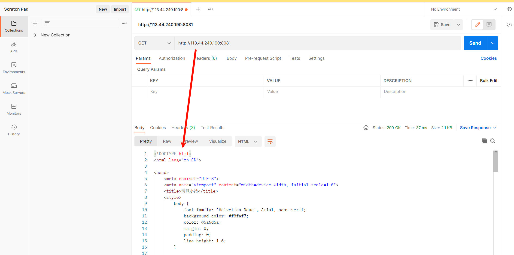

而postman可以认为就是把浏览器换成它发起请求然后服务器给响应。

**fiddler，是一个抓包工具，专门用来抓http的，抓的是本地的，可以用来调试的**

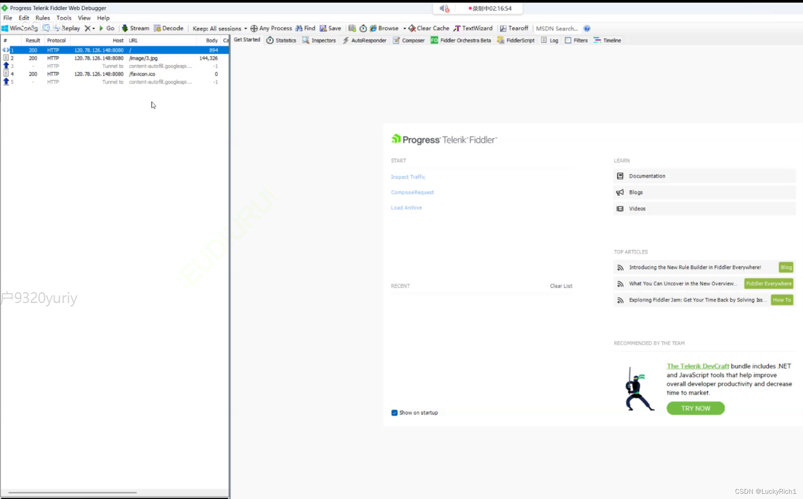

fiddler原理就是，未来浏览器在发起请求时是把请求交给fiddler，由fiddler代替你去请求服务器，服务器响应也是给fiddler，然后fiddler再把响应转发给浏览器。

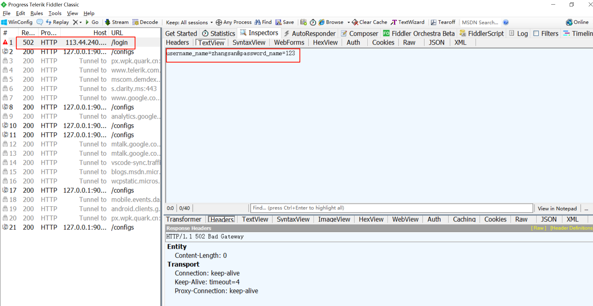

HTTP是明文传输所以就能看到  


