# IO多路转接之epoll
# epoll初识
无论select还是poll都只有一个接口，就叫做select和poll，而epoll要正常工作起来要三个系统调用。

但无论epoll有多少系统调用，epoll核心工作只有一个，就是想办法我们进行等！ 
IO = 等 + 数据拷贝，epoll只负责等！

# epoll相关系统调用
## epoll_create
如果我们要使用epoll，第一步我们要首先调用epoll_create，它参数就一个size在linux版本2.6.8后就可以忽略了，不过一般要大于0。

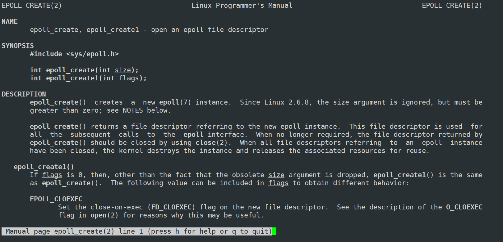

调用成功会返回一个文件描述符，调用失败错误被返回，错误码被设置

那epoll_create到底是干什么的呢？ 
现在先笼统认为epoll_create帮我们创建一个**epoll模型**。

## epoll_ctl
用户告诉内核你要帮我关心那些文件描述符上的那些事件

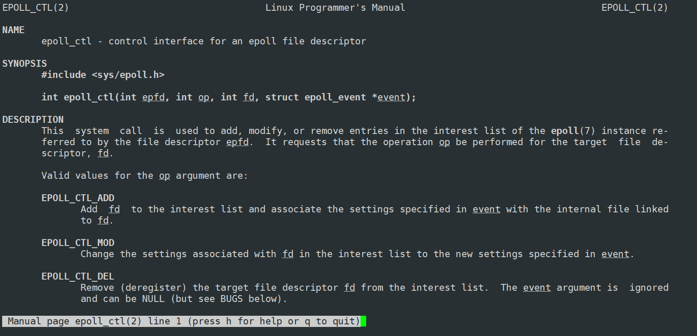

int epfd : 就是调用epoll_create成功的返回值

int fd: 就是你要让epoll帮你关心的文件描述符是谁

struct epoll_event * event ：让epoll帮你关心的文件描述符的什么事件

下面把 struct epoll_event的结构说一说：

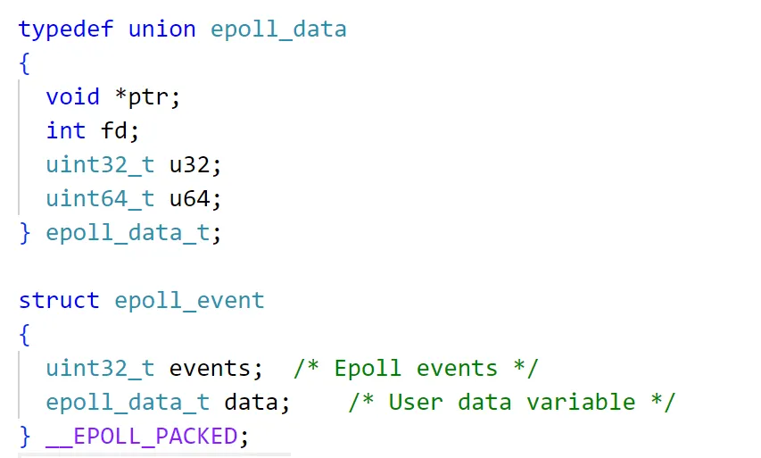

里面包含了events，这个就是用户告诉内核你要帮我关心该fd上的什么事件，  
具体事件如下：  
都是比特位不同的宏值

> EPOLLIN : 表示对应的文件描述符可以读 (包括对端SOCKET正常关闭);
>
> EPOLLOUT : 表示对应的文件描述符可以写;
>
> EPOLLPRI : 表示对应的文件描述符有紧急的数据可读 (这里应该表示有带外数据到来);
>
> EPOLLERR : 表示对应的文件描述符发生错误;
>
> EPOLLHUP : 表示对应的文件描述符被挂断;
>
> EPOLLET : 将EPOLL设为边缘触发(Edge Triggered)模式, 这是相对于水平触发(Level Triggered)来说的.
>
> EPOLLONESHOT：只监听一次事件, 当监听完这次事件之后, 如果还需要继续监听这个socket的话, 需要再次把这个socket加入到EPOLL队列里
>
> epoll_data_t data：它指的是用户的可用数据，它是一个联合体可以由用户定义是一个指针或者fd还是其他值。非常重要！！！(写代码时候就知道了)
>

int op：增，改，删操作

增：向内核中增加要让操作系统帮我们关心的文件描述符。告诉操作系统你要帮我关心这个fd的什么事件。

改：操作系统你要帮我更改一下这个fd的读事件，我想更改为写事件。

删：操作系统从此往后不要再关心这个fd的事件了

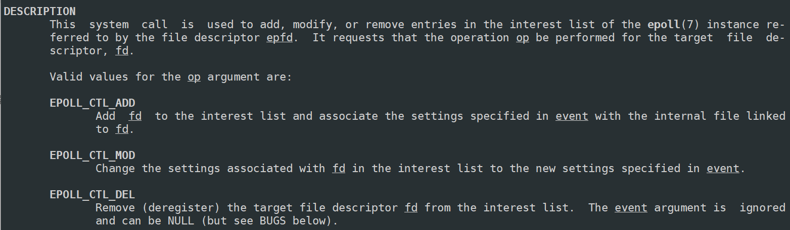

以前在写select和poll更改什么，就是在更改让select和poll在帮我关心那些fd上的那些事件呢？维护数组的时候！今天我们好像没有定义数组哦，直接伸手向操作系统要就行了。

返回值：成功返回0，失败返回-1，错误码被设置

---

那现在有对应的文件描述符就绪了，我们怎么知道是那些文件描述符呢？怎么知道是那些事件就绪了呢？

此时就需要第三个接口了

## epoll_wait
内核告诉用户那些fd的那些事件已经就绪了

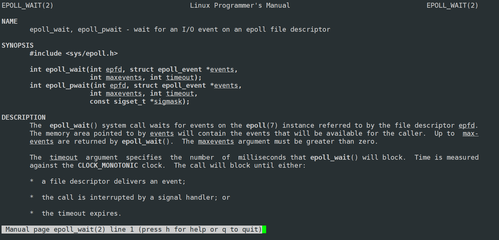

返回值：和select，poll返回值一模一样，大于0有几个fd就绪，等于0超时 ，小于0报错

int epfd：epoll_create调用成功的返回值

struct epoll_event * events：一个连续数组

int maxevents：数组的大小

struct epoll_event * events，int maxevents：这两个参数合起来当作输出型参数用，表示内核->用户，你曾经通过epoll_ctl所要关心的fd，有那些fd已经就绪了。然后都给你依次放好到events这个数组里面了。

int timeout：以毫秒为单位，同poll

# epoll原理
曾经说过整个计算机分为层状结构的 
现在有一个问题：操作系统怎么知道网络中有数据到来了？ 
我们知道网络中数据来了一定是输入设备先捕捉到这个数据。 输入设备此时在我们体系结构体中只能是谁啊？网卡这个输入设备！

现在问题是OS你怎么知道网卡中有数据到来了？

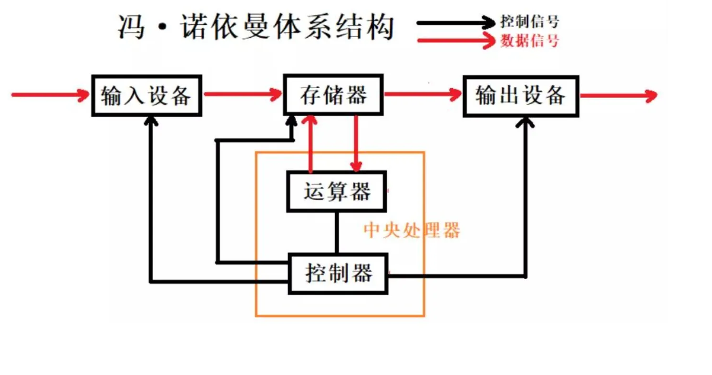 
输入设备网卡先拿到数据。数据在计算机体系结构流动只能是从外设到内存，内存到CPU，CPU处理完然后到内存，然后在到外设。在OS层面确实是按照这样的规则流动的。

还有一个叫做控制信号。cpu有很多针脚，外设虽然并不和cpu有数据层面的沟通，但并不代表外设不会给cpu发任何的我们可以称之为硬件中断。cpu有很多针脚，cpu针脚里面有对应的外设可以通过一些中断设备能够将对应的输入设备的电子信号转化为电子脉冲打到cpu上。cpu就识别到外设有就绪的。然后cpu就把自己有信号的针脚解释成，比如cpu有20针脚，每一个针脚都有编号，比如说6号针脚代表网卡，所有cpu立马意识到6号中断有对应的事件到来了，所以cpu就直接执行中断向量表。

所谓中断向量表里面保存的都是函数指针，其中中断编号作为中断向量表的下标，就能在中断编号索引到表中对应下标内的函数指针，然后去执行对应的方法。假设6号是网卡就绪了，这个方法就调用驱动方法将数据从外设拷贝到内存中的OS内部。

上面整个逻辑都是OS提供的，OS也不关心外设有没有就绪，反正OS知道一旦外设就绪了直接会通过针脚向cpu发起中断请求，中断请求被cpu识别到，cpu某个针脚就会被触发，然后对应的中断号就被获取了，获取后插中断向量表。然后执行对应下标的方法。

这个是帮助我们理解整个软硬件之间交互的过程，我们简单了解一下就行。

现在我们知道数据能到硬件了，只要能到硬件就一定能够从底层硬件读到操作系统，只要到操作系统不就到协议栈向上交付了。

下面正式来说epoll原理，

我们创建epoll和为什么epoll会这么高效，要做如下三件事情。

## 创建epoll时，操作系统会帮我在内部创建一个红黑树
初始是一颗空树。然后红黑树每一个节点里面包含了一些字段：int sock，uint_32_t events…

这颗红黑树的意思：用户告诉内核，那些sock上的那些事件OS要关心。

站在OS的角度凡是被添加到这颗红黑树上的所有结点都是操作系统要关心的fd上的特定的事件。

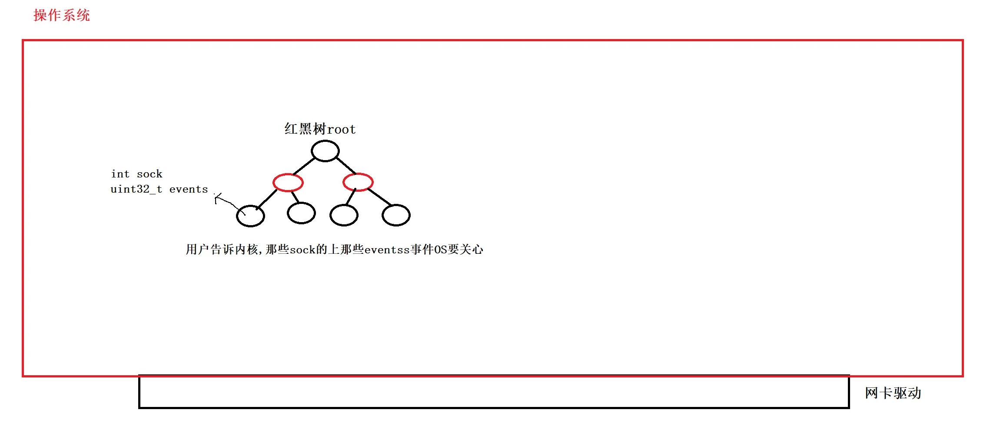

每一个节点都是用户告诉内核你要帮我关心那些fd上的那些事件，换言之红黑树上的每一个节点都是用户通过一定的方式插入或者是新增的，用户把数据传给操作系统，然后操作系统就为我们构建一颗红黑树节点，然后插入到红黑树里，所以站在操作系统角度凡是在这颗红黑树当中的每一个节点都是我应该关心的那些fd的那些事件。

不要简单把红黑节点就简单理解成就`sock`和`events`字段，它当然要包括该节点左指针、右指针等。

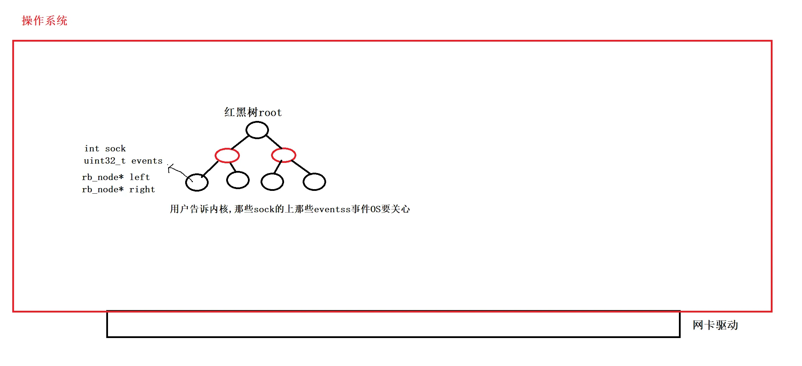

## OS在为我们创建epoll的时候，还会为我们创建一个就绪队列
队列节点内核心字段有`int sock`，`uint32_t events`
这个就绪队列上每一个节点表示：内核告诉用户，那些sock上的events事件已经就绪了

就绪队列为空就说明当前没有任何fd就绪了，如果有节点那有那些fd有就绪事件上层就知道了

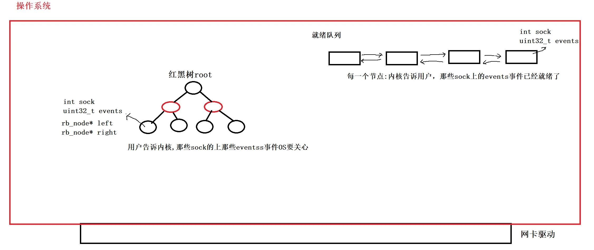

换句话说所谓就绪事件的本质就转化成了，将节点从红黑树节点转移就绪队列的过程！ 不过这都是在逻辑上可以这样理解。真实情况并不是这样的！

并不是说某个fd事件就绪了，OS内部重新new一个节点相应字段填进去然后插入就绪队列这样。虽然可以这样做但没必要。因为整个epoll在设计上不要以为一个节点被放在一种数据结构里后，就只能在一种数据结构。它可以既在红黑树里又在就绪队列里，其实只需要在节点中在添加`node* next`，`node* prev`。

红黑树节点内`node* next`，`node* prev`先置为空，如果这个节点就绪了只要把这个节点在逻辑上重新连入这个就绪队列总会有开始的。改指针的指向就行了。

所以物理上可能就只有就绪队列的头，节点依旧在这个红黑树里，但在逻辑上把它拆开。

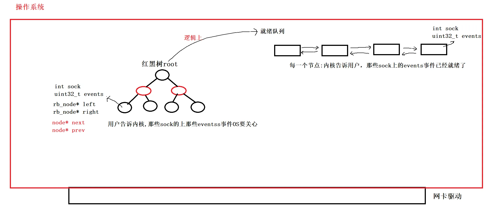

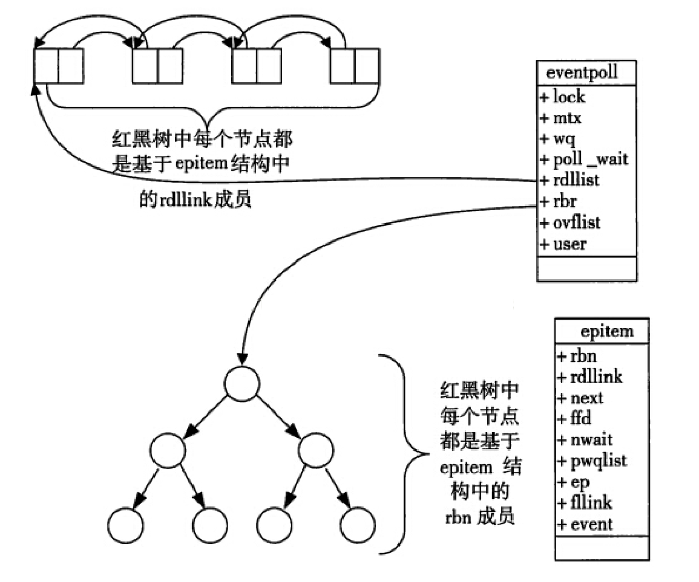

当某一进程调用`epoll_create`方法时，Linux内核会创建一个`eventpoll`结构体，这个结构体中有两个成员与`epoll`的使用方式密切相关.

```cpp
struct eventpoll{
    ....
    /*红黑树的根节点，这颗树中存储着所有添加到epoll中的需要监控的事件*/
    struct rb_root rbr;
    /*双链表中则存放着将要通过epoll_wait返回给用户的满足条件的事件*/
    struct list_head rdlist;
    ....
};
```

每一个epoll对象都有一个独立的eventpoll结构体，用于存放通过epoll_ctl方法向epoll对象中添加进来的事件。

+ 这些事件都会挂载在红黑树中，如此，重复添加的事件就可以通过红黑树而高效的识别出来(红黑树的插入时间效率是lgn，其中n为树的高度).
+ 而所有添加到epoll中的事件都会与设备(网卡)驱动程序建立回调关系，也就是说，当响应的事件发生时会调用这个回调方法.
+ 这个回调方法在内核中叫ep_poll_callback,它会将发生的事件添加到rdlist双链表中.
+ 在epoll中，对于每一个事件，都会建立一个epitem结构体.

```cpp
struct epitem{
    struct rb_node rbn;//红黑树节点
    struct list_head rdllink;//双向链表节点
    struct epoll_filefd ffd; //事件句柄信息
    struct eventpoll *ep; //指向其所属的eventpoll对象
    struct epoll_event event; //期待发生的事件类型
}
```


## 回调机制
现在的问题就变成了，用户告诉内核那些fd的那些事件要关心，然后由红黑树来维护，内核告诉用户那些fd的那些事件就绪了就放在就绪队列里，可能就做两个指针的移动操作很快就把节点连入队列里。可是操作系统你怎么知道这颗红黑树上那些fd的那些事件就绪了？ 难道也要遍历吗？红黑树遍历和顺序遍历没什么效率提升区别！

OS是这样解决的：

每一个节点其实对应的是一个文件描述符，底层有对应的struct file对象，所以输入设备网卡通过网卡驱动将数据交到OS内部，这个数据贯穿网络协议栈最终拷贝到对应fd指向的`struct file`对象内指向的缓存区内，这叫做读就绪了。问题是把数据放到里面之后怎么让OS知道呢？

所以OS为每一个文件，在每一个文件`struct file`里设置一个`void* private`。这个指针会指向一个回调函数。当底层把数据经过拷贝到该`fd`的`struct file`的缓存区内，OS会调用一下`void* private`指向的回调方法，而这个回调方法的作用就是把`node* next`，`node* prev`更改一下，把对应红黑树节点投递到就绪队列中。

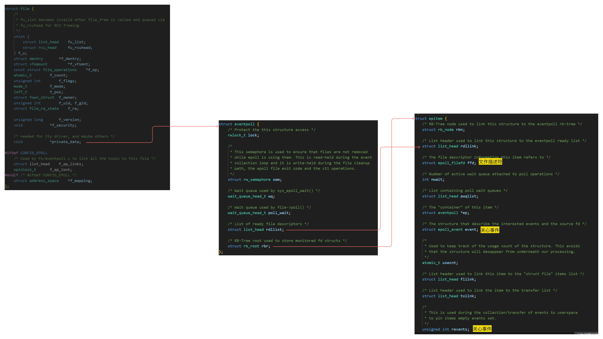

所以整个工作由硬件中断为发起点，一旦就绪在硬件层面上数据到来，数据经过网卡驱动读到上层，经过协议栈贯穿之后，数据拷贝到对应文件缓存区里供上层读取。但是我们并不知道，所以OS此时直接调用`void * private`指向的回调方法，将`node *next`，`node *prev`更改把红黑树节点投入到就绪队列中

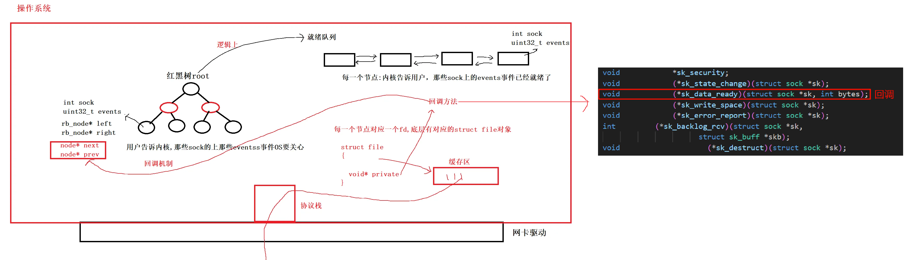 
我们可以简而言之，OS给每一个在红黑树节点对应的每一个文件在底层注册了回调机制。一旦底层有数据了，OS不需要主动去遍历，而是只需要回调将next，prev指针在红黑树节点当中也同步的连入就绪队列中！

我们把这颗红黑树，就绪队列和回调机制，整体称之为epoll模型！

---

epoll_create、epoll_ctl、epoll_wait不是系统调用吗，谁在调用啊？不就是在内核中有进程在调用吗。epoll_create创建epoll模型返回值是一个文件描述符，因为linux下一切皆文件！进程在PCB中找文件描述符表，然后找到对应下标，就可以找到对应`struct file`它内部某个字段关联这个epoll模型，最终这个进程就能找到整个epoll模型。

我们回过头看看刚才OS提供的epoll三个系统调用接口： 
epoll_create 帮我们创建整一个epoll模型
epoll_ctl 本质就是在这颗红黑树上增、删、改
epoll_wait 只要从就绪队列中把已经就绪的文件描述符拿上来就行了

凡是放在就绪队列中的节点一定就是已经就绪的了！所以epoll_wait不需要遍历检测，只需要遍历拷贝！ 所以单纯检测有没有事件就绪时间复杂度O(1)，而不像select和poll还要遍历检测就绪时间复杂度O(N)。

为什么说epoll高效呢？

> 因为它把所有工作主体交给OS，由OS帮我们关心这些事情。
>

细节：

既然所有就绪节点都已经放在就绪队列里，epoll_wait不仅仅考虑到从内核拿到用户告诉那些fd就绪这件事情。它甚至将所有就绪的事件按照顺序放到用户传入的数组中。 所以往后遍历处理就绪事件不用遍历任何多余的次数，因为epoll_wait返回值就已经告诉我们本轮返回几个就绪fd了，我们直接用这个返回值，从下标0开始遍历就行了。

如果就绪队列中有非常多的就绪节点，一次拿不完怎么办？
不用担心，我们传入的缓存区拿多少是多少，拿不完下次还让你拿，因为它是一个队列，先进先出！

select和poll以前我们都用到辅助数组，可是在epoll这里我们就没有用辅助数组了。请问为什么epoll这里不需要辅助数组了？历史上的辅助数组，在今天epoll这里相当于什么东西？
**红黑树**！以前select和poll用的辅助数组由程序员自己维护(增，删，改)，而今天这颗红黑树不需要自己写也不行自己维护，都有OS自己做，我们只需要用接口。

所以说epoll原理看起来很复杂，但是epoll的使用一定非常简单！

# epoll服务器
下面我们写一份epoll服务器，不过今天这里我们还是只关心读取。对于写和其他一些细节我们放在Reactor中细说

```cpp
#ifndef EPOLL_SERVER
#define EPOLL_SERVER

#include <memory>
#include <sys/epoll.h>

#include "Socket.hpp"

const static int gsize = 64;

class EpollServer
{
public:
    EpollServer(uint16_t port)
        : _listensock(std::make_unique<TcpSocket>()), _epfd(-1)
    {
        _listensock->BuildListenSocketMethod(port);
        _epfd = epoll_create(128); // 创建
        if (_epfd < 0)
        {
            LOG(LogLevel::FATAL) << "epoll_create failed";
            return;
        }
        LOG(LogLevel::INFO) << "Listen sockfd is: " << _listensock->SockFd()
                            << " epoll fd is : " << _epfd;

        // 添加listensock到epoll
        struct epoll_event ev;
        ev.events = EPOLLIN;                // 监听读事件
        ev.data.fd = _listensock->SockFd(); // 将监听套接字的文件描述符存入事件数据中
        int n = epoll_ctl(_epfd, EPOLL_CTL_ADD, _listensock->SockFd(), &ev);
        if (n < 0)
        {
            LOG(LogLevel::WARNING) << "epoll_ctl failed";
            return;
        }
    }

    void Accepter()
    {
        InetAddr clientaddr;
        int sockfd = _listensock->Accept(&clientaddr);
        if (sockfd > 0)
        {
            LOG(LogLevel::FATAL) << "获取一个新连接, fd : " << sockfd
                                 << " 客户端地址是: " << clientaddr.ToString();
            struct epoll_event ev;
            ev.events = EPOLLIN;
            ev.data.fd = sockfd;
            int n = epoll_ctl(_epfd, EPOLL_CTL_ADD, sockfd, &ev);
            if (n < 0)
            {
                LOG(LogLevel::WARNING) << "epoll_ctl failed";
                close(sockfd);
                return;
            }
            LOG(LogLevel::INFO) << "添加新连接到epoll中: " << sockfd;
        }
    }
    void Recver(int sockfd)
    {
        char buffer[1024];
        ssize_t n = recv(sockfd, buffer, sizeof(buffer) - 1, 0);
        if (n > 0)
        {
            buffer[n] = 0;
            std::cout << "Client Say@ " << buffer;
            std::string echo_string = "echo server# ";
            echo_string += buffer;

            send(sockfd, echo_string.c_str(), echo_string.size(), 0);
        }
        else if (n == 0)
        {
            LOG(LogLevel::INFO) << "client quit, me too, fd is : " << sockfd;

            int n = epoll_ctl(_epfd, EPOLL_CTL_DEL, sockfd, nullptr);
            if (n < 0)
            {
                LOG(LogLevel::WARNING) << "epoll_ctl del error";
            }
            close(sockfd);
        }
        else
        {
            LOG(LogLevel::INFO) << "recv error, fd is : " << sockfd;
            int n = epoll_ctl(_epfd, EPOLL_CTL_DEL, sockfd, nullptr);
            if (n < 0)
            {
                LOG(LogLevel::WARNING) << "epoll_ctl del error";
            }
            close(sockfd);
        }
    }
    void Dispatcher(int num)
    {
        LOG(LogLevel::INFO) << "有事件就绪了...";
        for (int i = 0; i < num; i++)
        {
            int fd = _revs[i].data.fd;
            uint32_t events = _revs[i].events;

            if (events & EPOLLIN)
            {
                if (fd == _listensock->SockFd())
                {
                    Accepter();
                }
                else
                {
                    Recver(fd);
                }
            }
            if (events & EPOLLOUT)
            {
                // ...
            }
        }
    }

    void Run()
    {
        // int timeout = 1000;
        int timeout = -1;
        for (;;)
        {
            // 不可以直接accept，需要知道哪些事件就绪了
            int n = epoll_wait(_epfd, _revs, gsize, timeout);
            switch (n)
            {
            case 0:
                LOG(LogLevel::DEBUG) << "time out...";
                break;
            case -1:
                LOG(LogLevel::FATAL) << "epoll error ...";
                break;
            default:
                Dispatcher(n);
                break;
            }
        }
    }

    ~EpollServer()
    {
    }

private:
    std::unique_ptr<Socket> _listensock;
    int _epfd;
    struct epoll_event _revs[gsize];
};

#endif
```

上面读的处理依旧有问题，一次没读完怎么办？假设运行你循环读。但是你依旧读到 char buffer[1024]里不就把上次数据覆盖了吗。更关键的是第一次fd就绪了你给它读了下次这个fd还就绪了，可是上次这个函数都已经跑完了， char buffer[1024]只是一个栈上面的临时空间。上次函数执行完就已经把这块空间释放掉了。

这些问题怎么解决我们都在Reactor解决！

不过上面代码执行没有什么问题。

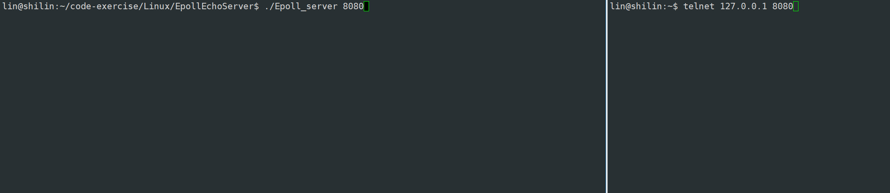

# epoll原理：LT，ET
什么叫做事件就绪？

对于读来说不就是底层有数据到了吗，可以读这个数据了。对于写来说就是发送缓存区有空间，可以让用户将数据拷贝到发送缓存区可以发送了。这理解都没错。

> 总结一下：底层的IO条件满足了，可以就行某种IO行为了，就叫事件就绪了！
>

有数据叫做读取事件就绪，有空间叫做发送事件就绪。epoll会一直通知我们。

回头过审视一下 select/poll/epoll -> 等(手段) -> IO就绪事件通知机制(目的)

通知机制有没有策略呢？

历史上还有一个遗留问题：TCP报头里有一个PUSH标记位，当时说的是报头携带这个标记位是催促对方尽快将报文向上交付。当时也说了具体怎么理解到后面再说。今天就到解决的时候了。不过先不着急。先解决下面的问题。

既然多路转接是一种就绪事件的通知机制，所以通知的时候有没有策略呢？我们需要讲一个小故事。这个故事蕴含着epoll的原理。

小王是个学生有一个爱好喜欢网购，小王一次性在6个不同卖家买了6件商品，然后卖家就发货了。6个快递最终都到了小王学校附件的菜鸟驿站。到了菜鸟驿站这些快递要送给你。张三快递员车子放不下了，小王包裹只拿了4个，然后骑车到了小王宿舍楼下。张三不仅带的有小王的还有其他学生的，于是张三就依次打电话通知给不同的人派发包裹。然后张三现在就开始给小王打了，小王在吗？你有快递下来拿。  
小王说好咧，电话一挂。但是小王正在宿舍和室友开黑推对面高地。快递员现在让我下去拿快递。小王招呼室友赶紧赶紧把游戏打完我下去。谁知这个高地很难推，过了3分钟还没有推完。于是张三快递员又给小王打电话，小王你下来没，我也快下班了。小王说马上下来，电话一挂，又在和室友推高地。又过了3分钟张三又给小王打电话。小王你下来没。小王说就来就来，电话一挂，又在推高地，就是不下来。  
张三又给小王打电话，小王快下来，取快递。此时小王这次游戏终于打完了，然后接到电话，就下去取快递了。但是小王买的东西太大，本来要一次拿完，但是现在只能一次拿2个，还剩下2个。然后小王就先把这两个快递拿到宿舍了。然后他室友说再来一把，于是小王就没下去了。过了一会张三又打电话，小王你快递没拿完，你赶紧再来拿。小王满口答应就是不下去拿。所以在这种情况下张三一天给小王打了很多电话。

而菜鸟驿站的李四快递员他还今天剩下2个包裹就把所有快递都送完了然后下班，李四也来到了小王宿舍楼下，看到张三说你咋还没有下班，张三说我等一个人叫小王他还没有下来取快递。李四说那正好我这里还有两个包裹就是给小王的，你帮我一起派发一下把。张三作为老好人说行吧，于是李四把剩下2个包裹给张三，然后李四就回去了。张三又给小王打电话你又多了两个快递，快下来取，但是小王挂完电话还是不下来。于是张三就一直打电话最终小王扛不住了叫来宿舍其他人一次把剩下4个快递都拿走了。张三就再也不给小王打电话。然后就回了。

作为热衷网购的小王收到张三给小王派发的包裹，于是当天晚上又在不同卖家哪里买了4件东西，然后这4个快递又到了菜鸟驿站。今天张三休假，由李四来进行包裹派发，李四是一个职场老油条，他骑着车拉着一堆包裹其中里面还有小王的3个包裹就走了，最后又来到小王楼下。 李四给所有人派生快递都会说这样一句话，同学你好，你要是现在不下来取，我就再也不给你打电话了。我下了班我直接就走了，你要在拿包裹你就等着明天给我或者领导打电话了，反正我不管。所以李四到了小王楼下给小王打电话，小王下来取快递，你现在不下来，我只给你打一个电话，你要是不下来取，那么往后我就不给你打电话了，我下班就直接回去了，要取这个包裹你自己菜鸟驿站拿或者给我领导打电话。小王和他室友在开黑，他想这个快递员怎么能这样，但是他也没有办法，他怕自己包裹没有了，所以小王就只能下来把自己3个包裹拿走了。当然小王也可以只拿走2个，李四手里还有一个，但是李四照样不给小王打电话了。

场景一：假设小王今天就是只拿走了2个，还剩下一个，李四正如他所说，我再也不给你打电话了，爱拿不拿。小王他也不知道自己又几个包裹送到了，他拿了两个包裹，那么此时李四下班小王剩下的一个包裹就被丢失了。

场景二：小王就是不下去拿包裹。李四说不拿就不拿呗，反正你3个包裹在我这，你是不是不拿，小王说是的不拿。李四说行你，不给你打电话了。所以很长时间李四都在给别人派发就是不给你小王打电话了。然后又来一个快递员王五他手里也就剩下一个小王的包裹然后碰到李四，李四你在干什么呢，李四说我正在派发包裹，王五问你还有谁的包裹没有派发，李四说还有一个小王的。王五说行我这刚好还有一个小王的你帮我把这个包裹一起派发了把。所以李四手里本来就有小王3个包裹没有派发出去，现在还新增了一个小王的。新增之后李四觉得状态有变化，此时有义务给小王打个电话，但是也仅仅打一个。所以李四又给小王打电话了，小王你又新到了一个包裹你下来取，你要是不取我再也不给你打电话了，下班了我就走了。所以小王只能下楼把自己所有包裹取走，要么不取，要取就全取走。因为李四只会告诉小王一次，即便小王只取一部分，剩下一部分在李四手里，李四也不会给小王打电话了。除非小王对应的包裹在李四手里变多了或者变化了，李四才会给小王打电话。

刚刚讲了两个快递员的故事，一个叫做张三，一个叫做李四，请问你更喜欢谁的派发包裹的方式呢？或者这样说谁派发包裹的方式更高效一些，为什么？

毫无疑问李四更高效一些，因为快递员一天打电话总量是基本确定的，所有李四几乎不打重复电话，这就意味这他可以通知更多的人！其次因为李四只会给你打一次电话，所有倒逼着取快递的人尽快把快递取走。所以最终李四效率一定比张三高一些。打电话总量是基本确定的，而张三这个老实人，可能给50个人派发，但是可能给当中20-30人打重复电话，就意味着通知的人只能变少，更重要的是，所有取快递的人都知道，我不取，你还会给我打电话的。所以张三就必须重复去打。而且用户也不怎么上心，也不怎么尽快把数据取走，所以从效率上来看张三效率一定低一些。

张三和李四打电话派发快递的方式本质：通知用户事件到来！！！
他们不会把快递送上门，快递员只负责通知，不负责把数据送到楼上！所以张三和李四对应的通知有策略吗？有啊。
张三对应的底层就绪事件通知策略：**LT模式**
李四对应的底层就绪事件通知策略：**ET模式**

张三和李四这两个人对应就是epoll不同工作模式！
快递包：数据
小王：上层用户

> LT模式 —> 水平触发Level Triggered 工作模式
ET模式 —> 边缘触发Edge Triggered工作模式

# epoll工作模式
epoll有两种工作模式，我们以读事件为例，当底层来了数据之后，epoll就通知上层有事件就绪了。它通过回调机制将红黑树节点连接到就绪队列中。上层调用epoll_wait就可以读到就绪事件了。

可是用户确实识别到事件就绪了，但是不对就绪fd不处理或者只读取一部分。也就是说如果底层已经到了的数据还没有被上层读完，那么一轮epoll处理完之后在调用epoll_wait的时候，OS还会继续调用底层回调，如果红黑树节点在就绪队列就不添加了，不在的话在添加。也就是说如果底层只要有数据，上层要么不读要么没读完，那epoll会一直通知你。这种工作模式就叫做LT工作模式。

> 只要底层有数据没读完，epoll就会一直通知用户要读取数据。—> LT
>

怎么保证底层一直通知用户呢？很简单，只要把数据没读完，就不把就绪节点从就绪队列里移除，那这个就绪队列就一直有这个就绪事件。

> 只要底层有数据没读完，epoll不再通知用户，除非底层的数据变化的时候(再次增多)，才会再通知一次！--> ET
>

只要上层把这个就绪节点从就绪队列拿上去了，就把它从就绪队列里移除，下次想读对不去，没有这个就绪事件了。

当我们在写select的时候，当一个就绪事件来了但是就是不把就绪事件读走，我们发现就会一直在死循环告诉我在就绪了。

在poll和epoll都是一样的，如果就绪事件来了，但是不把就绪事件读走就会一直死循环。

```cpp
void Run()
{
    // int timeout = 1000;
    int timeout = -1;
    for (;;)
    {
        // 不可以直接accept，需要知道哪些事件就绪了
        int n = epoll_wait(_epfd, _revs, gsize, timeout);
        switch (n)
        {
        case 0:
            LOG(LogLevel::DEBUG) << "time out...";
            break;
        case -1:
            LOG(LogLevel::FATAL) << "epoll error ...";
            break;
        default:
            // Dispatcher(n);
            LOG(LogLevel::INFO) << "有事件就绪了...";
            break;
        }
    }
}
```

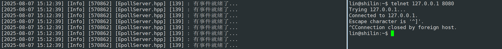

为什么出现这个死循环知道了吗？  
因为select、poll、epoll默认模式工作模式是`LT`

下面我们重点谈ET工作模式：

下面看一个实验现象，我们把对_listensock套接字默认LT工作模式改成ET工作模式

EPOLLET : 将EPOLL设为边缘触发(Edge Triggered)模式, 这是相对于水平触发(Level Triggered)来说的

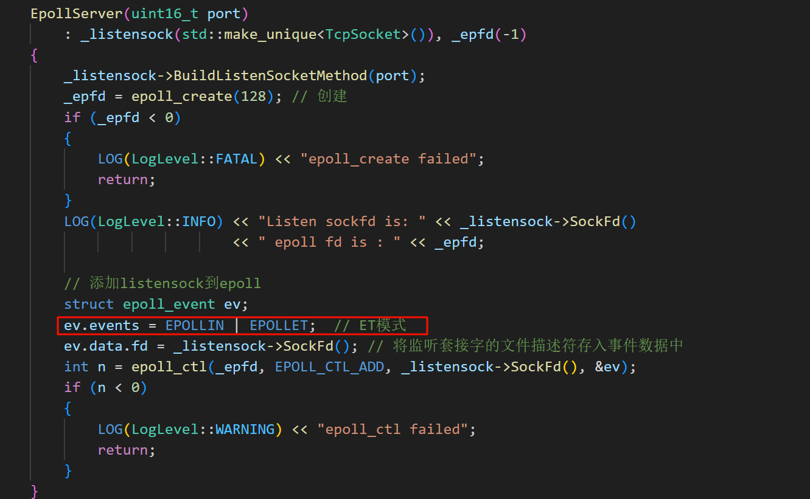

看到没只通知一次，不像上面那样一直通知，爱读不读。

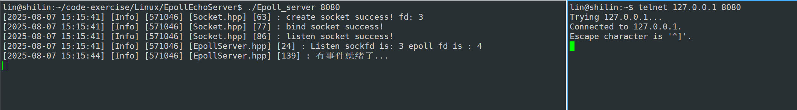

因为是ET模式 所以就有下面一整套的逻辑。

ET模式 —> 底层只有数据从无到有，从有到多变化的时候，才会通知(红黑树+就绪队列+回调机制)上层一次 —> 倒逼程序员将本轮就绪的数据全部读取到上层 —> 你怎么知道你把本次就绪的底层的数据读取完毕了呢？

就比如你爸就500私房钱，你第一天找你爸要100你爸给你了，第二天找你爸又要100你把还给你了…，到第六天的时候，你还会找你爸要吗？你肯定会要的，因为你并不知道你爸还有多钱，你每次要他都给，你以为他还有，直到你第六天要了你爸没给你，你才知道你爸没钱了，你才不要了。或者你找你把要100你爸才给你30，可能你爸也没有钱了，但是你还会要，直到你爸不给你了。但这都不重要，你怎么保证你把你爸私房钱全要完呢？你也不关心你爸一次给我你多少钱，而是只要你见到你爸，就伸手要钱，直到你把拒绝了你，你才知道你把没钱了。

循环读取，直到读取不到数据了！ —> 一般的fd，是阻塞式的fd！当没有读到数据时就会被阻塞！—> 可是我们的多路转接是单进程的！一旦你阻塞了整个服务器就阻塞挂起了，所以ET模式下，对应的fd必须是非阻塞的！！

那LT呢？LT模型下fd应该怎么读呢?
因为LT，只要fd就绪就会通知你一次，也就是说可以不把数据读完，读一次就行了，下次还会再通知我，我在读就行了，所以LE模型下，对应的fd可以是阻塞的也可以是非阻塞的。

刚才说ET模式工作效率高，LT模式工作效率低。这只是一般情况。LT模式既然可以通知我许多次，那我在LT模式下，我可不可以模仿ET的工作方式呢？就是LT模式，就偏要把fd设为非阻塞，事件就绪了偏要把这一次就绪事件全部读完。和你ET做着一模一样的工作。可以吗？当然可以了！！

所以片面说ET和LT谁的工作模式更高效，这是不对的。
既然LT也能干ET的事情，那还要ET干什么呢？
还是要结合对应的场景，不同场景适合不同的工作模式。LT本来编写难度本来就低，数据没读完也不担心，但是你怎么能够保证所有程序员全按照这样的工作方式工作呢？如果没有ET模式的约束每个人有每个人的做法，那每个人做出来的东西都不一样。但是ET不一样，数据就绪就通知一次，你这个程序员必须尽快把数据全部读走，不遵守我的规则，你的代码就有问题。

所以说ET比LT更高效，其实体现在倒逼程序员将本轮就绪的数据全部读取到上层。

但这样说并不全面，ET比LT更高效：

不仅仅体现在通知机制上！

倒逼程序员将本轮就绪的数据全部读取到上层这句话换一个意思就是：尽快让上层把数据取走 —> TCP 接收方可以给发送方提供一个更大的窗口大小 —> 让对方更新出更大的滑动窗口 —> 提高底层的数据发送效率，更好的利用诸如TCP延迟应答等策略！

这才是ET高效的真正原因！

所以TCP中的PUSH标记位的作用？？
我们说它会催促对方尽快让应用层把数据进行交付。应用层就不读你能把他咋，对不起，不能把他咋。PUSH作用很简单：让底层数据就绪的事件，在让上层知道！
比如说在ET模式下工作，可能对方上层长时间不读取，然后PUSH一下对方，相当于告诉你的epoll赶紧让用户知道数据已经就绪了，所以epoll立马把这个PUSH转换成一个就绪事件投递到就绪队列里，让上层知道，只有上层知道了他才尽可能读取。

# epoll的优点(和 select 的缺点对应)
接口使用方便: 虽然拆分成了三个函数, 但是反而使用起来更方便高效. 不需要每次循环都设置关注的文件描述符, 也做到了输入输出参数分离开

数据拷贝轻量: 只在合适的时候调用`EPOLL_CTL_ADD`将文件描述符结构拷贝到内核中, 这个操作并不频繁(而select/poll都是每次循环都要进行拷贝)

事件回调机制: 避免使用遍历, 而是使用回调函数的方式, 将就绪的文件描述符结构加入到就绪队列中, `epoll_wait` 返回直接访问就绪队列就知道哪些文件描述符就绪. 这个操作时间复杂度O(1). 即使文件描述符数目很多, 效率也不会受到影响.

没有数量限制: 文件描述符数目无上限.

---

网上有些博客说，epoll中使用了内存映射机制

内存映射机制：内核直接将就绪队列通过mmap的方式映射到用户态. 避免了拷贝内存这样的额外性能开销.

这种说法是不准确的，我们定义的struct epoll_event是我们在用户空间中分配好的内存。势必还是需要将内核的数据拷贝到这个用户空间的内存中的.

