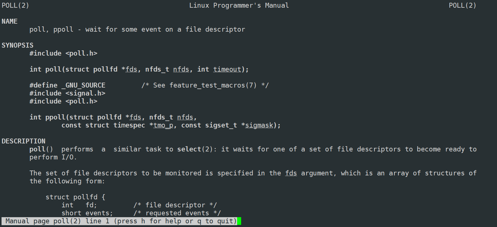
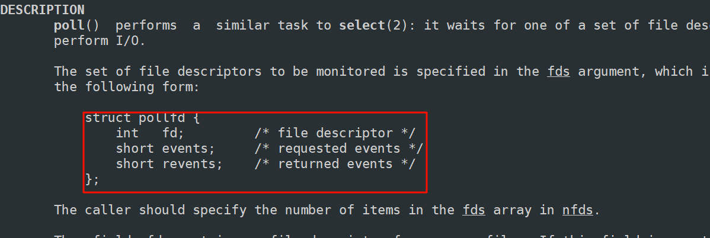
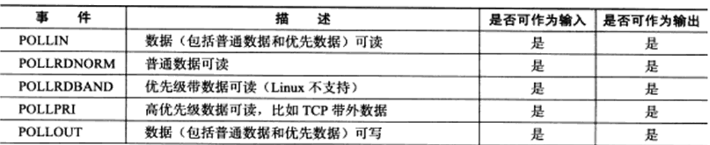
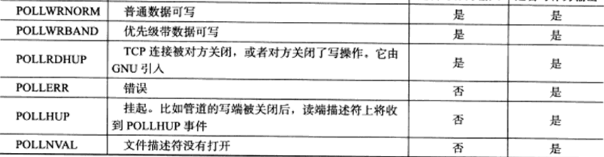
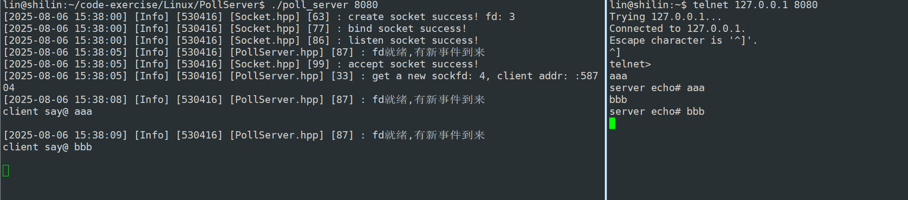

# IO多路转接之poll
# poll初识
poll也是一种linux中多路转接的方案。它所对应的多路转接方案主要是解决select两个问题。

select的文件描述符有上限的问题

select每次都要重新设置关心的fd

下面通过poll接口来认识它是怎么解决select的问题的。

# poll函数接口


`struct pollfd * fds`：这里可以把它想象一个动态数组、数组或者new/malloc出来的结构体数组

`nfds_t nfds`：代表这个数组的长度

`int timeout`：纯输入型，时间单位ms

大于0：在timeout以内 阻塞，超过timeout非阻塞返回一次

等于0 ：非阻塞

小于<0：阻塞

这个和select一模一样的意思。用起来更简单了。

返回值：同select一模一样

大于0：表示有几个fd就绪了

等于0：表示超时了

小于0：表示poll等待失败了

poll的作用和select一模一样：只负责等待！



这个struct pollfd结构体 在传给poll表示 用户->内核：

int fd：你要关心一下这个fd哦

`short events`：关心的是这个fd的什么事件。我们把对应的事件设置进events里

> 输入看：fd+events
>

当poll返回时这个`struct pollfd`结构体 表示内核->用户：

你要关心的fd上面的events中有那些事件已经就绪啦

`short revents`：就绪事件由`revents`返回

> 输出看：fd+revents
>

很显然这种设计解决了这样的问题：

输入输出分离！

现在，用户->内核，内核->用户，events和revents的分离！以前select就用一张位图表示不同含义，因为输入输出分离了所以决定了poll不需要对参数进行重新设定

events和revents类型是整数，对应的事件如下：





其中对我们来说常用的是`POLLIN`、`POLLOUT`、`POLLERR`，这些都是大写的宏每一个占一个比特位，不同比特位表示不同事件。

所以用户->内核，只要将events设置成要关心的宏值，那么操作系统就帮我们进行关心了。当操作系统返回时只要把revents设置成对应的宏值，不就把那些事件就绪不就告诉我们了吗。

因为它的类型是short而没有用操作系统自己封装的各种各样的结构体，所以对于事件的设计，我们自己用户检测事件有没有设置或者就绪一定要由我们自己来做，按位与，按位或这样的操作。

select等待fd有上限的问题

`struct pollfd *fds`不是一个数组吗，nfds_t nfds不就是该数组大小也就是上限吗，你怎么说poll解决了select等待fd上限的问题？

select是一个具体的数据类型fd_set，既然是一个具体的类型那就直接决定了数据类型大小只能由你的编译环境自己定，今天不一样了，因为这个数组由我们自己说的算！

# poll服务器
直接通过之前写的SelectServer修改成PollServer

今天poll服务器，也是需要一个数组。只不过以前select数组纯纯的保存文件描述符，poll这里必须是保存struct pollfd结构体的数组。

一般我们如果把fd设置为-1或者小于0的值，操作系统就不会关注这样的文件描述符了。它只会关心大于等于0的fd。

当我们启动服务之后，就不需要每次调用select之前都需要重新设置fd了添加到读文件描述符集里面了，然后才能添加到select里面。现在直接把数组给poll。所以能明显感觉到poll比select简单

## PollServer.hpp
```cpp
#ifndef POLL_SERVER
#define POLL_SERVER

#include <algorithm>
#include <poll.h>
#include "Socket.hpp"

const static int gsize = sizeof(fd_set) * 8;
const static int gdefaultfd = -1;

class PollServer
{
public:
    PollServer(uint16_t port)
        : _listensock(std::make_unique<TcpSocket>())
    {
        _listensock->BuildListenSocketMethod(port);
        for (int i = 0; i < gsize; i++)
        {
            _fd_array[i].fd = gdefaultfd;
            _fd_array[i].events = _fd_array[i].revents = 0;
        }
        _fd_array[0].fd = _listensock->SockFd();
        _fd_array[0].events = POLLIN; // 监听读事件
    }

    void Accepter()
    {
        InetAddr clientadddr;
        int sockfd = _listensock->Accept(&clientadddr);
        if (sockfd > 0)
        {
            LOG(LogLevel::INFO) << "get a new sockfd: " << sockfd << ", client addr: " << clientadddr.ToString();
            int pos = 0;
            for (; pos < gsize; pos++)
            {
                if (_fd_array[pos].fd == gdefaultfd)
                {
                    _fd_array[pos].fd = sockfd;
                    _fd_array[pos].events = POLLIN; // 监听读事件
                    break;
                }
            }
            // 已经满了
            if (pos == gsize)
            {
                LOG(LogLevel::WARNING) << "server is full!";
                close(sockfd);

                // 可以选择扩容
            }
        }
    }

    void Recver(int index)
    {
        int sockfd = _fd_array[index].fd;
        char buffer[1024];

        ssize_t n = recv(sockfd, buffer, sizeof buffer, 0);
        if (n > 0)
        {
            buffer[n] = 0;
            std::cout << "client say@ " << buffer << std::endl;
            std::string echo_string = "server echo# ";
            echo_string += buffer;
            send(sockfd, echo_string.c_str(), echo_string.size(), 0);
        }
        else if (n == 0)
        {
            LOG(LogLevel::INFO) << "client quit, me too: " << _fd_array[index].fd;
            _fd_array[index].fd = gdefaultfd;
            _fd_array[index].events = _fd_array[index].revents = 0;
            close(sockfd);
        }
        else
        {
            LOG(LogLevel::WARNING) << "recv error: " << _fd_array[index].fd;
            _fd_array[index].fd = gdefaultfd;
            _fd_array[index].events = _fd_array[index].revents = 0;
            close(sockfd);
        }
    }

    void EventDispatcher()
    {
        LOG(LogLevel::INFO) << "fd就绪,有新事件到来";
        for (int i = 0; i < gsize; i++)
        {
            if (_fd_array[i].fd == gdefaultfd)
                continue;
            // 读事件就绪
            if (_fd_array[i].revents & POLLIN)
            {
                if (_fd_array[i].fd == _listensock->SockFd())
                    Accepter(); // 连接管理器
                else
                    Recver(i); // IO处理器
            }
        }
    }

    void Run()
    {
        for (;;)
        {
            int timeout = -1; // -1表示阻塞等待
            int n = poll(_fd_array, gsize, timeout);
            switch (n)
            {
            case 0:
                LOG(LogLevel::DEBUG) << "timeout...";
                break;
            case -1:
                LOG(LogLevel::ERROR) << "poll error";
                break;
            default:
                EventDispatcher();
                break;
            }
        }
    }

    ~PollServer() {}

private:
    std::unique_ptr<Socket> _listensock;
    struct pollfd _fd_array[gsize];
};
#endif
```

测试：



# poll的优点缺点
poll的优点就不用过多介绍，输入输出分离，而且没有select上限的问题

poll的主要缺点依旧是遍历问题，因为我们交给poll多个文件描述符，poll在底层去遍历去查找。随着等待的文件描述符变多，poll要线性遍历的方式检测所有文件描述符，这势必会带来效率的降低 。

正是因为poll有这样的问题，所有才有了下一个多路转接之epoll

