# IO多路转接之select
# 初识select
我们曾经说过 IO = 等 +数据拷贝。

select是多路转接的一种，它**只负责等待**，可以一次等待多次fd，更为重要的是select本身没有数据拷贝的能力，拷贝要read、write来完成。

所以select在IO环节中只负责等，一旦哪一个文件描述符就绪了，那select要有方式来告知上层哪一个文件描述符好了。然后上层来读取。

系统提供select函数来实现多路复用输入/输出模型.

select系统调用是用来让我们的程序监视多个文件描述符的状态变化的;

程序会停在select这里等待，直到被监视的文件描述符有一个或多个发生了状态改变;

# 了解select基本概念和接口介绍
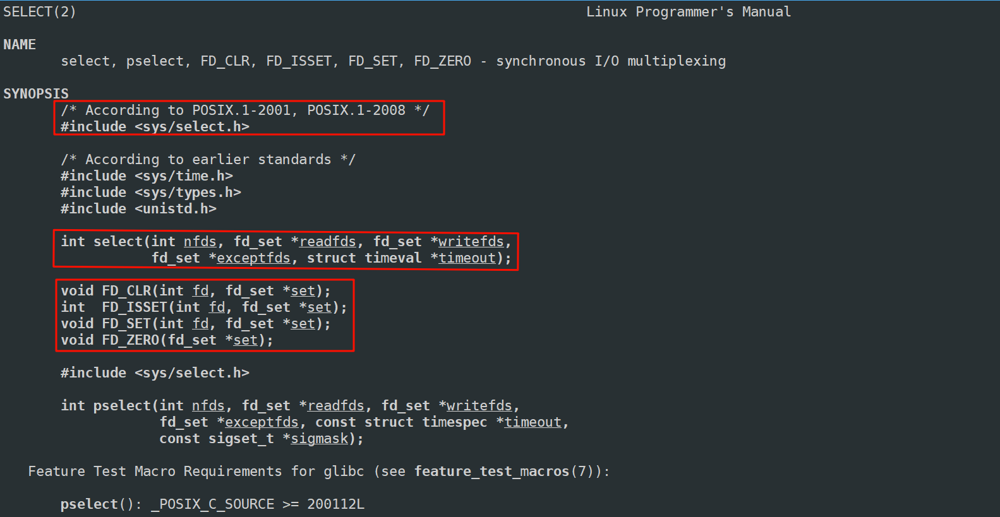

`nfds`：因为select可以一次等待多个文件描述符，而每一个文件描述符它的本质是数组下标，所以多个文件描述符它的数字大小肯定不一样，同时多个文件描述符也是不同整数构成的，它一定有最大一定有最小，而其中第一次参数表示，select要监视的多个fd中值最大的fd+1

> 如当前监视的是3、4、5、6，那个这个nfd就是6+1。
>

除了第一个参数，剩下的四个参数有一个共同特点，全都是**输入输出型参数**，也就是说未来是由我们传给select，传过去之后OS也要对传入的值做修改，然后输出给我们。

`timeout`：select一次等待多个fd，最后一个参数决定了，当select在等多个fd时它具体的等待方式是什么。

**timeout设置为nullptr：阻塞式**。也就是select一次等待多个fd，但没有任何一个fd就绪时，select只能在底层阻塞，这个调用就不返回，直到有任何一个就绪了。

`struct timeval`结构内第一个变量表示的是秒，第二个变量表示的是微秒。

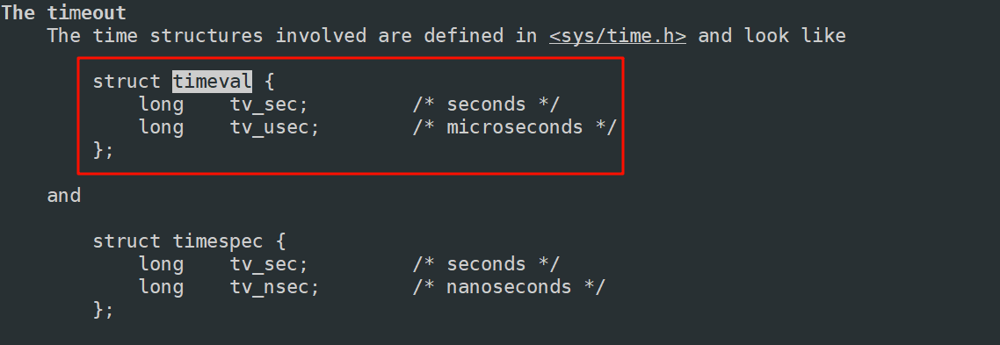

当用户调用select的时候，如果定义了一个`struct timeval timeout={0，0}`，传给最后一个参数，表示非阻塞。

也就是select一次等待多个fd，但没有任何一个fd就绪时，select立马返回。

例如：如果定义了一个`struct timeval timeout={5，0}`，传给最后一个参数。表示的是select的调用，5s以内阻塞式，超过5s非阻塞返回一次。假设5s内有任何一个fd就绪了select都可以立马返回。 然后这个参数会被设置成剩下的秒数。

返回值：  
ret > 0 表示有ret个fd就绪了。  
ret == 0 表示超时返回。假设设置时间是5s，5s内阻塞式不返回，超过5s没有一个就绪就是超时了。  
ret < 0 表示select调用失败了。比如你今天服务器打开3、4、5这三个描述符，你现在只有这三个fd是合法的，可是你非要把10或20也管理起来，10和20在进程根本没有被打开你还要交给select，那select当然就调用失败了。

失败返回-1，erron被设置。

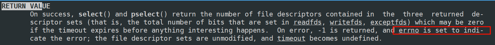

其实select中间三个参数是最重要的！下面介绍一下

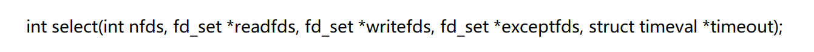

select在等什么呢？它在等文件描述符上的事件就绪！  
那是文件描述符上的什么事件就绪呢？  
通常一般分三类：

> 读事件就绪：表示这个文件描述符缓冲区有数据了，可以读了。  
写事件就绪：表示缓冲区内有空间了，可以写了。
>
> + 读写事件就绪我们统称为IO事件就绪
>
> 异常事件就绪：在进行读写时可能会发生各种意外，比如正在给对方写入对方把文件描述符关了，此时我正在向一个已经关闭的客户端写入，这个时候在写入时可能出现异常。
>

select未来关心的事情，只有三类：读，写，异常 —> 对于任何一个fd，都是这三种

所以这三个参数就分别对应就是让select关心的读，写，异常事件。  
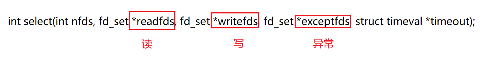

可是select不是可以同时管理多个fd的读、写、异常事件吗？  
可是现在select中除了第一个参数给我多个fd的感受，我们好像没有见到有多个fd。

我们可以看到这三个参数的类型是fd_set。  
它其实是一个位图结构，用来表示文件描述符集合。

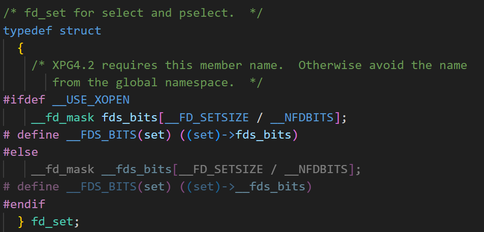

在信号的时候，有三种表pending表，block表，还有handler表，其中pending表，block表也就是位图结构。每个比特位表示不同的信号。

文件描述符是0、1、2等这样的数组下标，一：决定了大家都不同 ，二：大家会连续。所以我们采用位图结构表征各个文件描述符。位图结构一般实现都是采用结构体里面套数组完成。你想有多大位图自己设置就可以。

下面以读事件为例，写和异常完全一模一样！

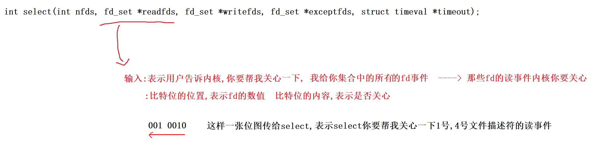

如果想让select关心写，在定义一个位图结构，把文件描述符设置进写集合里。关心异常也是同样做法。

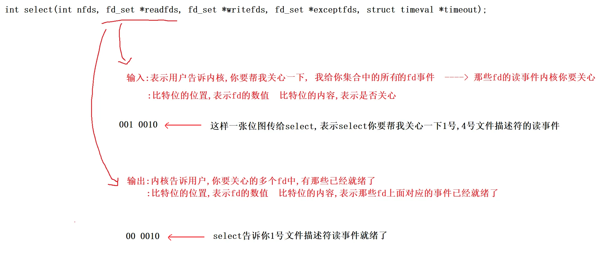

因为后面参数都是输入输出型参数，所以操作系统直接在你传的位图中做修改

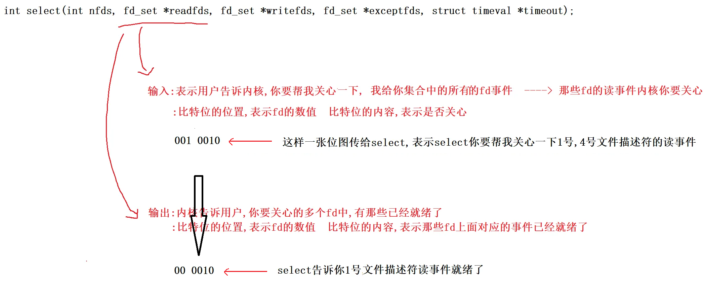

所以对同一个参数做修改，本质就是让用户和内核之间互相沟通，互相知晓对方要的或者关心关心的

因此读、写、异常这里操作都是一模一样的， 如果你想让select既关心一个文件描述符的读又关心写，那就定义两种位图，把在这个文件描述符分别添加到读文件描述符集，写文件描述符集。那OS就帮我同时关心该文件描述符的读和写了。

所以读、写、异常三个参数位置的不同表示用户和内核分别交互的不同事件。

参数细节现在就说完了。还有一个问题`fd_set`是一个位图，能之间对`fd_set`这个位图做任何修改吗？  
不可以，不建议！ 操作系统为了更好支持我们向位图里进行设置，查看位图等。系统给我们配了对应的位图操作接口。

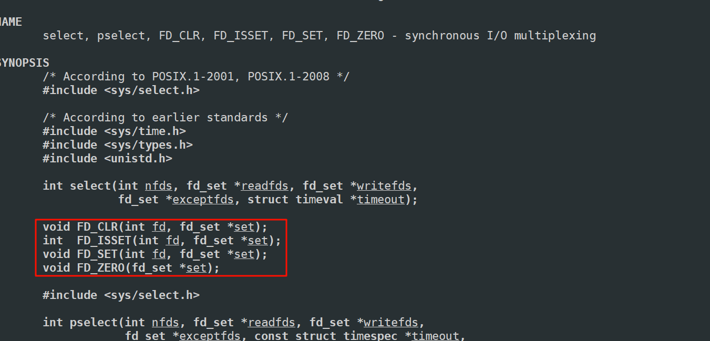

# select服务器
接下来我们写一个select服务器，这里我们先只处理读取，只获取数据。写入等到`epoll`哪里在处理，边写边介绍`select`服务器的更多细节。

select它是一个只做监听的只做IO中等待的系统调用接口，一旦有事件就绪了它会通知我，它一次可以等待多个文件描述符，可是目前我们面临的第一个尴尬问题是，你刚开始的服务器根本没有多个文件描述符，刚开始只有一个啊，而且还是_listensock套接字。可是我们也知道_listensock也是套接字，而后序所有多出来的套接字，本质上都是从_listensock上来的，所以select要监管多个套接字的话，首先要把_listensock监管起来！

因此_listensock首先要交给select，那我们要想清楚了，select有读事件，写事件，异常事件，并没有任何所谓的监听事件啊！但是没问题，能交给！_listensocket的连接就绪事件 == 读事件就绪，因为本质就是对方发的连接请求触发的三次握手，也属于客户端向服务器发信息，所以认为是读事件就绪！

这里也不应该_listensock套接字创建好了直接循环获取accept，因为accept函数自己通过_listensock套接字获取连接时，没有连接时accpet也在阻塞等。有连接了才能获取连接然后返回。所以**accpet = 等 + 获取**。这种写法是阻塞式写法，我们想用的是多路转接。

---

我们的想法是当底层连接就绪了，你来通知我，这个时候我在调用accept。 此时相当于让select帮我负责等，而accpet只负责获取连接不会被阻塞。

把timeout放入循环内部，保证每一次都对它重新设定。  
这样就是没有任何事件就绪时，每隔3秒非阻塞返回一次。同样也可以把timeout改成0，此时就是非阻塞了。

```cpp
void Run()
{
    for(;;)
    {
        struct timeval timeout = {3, 0}; // 设置超时时间
        fd_set rfds;
        FD_ZERO(&rfds);  // 清0
        FD_SET(_listensock->SockFd(), &rfds); // 设置
        int n = select(_listensock->SockFd() + 1, &rfds, nullptr, nullptr, &timeout);
        switch (n)
        {
        case 0:
            LOG(LogLevel::DEBUG) << "timeout...: " << timeout.tv_sec << ": " << timeout.tv_usec;
            break;
        case -1:
            LOG(LogLevel::ERROR) << "select error";
            break;
        default:
            break;
        }
    }
}
```

3s内阻塞，超过3s非阻塞返回一次。  
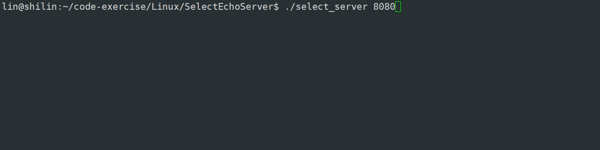

下面改一点代码，然后用telnet连接一下这个服务器，看一下。

也可以不要timeout直接把最后一个参数设为nullptr，此时就是阻塞了。

```cpp
void Run()
{
    for(;;)
    {
        struct timeval timeout = {3, 0}; // 设置超时时间
        fd_set rfds;
        FD_ZERO(&rfds);  // 清0
        FD_SET(_listensock->SockFd(), &rfds); // 设置
        // int maxfd = gdefault;
        int n = select(_listensock->SockFd() + 1, &rfds, nullptr, nullptr, nullptr/*&timeout*/);
        switch (n)
        {
        case 0:
            LOG(LogLevel::DEBUG) << "timeout...: " << timeout.tv_sec << ": " << timeout.tv_usec;
            break;
        case -1:
            LOG(LogLevel::ERROR) << "select error";
            break;
        default:
            LOG(LogLevel::INFO) << "get a new link...";
            break;
        }
    }
}
```

我们看到一直在打印get a new link… 日志在一直打说明我们当前循环的时候select一直在循环。不是只有一个连接吗？怎么会给我这么多就绪消息。

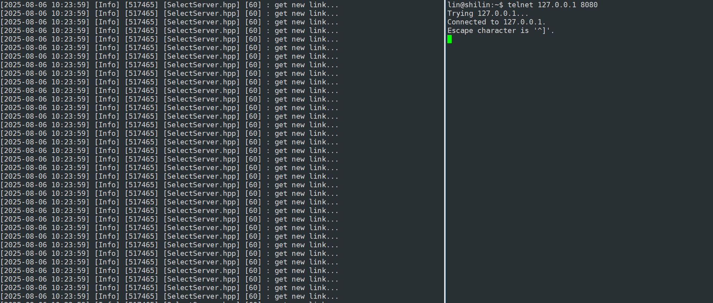

原因在于我们并没有把底层的连接取走，所以每一次调用select我们对应的_listensock套接字上面的事件都是就绪的，所以每一次都添加关心的都是_listensock套接字，所以select每一次都帮我们检测连接_listensock套接字有没有就绪。

为什么客户端关闭了，服务器还在疯狂打印呢？

因为连接建立成功后，断开连接是双方的事。服务器连连接都没拿上去也就没有办法断开因为没有调用close。所以依旧告诉连接就绪。

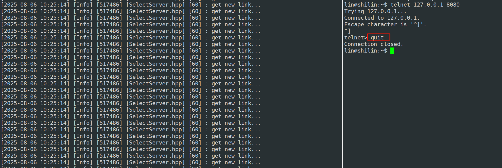

所以我们发现select果然是有把连接就绪事件告诉我们的能力了，然后我们也通过select监听到有连接事件到来了，因此我们还要获取对应连接。连接就绪事件是被放在我们传给select的`rfds`里。输入时是用户告诉内核你要帮我关心该文件描述符集中那些fd的读事件，输出时内核告诉用户该文件描述符集中那些fd读就绪了。

```cpp
void HandleEvents(fd_set &rfds)
{
    LOG(LogLevel::INFO) << "fd就绪,有新事件到来";
    if(FD_ISSET(_listensock->SockFd(), &rfds))
    {
        InetAddr clientadddr;
        int sockfd = _listensock->Accept(&clientadddr);
        if(sockfd > 0)
        {
            LOG(LogLevel::INFO) << "get new sockfd: " << sockfd << ", client addr: " << clientadddr.ToString();
        }
    }
}

void Run()
{
    for(;;)
    {
        struct timeval timeout = {3, 0}; // 设置超时时间
        fd_set rfds;
        FD_ZERO(&rfds);  // 清0
        FD_SET(_listensock->SockFd(), &rfds); // 设置
        // int maxfd = gdefault;
        int n = select(_listensock->SockFd() + 1, &rfds, nullptr, nullptr, nullptr/*&timeout*/);
        switch (n)
        {
        case 0:
            LOG(LogLevel::DEBUG) << "timeout...: " << timeout.tv_sec << ": " << timeout.tv_usec;
            break;
        case -1:
            LOG(LogLevel::ERROR) << "select error";
            break;
        default:
            // 一定有事件就绪了, 就绪事件，派发到不同的处理模块
            // EventDispatcher(rfds);
            HandleEvents(rfds);
            break;
        }
    }
}
```

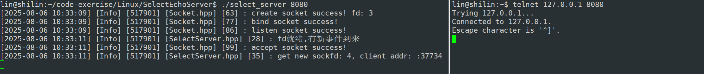  
这一次我们把连接拿上来，所以在select就没有新连接了。也就不会疯狂打印get a new link…

不过还有问题，走到这里accpet函数，会不会被阻塞？  
不会！因为走到这里，_listensock已经是就绪的了。accpet直接读取绝对是有返回的。

---

得到一个sock套接字后，然后我们可以直接进行read/recv吗？  
显然不能！你直接调用read/recv你就能保证底层有数据吗？不能！建立好连接就是不给你发数据，因为我们是单进程你直接调用read/recv就直接阻塞挂起了。根本原因就是你根本不清楚对应sock读事件是否就绪。 一调可能就阻塞，你不清楚那谁清楚？整个代码只有select有资格检测事件是否就绪

所以接下来并不是立马读取，而是将新的sock托管给select！ 让select帮我关心这个sock有没有事件就绪。

---

现在问题是，你怎么把这个sock托管给select？

一般而言编写select服务器，要使用select，需要程序员自己维护一个保存合法fd的数组!

首先套接字会越来越多，你怎么知道这么多fd那些fd是合法的那些是非法的。其次rfds这个参数是输入输出型的，你可能曾经设置过5个fd，可能循环一次这些fd全都被清空了，那你怎么知道历史上还有那些fd，最后这么多fd你怎么保证更新出来的fd最大值是谁！

所以我们得自己维护一个合法fd数组

然后在初始服务时，这个数组给多大呢？

我们未来保存所有文件描述符的类型是fd_set，这是Linux内核给我们提供的自定义类型，既然是一种类型，它必有大小，而且大小是固定的！  
所以，我们能够添加的fd的个数一定是有上限的！  
经过验证大小是128

不过这里sizeof求得是字节，但fd_set是一个位图结构，因此还有乘8才是真实大小。

得出：1024，也就是说select服务器能够处理得文件描述符上限是1024个

所以new数组大小就是1024！

---

然后在服务器启动之前，未来所有合法fd都在这个数组里面，未来要重新设置要关心的读文件描述符集，更新最大值都在这个数组找，这就决定了，在刚开始的时候首先最开始只有一个_listensock套接字先设置进数组。

```cpp
SelectServer(uint16_t port) 
    : _listensock(std::make_unique<TcpSocket>())
{
    _listensock->BuildListenSocketMethod(port);
    for(int i = 0; i < gsize; i++)
    {
        _fd_array[i] = gdefaultfd;
    }
    _fd_array[0] = _listensock->SockFd();
}
```

然后启动服务器，每一次select之前都要在数组内找到合法fd最大值是多少，并且将数组中所有合法fd重新设置到读文件描述符集

```cpp
void Run()
{
    for(;;)
    {
        struct timeval timeout = {3, 0}; // 设置超时时间
        fd_set rfds;
        FD_ZERO(&rfds);  // 清0
        FD_SET(_listensock->SockFd(), &rfds); // 设置
        int maxfd = gdefaultfd;
        for(int i = 0; i < gsize; i++)
        {
            if(_fd_array[i] == gdefaultfd)
                continue;
            FD_SET(_fd_array[i], &rfds);
            maxfd = std::max(maxfd, _fd_array[i]);
            LOG(LogLevel::DEBUG) << " 添加fd: " << _fd_array[i];
        }

        int n = select(maxfd + 1, &rfds, nullptr, nullptr, nullptr/*&timeout*/);
        switch (n)
        {
        case 0:
            LOG(LogLevel::DEBUG) << "timeout...: " << timeout.tv_sec << ": " << timeout.tv_usec;
            break;
        case -1:
            LOG(LogLevel::ERROR) << "select error";
            break;
        default:
            // 一定有事件就绪了, 就绪事件，派发到不同的处理模块
            HandleEvents(rfds);
            break;
        }
    }
}
```

接下来继续之前未完的事情，accpet获取新的sock，将新的sock，托管给select！  
将新的sock，托管给select的本质，其实就是将sock，添加到fdarray数组里！

```cpp
void HandleEvents(fd_set &rfds)
{
    LOG(LogLevel::INFO) << "fd就绪,有新事件到来";
    if (FD_ISSET(_listensock->SockFd(), &rfds))
    {
        InetAddr clientadddr;
        int sockfd = _listensock->Accept(&clientadddr);
        if (sockfd > 0)
        {
            LOG(LogLevel::INFO) << "get new sockfd: " << sockfd << ", client addr: " << clientadddr.ToString();
            // 不可以直接recv/read
            // 将新的sock托管给select
            int pos = 0;
            for (; pos < gsize; pos++)
            {
                if (_fd_array[pos] == gdefaultfd)
                {
                    _fd_array[pos] = sockfd;
                    break;
                }
            }
            // 已经满了
            if (pos == gsize)
            {
                LOG(LogLevel::WARNING) << "server is full!";
                close(sockfd);
            }
        }
    }
}
```

测试：

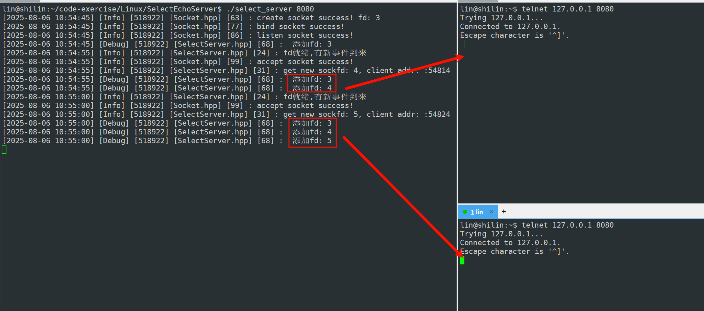

所以随着连接增多，对应的合法fd全部都会添加到_fdarray数组中，然后处理完就绪事件之后，每次在调用select之前都会把_fdarray中合法fd添加到rfds，找到合法fd最大值，一起交给select。

可是随着数组中合法fd越来越多，select帮我们监管的fd也越来越多了，那么事件的总类也变得越来越多了，不过我们目前只处理读事件。并且我们处理读事件函数中也只写了一个_listensock套接字获取accpet获取连接。这是不够的，我们还需要考虑处理正常的IO。

```cpp
void Accepter()
{
    InetAddr clientadddr;
    int sockfd = _listensock->Accept(&clientadddr);
    if (sockfd > 0)
    {
        LOG(LogLevel::INFO) << "get new sockfd: " << sockfd << ", client addr: " << clientadddr.ToString();
        // 不可以直接recv/read
        // 将新的sock托管给select
        int pos = 0;
        for (; pos < gsize; pos++)
        {
            if (_fd_array[pos] == gdefaultfd)
            {
                _fd_array[pos] = sockfd;
                break;
            }
        }
        // 已经满了
        if (pos == gsize)
        {
            LOG(LogLevel::WARNING) << "server is full!";
            close(sockfd);
        }
    }
}

void EventDispatcher(fd_set &rfds)
{
    LOG(LogLevel::INFO) << "fd就绪,有新事件到来";
    for (int i = 0; i < gsize; i++)
    {
        if (_fd_array[i] == gdefaultfd)
            continue;
        // 读事件就绪
        if (FD_ISSET(_fd_array[i], &rfds))
        {
            if (_fd_array[i] == _listensock->SockFd())
                Accepter();
            else
                Recver(i);
        }
        // else if(FD_ISSET(fd_array[i], &wrfds)) // 写事件就绪
        // {

        // }
    }
}
```

接下来处理正常IO

```cpp
void Recver(int index)
{
    int sockfd = _fd_array[index];
    char buffer[1024];

    ssize_t n = recv(sockfd, buffer, sizeof buffer, 0);
    if(n > 0)
    {
        buffer[n] = 0;
        std::cout << "client say@ " << buffer << std::endl;
        std::string echo_string = "server echo# ";
        echo_string += buffer;
        send(sockfd, echo_string.c_str(), echo_string.size(), 0);
    }
    else if(n == 0)
    {
        LOG(LogLevel::INFO) << "client quit, me too: " << _fd_array[index];
        _fd_array[index] = gdefaultfd;
        close(sockfd);
    }
    else
    {
        LOG(LogLevel::WARNING) << "recv error: " << _fd_array[index];
        _fd_array[index] = gdefaultfd;
        close(sockfd);
    }
}
```

走到了recv会不会阻塞？

不会被阻塞！走到这里一定是sock读事件已经就绪了。其次这里不仅仅处理一个sock，可能多个sock都会进来，所以就一个栈上的缓存区去读取绝对是有问题的，其次你怎么保证数据一次就读完了呢？没有读完是不是要循环读取，但是你怎么保证在读的时候不会被阻塞呢？并且读完了就是一个完整的请求了吗？然后反序列化等等，这些问题我们都在epoll哪里处理！

全部代码：

## SelectServer.hpp
```cpp
#ifndef SELECT_SERVER
#define SELECT_SERVER

#include <algorithm>
#include "Socket.hpp"

const static int gsize = sizeof(fd_set) * 8;
const static int gdefaultfd = -1;

class SelectServer
{
public:
    SelectServer(uint16_t port)
        : _listensock(std::make_unique<TcpSocket>())
    {
        _listensock->BuildListenSocketMethod(port);
        for (int i = 0; i < gsize; i++)
        {
            _fd_array[i] = gdefaultfd;
        }
        _fd_array[0] = _listensock->SockFd();
    }

    void Accepter()
    {
        InetAddr clientadddr;
        int sockfd = _listensock->Accept(&clientadddr);
        if (sockfd > 0)
        {
            LOG(LogLevel::INFO) << "get new sockfd: " << sockfd << ", client addr: " << clientadddr.ToString();
            // 不可以直接recv/read
            // 将新的sock托管给select
            int pos = 0;
            for (; pos < gsize; pos++)
            {
                if (_fd_array[pos] == gdefaultfd)
                {
                    _fd_array[pos] = sockfd;
                    break;
                }
            }
            // 已经满了
            if (pos == gsize)
            {
                LOG(LogLevel::WARNING) << "server is full!";
                close(sockfd);
            }
        }
    }

    void Recver(int index)
    {
        int sockfd = _fd_array[index];
        char buffer[1024];

        ssize_t n = recv(sockfd, buffer, sizeof buffer, 0);
        if(n > 0)
        {
            buffer[n] = 0;
            std::cout << "client say@ " << buffer << std::endl;
            std::string echo_string = "server echo# ";
            echo_string += buffer;
            send(sockfd, echo_string.c_str(), echo_string.size(), 0);
        }
        else if(n == 0)
        {
            LOG(LogLevel::INFO) << "client quit, me too: " << _fd_array[index];
            _fd_array[index] = gdefaultfd;
            close(sockfd);
        }
        else
        {
            LOG(LogLevel::WARNING) << "recv error: " << _fd_array[index];
            _fd_array[index] = gdefaultfd;
            close(sockfd);
        }
    }

    void EventDispatcher(fd_set &rfds)
    {
        LOG(LogLevel::INFO) << "fd就绪,有新事件到来";
        for (int i = 0; i < gsize; i++)
        {
            if (_fd_array[i] == gdefaultfd)
                continue;
            // 读事件就绪
            if (FD_ISSET(_fd_array[i], &rfds))
            {
                if (_fd_array[i] == _listensock->SockFd())
                    Accepter(); // 连接管理器
                else
                    Recver(i); // IO处理器
            }
            // else if(FD_ISSET(fd_array[i], &wrfds)) // 写事件就绪
            // {

            // }
        }
    }

    void Run()
    {
        for (;;)
        {
            struct timeval timeout = {3, 0}; // 设置超时时间
            fd_set rfds;
            FD_ZERO(&rfds);                       // 清0
            FD_SET(_listensock->SockFd(), &rfds); // 设置
            int maxfd = gdefaultfd;
            for (int i = 0; i < gsize; i++)
            {
                if (_fd_array[i] == gdefaultfd)
                    continue;
                FD_SET(_fd_array[i], &rfds);
                maxfd = std::max(maxfd, _fd_array[i]);
                LOG(LogLevel::DEBUG) << " 添加fd: " << _fd_array[i];
            }
            // 就绪事件通知机制
            int n = select(maxfd + 1, &rfds, nullptr, nullptr, nullptr /*&timeout*/);
            switch (n)
            {
            case 0:
                LOG(LogLevel::DEBUG) << "timeout...: " << timeout.tv_sec << ": " << timeout.tv_usec;
                break;
            case -1:
                LOG(LogLevel::ERROR) << "select error";
                break;
            default:
                // 一定有事件就绪了, 就绪事件，派发到不同的处理模块
                EventDispatcher(rfds);
                break;
            }
        }
    }

    ~SelectServer() {}

private:
    std::unique_ptr<Socket> _listensock;
    int _fd_array[gsize];
};
#endif
```

socket.hpp需要修改一下，暴露fd

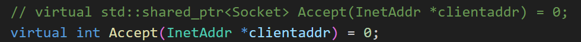

## Main.cc
```cpp
#include <iostream>
#include <memory>
#include "SelectServer.hpp"


void Usage(std::string proc)
{
    std::cerr << "Usage: " << proc << " localport" << std::endl;
}


int main(int argc, char *argv[])
{
    if (argc != 2)
    {
        Usage(argv[0]);
        exit(0);
    }
    uint16_t serverport = std::stoi(argv[1]);

    std::unique_ptr<SelectServer> selectsvr =  std::make_unique<SelectServer>(serverport);
    selectsvr->Run();

    return 0;
}
```

# select特点及优缺点总结
select能同时等待的文件fd是有上限的，除非重新改内核，否则无法解决

必须借助第三方数组，来维护合法的fd

select的大部分参数都是输入输出型的，调用select前，要重新设置所有的fd，调用之后，我们还要更新所有的fd，这带来的就是遍历的成本 — (用户层面)

select为什么第一个参数是最大fd+1呢？  
因为select要等待多个文件描述符， 它怎么知道要等那些文件描述符那些事件呢？怎么知道给你返回那个文件描述符的事件就绪了？所以它要去查，它既然要查，就要去限定它去查的范围，因为文件描述符就是一个个数组下标，我有多个文件描述符表，要遍历到哪里呢？所以就有了最大值fd+1！ 确定遍历范围 —>(内核层面)

select 采用位图，用户->内核，内核->用户，来回的进行数据拷贝，有拷贝成本的问题

因为select有如此之多的问题，select接口使用不方便，每次还要重新手动设置等等。。所以我们要有一种新的解决方案，这种方案就是多种转接之epoll。不过在此之前先了解多种转接之poll。

