# IP协议
前面我们简单说了IP地址的核心作用，我们是这样说的：IP地址具有将数据从主机A跨网络送到主机D的能力。有这个能力并不代表100%能做到。必须由上层TCP来提供策略支持，丢了怎么办、网络出现问题怎么办等等。IP的能力体现在它有非常大的概率。

那IP地址具有将数据从主机A跨网络送到主机D的能力，它是怎么做到的呢？

下面先简单了解一下，随着我们的学习逐渐加深理解。

数据是从主机A经过**目的IP进行路径选择**，然后到路由器A，再由路由器A拿着目的IP进行路径选择，到路由器E、G、H、J(每个路由器都会同样的事情)，最终到主机D。

那为什么主机A为什么会选择这样一条路径，而不选择其他路径(去主机C)呢？  
这完全取决于数据要去的是主机D。那不是还有其他路径可以去主机D吗怎么不选，它虽然有多种不同走法，但本质原因还是要去主机D，其他原因可能是路径最短等等。

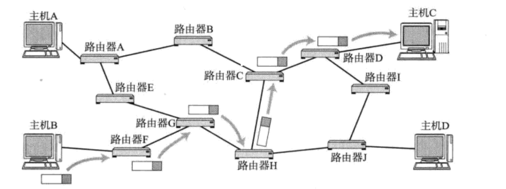  
所以：

1. 路径选择中，目标IP非常重要，决定了我们的路径该如何走。
2. IP = 目标网络 + 目标主机

就比如说你要从北京到杭州玩，你确定你要去地方叫杭州吗？  
其实你真的要玩地方并不是杭州，而是杭州里面具体一个玩的景点，比如说西湖。所以你真正想去的对方是西湖，只不过是先去杭州，然后才能去西湖。所以杭州西湖是我们目的IP，杭州这座城市叫做目标网络，西湖叫做该目标网络里面的一台主机。所以在进行路径选择时，我们先找到目标网络然后在目标网络内找到对应的主机。

# 协议头格式
16位标识，3位标志，13位片偏移我们暂且不谈，等到我们把IP协议整体知识框架搭建起来我们在谈。  
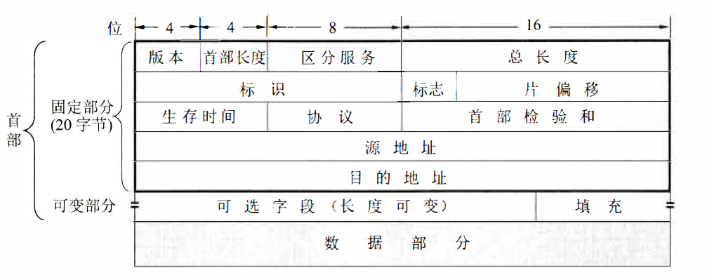 
学任何一个协议前，我们都要先谈两个问题：

1. 如何将报头和有效载荷分离？
2. 如何交付？

IP报头是到选项的，但是选项我们不关心。IP报头的标准长度是20字节。数据就是有效载荷，它是由上层TCP交付过来的包括TCP报头和有效载荷(应用层交付来的)。

**如何将报头和有效载荷分离？**

**4位首部长度**：表示IP报头总长度，基本单位也是4字节。(IP和TCP是非常像的)。取值范围 【0，60】 ，但标准长度是20字节，因此最终取值【20，60】

**16位总长度**：IP报文整体长度。

**报头和有效载荷分离**：16位总长度 - 4位首部长度 = 有效载荷长度

为什么IP这里有16位总长度，按照`tcp`那样只要知道4位首部长度然后把报头去掉，不一样就分离了吗？  
其一，你如何保证将IP报文收完整了。其二，IP报文它是一个个独立的报文，又没有说它是字节流。从概念上看它是报文它就要有报头长度和有效载荷长度。

**如何交付？**

**8位协议**：表示上层协议的类型。发送的时候就有上层告诉IP它用的协议类型，然后IP填上对应编号。然后根据这个字段交给上层对应协议。

**16位头部校验和**：使用CRC进行校验，来鉴别头部是否损坏，损坏直接丢弃，然后TCP知道后进行超时重传。

**8位生存时间(Time To Live, TTL)**： 数据报到达目的地的最大报文跳数。一般是64。每次经过一个路由，TTL -= 1，一直减到0还没到达，那么就丢弃了(路由器做这个事情)。 这个字段主要是用来防止出现路由循环(避免浪费网络资源)。

**32位源IP地址和32位目的IP地址**：表征IP报文从那来到那去。目的IP是最重要的，这样路上的路由器从IP报文找到目的IP然后在进行路由最终把该报文送到目标主机。

**4位版本号(version)**: 指定IP协议的版本，对于IPv4来说， 就是4。IPv6与IPv4并不兼容没有办法进行平替。这里是固定写法。

**8位服务类型(Type Of Service)**： 3位优先权字段(已经弃用)， 4位TOS字段，和1位保留字段(必须置为0)。 4位TOS分别表示: 最小延时、最大吞吐量、最高可靠性、 最小成本。 这四者相互冲突， 只能选择一个。 比如我们数据包转发时带上四者其中之一的服务，然后就决定数据包在路上进行路径选择经常说的最优路径，最优路径的标准是最小成本，还是最高可靠性等，这个字段给最优路径下了一个定义，未来路由器进行路由的时候根据它的类型来定制自己的转发策略。

# 网络划分(重要)
下面结合一个故事理解，网络划分是什么？为什么要网络划分？网络划分怎么做？

# 为什么要网络划分
每个学校都有很多学院如计算机学院、理学院、化工学院、机械学院、电子信息工程学院等等，每个学生也都有自己的学号，这个学号其实是经过精心设置的。这里我们简化一下把学号分成学院号+自己所在院系内的编号。每个学院也都有自己的编号。学号共8个比特位代替一下，前三个比特位是学院号后面5个比特位是自己的编号。  
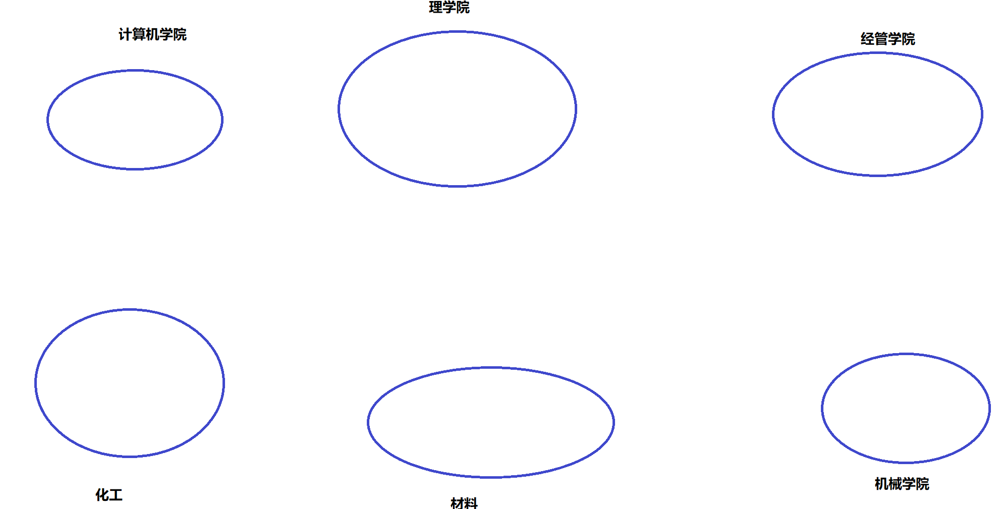

每一个学院都有自己院学生会主席并且他还是院群里面的群主，而且他也有属于自己的学号。并且这个学号在全校范围内唯一。每个院学生会主席都还要在加一个校学生会主席群。  
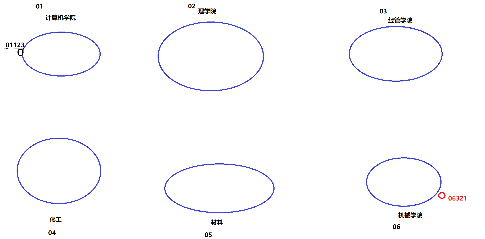

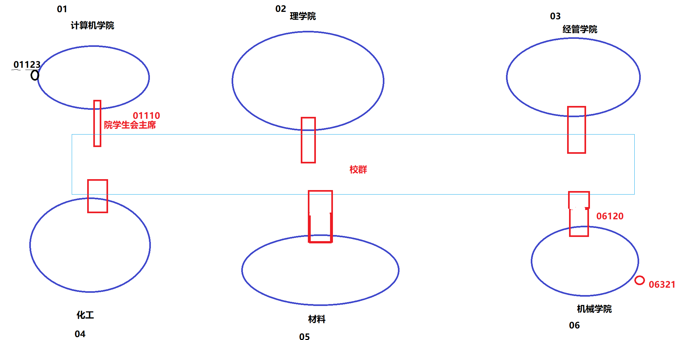

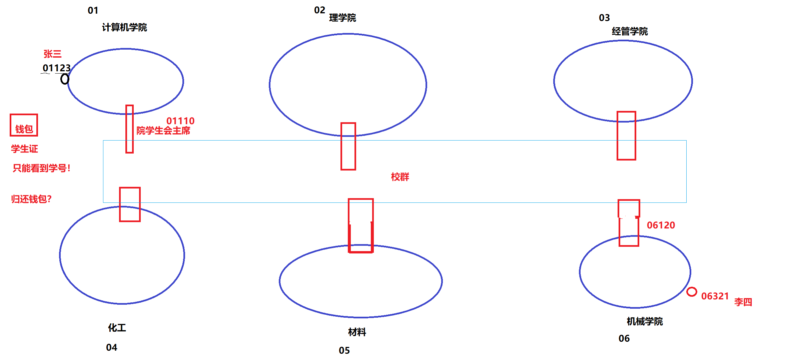

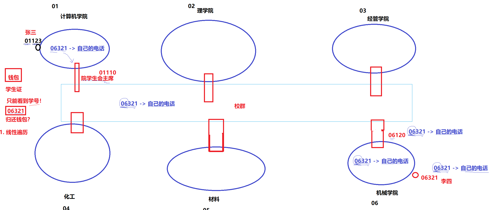  
假设今天电子信息工程学院的一名普通学生李四同学把自己学生证丢了，学生证上面其他信息都模糊看不清了，只有学号(101 00101)可以看得清。然后计算机学院张三同学(学号：000 01001)在校园内捡到这个学生证。张三同学就想把学生证归还给该同学，但这个学生证只有学号看的请。可是张三除了自己院学生号清楚并不清楚其他院的学号。摆在张三前面有两种方法。他知道学号在全校范围内唯一，他要找这个人，因此张三就在食堂门口抓住一个人就问同学你的学号，学号不匹配就让这个人去吃饭，然后张三抓别人又问，最好有可能张三都毕业了都还没有找到这个人，因为张三在查找的时候让别人报学号，本质是在做排除。**查找本质是在做排除**。学号不对就是把这个人去掉。这种一次查找一个人效率太低了。聪明的张三打算不要这种方法。

张三他知道这个学生卡不是他的学院的。如果是他院里面的他直接把学生卡发到群聊问是谁的。于是他把这张学习卡拍张照片放到院群里@一下院学生会主席王五，他知道王五可以对接外部。并且王五作为院学生会主席他一定知道这个学生卡是其他那个院系的。王五一看就知道是电子信息工程的学生，于是把这条消息转到校学生会@电子信息学院学生会主席赵六，赵六收到信息一看就知道学号(101 00101)就知道是他们院里面的李四学生，于是赵六就@李四。李四就知道他的学生卡找到了。至此就完成了一次把学生卡归还给某个人的事情。

为什么第二种方法这么快？  
网络通信本质是把数据交给目标主机。  
张三：源主机  
李四：目表主机  
院学生会主席：路由器  
院内的群：局域网  
校学生会群：公网

---

计算机学院主席王五在校学生会群@电子工程学院主席赵六不就是在排除其他学院而选择了他吗，所以查找的本质就是在做排除。张三以前一个个找一次排除一个，而第二种方法一次排除一群。效率更高。

整个学校有2w人，每个学生都有自己的学号---->(IP)，每个学生归类到每个学院。方便快速查找。

**所以，互联网中的每一台主机，都要隶属于某一个子网！** -----> 为了方便定位这个主机！ ----> 效率高 ----> 排除效率高(查找效率高)

所以全球所有主机或者网络在规划的时候都要进行**子网划分**！！

以上是为什么要有子网划分，以及最开始前面说的IP =目标网络+目标主机的原因。

# 网络划分怎么做？
**如何理解网络划分？**

首先我们的IP地址有32位，互联网是一个被设计过的世界！  
我们国家像刚才的网络拓扑结构是谁做的呢?  
运营商！联通、电信、移动。

比如我们经常刷抖音、聊微信等等为什么每到月底我们不给这些公司交钱，而给运营商交钱呢？因为三大运营商是我国底层网络的设计者。

我们所有网络请求是先交给运营商的，在由运营商再把请求报文交给互联网公司。

如果把全球想象成学校，其实我们是可以按地址把IP地址的分类情况划分给不同国家。(真实按照人口和接入网络的设备进行划分，这里主要是为了表述)，所以说每个国家在进行网络划分的时候是已经被设计过的，比如说IP地址32位，我们商量用前8个比特数表示不同的国家。并且每个国家都有自己的国际路由器。美国人想给俄罗斯人发信息，源地址一定是0.X.Y.Z 目的地址是1.X.Y.Z。发现不是自己国家的经过国际路由器转给俄罗斯。

---

比如我国是以2开头的，2.X.Y.Z，然后在拿8个比特位划分表示不同的省份，然后给这些省份之间拉个群然后就可以跨省了。然后再拿比特位进行划市等等。这样就能进行省市区等等之间的转发了

---

这里主要想说的是，我们对应的互联网所有的IP地址的划分都是进行设计过的。

这里为什么粗粒度说说这个呢？  
主要想说的是，我们要有一个完整的概念，不要认为IP地址网段划分，还有刚才说的为什么子网划分，等会说怎么做到的就简单理解子网掩码，不要这样去理解。而是要宏观理解从全球到中国，从中国到地区。那个学校的图可以理解成全球之间，也而可以理解成省与省之间，也可以理解成省内市与市之间，换言之我们IP地址的划分的时候是被拆分成了不同区域。用不同比特位表示不同区域。这个IP地址也就像刚才的学号。

真正IP地址划分非常复杂，我们也知道IP地址不够，不过思想是一样的思想。但方案不是这样简单粗暴。

上面这些都属于理念版的网洛划分，下面我们具体学习是如何进行网络划分的。

我们要知道，一旦把全网的网段划分好，任何一台主机一定隶属于具体某一个网段。未来找的时候必须得先找到这台主机对应的网段，然后在这个网段内在找这台主机。所以IP = 目标网络 + 目标主机号

IP地址分为两个部分, 网络号和主机号

+ 网络号: 保证相互连接的两个网段具有不同的标识;
+ 主机号: 同一网段内, 主机之间具有相同的网络号, 但是必须有不同的主机号;  
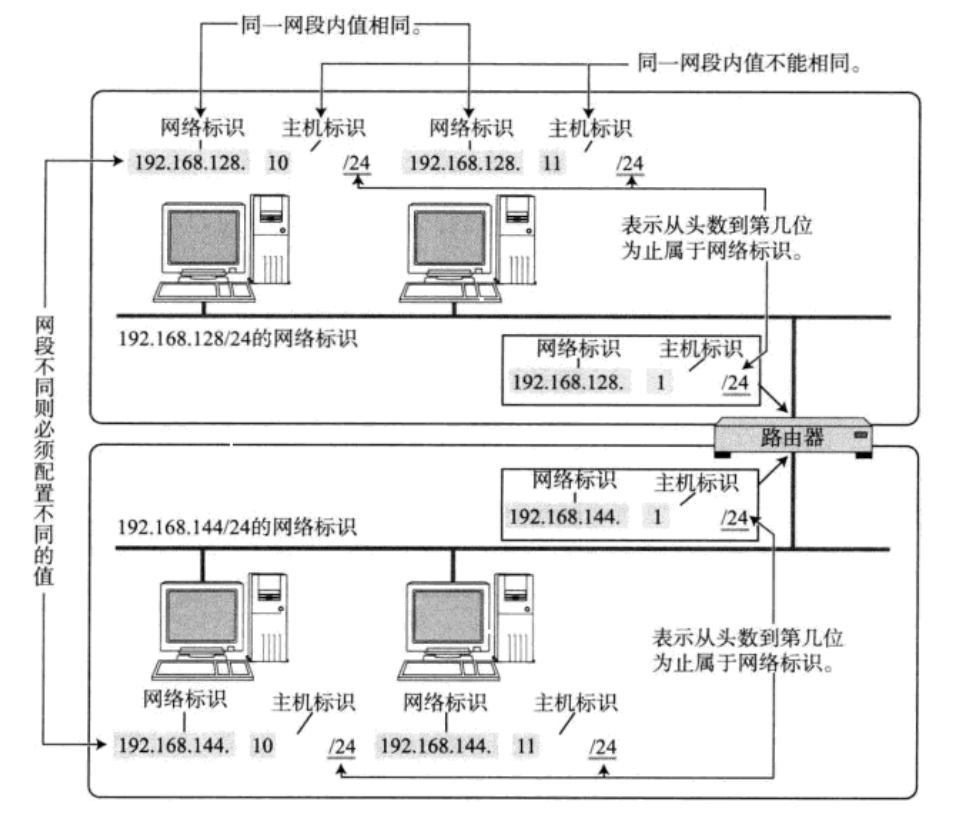

由上图可以发现，两个不同的网端之间是相连的，如果它们之间要进行数据包转发，必须要经过路由器，也就意味着路由器这种设备必要至少桥接两个子网。这个路由器既属于网段1又属于网段2。但路由器也是一台主机啊，所以它在网段1和网段2当中各自都要有自己的IP地址。一般路由器的IP通常是网络标识.1。

+ 不同的子网其实就是把网络号相同的主机放到一起(形成子网或者局域网).
+ 如果在子网中新增一台主机, 则这台主机的网络号和这个子网的网络号一致, 但是主机号必须不能和子网中的其他主机重复.

通过合理设置主机号和网络号, 就可以保证在相互连接的网络中, 每台主机的IP地址都不相同.

那么问题来了, 手动管理子网内的IP, 是一个相当麻烦的事情.比如说子网内一个主机走了或者主机来了,增删改对应的主机时候,就可能需要对子网内的IP地址进行管理,这个管理工作是谁做的呢？  
**一般在一个子网中，管理子网中IP的设备通常是路由器**

+ 有一种技术叫做**DHCP**, 能够自动的给子网内新增主机节点分配IP地址, 避免了手动管理IP的不便.
+ 一般的路由器都带有DHCP功能. 因此路由器也可以看做一个DHCP服务器.

DHCP其实是一种负责网络,IP地址申请释放规划的自动化服务.  
所以这也是我们电脑上网的时候要先连路由器,原因是我们要先获取IP地址.  
然后才能上网.

过去曾经提出一种划分网络号和主机号的方案, 把所有IP 地址分为五类, 如下图所示(该图出 自[TCPIP])。  
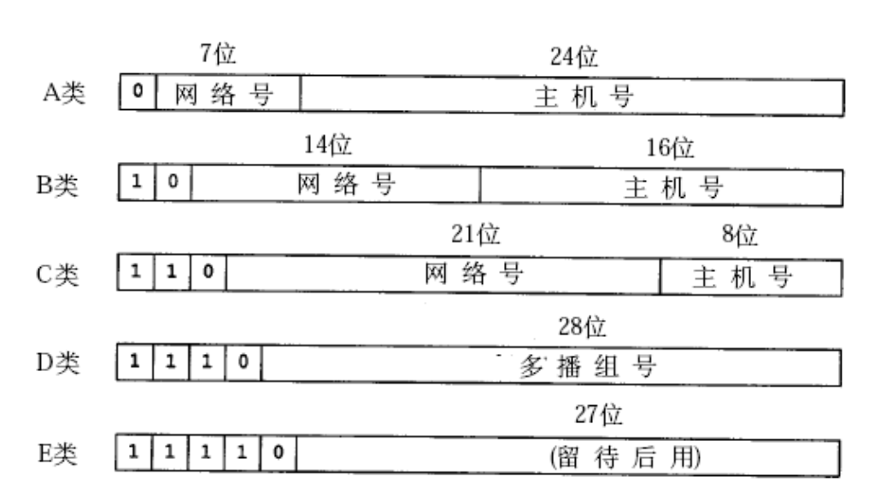

+ A类 0.0.0.0到127.255.255.255
+ B类 128.0.0.0到191.255.255.255
+ C类 192.0.0.0到223.255.255.255
+ D类 224.0.0.0到239.255.255.255
+ E类 240.0.0.0到247.255.255.255

随着Internet的飞速发展,这种划分方案的局限性很快显现出来,大多数组织都申请B类网络地址, 导致B类地址很快就分配完了, 而A类却浪费了大量地址;

+ 例如, 申请了一个B类地址, 理论上一个子网内能允许6万5千多个主机. A类地址的子网内的主机数更多.
+ 然而实际网络架设中, 不会存在一个子网内有这么多的情况. 因此大量的IP地址都被浪费掉了.

针对这种情况提出了新的划分方案, 称为**CIDR**(Classless Interdomain Routing):

+ 引入一个额外的子网掩码(subnet mask)来区分网络号和主机号;
+ 子网掩码也是一个32位的正整数. 通常用一串 “0” 来结尾;
+ **将IP地址和子网掩码进行 “按位与” 操作, 得到的结果就是网络号**;
+ 网络号和主机号的划分与这个IP地址是A类、B类还是C类无关;

未来在进行子网划分的时候我们只需要调整子网掩码中从最左侧开始1的个数就可以很方便的对IP地址进行比特位级别的子网划分.

那这个子网掩码在哪呢?  
刚才说了管理子网是路由器管理的.所以**目标网络和子网掩码,子网中的主机,都会被路由器管理!**  
其实**目标网络和子网掩码其实是在路由器内配置的!**

下面看划分子网的例子  
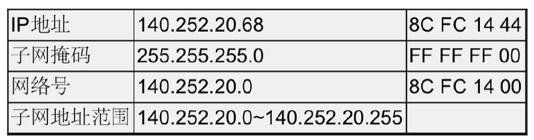  
IP与子网掩码按位与得到网络号，这个网络里中所能容纳主机所对应的IP范围就是子网地址的范围。主机号是全0到全1之间。子网中全0不被使用它代表网络号，全1也不被使用代表广播地址。

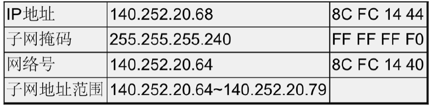  
子网掩码规定前面多少位是网络号 ，所以剩下我们能动得是主机号。  
225.225.255.240前面28位是网络号，后面4位是主机号，其中还要把全1的主机号去掉，剩下的才是能用的主机号。  
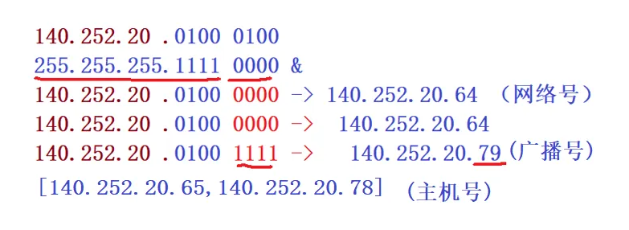

# 特殊的IP地址
+ 将IP地址中的主机地址全部设为0, 就成为了网络号, 代表这个局域网;
+ 将IP地址中的主机地址全部设为1, 就成为了广播地址, 用于给同一个链路中相互连接的所有主机发送数据包;
+ 127.*的IP地址用于本机环回(loop back)测试,通常是127.0.0.1

# IP地址的数量限制
我们知道, IP地址(IPv4)是一个4字节32位的正整数. 那么一共只有2的32次方个IP地址, 大概是43亿左右，而TCP/IP协议规定, 每个主机都需要有一个IP地址.

这意味着， 一共只有43亿台主机能接入网络么?  
实际上, 由于一些特殊的IP地址的存在, 数量远不足43亿; 另外IP地址并非是按照主机台数来配置的, 而是每一个网卡都需要配置一个或多个IP地址.

CIDR在一定程度上缓解了IP地址不够用的问题(提高了利用率, 减少了浪费, 但是IP地址的绝对上限并没有增加), 仍然不是很够用. 这时候有三种方式来解决:

+ 动态分配IP地址: 只给接入网络的设备分配IP地址. 因此同一个MAC地址的设备, 每次接入互联网中, 得到的IP地址不一定是相同的;
+ NAT技术(将私有IP和公网IP做地址转化的技术，后面会重点介绍);
+ IPv6: IPv6并不是IPv4的简单升级版. 这是互不相干的两个协议, 彼此并不兼容; IPv6用16字节128位来表示一个IP地址; 但是目前IPv6还没有普及;

NAT是现在内网到公网上数据转发的主流技术。目前我们用IPv6也能访问公网也是用的类似技术。

现在我们知道IP地址可以被分成内网IP和公网IP，那些是内网IP？那些是公网IP？那网络既有内网又有公网我们该如何理解呢？

# 私有IP地址和公网IP地址
如果一个组织内部组建局域网,IP地址只用于局域网内的通信,而不直接连到Internet上，理论上使用任意的IP地址都可以，但是RFC 1918规定了用于组建局域网的私有IP地址

+ 10.*,前8位是网络号,共16,777,216个地址
+ 172.16.到172.31.,前12位是网络号,共1,048,576个地址
+ 192.168.*,前16位是网络号,共65,536个地址

只能用这三类来组建局域网，包含在这个范围中的，都称为私有IP。 其余的则称为全局IP(或公网IP)，

所以我们经常说IP地址具有唯一性，通常谈的是全局IP或公网IP。

接下来我们在谈一谈**运营商角色**。  
我们家里想要上网，只要你家里人手机卡是某个运营商的，那就打电话是让对应安装网络的师傅来安装网络，他来的时候会带一个调制解调器(猫)和一个路由器，他把手机号和对应的密码设置好，然后在设置一个无线账号和密码，你家里人就可以上网了。首先这个上网的网线是从那来的？一定是运营商自己曾经把网络基础设施建设到你家这边。你上网然后经过路由器转发的网络请求你可以认为会携带你家里路由器配置好的账号和密码信息，这个请求会先到运营商对你认证发现你没有欠费，就把你的网络请求放过去给对应的服务器。所以运营商就卡在你和对应腾讯，阿里，百度中间的**基础设施建设者**。

运营商可以因为你欠费不对你的数据报转发，那运营商也可以对你上网的内容进行审核，发现你是非法访问谷歌、推特网址就不给你转发，这就是墙。翻墙就是翻运营商的转发逻辑。

并且你也绝对不可以不经过运营商就直接访问字节等，在物理上就是不允许的，在物理上你和这些公司主机是没有直接及连的间接及连也没有。在物理你必须经过运营商。

**路由器功能**：

1. 转发
2. DHCP | 组建局域网
3. NAT

组建局域网功能表现：在路由器里配无线网络，设置网络名称+密码。  
组件局域网只能使用内网IP。路由器分为家用路由器、企业级路由器。一般家用路由器用的是192.168.* 开头的内网IP，企业级路由器用的10. * ，172.16-172.31开头的内网IP

下面再看运营商对应的情况

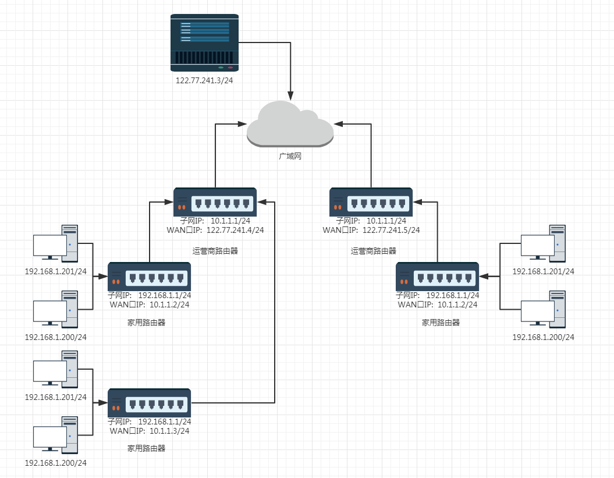  
每个家都有自己的路由器，家里局域网构建好了，使用的IP地址是以192.168开头。家里在入网的时候都是要用到运营商的网络，所以家里的路由器是直接通过网线连接家里附近的运营商，所以你家里的路由器一定横跨了两个子网，一个是你自己家里的子网，一个是运营商路由器组建的子网。所以不要认为你的数据从你家路由器出去了就直接到公网上了，可能是到了运营商的子网，然后继续向上转发。你家里的路由器横跨了两个子网，一个是对内连接你自己家里的子网，一个是对外连接运营商路由器组建的子网，所以路由器一般会配有两个IP，一个是**子网IP**(**LAN口IP**)(**对内**)表示的是这个是路由器自己构建的子网并且属于这个子网内第一台主机。并且这个路由器对外连接是运营商给它构建的子网，所以配置另一个**WAN口IP**(**对外**)。

运营商自己的路由器也配有LAN口IP(对内)配置的是内网IP，WAN口IP(对外)配置的是公网IP直接连接到公网上了。换句话说，我们的数据包在从主机出来的时候是先给家用路由器然后再交给运营商路由器做运营商自己的内网转发，当转发到一定程度，再把数据包转到公网，再由公网IP转给对应的提供服务的企业。当回来的时候也是用的WAN口IP。

我们再看看数据包转发流程：

**不同局域网私有IP是可以重复的，只要保证局部性的唯一性**。这样就可以用重复的IP入网了，所以它可以用来解决了IP不足的问题。

但是现在就有问题了，虽然不同局域网但用的是同样的IP，假设去访问抖音，首先判断这个请求不是属于同一个局域网的，然后就把请求给家用路由器等等，一路最终给了抖音，最后抖音怎么知道应该把服务给谁。是给那个局域网的192.168.1.201？回不来了。。

---

所以就需要一种技术支持，经过路由器的时候要把**当前请求的源IP替换自己路由器的WAN口IP**。然后就知道把服务转到哪里了。

我们把经过路由器不断的在做源IP和WAN口IP替换的这种技术叫做**NAT**。

那现在怎么回来呢？

+ 一个路由器可以配置两个IP地址, 一个是WAN口IP, 一个是LAN口IP(子网IP).
+ 路由器LAN口连接的主机, 都从属于当前这个路由器的子网中.
+ 不同的路由器, 子网IP其实都是一样的(通常都是192.168.1.1). 子网内的主机IP地址不能重复. 但是子网之间的IP地址就可以重复了.
+ 每一个家用路由器, 其实又作为运营商路由器的子网中的一个节点. 这样的运营商路由器可能会有很多级, 最外层的运营商路由器, WAN口IP就是一个公网IP了.
+ 子网内的主机需要和外网进行通信时, 路由器将IP首部中的IP地址进行替换(替换成WAN口IP), 这样逐级替换, 最终数据包中的IP地址成为一个公网IP. 这种技术称为NAT(Network Address Translation，网络地址转换).
+ 如果希望我们自己实现的服务器程序, 能够在公网上被访问到, 就需要把程序部署在一台具有外网IP的服务器上. 这样的服务器可以在阿里云/腾讯云上进行购买.

现在我们有公网/内网(子网/局域网)，子网划分的概念，我们画图建立一个宏观的网络拓扑结构。

简单点就以比特位划分网络，比如说从美国发一个请求目的ip是浙江杭州。一看这个目的IP结合子网掩码一查发现不是自己国家的网络就发送到国际之间的路由器，一查发现是中国的，就转发给中国，然后我国国际路由器在根据结合自己的子网掩码一看，发现是浙江的就转发给浙江。再由浙江这里的服务器结合ip和路由器的子网掩码一查发现是杭州的，就转给杭州了。

这是我们构建起来的公网，可是你会发现一个问题，IP地址再分不够了。

没关系，到地方上不是有很多的本地运营商吗？此时在由本地运营商划分不同的子网。然后弄一个公网入口路由器。

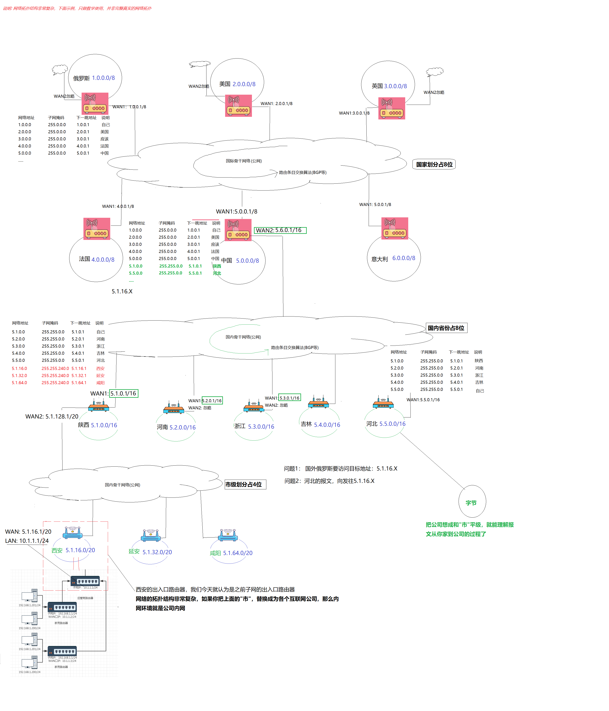

我们就可以理解成整个网络拓扑结构就类似这种的。真实网络更复杂！

# 路由
我们并不谈路由表是怎么形成的，这涉及到路由器和路由器之间通信的问题我们不考虑。来了一个数据包到了中间节点路由器中它应该如何路由，一个路由器中的路由器的构成应该是什么样子的。

我们在路由的时候，一定要告诉要经历的路由器你要去哪里。也就是说目的IP是什么，我们知道IP = 目标网络 + 目标主机 ，所以大部分路由都是拿着目的IP，然后先找这个目标主机所在的子网。所以在查找的时候一定有一张对应的路由表来查，这个路由表能够从我的数据报文的目的IP配上对应的子网掩码进行提取目的网络。在通过查找子网的过程经过路由之后找到目标主机所在的子网，然后再子网中进行内网转发把数据交给目标主机。

下面一个简单例子理解一下这个找的过程。  
当你刚开始上大学的时候，假设你是自己去的，然后在下火车的时候发现你的东西都弄丢了，幸亏你妈临走时给你兜里放20块钱，接下来就只靠你自己了，你只知道你要去的地方是清华大学。不考虑其他方法，只能问人然后根据别人的指示进行下一步动作。你出火车站碰到一个大爷，你问大爷我去清华大学该怎么走。日常你问别人路怎么走无非就得到下面几种结果，1. 我不知道，别问我。 2. 我自己不清楚，但是我知道有人知道，你看到那个扫地大妈没有她在这里生活20年了她肯定知道，你去问她把。3. 大爷知道怎么走，你先这样走，在那样走，然后再问别人。4. 大爷说这里就是你要去的地方。

在刚才的例子里，我就是一个数据包，我涵盖了一个目的地址(清华大学)，大爷或者大妈以及你未来可能遇见要问路的人就是一个一个路由器，当你在问大爷的时候，他肯定要动脑子想，该怎么走或者其他的。而大爷脑海里这种全局的或者局部的路径情况我们称为路由器中的路由表，当你问大爷而大爷在思考的过程就是在查路由表的过程，给你反馈怎么走就是查找得到的结果。

在回到上面故事，看大爷给我的反馈，你问大爷大爷说我不知道别问我，现实生活中确实可能遇到这种情况，但是现在是一个数据包千里迢迢送到一个路由器，路由器说不要问我，我不知道，我也不知道谁知道，这是不合理的！这是查找逻辑出现了问题，一个路由器怎么能拒绝报文了，它应该全心全意帮报文找到目标网络。现实生活中存在的在网络中是不存在的，一般一个路由器会想办法竭尽全力帮助这个报文。即便它不知道也要想办法仍给下一个路由器去。所以第一种情况不存在。

第二种情况，大爷说我不知道但是我知道那个扫地的大妈知道。所以路由器自己不知道这个报文去哪里，但是它必须知道在自己不确定的路径下它自己要有一个默认路由，大妈就是那个默认路由（下一跳默认网关）。

第三种情况，大爷告诉你怎么走，然后到了地方你在去问别人。这叫做大爷明确知道你要去哪里的，方向没有错，但是更多细节大爷就不知道了。路由器把报文转发到下一跳路由器。

一般在路上问人的时候无非就是这三种场景，而在网络中转发报文时常见的就是第二，第三种。第四种场景是经过不断的查找最终你遇到了清华大学门口保安大爷，你问大爷清华大学怎么走，大爷说这就是清华大学。你很高兴。但是你想想你真的要来清华大学吗，实际上你要去的是清华大学19号宿舍楼。于是你问大爷请问19号楼怎么走，所以门口保安大爷说你这样走那么走就到了，所以你很快就找到了19号宿舍楼。至此这就是你找到了目标网络所在的目标主机。门口保安大爷叫做该子网入口的路由器。

所以当实际在进行路由转发的时候，永远要经历的是先在路上进行路由，然后到达目标子网之后，在经过目标子网的入口路由器进行内网转发将数据送达目标主机。**路上路由时我们只看目标网络，到达目标网络之后在结合入口路由器将数据发送目标主机。**

路由的过程, 就是这样一跳一跳(Hop by Hop) “问路” 的过程.  
所谓 “一跳” 就是数据链路层中的一个区间. 具体在以太网中指从源MAC地址到目的MAC地址之间的帧传输区间.

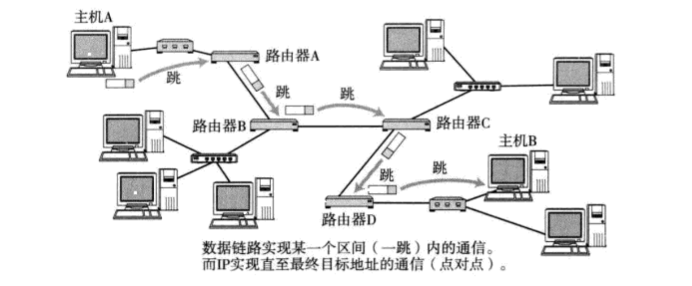  
IP数据包的传输过程也和问路一样.

+ 当IP数据包, 到达路由器时, 路由器会先查看目的IP;
+ 路由器决定这个数据包是能直接发送给目标主机, 还是需要发送给下一个路由器;
+ 依次反复, 一直到达目标IP地址;

那么如何判定当前这个数据包该发送到哪里呢? 这个就依靠每个节点内部维护一个路由表;

+ 路由表可以使用`route`命令查看

Destination: 目标网络(和我这个路由器直接相连的子网)  
Gateway: 下一跳路由器  
Genmask: 子网掩码  
Use Iface: 发送接口

这里的default就是默认网关，确实这个目的IP不是我同一个网段，是哪里也不清楚，就把它扔到默认网关里。

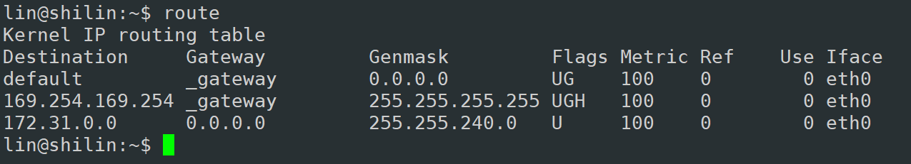

假设某主机上的网络接口配置和路由表如下:  
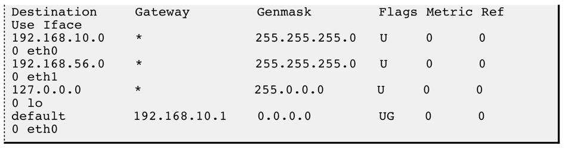

+ 这台主机有两个网络接口,一个网络接口连到192.168.10.0/24网络,另一个网络接口连到192.168.56.0/24网络;
+ 路由表的Destination是目的网络地址,Genmask是子网掩码,Gateway是下一跳地址,Iface是发送接口,Flags中的U标志表示此条目有效(可以禁用某些 条目),G标志表示此条目的下一跳地址是某个路由器的地址,没有G标志的条目表示目的网络地址是与本机接口直接相连的网络,不必经路由器转发;

转发步骤

1. **遍历路由器**
2. **目的IP & 路由表中配置的Getmask，确定该报文要去的网络**
3. **对比结果 和 Destination**
4. **通过Iface接口发出报文！**

转发过程例1: 如果要发送的数据包的目的地址是192.168.56.3

+ 跟第一行的子网掩码做与运算得 到192.168.56.0,与第一行的目的网络地址不符
+ 再跟第二行的子网掩码做与运算得 到192.168.56.0,正是第二行的目的网络地址,因此从eth1接口发送出去;
+ 由于192.168.56.0/24正 是与eth1 接口直接相连的网络,因此可以直接发到目的主机,不需要经路由器转发;

转发过程例2: 如果要发送的数据包的目的地址是202.10.1.2

+ 依次和路由表前几项进行对比, 发现都不匹配;
+ 按缺省路由条目, 从eth0接口发出去, 发往192.168.10.1路由器;
+ 由192.168.10.1路由器根据它的路由表决定下一跳地址;

其实我们说的子网掩码是配置进路由器的，路由器一定要及连一个或多个子网，所以每个子网对应的网络号和它这子网所配套的子网掩码都是路由器的条目，所以报文到达时拿着目的IP与对应条目的子网掩码和路由器直接连接的子网号，三位一体就可以将我们的报文进行转发。

问：**当进行数据包转发时，我们要去的目标网络号会不会变化？**

会的。最终的网络号是确定的！因为每个路由器配置的子网掩码都不一样，所有网络号也在变化。但只要子网掩码越来越长，那就意味着我们要去的网络号越来越具体，意味着淘汰网络越来越多，主机号越来越短，距离目标主机距离越来越短。只有最终到了入口路由器，已经没有子网了，直接就是目标主机所在的子网，接下来进行内网转发。

路由表可以由网络管理员手动维护(静态路由), 也可以通过一些算法自动生成(动态路由). ,例如距离向量算法, LS算法, Dijkstra算法等.这里可以自己了解一下。

# 分片和组装
IP报头我们认识的差不多了，还是剩下三个字段。这是要结合下一层数据链路层来学习，不过我们可以先看结论。  
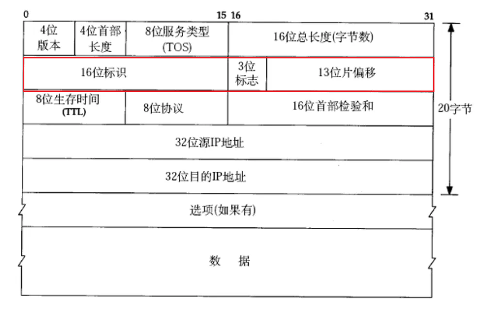 
真正在路由器上转发的确实是IP报文，但真正的在网线上跑的是MAC帧！

数据链路层，有一个MAC帧协议，它规定：自己的**有效载荷不能超过 1500 字节**（MTU，是可以修改的），也就是说上层传递下来的单个IP报文(IP报头+IP报文的有效载荷)不能超过1500字节。

MAC说IP你不能给我每次报文超过1500字节。但是IP能决定单个报文大小吗？  
不能，它只是负责路由转发。那谁能？  
**真正在网络中决定单个报文大小的是TCP**（TCP是传输控制协议，它规定什么时候发，发多少。。。）那TCP怎么控制呢？以前学TCP我们知道滑动窗口=min(拥塞窗口，对方接收能力)，那为什么还要在滑动窗口里分一个一个报文呢？为什么不直接把数据打包成一个直接发送出去呢？原因就在于数据链路层不允许发这么大。具体后面说。

那TCP就是给IP3000字节报文让它发，MAC说每次就是不能超过1500字节，那IP只能自己想办法了。IP想出了一个办法**分片与组装**。不过IP分片和组装不是主流情况！大部分TCP会考虑IP的感受。

所以IP就有上面三个字段来支持分片和组装。

**分片：在自己的IP层，组装：对端的IP层。**  
**TCP和MAC并不关心IP进行分片。**

如何分片？如何组装？

分片不能单独分片还要考虑对端组装的问题。

1. **你怎么知道一个报文被分片了？**
2. **同一个报文的分片怎么都能被识别出来？**
3. **哪一个是第一个，哪一个是最后一个，有没有收全或者丢失？**
4. **哪个在前，哪个在后，如何正确的进行组装？**
5. **怎么保证我合起来的报文是正确的！**

我们先认识这三个字段，然后再回到上面的问题。

+ **16位标识(id)**: 唯一的标识主机发送的报文. **如果因为数据链路层规则而导致IP被分片了, 那么每一个分片里面的这个id都是相同的.**
+ **3位标志字段**: 有三个比特位，第一位保留(保留的意思是现在不用, 但是还没想好说不定以后要用到). 第二位置为1表示禁止分片, 这时候如果报文长度超过MTU, IP模块就会丢弃报文. 第三位表示"更多分片", **如果分片了的话, 是最后一个分片该位置会被置为0, 类似于一个结束标记。如果分片后面还有分片该位置被置为1,表示后面还有分片.** **(一个IP报文被分片后，每一分片报文也都必须要有IP报头，因为每一个分片本质也是一个独立的报文)**
+ **13位分片偏移(framegament offset)**: 是分片相对于原始IP报文开始处的偏移. 其实就是在表示当前分片在原报文中处在哪个位置. 实际偏移的字节数是这个值 * 8 得到的. 因此, 除了最后一个报文之外, 其他报文的长度必须是**8的整数倍**(否则报文就不连续了).

这三个字段就能支持分片和组装。

**你怎么知道一个报文被分片了？**

1. 如果更多分片是1，就证明该标识的报文分片了
2. 如果更多分片是 0 && 片偏移量>0，说明是分片了，否则不是！

**同一个报文的分片怎么都能被识别出来？** 
16位标识！

**哪一个是第一个，哪一个是最后一个，有没有收全或者丢失？** 
更多分片是1 && 片偏移是0 —> 第一个
更多分片是0 && 片偏移>0 —> 最后一个
有没有收全或者丢失保证不了，但没关系排序后，只要保证当前报文的起始位置+自身长度=下一个报文中填充的偏移量。这样即使出错了哪一个报文丢了也知道。

**那个在前，那个在后，如何正确的进行组装？**
只要按照片偏移量进行升序排序即可！

**怎么保证我合起来的报文是正确的！**
TCP和IP有校验和

1. **分片好吗？** 
不好！
2. **对TCP和UDP包括IP本身有什么影响？** 
一个报文被拆成了多个，任意一个报文分片丢失，就会造成拼接组装失败，进而导致对端对整个报文进行重传。因为TCP并不知道IP进行分片了。 
其次一个数据包不丢包概率99%，分成3片，99%*99%*99% < 99% ，所以分片会增加丢包概率。

接下来我们自己试着分一下

传输层给网络层3000字节的报文，但是数据链路层要求每个报文最大不超过1500字节。到了网络层加上IP报头，IP报文3020字节。现在怎么分片呢？

首先无脑拿前面1500字节，注意这1500字节是包含原始IP报文的报头的！  
然后3020-1500还剩下1520字节，可是这1520字节可是纯数据，将来再分的分片也要添加报头，因此只能从1520字节拿1480个字节，然后在添加20字节的IP报头，组成1500字节IP报文。现在1520-1480还剩下40字节，在添加20字节IP报头，组成60字节IP报文。

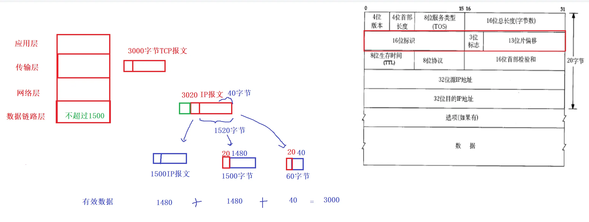 
实际上发送的有效数据 1480、1480、40正好是TCP报文长度。

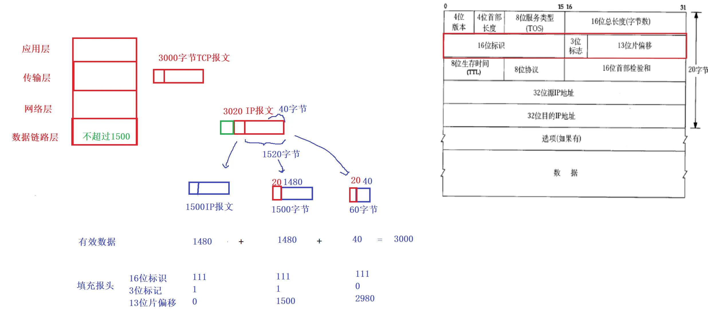  
实际当从应用层调用send/write把数据拷贝到tcp发送缓冲区，然后tcp以滑动窗口方式进行发送到IP层，加上IP报头，可能会分片。

