# Linux网络基础
# 网络认识
网络的发展有一个逻辑链条，计算机本质是为了给人提供计算任务，而人之间是要相互协作的，注定计算机之间也必须相互协作。计算机一定是通过相通数据来相互协作的。所以网络的发展有它的必然性。

计算机体系结构中网络，网络中有体系结构

# 网络协议
简单的来说"协议" 是一种约定

在计算机网络的基本概念中 ， 分层次的体系结构（或架构）是最基本的 。 

与操作系统的关系：

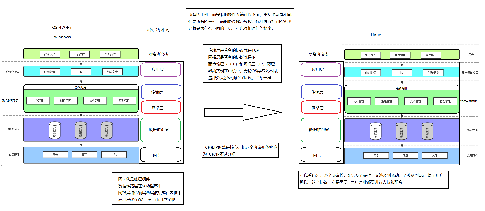

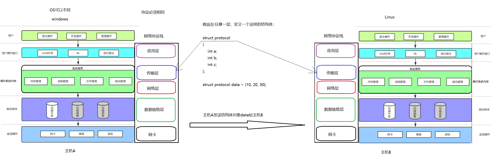

## OSI七层模型
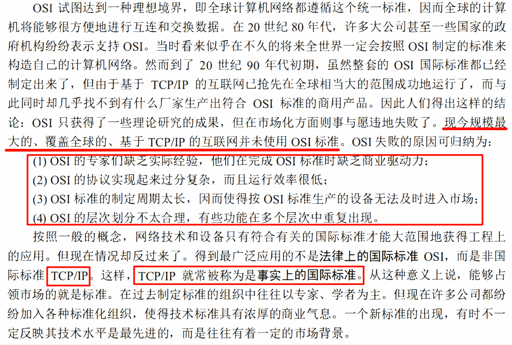

来自计算机网络第八版-谢希仁

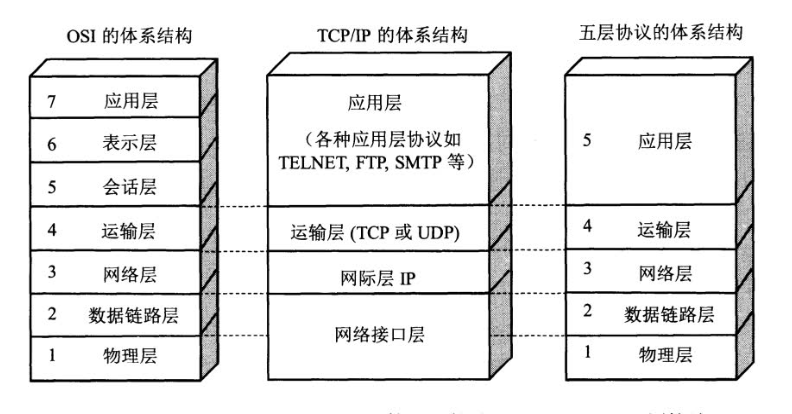

具有五层协议的体系结构

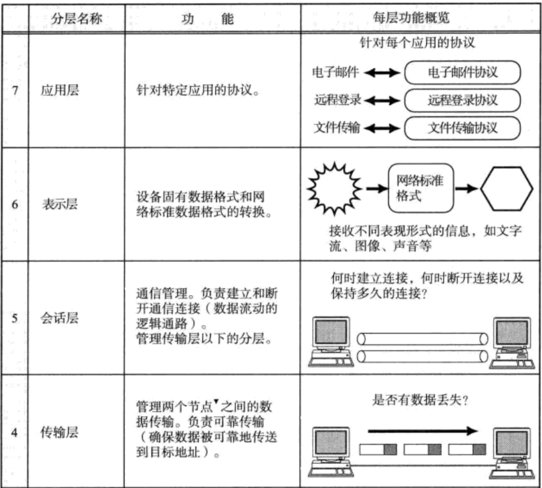

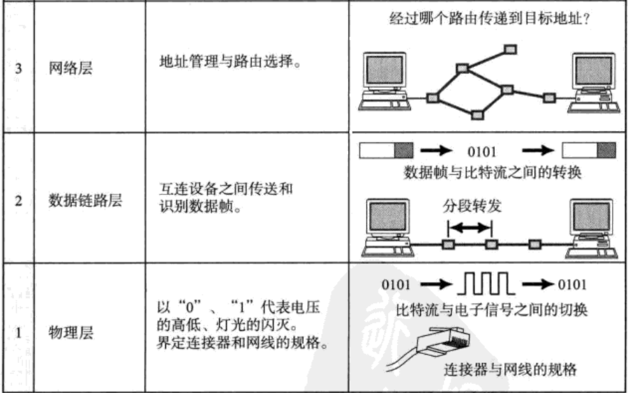

物理层主要解决硬件电路方面的问题
数据链路层对应解决第1个问题，这里说的互联设备是和自己直接相连的下一台主机
网络层对应解决第2个问题
传输层对应解决第3个问题
会话层、表示层、应用层解决对应第4个问题

---

**物理层我们考虑的比较少. 因此很多时候也可以称为 TCP/IP四层模型.**

一般而言

+ 对于一台主机, 它的操作系统内核实现了从传输层到网络层的内容;
+ 对于一台路由器, 它实现了从网络层到物理层;
+ 对于一台交换机, 它实现了从数据链路层到物理层;
+ 对于集线器, 它只实现了物理层;

---

其实在网络角度，OSI定的协议7层模型其实非常完善，但是在实际操作的过程中，会话层、表示层是不可能接入到操作系统中的，所以在工程实践中，最终落地的是5层协议。

现在人们经常提到的TCP/IP并不一定是单指TCP和IP这两个具体的协议 ， 而往往是表示互联网所使用 的整个TCP/IP协议族

为什么要有协议？本质上在发展过程中通信注意变远了

> 所谓协议，就是通信双方都认识的结构化的数据类型

## 宏观认识


所以说协议虽然约定好了，但是执行上不太一样，那可能也不太行！

+ 计算机生产厂商有很多;
+ 计算机操作系统, 也有很多;
+ 计算机网络硬件设备, 还是有很多;
+ 如何让这些不同厂商之间生产的计算机能够相互顺畅的通信? 就需要有人站出来, 约定一个共同的标准, 大家都来遵守, 这就是**网络协议**

# 传输流程
1. 协议每一层都有，而每一个协议最终表现就是协议都要有报头
2. 协议通常是通过协议报头来进行表达的
3. 每一份数据最终在被发送或者在不同的协议层中，都要有自己的报头

## 理解局域网
1. 两台局域网的主机能够直接通信
2. 每一台机器都有自己的 “名字”，指的是每一台主机都有网卡，而每一张网卡都有自己的地址，MAC地址

局域网可以分为：

1. 以太网
2. 令牌环网
3. 无线LAN

**在局域网中，只允许一个主机在任何一个时刻在局域网中发送消息，否则发生碰撞。所有我们把这个局域网也称为碰撞域。**

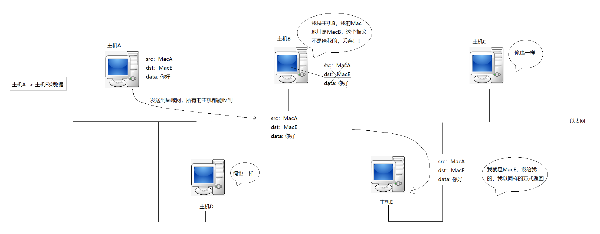

这种局域网的网络资源按照以往的知识如何看待呢？
站在系统的角度，它是一种临界资源、共享资源。

而令牌环网，就可以相当于互斥锁，谁拿到谁发送消息。这是令牌环网的原理。

跨网络的主机数据传输. 数据从一台计算机到另一台计算机传输过程中要经过一个或多个路由器

要进行数据报转换，首先一个设备至少要横跨两个网络，才能实现数据报跨网络转发，所以路由器必须要横跨至少两个网络，因此路由器必须有两个网络接口，对应有两个网络接口（两张网卡）。

在左边网络看来这个路由器是属于左边网络主机的的，在右边网络看来这个路由器是属于右边网络主机的。所以这个路由器既是左侧网络主机又是右侧网络主机。虽然两台主机没有办法直接传输，但是可以先把数据转给路由器，再由路由器传输给对方主机。

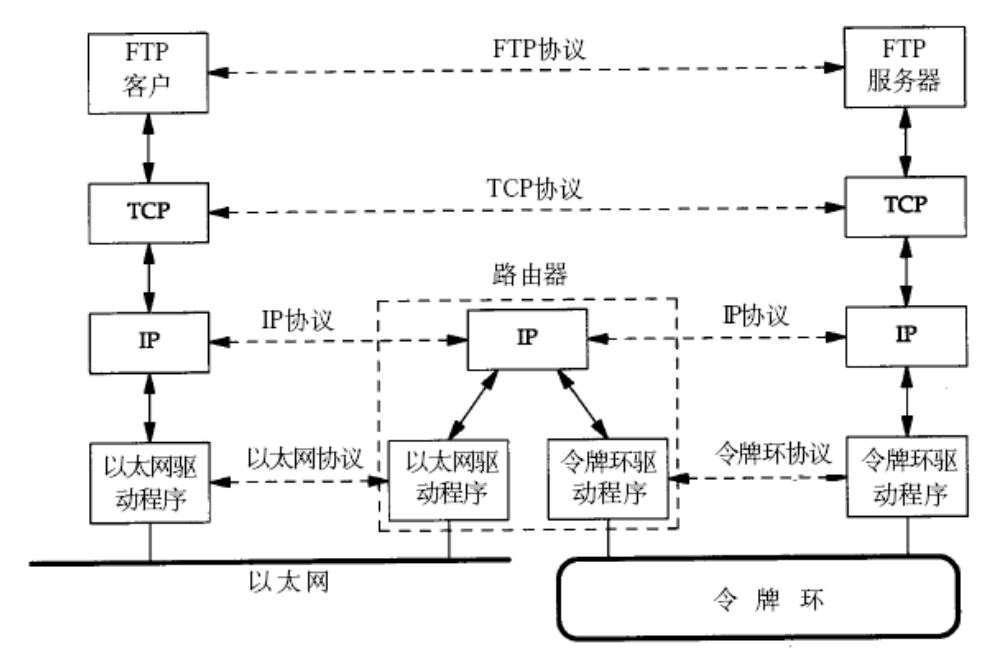 
收到之后向上交付，每层都需要做报头和有效载荷分离，将有效载荷交给上层，最后用户B收到用户A发送的消息。

在这个过程，我们可以看到以IP层作为分割，IP层上面的同层协议都是一样的，无论是在自己还是对方的主机看到的报文都是一样的，只有在IP层下面看到的协议是不一样的。

但是底层协议，因为要往路由器传输的，一次向上交付解包分用的过程，一次向下交付封装的过程。屏蔽底层网络的差异。

IP协议存在的第一个意义：**屏蔽底层网络的差异**。

在同一个局域网几个设备发送消息不需要经过路由器。一台机器在发送消息的时候就已经知道要发送的是给同一个局域网的另一台主机，还是另一个局域网的主机。如果是另一个局域网就要经过路由器。如果是同一个局域网就无脑发送了。

---

在全球范围内，每一张网卡都有自己类似序列化的的东西。48位二进制数据可以按16进制解释，最终它就是一串字符，用来表示网卡的唯一性。所以每个网卡都有自己的MAC地址，这个MAC地址是写在网卡里的是固定好的。MAC全球唯一，但是它并不应用于全球，而是运用于局域网中表明一台主机的唯一性。

ether就是以太的意思，后面就是MAC地址

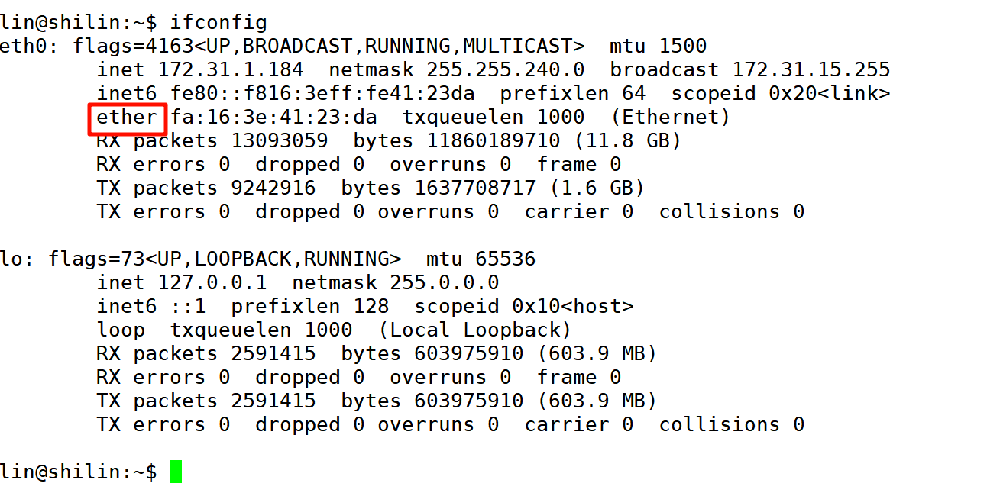

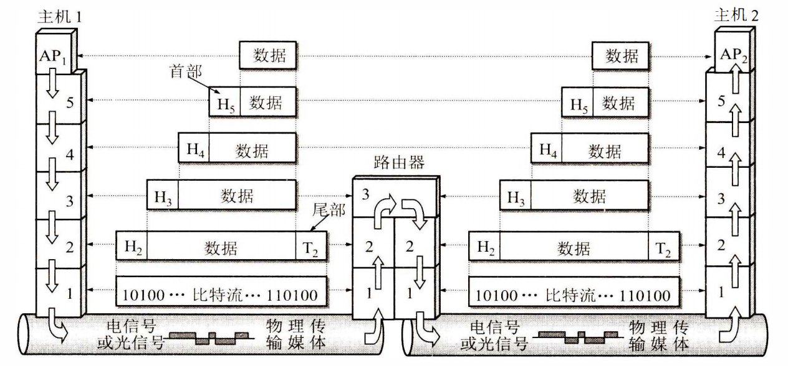							数据在各层之间的传递过程

**在网络协议中，我们可以认为同层协议在直接通信，也可以理解成为向下交付，这是两种不同的认知。**

**报文=报头+有效载荷**

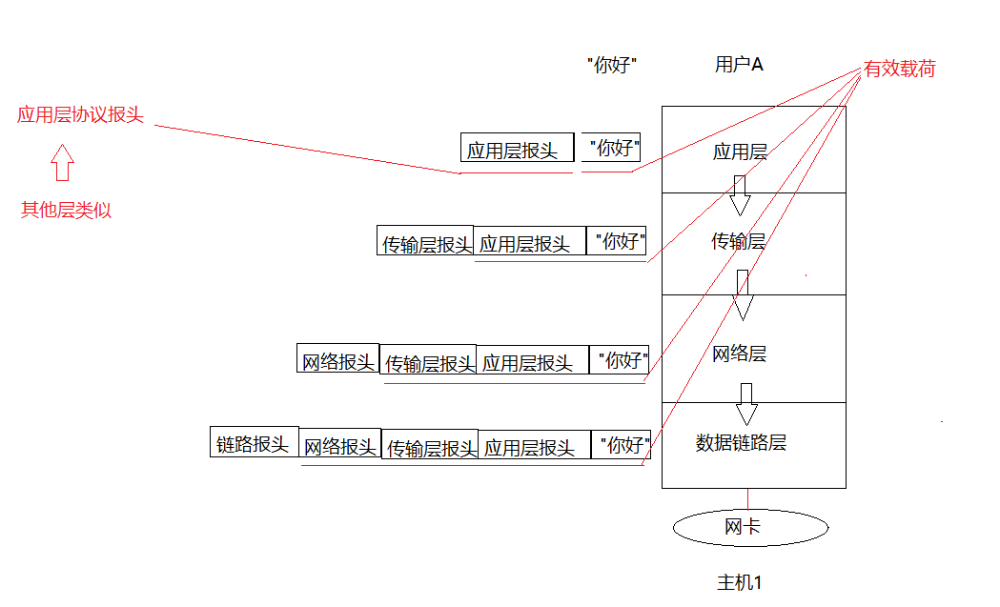

实际上这两个问题是在网络通信中每层协议都必须面对的问题，也都需要解决的！

虽然现在一个协议都没有学，但是这里想说的是每一层协议的报头中，一定要涵盖上面的信息。 这也是所有协议的共性！

我们把报头和有效载荷分离的过程叫做解包的过程，把有效载荷定向交付给指定协议的过程叫做分用的过程。

整个报文在局域网通信的过程，要经过**封装的过程、解包分用**的过程

# TCP/IP 的体系结构
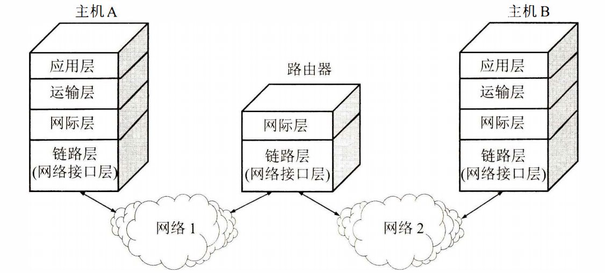

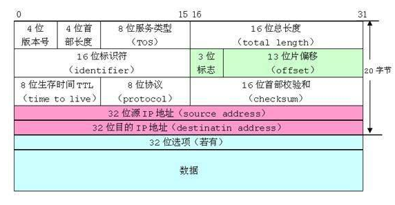

# 数据分包与应用
不同的协议层对数据包有不同的称谓,在传输层叫做段(segment),在网络层叫做数据报 (datagram),在链路层叫做帧(frame).

应用层数据通过协议栈发到网络上时,每层协议都要加上一个数据首部(header),称为封装(Encapsulation).

首部信息中包含了一些类似于首部有多长, 载荷(payload)有多长, 上层协议是什么等信息.

数据封装成帧后发到传输介质上,到达目的主机后每层协议再剥掉相应的首部, 根据首部中的 “上层协议字段” 将数据交给对应的上层协议处理.

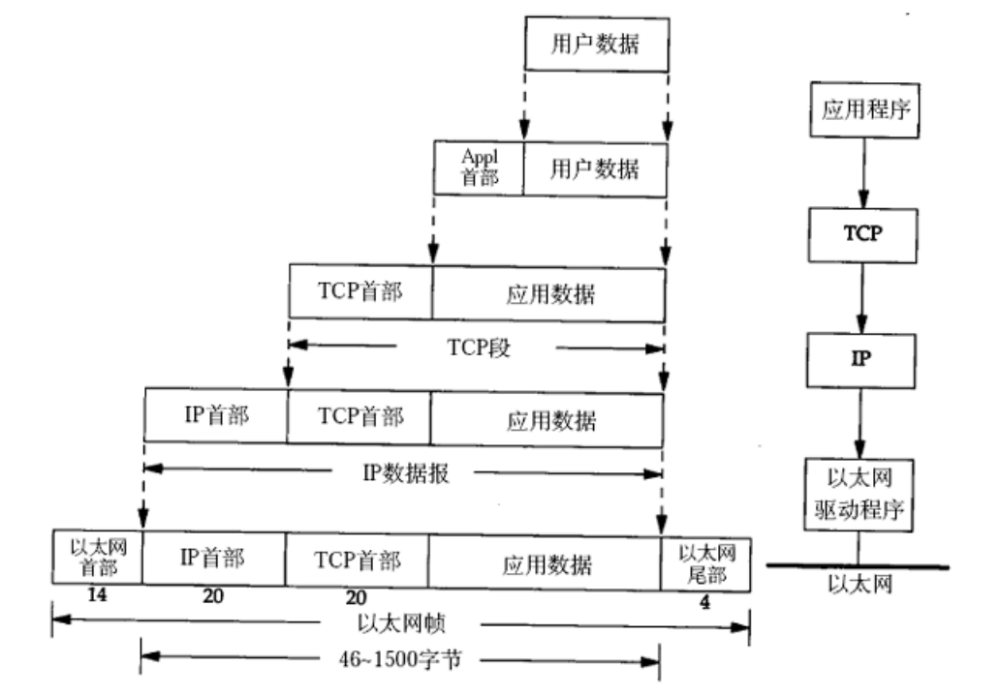

下图为数据分用的过程  
 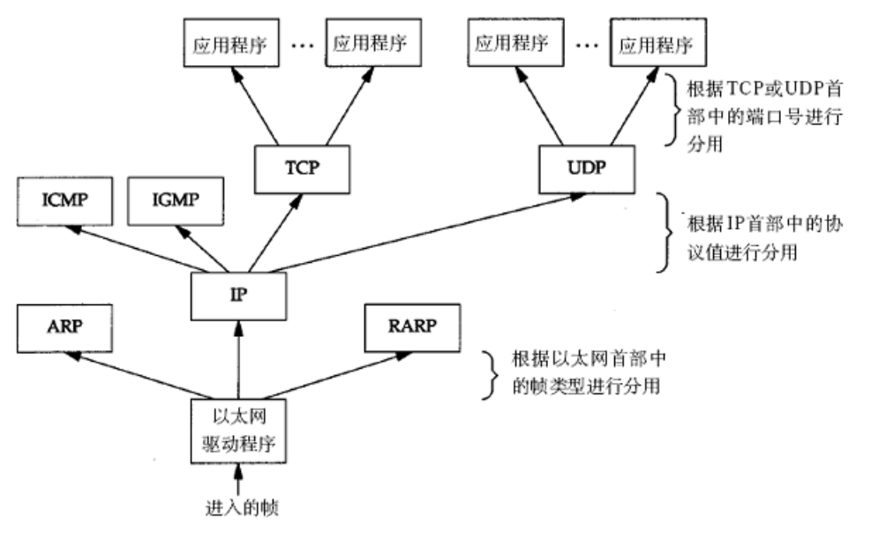

# 地址管理
在网络中同通常用的有两种地址，一种是IP地址，一种是MAC地址。

MAC地址是全球唯一的序列值，但不应用于全球，而用来表明在局域网中的一台主机的唯一性。

关于局域网目前怎么理解呢？  
两台主机可以直接通信，不用跨路由器转发就是局域网。

查看当前云服务器的MAC地址，IP地址：

```shell
ifconfig  
```

eth0是云服务器提供的入网接口


## IP地址
IP协议有两个版本, IPv4和IPv6

对于IPv4来说, IP地址是一个4字节, 32位的整数,相当于一个`unsigned int`类型;

我们通常也使用 “点分十进制” 的字符串表示IP地址, 例如`192.168.0.1`; 用点分割的每一个数字表示一个字节, 每个数字取值范围范围是`0-255`

IPv6，IP地址是一个16个字符，128位比特位的整数。

## MAC地址
长度为48位, 及6个字节. 一般用16进制数字加上冒号的形式来表示(例如: 08:00:27:03:fb:19)

在网卡出厂时就确定了, 不能修改. mac地址通常是唯一的(虚拟机中的mac地址不是真实的mac地址, 可能会冲突; 也有些网卡支持用户配置mac地址).

MAC地址通常在局域网中使用，IP地址在广域网和局域网都使用，不过我们不谈IP在局域网的使用。

MAC地址和IP地址都能表示主机的唯一性。

---

【源IP，目的IP】 ：为我们未来每一个阶段，提供方向目标，方便进行路径选择。

【上一站从哪里来，下一站到哪里去】：该类地址，一直在变化。像这种相邻的两个地址，从一个结点跳转到和它相连的下一个结点，我们称为MAC地址【源MAC，目的MAC】。

**IP地址提供方向，MAC地址提供可行性。**

IP与MAC就相当于终极目标和阶段性目标的关系。

主机与路由器，路由器与路由器，路由器与主机直接相连的属于同一个局域网。

同属于一个局域网，所以可以把数据从一个局域网传到另一个局域网，因此最终可以把一个主机的信息跨网络传输到另一个主机

目的ip存在的意义：

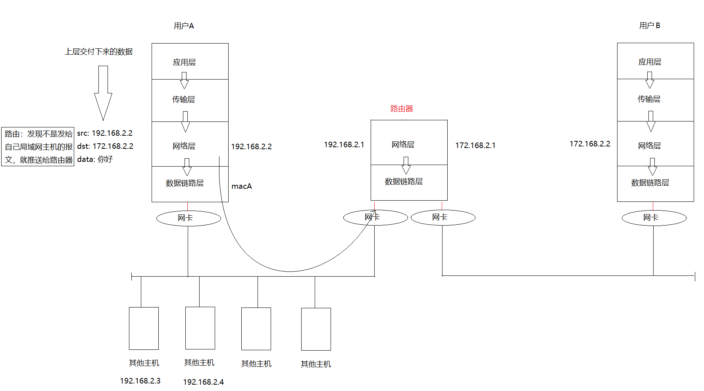  


传输层和网络层在OS内部，数据链路层在驱动，物理层暂时不说了，应用层是由用户自己实现的，用户未来一定通过调用某些系统调用接口来完成向传输层下达网络发送的任务，最后发给对方主机。

有两个问题，我们在网络通信时，路由器往下传可以有多个选择，为什么会选择这个你，不选择它呢？

根本原因还是在于目的IP，它在网络层进行路径选择时选择了下一个跳转的路由器。

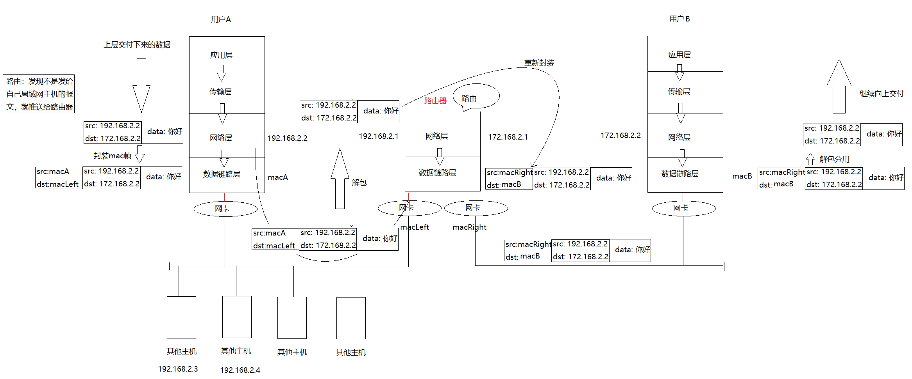

对比IP地址和Mac地址的区别

+ IP地址在整个路由过程中，一直不变(目前，我们只能这样说明，后面在修正)
+ Mac地址一直在变
+ 目的IP是一种长远目标，Mac是下一阶段目标，目的IP是路径选择的重要依据，mac地址是局域网转发的重要依据

## 宏观流程
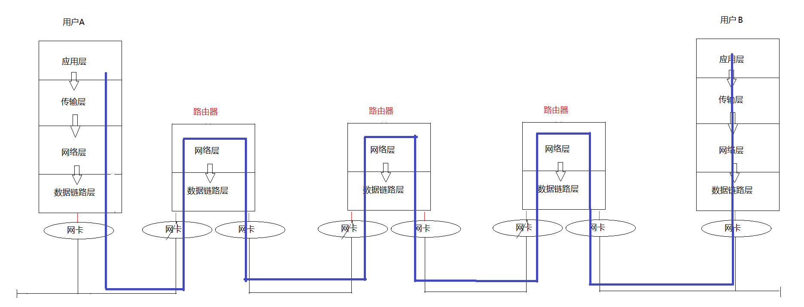

IP网络层存在的意义：提供网络虚拟层，让世界的所有网络都是IP网络，屏蔽最底层网络的差异


