# NAT技术、代理服务器+网络通信各层协议
# NAT技术
## NAT技术背景
之前我们讨论了, IPv4协议中, IP地址数量不充足的问题  
NAT技术当前解决IP地址不够用的主要手段, 是路由器的一个重要功能;

+ NAT能够将私有IP对外通信时转为全局IP. 也就是就是一种将私有IP和全局IP相互转化的技术方法:
+ 很多学校, 家庭, 公司内部采用每个终端设置私有IP, 而在路由器或必要的服务器上设置全局IP;
+ 全局IP要求唯一, 但是私有IP不需要; 在不同的局域网中出现相同的私有IP是完全不影响的;

## NAT IP转换过程
之前说过，当进行数据跨网络传输时，构建一个报文向下交付，到网络层后要经过路由选择，发现要去目标主机和我并不再同一个子网，所以向下交付封装MAC帧交付给出口路由器 ，家用路由器的IP地址肯定知道因为你连接过路由器，如果不知道MAC地址就做ARP。然后出口路由器经过同样的策略交给下一跳路由器直到交给目标主机。在整个交付过程中，路由器不仅仅是把报文交给下一跳。更重要的在交付的时候把**源IP地址不断的做替换**。每一个路由器不仅有LAN口IP，还要WAN口IP，当做数据包转发时，是把**源IP替换成路由器的WAN口IP**。一路替换然后数据包经过目的主机处理然后返回接下来怎么走呢？  
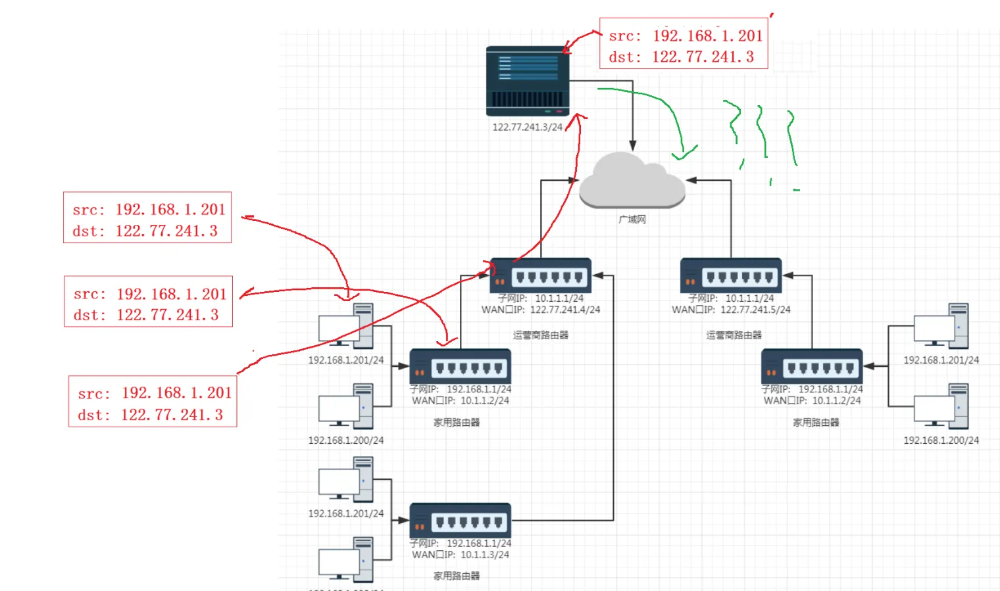

下面我们具体说一下整个过程。

客户端A、B、C都有自己的私有IP，每台主机我们要透过现象看本质，每台机器都有TCP/IP协议栈。客户端A将数据经过路由器发送给服务器。其中路由器本质天然的就包含了NAT地址转化的功能，所以在数据在刚开始转发时源IP地址是它自己私有IP，然后经过路由选择发现要去路由器，到路由器之后就把当前IP报头中源地址替换成路由器自己的WAN口IP，然后让路由替这个主机发起网络请求，最终经过内网和公网转发这个数据到了服务器。服务器处理好了根据得到的源IP构建响应返回给NAT路由器，那此时NAT路由器中报文中目的IP目前是202.244.174.37，接下来问题是怎么从这个路由器回到主机。

有人可能说转化时建立一个映射关系，然后回到NAT路由器在把目的IP转化一次变成源IP地址不就可以了吗，但如果是一个局域网主机都访问同于一个服务器呢？

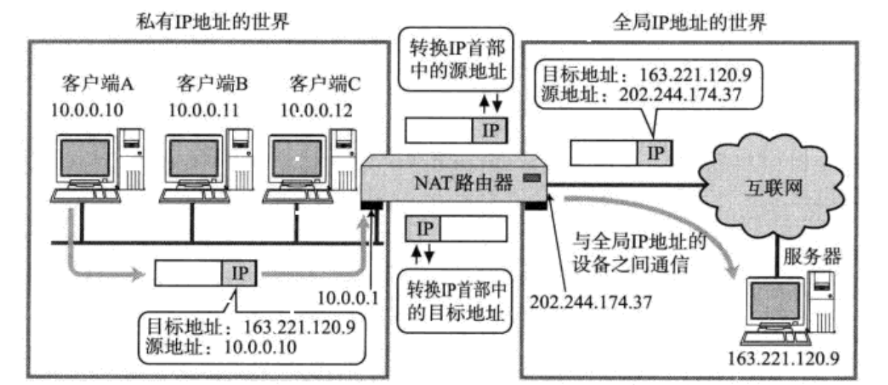

## NAPT
那么问题来了, 如果局域网内, 有多个主机都访问同一个外网服务器, 那么对于服务器返回的数据中, 目的IP都是相同的. 那么NAT路由器如何判定将这个数据包转发给哪个局域网的主机?  
这时候NAPT来解决这个问题了. 使用IP+port来建立这个关联关系

当数据包回到NAT路由器的时候，目前并不能确认这个报文应该转给主机A、B、C当中哪一个。但我们要求它必须分清楚，是谁的数据就给谁返回，就决定了当前路由器就必须自己维护从外网到内网之间数据包和主机之间的对应关系。学了这么久实际上我们知道主机A、B、C三台主机IP地址是不一样的，所以对应每台主机都会有特定的标识符来告诉NAT路由器我们各自是谁。可是有一个细节我们从开始到现在一直没说，实际上通信的并不全是客户端A、B、C这些主机，其实**本质是户端A、B、C上特定的进程和服务器上某个特定的进程在通信**，而进程都是自己的端口号的。并且同时可能会存在一台主机上有不同进程可能都要去访问外网。所以NAT路由器除了要区分客户端A、B、C之间差别，也要有能力区分同一台主机不同的进程！

说白了就是NAT路由器不仅仅要区分客户端A、B、C，然后把响应报文要转给不同的主机。还有同一台主机不同进程发给其他服务器，服务器处理之后把响应报文都发到NAT路由器，NAT路由器要把响应给同一台主机的不同进程，所以还需要端口号来区分同一台主机不同进程！

所以**数据包在经过NAT路由器进行转发出去的时候，不仅要考虑源IP地址替换的问题，源端口号也要被替换。**

**因此路由器还要在自身内部维护一张NAT转换表！** 其实这张转换表是KV式的转换表。

公网IP肯定是不一样的，局域网内不同主机IP地址也是不一样的。 可能是同一台主机不同进程发送请求，也有可能是不同主机但是端口号相同的进行发送请求，但是因为有IP和端口号的存在这个组成四元组的请求在局域网内一定是唯一四元组。

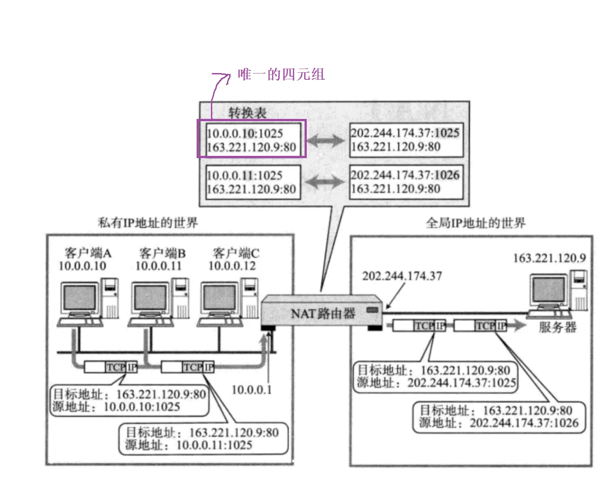  
把请求报文经过NAT路由器源IP地址的转换，源port也可能转换(可能一台主机不同进程都访问外网)。替换之后这个四元组请求在公网内也是唯一的。  
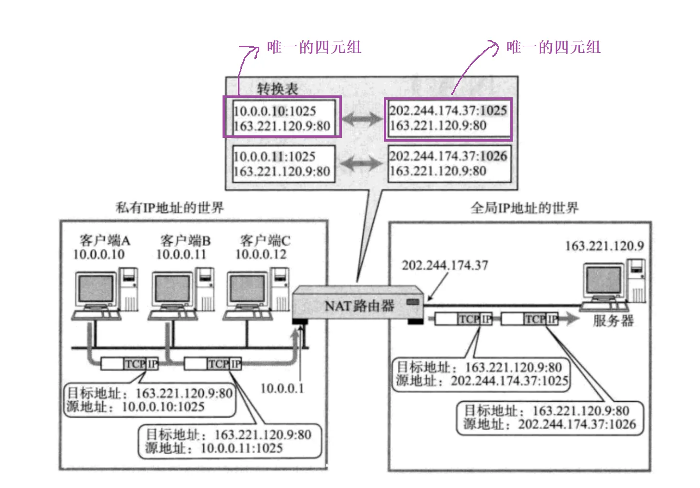  
所以NAT路由表做了源IP替换和可能源port的替换之后变成了新的源IP和或者新的源port，因为一个是私网IP一个是公网IP，这两种IP一定是不一样的，也就是说替换完了之后两个四元组的源IP一定是不一样的，就注定了这两个唯一的四元组合起来整体一定是不一样的并且是唯一的。所以在NAT路由器中就构建了**互为键值的映射表**并且都是唯一的。 也就是说从左到右，左侧的值是具有唯一性的，从右到左，右侧的值也是具有唯一性的。  
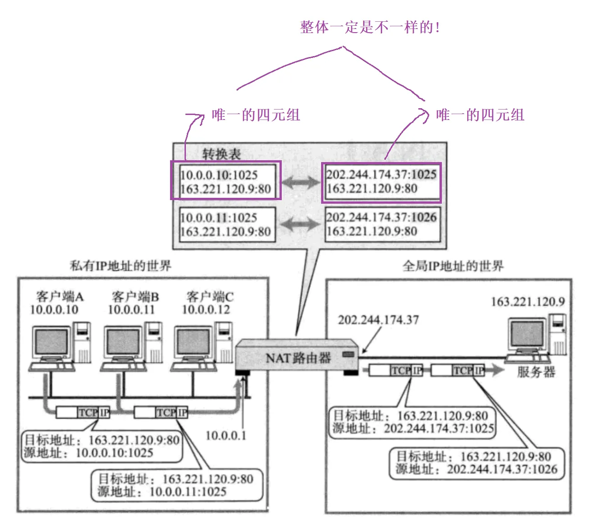  
所以数据包回来到NAT路由器后，虽然NAT路由器看到目的IP都是一样的，但是曾经端口号可能做了替换，因此看到的整体一定是不一样的。然后再根据映射，所以最终就可以区分出那个数据包是那个主机的进程的。

所以不用担心数据包回来的问题，因为路上的路由器都会建立NAT转换表。这个NAT转换表可以从左到右查，也可以从右到左查。

经过刚才的分析，**如果主机上从来没有访问外网，那外网能不能之间通过路由器访问这台主机呢？**  
**不能**！因为路上的路由器并没有建立对应的映射关系。所以也不能把数据反向的从外网推送给该主机。除非该主机访问外网然后路上路由器记录对应的映射关系，外网	才能访问该主机。

这种互为映射的关联关系也是由NAT路由器自动维护的. 例如在TCP的情况下, 建立连接时, 就会生成这个表项; 在断开连接后, 就会删除这个表项  
所以有NAT这种技术的存在可以让我们构建各自各样的子网，然后通过转发访问公网，只要保证最终的出口路由器(连接公网的路由器)它所面对公网的IP地址是唯一的就可以了，内网环境可以使用NAT进行各自转发。

## NAT技术的缺陷
由于NAT依赖这个转换表, 所以有诸多限制:

+ 无法从NAT外部向内部服务器建立连接;
+ 转换表的生成和销毁都需要额外开销;
+ 通信过程中一旦NAT设备异常, 即使存在热备, 所有的TCP连接也都会断开;

## NAT和代理服务器
代理服务器又分为正向代理和反向代理

正向代理（Forward Proxy）是一种常见的网络代理方式，它位于客户端和目标服务器之间，代表客户端向目标服务器发送请求。正向代理服务器接收客户端的请求，然后将请求转发给目标服务器，最后将目标服务器的响应返回给客户端。通过这种方式，正向代理可以实现多种功能，如提高访问速度、隐藏客户端身份、实施访问控制等。

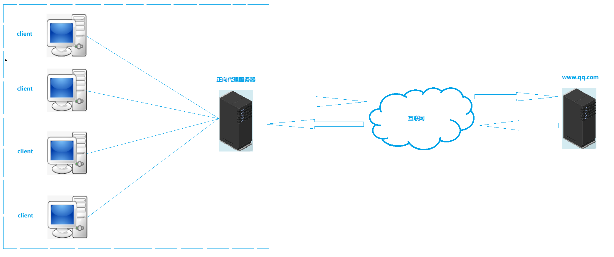

就好比我自己在访问时看不到真正服务器，我只知道要什么东西就找这个代理服务器要。这就是反向代理。

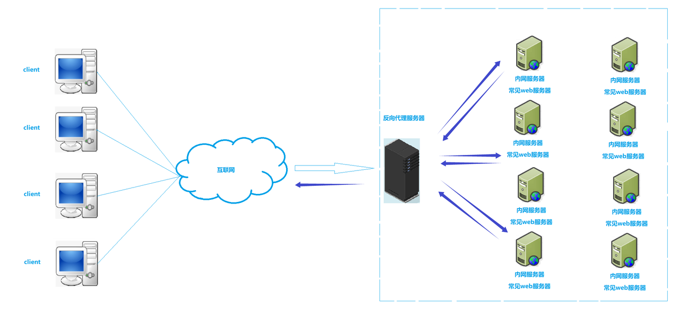

**站在客户端角度，离客户端更近的叫做正向代理，离客户端更远的叫做反向代理。**

一般我们在公司层面，现在有很多机器，这些机器通过网络访问公司内部的服务器。公司内部一定是有多种服务器的，可是有这么多服务器都暴露在公网里面， 每一台服务器也都得有自己公网IP的话，那么最终我们应该访问那一台服务器呢？其实是比较尴尬的。所以提供服务的一方呢，可能会给我们提供一个入口服务器。这个入口服务器一般会部署某些网络服务，现在就变成了只有这一台入口服务器有自己的公网IP，暴露在公网里，所有人都访问这台入口路由器，那么这一台机器最终就可以把所有人请求转发到它内网中某台服务器来对外提供服务。我们就把这台入口机器称之为代理服务器严格来说称之为**反向代理服务器**。

假设现在有4千万个客户端，有大量的请求都过来的，反向代理服务器收到大量的请求，如果它内部没有做任何处理，把请求全都给一台机器或者少量几台机器，最终会导致这几台机器压力非常大，其他机器很闲，最终导致这个集群承受压力能力变得非常低。所以反向代理为了解决这个问题，在自己内部中当有请求到来它内部有策略的把请求均衡的分散到整个集群所有主机上，这种策略我们称之为**负载均衡。**

---

一般作为反向代理服务器配置都比较高，上面通常充当反向代理服务的一般有一些软件服务，比如说Nginx，它是一款web服务器也可以充当代理服务器。

一般把结果返回给客户端有两种做法，一种是把对应的处理结果返回给代理，然后由代理通过网络转发给客户端。另一种把对应的处理结果由内网机器直接通过网络访问客户端。

**反向代理通常作为机房入口机器**

另一种情况，比如说在学校里连接校园网然后上网的时候，你以为你直接访问的是公网，其实并不是。比如你在学校访问某些网络的时候学校不允许你访问。这是因为学校在你和公网之间横了一道门，这是就是学校的服务器。所有你在访问外网的时候并不是直接访问外网，而是先把信息交给学校这个服务器，由这个服务器替你访问公网。然后对应请求的应答从公网返回之后，也是先到这个服务器，然后服务器再把响应返回给我。如果这个服务器比较好它也可以把用户看到的所有东西缓存到自己服务器上，比如你看了一部美国队长，在你看的时候这个服务器可能会把数据缓存下来，然后另一个同学也想看这部电影，他也会请求这个服务器，所有人都先请求这个服务器。所以这个人也从这个服务器请求公网某种资源时，这个服务器如果部署某个功能，发现你要访问的目标地址和以前访问过的同学是一样的，因为曾经我缓存过，所以可能把这份资源直接返回给你，在内网环境之间不经过公网，在内网中把资源直接给你。

还有你访问某个公网但是我不想让你访问，所以学校直接在这个服务器中把你的请求给丢弃了，所以你就没办法访问都外网环境了。

还有一种情况是学校不想让你免费用校园网上网，需要你交钱，然后才能上网。因为所有网络流量都要先走这个服务器，所以学校在这台服务器上搭建类似web服务器，让用户可以进行页面式进行登录验证的服务器，所有人连上之后，服务器并不会直接自动给你分配IP地址，你必须要先去登录，登录后对你做认证，如果你这个账号交过钱，然后此时才给你对应的IP地址，再往后你就可以登录用户的学生身份通过这个服务器向公网进行访问了。

像这种服务器替用户去访问我们称之为**正向代理**。它可以缓存资源，然后从学校层面可以根据正向代理服务器对学生所访问的各种资源进行限定，同理也可以对学生做入网许可的管理，这就是正向代理。正向代理服务器归根结底其实就是把所有请求收集在一起方便对请求本身做管理。

**上面内容好像和刚才说的NAT有些类似，NAT是在做由路由器替用户去进行请求，这不就是正向代理，那么是不是这样呢？**

路由器往往都具备NAT设备的功能, 通过NAT设备进行中转, 完成子网设备和其他子网设备的通信过程.

代理服务器看起来和NAT设备有一点像. 客户端像代理服务器发送请求, 代理服务器将请求转发给真正要请求的服务器; 服务器返回结果后, 代理服务器又把结果回传给客户端.

看起来它们俩工作原理好像有一点像，但其他它们俩是不同的东西。

那么NAT和代理服务器的区别有哪些呢?

+ 从应用上讲, NAT设备是网络基础设备之一, 解决的是IP不足的问题. 代理服务器则是更贴近具体应用, 比如通过代理服务器进行翻墙, 另外像迅游这样的加速器, 也是使用代理服务器.
+ 从底层实现上讲, NAT是工作在网络层, 直接对IP地址进行替换. 代理服务器往往工作在应用层.
+ 从使用范围上讲, NAT一般在局域网的出口部署, 代理服务器可以在局域网做, 也可以在广域网做, 也可以跨网.
+ 从部署位置上看, NAT一般集成在防火墙, 路由器等硬件设备上, 代理服务器则是一个软件程序, 需要部署在服务器上.

代理服务器是一种应用比较广的技术.

+ 翻墙: 广域网中的代理.
+ 负载均衡: 局域网中的代理.

# DNS
DNS是一整套从域名映射到IP的系统。

域名是我们经常用的如www.baidu.com等，我们学了套接字和网络原理我们知道其实在网络通信里我们根本就不用域名，用的都是IP地址，而事实上在公网中进行网络通信只能用IP地址，因为网络协议栈里只有IP，所以域名这个东西并不是网络协议栈中必有的东西，可是现实生活中我们确实不是用的IP地址，访问百度用的从来都是域名。原因在于IP地址是数字，数字对于机器很友好，对人非常不友好。让你按照数字去访问别人网址记不住，不如用这个域名。域名存在的价值便于互联网商业化。

**DNS背景**

TCP/IP中使用IP地址和端口号来确定网络上的一台主机的一个程序. 但是IP地址不方便记忆.  
于是人们发明了一种叫主机名的东西, 是一个字符串, 并且使用hosts文件来描述主机名和IP地址的关系.

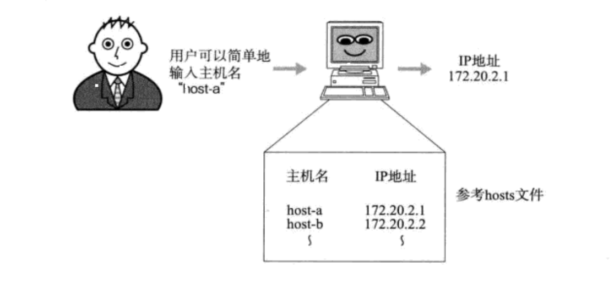  
最初, 通过互连网信息中心(SRI-NIC)来管理这个hosts文件的.

+ 如果一个新计算机要接入网络, 或者某个计算机IP变更, 都需要到信息中心申请变更hosts文件.
+ 其他计算机也需要定期下载更新新版本的hosts文件才能正确上网.

这样就太麻烦了, 于是产生了DNS系统.

+ 一个组织的系统管理机构, 维护系统内的每个主机的IP和主机名的对应关系.
+ 如果新计算机接入网络, 将这个信息注册到数据库中;
+ 用户输入域名的时候, 会自动查询DNS服务器, 由DNS服务器检索数据库, 得到对应的IP地址

当用户输入域名时，会先问离自己最近域名服务器集群，问不到这些机器然后继续向上问，可能直接问道根域名服务器，如果有的话递归返回。所以域名服务器就像一个多叉树的结构。最上面有一个根节点。

至今, 我们的计算机上仍然保留了hosts文件. 在域名解析的过程中仍然会优先查找hosts文件的内容

```shell
cat /etc/hosts
```

**域名简介**

主域名是用来识别主机名称和主机所属的组织机构的一种分层结构的名称.

域名使用`.`连接

+ com: 一级域名. 表示这是一个企业域名. 同级的还有 “net”(网络提供商), “org”(非盈利组织) 等.
+ baidu: 二级域名, 公司名.
+ www: 只是一种习惯用法. 之前人们在使用域名时, 往往命名成类似于ftp.xxx.xxx/www.xxx.xxx这样的格式, 来表示主机支持的协议

## 浏览器中输入url后一敲回车，拿到首页，请描述整个过程发生的事情
这是一个经典问题. 一个问题就可以考察网络学的怎么样, 并且这是一个开放式问题,没有固定答案, 越详细越好. 可以参考:

一般在系统和网络中有很多这种开放式问题，或者口头上问你：你怎么理解指针？这个时候虽然自己知道很多，但是好像不知道怎么给别人怎么谈，是先说概念还是应用场景，还是说指针的问题。别人就想看你怎么给别人解释。所以对我们来讲对于回到开放式问题，并不是回答问题本身。而是要先想清楚这个问题你该怎么回答。

对于这种开放式问题，我们可以告诉首先告诉他，**我想谈这种技术点的那些方面**。比如，还是问你怎么理解指针？

我打算从如下几方面谈一谈关于指针的问题，第一指针概念，第二指针应用场景，第三指针常见问题。

第一指针概念，什么是指针？为什么有指针？等等。第二指针应用场景，谈谈指针怎么用，如何传参，指针和数组之间的关系，包括特殊指针有那些。第三指针常见的问题，野指针如何产生怎么解决等等。

**当先把问题本身解构，然后再谈细节。这样回答是非常有条理的。** 然后会觉得你的知识成体系了。

**对于浏览器中输入url后一敲回车，拿到首页，请描述整个过程发生的事情。**  
通常先交代自己想怎么回答这个问题，一般建议分两方面，一站在纯应用层去解释这个问题，忽略掉OS为我们做的网络通信的所有细节。把整个应用层结束完毕之后，我们在谈一谈底层通信的其他细节问题。纯应用层当然介绍的是http请求和响应，请求格式有那些，响应格式有那些，然后通信之前建立好连接之后，双方就可以交换请求和响应了，当然请求之前有可能某些客户端比如浏览器先做域名解析找到IP在构建请求想目的IP和目的端口发起http请求。然后给响应。然后再谈请求和响应里面常见的字段状态码，cookie等。然后建立连接的过程，发请求和响应的过程可能面临各种各样技术通信细节问题，比如可能发生数据丢包问题，网络拥塞问题，数据路由的问题，路由过程中主机和子网问题， 确认子网划分问题，路由查找问题，确认到下一跳ARP过程等。还可以说如果细节太多影响时间欢迎随时打断我。

这样回答体现出：

1. **知识体现划分**
2. **沟通表达能力**
3. **考虑时间问题**

# ICMP协议
ICMP协议是一个 **网络层协议**  
一个新搭建好的网络, 往往需要先进行一个简单的测试, 来验证网络是否畅通; 但是IP协议并不提供可靠传输. 如果丢包了, IP协议并不能通知传输层是否丢包以及丢包的原因.

我们一直谈的是网络通信功能，但如果网络出问题了是不是也要支持我们进行故障排查的功能。所以IP协议不仅仅有通信能力，还要帮我们进行故障排查。

## ICMP功能
ICMP正是提供这种功能的协议; ICMP主要功能包括:

+ 确认IP包是否成功到达目标地址.
+ 通知在发送过程中IP包被丢弃的原因.
+ ICMP也是基于IP协议工作的. 但是它并不是传输层的功能, 因此人们仍然把它归结为网络层协议;
+ ICMP只能搭配IPv4使用. 如果是IPv6的情况下, 需要是用ICMPv6;

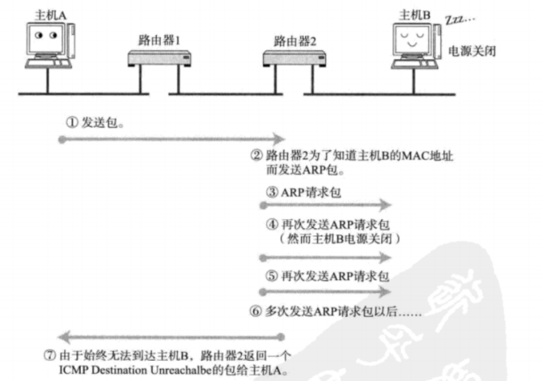

**ICMP的报文格式**

关于报文格式, 我们并不打算重点关注, 稍微有个了解即可

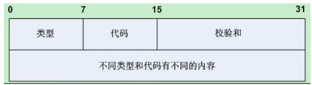

ICMP大概分为两类报文:

+ 一类是通知出错原因
+ 一类是用于诊断查询

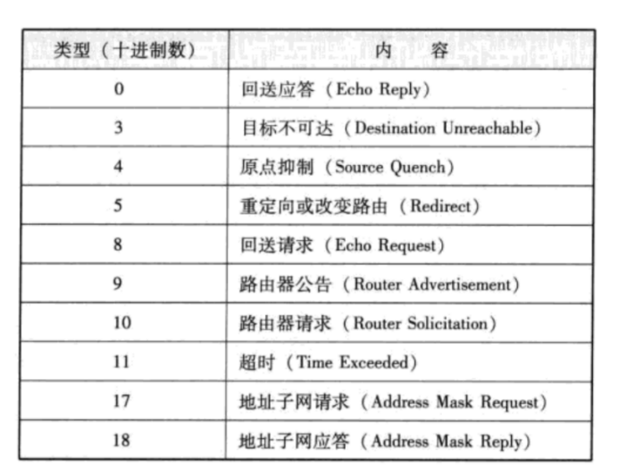

## ping命令
+ 注意, 此处 ping 的是域名, 而不是url! 一个域名可以通过DNS解析成IP地址.
+ ping命令不光能验证网络的连通性, 同时也会统计响应时间和TTL(IP包中的Time To Live, 生存周期).
+ ping命令会先发送一个 ICMP Echo Request给对端;
+ 对端接收到之后, 会返回一个ICMP Echo Reply

ping命令基本原理其实很简单，就是构建出不同生命周期报文，把TTL设置为1、2、3等等，比如说第一次TTL设置为1，然后ICMP报错，然后在构建一个报文TTL设为2 在发，最后知道对方主机收到了，通过这样的方式不就探测了从当前主机到远端主机需要经过多少跳数的路由器。

ping命令底层是通过使用ICMP协议，设置TTL跳数，然后进行检测网络连通性的一种做法。


**一个值得注意的坑**

有些人可能会问: telnet是23端口, ssh是22端口, 那么ping是什么端口?  
千万注意!!! 这是圈套  
  
ping命令基于ICMP, 是在网络层. 而端口号, 是传输层的内容. 在ICMP中根本就不关注端口号这样的信息.

## traceroute命令
能够打印出从当前主机到目的服务区所经过的路由器的IP地址。也是基于ICMP协议实现, 把TTL设置1、2、3等等发起多次ICMP，每个ICMP最终都要给我应答，所以最后再ICMP返回时把路上路由器信息返回给我。

安装：

```shell
apt install inetutils-traceroute
```

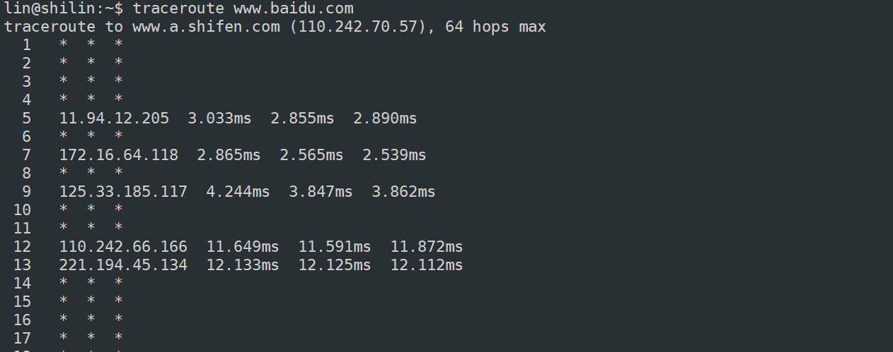

## 网线通信各层协议总结
**数据链路层**

+ 数据链路层的作用: 两个设备(同一种数据链路节点)之间进行传递数据
+ 以太网是一种技术标准; 既包含了数据链路层的内容, 也包含了一些物理层的内容. 例如: 规定了网络拓扑结构, 访问控制方式, 传输速率等;
+ 以太网帧格式
+ 理解mac地址
+ 理解arp协议
+ 理解MTU

**网络层**

+ 网络层的作用: 在复杂的网络环境中确定一个合适的路径.
+ 理解IP地址, 理解IP地址和MAC地址的区别.  
理解IP协议格式.
+ 了解网段划分方法
+ 理解如何解决IP数目不足的问题, 掌握网段划分的两种方案. 理解私有IP和公网IP
+ 理解网络层的IP地址路由过程. 理解一个数据包如何跨越网段到达最终目的地.
+ 理解IP数据包分包的原因.
+ 了解ICMP协议.
+ 了解NAT设备的工作原理.

**传输层**

+ 传输层的作用: 负责数据能够从发送端传输接收端.
+ 理解端口号的概念.
+ 认识UDP协议, 了解UDP协议的特点
+ 认识TCP协议, 理解TCP协议的可靠性. 理解TCP协议的状态转化.
+ 掌握TCP的连接管理, 确认应答, 超时重传, 滑动窗口, 流量控制, 拥塞控制, 延迟应答, 捎带应答特性.
+ 理解TCP面向字节流, 理解粘包问题和解决方案.
+ 能够基于UDP实现可靠传输.
+ 理解MTU对UDP/TCP的影响.

**应用层**

+ 应用层的作用: 满足我们日常需求的网络程序, 都是在应用层
+ 能够根据自己的需求, 设计应用层协议.
+ 了解HTTP协议.
+ 理解DNS的原理和工作流程.

