# Socket编程（TCP）
# TCP网络编程
TCP和UDP在编程接口上是非常像的，TCP是面向连接的，我们发现UDP服务端客户端写好启动直接就发消息了没有建立连接。**TCP是建立连接的**，注定在写的时候肯定有写不一样的地方。接下来看一下：

我们已经知道，云服务器不允许绑定公网IP，所以这里我们直接使用`INADDR_ANY`绑定任意IP，端口号自己指定就行了。

**初始化服务器：**

进行网络通信首先要创建套接字。

socket第二个参数我们要写成`SOCK_STREAM`对应TCP协议面向字节流。

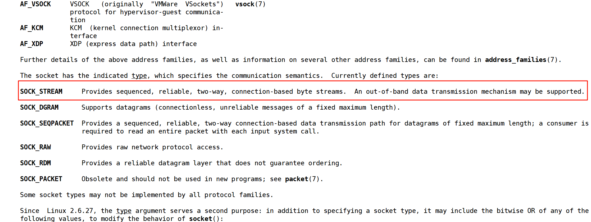

`_sock < 0`，说明套接字失败，那就没有必须进行了


## listen
TCP服务器是面向连接的，所以当别人给我发数据时候不能直接发数据，必须先和我建立连接，这就意味着服务器必须时时刻刻知道他向我发起连接请求。所以必须设置`socket`为监听状态(为了获取新连接)

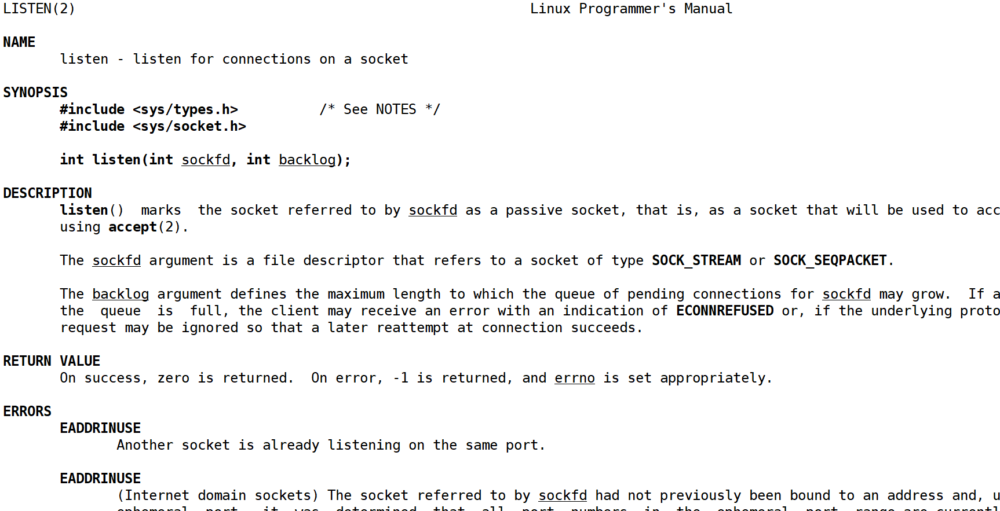

backlog：底层全连接队列的长度，这个参数在后面TCP协议的时候说 。

初始化服务器：**1.创建socket，2.bind，3.设置socket为监听状态**

## TcpEchoServer代码实现version1
```cpp
void Start()
{
    for (;;)
    {
        struct sockaddr_in peer;
        socklen_t len = sizeof(peer);
        int sockfd = accept(_listenSocketfd, (struct sockaddr *)&peer, &len);
        if (sockfd < 0)
        {
            LOG(LogLevel::WARNING) << "accept client error";
            continue;
        }

        InetAddr clientaddr(peer);

        LOG(LogLevel::INFO) << "获取新连接成功, sockfd: " << sockfd << " client addr: " << clientaddr.ToString();

        // 单进程 version1
        HandlerIO(sockfd, clientaddr);
    }
}
```

## accept
TCP不能直接发数据 ，因为它是面向连接的。通信之前必须要先获取连接，因此首先要获取新连接。

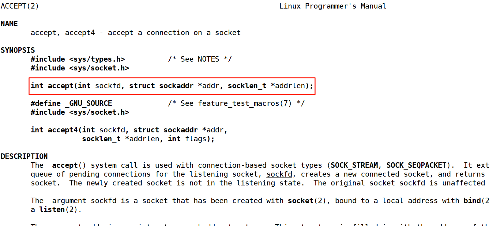

从这个`sockfd`这里获取新连接。

`accept`函数后两个参数和`recvfrom`是一模一样的，这两个参数的含义也是一样的都是输入输出型函数，将来谁连的我，远端的客户端的ip和port是多少。所以需要这两个参数把客户端消息获取上来。

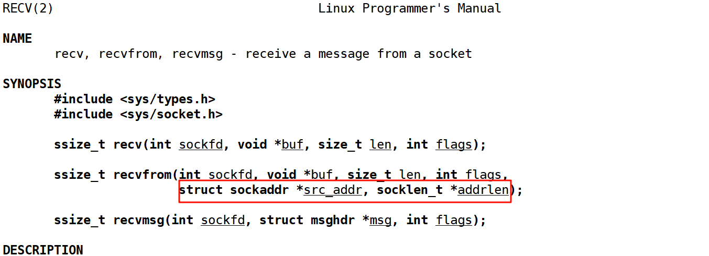

这些都不重要，最重要的是`accept`的返回值


成功时这个函数会从已接受的socket返回一个文件描述符！失败返回-1错误码被设置。

> 调用`accept`它的返回值也是文件描述符，而我们自己也建立一个文件描述符，那这两个文件描述符是什么意思？
>

下面举个例子理解：  
今天我和一群朋友去杭州西湖旅游，玩累了准备找个地方吃饭，假设来了一个地方都是卖鱼的，王家鱼庄、李家鱼庄、张家鱼庄等等。每一家鱼庄门口都有一个拉客的人，张三是王家鱼庄的门口拉客的人。我们走着走着张三过来了，小哥小哥你们要不要吃饭啊，我们这里的鱼都是从西湖打上来的。我们感觉可以试试，于是张三就带我和我的朋友到王家鱼庄，到了门口张三就向大厅呼唤李四过来接客把我们带进去，李四过来招呼我们，给我们倒水介绍特殊菜。当我们在享受李四给我们带来的服务时，张三去那了？张三自己有自己的业务，他把我们招呼过来之后，转头就走了，又跑到路边找下一位客人了。当我和我的朋友在吃饭的期间，发现我们周边越来越热闹了，张三带着客人来然后在门口喊着让其他人招呼客人。李四给我们提供服务，王五给别的客人提供服务等等。张三一直干着这一件事情。

张三 ： 拉客  
李四、王五、赵六。。。：提供服务

张三就相当于我们传给accept的创建好的文件描述符  
李四、王五、赵六。。。就相当于accept返回文件描述符

一个服务器可能被多个客户端来连接，李四、王五、赵六。。。每一个都是对应一个文件描述符对外提供服务的， 未来我们一旦建立好连接，服务器不能用创建好的文件描述符和客户端通信，就好比不能用张三给客人提供服务，而应该让accept的返回值文件描述符来给用户提供服务。

---

因为客户端和服务端通信需要【源ip ，目的ip】，【源端口，目的端口】，所以要bind。但是不需要显示bind，因为如果bind特定的端口，如果两个客户端都bind一样的端口，谁先启动谁成功bind，另一个就不能启动了。

1. 我们的客户端要不要listen？

> 不需要，服务器 listen是因为有人要连接它，客户端是发起连接的。
>

2. 那客户端要不要accept？

> 不需要，服务器accept也是因为有人要连接它，客户端是是发起连接的。
>

**那客户端到底要什么呢？****要发起连接！**

发现连接我们写到启动客户端里

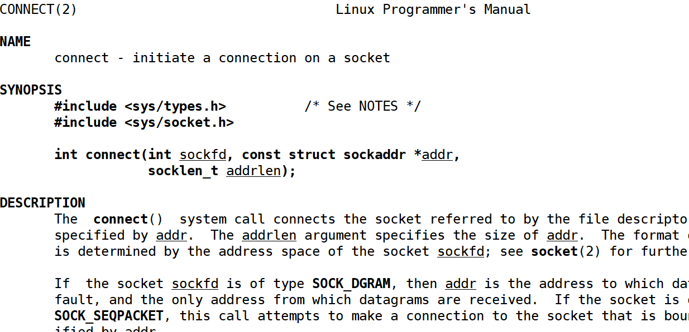

第一个参数通过哪个套接字发起连接  
第二个参数你要向那个ip和port的服务端发起连接  
第三个参数是这个结构体的长度


以前在udp是第一次sendto发现没有bind会调用bind绑定ip和port，而tcp这里是在connect会帮bind。

## client.cc
```cpp
#include <iostream>
#include <string>
#include <thread>
#include <cstring>
#include <unistd.h>
#include <sys/types.h>
#include <sys/socket.h>
#include <netinet/in.h>
#include <arpa/inet.h>


#include "Comm.hpp"
#include "InetAddr.hpp"

void Usage(std::string proc)
{
    std::cerr << "Usage: " << proc << " <serverip> <serverport>" << std::endl;
}

int main(int argc, char *argv[])
{
    if (argc != 3)
    {
        Usage(argv[0]);
        exit(0);
    }

    std::string serverip = argv[1];
    uint16_t serverport = std::stoi(argv[2]);

    int sockfd = socket(AF_INET, SOCK_STREAM, 0);
    if(sockfd < 0)
    {
        std::cerr << "create client socket error" << std::endl;
        exit(SOCKET_CREATE_ERR);
    }

    InetAddr server(serverport, serverip);
    if(connect(sockfd, server.Addr(), server.Length()) != 0)
    {
        std::cerr << "connect server error" << std::endl;
        exit(SOCKET_CONNECT_ERR);
    }

    std::cout << "connect " << server.ToString() << " success " << std::endl;

    for(;;)
    {
        std::cout << "Please Enter# ";
        std::string line;
        std::getline(std::cin, line);

        ssize_t n = write(sockfd, line.c_str(), line.size());
        if(n >= 0)
        {
            char buffer[1024];
            ssize_t m = read(sockfd, buffer, sizeof(buffer) - 1);
            if(m > 0)
            {
                buffer[m] = 0;
                std::cout << buffer << std::endl;
            }
        }
    }

    return 0;
}
```

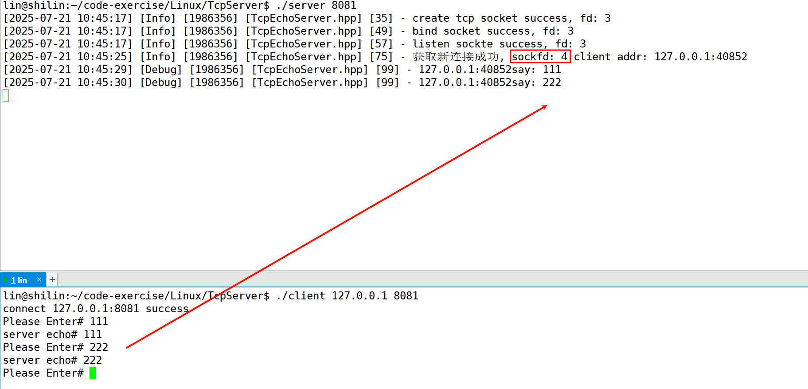

为什么服务这里打印出来的文件描述符是4呢？  
因为默认打开三个文件，0，1，2被占了，3被`listensock`占了，所以这里打印的是4

```shell
netstat -ntap  //查看所有处于tcp的进程
```

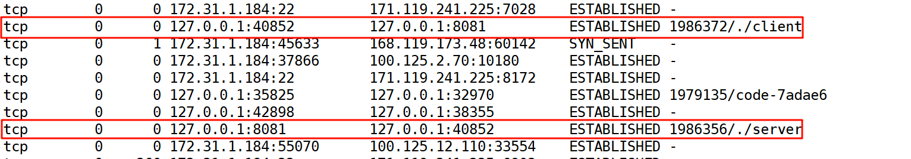  
我们确实看到客户端发起的连接已经被服务端看到了并且连接了。  
这里的问题为什么有两条连接呢？正常情况下不是一条连接吗？  
一般而言，TCP确实在查找的时候建立连接成功，只会有一条连接！！！  
但是今天我们做测试，客户端和服务端是在一台机器上的！！！  
如果是两台主机，你是服务端你看到的就是上面的，你是客户端你看到的是下面的。即便只有一条连接也是全双工的！

---

关闭客户端：

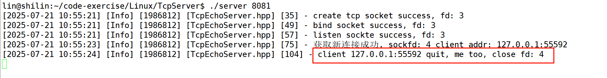  
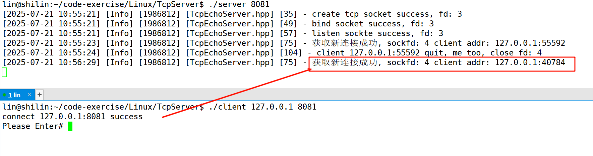这里可以看到客户端关了服务端立马读到了，客户端在连这个文件又变成4了，这说明客户端一关闭服务端就将刚刚的文件描述符关了，关了之后你在连接我给你的还是4，此时文件描述符就被重复使用了。

---

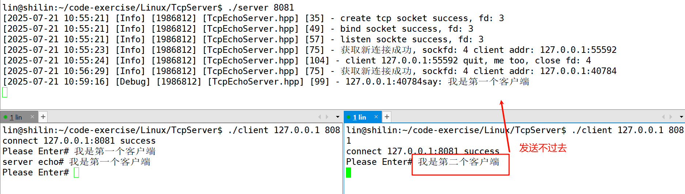

当我又开一个客户端去连接然后给服务端发送消息的时候，服务端并不会显示，只有当我把上一个客户端关闭后，然后才获取到新连接，这个文件描述符还是4，才会把我发的消息接收。

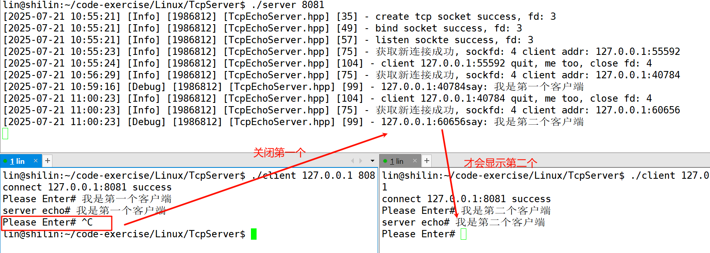

这是因为刚才所写的服务器，我们获取一个新连接之后，然后进程就去serverIO提供死循环服务了。人家不退，服务器就一直在HandlerIO给人家提供服务。

# Server 多进程版本
获取新连接之后创建子进程，创建子进程，父进程的文件描述符会被子进程继承的，文件描述符所指的文件也都是一样的。所以说父进程曾经打开的`listensock`以及`sock`子进程都能看到。

> 创建子进程，让子进程对外提供服务。
>

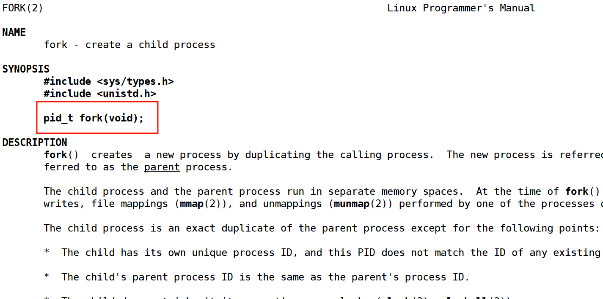

这里要注意父进程的文件描述符被子进程继承下来了，但是父进程可是打开了多个文件描述符，所以子进程最少把自己的不需要的文件描述符关掉。

那父进程要干什么呢？

> 根据以前在进程哪里所学知识，父进程当然是要阻塞或者非阻塞等待回收子进程的资源了，否则子进程退出变成僵尸进程了，就造成内存资源泄漏了
>

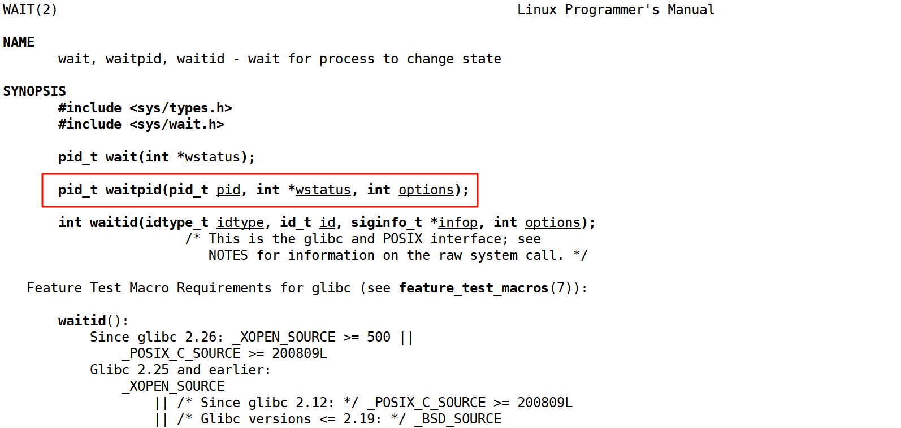

但是这里要等待的时候，选择阻塞式等待还是非阻塞等待？

> 选择阻塞式等待，那不还是串行执行吗，属于脱裤子放屁多此一举创建子进程。选择非阻塞式等待，万一没有新连接来了一直在accept哪里等着连接，对子进程资源可能并没有回收干净造成内存资源泄漏。所以选择非阻塞式等待并不好！
>

**如果非要让你阻塞式等待，要怎么做？**

这里是这样做的，让子进程关闭`listensock`之后，子进程在创建一个子进程也就是孙子进程，让子进程退出！孙子进程提供服务。因为子进程退出了所以父进程等待会立马成功，然后继续向下执行代码。虽然父进程回收了子进程资源，但是并不影响孙子进程提供服务，等孙子进程提供完服务自己退出。你是孙子进程和父进程没有半毛钱关系(各管各儿子)，孙子进程是一个孤儿进程，孤儿进程会被操作系统领养然后等它退了回收它。

```cpp
void Start()
{
    for (;;)
    {
        struct sockaddr_in peer;
        socklen_t len = sizeof(peer);
        int sockfd = accept(_listenSocketfd, (struct sockaddr *)&peer, &len);
        if (sockfd < 0)
        {
            LOG(LogLevel::WARNING) << "accept client error";
            continue;
        }

        InetAddr clientaddr(peer);

        LOG(LogLevel::INFO) << "获取新连接成功, sockfd: " << sockfd << " client addr: " << clientaddr.ToString();

        // version2
        pid_t id = fork();
        if (id < 0)
        {
            LOG(LogLevel::FATAL) << "资源不足，创建子进程失败";
            exit(FORK_ERR);
        }
        else if (id == 0)
        {
            close(_listenSocketfd); // 关闭
            if (fork() > 0)
                exit(OK);

            // 让孙子进程处理任务
            HandlerIO(sockfd, clientaddr);
            exit(OK);
        }
        else
        {
            waitpid(id, nullptr, 0);
        }
    }
}
```

测试：

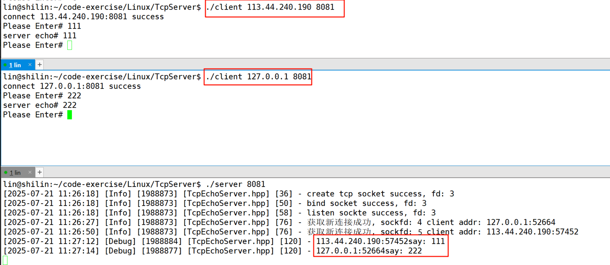

看到现在可以多个用户同时连接了。但是多进程并不是一个好方法，因此子进程要拷贝一份父进程的东西。

上面还需要父进程自己回收子进程的资源太麻烦，我们知道子进程退出并不是默默退出的，它会发17号信号，不过系统默认对这个信号是忽略。

因此这里我们让子进程退出然后资源自动被回收。父进程自己忙自己的事情。

```cpp
void Start()
{
    signal(SIGCHLD, SIG_IGN); // 忽略子进程退出的信号
    for (;;)
    {
        struct sockaddr_in peer;
        socklen_t len = sizeof(peer);
        int sockfd = accept(_listenSocketfd, (struct sockaddr *)&peer, &len);
        if (sockfd < 0)
        {
            LOG(LogLevel::WARNING) << "accept client error";
            continue;
        }

        InetAddr clientaddr(peer);

        LOG(LogLevel::INFO) << "获取新连接成功, sockfd: " << sockfd << " client addr: " << clientaddr.ToString();

        // version2
        pid_t id = fork();
        if (id < 0)
        {
            LOG(LogLevel::FATAL) << "资源不足，创建子进程失败";
            exit(FORK_ERR);
        }
        else if (id == 0)
        {
            close(_listenSocketfd); // 关闭
            if (fork() > 0)
                exit(OK);

            // 让孙子进程处理任务
            HandlerIO(sockfd, clientaddr);
            exit(OK);
        }
        else
        {
            waitpid(id, nullptr, 0);
        }
    }
}
```

这里有个问题，子进程关闭了不用的listensock文件描述符，父进程要不要关闭sock文件描述符？

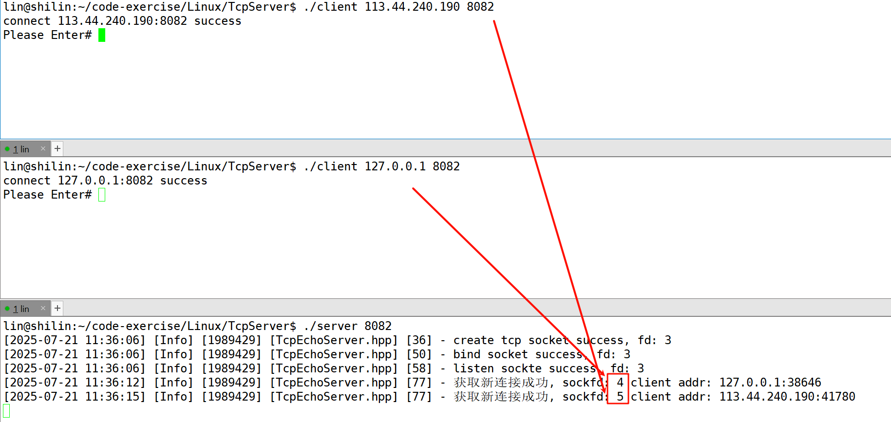

父进程没关sock文件描述符，客户端关闭后再连接，文件描述符是一直增长的状态。文件描述符终有用完的时候！

所以父进程一定要关闭提供服务的sock文件描述符，虽然父进程关闭sock但它不会造成文件关闭，因为有引用计数，等到引用计数到0的时候这个文件才会真正的关闭！

## TcpEchoServer代码实现version2
```cpp
void Start()
{
    signal(SIGCHLD, SIG_IGN); // 忽略子进程退出的信号
    for (;;)
    {
        struct sockaddr_in peer;
        socklen_t len = sizeof(peer);
        int sockfd = accept(_listenSocketfd, (struct sockaddr *)&peer, &len);
        if (sockfd < 0)
        {
            LOG(LogLevel::WARNING) << "accept client error";
            continue;
        }

        InetAddr clientaddr(peer);

        LOG(LogLevel::INFO) << "获取新连接成功, sockfd: " << sockfd << " client addr: " << clientaddr.ToString();

        // 单进程 version1
        pid_t id = fork();
        if (id < 0)
        {
            LOG(LogLevel::FATAL) << "资源不足，创建子进程失败";
            exit(FORK_ERR);
        }
        else if (id == 0)
        {
            close(_listenSocketfd); // 关闭
            if (fork() > 0)
                exit(OK);

            // 让孙子进程处理任务
            HandlerIO(sockfd, clientaddr);
            exit(OK);
        }
        else
        {
            close(sockfd); // 父进程需要关闭
            waitpid(id, nullptr, 0);
        }
    }
}
```

测试：

这样就不会浪费文件描述符了

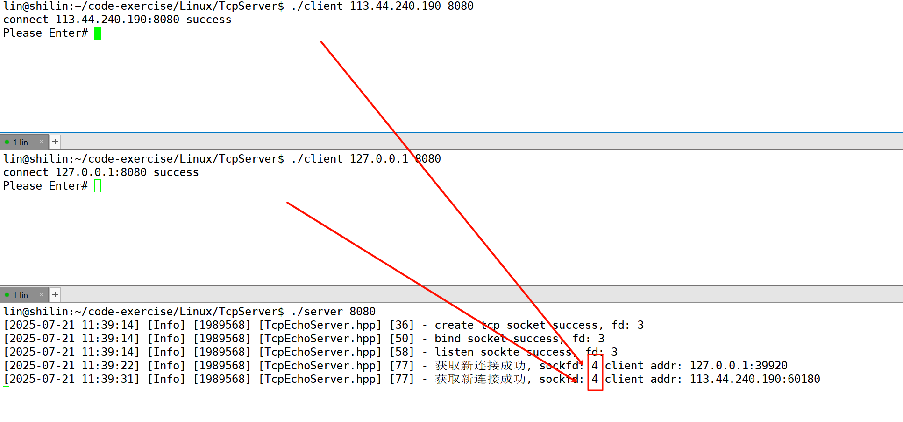

# Server 多线程版
现在我们想用线程来解决为多人提供服务。

创建新线程，那主线程和新线程之间多文件描述符的态度是什么？  
这个sock文件描述符能不能被新线程看到呢？

> 能！它们共享同一份资源！这里也不用敢像多进程那样让父子进程关闭对应的文件描述符那样做。它们共享同一份资源！
>

新线程创建好了，主线程也要回收新线程的资源。以前用的是pthread_join，但是在后面我们学过可以使用pthread_deatch进行线程分离，主线程就不用等了。

## TcpEchoServer代码实现version3
```cpp
class ThreadData
{
public:
    ThreadData(int sockfd, TcpEchoServer *self, const InetAddr &addr)
        : _sockfd(sockfd), _self(self), _addr(addr)
    {
    }
    // private:
    int _sockfd;
    TcpEchoServer *_self;
    InetAddr _addr;
};

static void *Routine(void *args)
{
    ThreadData *td = static_cast<ThreadData *>(args);
    pthread_detach(pthread_self());               // 分离线程
    td->_self->HandlerIO(td->_sockfd, td->_addr); // 处理任务

    delete td;
    return nullptr;
}

void Start()
{
    for (;;)
    {
        struct sockaddr_in peer;
        socklen_t len = sizeof(peer);
        int sockfd = accept(_listenSocketfd, (struct sockaddr *)&peer, &len);
        if (sockfd < 0)
        {
            LOG(LogLevel::WARNING) << "accept client error";
            continue;
        }

        InetAddr clientaddr(peer);

        LOG(LogLevel::INFO) << "获取新连接成功, sockfd: " << sockfd << " client addr: " << clientaddr.ToString();

        // 多线程版本 version3
        pthread_t tid;
        ThreadData *td = new ThreadData(sockfd, this, clientaddr);
        pthread_create(&tid, nullptr, Routine, (void *)td); // 创建线程
    }
}
```

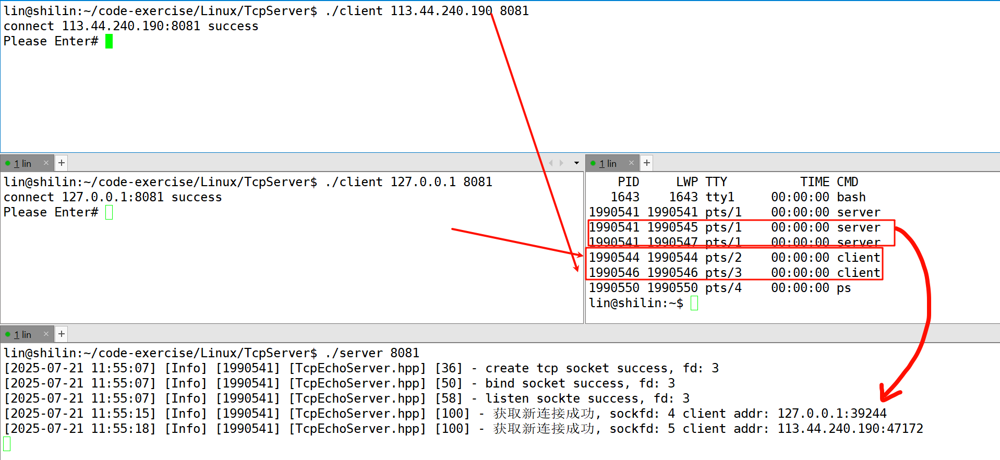

# Server 线程池版
思路是这样的，未来新连接来了，我们可以把新连接构成一个任务，然后放到线程池里，由线程池来进行统一处理。

## TcpEchoServer代码实现version4
```cpp
void Start()
{
    for (;;)
    {
        struct sockaddr_in peer;
        socklen_t len = sizeof(peer);
        int sockfd = accept(_listenSocketfd, (struct sockaddr *)&peer, &len);
        if (sockfd < 0)
        {
            LOG(LogLevel::WARNING) << "accept client error";
            continue;
        }

        InetAddr clientaddr(peer);

        LOG(LogLevel::INFO) << "获取新连接成功, sockfd: " << sockfd << " client addr: " << clientaddr.ToString();
    
        // 进程池版本 version4
        ThreadPool<task_t>::getInstance()->Push([this, sockfd, clientaddr](){
            this->HandlerIO(sockfd, clientaddr);
        });
    }
}

private:
    using task_t = std::function<void()>;
```

测试：

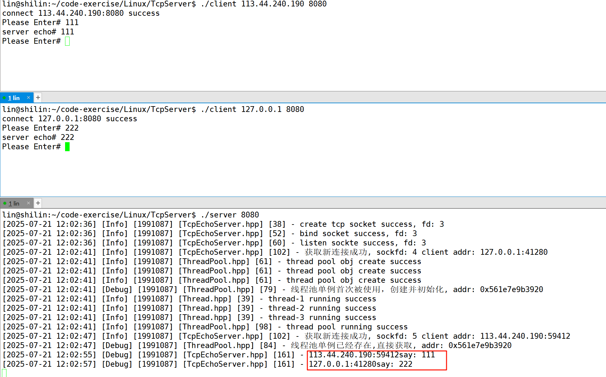

# 实现全部代码TcpEchoServer.hpp
```cpp
#ifndef TCP_ECHO_SERVER_HPP
#define TCP_ECHO_SERVER_HPP

#include <iostream>
#include <string>
#include <cstring>
#include <functional>
#include <sys/types.h>
#include <sys/wait.h>
#include <sys/socket.h>
#include <arpa/inet.h>
#include <netinet/in.h>

#include "Logger.hpp"
#include "Comm.hpp"
#include "InetAddr.hpp"
#include "ThreadPool.hpp"

const int gbacklog = 8;

class TcpEchoServer
{
public:
    TcpEchoServer(uint16_t port = 8080)
        : _listenSocketfd(-1), _port(port)
    {
    }

    void Init()
    {
        // 1. socket
        _listenSocketfd = socket(AF_INET, SOCK_STREAM, 0);
        if (_listenSocketfd < 0)
        {
            LOG(LogLevel::FATAL) << "create tcp socket error";
            exit(SOCKET_CREATE_ERR);
        }
        LOG(LogLevel::INFO) << "create tcp socket success, fd: " << _listenSocketfd;

        // 2. bind
        struct sockaddr_in local;
        bzero(&local, sizeof(local));
        local.sin_family = AF_INET;
        local.sin_port = htons(_port);
        local.sin_addr.s_addr = htonl(INADDR_ANY);

        if (bind(_listenSocketfd, (struct sockaddr *)&local, sizeof(local)) != 0)
        {
            LOG(LogLevel::FATAL) << "bind socket error";
            exit(SOCKET_BIND_ERR);
        }
        LOG(LogLevel::INFO) << "bind socket success, fd: " << _listenSocketfd;

        // 3. listen
        if (listen(_listenSocketfd, gbacklog) != 0)
        {
            LOG(LogLevel::FATAL) << "listen sockte error";
            exit(SOCKTE_LISTEN_ERR);
        }
        LOG(LogLevel::INFO) << "listen sockte success, fd: " << _listenSocketfd;
    }

    // class ThreadData
    // {
    // public:
    //     ThreadData(int sockfd, TcpEchoServer *self, const InetAddr &addr)
    //         : _sockfd(sockfd), _self(self), _addr(addr)
    //     {
    //     }
    //     // private:
    //     int _sockfd;
    //     TcpEchoServer *_self;
    //     InetAddr _addr;
    // };

    // static void *Routine(void *args)
    // {
    //     ThreadData *td = static_cast<ThreadData *>(args);
    //     pthread_detach(pthread_self());               // 分离线程
    //     td->_self->HandlerIO(td->_sockfd, td->_addr); // 处理任务

    //     delete td;
    //     return nullptr;
    // }

    void Start()
    {
        // signal(SIGCHLD, SIG_IGN); // 忽略子进程退出的信号
        for (;;)
        {
            struct sockaddr_in peer;
            socklen_t len = sizeof(peer);
            int sockfd = accept(_listenSocketfd, (struct sockaddr *)&peer, &len);
            if (sockfd < 0)
            {
                LOG(LogLevel::WARNING) << "accept client error";
                continue;
            }

            InetAddr clientaddr(peer);

            LOG(LogLevel::INFO) << "获取新连接成功, sockfd: " << sockfd << " client addr: " << clientaddr.ToString();

            // 单进程 version1
            // HandlerIO(sockfd, clientaddr);

            // 多进程 version2
            // pid_t id = fork();
            // if (id < 0)
            // {
            //     LOG(LogLevel::FATAL) << "资源不足，创建子进程失败";
            //     exit(FORK_ERR);
            // }
            // else if (id == 0)
            // {
            //     close(_listenSocketfd); // 关闭
            //     if (fork() > 0)
            //         exit(OK);

            //     // 让孙子进程处理任务
            //     HandlerIO(sockfd, clientaddr);
            //     exit(OK);
            // }
            // else
            // {
            //     close(sockfd); // 父进程需要关闭
            //     waitpid(id, nullptr, 0);
            // }

            // 多线程版本 version3
            // pthread_t tid;
            // ThreadData *td = new ThreadData(sockfd, this, clientaddr);
            // pthread_create(&tid, nullptr, Routine, (void *)td); // 创建线程
        
            // 进程池版本 version4
            ThreadPool<task_t>::getInstance()->Push([this, sockfd, clientaddr](){
                this->HandlerIO(sockfd, clientaddr);
            });
        }
    }

    ~TcpEchoServer()
    {
    }

private:
    using task_t = std::function<void()>;

    void HandlerIO(int sockfd, InetAddr client)
    {
        char buffer[1024];
        for (;;)
        {
            buffer[0] = 0;
            ssize_t n = read(sockfd, buffer, sizeof(buffer) - 1);
            if (n > 0)
            {
                buffer[n] = 0;
                std::string echo_string = "server echo# ";
                echo_string += buffer;
                LOG(LogLevel::DEBUG) << client.ToString() << "say: " << buffer;
                write(sockfd, echo_string.c_str(), echo_string.size());
            }
            else if (n == 0)
            {
                LOG(LogLevel::INFO) << "client "
                                    << client.ToString() << " quit, me too, close fd: " << sockfd;
                break;
            }
            else
            {
                LOG(LogLevel::WARNING) << "read client "
                                       << client.ToString() << " error, sockfd : " << sockfd;
                break;
            }
        }
        close(sockfd); // 需要关闭，要不然会导致文件描述符泄露
    }

private:
    int _listenSocketfd;
    uint16_t _port;
};

#endif // TCP_ECHO_SERVER_HPP
```

# 实现远程命令版本
希望服务端能在自己的服务器上执行成功并且把结构返回给客户端。  
我们这里写的是简单的，有些命令不能执行。

只需要再写一个完成这样任务的业务逻辑就好了，这就是解耦的好处！

这里我们需要用`popen`接口，这样就不需要我们像以前实现`myshell`那样，创建子进程然后在子进程中调用`exec*`系列的函数执行程序替换，那样麻烦了。

这个创建管道，创建子进程，子进程进行程序替换

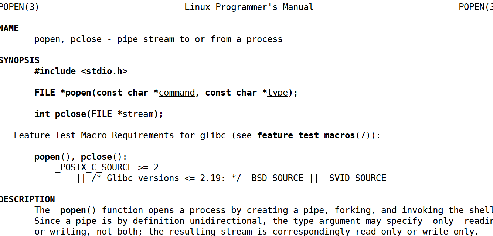

popen相当于做了`pipe+fork+exec*`的工作  
command：未来要执行的命令字符串  
返回类型FILE * ：通过管道以文件的方式把对应的执行结果写到文件中  
type：对这个文件以什么方式打开 “w”、“r”等等

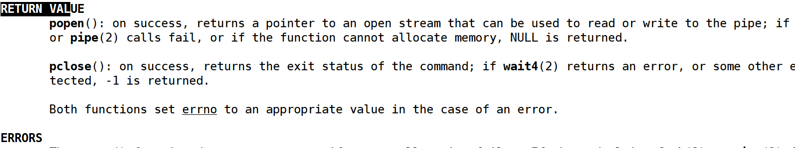

失败返回NULL，要不是fork创建子进程失败，要不pipe创建管道失败，要不内存申请失败

---

我这里实现使用的是白名单模式，防止其他人在使用客户端的时候使用rm命令删除我机器上的文件

## Command.hpp
```cpp
#ifndef __COMMAND_HPP__
#define __COMMAND_HPP__

#include <vector>
#include <string>

class Command
{
private:
    bool IsSafe(const std::string &cmd)
    {
        for (auto &s : _command_white_list)
        {
            if (cmd == s)
            {
                return true;
            }
        }
        return false;
    }

public:
    Command()
    {
        _command_white_list.push_back("ls -a -l");
        _command_white_list.push_back("tree");
        _command_white_list.push_back("whoami");
        _command_white_list.push_back("who");
        _command_white_list.push_back("pwd");
    }

    std::string Exec(const std::string &cmd)
    {
        if (!IsSafe(cmd))
        {
            return "cannot execute this command!";
        }
        std::string result;
        FILE *fp = popen(cmd.c_str(), "r");
        if (!fp)
        {
            result = cmd + "exec error";
        }
        else
        {
            char buffer[1024];
            while (fgets(buffer, sizeof(buffer), fp))
            {
                result += buffer;
            }
            pclose(fp);
        }
        return result;
    }

private:
    std::vector<std::string> _command_white_list;
};

#endif
```

测试

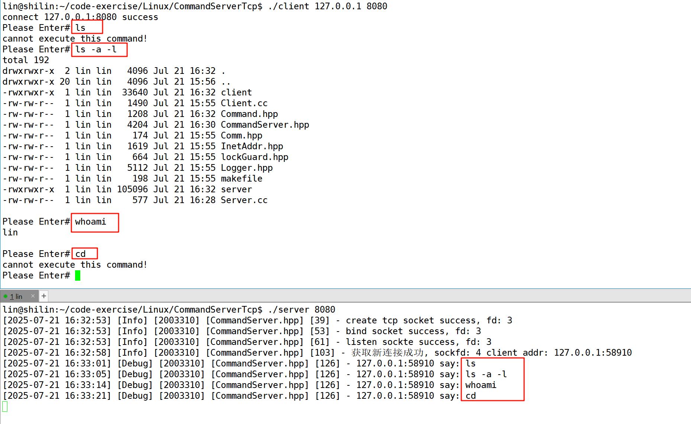

## CommandServer.hpp
服务端只需要修改一部分

1. 回调函数，交给上层进行处理
2. 这里就使用线程来执行任务

```cpp
#ifndef TCP_ECHO_SERVER_HPP
#define TCP_ECHO_SERVER_HPP

#include <iostream>
#include <string>
#include <cstring>
#include <functional>
#include <sys/types.h>
#include <sys/wait.h>
#include <sys/socket.h>
#include <arpa/inet.h>
#include <netinet/in.h>

#include "Logger.hpp"
#include "Comm.hpp"
#include "InetAddr.hpp"

const int gbacklog = 8;

using callback_t = std::function<std::string(const std::string &)>;

class CommandServer
{
public:
    CommandServer(callback_t cb, uint16_t port = 8080)
        : _listenSocketfd(-1), _port(port), _cb(cb)
    {
    }

    void Init()
    {
        // 1. socket
        _listenSocketfd = socket(AF_INET, SOCK_STREAM, 0);
        if (_listenSocketfd < 0)
        {
            LOG(LogLevel::FATAL) << "create tcp socket error";
            exit(SOCKET_CREATE_ERR);
        }
        LOG(LogLevel::INFO) << "create tcp socket success, fd: " << _listenSocketfd;

        // 2. bind
        struct sockaddr_in local;
        bzero(&local, sizeof(local));
        local.sin_family = AF_INET;
        local.sin_port = htons(_port);
        local.sin_addr.s_addr = htonl(INADDR_ANY);

        if (bind(_listenSocketfd, (struct sockaddr *)&local, sizeof(local)) != 0)
        {
            LOG(LogLevel::FATAL) << "bind socket error";
            exit(SOCKET_BIND_ERR);
        }
        LOG(LogLevel::INFO) << "bind socket success, fd: " << _listenSocketfd;

        // 3. listen
        if (listen(_listenSocketfd, gbacklog) != 0)
        {
            LOG(LogLevel::FATAL) << "listen sockte error";
            exit(SOCKTE_LISTEN_ERR);
        }
        LOG(LogLevel::INFO) << "listen sockte success, fd: " << _listenSocketfd;
    }

    class ThreadData
    {
    public:
        ThreadData(int sockfd, CommandServer *self, const InetAddr &addr)
            : _sockfd(sockfd), _self(self), _addr(addr)
        {
        }
        // private:
        int _sockfd;
        CommandServer *_self;
        InetAddr _addr;
    };

    static void *Routine(void *args)
    {
        ThreadData *td = static_cast<ThreadData *>(args);
        pthread_detach(pthread_self());               // 分离线程
        td->_self->HandlerIO(td->_sockfd, td->_addr); // 处理任务

        delete td;
        return nullptr;
    }

    void Start()
    {
        // signal(SIGCHLD, SIG_IGN); // 忽略子进程退出的信号
        for (;;)
        {
            struct sockaddr_in peer;
            socklen_t len = sizeof(peer);
            int sockfd = accept(_listenSocketfd, (struct sockaddr *)&peer, &len);
            if (sockfd < 0)
            {
                LOG(LogLevel::WARNING) << "accept client error";
                continue;
            }

            InetAddr clientaddr(peer);

            LOG(LogLevel::INFO) << "获取新连接成功, sockfd: " << sockfd << " client addr: " << clientaddr.ToString();

            pthread_t tid;
            ThreadData *td = new ThreadData(sockfd, this, clientaddr);
            pthread_create(&tid, nullptr, Routine, (void *)td);
        }
    }

    ~CommandServer()
    {
    }

private:
    void HandlerIO(int sockfd, InetAddr client)
    {
        char buffer[1024];
        for (;;)
        {
            buffer[0] = 0;
            ssize_t n = read(sockfd, buffer, sizeof(buffer) - 1);
            if (n > 0)
            {
                buffer[n] = 0;
                LOG(LogLevel::DEBUG) << client.ToString() << " say: " << buffer;
                std::string result = _cb(buffer);
                write(sockfd, result.c_str(), result.size());
            }
            else if (n == 0)
            {
                LOG(LogLevel::INFO) << "client "
                                    << client.ToString() << " quit, me too, close fd: " << sockfd;
                break;
            }
            else
            {
                LOG(LogLevel::WARNING) << "read client "
                                       << client.ToString() << " error, sockfd : " << sockfd;
                break;
            }
        }
        close(sockfd); // 需要关闭，要不然会导致文件描述符泄露
    }

private:
    int _listenSocketfd;
    uint16_t _port;
    callback_t _cb;
};

#endif // TCP_ECHO_SERVER_HPP
```

## Client.cc
```cpp
#include <iostream>
#include <string>
#include <thread>
#include <cstring>
#include <unistd.h>
#include <sys/types.h>
#include <sys/socket.h>
#include <netinet/in.h>
#include <arpa/inet.h>


#include "Comm.hpp"
#include "InetAddr.hpp"

void Usage(std::string proc)
{
    std::cerr << "Usage: " << proc << " <serverip> <serverport>" << std::endl;
}

int main(int argc, char *argv[])
{
    if (argc != 3)
    {
        Usage(argv[0]);
        exit(0);
    }

    std::string serverip = argv[1];
    uint16_t serverport = std::stoi(argv[2]);

    int sockfd = socket(AF_INET, SOCK_STREAM, 0);
    if(sockfd < 0)
    {
        std::cerr << "create client socket error" << std::endl;
        exit(SOCKET_CREATE_ERR);
    }

    InetAddr server(serverport, serverip);
    if(connect(sockfd, server.Addr(), server.Length()) != 0)
    {
        std::cerr << "connect server error" << std::endl;
        exit(SOCKET_CONNECT_ERR);
    }

    std::cout << "connect " << server.ToString() << " success " << std::endl;

    for(;;)
    {
        std::cout << "Please Enter# ";
        std::string line;
        std::getline(std::cin, line);

        ssize_t n = write(sockfd, line.c_str(), line.size());
        if(n >= 0)
        {
            char buffer[1024];
            ssize_t m = read(sockfd, buffer, sizeof(buffer) - 1);
            if(m > 0)
            {
                buffer[m] = 0;
                std::cout << buffer << std::endl;
            }
        }
        
    }

    return 0;
}

```

## Server.cc
```cpp
#include "Command.hpp"
#include "CommandServer.hpp"
#include <memory>


void Usage(std::string proc)
{
    std::cerr << "Usage : " << proc << " <prot>" << std::endl;
}


int main(int argc, char *argv[])
{
    if(argc != 2)
    {
        Usage(argv[0]);
        exit(0);
    }

    uint16_t port = std::stoi(argv[1]);

    // 要执行命令对象
    Command cmdobj;

    std::unique_ptr<CommandServer> server = std::make_unique<CommandServer>([&cmdobj](const std::string &cmd)->std::string{
        return cmdobj.Exec(cmd);
    }, port);
    
    server->Init();
    server->Start();

    return 0;
}

```

# 地址转换函数
我们通常用点分十进制的字符串表示IP地址,以下函数可以在字符串表示 和in_addr表示之间转换；

字符串转`in_addr`的函数:

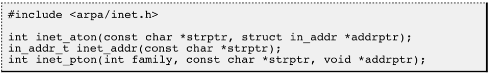

`in_addr`转字符串的函数:

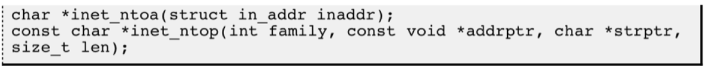

其中inet_pton和inet_ntop不仅可以转换IPv4的in_addr,还可以转换IPv6的in6_addr,因此函数接口是`void *addrptr`。

## 关于inet_ntoa
inet_ntoa这个函数返回了一个char*, 很显然是这个函数自己在内部为我们申请了一块内存来保存ip的结果. 那么是否需要调用者手动释放呢?

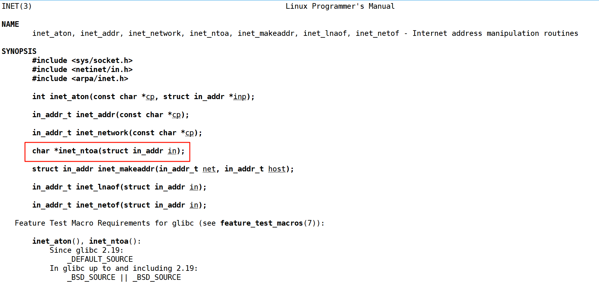

man手册上说, inet_ntoa函数, 是把这个返回结果放到了静态存储区. 这个时候不需要我们手动进行释放.

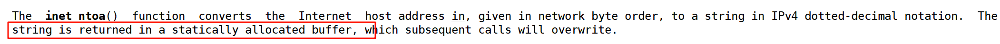

因为inet_ntoa把结果放到自己内部的一个静态存储区, 这样第二次调用时的结果会覆盖掉上一次的结果

所以在多线程环境下, 推荐使用`inet_ntop`, 这个函数由调用者提供一个缓冲区保存结果, 可以规避线程安全问题

网络转主机

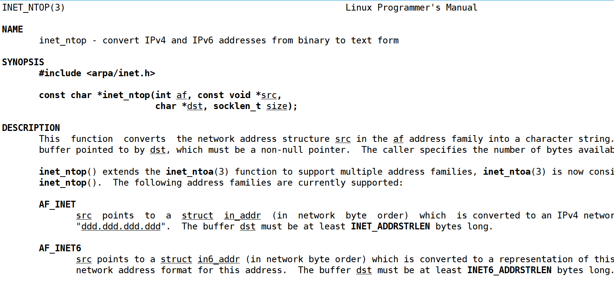

网络转主机

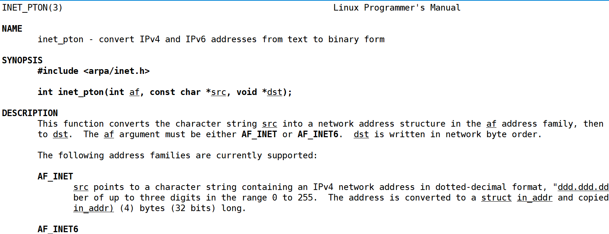


## InetAddr.hpp
```cpp
#ifndef INET_ADDR_HPP
#define INET_ADDR_HPP

#include <iostream>
#include <string>
#include <sys/types.h>
#include <sys/socket.h>
#include <netinet/in.h>
#include <arpa/inet.h>
#include <cstring>

class InetAddr
{
private:
    void Host2Net()
    {
        bzero(&_addr, sizeof(_addr));
        _addr.sin_family = AF_INET; // 使用IPv4地址族
        _addr.sin_port = htons(_port);
        // _addr.sin_addr.s_addr = inet_addr(_ip.c_str()); // 线程不安全

        inet_pton(AF_INET, _ip.c_str(), &(_addr.sin_addr.s_addr)); // 线程安全  
    }
    void Net2Host()
    {
        _port = ntohs(_addr.sin_port);
        // _ip = inet_ntoa(_addr.sin_addr); // 线程不安全
        
        char buffer[64];
        inet_ntop(AF_INET, &(_addr.sin_addr.s_addr), buffer, sizeof(buffer)); // 建议使用
    }

public:
    InetAddr(struct sockaddr_in &addr)
        : _addr(addr)
    {
        Net2Host(); // 将网络字节序转换为主机字节序
    }

    InetAddr(uint16_t &port, const std::string &ip = "0.0.0.0")
        : _port(port), _ip(ip)
    {
        Host2Net(); // 将主机字节序转换为网络字节序
    }

    const std::string &IP() const { return _ip; }
    uint16_t Port() const { return _port; }

    const struct sockaddr *Addr() const
    {
        return reinterpret_cast<const struct sockaddr *>(&_addr);
    }
    struct sockaddr *Addr()
    {
        return reinterpret_cast<struct sockaddr *>(&_addr);
    }
    socklen_t Length() const
    {
        return sizeof(_addr);
    }

    std::string ToString() const
    {
        return _ip + ":" + std::to_string(_port);
    }

    bool operator==(const InetAddr &addr) const
    {
        return (_ip == addr._ip) && (_port == addr._port);
    }

    ~InetAddr()
    {
    }

private:
    struct sockaddr_in _addr;
    std::string _ip;
    uint16_t _port;
};

#endif // INET_ADDR_HPP
```

# windows客户端与linux服务端交汇
和udp一样：

```cpp
#include <winsock2.h>
#include <iostream>
#include <string>

#pragma warning(disable : 4996)

#pragma comment(lib, "ws2_32.lib")

std::string serverip = "113.44.240.190";  // 填写你的云服务器ip
uint16_t serverport = 8080; // 填写你的云服务开放的端口号

int main()
{
    WSADATA wsaData;
    int result = WSAStartup(MAKEWORD(2, 2), &wsaData);
    if (result != 0)
    {
        std::cerr << "WSAStartup failed: " << result << std::endl;
        return 1;
    }

    SOCKET clientSocket = socket(AF_INET, SOCK_STREAM, IPPROTO_TCP);
    if (clientSocket == INVALID_SOCKET)
    {
        std::cerr << "socket failed" << std::endl;
        WSACleanup();
        return 1;
    }

    sockaddr_in serverAddr;
    serverAddr.sin_family = AF_INET;
    serverAddr.sin_port = htons(serverport);                  // 替换为服务器端口
    serverAddr.sin_addr.s_addr = inet_addr(serverip.c_str()); // 替换为服务器IP地址

    result = connect(clientSocket, (SOCKADDR*)&serverAddr, sizeof(serverAddr));
    if (result == SOCKET_ERROR)
    {
        std::cerr << "connect failed" << std::endl;
        closesocket(clientSocket);
        WSACleanup();
        return 1;
    }
    while (true)
    {
        std::string message;
        std::cout << "Please Enter@ ";
        std::getline(std::cin, message);
        if (message.empty()) continue;
        send(clientSocket, message.c_str(), message.size(), 0);

        char buffer[1024] = { 0 };
        int bytesReceived = recv(clientSocket, buffer, sizeof(buffer) - 1, 0);
        if (bytesReceived > 0)
        {
            buffer[bytesReceived] = '\0'; // 确保字符串以 null 结尾
            std::cout << "Received from server: " << buffer << std::endl;
        }
        else
        {
            std::cerr << "recv failed" << std::endl;
        }
    }

    closesocket(clientSocket);
    WSACleanup();

    return 0;
}
```

测试：

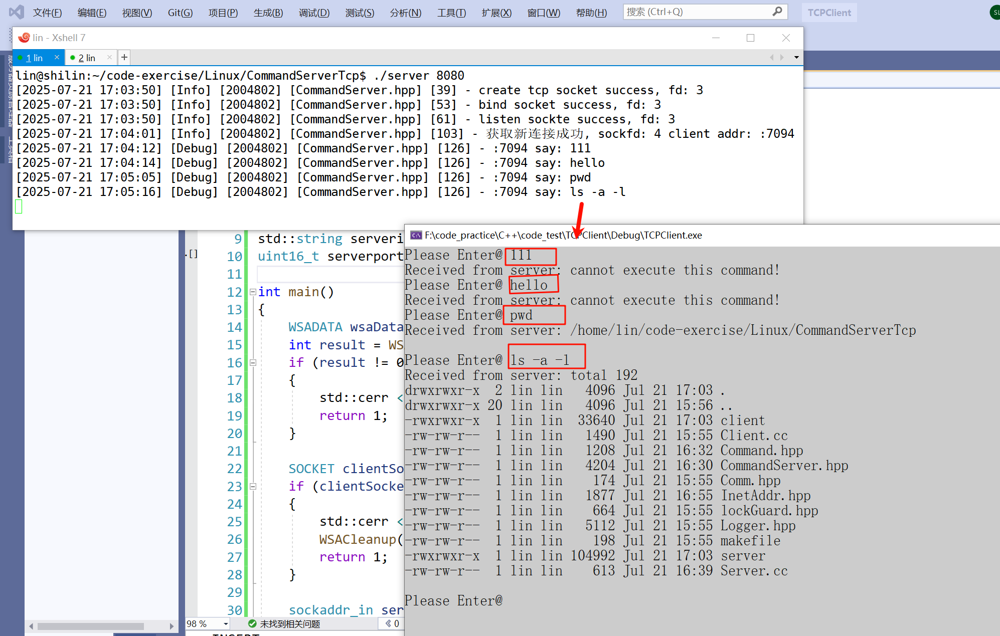

# 断线重连
客胡端会面临服务器崩溃的情况，我们可以试着写⼀个客户端重连的代码，模拟并理解⼀些客户端行为，比如游戏客户端等

我这里采用状态机来实现

```cpp
#include <iostream>
#include <string>
#include <cstring>
#include <cstdlib>
#include <unistd.h>
#include <sys/types.h>
#include <sys/socket.h>
#include <netinet/in.h>
#include <arpa/inet.h>


using namespace std;

void Usage(const std::string &process)
{
    std::cout << "Usage: " << process << " server_ip server_port" << std::endl;
}

enum class Status // C++11 强类型枚举
{
    NEW,        // 新建状态，就是单纯的连接
    CONNECTING, // 正在连接，仅仅方便查询conn状态
    CONNECTED,  // 连接或者重连成功
    DISCONNECTED, // 重连失败
    CLOSED        // 连接失败，经历重连，无法连接
};

class ClientConnection
{
public:
    ClientConnection(uint16_t serverport, const std::string &serverip)
        : _sockfd(-1),
          _serverport(serverport),
          _serverip(serverip),
          _retry_interval(1),
          _max_retries(5),
          _status(Status::NEW)
    {
    }
    void Connect()
    {
        // 1. 创建socket
        _sockfd = socket(AF_INET, SOCK_STREAM, 0);
        if (_sockfd < 0)
        {
            cerr << "socket error" << endl;
            exit(1);
        }

        // 2. 要不要bind？必须要有Ip和Port, 需要bind，但是不需要用户显示的bind，client系统随机端口
        // 发起连接的时候，client会被OS自动进行本地绑定
        // 2. connect
        struct sockaddr_in server;
        memset(&server, 0, sizeof(server));
        server.sin_family = AF_INET;
        server.sin_port = htons(_serverport);
        // p:process(进程), n(网络) -- 不太准确，但是好记忆
        inet_pton(AF_INET, _serverip.c_str(), &server.sin_addr); // 1. 字符串ip->4字节IP 2. 网络序列

        int n = connect(_sockfd, (struct sockaddr *)&server, sizeof(server)); // 自动进行bind哦！
        if (n < 0)
        {
            Disconnect();                   // 恢复_sockfd的默认值，是连接没有成功，不代表sockfd创建没有成功
            _status = Status::DISCONNECTED; // 没有连接成功
            return;
        }
        _status = Status::CONNECTED; // 连接成功
    }
    int SocketFd()
    {
        return _sockfd;
    }
    void Reconnect()
    {
        _status = Status::CONNECTING; // 正在重连
        int count = 0;
        while (count < _max_retries)
        {
            Connect(); // 重连
            if (_status == Status::CONNECTED)
            {
                return;
            }
            sleep(_retry_interval);
            count++;
            std::cout << "重连次数: " << count << ", 最大上限: " << _max_retries << std::endl;
        }
        _status = Status::CLOSED; // 重连失败，可以关闭了
    }
    void Disconnect()
    {
        if (_sockfd != -1)
        {
            close(_sockfd);
            _status = Status::CLOSED;
            _sockfd = -1;
        }
    }
    Status GetStatus()
    {
        return _status;
    }
    void Process()
    {
        // 简单的IO即可
        while (true)
        {
            string inbuffer;
            cout << "Please Enter# ";
            getline(cin, inbuffer);
            if(inbuffer.empty()) continue;
            
            ssize_t n = write(_sockfd, inbuffer.c_str(), inbuffer.size());
            if (n > 0)
            {
                char buffer[1024];
                ssize_t m = read(_sockfd, buffer, sizeof(buffer) - 1);
                if (m > 0)
                {
                    buffer[m] = 0;
                    cout << "echo messsge -> " << buffer << endl;
                }
                else if (m == 0) // 这里证明server端掉线了
                {
                    _status = Status::DISCONNECTED;
                    break;
                }
                else
                {
                    std::cout << "read m : " << m << "errno: " << errno << "errno string: " << strerror(errno) << std::endl;
                    _status = Status::CLOSED;
                    break;
                }
            }
            else
            {
                std::cout << "write n : " << n << "errno: " << errno << "errno string: " << strerror(errno) << std::endl;
                _status = Status::CLOSED;
                break;
            }
        }
    }
    ~ClientConnection()
    {
        Disconnect();
    }

private:
    int _sockfd;
    uint16_t _serverport;  // server port 端口号
    std::string _serverip; // server ip地址
    int _retry_interval;   // 重试时间间隔
    int _max_retries;      // 重试次数
    Status _status;        // 连接状态
};

class TcpClient
{
public:
    TcpClient(uint16_t serverport, const std::string &serverip) : _conn(serverport, serverip)
    {
    }
    void Execute()
    {
        while (true)
        {
            switch (_conn.GetStatus())
            {
            case Status::NEW:
                _conn.Connect();
                break;
            case Status::CONNECTED:
                std::cout << "连接成功, 开始进行通信." << std::endl;
                _conn.Process();
                break;
            case Status::DISCONNECTED:
                std::cout << "连接失败或者对方掉线，开始重连." << std::endl;
                _conn.Reconnect();
                break;
            case Status::CLOSED:
                _conn.Disconnect();
                std::cout << "重连失败, 退出." << std::endl;
                return; // 退出
            default:
                break;
            }
        }
    }
    ~TcpClient()
    {
    }

private:
    ClientConnection _conn; // 简单组合起来即可
};
// class Tcp

// ./tcp_client serverip serverport
int main(int argc, char *argv[])
{
    if (argc != 3)
    {
        Usage(argv[0]);
        return 1;
    }
    std::string serverip = argv[1];
    uint16_t serverport = stoi(argv[2]);
    TcpClient client(serverport, serverip);
    client.Execute();
    return 0;
}
```


