# Socket编程（UDP）
# 预备
## 理解源ip和目的ip
在IP数据包头部中，有两个IP地址，分别叫做源IP地址，和目的IP地址。

思考一下: 不考虑中间的一系列步骤，两台主机我们光有IP地址就可以完成通信了嘛？ 想象一下发qq消息的例子，有了IP地址能够把消息发送到对方的机器上。

但是我们把数据从主机A发生到主机B主机，是目的吗？   ---> 并不是目的，是手段。

真正通信的不是这两个机器！其实这是两台机器上面的软件（人）！

数据有IP标识一台唯一的主机，因此可以把一台主机上的数据交给另外一台主机。但是对方机器上不止一个程序，因此还需要有一个其他的标识来区分出，这个数据要给哪个程序进行解析。

那用谁来标识各自主机上客户或者服务进程的唯一性呢？

为了更好的表示一台主机上服务进程的唯一性，我们采用**端口号port**，标识服务器进程、客户端的唯一性！

因此用进程的唯一性和主机IP的唯一性就可以保证两台主机的服务来进行直接通信。

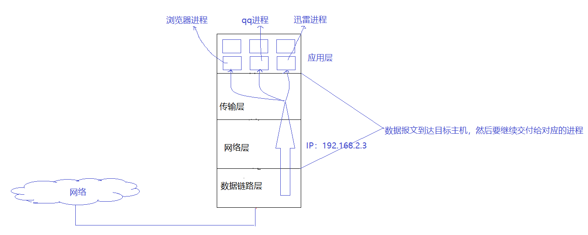

## 认识端口号
**端口号(port)是传输层协议的内容**

虽然端口号是传输层协议的内容，但是在应用层可以被调用，通过系统调用接口，向一个进程关联上一个端口号。

+ 端口号是一个2字节16位的整数;
+ 端口号用来标识一个进程，告诉操作系统, 当前的这个数据要交给哪一个进程来处理;
+ **IP地址 + 端口号**能够标识网络上的某一台主机的某一个进程;
+ 一个端口号只能被一个进程占用

端口号范围划分

+ 0 - 1023 : 知名端口号, HTTP, FTP, SSH 等这些广为使用的应用层协议, 他们的端口号都是固定的.
+ 1024 - 65535 : 操作系统动态分配的端口号. 客户端程序的端口号, 就是由操作系统从这个范围分配的. 

**ip地址(主机全网唯一性)+该主机上的端口号，标识该服务器上进程的唯一性**

所以：**网络通信的本质**：**其实就是进程间的通信**

进程之间通信的本质是什么呢？

+ 需要让不同的进程先看到同一份资源 -----> 网络
+ 通信不就是在做IO吗？----> 所以，我们所有上网的行为，无外乎就两种：a.我要把我的数据发出去 b. 我要收到别人给我发的数据

## 问题
1. 客户端和服务端上IP地址是不同的，但是它们两个进程关联的端口号可以一样吗？如客户端一个进程端口号是8080，服务端一个进程端口号是8080。

> 是可以的。
>
> 因为IP保证了全网唯一，port保证在主机内部的唯一性。
>
> 如果客户端和服务端在一台主机上，它们的端口号一定不能一样！
>

2. 进程已经有pid了，为什么要有port呢？

> 进程已经有pid可以保证它的唯一性看起来是可以的。但是实际上不行。
>
> a. 系统是系统，网络是网络，单独设置 ---- 系统与网络解耦
>
> b. 需要客户端每次都能找到服务器进程 ---- 服务器的唯一性不能做任何改变 (IP+port)，尤其是端口不能随意改变 —> 不能使用轻易会改变的值
>
> c. 不是所有的进程都要提供网络服务或者请求，但是所有的进程都需要pid
>

3. 未来进程可以和端口号(port)关联起来，我们就可以找到这台主机上网络服务进程

> 进程+port —> 网络服务进程
>

那底层OS如何根据port找到指定的进程？

> 实际上每个进程在OS就是PCB数据结构，端口号类型是`uint16_t`，说白了就是如何通过`uint16_t`找到`task_struct`
>
> 实际上OS采用的是`hashtable`方案，OS内部维护了一张基于port作Key的一张哈希表，value就是对应的PCB的地址。只要找到了对应port就找到了对应的进程PCB然后就可以数据交付给进程。
>
> 学习网络接口，网络接口就是文件。 拿上来的数据找到这个进程，找到这个进程就能找到它的文件描述符表，根据文件描述符表就能找到文件对象，文件对象找到了它这个文件缓冲区就找到了，然后就可以把数据拷贝到它的缓冲区里，最后就相当于网络数据放到了文件中，最后就如同读文件一样把数据读上去了。
>

4. 一个端口号只能被一个进程绑定，那一个进程可以绑定多个端口号吗？

> 可以的。如10086的多个客服。
>

## 理解源端口号和目的端口号
传输层协议(TCP和UDP)的数据段中有两个端口号, 分别叫做源端口号和目的端口号. 就是在描述 “数据是谁发的, 要发给谁”;

最后一个问题：

我们在网络通信的过程中，IP+port标识唯一性，client->server，除了数据，要把自己的ip和port发给对方吗？

> 是的需要，我们还要发回来。未来发送数据的时候，一定会“多发”一部分数据 —> 多发的数据以协议的形式呈现。
>

这里可能会有些问题，第一次怎么知道对方port的？

> 最开始的时候服务端的端口号是不变的，并且我们用的APP等根本不是我们写的，写服务和客户端的是一家公司，**客户端在写的时候它要请求的时候它客户端内置的端口号已经内置好了**。而且内置好之后是绝对不变的。
>

## 认识TCP协议
1. 传输层协议
2. 有连接
3. 可靠传输
4. 面向字节流

## 认识UDP协议
1. 传输层协议
2. 无连接
3. 不可靠传输
4. 面向数据报

---

小结：

并不是说可靠就是好的，不可靠就是不好的。可靠和不可靠其实是一个中性词。

可靠是有成本的 – 往往比较复杂 --> 维护&&编码

不可靠 – 比较简单 – 维护&&使用

上面都有自己合适的应用场景。

## 网络字节序
我们已经知道，内存中的多字节数据相对于内存地址有大端和小端之分，磁盘文件中的多字节数据相对于文件中的偏移地址也有大端小端之分，网络数据流同样有大端小端之分， 那么如何定义网络数据流的地址呢?

> 大端是数据低地址存在内存高地址，数据高地址存内存低地址
>
> 小端是数据低地址存在内存低地址，数据高地址存内存高地址
>

如0x12345678 -->`高<—低`

大端机器内存放的是 12 34 56 78 -->`低—>高`

小端机器内存放的是 78 56 34 12 --> `低—>高`

如果是一个大端机把数据通过网络转给小端机，小端机把这个收到大端机的数据按照小端机存，就可能在这个服务器把数据解释反了。现在问题是作为接收方你怎么知道你接收的数据是大端还是小端？


> 发送主机通常将发送缓冲区中的数据按内存地址从低到高的顺序发出;
>
> 接收主机把从网络上接到的字节依次保存在接收缓冲区中,也是按内存地址从低到高的顺序保存;
>
> 因此,网络数据流的地址应这样规定：先发出的数据是低地址，后发出的数据是高地址.
>
> **TCP/IP协议规定,网络数据流应采用大端字节序,即低地址高字节.**
>
> 不管这台主机是大端机还是小端机, 都会按照这个TCP/IP规定的网络字节序来发送/接收数据;如果当前发送主机是小端, 就需要先将数据转成大端; 否则就忽略, 直接发送即可
>
> 为使网络程序具有可移植性，使同样的C代码在大端和小端计算机上编译后都能正常运行,可以调用以下库函数做网络字节序和主机字节序的转换
>

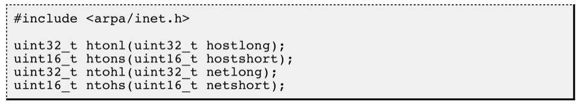

> 这些函数名很好记，h表示host，n表示network，l表示32位长整数，s表示16位短整数。
>
> 例如htonl表示将32位的长整数从主机字节序转换为网络字节序,例如将IP地址转换后准备发送。
>
> 如果主机是小端字节序,这些函数将参数做相应的大小端转换然后返回。
>
> 如果主机是大端字节序,这些 函数不做转换,将参数原封不动地返回。
>

**规定：所有发送到网络上的数据，都必须是大端的！**

# socket编程接口
上面我们所说`ip+port`----->该主机上对应的服务进程，是全网中是唯一的一个进程！  
`ip+port`就是套接字，socket

```c
// 创建 socket 文件描述符 (TCP/UDP, 客户端 + 服务器)
int socket(int domain, int type, int protocol);

// 绑定端口号 (TCP/UDP, 服务器) 
int bind(int socket, const struct sockaddr *address, socklen_t address_len);

// 开始监听socket (TCP, 服务器)
int listen(int socket, int backlog);

// 接收请求 (TCP, 服务器)
int accept(int socket, struct sockaddr* address,socklen_t* address_len);

// 建立连接 (TCP, 客户端)
int connect(int sockfd, const struct sockaddr *addr, socklen_t addrlen);
```

## struct sockaddr结构
我们可以看到上面`struct sockaddr *addr`出现次数挺多的。实际上在网络上通信的时候套接字种类是比较多的，下面是常见的三种：

1. **网络套接字**
2. **原始套接字**
3. **unix域间套接字**

> 网络套接字：运用于网络跨主机之间通信+本地通信
>
> unix域间套接字: 本地通信
>
> 我们现在在使用网络编程通信时是应用层调传输层的接口，而原始套接字：跳过传输层访问其他层协议中的有效数据。主要用于抓包，侦测网络情况。。
>

我们现在知道套接字种类很多，它们应用的场景也是不一样的。所以未来要完成这三种通信就需要有三套不同接口，但是思想上用的都是套接字的思想。因此接口设计者不想设计三套接口，只想设计一套接口，可以通过不通的参数，解决所有网络或者其他场景下的通信网络。

`struct sockaddr_in` ：适用于网络通信

`struct sockaddr_un`：适用于域间通信

前两个字节都是16位地址类型：代表采用的是网络通信还是本地通信

未来接口里面虽然是`struct sockaddr *addr`，但是你要填充的是要不是`struct sockaddr_in`，要不是`struct sockaddr_un`。然后把其他一个强制类型转换传给`truct sockaddr *addr`。然后在内部根据`struct sockaddr *addr`的前两个字节判断传过来的是`struct sockaddr_in`还是`struct sockaddr_un`，然后在做强制类型转换转成对应的结构。

这里就有点像C++，父类和子类多态的意思。

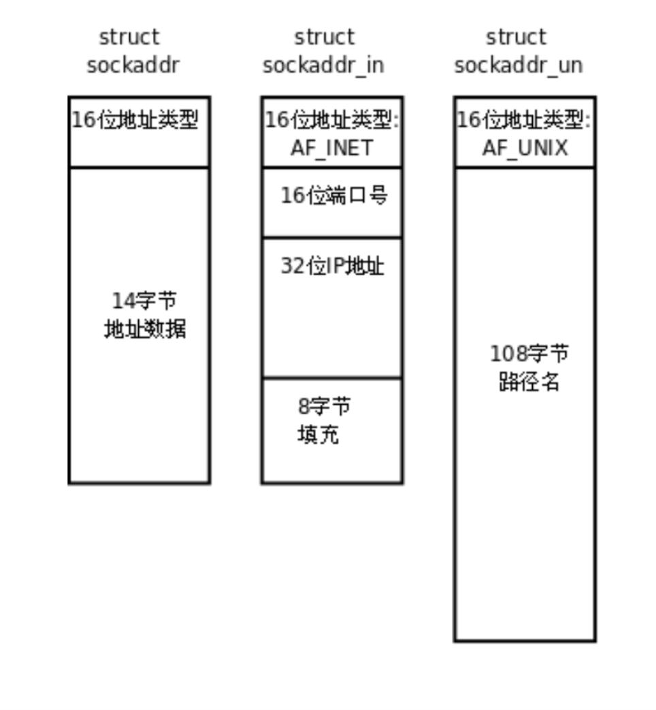

IPv4和IPv6的地址格式定义在`netinet/in.h`中,IPv4地址用`sockaddr_in`结构体表示,包括16位地址类型, 16位端口号和32位IP地址.

IPv4、IPv6地址类型分别定义为常数`AF_INET`、`AF_INET6`. 这样,只要取得某种sockaddr结构体的首地址,不需要知道具体是哪种类型的sockaddr结构体,就可以根据地址类型字段确定结构体中的内容.

socket API可以都用`struct sockaddr *`类型表示, 在使用的时候需要强制转化成`sockaddr_in` 这样的好处是程序的通用性, 可以接收IPv4, IPv6, 以及`UNIX Domain Socket`各种类型的`sockaddr`结构体指针做为参数;

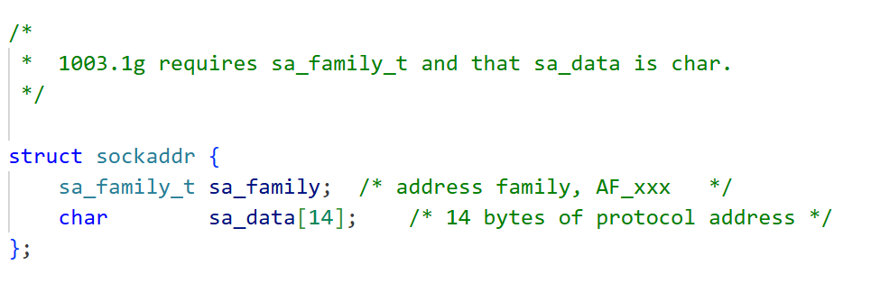


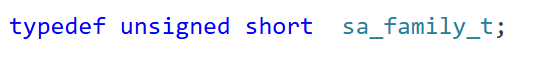


虽然`socket api`的接口是`sockaddr`, 但是我们真正在基于IPv4编程时, 使用的数据结构是`sockaddr_in`; 这个结构里主要有三部分信息: **地址类型, 端口号, IP地址**。

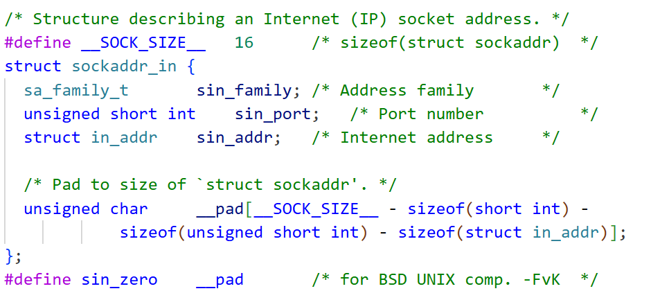

`in_addr`用来表示一个IPv4的IP地址. 其实就是一个32位的整数

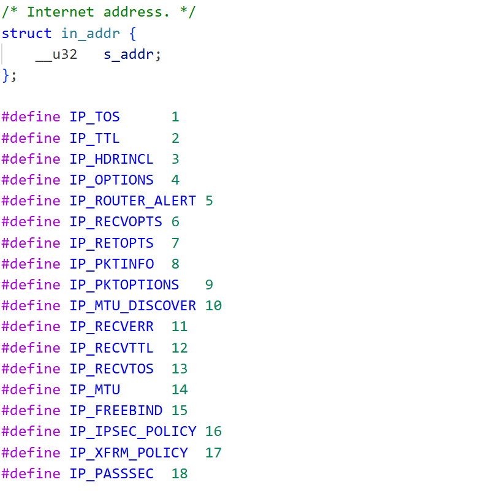

# UDP网络程序
框架：

```cpp
#ifndef UDP_SERVER_HPP
#define UDP_SERVER_HPP

#include <iostream>
#include <string>

const std::string DEFAULT_IP = "0.0.0.0  ";

class UdpServer
{
public:
    UdpServer(const uint16_t &port, const std::string &ip = DEFAULT_IP)
        : _ip(ip), _port(port), _sockfd(-1)
    {
    }

    void Init()
    {
    }

    void Start()
    {
    }

    void Stop()
    {
    }
    ~UdpServer()
    {
    }

private:
    std::string _ip; // 服务器IP地址
    uint16_t _port;  // 服务器端口号
    int _sockfd;     // 套接字描述符
}

#endif // UDP_SERVER_HPP
```

进行网络通信首先要创建套接字

套接字创建一套网络通信的文件机制（在文件系统层面，把对应的网卡文件打开），其实是在底层帮我打开一个文件，把文件和网卡设备关联起来。

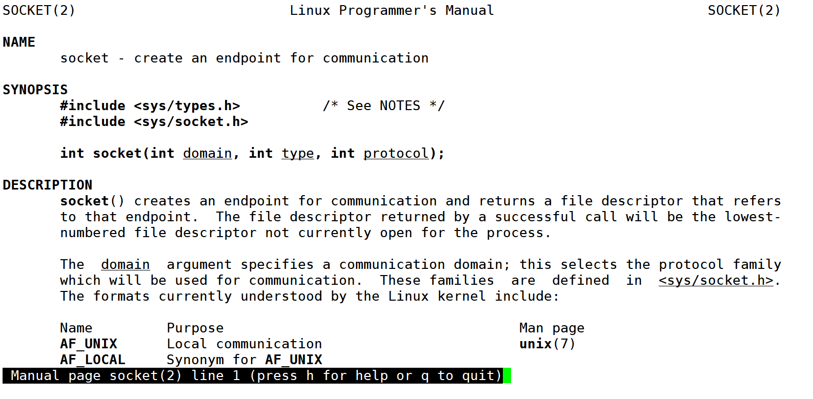

domain (域)：代表未来这个套接字是用来网络通信还是本地通信

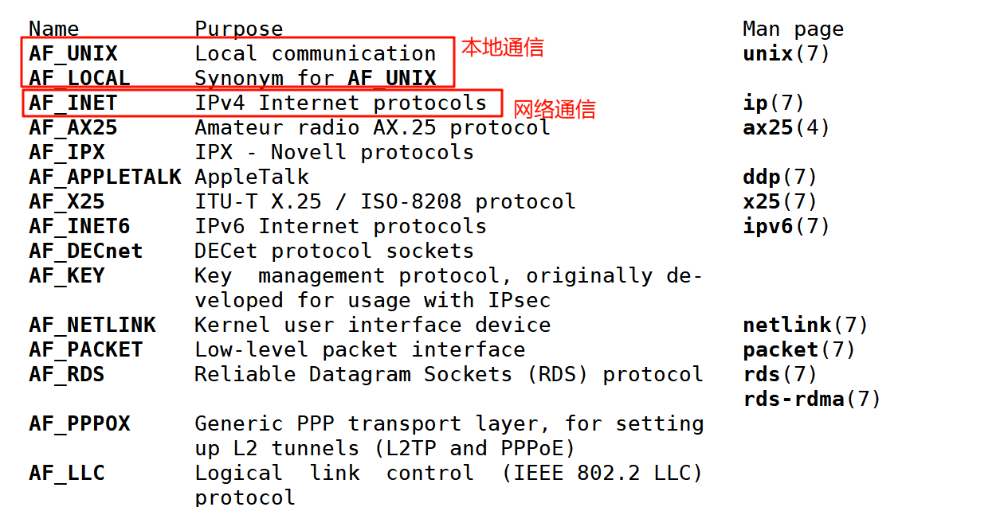

type：套接字提供的服务类型

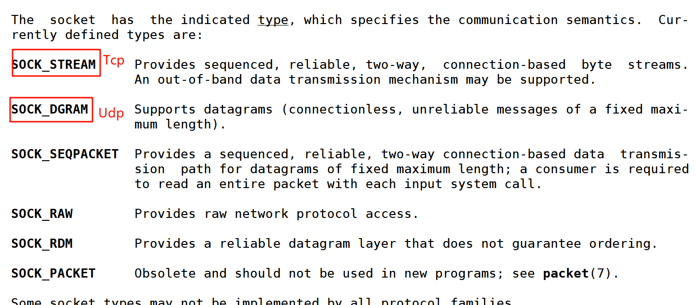

protocol：未来想使用什么协议如TCP、UDP。一般默认为0，因为前两个参数就已经帮第三个参数确定采用什么协议了。

  
成功时返回一个**文件描述符**，失败时返回-1，错误码被设置。Linux下一切皆文件，返回文件描述符我们知道未来所有接口大概率都跟这个值有关，通过这个文件描述符向文件中读，向文件中写。

## 创建socket
```cpp
void Init()
{
    // 1. 创建socket
    _sockfd = socket(AF_INET, SOCK_DGRAM, 0);
    if(_sockfd < 0)
    {
        LOG(LogLevel::FATAL) << "create socket error";
        exit(1);
    }
    LOG(LogLevel::INFO) << "create socket success : " << _sockfd;
}
```

套接字文件创建好了只有一个文件描述符，前面说`ip+port-->socket`，因此需要bind绑定，**将我们字节设置的ip和port设置到操作系统中。告诉操作系统ip和port给那个文件用的。将ip和port和套接字文件进行绑定。**

## 绑定
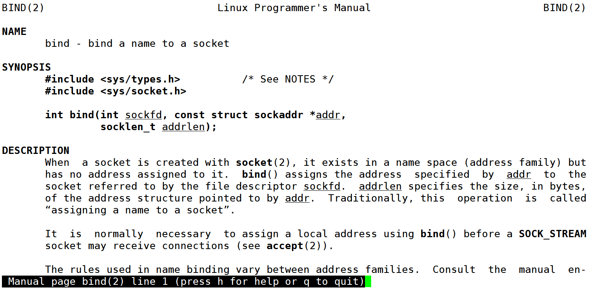

sockfd：调用socket返回的文件描述符

struct sockaddr：

今天我们写的是网络通信，因此需要一个`struct sockaddr_in`结构。里面最重要的字段有三个：


第一个是16位地址类型也叫做协议家族`AF_INET`

第二个是这个服务器要绑定的16位**端口**号是谁

第三个是这个服务器要绑定的32位**ip**地址是谁

`addrlen`：未来要传的结构体的长度

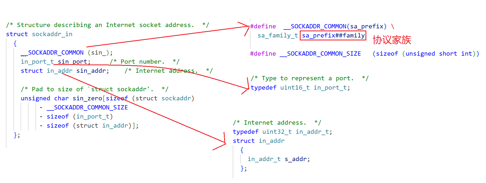

在使用`sockaddr_in`前需要进行清0，也可以使用memset

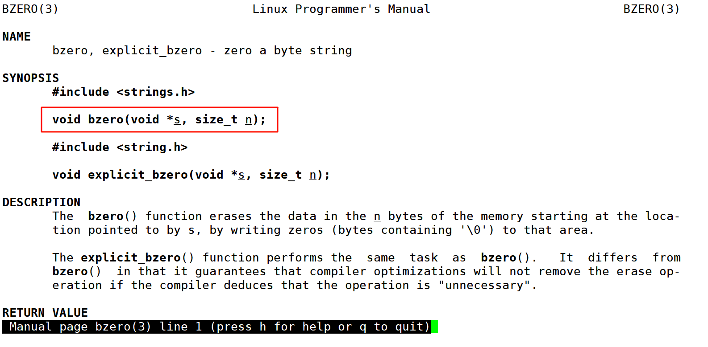

## 关于ip地址
192.168.80.30 -----> 点分十进制的风格的IP，字符串，可读性好

但是实际上我们知道一个IP地址，这里分成4个字节，每个字节取值0-255，就可以用一个`uint32_t`类型4个字节就能标识 -----> 整数类型的ip，网络通信使用

那现在就需要上面转换成下面，下面转换成上面。那该怎么转呢？

这个并不用我们转，库已经帮我们写好了，用库的就行。

不过原理我们可以看一下

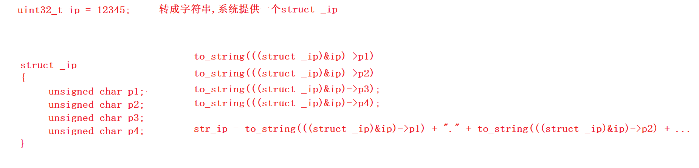

字符串转uint_32原理类型，把字符串分成4部分，每部分字符串一次设进p1、p2、p3、p4里，然后再把整个结构体强制类型转换赋值给uint32_t

结构体剩下的就是填充，是为了照顾结构体内存对齐的。

---

string转uint32_t：

1. 将点分十进制ip地址 字符串转整数
2. 将这个整数转成网络字节序

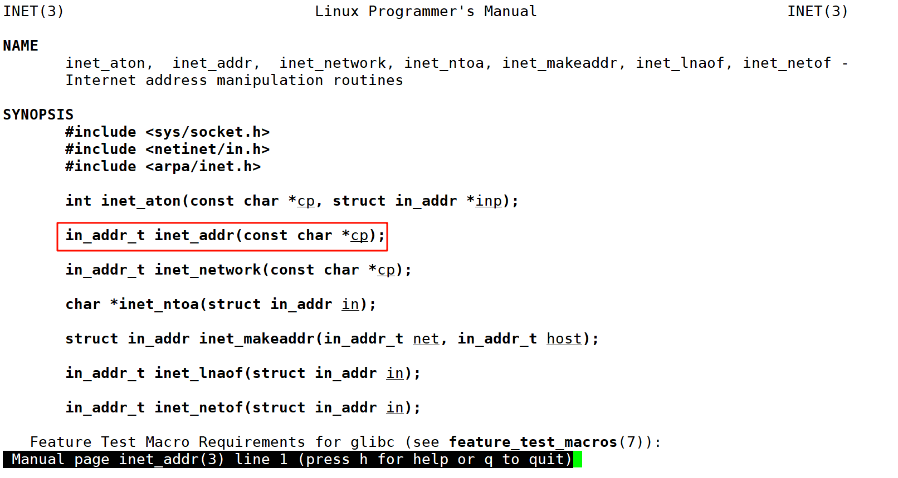

主机端口转字节序

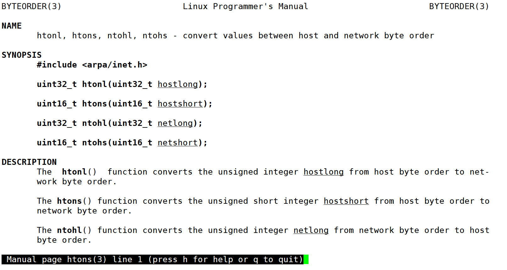

```cpp
void Init()
{
    // 1. 创建socket				UDP
    _sockfd = socket(AF_INET, SOCK_DGRAM, 0);
    if (_sockfd < 0)
    {
        LOG(LogLevel::FATAL) << "create socket error";
        exit(1);
    }
    LOG(LogLevel::INFO) << "create socket success : " << _sockfd;

    // 2. bind
    struct sockaddr_in local;
    bzero(&local, sizeof(local));
    local.sin_family = AF_INET; // 采用网络通信, AF_INET填充一个struct sockaddr_in结构体,为了用于网络通信
    local.sin_addr.s_addr = inet_addr(_ip.c_str()); // 1.string->uint32_t 2.htonl
    local.sin_port = htons(_port);           // 转成网络字节序, 给别人发消息,也要把自己的port和ip发送给对方

    int n = bind(_sockfd, (struct sockaddr *)&local, sizeof(local));
    if (n < 0)
    {
        LOG(LogLevel::FATAL) << "bind socket error";
        exit(2);
    }
    LOG(LogLevel::INFO) << "bind socket success : " << _sockfd;
}
```

自此UDP服务器预备工作完成。 **1.创建socket 2.bind绑定**

服务器初始化，要绑定ip和port，因此需要我们自己传，所以我们使用命令行参数

```cpp
#include "UdpServer.hpp"

#include <memory>

void Usage(std::string proc)
{
    std::cerr << "Usage: " << proc << " <IP> <Port>" << std::endl;
}

int main(int argc, char *argv[])
{
    if(argc != 3)
    {
        Usage(argv[0]);
        exit(1);
    }

    std::string ip = argv[1];
    uint16_t port = atoi(argv[2]);
    std::unique_ptr<UdpServer> server = std::make_unique<UdpServer>(ip, port);
    server->Init();
    server->Start();

    return 0;
}
```

start先写一个空的死循环，现在这个服务器也可以启动了。

下面说一说这个自己填写的ip地址的问题

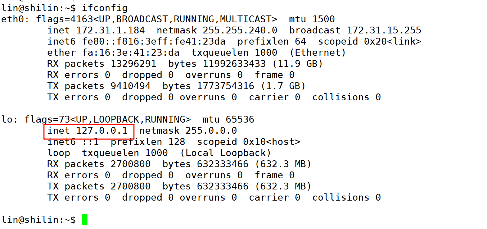

其中127.0.0.1本地环回：未来可以使用这个地址做服务器代码测试

目前我们写的服务器在应用层，如果绑定的ip地址是127.0.0.1 ，当我做测试的时候未来发信息和读消息其实都是在本主机内，数据贯穿协议栈之后再进行流动不会到底物理层

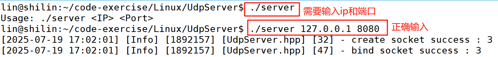

## 查看已经运行的服务
```shell
netstat 查看当前网络情况
netstat -nuap   n:能显示数字显示数字  u：UDP  a：all  p：进程
```

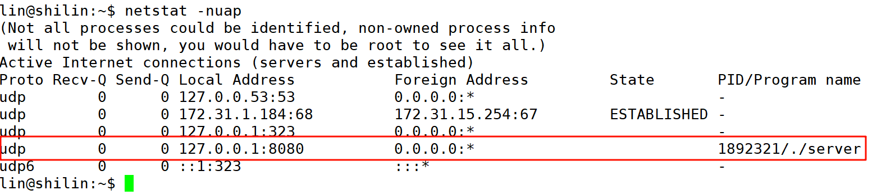

但是我们想这个服务器未来在全网服务，因此我们需要用到公网ip，但是云服务器都是虚拟化的服务器，不能直接bind你的公网ip。虚拟机或者真实的Linux环境，你可以bind你的公网ip。

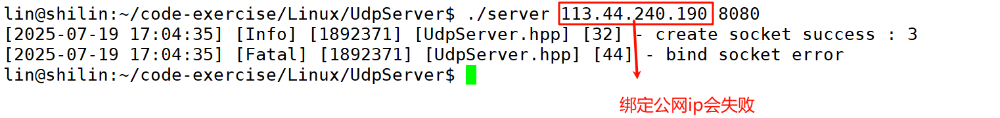

那不能绑定公网ip，如何让别人能找到我呢？

**实际情况下一款网络服务器不建议指明一个ip**。
就是说未来服务器不要显示绑定一个ip，因为有时候一些原因服务器上不止一个ip，如果今天绑定了一个特定ip，大家可以用的是ip1，ip2等都在向这个端口号为8080的服务器发送消息，但此时只绑定一个明确的ip，那么最终只能收到目的ip就是自己显示绑定的ip发送的数据。别人用其他ip向8080发送数据那就不能收到了。

所以在给`struct sockaddr_in`填充ip地址时，一般写法如下。这也是为什么在构造的时候给ip缺省值`0.0.0.0`的原因。 任意地址绑定！未来发送到这台机器上的所有的数据只要访问的端口号port是8080，都可以交付给这个服务器。

```cpp
void Init()
{
    // 1. 创建socket
    _sockfd = socket(AF_INET, SOCK_DGRAM, 0);
    if (_sockfd < 0)
    {
        LOG(LogLevel::FATAL) << "create socket error";
        exit(1);
    }
    LOG(LogLevel::INFO) << "create socket success : " << _sockfd;

    // 2. bind
    struct sockaddr_in local;
    bzero(&local, sizeof(local));
    local.sin_family = AF_INET;                     // 采用网络通信, AF_INET填充一个struct sockaddr_in结构体,为了用于网络通信
    local.sin_addr.s_addr = inet_addr(_ip.c_str()); // 1.string->uint32_t 2.htonl
    local.sin_port = htons(_port);                  // 转成网络字节序, 给别人发消息,也要把自己的port和ip发送给对方

    int n = bind(_sockfd, (struct sockaddr *)&local, sizeof(local));
    if (n < 0)
    {
        LOG(LogLevel::FATAL) << "bind socket error";
        exit(2);
    }
    LOG(LogLevel::INFO) << "bind socket success : " << _sockfd;
}
```

在传ip地址的时候就选择绑定到任意ip地址，或者使用默认的`0.0.0.0`

```cpp
local.sin_addr.s_addr = INADDR_ANY;             // 绑定到任意IP地址
```

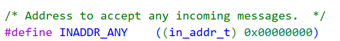

```cpp
void Init()
{
    // 1. 创建socket
    _sockfd = socket(AF_INET, SOCK_DGRAM, 0);
    if (_sockfd < 0)
    {
        LOG(LogLevel::FATAL) << "create socket error";
        exit(1);
    }
    LOG(LogLevel::INFO) << "create socket success : " << _sockfd;

    // 2. bind
    struct sockaddr_in local;
    bzero(&local, sizeof(local));
    local.sin_family = AF_INET; // 采用网络通信, AF_INET填充一个struct sockaddr_in结构体,为了用于网络通信
    // local.sin_addr.s_addr = inet_addr(_ip.c_str()); // 1.string->uint32_t 2.htonl
    local.sin_addr.s_addr = INADDR_ANY;             // 绑定到任意IP地址
    local.sin_port = htons(_port);                  // 转成网络字节序, 给别人发消息,也要把自己的port和ip发送给对方

    int n = bind(_sockfd, (struct sockaddr *)&local, sizeof(local));
    if (n < 0)
    {
        LOG(LogLevel::FATAL) << "bind socket error";
        exit(2);
    }
    LOG(LogLevel::INFO) << "bind socket success : " << _sockfd;
}
```

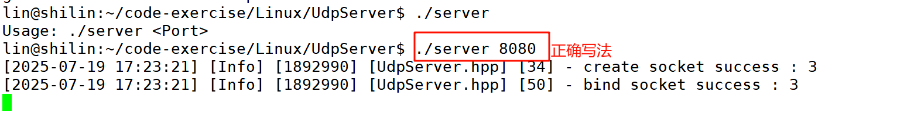

```cpp
#include "UdpServer.hpp"

#include <memory>

void Usage(std::string proc)
{
    std::cerr << "Usage: " << proc << " <Port>" << std::endl;
}

int main(int argc, char *argv[])
{
    if(argc != 2)
    {
        Usage(argv[0]);
        exit(1);
    }

    uint16_t port = atoi(argv[1]);
    std::unique_ptr<UdpServer> server = std::make_unique<UdpServer>(port);
    server->Init();
    server->Start();

    return 0;
}
```

## 服务器读取数据
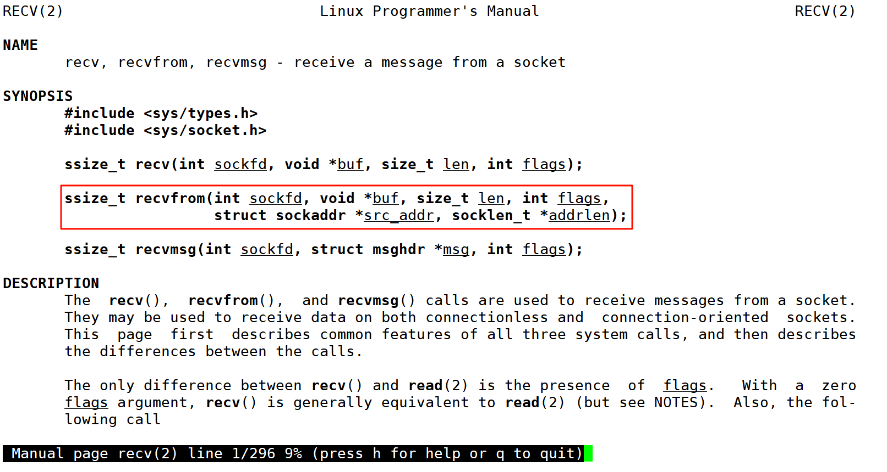 
sockfd：从那个套接字读
buf：读上来的数据放那个缓冲区
len：这个缓冲区多大
flags：怎么读，阻塞式的读取（填0代表阻塞式)
src_addr：输出型参数，今天读过来数据想知道是谁发的。返回对应的消息内容，是从哪一个client发来的。
addrlen：输出型参数，传过去的结构体多大。

因为是网络通信，因此传`struct sockaddr_in`结构体对象过去，会把client的ip和port消息填入这个结构体中。

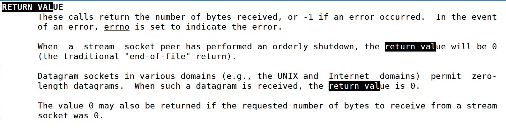

成功时返回读取到字节的个数，失败返回-1

```cpp
void Start()
{
    while(_isRunning)
    {
        char buffer[1024];
        struct sockaddr_in peer;
        socklen_t len = sizeof(peer);
        bzero(buffer, sizeof(buffer));
        // 1. 读取数据
        ssize_t n = recvfrom(_sockfd, buffer, sizeof(buffer), 0, (struct sockaddr *)&peer, &len);
        if(n < 0)
        {
            LOG(LogLevel::ERROR) << "recvfrom error";
            continue;
        }
        else
        {
            // 2. 打印数据 需要client的ip和port
            std::string peer_ip = inet_ntoa(peer.sin_addr); // 将网络字节序转换为字符串
            uint16_t peer_port = ntohs(peer.sin_port); // 将网络字节序转换为主机字节序
            buffer[n] = 0;
            LOG(LogLevel::DEBUG) << "[" << peer_ip
                << ":" << peer_port << "]# " << buffer;

            // 3. 回复数据
            std::string echo_msg = "server echo: ";
            echo_msg += buffer;
            sendto(_sockfd, echo_msg.c_str(), echo_msg.size(), 0, (struct sockaddr *)&peer, len);

        }
    }
    _isRunning = false;
}
```

1. 字节序转变 
2. int->点分十进制


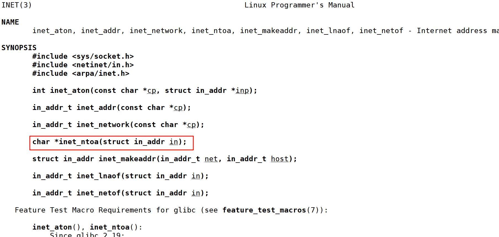

## UdpServer.hpp
```cpp
#ifndef UDP_SERVER_HPP
#define UDP_SERVER_HPP

#include <iostream>
#include <string>

#include <sys/types.h>
#include <sys/socket.h>
#include <strings.h>
#include <netinet/in.h>
#include <arpa/inet.h>

#include "Logger.hpp"

class UdpServer
{
public:
    UdpServer(const uint16_t &port)
        : _port(port), _sockfd(-1), _isRunning(false)
    {
    }

    void Init()
    {
        // 1. 创建socket
        _sockfd = socket(AF_INET, SOCK_DGRAM, 0);
        if (_sockfd < 0)
        {
            LOG(LogLevel::FATAL) << "create socket error";
            exit(1);
        }
        LOG(LogLevel::INFO) << "create socket success : " << _sockfd;

        // 2. bind
        struct sockaddr_in local;
        bzero(&local, sizeof(local));
        local.sin_family = AF_INET; // 采用网络通信, AF_INET填充一个struct sockaddr_in结构体,为了用于网络通信
        // local.sin_addr.s_addr = inet_addr(_ip.c_str()); // 1.string->uint32_t 2.htonl
        local.sin_addr.s_addr = INADDR_ANY; // 绑定到任意IP地址
        local.sin_port = htons(_port);  // 转成网络字节序, 给别人发消息,也要把自己的port和ip发送给对方

        int n = bind(_sockfd, (struct sockaddr *)&local, sizeof(local));
        if (n < 0)
        {
            LOG(LogLevel::FATAL) << "bind socket error";
            exit(2);
        }
        LOG(LogLevel::INFO) << "bind socket success : " << _sockfd;
    }

    void Start()
    {
        _isRunning = true;
        LOG(LogLevel::INFO) << "server start running";
        while (_isRunning)
        {
            char buffer[1024];
            struct sockaddr_in peer;
            socklen_t len = sizeof(peer);
            bzero(buffer, sizeof(buffer));
            // 1. 读取数据
            ssize_t n = recvfrom(_sockfd, buffer, sizeof(buffer), 0, (struct sockaddr *)&peer, &len);
            if (n < 0)
            {
                LOG(LogLevel::ERROR) << "recvfrom error";
                continue;
            }
            else
            {
                // 2. 打印数据 需要client的ip和port
                std::string peer_ip = inet_ntoa(peer.sin_addr); // 将网络字节序转换为字符串
                uint16_t peer_port = ntohs(peer.sin_port);      // 将网络字节序转换为主机字节序
                buffer[n] = 0;
                LOG(LogLevel::DEBUG) << "[" << peer_ip
                                     << ":" << peer_port << "]# " << buffer;

                // 3. 回复数据
                std::string echo_msg = "server echo: ";
                echo_msg += buffer;
                sendto(_sockfd, echo_msg.c_str(), echo_msg.size(), 0, (struct sockaddr *)&peer, len);
            }
        }
        _isRunning = false;
    }

    void Stop()
    {
        _isRunning = false;
    }
    ~UdpServer()
    {
        if (_sockfd >= 0)
        {
            close(_sockfd);
            LOG(LogLevel::INFO) << "close socket success : " << _sockfd;
        }
    }

private:
    uint16_t _port; // 服务器端口号
    int _sockfd;    // 套接字描述符

    bool _isRunning; // 服务器是否在运行
};

#endif // UDP_SERVER_HPP
```

## server.cc
```cpp
#include "UdpServer.hpp"

#include <memory>

void Usage(std::string proc)
{
    std::cerr << "Usage: " << proc << " <Port>" << std::endl;
}

int main(int argc, char *argv[])
{
    if(argc != 2)
    {
        Usage(argv[0]);
        exit(1);
    }

    uint16_t port = atoi(argv[1]);
    std::unique_ptr<UdpServer> server = std::make_unique<UdpServer>(port);
    server->Init();
    server->Start();

    return 0;
}
```

## Client客户端
客户端和服务端用到的接口几乎差不多

客户端这里必须要知道服务端ip和port，然后才知道要往那个服务器发。发送到对应服务器后，只不过服务器内部在使用的时候不在看ip了，只看端口，把数据发给绑定这个端口的进程就好了。

刚才**服务端 1.创建socket 2.bind**，现在问题就来了

**client要不要bind？client要不要显示的bind(需不需要程序员自己bind)？**

所谓bind是让套接字文件信息和网络ip和port产生关联。未来通信客户端和服务端都有自己的ip和port。那client要不要bind？

> **client必须要bind，但不需要显示bind(不需要程序员自己bind)**

1. **那server服务端为什么一定要显示bind？**

> 在服务端这里bind绑定的时候，最重要的根本就不是绑定ip，**最重要的而是绑定port**。未来服务器要明确的port，不能随意改变。所以必须显示bind某个端口。只要服务器启动成功，一定是bind成功，它对应的端口号一定是属于它自己的，另外这个端口号是众所周知的不会轻易改变。所以需要用户显示bind。
>
> 而客户端只要有port就可以，它的port是多少不重要！具有唯一性才重要！未来当客户端发信息把自己端口号填上，然后服务端能收到，然后给返回来就可以了。所以客户端不需要显示绑定。
>

2. **那client客户端为什么不用显示bind？**

> 写服务器的是一家公司，写client是无数家公司。
比如写抖音App是字节跳动一家公司，但你的手机一定装满各自APP，手机装了这么多客户端，如果每个客户端都自己说就要绑定9090这个端口号，那一定是谁先启动那个App先拿到这个端口号，那其他的客户端就启动不起来了。

所以客户端不需要明确哪一个，只需要有就可以了，保证唯一性就行了。**并且这由OS自动形成端口进行bind，然后还会绑定ip**。

3. **OS在什么时候，如何bind**。

> 如何bind，OS发现bind没绑就采用随机策略形成一个端口号，然后使用bind方法进行绑定。
在首次向服务器`sendto`数据时，OS发现没有bind绑定ip和port，只写了服务器的ip和port，所以OS会自动绑定ip和port。

**客户端 **

**创建socket**

下面启动客服端，发送消息使用`sendto`接口

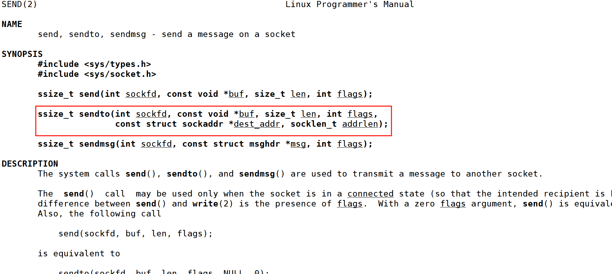

sockfd：往那个套接字发送
buf：发送的内容是什么
len：内容多长
flags：发送方式 ，阻塞式发送（0）有数据就发没数据就等
dest_addr：输入型参数，告诉客户端要发给谁

给个`struct sockaddr_in`结构体，往结构体填充要发给服务器的ip地址和port

addrlen：输入型参数，这个结构体多大

```cpp
#include <iostream>
#include <string>
#include <sys/types.h>
#include <sys/socket.h>
#include <netinet/in.h>
#include <arpa/inet.h>
#include <cstring>

void Usage(std::string proc)
{
    std::cerr << "Usage: " << proc << " serverip serverport" << std::endl;
}

int main(int argc, char *argv[])
{
    if (argc != 3)
    {
        Usage(argv[0]);
        exit(0);
    }

    std::string server_ip = argv[1];
    uint16_t server_port = atoi(argv[2]);
    
	// 1. socket
    int sockfd = socket(AF_INET, SOCK_DGRAM, 0);
    if (sockfd < 0)
    {
        std::cerr << "Create socket error" << std::endl;
        exit(1);
    }
	// 2. ip
    struct sockaddr_in server_addr;
    bzero(&server_addr, sizeof(server_addr));
    server_addr.sin_family = AF_INET;                           // 使用IPv4地址族
    server_addr.sin_addr.s_addr = inet_addr(server_ip.c_str()); // 将IP地址从字符串转换为网络字节序的整数
    server_addr.sin_port = htons(server_port);                  // 主机字节序转网络字节序

    for (;;)
    {
        std::cout << "Please Enter@ ";
        std::string line;
        std::getline(std::cin, line);

        // 发送数据到服务器
        sendto(sockfd, line.c_str(), line.size(), 0, (struct sockaddr *)&server_addr, sizeof(server_addr));

        // 接收服务器的响应
        char buffer[1024];
        struct sockaddr_in temp_addr;
        socklen_t len = sizeof(temp_addr);
        int n = recvfrom(sockfd, buffer, sizeof(buffer), 0, (struct sockaddr *)&temp_addr, &len);
        if (n > 0)
        {
            buffer[n] = 0;
            std::cout << buffer << std::endl;
        }
    }

    return 0;
}
```

可以使用本地地址发送

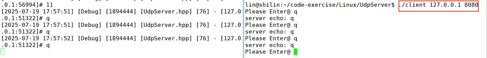

也可以使用公网ip发送

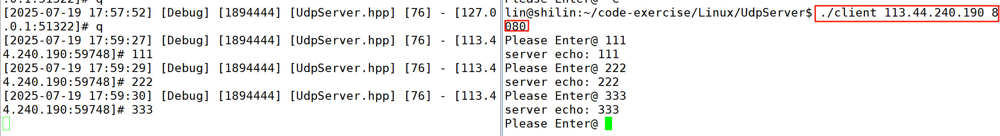

# 根据UDP客户端服务端实现简单的英译汉的网络字典
服务器把数据读上来就完了吗？并不是，它可能还会对这些数据进行处理。
因此我们添加一个回调函数，对数据进行处理。

```cpp
#ifndef UDP_SERVER_HPP
#define UDP_SERVER_HPP

#include <iostream>
#include <string>

#include <sys/types.h>
#include <sys/socket.h>
#include <strings.h>
#include <netinet/in.h>
#include <arpa/inet.h>
#include <functional>

#include "Logger.hpp"


using callback_t = std::function<std::string(const std::string &word, const std::string &whoip, uint16_t whoport)>;

class DictServer
{
public:
    DictServer(const uint16_t &port, callback_t cb)
        : _port(port), _sockfd(-1), _isRunning(false), _cb(cb)
    {
    }

    void Init()
    {
        // 1. 创建socket
        _sockfd = socket(AF_INET, SOCK_DGRAM, 0);
        if (_sockfd < 0)
        {
            LOG(LogLevel::FATAL) << "create socket error";
            exit(1);
        }
        LOG(LogLevel::INFO) << "create socket success : " << _sockfd;

        // 2. bind
        struct sockaddr_in local;
        bzero(&local, sizeof(local));
        local.sin_family = AF_INET; // 采用网络通信, AF_INET填充一个struct sockaddr_in结构体,为了用于网络通信
        // local.sin_addr.s_addr = inet_addr(_ip.c_str()); // 1.string->uint32_t 2.htonl
        local.sin_addr.s_addr = INADDR_ANY; // 绑定到任意IP地址
        local.sin_port = htons(_port);      // 转成网络字节序, 给别人发消息,也要把自己的port和ip发送给对方

        int n = bind(_sockfd, (struct sockaddr *)&local, sizeof(local));
        if (n < 0)
        {
            LOG(LogLevel::FATAL) << "bind socket error";
            exit(2);
        }
        LOG(LogLevel::INFO) << "bind socket success : " << _sockfd;
    }

    void Start()
    {
        _isRunning = true;
        LOG(LogLevel::INFO) << "server start running";
        while (_isRunning)
        {
            char buffer[1024];
            struct sockaddr_in peer;
            socklen_t len = sizeof(peer);
            bzero(buffer, sizeof(buffer));
            // 1. 读取数据
            ssize_t n = recvfrom(_sockfd, buffer, sizeof(buffer), 0, (struct sockaddr *)&peer, &len);
            if (n < 0)
            {
                LOG(LogLevel::ERROR) << "recvfrom error";
                continue;
            }
            else
            {
                buffer[n] = 0;
                uint16_t client_port = ntohs(peer.sin_port);
                std::string client_ip = inet_ntoa(peer.sin_addr);

                std::string word = buffer;
                LOG(LogLevel::DEBUG) << "[" << client_ip << ":" << client_port << "]"
                                     << "# " << word;
                // 2. 调用回调函数 处理任务
                std::string result = _cb(word, client_ip, client_port);
                sendto(_sockfd, result.c_str(), result.size(), 0, (struct sockaddr *)&peer, len);
            }
        }
        _isRunning = false;
    }

    void Stop()
    {
        _isRunning = false;
    }
    ~DictServer()
    {
        if (_sockfd >= 0)
        {
            close(_sockfd);
            LOG(LogLevel::INFO) << "close socket success : " << _sockfd;
        }
    }

private:
    uint16_t _port; // 服务器端口号
    int _sockfd;    // 套接字描述符

    callback_t _cb; // 回调函数

    bool _isRunning; // 服务器是否在运行
};

#endif // UDP_SERVER_HPP
```

注意云服务器的网络端口默认都是基本关闭的！需要你自己打开。不然别人客户端根据这个ip和port也找不到这个服务器。

---

字典就是做中文和英文直接的翻译，因此需要一个一对一映射关系，所以我们选择unordered_map容器做为字典。

首先要给字典初始化，在容器中插入一些中文与英文的映射关系。因此我们可以自己创建一个dict.txt文件，然后从文件中读，这里可以采用C++关于对文件的操作，ifstream用起来很方便。

把每次读过来的字符串做分割，这里我们以 " : " 作为分隔符，把分割好的Key，Val插入到容器中。

初始化词典完成之后，就可以进行业务处理了

## Dictionary.hpp
```cpp
#ifndef DICTIONARY_SERVER_HPP
#define DICTIONARY_SERVER_HPP

#include <iostream>
#include <string>
#include <fstream>
#include <unordered_map>
#include "Logger.hpp"

static const std::string sep = ": ";

class Dictionary
{
private:
    void LoadDictionary ()
    {
        std::ifstream in(_path);
        if(!in.is_open())
        {
            LOG(LogLevel::FATAL) << "Failed to open dictionary file: " << _path;
            exit(1);
        }
        // 读取字典文件内容（按行）
        std::string line;
        while(std::getline(in, line))
        {
            auto pos = line.find(sep);
            if (pos == std::string::npos)
            {
                LOG(LogLevel::WARNING) << "format error: " << line;
                continue;
            }
            
            std::string word = line.substr(0, pos);
            std::string meaning = line.substr(pos + sep.size());
            if(word.empty() || meaning.empty())
            {
                LOG(LogLevel::WARNING) << "format error, word or value is empty: " << line;
                continue;
            }
            _dict[word] = meaning; // 插入数据
        }

        in.close();
    }
public:
    Dictionary(const std::string& _path)
        :_path(_path)
    {
        LoadDictionary(); // 加载字典内容
    }

    std::string Translate(const std::string &word, const std::string &whoip, uint16_t whoport)
    {
        auto it = _dict.find(word);
        if (it != _dict.end())
        {
            LOG(LogLevel::INFO) << "Translate word: " << word << " from " << whoip << ":" << whoport;
            return it->first + "->" + it->second;
        }
        else
        {
            LOG(LogLevel::WARNING) << "Word not found: " << word << " from " << whoip << ":" << whoport;
            return "Word not found";
        }
    }

    ~Dictionary()
    {}
private:
    std::string _path; // 字典文件路径

    std::unordered_map<std::string, std::string> _dict; // 存储字典内容
};


#endif // DICTIONARY_SERVER_HPP
```

## DictServer.hpp
```cpp
#ifndef UDP_SERVER_HPP
#define UDP_SERVER_HPP

#include <iostream>
#include <string>

#include <sys/types.h>
#include <sys/socket.h>
#include <strings.h>
#include <netinet/in.h>
#include <arpa/inet.h>
#include <functional>

#include "Logger.hpp"


using callback_t = std::function<std::string(const std::string &word, const std::string &whoip, uint16_t whoport)>;

class DictServer
{
public:
    DictServer(const uint16_t &port, callback_t cb)
        : _port(port), _sockfd(-1), _isRunning(false), _cb(cb)
    {
    }

    void Init()
    {
        // 1. 创建socket
        _sockfd = socket(AF_INET, SOCK_DGRAM, 0);
        if (_sockfd < 0)
        {
            LOG(LogLevel::FATAL) << "create socket error";
            exit(1);
        }
        LOG(LogLevel::INFO) << "create socket success : " << _sockfd;

        // 2. bind
        struct sockaddr_in local;
        bzero(&local, sizeof(local));
        local.sin_family = AF_INET; // 采用网络通信, AF_INET填充一个struct sockaddr_in结构体,为了用于网络通信
        // local.sin_addr.s_addr = inet_addr(_ip.c_str()); // 1.string->uint32_t 2.htonl
        local.sin_addr.s_addr = INADDR_ANY; // 绑定到任意IP地址
        local.sin_port = htons(_port);      // 转成网络字节序, 给别人发消息,也要把自己的port和ip发送给对方

        int n = bind(_sockfd, (struct sockaddr *)&local, sizeof(local));
        if (n < 0)
        {
            LOG(LogLevel::FATAL) << "bind socket error";
            exit(2);
        }
        LOG(LogLevel::INFO) << "bind socket success : " << _sockfd;
    }

    void Start()
    {
        _isRunning = true;
        LOG(LogLevel::INFO) << "server start running";
        while (_isRunning)
        {
            char buffer[1024];
            struct sockaddr_in peer;
            socklen_t len = sizeof(peer);
            bzero(buffer, sizeof(buffer));
            // 1. 读取数据
            ssize_t n = recvfrom(_sockfd, buffer, sizeof(buffer), 0, (struct sockaddr *)&peer, &len);
            if (n < 0)
            {
                LOG(LogLevel::ERROR) << "recvfrom error";
                continue;
            }
            else
            {
                buffer[n] = 0; // 清空
                uint16_t client_port = ntohs(peer.sin_port);
                std::string client_ip = inet_ntoa(peer.sin_addr);

                std::string word = buffer;
                LOG(LogLevel::DEBUG) << "[" << client_ip << ":" << client_port << "]"
                                     << "# " << word;
                // 2. 调用回调函数 处理任务
                std::string result = _cb(word, client_ip, client_port);
                sendto(_sockfd, result.c_str(), result.size(), 0, (struct sockaddr *)&peer, len);
            }
        }
        _isRunning = false;
    }

    void Stop()
    {
        _isRunning = false;
    }
    ~DictServer()
    {
        if (_sockfd >= 0)
        {
            close(_sockfd);
            LOG(LogLevel::INFO) << "close socket success : " << _sockfd;
        }
    }

private:
    uint16_t _port; // 服务器端口号
    int _sockfd;    // 套接字描述符

    callback_t _cb; // 回调函数

    bool _isRunning; // 服务器是否在 -运行
};

#endif // UDP_SERVER_HPP
```

现在服务器把翻译返回给客户端了，那客户端也得能接收读取。

## server.cc
```cpp
#include "DictServer.hpp"
#include "Dictionary.hpp"

#include <memory>

void Usage(std::string proc)
{
    std::cerr << "Usage: " << proc << " <Port>" << std::endl;
}

int main(int argc, char *argv[])
{
    if (argc != 2)
    {
        Usage(argv[0]);
        exit(1);
    }

    uint16_t port = atoi(argv[1]);

    // 1. 创建字典对象
    Dictionary dict("dict.txt");

    std::unique_ptr<DictServer> server = std::make_unique<DictServer>
    (port, [&dict](const std::string &word, const std::string &whoip, uint16_t whoport) -> std::string
    {
        // 2. 调用字典对象的查询方法
        return dict.Translate(word, whoip, whoport);
    });

    server->Init();
    server->Start();

    return 0;
}
```

## client.cc
```cpp
#include <iostream>
#include <string>
#include <sys/types.h>
#include <sys/socket.h>
#include <netinet/in.h>
#include <arpa/inet.h>
#include <cstring>

void Usage(std::string proc)
{
    std::cerr << "Usage: " << proc << " serverip serverport" << std::endl;
}

int main(int argc, char *argv[])
{
    if (argc != 3)
    {
        Usage(argv[0]);
        exit(0);
    }

    std::string server_ip = argv[1];
    uint16_t server_port = atoi(argv[2]);

    int sockfd = socket(AF_INET, SOCK_DGRAM, 0);
    if (sockfd < 0)
    {
        std::cerr << "Create socket error" << std::endl;
        exit(1);
    }

    struct sockaddr_in server_addr;
    bzero(&server_addr, sizeof(server_addr));
    server_addr.sin_family = AF_INET;                           // 使用IPv4地址族
    server_addr.sin_addr.s_addr = inet_addr(server_ip.c_str()); // 将IP地址从字符串转换为网络字节序的整数
    server_addr.sin_port = htons(server_port);                  // 主机字节序转网络字节序

    for (;;)
    {
        std::cout << "Please Enter@ ";
        std::string line;
        std::getline(std::cin, line);

        // 发送数据到服务器
        sendto(sockfd, line.c_str(), line.size(), 0, (struct sockaddr *)&server_addr, sizeof(server_addr));

        // 接收服务器的响应
        char buffer[1024];
        struct sockaddr_in temp_addr;
        socklen_t len = sizeof(temp_addr);
        int n = recvfrom(sockfd, buffer, sizeof(buffer), 0, (struct sockaddr *)&temp_addr, &len);
        if (n > 0)
        {
            buffer[n] = 0;
            std::cout << buffer << std::endl;
        }
    }

    return 0;
}
```

# 实现ChatServer聊天室
下面我们写一个能群聊的客户端服务器。客户端发来一个消息想让服务器做一个转发，让所有在线的人都能收到这个消息，然后自己也能接收到别人的消息。

正常来说我们的服务器应该写一个用户注册登录功能，但是这里不想搞那么麻烦。

> 这里这样做，如果客户端发 “online” 就加入群聊，然后发的消息就由服务器推送给群在线的所有人也可以就收别人发的消息，客户端发 “offline” 退出群聊。
>

因此我们首先写一个用户管理的模块

## <font style="background-color:#ffffff;">InetAddr.hpp</font>
```cpp
#ifndef INET_ADDR_HPP
#define INET_ADDR_HPP

#include <iostream>
#include <string>
#include <sys/types.h>
#include <sys/socket.h>
#include <netinet/in.h>
#include <arpa/inet.h>
#include <cstring>

class InetAddr
{
private:
    void Host2Net()
    {
        bzero(&_addr, sizeof(_addr));
        _addr.sin_family = AF_INET; // 使用IPv4地址族
        _addr.sin_addr.s_addr = inet_addr(_ip.c_str());
        _addr.sin_port = htons(_port);
    }
    void Net2Host()
    {
        _ip = inet_ntoa(_addr.sin_addr);
        _port = ntohs(_addr.sin_port);
    }

public:
    InetAddr(struct sockaddr_in &addr)
        : _addr(addr)
    {
        Net2Host(); // 将网络字节序转换为主机字节序
    }

    InetAddr(uint16_t &port, const std::string &ip = "0.0.0.0")
        : _port(port), _ip(ip)
    {
        Host2Net(); // 将主机字节序转换为网络字节序
    }

    const std::string &IP() const { return _ip; }
    uint16_t Port() const { return _port; }

    const struct sockaddr *Addr() const
    {
        return reinterpret_cast<const struct sockaddr *>(&_addr);
    }
    struct sockaddr *Addr()
    {
        return reinterpret_cast<struct sockaddr *>(&_addr);
    }
    socklen_t Length() const
    {
        return sizeof(_addr);
    }

    std::string ToString() const
    {
        return _ip + ":" + std::to_string(_port);
    }

    bool operator==(const InetAddr &addr) const
    {
        return (_ip == addr._ip) && (_port == addr._port);
    }

    ~InetAddr()
    {
    }

private:
    struct sockaddr_in _addr;
    std::string _ip;
    uint16_t _port;
};

#endif // INET_ADDR_HPP
```

客户端这里我们做一些设计，可能你发一条消息之后不在发了，但是还在群聊里，别人发的信息我也应该能收到，也不能把发和读放在一块，因为它们都是阻塞式等待。所以这里我们写一个线程。一个线程读，一个线程写。

客户端这里还有一个问题，因为现在这里我们窗口就一个，你发送的消息和接收的消息就会揉在一起看起来比较乱。因此我们创建一个管道文件。把客户端收到的消息打印的时候都重定向到这个管道文件中，然后我们在开一个端口从管道文件中读，这样就把发送和接收也分开了。就不会揉在一起了。

我们知道编译器默认会打开三个文件，标准输入，标准输出，标准错误，我们这里是把标准输出重定向到管道文件，但标准错误并没有改变，因此使用cerr，可以在用户发信息的时候看到这个提示。

我们还可以引入线程池进行多用户进行聊天式的处理

## ChatServer.hpp
```cpp
#ifndef UDP_SERVER_HPP
#define UDP_SERVER_HPP

#include <iostream>
#include <string>

#include <sys/types.h>
#include <sys/socket.h>
#include <strings.h>
#include <netinet/in.h>
#include <arpa/inet.h>
#include <functional>

#include "Logger.hpp"
#include "InetAddr.hpp"

using callback_t = std::function<void(int sockfd, std::string message, InetAddr addr)>; // hij

class ChatServer
{
public:
    ChatServer(const uint16_t &port, callback_t cb)
        : _port(port), _sockfd(-1), _isRunning(false), _cb(cb)
    {
    }

    void Init()
    {
        // 1. 创建socket
        _sockfd = socket(AF_INET, SOCK_DGRAM, 0);
        if (_sockfd < 0)
        {
            LOG(LogLevel::FATAL) << "create socket error";
            exit(1);
        }
        LOG(LogLevel::INFO) << "create socket success : " << _sockfd;

        // 2. bind
        InetAddr local(_port); // 使用InetAddr类来封装地址信息

        int n = bind(_sockfd, local.Addr(), local.Length());
        if (n < 0)
        {
            LOG(LogLevel::FATAL) << "bind socket error";
            exit(2);
        }
        LOG(LogLevel::INFO) << "bind socket success : " << _sockfd;
    }

    void Start()
    {
        _isRunning = true;
        while (_isRunning)
        {
            char buffer[1024];
            buffer[0] = 0;

            struct sockaddr_in peer;
            socklen_t len = sizeof(peer);
            // 1. 读取数据
            ssize_t n = recvfrom(_sockfd, buffer, sizeof(buffer), 0, (struct sockaddr *)&peer, &len);
            if (n > 0)
            {
                buffer[n] = 0; // 清空
                InetAddr clientAddr(peer);

                LOG(LogLevel::DEBUG) << "[" << clientAddr.IP() << ":" << clientAddr.Port() << "]"
                                     << "# " << buffer;
                // 2. 调用回调函数 处理任务
                std::string message = buffer;
                _cb(_sockfd, message, clientAddr); // 调用回调函数处理接收到的消息
            }
        }
        _isRunning = false;
    }

    void Stop()
    {
        _isRunning = false;
    }
    ~ChatServer()
    {
        if (_sockfd >= 0)
        {
            close(_sockfd);
            LOG(LogLevel::INFO) << "close socket success : " << _sockfd;
        }
    }

private:
    uint16_t _port; // 服务器端口号
    int _sockfd;    // 套接字描述符

    callback_t _cb; // 回调函数

    bool _isRunning; // 服务器是否在 -运行
};

#endif // UDP_SERVER_HPP
```

## <font style="background-color:#ffffff;">Route.hpp（路由）</font>
```cpp
#ifndef CHATSERVER_ROUTE_HPP
#define CHATSERVER_ROUTE_HPP

#include <vector>

#include "InetAddr.hpp"
#include "Logger.hpp"

class Route
{
private:
    bool isExists(const InetAddr &addr) const 
    {
        for (const auto &user : _online_users)
        {
            if (user == addr)
            {
                return true; // 用户已存在
            }
        }
        return false; // 用户不存在
    }

    void Adduser(const InetAddr &addr)
    {
        if(!isExists(addr))
            _online_users.push_back(addr);
    }

    void DeleteUser(const InetAddr &addr)
    {
        for (auto it = _online_users.begin(); it != _online_users.end(); ++it)
        {
            if (*it == addr)
            {
                _online_users.erase(it);
                break; // 删除后退出循环
            }
        }
    }

    void SentMessageToAll(int sockfd, const std::string &message, const InetAddr &sender_addr)
    {
        for (const auto &user : _online_users)
        {
            LOG(LogLevel::DEBUG) << "route[" <<  message  << "] to: "<< user.ToString();
            std::string info = user.ToString();
            info += "# ";
            info += message;

            sendto(sockfd, info.c_str(), info.size(), 0, user.Addr(), user.Length());
        }
    }

public:
    Route()
    {}

    void RouteMessageToAll(int sockfd, const std::string &message, const InetAddr &sender_addr)
    {
        Adduser(sender_addr); // 添加用户到在线列表
        SentMessageToAll(sockfd, message, sender_addr); // 将消息发送给所有在线用户

        // DeleteUser(sender_addr); // 删除用户
    }

    ~Route()
    {}

private:
    std::vector<InetAddr> _online_users; // 在线用户列表
};

#endif // CHATSERVER_ROUTE_HPP
```

## server.cc
```cpp
#include "Route.hpp"
#include "ChatServer.hpp"
#include "ThreadPool.hpp"
#include <memory>


void Usage(std::string proc)
{
    std::cerr << "Usage: " << proc << " <Port>" << std::endl;
}

using task_t = std::function<void()>;

int main(int argc, char *argv[])
{
    if (argc != 2)
    {
        Usage(argv[0]);
        exit(1);
    }

    uint16_t port = atoi(argv[1]);

    // 1. 消息转发
    std::unique_ptr<Route> route = std::make_unique<Route>();
    
    // 2. 线程池
    auto tp = ThreadPool<task_t>::getInstance();

    //3. 服务器对象
    std::unique_ptr<ChatServer> server = std::make_unique<ChatServer>(port, 
    [&route, &tp](int sockfd, std::string message, InetAddr addr){
        task_t task = std::bind(&Route::RouteMessageToAll, route.get(), sockfd, message, addr); // bind任务 
        tp->Push(task); // 将任务添加到线程池
        LOG(LogLevel::DEBUG) << "task added to thread pool, message: " << message << ", sender: " << addr.ToString();
    });

    server->Init();
    server->Start();

    return 0;
}
```

## client.cc
```cpp
#include <iostream>
#include <string>
#include <thread>
#include <sys/types.h>
#include <sys/socket.h>
#include <netinet/in.h>
#include <arpa/inet.h>
#include <cstring>

void Usage(std::string proc)
{
    std::cerr << "Usage: " << proc << " serverip serverport" << std::endl;
}

int sockfd = -1;
std::string server_ip;
uint16_t server_port;

void InitClient(const std::string &server_ip, uint16_t server_port)
{
    sockfd = socket(AF_INET, SOCK_DGRAM, 0);
    if (sockfd < 0)
    {
        std::cerr << "Create socket error" << std::endl;
        exit(1);
    }
}

void recver()
{
    for (;;)
    {
        char buffer[1024];
        struct sockaddr_in temp_addr;
        socklen_t len = sizeof(temp_addr);
        int n = recvfrom(sockfd, buffer, sizeof(buffer), 0, (struct sockaddr *)&temp_addr, &len);
        if (n > 0)
        {
            buffer[n] = 0;
            std::cerr << buffer << std::endl; // 输出接收到的消息
        }
    }
}

void sender()
{
    struct sockaddr_in server_addr;
    bzero(&server_addr, sizeof(server_addr)); // 清空结构体
    server_addr.sin_family = AF_INET;                           // 使用IPv4地址族
    server_addr.sin_addr.s_addr = inet_addr(server_ip.c_str()); // 将IP地址从字符串转换为网络字节序的整数
    server_addr.sin_port = htons(server_port);                  // 主机字节序转网络字节序

    for (;;)
    {
        std::cout << "Please input your message: ";
        std::string message;
        std::getline(std::cin, message);
        sendto(sockfd, message.c_str(), message.size(), 0, (struct sockaddr *)&server_addr, sizeof(server_addr));
    }
}

int main(int argc, char *argv[])
{
    if (argc != 3)
    {
        Usage(argv[0]);
        exit(0);
    }

    server_ip = argv[1];
    server_port = atoi(argv[2]);
    InitClient(server_ip, server_port); // 初始化客户端

    std::thread trecv(recver);
    std::thread tsend(sender);

    trecv.join();
    tsend.join();

    return 0;
}
```

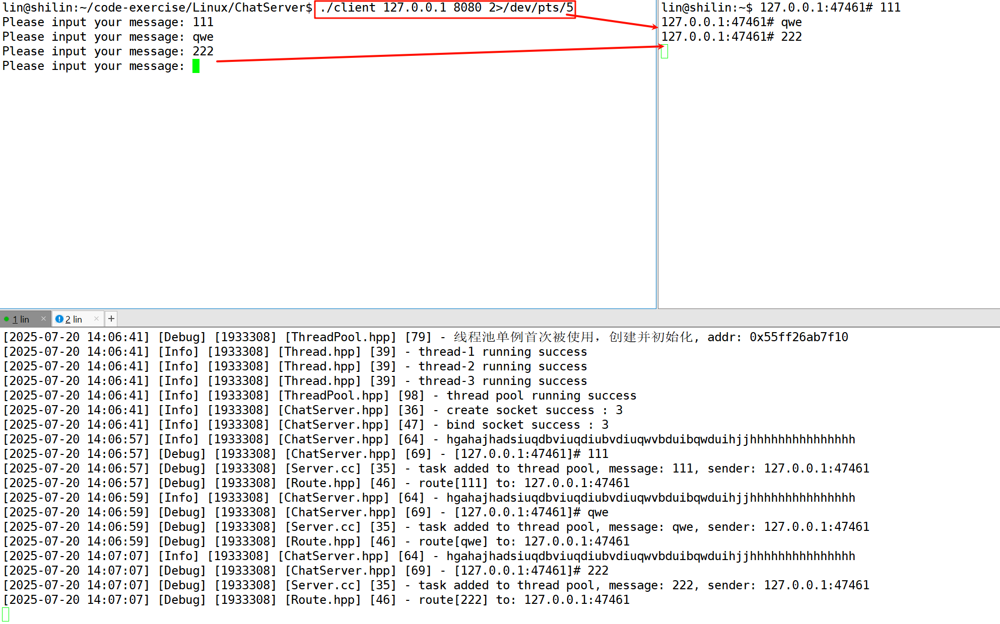

# windows客户端与linux服务端交汇
windows环境下实现客户端和我们在linux上写服务端使用的socket套接字接口一模一样，但是有三处不一样的地方

windows环境下要进行套接字方面的编程要需要使用库的，在安装vs的时候就已经有了。因此首先要包含头文件

```cpp
#include<WinSock2.h>

#pragma comment(lib,"ws2_32.lib")//windows socket 2_版本 32位 lib库
```

其次要对WinSocket初始化

WSAStartup启动WinSocket，MAKEWORD构建一个2.2库的版本，把构建出来的结果放到wsd中。这里就有点像你的客户端有版本，自己写的版本在启动的时候windows要和导入的库的版本进行对比。

```cpp
int main()
{
    WSAData wsd;//初始化信息

    //启动Winsock
    if (WSAStartup(MAKEWORD(2, 2), &wsd) != 0) {/*进行WinSocket的初始化,
	     windows 初始化socket网络库，申请2, 2的版本，windows socket编程必须先初始化。*/
        cout << "WSAStartup Error = " << WSAGetLastError() << endl;
        return 0;
    }
    else {
        cout << "WSAStartup Success" << endl;
    }
    //...
}
```

最后关闭socket并清理Winsock

```cpp
int main()
{
    //...

    closesocket(sockfd);
    WSACleanup();

    return 0;
}
```

剩下的在linux怎么写就在windows怎么写

## windows客户端
```cpp
#define _CRT_SECURE_NO_WARNINGS 1
#pragma warning(disable:4996) //vs会报一个错误，这里是屏蔽掉这个错误
#include<iostream>
#include<string>
#include<cstring>
#include<thread>
#include<WinSock2.h>

#pragma comment(lib,"ws2_32.lib")

using namespace std;

//服务器ip,端口
const string serverip = "124.223.54.148";
uint16_t serverport = 8080;

int main()
{
    WSAData wsd;//初始化信息

    //启动Winsock
    if (WSAStartup(MAKEWORD(2, 2), &wsd) != 0) {/*进行WinSocket的初始化,
        windows 初始化socket网络库，申请2, 2的版本，windows socket编程必须先初始化。*/
        cout << "WSAStartup Error = " << WSAGetLastError() << endl;
        return 0;
    }
    else {
        cout << "WSAStartup Success" << endl;
    }

    //1.创建套接字
    SOCKET sockfd = socket(AF_INET, SOCK_DGRAM, 0);
    if (sockfd  == SOCKET_ERROR) {
        cout << "socket Error = " << WSAGetLastError() << endl;
        return 1;
    }
    else {
        cout << "socket Success" << endl;
    }

    //创建收消息的线程
    thread t1([&]()
    {
        char buffer[1024];
        while (true)
            {
                struct sockaddr_in peer;
                int len = sizeof(peer);
                int n = recvfrom(sockfd, buffer, sizeof(buffer) - 1, 0, (struct sockaddr*)&peer, &len);
                if (n > 0)
                {
                    buffer[n] = 0;
                    cout << "server reponose: " << buffer << endl;
                }
                else break;

            }
    }
    );

    //发
    struct sockaddr_in server;
    memset(&server, 0, sizeof(server));
    server.sin_family = AF_INET;
    server.sin_addr.s_addr = inet_addr(serverip.c_str());
    server.sin_port = htons(serverport);

    string msg;

    while (true)
        {
            cout << "Please Enter# ";
            getline(cin, msg);
            int n=sendto(sockfd, msg.c_str(), msg.size(), 0, (struct sockaddr*)&server, sizeof(peer));
            if (n < 0)
            {
                cerr << "sendto error!" << endl;
                break;
            }
        }

    //清理
    closesocket(sockfd);
    WSACleanup();

    return 0;
}
```

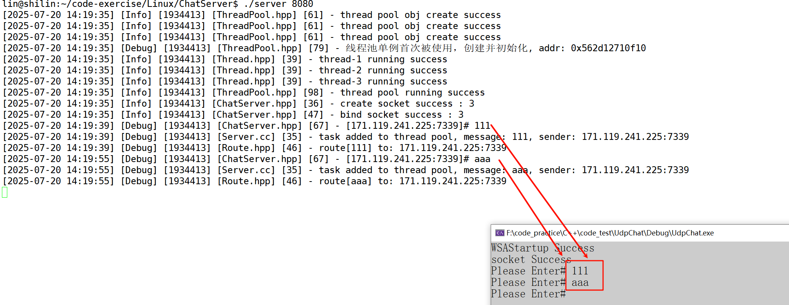

多平台涉及到编码方式不一样，但是我们这里是简单实现的，没有考虑这个问题，因此不要发中文。


