# TCP协议
# TCP协议段格式
TCP报头细节很多，我们打算这样开始

1. 认识TCP协议的报头 — 字段
2. 如何封装解包，如何分用
3. 如何理解TCP的报头
4. 学习TCP可靠性(确认应答) && 提高传送效率

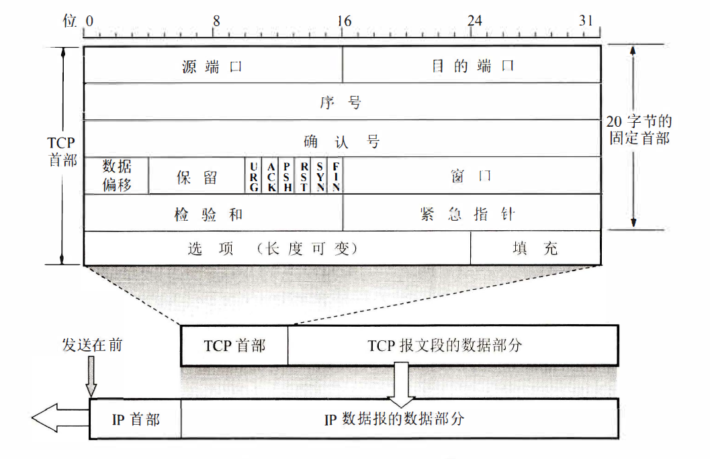

TCP协议报文也有自己的报头+有效载荷，这个有效载荷是应用层的报文，当然包含应用层报头和有效载荷。

**源/目的端口号: 表示数据是从哪个远端进程来, 到服务器哪个进程去**

## 4位首位长度
序号和确认序号等会谈  
先谈4位首位长度：  
0-31bite是这个报文的宽度。一行就是4个字节，有5行就是20字节。选项暂时不考虑，所以TCP标准长度是20字节

**如何封装解包，如何分用**  
作为接收方如何保证把一个TCP报文全部读完呢？很简单。

1. **tcp协议是有标准长度的：20 ，先读取前20字节。**
2. **转换成一个结构化的数据，立马提取标准报头中4位首部长度。**

4位首部表征的TCP报头总长度，总长度4个bite位，取值范围0000-1111->[0,15]，如果按照这样算，这个报头最短是0字节，最长是15字节，但这和tcp标准报头长就20字节了，所以这是不对的，**tcp报头总长度=4位首部长度*4字节**（相当于4位首部长度有自己的基本单位4字节），所以tcp报头长度取值范围[0,60]，又因为标准长度是20字节，所以最终tcp报头长度范围【20，60】

如果报头就是20字节标准长度，那么4位首部长度应该填写多少呢？  
x*4=20 ----> x=5 ----> 0101

**就能得到后序报头的剩下大小。**

如报头总长度是x4_，_减去标准长度20，就是剩下选项的长度字节。

x4-20 = 0; 没有选项长度字节  
x*4-20 = n; 在读取剩下选项长度字节

**只要把tcp报头全部处理读取完毕，剩下的不就是有效载荷吗？**

剩下的有效载荷直接扔到tcp接收缓冲区供上层继续读取。

这里有个隐含问题：

udp报头里面有udp报文长度，并且udp报头是标准长度，很容易知道udp有效载荷的长度，而tcp报头里，只有tcp报头的长度，不知道tcp有效载荷的长度！为什么呢？

tcp面向字节流，在学习tcp我们慢慢体会。

解包的问题我们现在没问题了，如何封装自然也出来了，能解开我们就逆向的封装。

**如何分用**呢？  
报头中有目的端口号，找到目的端口号，就可以找到应用层的进程了，数据就可以交付给进程。

现在考虑这样一个问题：  
**我们收到一个报文，是如何找到曾经bind特定port的进程的！网络协议栈和文件是什么关系！**

虽然PCB已经用双链表形成组织管理起来，但是系统是有很多的场景需要我们快速定位一个进程的，所以需要将每个PCB添加到其他数据结构里，**hash表**！

所以实际上在系统层面上所谓的bind绑定一个特定的进程，这个port在技术上在OS中以port作为key值维护一张hash表，可以采用port执行hash算法模上这个hash表空间大小，直接可以找到进程pcb，找到进程pcb不就找到进程的所有内容吗。而bind就是将进程添加到hash里面。

当今天来了一个目的端口号8080的报头，OS直接拿着目的端口号查hash表快速找到把数据找个那个进程。

---

找到进程之后怎么把数据给这个进程呢？以及进程以文件描述符方式读读这个文件呢？----> **网络协议栈和文件是什么关系!**

Linux下一切皆文件。每一个PCB内部都会维护文件描述符表，0、1、2默认被占用，假设进程在打开文件用的文件描述符是3，这个我们上层调用的就是这个sock就是3。OS为了维护文件创建一个struct file结构它里面有一大堆读写方法的函数指针，Linux下一切皆文件不就是通过函数指针的方式实现的吗。该文件的读写方法指设置的是传输层的读写方法，而文件还有自己的对应的缓冲区。

我们可以理解成，数据报文经过底层自下到上交付到传输层的时候，根据报文中目的端口号找到PCB，然后网络套接字是哪一个文件描述符在调用read的时候传过去底层也是知道的。传输层收到对应的tcp报文，将报头和有效载荷分离后，把有效载荷放到文件的缓冲区里，上层通过文件描述符读写缓冲区不就把数据读上去了吗。

对我们来讲其实网络中一旦收到了数据，经过一系列出来把数据放到文件的缓冲区里，上层就可以以文件的方式统一读取对应的网络数据了。

**如何理解TCP的报头**

Linux内核是C语言写的，在UDP说过报头是协议的表现，而协议本质就是结构体数据。所有tcp报头就是一个结构化或位段。  
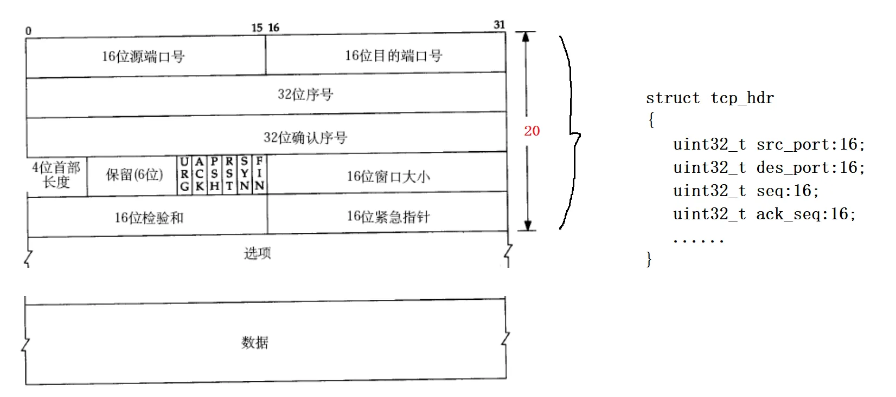  
struct tcp_hdr这是一个类型，可以定义出一个对象。  
把应用层的数据拷贝到缓冲区里，然后把报头拷贝到前面，不就是添加报头吗  
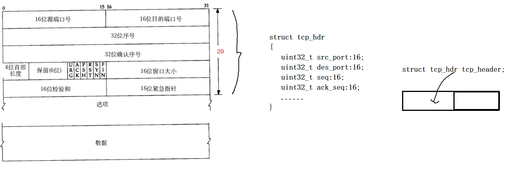  
16位校验和+选项我们不考虑，接下来学习tcp报头剩余字段以及背后的知识。

# 学习TCP可靠性(确认应答) && 提高传送效率
谈tcp必谈可靠性，但可靠性之前，考虑这几个问题：

1. 为什么网络传输的时候，会存在不可靠的问题？
2. 不可靠问题常见都有那些不可靠的场景？
3. tcp的可靠性怎么保证？

以前我们学过冯诺依曼体系结构，有cpu，内存，外设有显示器、键盘、鼠标、磁盘等所有这些设备都是独立的，但是经验告诉我们我们可以把键盘的数据放到内存，可以把内存中数据放到cpu里，这就说明一个一个孤立的硬件并不是真的孤立的它们之间是由联系的，所有设备都是用计算机中线来连接起来的。

内存和外设用的 “线”，**IO总线**  
内存和CPU连接的时候，也是用 “线”，**系统总线**

其实内存和外设之间通信，也有自己的协议！正是因为有协议所以可以用来控制外设。然后有一个工种 “嵌入式”。

我们现在知道内存和外设之间通信也有自己的协议，但是我们从来没有说过它们之间可靠性的问题。原因在于它们距离很近！

---

**为什么网络传输的时候，会存在不可靠的问题？**  
传输距离变长了

**不可靠问题常见都有那些不可靠的场景？**  
丢包，乱序，重复，校检错误。。。

**tcp的可靠性怎么保证？**  
找一个切入点理解：**如果距离变长了，存不存在绝对的可靠性？？**

有A和B两个人隔了500m，A和B说你吃饭了吗？那A能不能保证他刚说的话B听见了？不能保证！A说完之后他自己并不能确定这句话B听到，因为A没有收到B的应答！只有收到应答才能确定B听到A刚才的话了。

B给A发我吃了，当A收到B发的我吃了，站在A的角度刚才他说你吃饭了吗这条消息B100%收到了。可是站在B的角度，B给A做应答本质也是在给A发消息，那么B给A发信息B能不能保证自己发的最新我吃了的信息被A收到了呢？不能！

所以最终A又给B发了信息说，你既然吃了，我们一起去玩耍吧。当A给B回这句话的时候，站在B的角度上他能确认我刚给A发的信息A一定收到了，因为A给了我应答并且应答消息和我刚才说的匹配，可是A给B发最新消息的时候既是给B的应答也是消息，但是这条最新消息B并没有应答，那A能不能保证最新消息B收到了呢？不能！

1. 我们认为，只有收到了应答，历史消息我才能100%确认对方收到。---->确认应答了，才算可靠
2. 双方通信，一定存在最新的数据，没有应答。— 最新消息一般无法保证可靠性

所以**距离变长，不存在绝对的可靠性!**  
**但是存在相对的可靠性，一个报文只要收到了应答，就能保证该报文的可靠性！**  
所以TCP可靠性的机制都是建立在**确认应答机制**，只要一个报文收到对应的应答，就能保证我发出的数据对方收到了！

接下来理解一下**tcp收发消息的时候的工作模式**：  
一个是在理论上怎么便于理解，另一个未来实际真实工作真实的tcp是怎么工作的。

实际通信的时候，client发起一个请求，server必须给确认。由于这个应答的存在，client一定能保证自己请求100%server收到。现在能保证client->server的可靠性。  
同理server给client进行应答，client也必须给确认，所以也能保证server->client的可靠性。所以根据这个基本的**确认应答的机制就能保证两个方向的数据可靠性**。

这里注意双方在通信，这些请求应答里面携带的数据一定是被封装成**tcp报文**进行发送的。

**双方实际在进行通信的时候，可能除了正常的数据段(传输层报文—>数据段)，通信时也会涵盖确认数据段**  
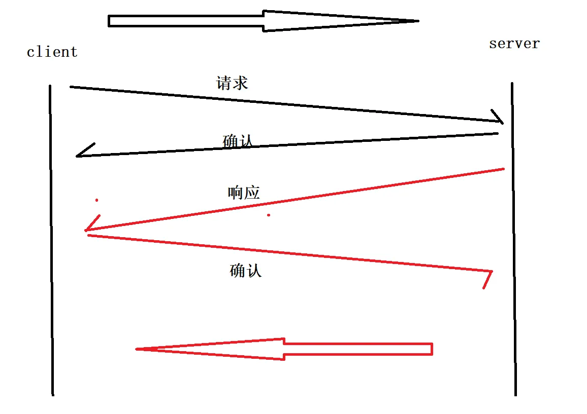

未来随着学习的深入实际上确认可以和曾经的对请求的响应打包在一起对对方进行确认。

如前面例A和B相隔500m通信，A给B发你吃饭了吗，正常来说应该B先发收到了，然后再发我吃了。B其实回了两类消息，一个是对刚才说的话确认，另一个是B在给A发信息。这种方式就是刚才的工作模式A给B发，B给A确认，然后B在给A发信息。A再给确认。这种工作方式其实是最基础的协议的理解 ，但是并不是真正的工作模式。既然A给B发信息，B要给确认还要在给A发信息，那就直接给A发信息，那么此时就可以忽略掉B给A的确认，而B给A发信息这一个报文既可以充当应答也是B给A发的信息。这是后面我们学的捎带应答。

前面最基本的方式我们要知道，但是真正的工作模式可能会存在把应答和信息放一起发。虽然一条消息表达了两种含义，本质其实还是一样的。

还有一种工作模式：  
client可能一次给server发了一大堆请求，server可以批量化的一次给每个请求确认。而且这是**tcp真实的工作模式**！

上面那种是串行的发一个消息给一个应答，不给应答就不发第二次请求，所以请求都是串行的。而这种发请求发请求发请求然后批量化发应答，这样请求和应答就是并发的  
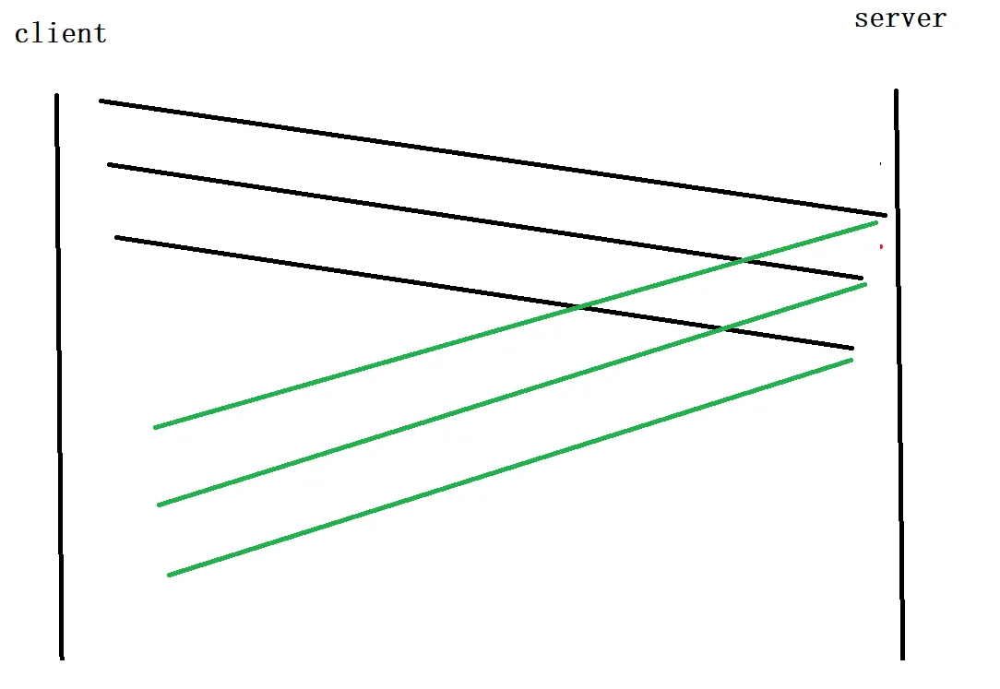  
但不管是那种工作模式，原则上无论是`c->s`，`s->c`每一个正常的数据段都需要应答。确定数据段不需要应答。

# 序号和确认序号
接下来我们在谈tcp报头里**序号和确认序号**  


今天可能c->s发信息，也可能s->c发信息，因为双方用的都是tcp协议，所以tcp双方的地位是对等的，了解tcp只需要搞定一个朝向的通信过程。反过来另一个朝向都是一样的。

tcp真实工作模式：

> client可能一次给server发送多个请求报文，server给client一次发送多个确认应答。
>

这里就有一些问题：  
**如果客户端一次给服务器发送多个请求，那么数据到达对面的顺序一定和发送的顺序一样的吗？**  
肯定是不一定！

**那server连续收到若干个请求之后，要给请求做确认，那站在client端它怎么知道这些确认和请求的对应关系呢？** 说白了就是那个确认和请求是谁给谁是一对呢？  
最尴尬的就是client发了4个请求，server只回了三个确认，那client就必须要知道发了4个收到3个，是哪一个报文丢失了！

所以这就注定了**tcp请求报文(数据段)需要有方式标识数据段本身**，因此每一个数据段都要有自己的32位序号。

**注意每一个请求和确认应答都是一个TCP报文，无非就是有数据的包含有效载荷，没有数据的只包含一个TCP报头。** 把序号往报文里一填，那每个TCP报文不就都有序号了。  
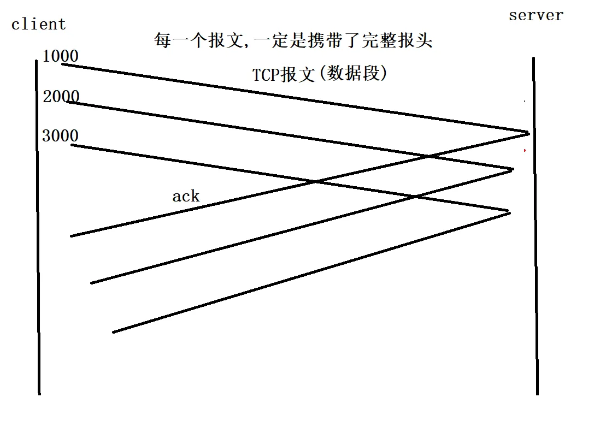

接下来server要给应答，应答要和请求一一对应上，client也要知道应答是对那个请求的应答，所以也注定了**应答报文，对应的报头中必定涵盖了确认序号！**

那序号和确认序号是什么样子的呢？  
现在client发一个1000的报文过了，server它未来给这个报文的确认序号是1001。如果发过来2000，server给的确认序号是2001。也就是说你发过来报文序号是多少，**未来给报文的确认序号是发过来序号+1**。

因为32位确认序号表示：接收方已经收到了确认序号确认序号之前的所有的(**真的所有，而且连续的**)报文，告诉对方，下次发送从确认序号指明的序号发送！

如果今天client序号2000报文丢失了，server只收到了序号1000，3000，那server ack的是第一个是ack1001，2000丢了就没有ack了，虽然收到了序号3000，那下一个ack应该是多少呢？ 虽然序号3000 server收到了但是3000之前并不是连续的，**ack只能填1001**！

那为什么这样做呢？不是你给我发多少我给你确认多少呢？具体我们在滑动窗口看，实际是确认序号要支持滑动窗口线性右移的。

还要一个问题：

**tcp报文为什么要有两组序号呢？**

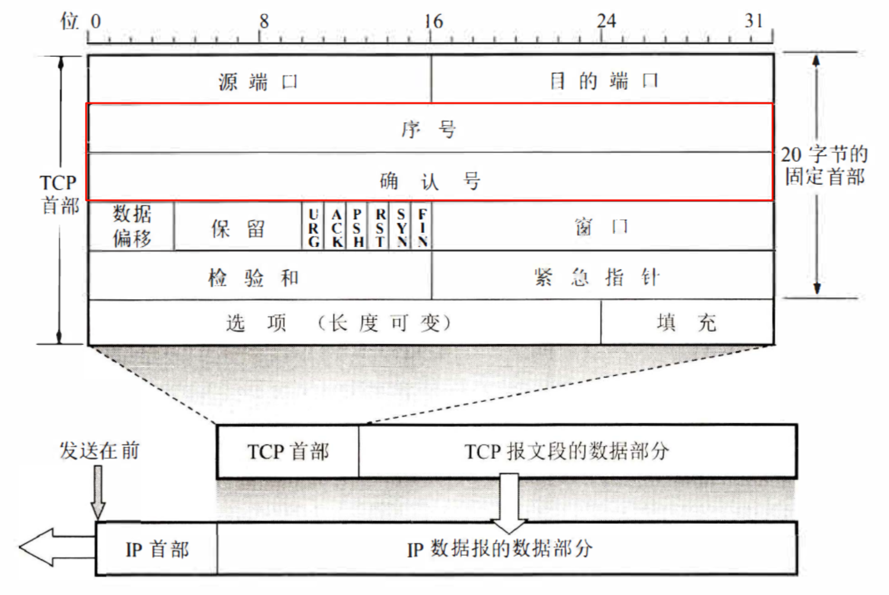

请求和应答在报头里搞成一个32序号不行吗，请求我在报头该字段填上序号，响应我也在报头该字段填上确认序号不就行了。**为什么要有两种独立的序号？**

tcp全双工的，我在给你发信息时，我填我的序号你给我确认序号，同时server也可以给client发信息，那server是不是要有自己序号啊！一组序号搞不定，必须要是一对序号。

前面我们也说过，这个应答报文，既可能是应答也捎带发给别人数据。所有必须有序号和确认序号这样理解也没错。

**如果客户端一次给服务器发送多个请求，那么数据到达对面的顺序一定和发送的顺序一样的吗？**  
可能不一样，但是因为任何一方都会收到报文，**而报文中会携带序号**，可以对其**排序**！

# 16位窗口大小
tcp双方都有自己的发送缓冲区和接收缓冲区，应用层调用IO接口把数据拷贝到client发送缓冲区然后经过网络发送到server接收缓冲区，同样server也把数据拷贝到发送缓冲区发送给client接收缓冲区。

client与server可能相隔千里之外并且client发送数据可能非常快，但服务器根本来不及接收。把服务器接收缓冲区打满之后再来的报文只能丢弃。除了发的快来不及接收的问题，还要发的慢影响对方上层正常业务处理速度。所以TCP这里发送数据的时候，快了不行，慢了也不行，必须要合适！

那作为发收方如何得知我发送数据是合适的？得到反馈！怎么得到呢？所以**发收方需要得到对方的接收缓冲区剩余空间的大小！**

知道了对方接收缓冲区剩余空间的大小，那发送方就可以控制自己的速度。同理tcp是全双工的我在给对方发消息的同时，对方也在给我发信息，我保证给对方发信息的速度，那对方也要保证给我发信息的速度，所以都要知道对方接收缓冲区剩余空间的大小！因此我们就有了**16位窗口大小**，表示的是**接收缓冲区剩余空间的大小**。

那这个16位窗口大小填的是对方的还是我自己的接收缓冲区剩余空间的大小？**16窗口大小填的是自己的接收缓冲区剩余空间大小**。如果知道对方的接收缓冲区大小那根本就不需要16位窗口大小。**因为构建的所有的TCP报文，都是要给对方发送的！** 这套规则对client，server同样适用。**达到了交换接收能力的目的。** 并且在两个朝向上进行**流量控制**！

# 6个标志位
有的tcp标准是8个标记位，但这里我们学其中6个最普世的。

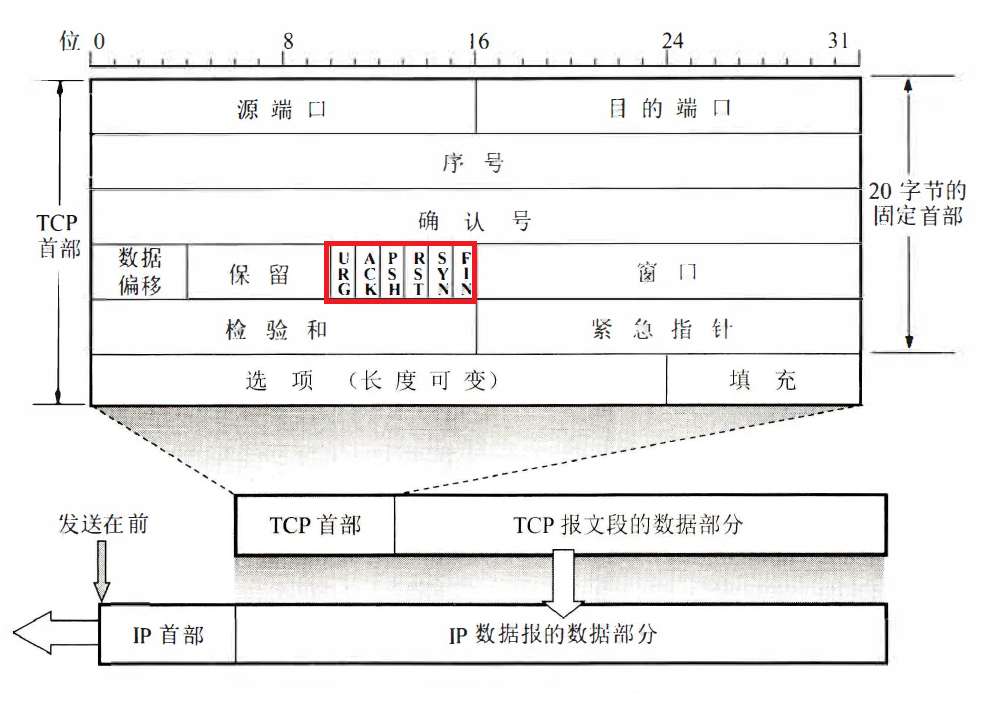  
什么是标志位？其实就是结构体中的位段！0（无效），1（有效）

上面说过数据段在来回通信的时候，有的是正常的数据报文，有的是确认报文。 这里我们就可以理解**tcp报文也是有类型的！**

在学习套接字的是我们写过tcp代码，知道双方tcp协议在通信之前要先建立连接也就是三次握手，然后双方才能正常通信，未来双方不想通信了就进入四次挥手。这我们早都知道了，对服务器来说，它对应的客户端可不止一个，服务器可能面临非常多的客户端，可能随时随地的接收其他客户端的连接请求、正常数据IO、断开连接等等，所以**站在服务器的角度它一定会收到各种各样的tcp报文**！所以**接收方要根据不同的tcp报文，要有不同的处理动作！** 收到连接请求报文就三次握手建立连接，收到断开连接请求就四次挥手断开连接等等。

**tcp报文也是有类型的**，是通过tcp报文6个标记位所区分的！

---

**SYN标记位：该报文是一个连接请求报文**，请求建立连接。该标记位默认为0，只有在建立连接时该标记位才会设置为1。 我们把携带SYN标识的称为**同步报文段**

**FIN标记位：该报文是一个断开连接请求的报文**，该标记位默认为0，置为1表示这报文是一个断开连接的请求。我们称携带FIN标识的为**结束报文段**。

**ACK标记位：该报文是一个确认应答的报文**，当双方正在进行通信时，client给server发请求，server要给client进行确认，确认时确认序号要填，但怎么保证它正常的数据请求报文，还是确认报文呢？所以只要该报文是确认，ACK都要置为1，或者是一个正常数据请求报文但是这个报文本身有确认的能力也要把ACK置为1。一般ACK标记位在三次握手建立好几乎通篇报文都带ACK，请求或者响应都会承担着对厉害报文的确认。但第一次发起链接请求报文并不是任何报文的确认ACK是0。

**PSH标记位**：PSH可以认为是PUSH的简写，刚才说的16窗口大小，发送方给接收方发信息，接收方把信息放到接收缓冲区里然后上层把数据取走，接收缓冲区有人放数据有人拿数据，但是今天接收方上层非常忙，做上层数据处理要很长时间，来不及从接收缓冲区里拿数据，所以最终导致接收缓冲区会越来越满，接收能力也越来约慢，假设发收方把接收方接收缓冲区打满了，如果上层一直不把数据拿走难道发收方要一直在等吗？不可能一直等！等一段时间发收方会给接收方发一个询问报文这个报文并不会携带数据，接收方收到后给我ack的时候就会重新通告它的接收缓冲区大小放到16为窗口，如果接收方给发收方回的报文说的还是0，发收方可能不耐烦了，然后再发询问报文，但这次会把**PSH标记位**进行设置，接收方你把你的窗口大小给我并且让你的上层赶紧把数据取走，我不能等了，赶紧把数据取走。**催促接收方，让上层尽快取走数据！**，如何催促呢？多路转接我们在理解。

**URG标记位**：正如我们前面谈过TCP真实工作模式，发收方一次发送批量带序号的请求报文，但是接收方一定能保证是按顺序接收的吗？并不能！所以**数据对于接收方而言乱序本身就是不可靠的表现**，tcp要保证可靠性，所以**tcp要对收到的数据进行排序，保证数据的按序到达！**，如何排序呢？**tcp报文是带有序号的！**，这也是序号的另一个意义。这样上层就可以按照序号顺序取走数据，接收缓冲区相当于queue。因为**tcp有对应的按序到达，如果我们的数据想要插队呢？** 这就有了URG。**如果报文中有需要被特殊尽快读取的数据，可以将URG标志位置为1** ，**表明这个报文中的有效载荷是涵盖有紧急数据的，注意我并没有说报文中有效载荷都是紧急数据！** 那这个数据在哪里呢？这个时候就有**16位紧急指针来标识**，**16位紧急指针表达的是在有效载荷中的偏移量**。假如紧急指针写个20，也就是说该报文中有效载荷偏移量为20的数据开始是要紧急处理的！现在这个紧急指针偏移量我知道 ，那这个紧急数据到那结束呢难道到有效载荷的结尾？并不是，**根据16位紧急指针找到偏移量以字节位单位，往后读取一个字节就是紧急数据**。**紧急数据不需要排队直接被上层读取，一般这个URG这个1字节数据也成为****带外数据****。**

---

带外数据并不是tcp帮我们主动弄这个功能，而是tcp提供这个功能供上层选择，我们自己在写服务器的时候可以自己选择正常读数据之前有没有带外数据，

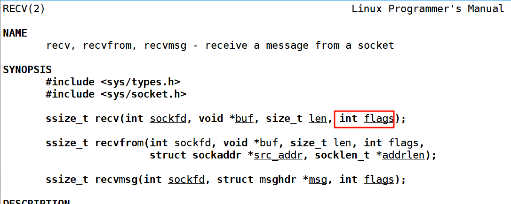  
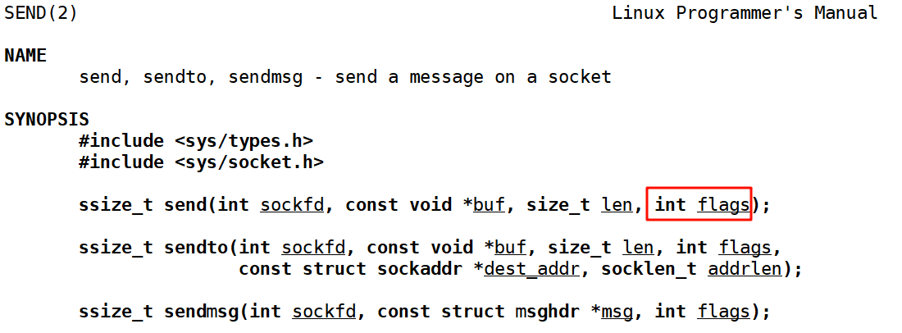

设置这个就可以读写带外数据  
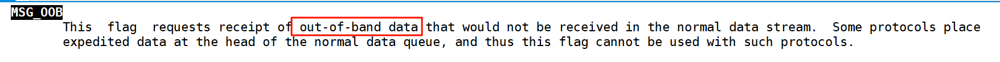

**RST标记位：**reset的简写。在写套接字tcp协议的时候我们曾经说过通信双方在通信之前必须要把三次握手建立好才能进行通信。这里有个问题，三次握手建立连接，**三次握手一定能保证握手成功吗？** 不一定！这个世界上没有100%一定成功的，并且我们也知道三次握手最后一次ack是没有应答的可能会出现握手失败的情况。同理**四次挥手也一样！** 人家只是在tcp这里设立了建立连接三次握手断开连接四次挥手，但可没说一定成功，但是能保证只要把三次握手四次挥手走完就保证算你连接建立成功和断开连接成功。其次**即便是连接建立成功了，我们通信过程中也有可能出现单方面出现问题**！如服务器电源拔掉了。然后插上电之后服务器重启了，但是现在这个服务器操作系统并没有意识到历史还断连接的，虽然这个连接在物理就被干掉了。但是客户端知不知道服务器重启过呢？并不知道，你服务器又没有给我四次挥手。所以就可能会存在**client认为连接还存在**，**服务器认为连接不存在**。如果client认为连接还存在会出现什么问题？是不是就直接发报文了，可是报文是有类型，就注定了这个报文不会携带SYN，服务器收到这个报文很奇怪，我和你并没有建立连接，我们协议规定好我们通信之前要先建立连接，你直接把数据发过来了。**所以服务器此时直接给客户端回一个报文，而这个报文回携带RST标记位**。告诉客户端这个连接出异常了，你关闭现在的连接然后重新和我建立连接把！

**RST: 对方要求重新建立连接，我们把携带RST标识的称为复位报文段**。有了RST标记位双方连接建立一方认为成功一方认为不成功那么后序在通信的时候，认为不成功的一方就把连接重置了。

到目前为止我们已经把tcp报头都学完了。自己也可以把选项部分可以看一看。

这个返回值表示实际发了多少数据，len表示你期望发多少数据。读取也是一样的。

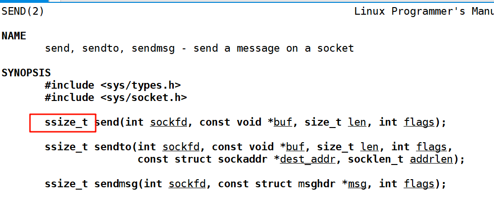

# 确认应答机制
数据段有序号，那如何理解这个序号呢？  
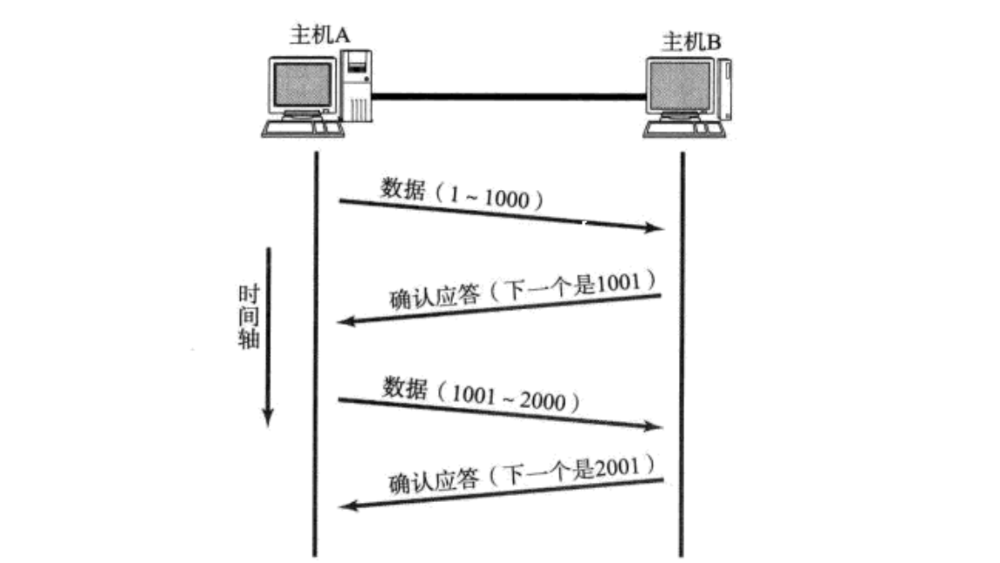

tcp是全双工的，`c->s`，`s->c`，都有自己的发送和接收缓冲区，这些缓冲区都是字节流的，我们其实可以把这个缓冲区当成`char outbuff[N]`固定大小的数组，我们把数据从应用层的缓冲区拷贝到发收方的发送缓冲区里，其实是把数据一个个放到这个数组里面，**只要拷贝到了发送缓冲区，每个字节，就天然有了序号！** 这个序号就相当于**数组的下标**。

报文发送直接在报头填这个发送数据最后一个数组下标，假设发的是0-1000的数据，报头填的是1000，对方确认序号ack+1，表明下次给我从1001开始发。

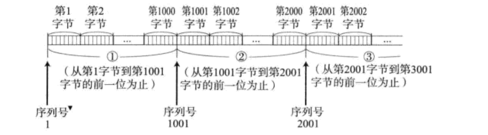

# 超时重传机制
在前面我们说过什么是不可靠，有一种不可靠叫做丢包，怎么解决呢？TCP策略**重传**！因为我们有流量控制根本不担心是发送太快导致丢包，而是真实在网络传输中丢包了。

1. **发送方如何判断丢包了呢**？

丢包有两种情况

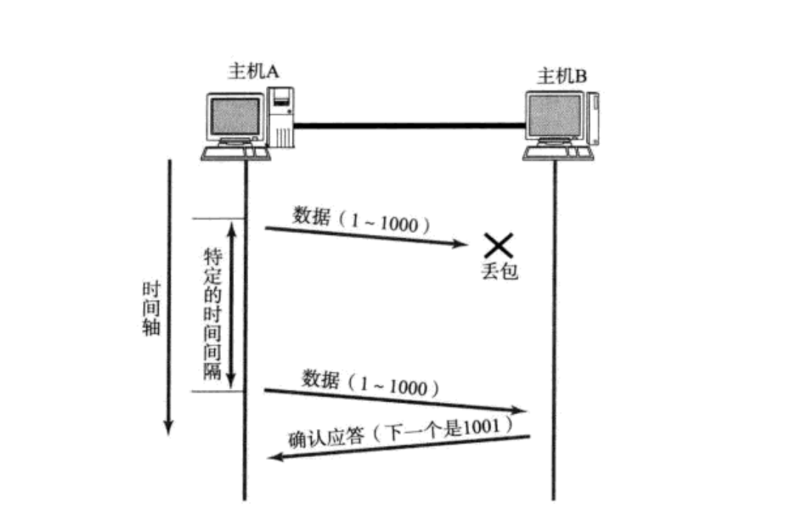

第一种情况：主机A和主机B通信，主机A发送的数据真的丢了，站在接收方主机B的角度它认为自己没有接收到过报文，所以主机B也绝对不会给主机A发起应答。所以主机A一旦丢包了，等待一段时间没有收到对应的应答，那么主机A当前就认为丢包了。此时等到特定的时间间隔到了主机A就会进行对应的超时重传。

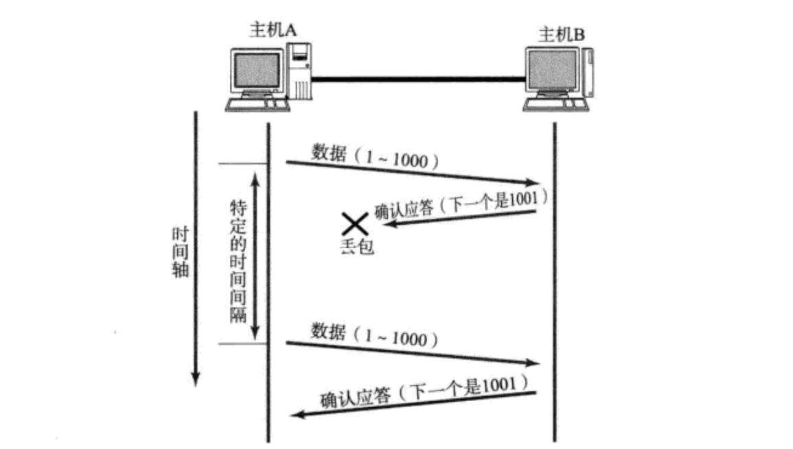  
第二种情况：主机A给主机B发消息，数据真的主机B已经收到了，但是主机B给主机A应答(也是一个报文ack设置位1)丢了，站在主机A的角度主机A看到的场景和上面那种情况是一样的，主机A没有收到应答，主机A照样判定丢包了，等到特定的时间间隔到了主机A就会进行对应的超时重传。

所以发收方怎么判断丢包了呢？  
**其实真正有没有丢包，发收方其实不知道。通过定的策略，超时了，就判断丢包了。**

第二种情况，主机A发给主机B的数据，主机B真的收到了，但是应答丢失了，等到特定的时间间隔到了主机A又给主机B发信息，这时主机B收到了两份一样的数据！  
所以**接收方，可能会收到一样的数据，收到多份一样的数据也是不可靠的一种表现！** 因此接收方要进行去重！如何去重呢？**根据序号去重！**

由于不知道发出的数据接收方到底有没有收到，为了支持超时重传这个数据必须在发收方维持一段时间，思考下面一个问题。

1. **思考点：发送端，把数据发出，被发的数据并不是我们的那样被立即移除，而要被暂时维持一段时间，维持在哪里？**

难道还要在别的对方把这个数据在保持一份吗？本来就在缓冲区里，在拷贝一份就是浪费资源。那这个资源在缓冲区哪里呢？后面我们在滑动窗口哪里再说。

如何理解计算机的移除，计算机移除并不会把数据清零，而是覆盖它。

2. **超时时间怎么定？固定的吗？**

一定不是固定的，是随着网络情况决定的，而网络情况一定是变化的！

+ 最理想的情况下, 找到一个最小的时间, 保证"确认应答一定能在这个时间内返回"
+ 但是这个时间的长短, 随着网络环境的不同, 是有差异的.
+ 如果超时时间设的太长, 会影响整体的重传效率;
+ 如果超时时间设的太短, 有可能会频繁发送重复的包;

TCP为了保证无论在任何环境下都能比较高性能的通信，因此会动态计算这个最大超时时间

+ Linux中(BSD Unix和Windows也是如此), 超时以500ms为一个单位进行控制, 每次判定超时重发的超时时间都是500ms的整数倍.
+ 如果重发一次之后, 仍然得不到应答, 等待 2*500ms 后再进行重传.
+ 如果仍然得不到应答, 等待 4*500ms 进行重传. 依次类推, 以指数形式递增.
+ 累计到一定的重传次数, TCP认为网络或者对端主机出现异常, 强制关闭连接

# 连接管理机制
在正常情况下, TCP要经过三次握手建立连接, 四次挥手断开连接

在套接字学习我们见过这张图，那个时候我们重点在两端，今天我们重点在中间部分。

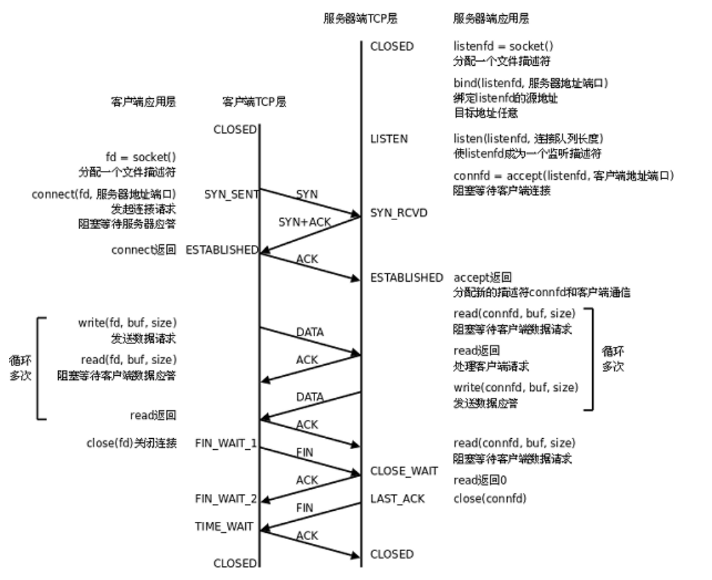

## 如何理解连接
未来可能有大量的client会连接server，**所以server端一定会存在大量的连接**！

那么OS要不要管理这些连接呢？如：连接跟谁连，现在是什么状态，连接有没有异常等等。  
OS要管理，那如何管理呢？ **先描述，在组织**！

所谓的连接：本质其实就是内核的一种数据结构，建立连接成功的时候，就是在内存中创建对应的连接对象！在对多个连接对象进行某种数据结构的组织。  
但**维护连接是有成本的(cpu+内存)**

## 如何理解三次握手
双方通信之前必须要先建立连接，经历三次握手。

这里的SYN是一个tcp报文。只不过这个报文中只有报头，并且SYN置为1，是一个连接请求的报文。

SYN+ACK也只有报头，SYN，ACL置为1，同意建立连接并且这个报文也是对上一个报文的确认。

ACK也是只有报文，ACK置为1，对上一个报文的确认。

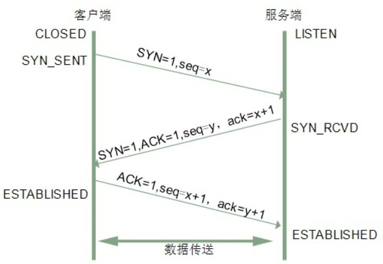

这就是三次握手。不能理解就发了一个SYN，ACK。

报头就是一个结构化数据当然可以在网络中传输了，所以它们可以建立连接，与此同时它们的状态也会发生变化。客户端只要把连接请求报文发出就会把自己状态变成SYN_SENT(同步发送)，服务器收到SYN把自己状态变SYN_RCVD(同步收到)，然后客户端收到之后，一把ACK发出它就认为把连接建立好了，因为发收方认为三次握手已经完成了，**所谓的三次握手就是双方有来有回的吞吐了三个报文**。等到服务器等会收到ACK也认为连接建立好了。所以客户端和服务器认为连接建立好是有时间上差别的。

**三次握手是建立连接的****机制****，可没有说一定能保证握手成功。包括四次挥手也是一样的。**

---

1. **三次握手不一定成功，最担心的其实就是最后一个ACK丢弃，但是有配套的解决方案！**

三次握手过程中，前两个报文都有应答，即使丢包了也没关系有超时重传机制，但是最怕的就是最后一个ACK丢了，站在客户端角度它把ACK发出去就已经认为连接建立好了，但服务器没收到这个ACK它认为连接没有建立好。虽然可能会有这样的情况但是我们不担心，首先这个ACK丢了，服务器没有收到应答，然后会触发超时重传，其次我们说过客户端和服务器认为连接建立好是有时间间隔的，即使客户端在这个时间内发了信息，但是服务器认为没建立好连接，然后返回时在报头设置RST，让客户端连接重置。

2. **客户端和服务器连接是要被OS管理起来的，先描述，在组织。但维护一个连接是有成本的。**

现在知道前面两个知识，我们在解决下面的问题就好理解了。

## 为什么要三次握手？
**一次握手行不行？**  
直接客户端给服务器发个报文说我要连接你了，服务器不回答。这样可不可以呢？  
**绝对不可以**！今天只需要发一个SYN就把连接建立好了，那么作为客户端写一个死循环不断向服务器发起connect，那只要发起一个connect服务器就认为连接建立好了，服务器端和客户端就要为了维护连接而付出成本，那就注定了客户端一台机器就可以频繁向服务器发起SYN，就会导致**服务器一定要维护好已经建立好的连接了。** 一个SYN就要吃掉服务器一点资源，最终会导致服务器的资源会越来越少。这就是**SYN洪水**！

**二次握手行不行？**  
客户端给个SYN，服务器给个SYN+ACK或者就ACK，可以吗？不行！刚开始发起连接请求的一定是客户端，服务器收到请求之后只要它把ACK发出去，但这个ACK客户端没有收到，但是服务器认为连接建立好了，所以二次握手有同上的问题。

**三次握手为什么行？**  
tcp通信是全双工的，那客户端和服务端都必须既能收消息也能发消息，可是通信之前首先要保证双方既能收又能发。而**三次握手是用最小成本验证全双工通信信道是通畅的，** 一次两次握手都不能验证全双工通信。其次虽然客户端还能大量的发起connect攻击服务器，但是这次就不一样的，因为最后一次握手发出ACK是客户端做的，而是由服务器来最终确认连接是建立好的，也就是说你要让我服务器连接建立好，你客户端要先把连接建立好。即使是服务器受到了伤害客户端也同样收到伤害(我连接建立好，你连接也得建立好)。**三次握手可以有效防止单主机进行服务器进行攻击**

**那是不是服务器就不会受到SYN洪水攻击了？**  
服务器受到攻击，本身就不该是tcp握手解决的！(一台不行多搞几台攻击服务器)，但如果你有明显漏洞，那就是你的问题了！三次握手能够明显避免SYN洪水攻击，但它不是为了解决这个问题，它的初衷是为了避免自己的明显漏洞。

**四次握手行不行？五次呢？六次呢？。。。**  
四次握手也能验证全双工但是有个问题，最后一次发ACK的是服务器，它要先把连接建立好，和两次握手一样的问题。偶数次握手的情况都有这样的情况。奇数次握手和三次握手是可以的，但更重要的理由就是三次都行了还要四次、五次、六次等。

三次握手其实也可以理解成四次握手，因为第二次握手SYN和ACK正常情况下应该是两个报文。不过一般都不分开。

---

补充一个问题：

**为什么要连接？**  
因为要保证可靠性，为什么把连接建立好就保证可靠性了呢？实际面向连接本身并不能直接保证可靠性，是间接的！因为进行tcp建立的连接的时候，你怎么知道当前报文丢了，你怎么知道当前连接是属于新建状态还是通信状态还是断开状态，那些报文丢失了需要重传、重传时间是多长等等，像这些tcp可靠性特征全部是要维护到tcp连接结构体里的，正是因为有了三次握手的机制，所以才帮我们建立双方连接结构体这样的共识，正是因为有了连接结构体才能更好的完成超时重传、流量控制、拥塞控制等等策略。所以连接结构体是tcp保证可靠性的数据结构基础，而三次握手是创建连接结构体的基础！所以tcp三次握手就间接保证了可靠性！

为什么UDP不需要连接，因为它不需要维护双方通信状态等等，所以也不需要握手。

## 如何理解四次挥手
首先建立好的连接，那么客户端和服务器双方都已经把建立和的连接维护起来了。建立连接是一方主动发起，**断开连接是双方的事，又因为tcp是全双工的，所以需要征得双方同意。**

客户端和服务器说我不想给你发信息了，我发完了，我要断开连接。这是客户端想要告诉服务器的事情，所以必须要保证这条消息从客户端到服务器的朝向上的可靠性！所以服务器必须要给客户端对应的ACK应答。这已经挥手两次了。断开连接需要征得双方同意，那服务器已经同意了。当对方已经告知我不会给我发信息了，如果我还给他发就是断的彻底，因此我也要告知对方。服务器给客户端说我也发完了，不想给你发消息了，我也要断开连接。这个消息也必须保证可靠的被客户端收到了所以客户端也要给我ACK应答。那么可以保证从服务器到客户端的可靠性。至此以后双方就没有通信数据了。所以就有了四次挥手。

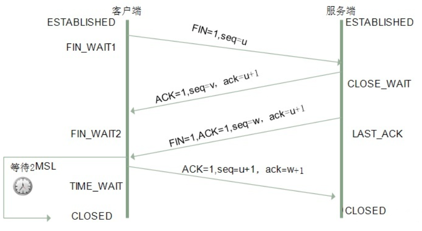

看上面这张图，可能会有疑问，客户端不是说好断开连接不发信息了吗，为什么还能给服务器ACK应答呢？  
注意无论是客户端还是服务器，**这里所谓的不发数据指的是不发用户数据，并不代表底层没有管理报文的交互。**

那tcp协议怎么知道把用户数据发完了呢？  
**tcp不知道！但是用户知道的---------上层会调用close(sock)关闭文件描述符，说明上层不会在发数据了。**

如果今天客户端给服务器发了断开连接，如果此时服务器刚好也要和客户端断开连接，那么此时就会将FIN+ACK一起发给客户端，最终就会变成三次挥手！  
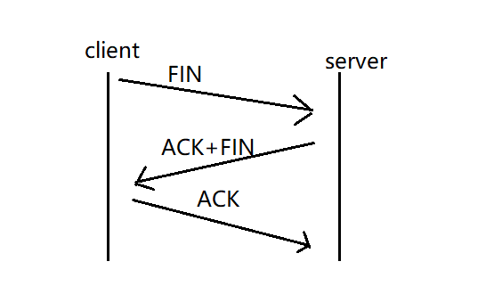

**tcp四次挥手状态的变化**

**在四次挥手期间任何一方都可能断开连接**  
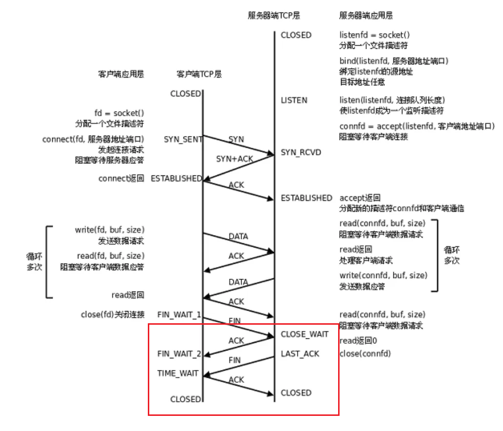

客户端先发起断开连接,只要把FIN发出，它就处于`FIN_WAIT_1`状态，服务器收到FIN立即给对方ACK，只要把ACK发出去了服务器状态立马进入`CLOSE_WAIT`状态，这个时候服务器连接还没关只是处于**预关闭**状态。服务器也要和客户端关闭连接发出FIN后，服务器进入`LAST_ACK`状态。客户端收到FIN后给对方发出ACK确认，客户端立即进入`TIME_WAIT`状态。

**主动断开连接的一方，最终状态是TIME_WAIT状态。**  
**被动断开连接的一方，两次挥手完成，会进入CLOSE_WAIT状态。**

我们主要研究这两种状态！

**无论是主动还是被动和是客户端或者是服务器没关系，因为TCP是地位对等的协议。**

**如何让服务器一直处于CLOSE_WAIT状态，不继续往下走？**

> 让服务器**不要调用close**！那服务器只是被动触发完成两次挥手，因为不会调用close所以也不会给客户端发送FIN也就不会进入LAST_ACK状态。服务器一直处于CLOSE_WAIT状态。
>

我们把以前代码拿过来修改，验证一下这个场景。

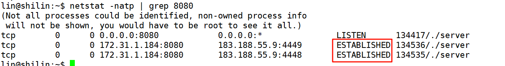

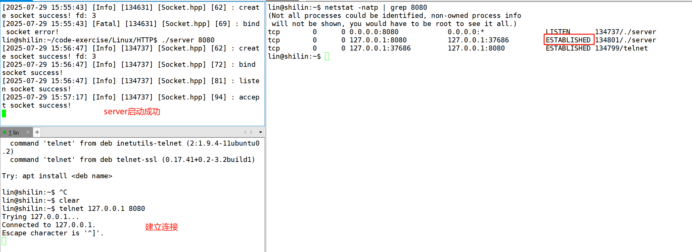

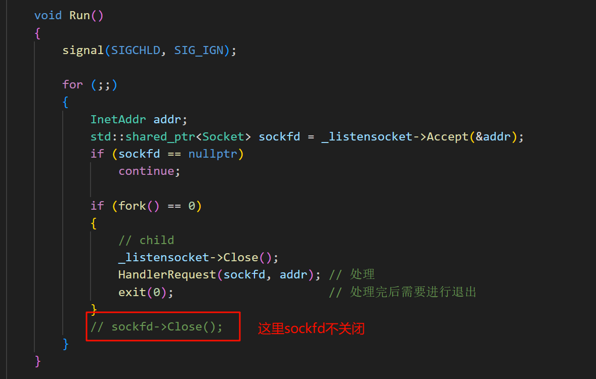

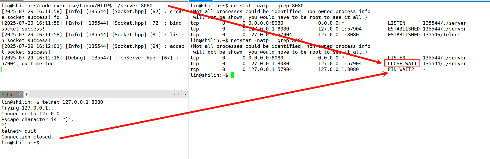

**如果我们的服务器出现大量的close_wait**

1. **服务器有bug，没有做close文件描述符的动作**
2. **服务器有压力，可能一直在推送消息给client，导致来不及close**

当服务器也退出了，**四次挥手动作已经完成，但主动连接的一方要维持一段时间的time_wait状态**

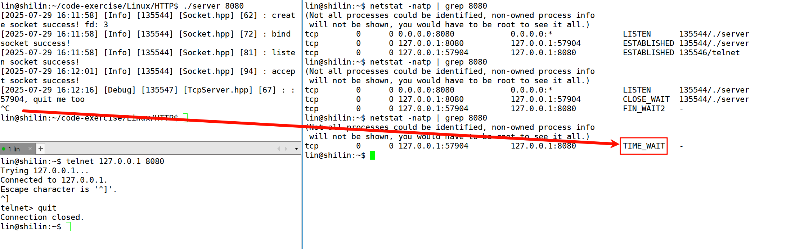  


如果不进行关闭：

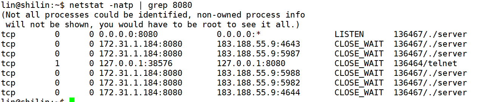


为什么要维持一段时间呢？一般是多长时间，为什么？

我们把一个消息从客户端到服务器或者从服务器到客户端最大时间叫做MSL(**单向传输时间最大传送单元**)。

**time_wait状态时间一般是2*MSL**。为什么是2*MSL以及为什么要等？

1. 在四次挥手过程中，两个FIN丢不害怕，第一个ACK丢也不怕，虽然双方处于连接半关闭状态但是连接还是在的，即使是丢包也有能力进行重传的，但是最怕的是ACK出现丢失，如果没有time_wait状态，那客户端一把ACK发过去就立刻把连接就全部都关了，万一这个ACK丢了呢？服务器当然可以FIN进行超时重传，但是客户端已经把连接关闭了根本不会做任何响应了。这明显是一种故障，服务器本来大量时间就应该忙在给客户端提供服务上，即便问也应该是客户端。那为什么是2_MSL，因为2_MSL刚好是一端进行补发FIN另一端ACK响应到达的时间。**保证最后一个ACK尽可能被对方收到**
2. **双方在断开连接的时候，网络中可能还有滞留报文，等到2*MSL时间也是为了保证滞留报文进行消散**

结合上面的只是我们解决一下历史遗留问题。

**服务器有时候可以立即重启，有时候无法立即重启。bind error**

客户端先断开连接(是主动断开连接的一方)，服务器可以立即重启

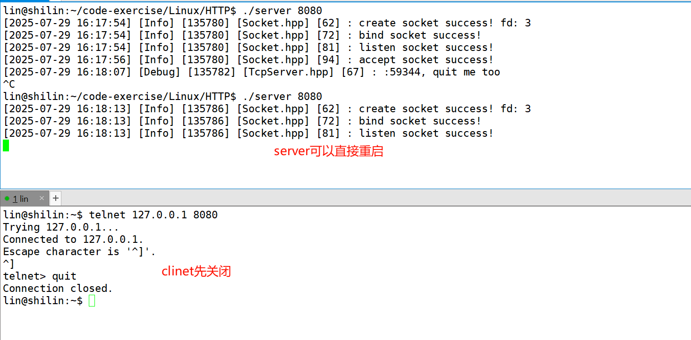

服务器先断开连接(是主动断开连接的一方)，服务器不能立即重启

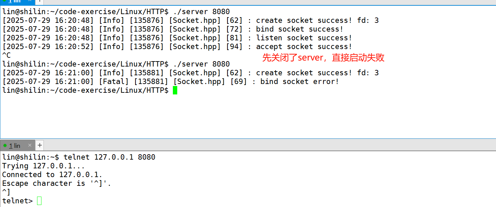  
**当前是服务器先把连接断开的，它就会处于一段时间的time_wait状态，而维持time_wait期间该端口和连接依旧存在，该端口依旧被占用，所以无法bind端口号成功！**

怎么解决这个问题呢？想让服务器怎么重启就怎么重启！这个问题的危害，实际爆发的场景。

比如618大量客户端向服务器发送请求，这个服务器承受能力是10w，超过10w就被压垮了，服务器崩掉了以前处于连接 状态的连接就由服务器主动断开，服务器处于大量time_wait，如果这个时候无法让我重启，让服务器等个time_wait时间，那损失太大了。

**使用setsockopt()设置socket描述符的 选项SO_REUSEADDR为1, 表示允许创建端口号相同但IP地址不同的多个socket描述符**

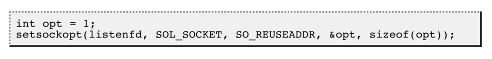

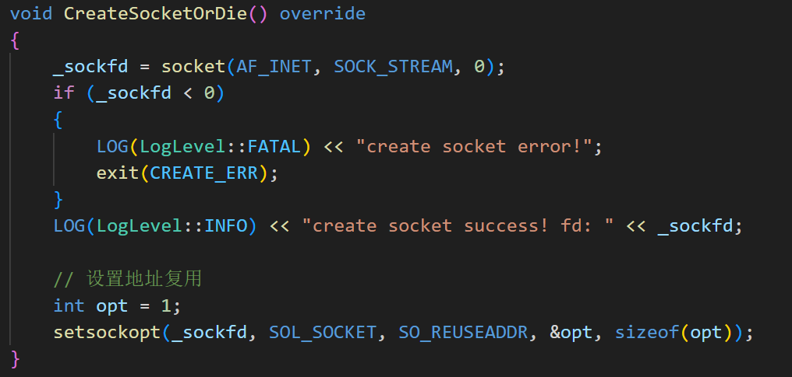

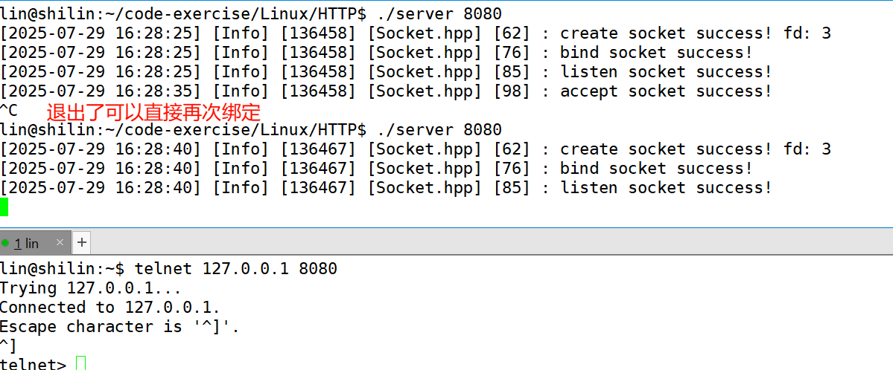

客户端状态转化：

+ [CLOSED -> SYN_SENT] 客户端调用connect, 发送同步报文段;
+ [SYN_SENT -> ESTABLISHED] connect调用成功, 则进入ESTABLISHED状态, 开始读写数据;
+ [ESTABLISHED -> FIN_WAIT_1] 客户端主动调用close时, 向服务器发送结束报文段, 同时进入FIN_WAIT_1;
+ [FIN_WAIT_1 -> FIN_WAIT_2] 客户端收到服务器对结束报文段的确认, 则进入FIN_WAIT_2, 开始等待服务器的结束报文段;
+ [FIN_WAIT_2 -> TIME_WAIT] 客户端收到服务器发来的结束报文段, 进入TIME_WAIT, 并发出LAST_ACK;
+ [TIME_WAIT -> CLOSED] 客户端要等待一个2MSL(Max Segment Life, 报文最大生存时间)的时间, 才会进入CLOSED状态.

服务端状态转化：

+ [CLOSED -> LISTEN] 服务器端调用listen后进入LISTEN状态, 等待客户端连接;
+ [LISTEN -> SYN_RCVD] 一旦监听到连接请求(同步报文段), 就将该连接放入内核等待队列中, 并向客户端发送SYN确认报文
+ [SYN_RCVD -> ESTABLISHED] 服务端一旦收到客户端的确认报文, 就进入ESTABLISHED状态, 可以进行读写数据了.
+ [ESTABLISHED -> CLOSE_WAIT] 当客户端主动关闭连接(调用close), 服务器会收到结束报文段, 服务器返回确认报文段并进入CLOSE_WAIT;
+ [CLOSE_WAIT -> LAST_ACK] 进入CLOSE_WAIT后说明服务器准备关闭连接(需要处理完之前的数据); 当服务器真正调用close关闭连接时, 会向客户端发送FIN, 此时服务器进入LAST_ACK状态, 等待最后一个ACK到来(这个ACK是客户端确认收到了FIN)
+ [LAST_ACK -> CLOSED] 服务器收到了对FIN的ACK, 彻底关闭连接

下图是TCP状态转换的一个汇总:

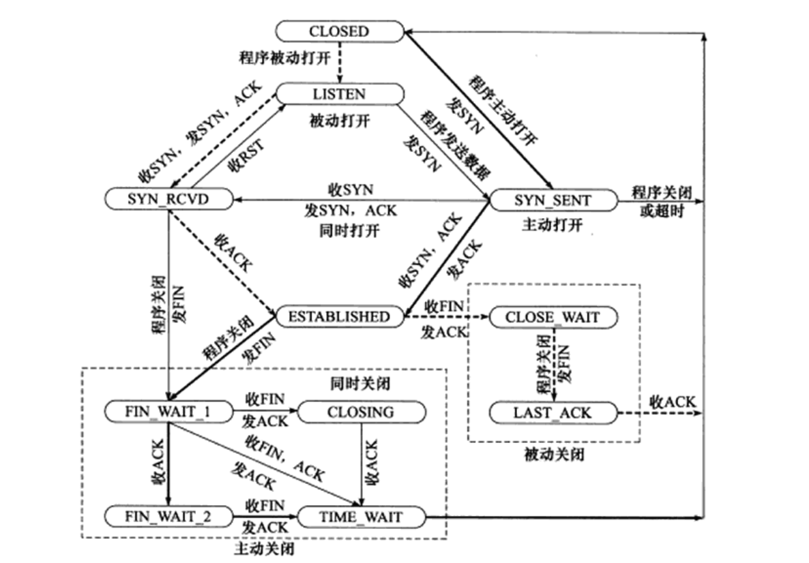

+ 较粗的虚线表示服务端的状态变化情况;
+ 较粗的实线表示客户端的状态变化情况;
+ CLOSED是一个假想的起始点, 不是真实状态;

# 流量控制
接收端处理数据的速度是有限的. 如果发送端发的太快, 导致接收端的缓冲区被打满, 这个时候如果发送端继续发送,就会造成丢包, 继而引起丢包重传等等一系列连锁反应. 因此TCP支持根据接收端的处理能力, 来决定发送端的发送速度. 这个机制就叫做流量控制(Flow Control);

**发收方怎么在第一次就知道对方的接收能力呢？**  
在通信之前，早就做过三次握手了，在三次握手时双方早就交换过报文了而tcp报文报头里面窗口大小就一个字段，所以握手期间可以交换窗口大小。

+ 接收端将自己可以接收的缓冲区大小放入 TCP 首部中的 “窗口大小” 字段, 通过ACK端通知发送端;
+ 窗口大小字段越大, 说明网络的吞吐量越高;
+ 接收端一旦发现自己的缓冲区快满了, 就会将窗口大小设置成一个更小的值通知给发送端;
+ 发送端接受到这个窗口之后, 就会减慢自己的发送速度;
+ 如果接收端缓冲区满了, 就会将窗口置为0; 这时发送方不再发送数据, 但是需要定期发送一个窗口探测数据段, 使接收端把窗口大小告诉发送端

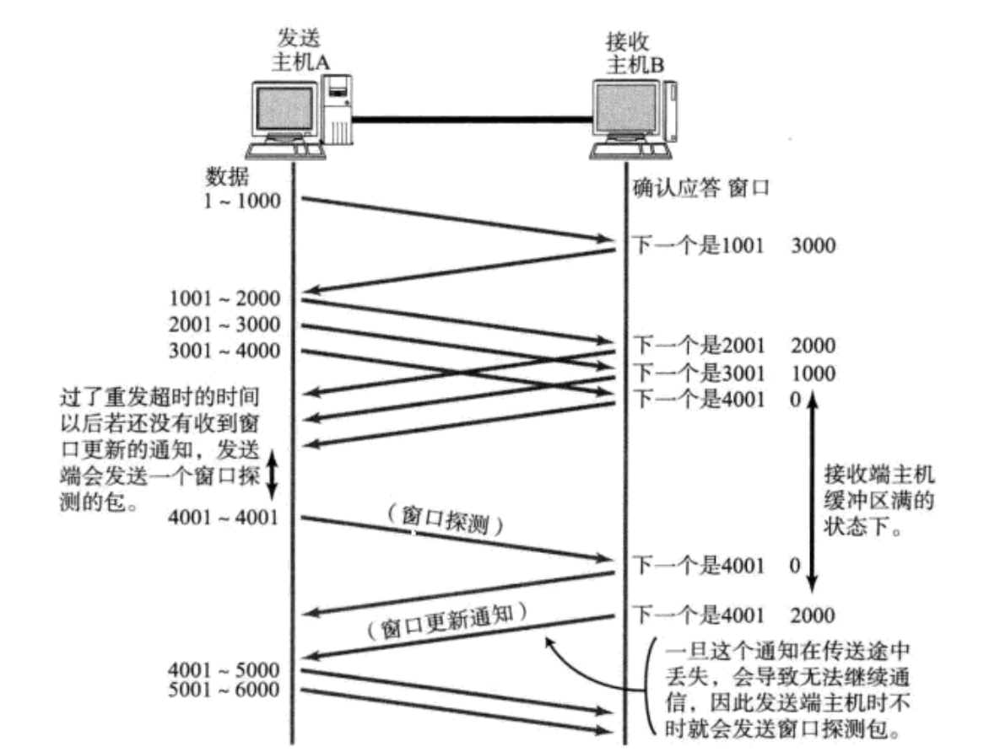

接收端如何把窗口大小告诉发送端呢? 回忆我们的TCP首部中, 有一个16位窗口字段, 就是存放了窗口大小信息;

那么问题来了, 16位数字最大表示65535, 那么TCP窗口最大就是65535字节么?  
实际上, TCP首部40字节选项中还包含了一个窗口扩大因子M, 实际窗口大小是 窗口字段的值左移 M 位;

# 滑动窗口
在上面的时候我们说过，如果我们发送数据，没有收到应答之前，我们必须将自己的已经发送的数据暂时保持起来，为了支持超时重传！保存在哪里呢？**发送缓冲区**。具体在发送缓冲区哪里呢？

前面我们学习了确认应答策略, 对每一个发送的数据段, 都要给一个ACK确认应答. 收到ACK后再发送下一个数据段.这样做有一个比较大的缺点, 就是性能较差. 尤其是数据往返的时间较长的时候

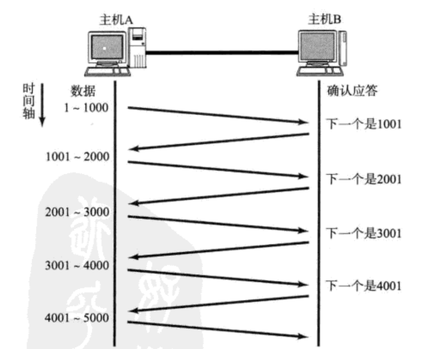

这是我们为了理解确认应答这样说的，但是真实tcp工作模式并不是这样串行的，而是**并行**的。既然这样一发一收的方式性能较低, 那么我们一次发送多条数据, 就可以大大的提高性能(其实是将多个段的等待时间重叠在一起了等一次就好).  
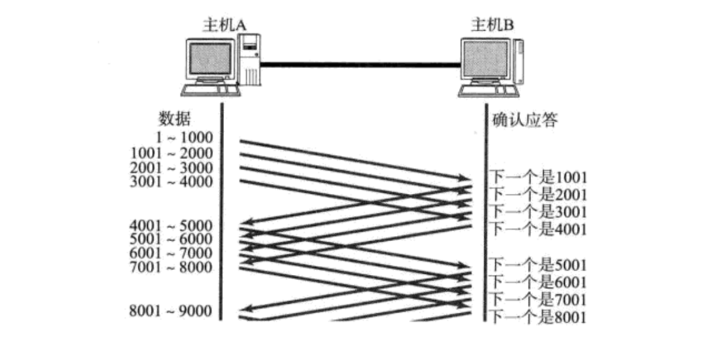**实际在发送报文的时候可以向对方发送大量的数据，有些历史数据虽然没有应答，但也可以可以继续向后发送数据。**

如何做到的呢?  
tcp双方通信都有自己的发送和接收缓冲区，以c->s为例，发数据调用read/secd接口实际是把应用层缓冲区数据拷贝到发送缓冲区。发送缓冲区不怎么严格可以被划分为三部分：**已发送收到应答，已发送还没应答，尚未发送的数据**。为什么说不严格是因为它后面可能还有空间没有放数据，未来应用层数据拷贝到这一块。  
其中**我们把已经发送，但还没有收到应答的这块区域叫做滑动窗口**。滑动窗口的本质其实是发送缓冲区的一部分。

---

先感受一下滑动窗口  
主机A给主机B发1001-2000的数据，主机B给ack确认2001，告诉主机A下次从2001开始发，然后主机A窗口整体向右滑动，就把1001-2000划分到已经收到了并收到确认的范畴的，窗口都是已经发尚未收到应答的数据。通过窗口滑动不断划分三块区域。

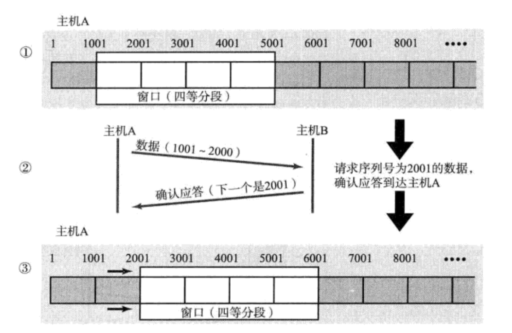

具体谈滑动窗口之前，考虑这样几个问题

1. **窗口的开始大小是怎么设定的？未来怎么变化？**
2. **窗口一定会向右滑动吗？会向左滑动吗？**
3. **窗口一定会一直不变吗？会变大吗，会变小吗？为什么。变的依据是什么？**
4. **收到确认应答的时候，如果不是最左侧发送的报文的确认，而是中间的，结尾等怎么办？要滑动吗？**
5. **滑动窗口必须要滑动吗？会不会不动了，或者变为0了？**
6. **一直向后滑动吗？如果空间不够了怎么办？**

回到上面问题之前我们要建个模，如何看待滑动窗口问题。  
发送缓冲区在我们看来就是一个字符类型的数组，所谓的滑动窗口是整个字符数组一段区域。并且有起始和结尾下标，所以**所谓的窗口移动本质就是下标在进行更新！** 窗口大小随着两个下标的移动在变化。

窗口的开始大小是怎么设定的？未来怎么变化？

目前我们认为，滑动窗口的大小和对方的接收能力有关，win_start=0，win_end=win_start+tcp_win(握手期间互相通告各自接收能力)，未来无论怎么滑动，都要保证对方能够进行正常接收。**滑动窗口大小=对方通告给我的自己接收能力大小！【目前理解】**

**窗口一定会向右滑动吗？会向左滑动吗？**

滑动窗口左侧是已经发送并且得到确认应答的报文，所以**一定不会向左滑动**！那会一直向右滑动吗？有没有可能发送方一直在发数据，但接收方就是不把数据拿走，但发收方给接收方发的报文接收方都会给确认， 这意味着滑动窗口会一直在变小，win_start一直在往右移动，但是win_end可能长时间处于不动状态。所以**滑动窗口不一定会向右滑动。可能会向右滑动，可会保持不变！**

---

窗口向右移动本质就是将左侧数据丢弃，或者计算机意义上的情况，代表这些数据可以被覆盖了。

下面具体看一下滑动窗口滑动方式

当接收方发的确认序号到了(现在只考虑滑动窗口最左侧收到了)，发收方 win_start=ACK_SEQ(确认序号)，win_end=win_start+tcp_win(对方剩下空间大小），这样不就更新出一个新的窗口大小吗。  
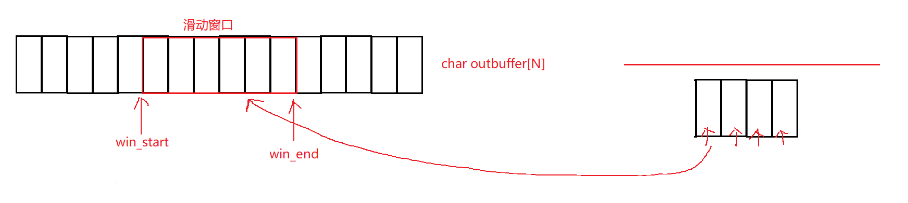

如果给接收方发了很多很多报文接收方缓冲区越来越小，然后上层一直不取数据，一直发一直发然后接收方一直给确认就会导致确认序号一直不断增大，左侧的窗口一直在向右移动，而右侧窗口一直不变，最终因为对方接收能力变成0了就导致滑动缓冲区变成0了。

窗口一定会一直不变吗？会变大吗？会变小吗？为什么，变的依据是什么？

**不会，窗口是浮动的**。**会变大**(窗口变为0后接收方上层把数据一次性都拿走了)，**会变小**(接收方上层不拿数据但会给确认)。依据**根据对应缓冲区剩余空间大小。**

**收到确认应答的时候，如果不是最左侧发送的报文的确认，而是中间的，结尾等怎么办？要滑动吗？**

不是最左侧，而且其他地方收到ack这个时候在滑动不就扯淡吗。  
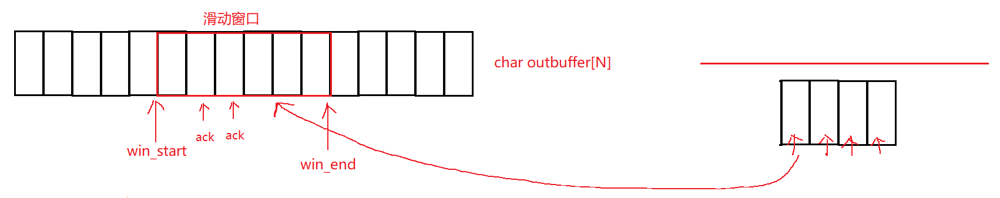  
如果数据和ack都没有丢失，即使ack是乱序到达的也不会影响。乱序依次到了收到哪一个最左侧的就往后移动，不断调整。

但真的是丢包了呢？丢包有两种情况。

1. **数据没丢，只是ack应答丢了**

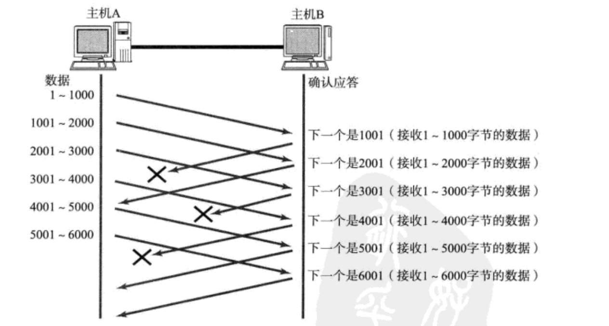

还记得确认序号的定义：ACK X+1表示 X+1之前的所有的数据全部都收到了。换句话说如果前面报文没有收到，但是收到了后面的报文，根据规定它之前的数据一定全部收到了！那滑动窗口直接滑动到对应位置就行了不用担心前面没有收到。

2. **数据真的丢了**

假设1001-2000真的丢了，虽然2001-3000、3001-4000主机B都收到了，但是根据刚确认序号的定义，主机B能给我3001，4001的确认应答？不能，只能给我应答1001，后面不管主机A发的是多少到多少的报文，主机B给确定ack全都是1001，如果主机A连续收到三个及以上一样响应会触发**快重传机制**。

这个时候接收端收到了 1001 之后, 再次返回的ACK就是7001了(因为2001 - 7000)接收端其实之前就已经收到了, 被放到了接收端操作系统内核的接收缓冲区中

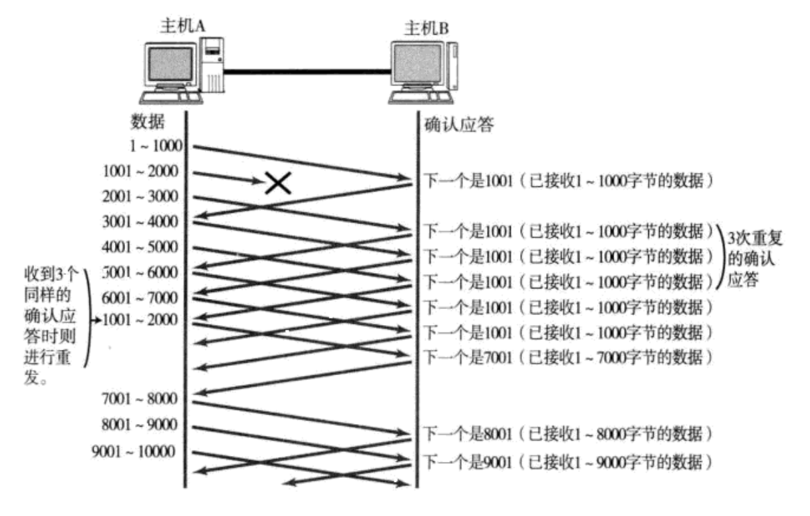

**收到对应确认的时候，即使不是最左侧，而是其他位置根本不担心，根据具体的情况具体我们有对应的策略来解决。并且我们有确认序号，它支持我们滑动窗口的滑动规则。**

**滑动窗口必须要滑动吗？会不会不动了，或者变为0了？**

根据前面的知识，我们依据知道了滑动窗口不一定非要滑动，可能会不动，可能会变成0。

**前面说为了支持超时重传，数据要保存在发送缓冲区，具体在那呢？  

**滑动缓冲区一直向后滑动吗？如果空间不够了怎么办？**

实际上发送缓冲区整个空间并不是线性的，而是环形结构的！这个时候在向右滑动的时候在怎么滑也不会出现越界问题。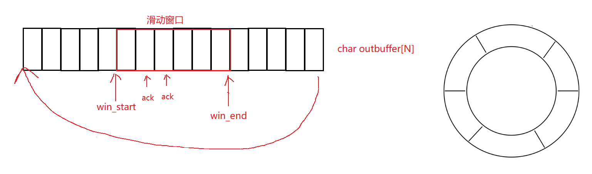

滑动窗口本质上是基于一定的可靠性策略，但是最核心在于tcp为了提高发送效率。

# 拥塞控制
tcp为了保证双方通信的可靠性，有超时重传机制、连接管理机制、丢包重传机制、按序到达、去重、滑动窗口、流量控制等等，可是目前我们学的所有策略，都是端到端的。可是丢包的时候，除了接收方出问题，网络也有可能出现问题！怎么解决？

今天客户端给服务器发了1w个报文，服务器给客户端ack响应，但在网络上丢失1~2个报文，客户端可以会觉得是自己的问题，那重发就行了。但还有客户端给服务器发1w个报文，服务器给客户端1个ack响应，剩下的9999个报文都丢失了。客户端想我给你发了1w个报文，但你只有一个收到了，客户端不在认为是自己的问题，因为客户端和服务器有端到端的可靠性机制，所有客户端知道可能是网络上出了问题。

**tcp的可靠性不仅仅考虑了双方主机的问题，它也考虑了路上网络的问题！**

**那这时还是选择超时重传吗？**  
不应该！！！网络出现了问题，那我还给它进行重传，我现在丢的是9999个报文，意味我要把9999个报文都要重传，一旦重传就会导致已经出现问题的网络，又会出现大量的报文，只会加重网络的故障问题！！ 注意整个网络并不是只有你这个客户端主机，还要其他更多的客户端主机，如果网络出现问题你丢了这么多报文，大概率其他主机也是一样的，大家都在大量重传那网络问题必定加重！所以不应该大量重传，我不重传大家也都不重载那网络压力就下来了，等到网络恢复我们在正常的传，这就是**拥塞控制**！！！  
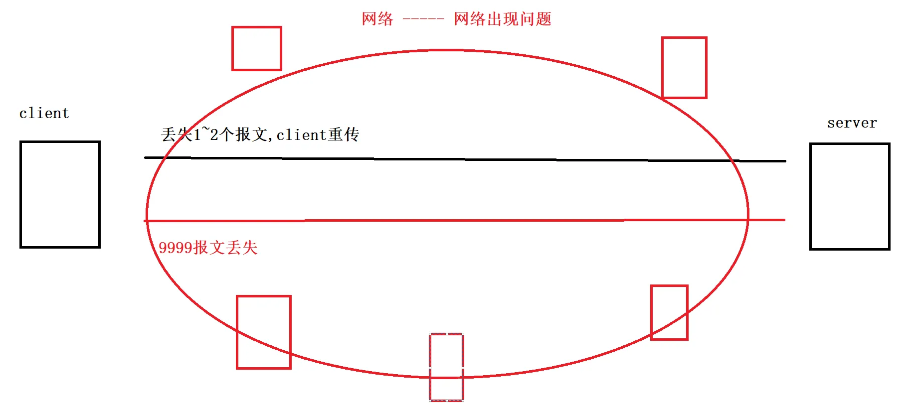

虽然TCP有了滑动窗口这个大杀器, 能够高效可靠的发送大量的数据. 但是如果在刚开始阶段就发送大量的数据, 仍然可能引发问题

因为网络上有很多的计算机, 可能当前的网络状态就已经比较拥堵. 在不清楚当前网络状态下, 贸然发送大量的数据,是很有可能引起雪上加霜的

TCP引入**慢启动**机制, 先发少量的数据, 探探路, 摸清当前的网络拥堵状态, 再决定按照多大的速度传输数据.(大家都遵守，网络压力大大减小了)

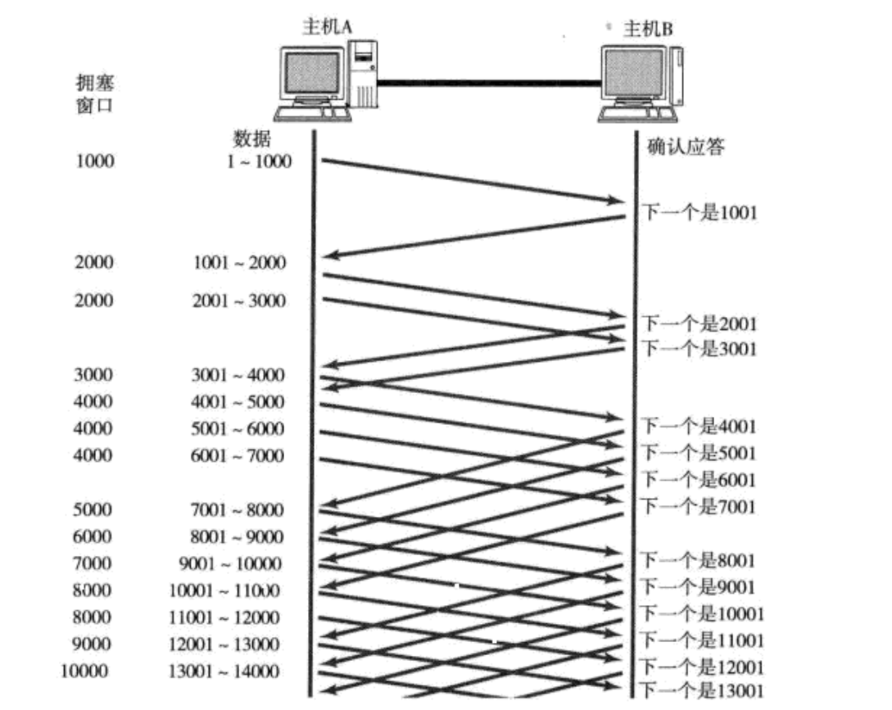

+ 此处引入一个概念程为**拥塞窗口**

其实拥塞窗口和滑动窗口、16位窗口大小都是一个数字规定。那将来如何得知网络发送了拥塞了呢？难道就是丢包吗？丢包丢多少才算呢？ 那就不是已经出现问题了吗，一般都是防范于未然，大概我发送数据量超过某个数字可能会发送网络拥塞，还是不要让网络出现拥塞在去解决。所以引入拥塞窗口，说白了就是一个数字，给发送数据主机定的一个数字，超过数字时可能会发生网络拥塞问题！用拥塞窗口来表示网络接收数据能力。

那现在客户端发送数据不仅要考虑对方的接收能力，还有网络的接收能力。那我一次能个服务器发送多大数据量呢？  
我：滑动窗口  
网络：拥塞窗口  
对端：窗口大小(自己的接收能力）  
**滑动窗口大小=min(拥塞窗口，窗口大小(对方的接收能力))**，一般情况下拥塞窗口要大一些，发生时就可以按照对方接收能力发了，如果拥塞窗口很小那网络很容易出先问题，那就以拥塞窗口为主，所以滑动窗口大小一定不会引起对方主机来不及接收。

+ 发送开始的时候, 定义拥塞窗口大小为1;
+ 每次收到一个ACK应答, 拥塞窗口加1
+ 每次发送数据包的时候, 将拥塞窗口和接收端主机反馈的窗口大小做比较, 取较小的值作为实际发送的窗口;

**像上面这样的拥塞窗口增长速度, 是指数级别的. “慢启动” 只是指初使时慢, 但是增长速度非常快.**

**为什么选择指数增长作为慢启动算法？**

前期慢可以发少量数据，那第一次1、第二次2、第三次3这样不香吗，为什么呈指数增长，注意tcp一定是在可靠性和效率之间找平衡，发多少给多少应答，说明网络已经恢复了，那发收方就不在是照顾网络了而是让网络通信尽快恢复。指数增长前期用来慢启动让网络恢复，再利用指数增长后半部分尽快恢复网络通信。

那指数级别增长会不会导致发送方滑动窗口变的特别大，而对方来不及接收？  
并不会，**滑动窗口大小=min(拥塞窗口，窗口大小(对方的接收能力))**，拥塞窗口变的很大超过对方接收能力也没有意义了。这个时候主要矛盾就变成了我给对方发数据。

+ 为了不增长的那么快, 因此不能使拥塞窗口单纯的加倍.
+ 此处引入一个叫做慢启动的阈值
+ 当拥塞窗口超过这个阈值的时候, 不再按照指数方式增长, 而是按照线性方式增长

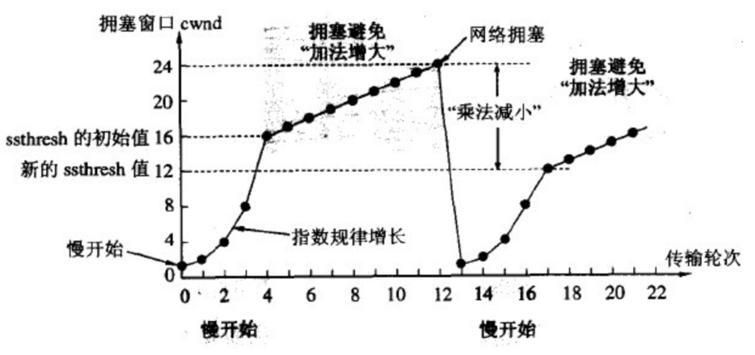

+ 当TCP开始启动的时候, 慢启动阈值等于窗口最大值;
+ 在每次超时重发的时候, 慢启动阈值会变成原来的一半, 同时拥塞窗口置回1;

**网络情况一定是一直变化的，随着网络的变化，拥塞窗口的值也是在变化的**，并且引起网络拥塞的拥塞窗口大小怎么定，也不是由你tcp手动定的，一定是真的发生了网络拥塞tcp然后更新拥塞窗口 ，然后根据此时的拥塞窗口更新阈值，然后立马把用户窗口置1。指数增长和线性增长除了为发送报文做指导，它也在为下一次更新出网络拥塞窗口做准备。指数增长和线性增长它的本质其实是一种探测的过程。

> 少量的丢包, 我们仅仅是触发超时重传; 大量的丢包, 我们就认为网络拥塞;
>
> 当TCP通信开始后, 网络吞吐量会逐渐上升; 随着网络发生拥堵, 吞吐量会立刻下降;  
拥塞控制, 归根结底是TCP协议想尽可能快的把数据传输给对方, 但是又要避免给网络造成太大压力的折中方案.
>

tcp协议有的策略是为了效率，有的是为了可靠性，那拥塞控制呢？  
其实拥塞控制既提高效率又有可靠性！总之非常优雅！！！

# 延迟应答
**如果接收数据的主机立刻返回ACK应答, 这时候返回的窗口可能比较小.**

+ 假设接收端缓冲区为1M. 一次收到了500K的数据; 如果立刻应答, 返回的窗口就是500K;
+ 但实际上可能处理端处理的速度很快, 10ms之内就把500K数据从缓冲区消费掉了;
+ 在这种情况下, 接收端处理还远没有达到自己的极限, 即使窗口再放大一些, 也能处理过来;
+ 如果接收端稍微等一会再应答, 比如等待200ms再应答, 那么这个时候返回的窗口大小就是1M;

延迟应答可以增加网络吞吐量，等一等，让接收方大概率把数据取走然后可以给发收方通告一个更大的窗口大小，让发收方可以发送更大量的数据，这就是延迟应答的思想。

**一定要记得, 窗口越大, 网络吞吐量就越大, 传输效率就越高. 我们的目标是在保证网络不拥塞的情况下尽量提高传输效率;**

那么所有的包都可以延迟应答么? 肯定也不是;

+ 数量限制: 每隔N个包就应答一次;
+ 时间限制: 超过最大延迟时间就应答一次;

**具体的数量和超时时间, 依操作系统不同也有差异; 一般N取2, 超时时间取200ms;**

这个延时应答时间不能比超时重传的时间长！

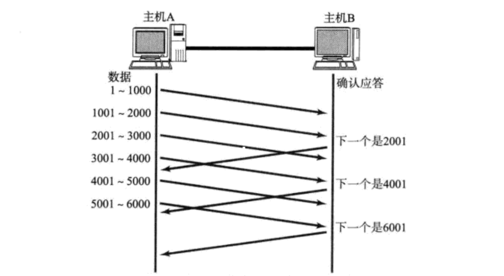  
现在我们就知道了tcp不一定对每个报文都会应答，但是我们有确认序号，只要收到确认序号就表明确认序号之前连续的报文我都收到了。

# 捎带应答
前面我将发过来的报头应答会给ack，但实际上一般情况下主机A给主机B发信息，主机B也可能给主机A发信息。如果主机A发信息主机B就只想ack那没问题，但主机B也想给主机A发信息，首先主机B一定要ack，但不要忘了ack只是报头里的标记位，实际是主机B给主机A确认应答的载体是一个tcp报文，既然是一个tcp报文它就可以携带报头它也有序号也可以携带有效载荷。所以主机B给主机A应答，它可以把ack标记位设为1并且把B给A的信息也带上，这就是捎带应答。

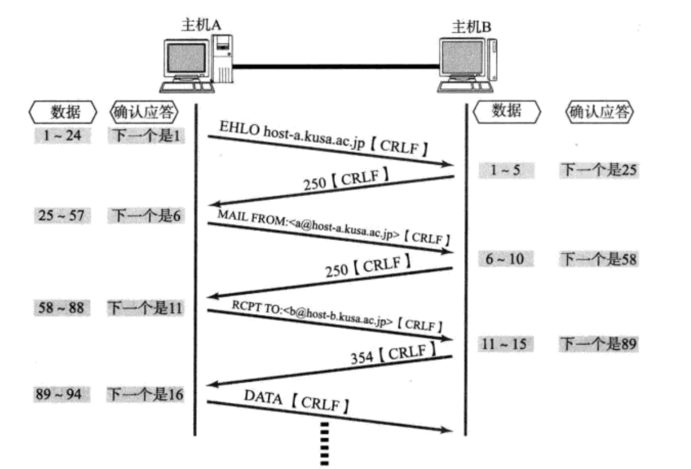

# 面向字节流
创建一个TCP的socket, 同时在内核中创建一个 **发送缓冲区** 和一个 **接收缓冲区**;

+ 调用write时, 数据会先写入发送缓冲区中;
+ 如果发送的字节数太长, 会被拆分成多个TCP的数据包发出;
+ 如果发送的字节数太短, 就会先在缓冲区里等待, 等到缓冲区长度差不多了, 或者其他合适的时机发送出去;
+ 接收数据的时候, 数据也是从网卡驱动程序到达内核的接收缓冲区;
+ 然后应用程序可以调用read从接收缓冲区拿数据;
+ 另一方面, TCP的一个连接, 既有发送缓冲区, 也有接收缓冲区, 那么对于这一个连接, 既可以读数据, 也可以写数据. 这个概念叫做 **全双工**

由于缓冲区的存在, TCP程序的读和写不需要一一匹配, 例如:

+ 写100个字节数据时, 可以调用一次write写100个字节, 也可以调用100次write, 每次写一个字节;
+ 读100个字节数据时, 也完全不需要考虑写的时候是怎么写的, 既可以一次read 100个字节, 也可以一次
+ read一个字节, 重复100次;

**udp面向数据报**：发送方发一次，接收方就读一次。接收方读了一次，一定是发收方曾经读了一次。并不是像上面发送方发了1次，接收读10次才读完，因为udp会把每收到的报文作为独立的报文分开让上层读取。在udp报文和报文之间有明显的边界存在。

而tcp根本不关心数据字节流是什么，你上层要什么就给你什么，要几个就给你几个，你想怎么读就怎么读，这叫做面向字节流。

使用udp上层拿到的一定是一个完整的udp报文，只考虑序列化和反序列化的问题。而tcp上层不能保证拿到的一定是一个完整的tcp报文，而是由应用层自己解决怎么读到一个完整报文的问题。然后序列化反序列化等等。

# 粘包问题
我们对应的协议定好之后，如果基于字节流可能一个tcp连接不止塞了一个报文，可能塞了2、3、8等等报文。如果上层没能把报文一个个完整分开，可能把一个报文少读或者多读，这就是粘包问题。

+ 首先要明确, 粘包问题中的 “包” , 是指的应用层的数据包.
+ 在TCP的协议头中, 没有如同UDP一样的 “报文长度” 这样的字段, 但是有一个序号这样的字段.
+ 站在传输层的角度, TCP是一个一个报文过来的. 按照序号排好序放在缓冲区中.
+ 站在应用层的角度, 看到的只是一串连续的字节数据.
+ 那么应用程序看到了这么一连串的字节数据, 就不知道从哪个部分开始到哪个部分, 是一个完整的应用层数据包

那么如何避免粘包问题呢? 归根结底就是一句话, **明确两个包之间的边界**

由应用层来解决粘包问题：

1. 定长报文
2. 特殊符号隔开
3. 自描述字段(如前面网络版本计数器报头中放着有效载荷长度，我们以\r\n作为间隔把有效载荷长度读到，然后根据有效载荷长度拿到有效载荷)
+ 对于定长的包, 保证每次都按固定大小读取即可; 如Request结构, 是固定大小的, 那么就从缓冲区从头开始按sizeof(Request)依次读取即可;
+ 对于变长的包, 可以在包头的位置, 约定一个包总长度的字段, 从而就知道了包的结束位置;
+ 对于变长的包, 还可以在包和包之间使用明确的分隔符(应用层协议, 是程序猿自己来定的, 只要保证分隔符不和正文冲突即可)

**思考**: 对于UDP协议来说, 是否也存在 “粘包问题” 呢?

+ 对于UDP, 如果还没有上层交付数据, UDP的报头是包含报文长度的. 同时, UDP是一个一个把数据交付给应用层. 就有很明确的数据边界.
+ 站在应用层的站在应用层的角度, 使用UDP的时候, 要么收到完整的UDP报文, 要么不收. 不会出现"半个或多个"的情况

在解决一个遗留问题，我们曾经说过udp报头包含一个16位udp长度，但tcp这里只有首部长度，没有有效载荷长度。

**tcp为什么没有有效载荷长度字段呢？**  
因为tcp是面向字节流的，有序号已经表征了数据起始位置，有校验和就等保证报文的完整性。所以当收到tcp报文时，我的tcp报文又不需要直接向上交付，而是把报头和有效载荷分离，直接把数据放到缓冲区里，然后就和曾经缓冲区里历史的数据揉在一起形成字节流了，我tcp不需要区分报文和报文边界，上层自己分。所以tcp不带有效载荷的字段。

# TCP异常情况
进程终止: 连接和关闭都是由OS维护的。以前说过一个进程申请资源但是确挂掉了导致没有还这块资源，此时进程曾经申请的资源还在吗？不在了，由OS释放掉了。这就告诉我们一个道理，凡是归于OS的，进程即使挂了，你的资源也会被OS回收。同理client和server的连接释放都是OS做的，即使进程挂掉了，那OS也会回收曾经建立起的连接。也就是说进程终止了OS就会close掉这个进程曾经打开的文件，曾经建立的连接都会被关闭。所以一旦建立好连接但有一方进程终止了，OS在底层依旧正常进行四次挥手断开连接。和我们自己调用close没有什么区别。

机器重启: 和进程终止的情况相同，OS首先要先把正在运行的进程先关掉，关进程就是关连接，所以要先四次挥手。然后OS在慢慢关机在重启。

机器掉电/网线断开: 拔网线客户端马上就识别到网络发生变化了，但没有机会在和服务器进行四次挥手了，但服务器为连接还在, 一旦服务器有写入操作, 服务器发现连接已经不在了, 就会进行reset. 即使没有写入操作, TCP自己也内置了一个保活定时器, 会定期询问对方是否还在. 如果对方不在, 也会把连接释放. 关电源也是一样。

另外, 应用层的某些协议, 也有一些这样的检测机制. 例如HTTP长连接中, 也会定期检测对方的状态. 例如QQ, 在QQ断线之后, 也会定期尝试重新连接.

# TCP小结
为什么TCP这么复杂? 因为要保证可靠性, 同时又尽可能的提高性能.

可靠性:

+ 校验和
+ 序列号(按序到达)
+ 确认应答
+ 超时重发
+ 连接管理
+ 流量控制
+ 拥塞控制

拥塞控制和流量控制也是提高性能的一种，拥塞控制刚才已经说了，流量控制(规避数据丢包，让对方来得及接收，规定大面积重传)不然tcp做更多的重复工作不就是提高效率了吗。这里只是便于理解才分的。

提高性能：

+ 滑动窗口
+ 快速重传
+ 延迟应答
+ 捎带应答

其他：

+ 定时器(超时重传定时器, 保活定时器, TIME_WAIT定时器等

# 基于TCP应用层协议
HTTP  
HTTPS  
SSH  
Telnet  
FTP  
SMTP

当然, 也包括我们自己写TCP程序时自定义的应用层协议

# TCP/UDP对比
我们说了TCP是可靠连接, 那么是不是TCP一定就优于UDP呢? TCP和UDP之间的优点和缺点, 不能简单, 绝对的进行比较

+ TCP用于可靠传输的情况, 应用于文件传输, 重要状态更新等场景;
+ UDP用于对高速传输和实时性要求较高的通信领域, 例如, 早期的QQ, 视频传输等. 另外UDP可以用于广播;

归根结底, TCP和UDP都是程序员的工具,没有好坏, 都有合适的场景,什么时机用, 具体怎么用, 还是要根据具体的需求场景去判定.

# 用UDP实现可靠传输(经典面试题)
参考TCP的可靠性机制, 在应用层实现类似的逻辑;  
例如:

+ 引入序列号, 保证数据顺序;
+ 引入确认应答, 确保对端收到了数据;
+ 引入超时重传, 如果隔一段时间没有应答, 就重发数据;
+ …

# 理解 listen 的第二个参数
解决写套接字tcp协议遗留的问题，举个例子。

我们以前去吃海底捞几乎都需要排队，放一些张桌子板凳桌子上放一些零食饮料。比如说张三是海底捞服务人员，现在海底捞里面坐满了，这时李四来了问张三里面还有位置吗，张三说没有了，李四说我能不能等一下，张三说不能等。那李四肯定就走了。可李四走了一分钟后，里面就有一桌客人吃完了走了，可是张三没有让李四等，那这张桌子就只能等待下一个来的客人。可能下一次客人来就在五分钟。但这五分钟只能这张桌子一直空着，可能这种情况一天会产生12次，每次空5分钟，一天就有一个小时，而一桌客人吃饭平均时间就一个小时，那就意味这个点一天就少接待一桌客人，一桌客人赚100块钱，一年365天，一年这家店面少赚3w多。海底捞有那么多门店，一家店少赚这么多，那么多店一年少赚的可想而知多少巨大。

所以海底捞老板决定，在店里满，不能让来的客人离开，而是提高桌子板凳零食饮料让他们排队。里面有客人只要一走就让外面排队的客人进来，这样就可以保证在生意好时保证店里面的桌子板凳100%资源被使用，不会出现任何空闲的情况。

**排队的本质是让我们有资源空闲的时候，可以立马使用，提高资源利用率。**

海底捞老板觉得排队很好让他一年多赚很多钱，那他让每个店面，把外面排队用的桌子板凳从店门口拍到南三环去进一步提高效率可以吗？  
可是前面有40-50人，客人还可能等，你前面有70-80客人干脆就不等了换一家吃去了。那排队用的桌子板凳不就浪费了吗。那作为老板你想到把队伍排那么长就没想到扩充自己的店面吗。可以给更多客人提高服务。

**不能不排队**(理由在前面)，**也不能让队列太长**(1.客户不能忍 2.为什么不把多出来的钱，用来更改场地)

海底捞 -> **服务器**  
服务员 -> **listensock**  
外面桌子板凳 -> **tcp协议，要为上层维护一个链接队列**。**1. 不能没有 2. 不能太长**

该链接队列我们称为tcp协议的**全链接队列**(队列中都已经把三次握手完成了，只等上层accept了)

这个全链接队列长度是多少 **受listen的第二个参数的影响**

我们接下来验证一下：  
让服务器启动之后不把任何链接拿上来，这个时候也能连上服务器，目前listent第二个参数我们给2，我们看看队列长度是多少。

```cpp
#include <iostream>
#include <string>
#include <cerrno>
#include <cstring>
#include <cstdlib>
#include <memory>
#include <sys/types.h>
#include <sys/socket.h>
#include <netinet/in.h>
#include <arpa/inet.h>
#include <sys/wait.h>
#include <unistd.h>

const static int default_backlog = 2;

enum
{
    Usage_Err = 1,
    Socket_Err,
    Bind_Err,
    Listen_Err
};

#define CONV(addr_ptr) ((struct sockaddr *)addr_ptr)

class TcpServer
{
public:
    TcpServer(uint16_t port) : _port(port), _isrunning(false)
    {
    }
    // 都是固定套路
    void Init()
    {
        // 1. 创建socket, file fd, 本质是文件
        _listensock = socket(AF_INET, SOCK_STREAM, 0);
        if (_listensock < 0)
        {
            exit(0);
        }
        int opt = 1;
        setsockopt(_listensock, SOL_SOCKET, SO_REUSEADDR | SO_REUSEPORT, &opt, sizeof(opt));

        // 2. 填充本地网络信息并bind
        struct sockaddr_in local;
        memset(&local, 0, sizeof(local));
        local.sin_family = AF_INET;
        local.sin_port = htons(_port);
        local.sin_addr.s_addr = htonl(INADDR_ANY);

        // 2.1 bind
        if (bind(_listensock, CONV(&local), sizeof(local)) != 0)
        {
            exit(Bind_Err);
        }

        // 3. 设置socket为监听状态，tcp特有的
        if (listen(_listensock, default_backlog) != 0)
        {
            exit(Listen_Err);
        }
    }
    void ProcessConnection(int sockfd, struct sockaddr_in &peer)
    {
        uint16_t clientport = ntohs(peer.sin_port);
        std::string clientip = inet_ntoa(peer.sin_addr);
        std::string prefix = clientip + ":" + std::to_string(clientport);
        std::cout << "get a new connection, info is : " << prefix << std::endl;
        while (true)
        {
            char inbuffer[1024];
            ssize_t s = ::read(sockfd, inbuffer, sizeof(inbuffer) - 1);
            if (s > 0)
            {
                inbuffer[s] = 0;
                std::cout << prefix << "# " << inbuffer << std::endl;
                std::string echo = inbuffer;
                echo += "[tcp server echo message]";
                write(sockfd, echo.c_str(), echo.size());
            }
            else
            {
                std::cout << prefix << " client quit" << std::endl;
                break;
            }
        }
    }
    void Start()
    {
        _isrunning = true;
        while (_isrunning)
        {
            sleep(1);
            // 4. 获取连接
            // struct sockaddr_in peer;
            // socklen_t len = sizeof(peer);
            // int sockfd = accept(_listensock, CONV(&peer), &len);
            // if (sockfd < 0)
            // {
            //     continue;
            // }
            // ProcessConnection(sockfd, peer);

            // close(_listensock);
        }
    }
    ~TcpServer()
    {
    }

private:
    uint16_t _port;
    int _listensock; // TODO
    bool _isrunning;
};

using namespace std;

void Usage(std::string proc)
{
    std::cout << "Usage : \n\t" << proc << " local_port\n"
              << std::endl;
}
// ./tcp_server 8888
int main(int argc, char *argv[])
{
    if (argc != 2)
    {
        Usage(argv[0]);
        return Usage_Err;
    }
    uint16_t port = stoi(argv[1]);
    std::unique_ptr<TcpServer> tsvr = make_unique<TcpServer>(port);
    tsvr->Init();
    tsvr->Start();

    return 0;
}
```

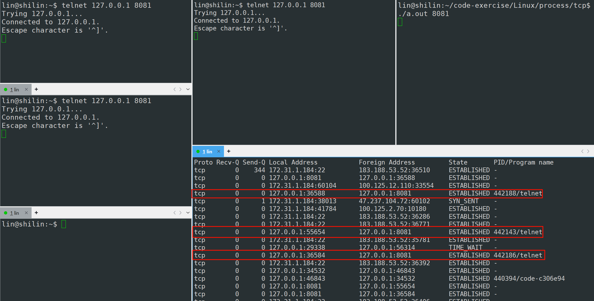

刚才listen第二个参数设置的是2，我们总共链接了三个，三个连接状态都是ESTABLISHED，说明连接都成功了。

我现在在链接一个再看。  
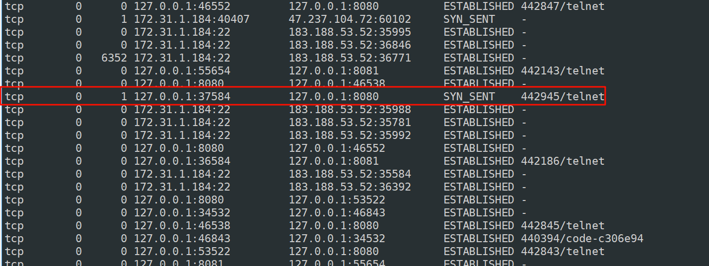  
只会有3个处于连接状态，再有新的就不会连接！

我们可以看到在外面第四次连接的时候，双方链接并没有成功(握手没成功)，但是从客户端到服务器是认为连接成功了，服务器到客户端它的状态时SYN_RECV。客户端到服务器连接建立好了，也就说明客户端给服务器发的ACK服务器并没有受理。所以服务器一直处于SYN_RECV状态，认为连接没有建立好。

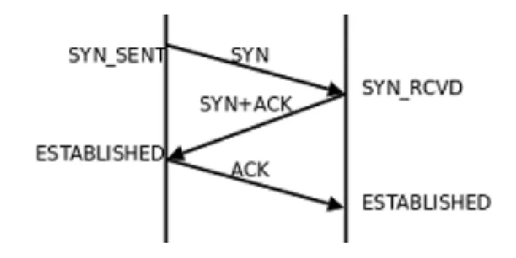

而这种处于握手的中间状态，我们就称之为**半连接状态**

等过一会，我们在查网络状态，发现端口47560，客户端到服务器连接还是存在的，但是服务器到客户端的已经没有了。

**如果我们在进行连接的时候，设置listen第二个参数，tcp底层允许最多有****backlog+1**** ****个建立好的完整连接(等待accpet获取)。后序来的都只能是半连接，如果没有尽快完成握手，自动被服务器关掉！**

这里不要以为我们服务器就只能处理`backlog+1`个连接，并不是这样的，它指的是在这个队列中放的结点数，一旦accpet把这个连接拿上去了，那么队列中结点数就少一个。如果服务器处理的很快，可以不断把底层连接拿上去，可能服务器上有上百个连接，但连接队列中一个都没有。（就如海底捞里面有上百人吃饭，但排队只有4-5个人，因为只要在吃饭他就不在这个队列里了）

这个队列本质就是给服务器维护的一个短暂的缓冲区，用来随时填补服务器上层服务完毕的时候可以直接从底层继续拿新连接上来，这也更加证明了如果不对服务进行accpet，它在底层照样能三次握手成功，证明accpet并不参与握手！

客户端状态正常, 但是服务器端出现了 SYN_RECV 状态, 而不是 ESTABLISHED 状态

这是因为, Linux内核协议栈为一个tcp连接管理使用两个队列:

1. 半链接队列（用来保存处于SYN_SENT和SYN_RECV状态的请求）
2. 全连接队列（accpetd队列）（用来保存处于established状态，但是应用层没有调用accept取走的请求）

而全连接队列的长度会受到 listen 第二个参数的影响.  
全连接队列满了的时候, 就无法继续让当前连接的状态进入 established 状态了.  
这个队列的长度通过上述实验可知, 是 listen 的第二个参数 + 1.

# 使用TCP dump进行抓包，分析TCP过程
安装

ubuntu:

```shell
sudo apt-get update
sudo apt-get install tcpdump
```

centos:

```shell
sudo yum install tcpdump
```

抓取全部tcp包

```cpp
sudo tcpdump -i any tcp
```

捕获特定端口的 TCP 报文

```cpp
sudo tcpdump port 80 and tcp
```

保存捕获的数据包到文件

```cpp
sudo tcpdump -i eth0 port 80 -w data.pcap
```

读取数据

```cpp
tcpdump -r data.pcap
```

# 使用 wireshark 分析 TCP 通信流程
wireshark是 windows 下的一个网络抓包工具. 虽然 Linux 命令行中有tcpdump工具同样能完成抓包, 但是tcpdump 是纯命令行界面, 使用起来不如 wireshark 方便

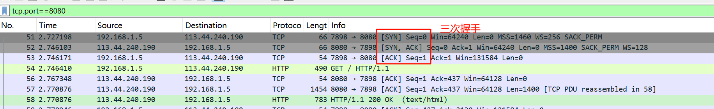

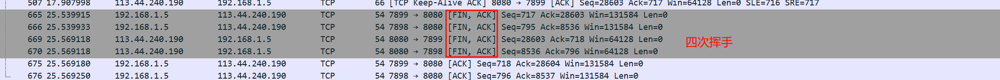

# tcp真把数据发到网络中了吗
并没有，它只是把数据交到网络层。

**所以tcp究竟做了什么，所以ip扮演了什么角色**？

IP层的核心工作：  
IP地址的作用：1. 定位主机， 2. 具有将一个数据报从主机A跨网络送到主机B的能力。

那有问题了，有能力就一定能做到吗？不一定！有能力体现在有非常大的概率做到这件事情。正常情况能做到但有异常情况就不确定了。

那要求必须一定要做到呢？  
比如说张三老爹是教务处主任他要求张三每次数学考试都考100分，张三也很争气，10次数学考试8次都是100分，但是架不住意义可能考了95分。而张三老爹每次必须让张三数学考100分，那张三老爹怎么办呢？他决定之前考试作废，重新考试，如果张三还没有考到，那考试继续作废，直到张三考到100分。  
刚才我们两个人，一个教务处主任(张三老爹)，张三(儿子)。考试的是张三，他也有能力考到100分，但并不一定每次都考到100。张三没考到没事他还有他老爹，他可以让他儿子继续考。

教务处主任(张三老爹) ：提供**策略**  
张三(儿子)：提供**行动**

只有**策略+行动**一定能做到将数据从主机A可靠的跨网络送到主机B。

所以tcp就相当于这个教务处主任，ip相当于这个儿子。

前面tcp学的超时重传、确认应答、流量控制等等全都是策略！具体怎么做有ip来执行！

