# UDP协议
# 再谈端口号
端口号(Port)标识了一个主机上进行通信的不同的应用程序。

因为不同应用程序端口号不同，尽管被部署在同一台主机上IP地址相同，但是端口号不同各自运行各自的，所以一台主机可以同时部署不同端口号不同的服务。  
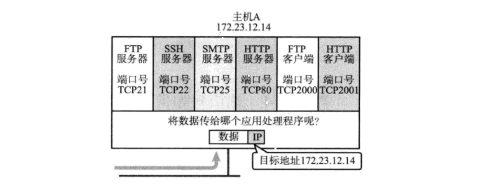  
在TCP/IP协议中，用 “源IP”，“源端口号”，“目的IP”， “目的端口号”， “协议号” 这样一个五元组来标识一个通信(可以通过netstat -n查看)；

这里协议号就相当于具体一个协议的名称，也就是标识客户端和服务器用什么协在通信。其实目的端口号就已经确定了用那个协议，如：22 ssh协议。

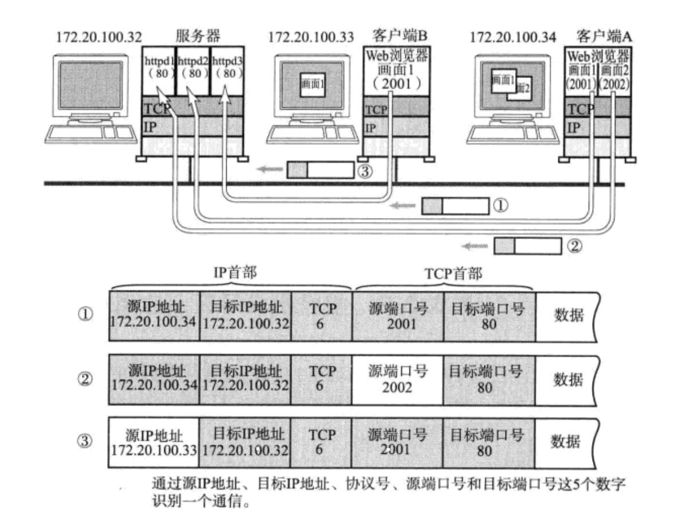

实际上不管是用同一个客户端上不同的请求或者不同的客户端去请求同一个服务器，都能够准确区分清楚这个请求时从哪来的。全都是得益于完整的报文。

TCP解决通信双方端口问题，IP解决通信双方IP地址问题，所以TCP/IP解决网络通信的问题。

应用层帮我们解决应用的问题，但是要解决应用问题之前要先解决通信的问题，要解决通信的问题要先通过五元组标识一段通信。五元组被分散在TCP/IP协议各自中处理的。

## 端口号划分
+ 0 - 1023: 知名端口号, HTTP, FTP, SSH等这些广为使用的应用层协议, 他们的端口号都是固定的.
+ 1024 - 65535: 操作系统动态分配的端口号. 客户端程序的端口号, 就是由操作系统从这个范围分配的.

## 认识知名端口号(Well-Know Port Number)
有些服务器是非常常用的, 为了使用方便, 人们约定一些常用的服务器, 都是用以下这些固定的端口号:

+ ssh服务器, 使用22端口
+ ftp服务器, 使用21端口
+ telnet服务器, 使用23端口
+ http服务器, 使用80端口
+ https服务器, 使用443端口

执行下面的命令, 可以看到知名端口号

```shell
cat /etc/services
```

我们自己写一个程序使用端口号时, 要避开这些知名端口号

## 两个问题
1. 一个进程是否可以bind多个端口号?
2. 一个端口号是否可以被多个进程bind?

数据一定是自底向上交付的，一定是从端口号唯一交付给进程，所以我们要保持从端口号到进程的唯一关系。因此2错。

一个进程绑定多个端口号并不破坏端口号到进程的唯一性，从任何端口号到进程都是唯一的，如一个进程绑定两个端口号一个端口号用来发数据，一个端口号用来发指令，因此1对。

## netstat
netstat是一个用来查看网络状态的重要工具.  
**语法**：netstat [选项]  
**功能**：查看网络状态

**常用选项**：

+ n 拒绝显示别名，能显示数字的全部转化成数字
+ l 仅列出有在 Listen (监听) 的服務状态
+ p 显示建立相关链接的进程名
+ t (tcp)仅显示tcp相关选项
+ u (udp)仅显示udp相关选项
+ a (all)显示所有选项，默认不显示LISTEN相关

## pidof
在查看服务器的进程id时非常方便.

**语法**：pidof [进程名]  
**功能**：通过进程名, 查看进程id

# UDP协议
不管我们未来学习什么协议都要带着这两个问题去学习

1. 学习所有的协议，都有它的报头和有效载荷
2. 如何解包(如何将报头和有效载荷进行分离)，如何分用

**UDP协议端格式**

下面看到的就是UDP报文，报文里面有个数据，该数据就是我们从应用层交付给UDP的所有数据就称之为整个报文的有效载荷，有效载荷上面的就是UDP报头。  
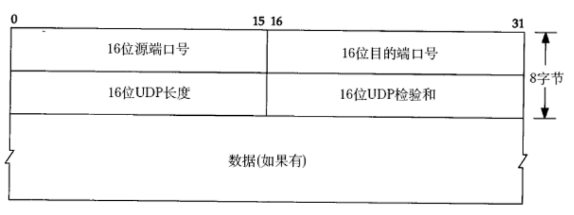

为什么我们在应用层编写代码的时候，每一次写端口号的时候，都是`uint16_t`呢？  
因为现在所学到的传输层和网络层属于Linux操作系统内部，OS内部源端口和目的端口用的是16位的，决定了应用层的端口是16位。

校验和我们不谈，先对原始数据做校验，校验之后把值填进行，然后把数据发给对方之后，对方以同样的方式对整个报文做校验，如果校验值匹配说明报文没有发生问题。不匹配就直接丢弃。

下面具体来看**UDP报文是如何封装解包、如何分用**。

这是我们任何地方都会告诉我们的UDP报文结构，上面4个部分加起来8个字节就是报头，下面是有效载荷，就这么简单。那是如何做到将报头和有效载荷封装和分离的呢？

---

根据之前我们学到的知识，要么规定特殊符号\r\n来表示报头和有效载荷，要么使用自描述字段，比如说之前自定义协议里的报文前面带上长度。http是用Content-Length的方案表征有效载荷的长度。

**那UDP这里是怎么表征字节对应的报文，将报头和有效载荷封装和解包的呢？**

**UDP采用固定长度的报头，将报头和有效载荷分开**。也就是说未来UDP报头向上交付的时候，传输层会固定的把前8字节报头直接移走，将剩下的有效载荷直接向上交付就行了。

**如何分用呢？** 因为应用层有很多协议，如http、https，所以传输层怎么知道将有效载荷交给上层哪一个协议呢？

我们有**16位目的端口号**，在应用层特定的进程绑定了特定的端口号，根据目的端口号交给特定的进程。

这上面的内容其实我们都知道，但是我们不了解的其实不是这个，而是你这报头到底是个什么东西？**理解UDP报头**

---

首先**传输层网络层**都属于Linux内核，而Linux内核是用C语言写的！  
前面8个字节是UDP的报头，**所谓的报头不就是OS层面定制的协议吗**！  
我们以前在应用层不是定义过协议吗，不就是相当于在应用层的结构化数据吗，说白了不就是一个类或结构体吗？  
**所以所谓的报头其实就是一种结构化数据对象**

一般在定协议的时候采用的是**结构体**或者**位端**的方式。

所谓报头定的协议就是下面这个玩意  
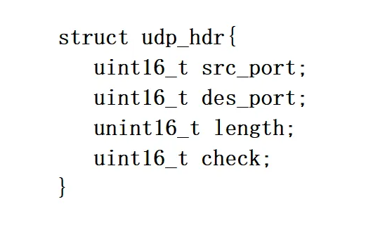

所谓的添加报头，当程序员在应用层调用sendto发送数据，这个sendto其实并没有把数据直接发送到网络里，而是把数据拷贝UDP这个协议中。

在拷贝之前先做这样一个事情，我们以伪代码方式看一下这个过程，首先UDP有hdr所指向的一段空间，然后start指向hdr加一个UDP报头协议大小的地方，然后把数据拷贝到start所指向的空间，然后在UDP报头里填写对应的信息。

1. 这不是把我们的有效载荷放在后面
2. 我们不就把报头填写好了吗

至此不就形成了一个完整的UDP报头吗！然后继续向下进行交付！

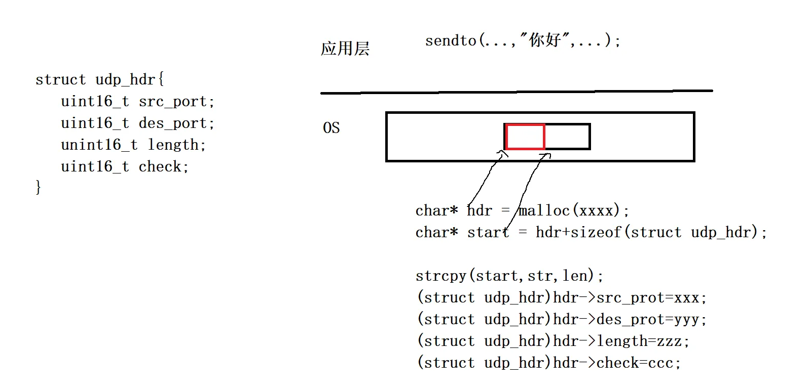  
未来收到UDP报文不是固定大小吗，收到报文之后指针指向开始，将指针强转成struct udp_hdr类型，前8个字节里面每一个字节不就可以直接取码吗，取完之后指针+8，不就可以拿有效载荷了吗。

在看到UDP报文这张图，脑海中要立即想到协议就是一个结构化的数据，在内核中这个协议一定有具体的实现方式，结构化或者位端。最后添加报头就是把数据放在缓冲区里然后在缓冲区前面把报头相关字段拿过来，这个报文就构建好了，继续向下交付就好了！

未来我们学习到所有协议，管你是什么报头，只要你是OS里的，它的所有字段划分最终都是转为某种结构体或者位端。  
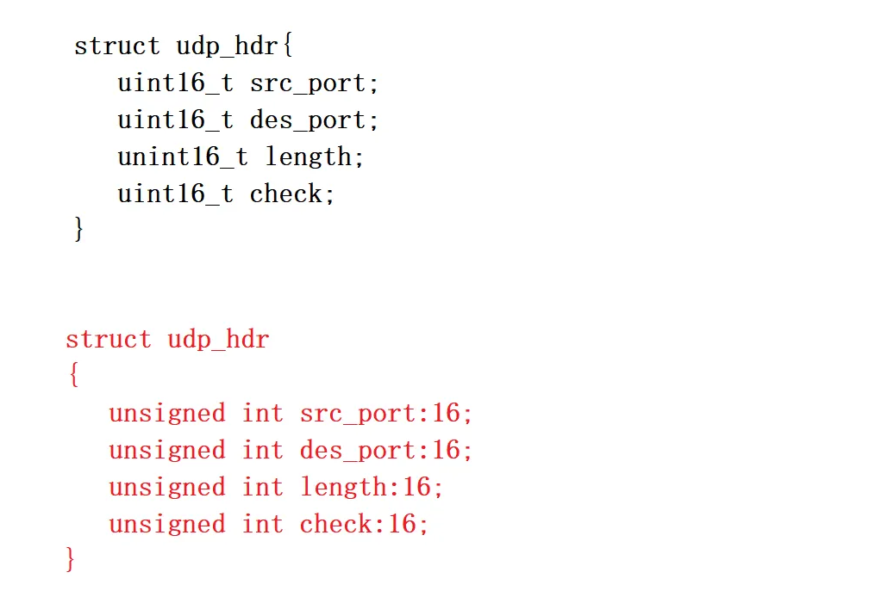  
因为UDP不提供任何可靠性，所有注定它不用为了可靠性做更多的工作。也就意味着它很简单不复杂。

---

## <font style="color:rgb(79, 79, 79);">通过源码理解socket和连接</font>
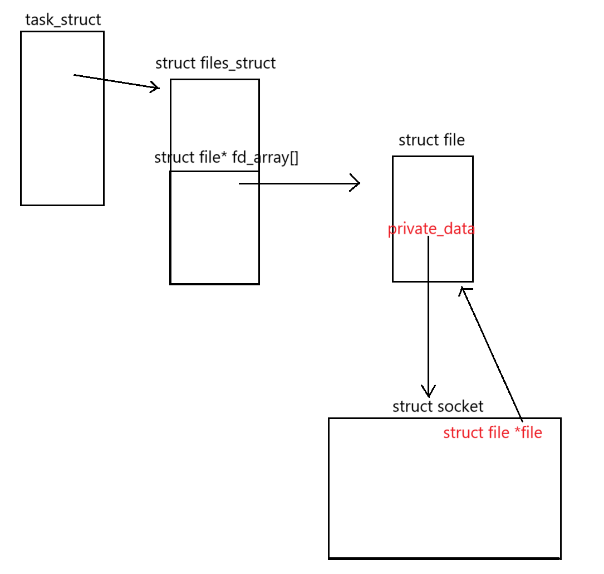

<font style="color:rgb(77, 77, 77);">（我们以listen套接字为例）当我们调用系统调用创建一个套接字时，操作系统会在内核中为我们创建一个struct socket结构，我们现在可以将他理解成网络</font>`<font style="color:rgb(77, 77, 77);">socket</font>`<font style="color:rgb(77, 77, 77);">的入口，同时，</font>`<font style="color:rgb(77, 77, 77);">struct file</font>`<font style="color:rgb(77, 77, 77);">中有这样一个字段：</font>`<font style="color:rgb(77, 77, 77);">void* private_data</font>`<font style="color:rgb(77, 77, 77);">，他指向这个套接字，这个套接字中也有这样一个字段：</font>`<font style="color:rgb(77, 77, 77);">struct file *file</font>`<font style="color:rgb(77, 77, 77);">回指向这个</font>`<font style="color:rgb(77, 77, 77);">struct file</font>`<font style="color:rgb(77, 77, 77);">，所以我们也就可以通过文件描述符找到</font>`<font style="color:rgb(77, 77, 77);">struct file</font>`<font style="color:rgb(77, 77, 77);">，再通过</font>`<font style="color:rgb(77, 77, 77);">private_data</font>`<font style="color:rgb(77, 77, 77);">找到socket。</font>

<font style="color:rgb(77, 77, 77);">我们看看socket的结构：</font>

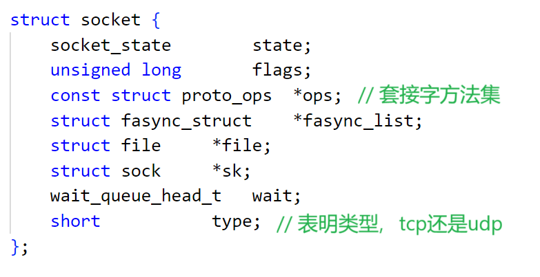

<font style="color:rgb(77, 77, 77);">但是事实上，我们创建tcp连接时，内核创建的结构体叫做tcp_sock：</font>

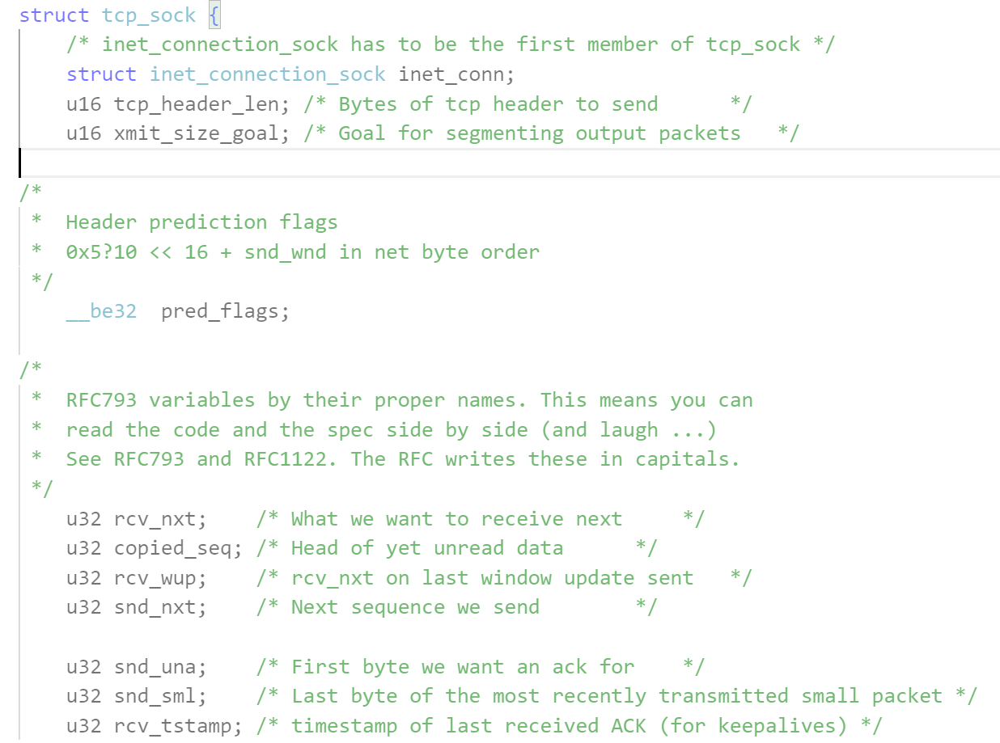  
了解几个字段：

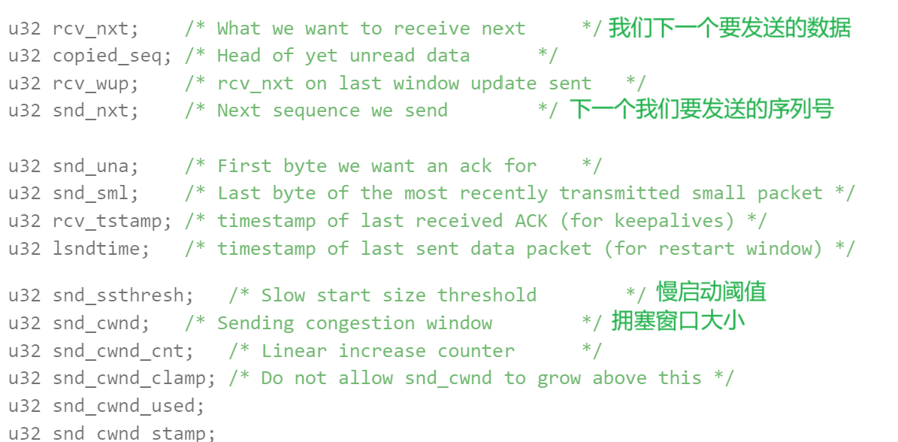

<font style="color:rgb(77, 77, 77);">但是这些我们不管，我们关心的是这个字段：</font>

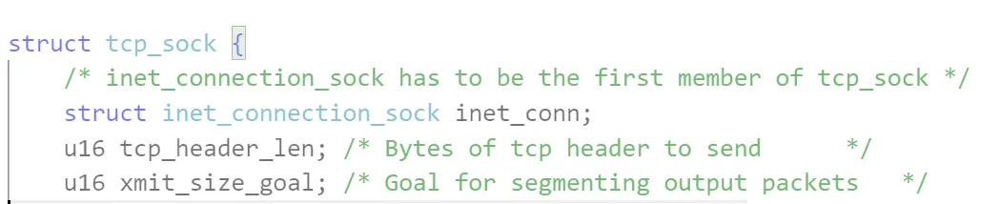

<font style="color:rgb(77, 77, 77);">struct inet_connection_sock，网络连接套接字：</font>

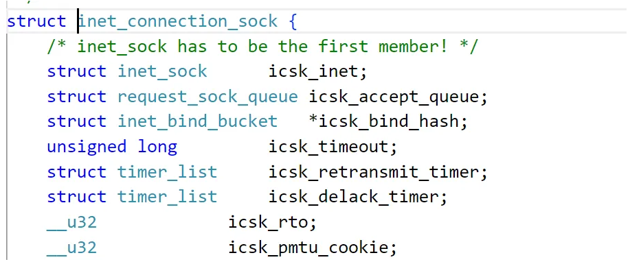

`<font style="color:rgb(77, 77, 77);">icsk_timeout</font>`<font style="color:rgb(77, 77, 77);">超时时间，</font>`<font style="color:rgb(77, 77, 77);">icsk_retransmit_timer</font>`<font style="color:rgb(77, 77, 77);">重传时间，我们关心的字段是</font>`<font style="color:rgb(77, 77, 77);">struct request_sock_queue</font>`<font style="color:rgb(77, 77, 77);">，他是什么呢？就是全连接队列：</font>

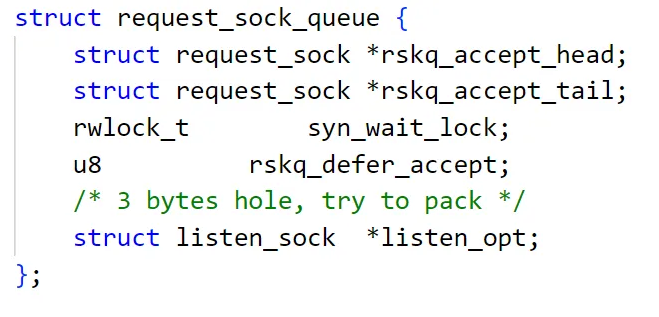

<font style="color:rgb(77, 77, 77);">当创建好tcp_sock时，他就会被挂在这个队列下，等待accept来获取。同时，我们仍然需要注意到这样一个字段：struct inet_sock：</font>

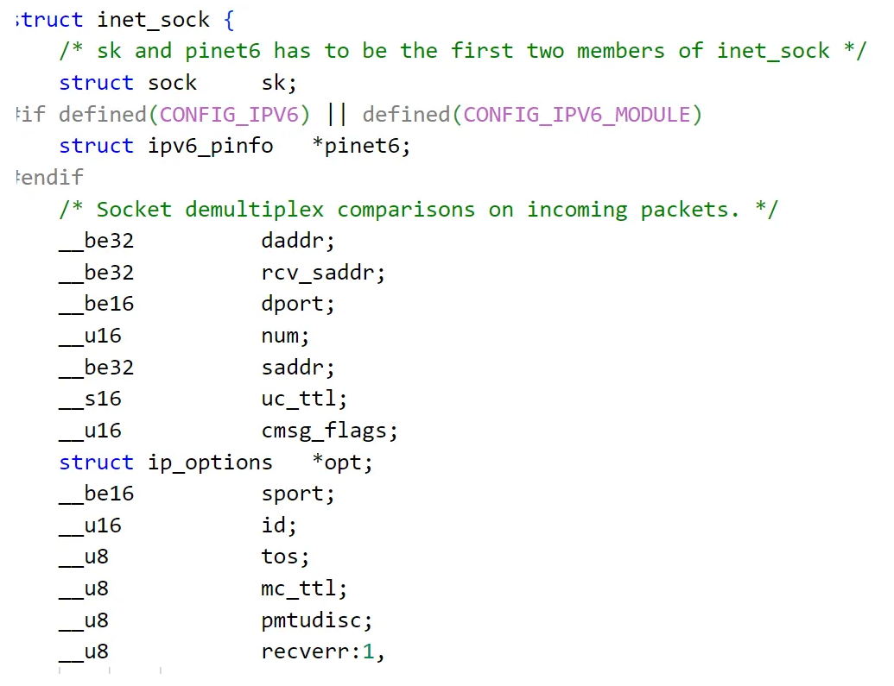

<font style="color:rgb(77, 77, 77);">我们可以看到daddr目的ip地址，saddr源ip地址，dport目的端口号，sport源端口号，这里面我们仍然可以看到一个字段：struct sock，同时，我们就发现，我们这里关注的字段都是处在最开始的位置。</font>

<font style="color:rgb(77, 77, 77);">struct sock里有这样两个字段：</font>

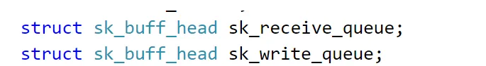

<font style="color:rgb(77, 77, 77);">我们常说tcp中有写缓冲区和读缓冲区，他们通过某种方式可以转换成上面的结构， sk_buff_head:</font>

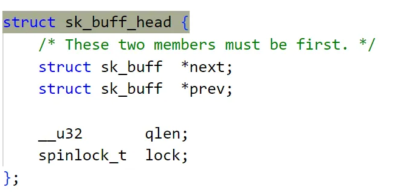

<font style="color:rgb(77, 77, 77);">通过链表对sk_buff结构进行管理(每一个sk_buff管理着一个报文)，sk_buff:</font>

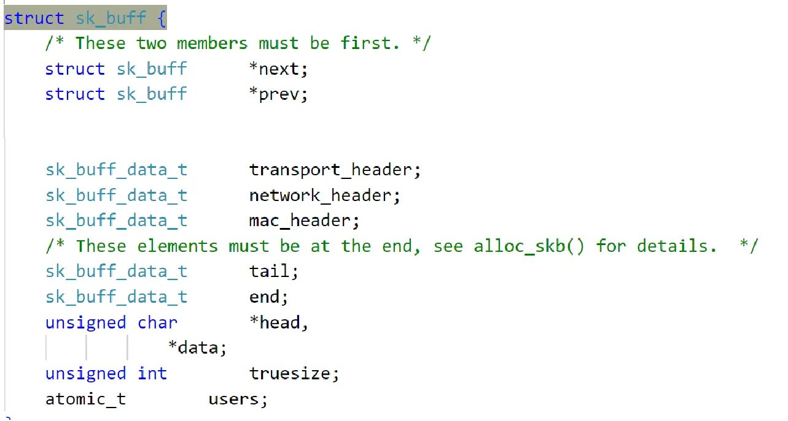<font style="color:rgb(77, 77, 77);">里面的tail和head管理着一段内存空间，这段内存空间就存放着协议栈的报文，通过这两个指针的移动对报文进行管理。</font>

<font style="color:rgb(77, 77, 77);">所以整体结构是这样的：</font>

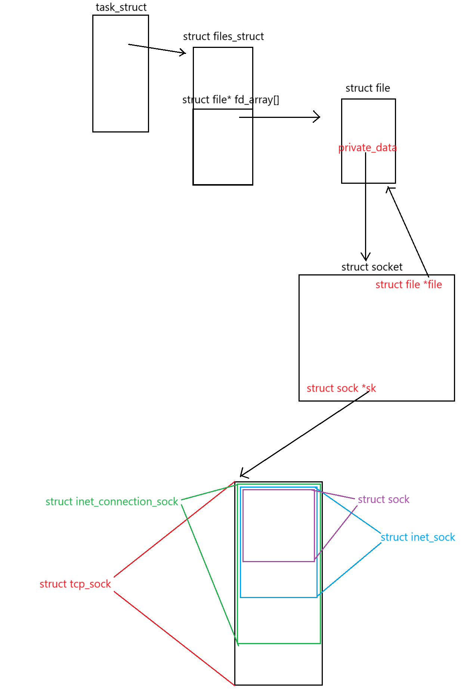

<font style="color:rgb(77, 77, 77);">这样，我们通过sk指针就可以访问到这些结构体，如果我们想访问tcp_sock那么就强转成tcp_sock*，如果我们想访问inet_sock中的源端口目的端口就，就强转成inet_sock*。</font>

<font style="color:rgb(77, 77, 77);">对于udp来说，没有inet_connection_sock这个结构，socket辨别Udp和Tcp的方式就是我们刚开始说的socket中的type字段。</font>

<font style="color:rgb(77, 77, 77);">现在，我们来说普通套接字，当服务器完成三次握手后，OS就会创建好tcp_sock，然后将他连入到全连接队列中，当accept时，OS会首先创建struct file，接着是socket，然后通过socket中的sk指针和tcp_sock关联起来，将struct file的地址填入fd_arrry中，返回文件描述符，这样，普通套接字就创建好了，需要注意的是，普通套接字不关心全连接队列。</font>

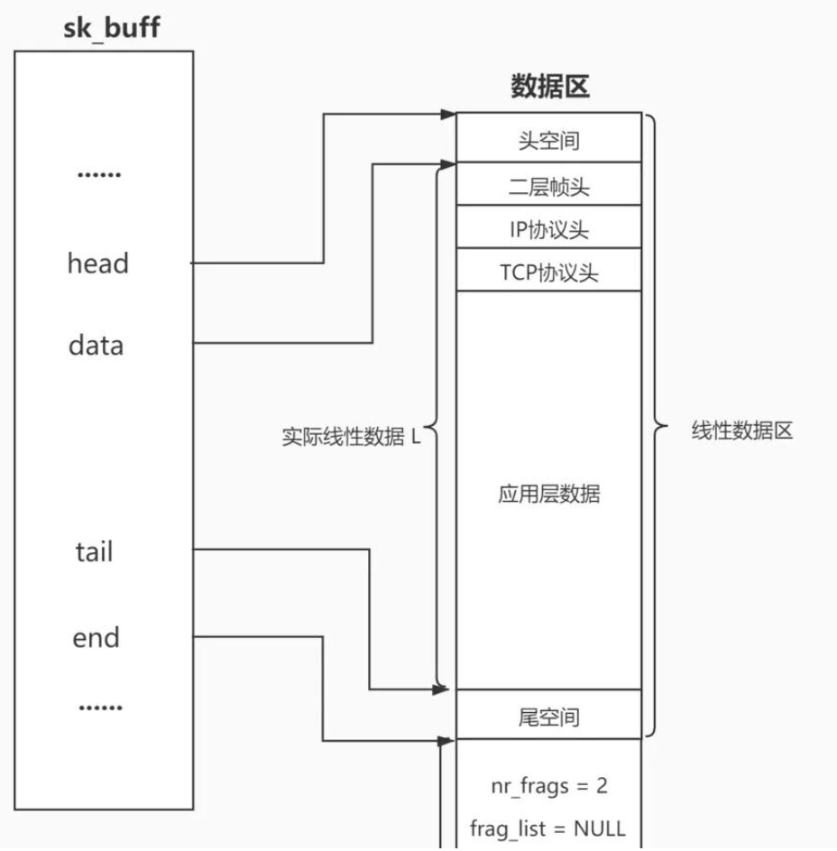

## UDP的特点
UDP传输的过程类似于寄信

+ 无连接: 知道对端的IP和端口号就直接进行传输, 不需要建立连接
+ 不可靠: 没有确认机制, 没有重传机制; 如果因为网络故障该段无法发到对方, UDP协议层也不会给应用层返回任何错误信息(也就是说丢包了UDP说明也不做）
+ 面向数据报: 不能够灵活的控制读写数据的次数和数量

## 面向数据报
面向数据报可以理解成面向快递，你的朋友给你寄了一个、两个、三个快递，未来你在收的一定是一个、两个、三个快递。你朋友发了三个快递你一定是收三个快递，不会收半个、一个半、两个等，他发几个你就收几个。客户端曾经发了一个报文，你在调用recvfrom成功的时候，这个函数必定把一个完整的报文全部读上来。这叫做UDP数据报。

其一，在写udp的代码时明显可以感觉到不像写tcp网络版计数器哪里首先必须要先读到一个完整的报文，在udp哪里从来没有说过这样的话，因为用udp直接可以保证读到一个完整报文。  
其二，对方调sendto发送10次报文，对方必须调用recvfrom接收10次报文，次数是1:1的。

这就是面向数据报，使用UDP协议我们不用考虑在应用层enlength增加报头，delength删除报头，用来区分数据，只用考虑序列化和反序列化就可以了。

光谈udp不太清楚，这里简单说一下tcp，它是面向字节流，特点是发数据可以发十几二十次，但接收方并不知道你曾经发了多少次，它也不知道报文和报文之间有什么边界，它只是由上层告诉我去读多少，至于怎么读到一个完整的报文是由应用层自己去定协议自己去从字节流中提取一个完整报文。所有就有写tcp要自己定制报头，然后把有效载荷提取出来，序列化。。。，这都是因为它没有报文和报文之间的边界。

应用层交给UDP多长的报文, UDP原样发送, 既不会拆分, 也不会合并;

用UDP传输100个字节的数据:

+ 如果发送端调用一次sendto, 发送100个字节, 那么接收端也必须调用对应的一次recvfrom, 接收100个字节; 而不能循环调用10次recvfrom, 每次接收10个字节

# UDP的缓冲区
我们目前已经知道，在应用层调用的read/write/sendto/recvfrom/send/recv，并没有把数据之间发到网络中也没有能力做到这个事情，而是通过这些接口把数据交给下层然后继续往下交付，每一层都有自己的协议，所有每一层都要添加对应的报头。

知道这个我们以TCP缓冲区为切入点谈谈UDP缓冲区的问题。

**实际上我们用的网络IO接口，其实并不直接是发送和接收窗口，可是拷贝窗口！**

客户端和服务器用tcp协议通信，实际上在各自的传输层里面要给自己维护发送和接收缓冲区，比如用的send/write接口，实际上并不是把我们自己在应用层定义的缓冲区里数据发送到网络里，而是拷贝到自己的发送缓冲区，传输层属于OS，所有是由OS自己控制把发送缓冲区的数据，什么时候发，发多少，从我的发送缓冲区把数据经过网络发送到对方的接收缓冲区。然后对方recv/read读取也不是从网络里把数据读取上来，而把你发过来的数据从接收缓冲区拷贝到应用层定义的缓冲区(如自己写的outbuffer)，

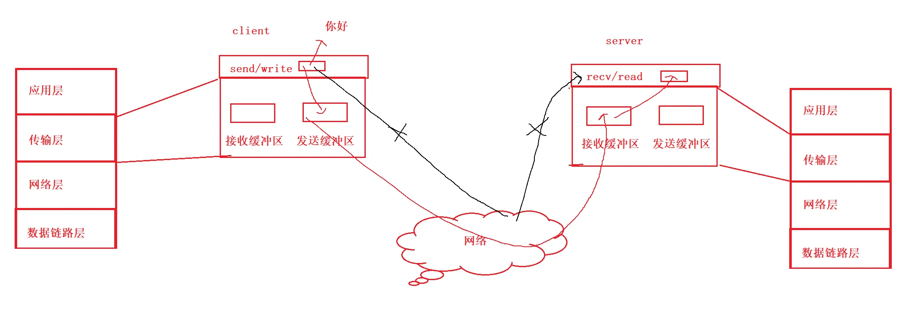

所以曾经调用的read/write/sendto/recvfrom/send/recv这些接口本质是拷贝函数！

client->server：用的是c发送缓冲区、s接收缓冲区。  
那同时server->client，用的s发送缓冲区，c接收缓冲区。  
因为发送缓冲区，接收缓冲区我们双方都各有一对，所以我们称这样的通信方式叫做**全双工**(我在给你发消息的时候，你也可以给我发)。

当把这些数据拷贝到缓冲区里，应用层就直接返回了。所以这个缓冲区除了支持全双工站在应用层角度上看还帮我们提供发送数据的效率。然后应用层继续执行其他逻辑不用等了。这个缓冲区数据什么时候发送，发多少，丢包怎么办等由**OS**也就是传输层中TCP协议自主控制，所以TCP协议全称叫做传输控制协议。而用户不参与，只要把数据从应用层拷贝到OS内部就可以了。

有人往里面放数据，有人把数据从缓冲区里刷新到网络里，这个模式不就与生产消费者模式相似吗！天然就具备生产端和消费端解耦支持忙闲不均。 不就是在正常发送时让应用层在用拷贝行为替代发送行为减少了client时间成本问题。

什么是以TCP来讲的，那UDP呢？

+ UDP没有真正意义上的 **发送缓冲区**. 调用sendto会直接交给内核, 由内核将数据传给网络层协议进行后续的传输动作;  
UDP没有真正意义上的 发送缓冲区，这是因为它不需要，因为UDP把报头一加直接交给下层，它没有可靠性机制，也不需要把数据暂存下来。
+ UDP具有接收缓冲区. 但是这个接收缓冲区不能保证收到的UDP报文的顺序和发送UDP报文的顺序一致; 如果缓冲区满了, 再到达的UDP数据就会被丢弃;

UDP的socket既能读, 也能写, 这个概念叫做 **全双工**

## UDP使用注意事项
我们注意到, UDP协议首部中有一个16位的最大长度. 说的是一个UDP能传输的最大报文长度是2^16 --> 2^10 * 2^6=64K(包括UDP首部)  


然而64K在当今的互联网环境下, 是一个非常小的数字.  
如果我们需要传输的数据超过64K, 就需要在应用层手动的分包, 多次发送, 并在接收端手动拼装;

## 基于UDP的应用层协议
+ NFS: 网络文件系统
+ TFTP: 简单文件传输协议
+ DHCP: 动态主机配置协议
+ BOOTP: 启动协议(用于无盘设备启动)
+ DNS: 域名解析协议

当然，也包括自己写UDP程序时自定义的应用层协议

