# 五种IO模型
# 什么是IO？什么是高效的IO？
在之前我们都知道的input，output不就是IO吗，站在冯诺依曼体系角度我们知道从外设把数据搬到内存这不就是Input吗，把数据从内存拷贝到外设中这不就是output吗。这不就是传说中的IO吗。没错，但是这种理解还不够深刻！

当我们在网络中发送数据的时候是使用write发生，read读取。当我们在进行write写入的时候曾经说过，我们在应用层调用write本质并不是把数据发送到网络中，其实只是把数据从应用层拷贝到传输层的发送缓冲区，所有write本质就是拷贝。当我们调用read读取数据时，其实并不是从网络中读取，而是从传输层的接收缓冲区中把数据从内核中拷贝到应用层，所以read也是拷贝函数。可是你想拷贝就能给你拷贝吗？

你想write，有没有可能发送缓冲区因为流量控制的问题发送缓冲区已经被写满了数据，你想write但当前缓冲区没有空间让你write了。那么此时write操作默认就是阻塞在哪里，直到缓冲区有空间了。write我们写代码到现在见到很少。但是当我们read读取数据的时候，我们被阻塞的情况是非常常见的。

以读为例：说读取就是拷贝这句话没错，但是当你想拷贝就能拷贝吗？万一人家接收缓冲区就没有数据呢？你的read只能阻塞住。所以要记住read、write本质就是拷贝，但是拷贝是有条件的。

所以不用考虑操作系统，就站在read接口使用角度，调用read/recv… 有两种情况

没有数据，就会阻塞住

有数据，read/recv… 会在拷贝完成之后进行返回

这个阻塞不就是在等待资源就绪吗。

所以不能简单认为read/recv… 只有拷贝。这是不全面的认识。read/recv… 读取的本质应用要分成两种东西。站在我们角度read/recv…就是input。读取也是同样如此要风两种东西，write/send…就是output。

IO本质：

> IO = 等 + 数据拷贝
>

在系统层面和网络层面IO都叫数据拷贝，就比如写文件的时候，把数据写到文件的过程我们根本不知道，调用write也只是把文件写到操作系统里，然后由操作系统把数据刷新到文件里。同理，我们也没有资格把数据直接写到网络里，只是把数据交给了操作系统，由操作系统帮我们发送。所以我们发现系统和网络在IO的处理上是一至的。在系统的时候我们不说IO=等+数据拷贝，是因为在系统层面等这个事情不直观，访问一个本地文件很快就写完成，很快就读完成了。看不到等。其实有没有等呢？一定要等！今天就知道了，你要读取数据，但数据可能并不在内存中，你必须要等，因为操作系统首先要把数据从外设搬到内存里。而磁盘是外设，所以操作系统要给磁盘下达指令把数据从磁盘中拷贝到内存等工作做完了，然后你才把数据从操作系统拷贝到用户，只不过这个过程太快了，你感受不到。

今天就不一样，在网络通信距离变长了，还要流量控制、拥塞控制等，所以距离一长等的比重就显得明显了，就能感觉到IO=等+数据拷贝了。

---

什么是高效的IO？  
你经常会听别人说我们要高效的IO，凭什么？你IO高效的提高究竟是在做哪方面的提高？

首先数据拷贝这件事情，它的效率是固定的。因为数据拷贝的的本质是从硬件到硬件，该花多少时间就花多少时间，要么就是由你主机上的总线的位宽决定的，要么就是由你网络的带宽决定的。所以这个东西本身就是确定的，只要你能保证你在拷贝的时候它在100%一直在拷贝，它的效率就已经到达上限了。

既然IO = 等 + 数据拷贝，那什么叫做高效IO呢？  
其实，只要**减少等待**的比重，即可！

想象一下调用read只花1秒，可是其中有99%的时间都在等待，等待的事件永远是主要矛盾，那么只有1%的时间花在拷贝上，拷贝本身就是从操作系统拷贝到用户，它是从内核到用户。站在硬件角度上就是从内存到内存，这个时间本身就是一个固定时间，站在操作系统角度把数据从外设搬到内存，把硬件上速度拉满它能拷贝多少就是多少。可是在IO大部分时间在等，如果把等和数据拷贝时间反过了，99%在拷贝，1%在等，我调用read很快就能够或者等的比重降的非常低，一调用read就直接返回，那这就叫做高效IO。

而在**等待**这件事情上，我们是需要从软件策略完成的。  
read/recv它们策略很简单粗暴，没有数据就等，有数据就拷贝。

# 有那些IO的方式？这么多的方式，有那些是高效的？
下面讲个小故事理解IO的过程。  
我们可能见过别人钓鱼或者自己钓鱼，那么把钓鱼步骤化繁为简，钓鱼分两步  
钓鱼 = 等 + 钓

现在有一条河，河里有很多野生鱼，远近闻名，很多人都到这里钓鱼。  
张三是出了名的死心眼，一个事情没有得到结果，不会干其他事情，很专注。今天张三到河边钓鱼，把东西都弄好，然后把鱼钩鱼鳔扔到水里，就开始钓鱼了。那什么时候知道鱼咬钩了呢？当鱼鳔上下浮动就说明鱼咬钩了。张三在钓鱼的时候，眼睛死死的盯着鱼鳔，头也不回谁也不理，鱼鳔不动它不懂，鱼鳔动了就把鱼竿拉起来把鱼钓上来。然后继续重复上面过程。

过了一会，张三的朋友李四也来钓鱼，李四看到张三和他打招呼，张三也不理他，于是李四就直接在张三旁边找个地方钓鱼，然后也把鱼钩鱼鳔扔到水里，但是李四这个人啊，他发现鱼鳔没动，就转过头和张三聊天，但张三还是不理他。李四于是拿本书看，然后给别人打个电话等等，然后在看鱼鳔。鱼鳔没有动静，李四就继续一会这样一会那样，然后再看看鱼鳔。鱼鳔动了钓上的鱼然后继续重复上面过程。

所以我们就看到一个场景，有个人钓鱼一动不动，有个人钓鱼一会干这个一会干那个一直在动。

后来来了一个王五，王五看着这两个人很奇怪一个不动一个一直动，并且对他们钓鱼动作很不屑。他在把鱼钩鱼鳔扔到水里之前，顺手在鱼竿底部上绑上一个铃铛，然后把鱼竿扔到水里之后，王五翘起二郎腿，一会和李四聊天，一会玩会手机，一会也看会书，整个过程王五头也不抬，当铃铛响了，他就知道鱼咬钩了，王五也是头也不抬，直接把鱼竿拉起来钓上来一条鱼。然后王五就重复上面过程。

后来河边马路上来了一个小土豪赵六，他并不是拿着一条鱼竿来的，而是开着车拉着一车鱼竿来的，因为这条河不允许用网补鱼。所以他抱着自己带着的鱼竿踉踉跄跄的走到河边，沿途看着三个很奇怪的人，一个一直不动，一个一直在动，还有一个在哪里悠闲的翘着二郎腿做着自己的事情，赵六对他们钓鱼方式不屑一顾，于是赵六抱着一大推鱼竿挑了一个安静的地方，然后把这鱼钩鱼鳔扔到水里，并把鱼竿排的插在岸边，插了100m，然后赵六这个人来来回回的在插满鱼的岸边来回遍历检测，哪一个鱼竿上的鱼鳔动了此时就把鱼竿拉起来把鱼钓起来，然后再把鱼钩鱼鳔扔水里，然后再来回检测。

所以我们目前看到一幅场景，有人一直不动，有人一直在动，有人宛如高人一般头来不抬做着自己的事情有鱼把鱼竿拉起来就行了，有人在河边插满鱼竿在来回检测。

此时在河边马路上来了一辆车，车上坐着上市公司老板田七和他的司机小王，田七这个人很爱钓鱼，但是他今天要去公司开会他没有时间去钓鱼，田七认真分析了一下，我有没有可能根本不是爱钓鱼我就是想吃鱼，于是他让司机小王停车，给小王一个鱼竿、一个桶、一部电话和其他钓鱼工具，然后小王去河边钓鱼，把桶钓满了后，然后给他打电话，我再来接你。于是司机小王就去钓鱼了。然后田七开车走了。小王是一个钓鱼新手，他看张三钓鱼方式很适合它，于是它学着张三样子钓鱼。田七在干着他的事情，小王在和给他钓鱼。当小王把桶钓满了，然后给田七打电话，田七就来了，把桶理的鱼和小王都一带走了。田七也完成了某种上钓鱼

以上是五种人钓鱼方式，从这个故事中。当你看到什么情况的时候，你认为对应的人，钓鱼效率是很高的？

很简单，当你看到一个人钓鱼一直在等一个小时动都没动，那钓鱼效率一定不高。当我看到一个人每隔五分钟就把鱼竿拉起来钓到一条鱼我就觉得他效率高。推向极端，我看到一个人在河边一直挥舞着鱼竿一会就钓上来一条鱼。然后把鱼竿放下去然后又钓上鱼。这个人钓鱼效率特别高。

所以，钓鱼的人，等的比重比较低，单位时间，钓鱼的效率就高！

其次，张三，李四，王五，赵六，田七(小王)谁钓鱼效率最高？  
首先张三、李四、王五、田七(小王)它们只有一人一竿，只有赵六是一人多竿。鱼竿多就是了不起。假设赵六100条竿，加上其他的人4条竿。站在鱼的角度头顶上有着104个诱饵，咬到任何一个诱饵概率是一样的，要是咬的话，赵六钓鱼成功概率就是100/104，其他人只是1/104，所以赵六钓鱼时任一鱼竿就绪概率概率就100/104。所以单位时间内任何一个鱼竿就绪概率就是比其他人大。所以站在旁观者看赵六就可能一直有鱼咬竿的事情。所以单位时间内，赵六这种钓鱼方式等的比重比较低，所以赵六钓鱼的效率比较高。

我们把这种一次可以等待多个鱼竿的钓鱼方式叫做多路转接/多路复用

张三 ------> 阻塞IO  
李四 ------> 非阻塞IO  
王五 ------> 信号驱动式IO(还没有钓鱼就知道铃铛响了，鱼就咬钩了）  
赵六 ------> 多路转接/多路复用  
田七 (小王) ------> 异步IO

张三、李四，王五、赵六、田七 ----> 进程/线程  
小王 ----> OS  
鱼 ----> 数据  
河 ----> 内核空间  
鱼鳔 ----> 数据就绪的事件  
鱼竿 ----> 文件描述符  
钓鱼的动作 ----> read/recv…钓鱼

当张三这个进程去读数据时，只要底层数据没有就绪，就要一直等待将自己挂起。只有数据就绪了，才会被唤醒然后读到数据在返回。

李四这个进程去读数据时，当底层数据没有就绪，李四并不会因为read/recv…而被阻塞，而是立马返回，在自己的while循环中去做其他事情。然后再去读。

王五这个进程在进行IO之前，一旦IO了操作系统会给进程推送SIGIO信号(需要特定接口去设置)，王五在进行调用recv之前，他只是注册一下SIGIO的方法，然后王五继续向后执行做自己的事情，一旦有IO就绪了，王五的信号捕捉方法里直接调用recv，然后把数据从内核拷贝到用户空间，这叫做信号驱动。

赵六这个进程拿着多个文件描述符，一次等待多个，具体怎么等后面说。

田七这个进程，通过异步IO的接口直接将数据读取的工作交给操作系统，除了把任务交给操作系统同时他还给了操作系统一个缓冲区(鱼桶)，以及给了操作系统一个通知(电话)，比如是某些回调方法或者某些回调策略。让操作系统在读取数据时直接把数据全部从内核中读取到缓冲区，然后用告诉操作系统的方法，来告知田七数据准备好了让田七直接用就好了，这就叫做异步IO。

所以我们把上面对IO的方式，我们称之为五种IO模型。所有IO都隶属于上面模型，目前大部分使用的文件接口用的是阻塞IO。

而多路转接/多路复用是比较高效的

对比五种IO模型的差别

张三、李四、王五在效率上有差别吗？  
没有！因为他们在整个IO过程，该等多少时间就等了多少时间。效率上是没有差别的。都只有一个鱼竿，而鱼钓上来的概率是一样的。  
但是在其他方面有差别！阻塞式什么事都不干，只进行IO，所以其他方面没有优势。而非阻塞式IO，它可以轮询式的方法检测底层数据是否就绪，在检测没有数据就绪时还可以在等的时间做其他事情。信号驱动也是一样的，在等待数据就绪时，也同样在等的时间做其他事情。所以张三、李四、王五在IO上效率是一样的，但是整体上李四，王五可以做其他事情，表现上他们好像多做了事情然后更高效一点，但是这高效没有体现在IO上。

王五(信号驱动)究竟有没有等待呢？  
他一定等了，要不然王五早就走了，为什么还要待在岸边呢？所以本质上还是等了。只不过等的方式有些差别，别人是主动去检测，而他变成了你好了，你来叫我。采用回调的方式来进行等待的。

张三、李四、王五、赵六他们其实每一个人都等了，当鱼咬钩时每一个人都钓了。每一个人都参与了IO的过程，我们把他们都可以称之为同步IO。

田七并没有等鱼咬钩，也没有当鱼咬钩时把鱼钓上来，他连河边都没有去过，他把任务交给小王，并没有参与IO的两个阶段中的任何一个阶段，我们把他称之为异步IO。

阻塞式IO和非阻塞式IO有什么差别呢？  
共同点：钓  
不同点：等的方式不同！

异步这里好理解，但是同步这里就有一个问题了，我们曾经学过一个线程同步的概念。现在又学了一个同步IO，那这两个同步是一样的吗？  
它们之间的关系就和老婆和老婆饼一样，没有任何关系！当我们在网络中搜索同步的概念时一定要加前提条件。线程同步是让多线程执行具有一定的顺序性。还是说IO的同步允许参与IO的过程！

为什么多路转接/多路复用是高效的代名词？  
因为**IO = 等 + 数据拷贝**，多路转接/多路复用可以减少等的比重，同样等，但是一次可以等待多个文件描述符至少有一个就绪。调用read等的比重降低了，未来效率就高了。

# 五种IO模型
阻塞IO: 在内核将数据准备好之前, 系统调用会一直等待. 所有的套接字, 默认都是阻塞方式.

阻塞式IO是最常见的IO模型

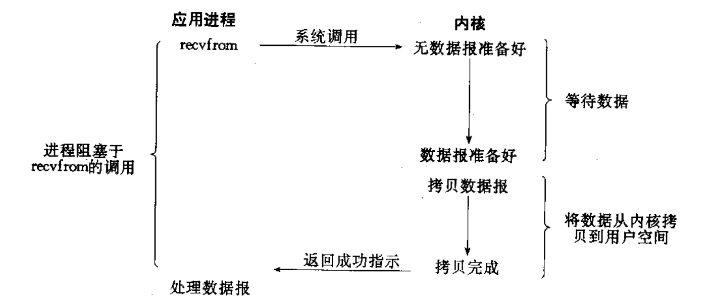

非阻塞IO：如果内核还未将数据准备好, 系统调用仍然会直接返回，并且返回**EWOULDBLOCK**错误码.

非阻塞IO往往需要程序员循环的方式反复尝试读写文件描述符, 这个过程称为轮询. 这对CPU来说是较大的浪费, 一般只有特定场景下才使用

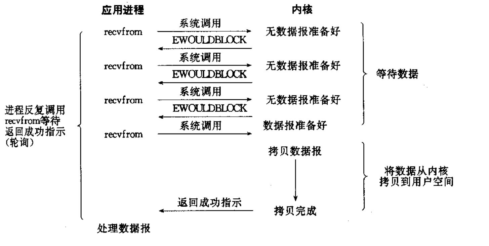

信号驱动IO: 内核将数据准备好的时候, 使用SIGIO信号通知应用程序进行IO操作.

进程提前设置对SIGIO信号的捕捉，当数据准备好时，操作系统自动会向该进程抵达信号。捕捉到该信号会回调自己曾经写的read/recv…进行数据拷贝了。

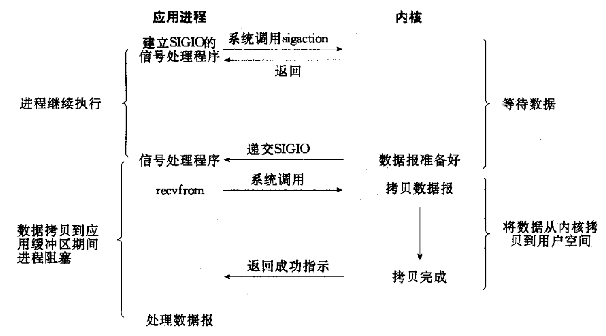

IO多路转接: 虽然从流程图上看起来和阻塞IO类似. 实际上最核心在于IO多路转接能够同时等待多个

以前我们学的read/recv…这些接口在传参的时只能传一个文件描述符，就注定了它们只能一次等待一个文件描述符，而多路转接的原理是一次可以等待多个文件描述符。这就决定以前的IO接口不能直接用了，所以操作系统为了能让我们能够同时等待多个文件描述符，就必须单独设计其他的系统调用，这个其他的系统调用就叫做高级IO话题中的select、poll、epoll这三个话题 。

这三个系统调用允许一次可以传递多个文件描述符，同时检测多个文件描述符上是否有数据就绪。IO=等+数据拷贝，所以像select、poll、epoll这类接口只负责等这一步。 一旦数据准备好了elect、poll、epoll没有数据拷贝的能力，也不需要拷贝能力，当准备好了某一个或者某几个文件描述符就绪了，可以调用一次或多次read/recv…等接口把数据从内核拷贝到用户空间。所以用select、poll、epoll这样的接口，配合曾经学到的IO类接口，就把IO的过程肢解了。select、poll、epoll只负责等待，而read/recv…只负责拷贝。 因此当调用select、poll、epoll成功返回时，调用read/recv…在去读取时不再会被阻塞，只要select、poll、epol成功返回，我所对应的文件描述符一定是就绪的。

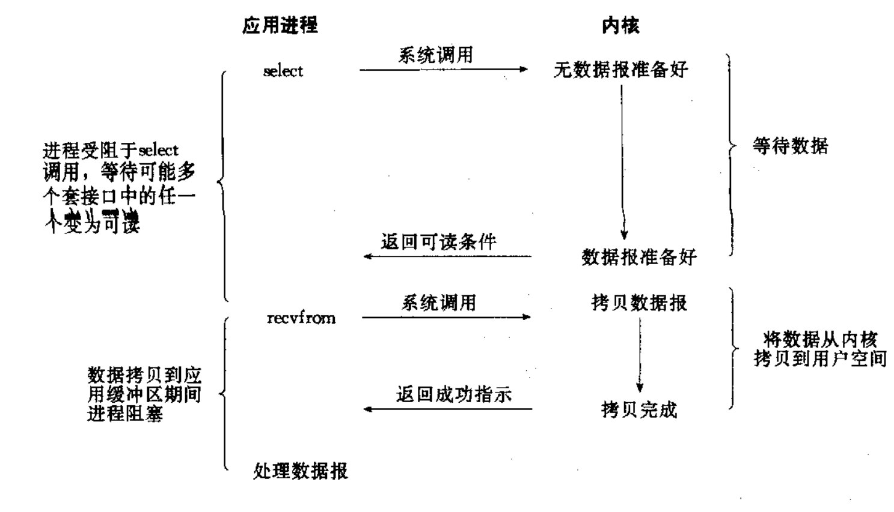  
上面四种IO方式，其实对于当前进程来讲，对于调用对应的接口来讲，都要参与IO过程，不管是直接还是间接都要参与IO过程。我们称之为同步IO。

异步IO: 由内核在数据拷贝完成时, 通知应用程序(而信号驱动是告诉应用程序何时可以开始拷贝数据)

异步IO调用特定异步IO接口，只要调了然后就能直接返回，这个接口会包含一些传入应用层用户缓冲区也包含一些数据就绪时通知方法，aio_read其实根本不是读它只是发起了对应的IO，告诉操作系统请帮我读一下特别文件描述符的数据，读好后把数据放到我给你传入的缓冲区里，数据读完之后通过我给你的方法来告送我。所以就是由操作系统来等待数据，然后有数据了操作系统自己把数据从内核空间拷贝到异步IO时传入的缓冲区，然后在给我递交对应的通知方式，告诉我应该要处理数据了，所以我直接处理就好了。

整个进程并不参与IO的整个过程和细节，这种IO我称为异步IO。

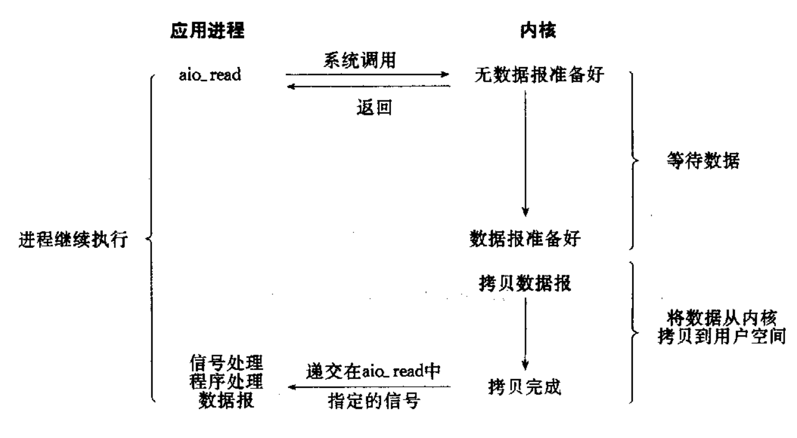

任何IO过程中, 都包含两个步骤.** 第一是等待, 第二是拷贝**. 而且在实际的应用场景中, 等待消耗的时间往往都远远高于拷贝的时间. 让IO更高效, 最核心的办法就是让等待的时间尽量少

其实如果我们的系统里有10个文件描述符，我创建10个线程和我用多路转接方案同时等10个文件描述符，其实IO就绪的概率是一样的。只不过多进程、多线程方案成本太高，而多路转接把所有IO情况收拢在一起，这样的话我们就可以直接用一个多路转接技术把所有文件描述符全部管理起来。所以它的成本会特别低。

# 高级IO重要概念
## 同步通信 vs 异步通信(synchronous communication/ asynchronous communication)
同步和异步关注的是消息通信机制.

所谓同步，就是在发出一个调用时，在没有得到结果之前，该调用就不返回. 但是一旦调用返回，就得到返回值了; 换句话说，就是由调用者主动等待这个调用的结果;

异步则是相反，调用在发出之后，这个调用就直接返回了，所以没有返回结果; 换句话说，当一个异步过程调用发出后，调用者不会立刻得到结果; 而是在调用发出后，被调用者通过状态、通知来通知调用者，或通过回调函数处理这个调用.

另外, 我们回忆在讲多进程多线程的时候, 也提到同步和互斥. 这里的同步通信和进程之间的同步是完全不想干的概念.

进程/线程同步也是进程/线程之间直接的制约关系

是为完成某种任务而建立的两个或多个线程，这个线程需要在某些位置上协调他们的工作次序而等待、传递信息所产生的制约关系. 尤其是在访问临界资源的时候

这点前面我们都说过了。

## 阻塞 vs 非阻塞
阻塞和非阻塞关注的是程序在等待调用结果（消息，返回值）时的状态.

阻塞调用是指调用结果返回之前，当前线程会被挂起. 调用线程只有在得到结果之后才会返回.

非阻塞调用指在不能立刻得到结果之前，该调用不会阻塞当前线程

## 其他高级IO
非阻塞IO，纪录锁，系统V流机制，I/O多路转接（也叫I/O多路用）,readv和writev函数以及存储映射IO（mmap），这些统称为高级IO.  
我们重点讨论的是I/O多路转接

强调一下五种IO模型，我们最常用永远还是阻塞IO。因为它简单，编程成本难度也很低。

阻塞我们就不谈了，下面我们谈非阻塞IO和多路转接。

# 非阻塞IO
一般我们打开的文件描述符，不论是系统的文件还是网络套接字现在我们都知道其实都是文件描述，默认创造出来的文件描述符不管是写入操作，还是读取操作本质其实都是阻塞式IO。 所以我们要以非阻塞方式去读取的话，我们首先要将一个文件描述符设为非阻塞的。当然一些IO接口也有非阻塞式读取的方案。

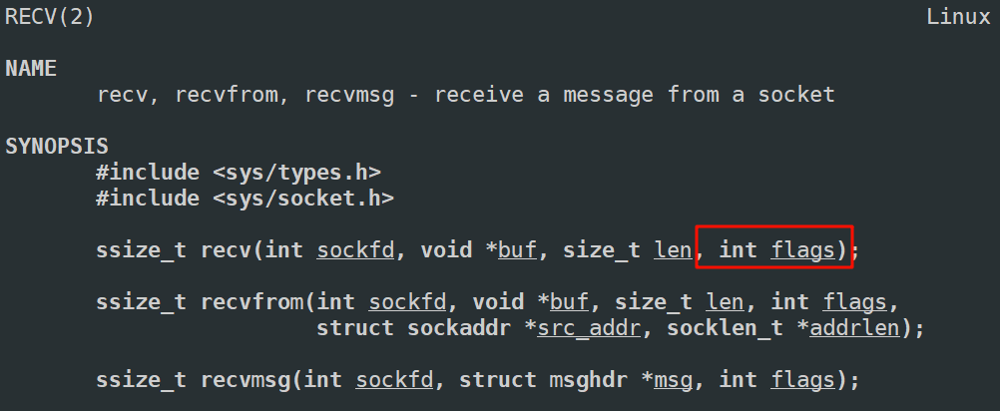  
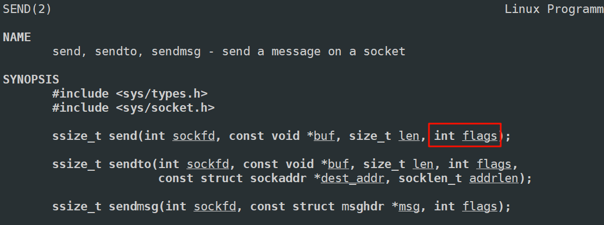

可以设置为开启非阻塞操作，可以不用等。

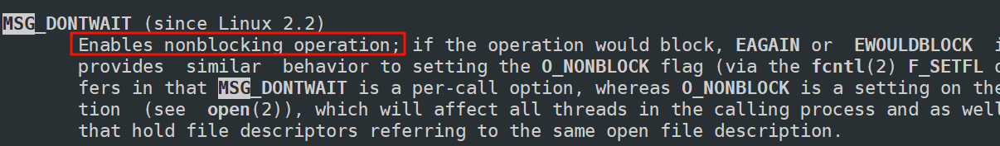

但是这些都不是常用方法，最常用的方法就是把文件描述符设为非阻塞！  
我们一般用`fcntl`函数，将指定文件描述符直接设为非阻塞。

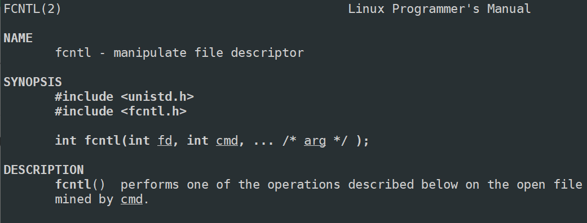

传入的cmd的值不同, 后面追加的参数也不相同.

fcntl函数有5种功能:

复制一个现有的描述符（cmd=F_DUPFD）.

获得/设置文件描述符标记(cmd=F_GETFD或F_SETFD).

获得/设置文件状态标记(cmd=F_GETFL或F_SETFL).

获得/设置异步I/O所有权(cmd=F_GETOWN或F_SETOWN).

获得/设置记录锁(cmd=F_GETLK,F_SETLK或F_SETLKW).

我们此处只是用第三种功能, 获取/设置文件状态标记, 就可以将一个文件描述符设置为非阻塞

```cpp
void SetNonBlock(int sockfd)
{
    int fl = fcntl(sockfd, F_GETFL); // 获取
    if(fl < 0)
    {
        std::cerr << "fcntl : " << strerror(errno) << std::endl;
        return;
    }
    //标记位加上非阻塞，然后设置到文件描述符，这个文件描述符就变成了非阻塞
    fcntl(sockfd, F_SETFL, fl | O_NONBLOCK);
}
```

使用`F_GETFL`将当前的文件描述符的属性取出来(这是一个位图).

然后再使用`F_SETFL`将文件描述符设置回去. 设置回去的同时, 加上一个`O_NONBLOCK`参数.

接下来写代码验证一下：  
fcntl函数可以将指定文件描述符直接设为非阻塞。不论是对于系统层面上的0、1、2，还是对于网络套接字，还是以前的普通文件描述符都是一样的。  
所以我们先测试一下对于0号文件描述符，标准输入默认是阻塞式的。然后在将标准输入设置为非阻塞式的。

下面目前是阻塞式读取。

```cpp
#include <iostream>
#include <cstring>

#include <unistd.h>
#include <sys/fcntl.h>
int main()
{
    char buffer[1024];
    while(true)
    {
        ssize_t n = read(0, buffer, sizeof(buffer) - 1);
        if(n > 0)
        {
            buffer[n] = 0;
            printf("#%s", buffer);
        }
        else if(n == 0)
        {
            printf("read end of file!\n");
            break;
        }
        else
        {
            perror("read error");
        }
    }
    return 0;    
}
```

因为当前是阻塞式，目前也没有向键盘输入任何内容，所以就直接阻塞住了

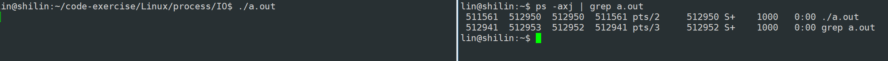

然后当我输入时，就给我响应，因为自己后面敲了个回车，所以响应也给一个回车。


表示文件读取结束，linux中用`crtl+d`

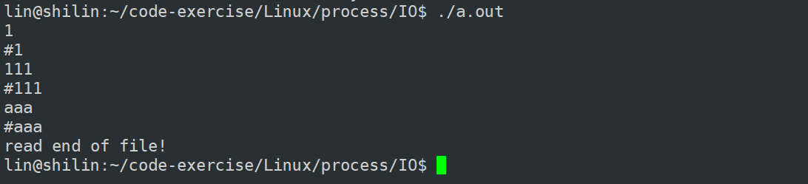

下面把0文件描述符默认阻塞式读取改成非阻塞读取。

所以我们发现read返回有一个细节，错误的时候返回-1，errno错误码被设置

所以在返回值为-1的时候还要再进一步做区分。

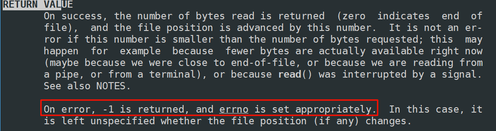

经过测试发现errno是11，表明它不是真的错了，而是底层数据没有就绪，可以在看看11代表的是资源暂时没有就绪

可是这个11未免有点太挫了，我总不能在我的代码硬写上11吧，这样不就硬编码了吗，怎么办呢？

其实在读取出错的时候，错误码有如下这些

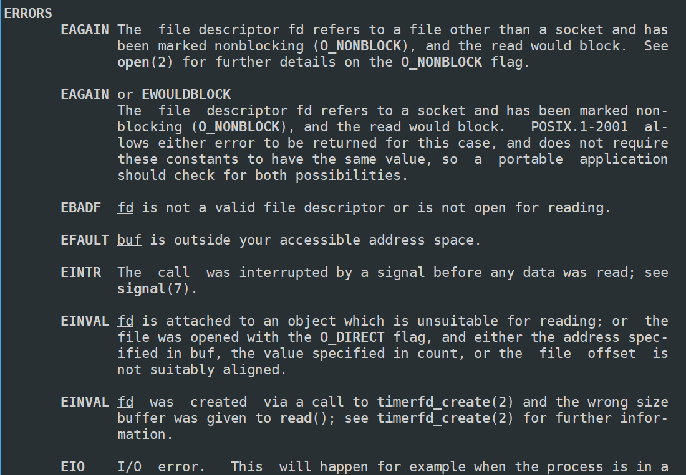

其中常用的`EAGAIN`和`EWOULDBLOCK`表示的是非阻塞返回  
如果对应的文件描述符曾经被设置为非阻塞，那么当读取的时候本来应该阻塞的，但是你可能非阻塞立马返回，返回值以出错的形式-1返回，但错误码errno被设置成`EAGAIN`或`EWOULDBLOCK`。

其实`EAGAIN`和`EWOULDBLOCK`的值是一样的。

其实在读取的时候，还要一种情况叫`EINTR`、, 表示返回并不是因为读取时非阻塞或者其他，有可能是对应的读取被信号中断了，所以只要报错是EINTR 说明底层数据可能还没有读完，但是也以-1形式返回，它不算读取错误，它是底层读取被中断了，需要下次再重新读。

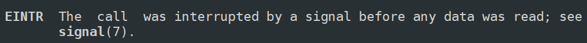

```cpp
#include <iostream>
#include <cstring>

#include <unistd.h>
#include <sys/fcntl.h>


void SetNonBlock(int sockfd)
{
    int fl = fcntl(sockfd, F_GETFL); // 获取
    if(fl < 0)
    {
        std::cerr << "fcntl : " << strerror(errno) << std::endl;
        return;
    }
    //标记位加上非阻塞，然后设置到文件描述符，这个文件描述符就变成了非阻塞
    fcntl(sockfd, F_SETFL, fl | O_NONBLOCK);
}

int main()
{
    SetNonBlock(0); // 设置为非阻塞

    char buffer[1024];
    while(true)
    {
        ssize_t n = read(0, buffer, sizeof(buffer) - 1);
        if(n > 0)
        {
            buffer[n] = 0;
            printf("#%s", buffer);
        }
        else if(n == 0)
        {
            printf("read end of file!\n");
            break;
        }
        else
        {
            printf("read error, read ret : %ld, errno : %d, err message: %s\n", n, errno, strerror(errno));
            // errno = 11 -> EAGAIN or EWOULDBLOCK
            if(errno == EAGAIN || errno == EWOULDBLOCK)
            {
                                 printf("你的数据没有准备好，下次再来吧!\n");
                sleep(1); // 在做其他的事情
                continue;
            }
            if(errno == EINTR)
            {
                sleep(1);
                continue;
            }
            else 
            {
                perror("read error!");
            }
        }
        sleep(1);
    }
    return 0;    
}
```

我们发现现在即使没有在键盘输入，但也没有在read这里阻塞了。数据没有就绪等就等把，但是可以做一下其他事情。当数据就绪了，然后也在帮我读取，这就是非阻塞。

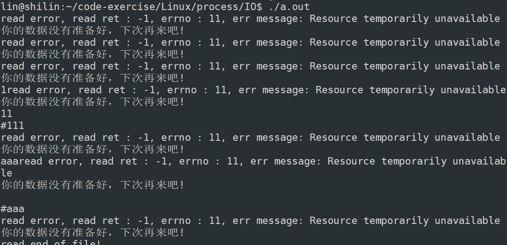

