# 守护进程
服务器启动没问题，但是我们把这个终端关掉，此时我们看到服务就没了。也就是说服务器启动了不能关闭xshell，一关就没了。

正常服务器肯定不是这样运行的。服务器启动之后不再受用户登录注销的影响，而服务器可以自由运行的，除非未来不想用它，直接kill。

> 在liunx中这种进程，叫做**守护进程**！
>

我们xshell客户端连上远端的与服务器会有一个会话，会话内部会给我提供一个前台进程bash，然后用户在命令行中自由的启动前台或者后台的任务，在这个会话中，只允许一个前台任务，和0个或者多个后台任务。  
**后面加& ，将任务放到后台**

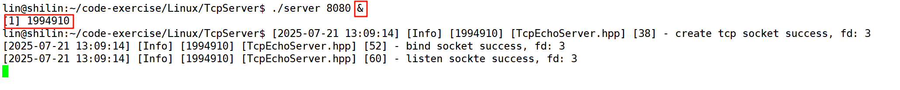

这里打印出来的东西暂时不用管

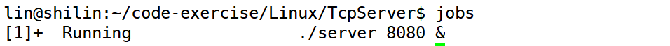

然后我们在以后台方式启动几个任务

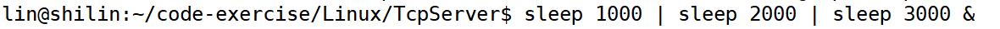

这就是对应的两个作业，作用编号1、2

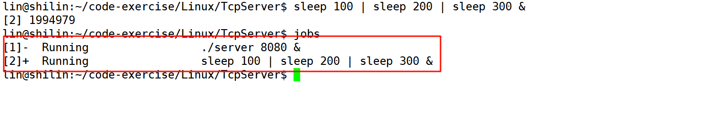

然后我们查看当前进程sleep，可以看到PGID，前三个进程是一样的，后三个进程是一样的，并且都是第一个进程的PID，这里想表达的是它们分别属于不同进程组。**相同PGID的是一个进程组，组长是第一个进程**。然后每个组三个人合起来成为一个进程组干一个作业。

这里想说的是，任务(1、2、3)是由各个进程组来完成的。

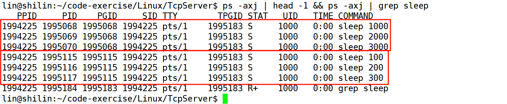

这些后端任务都属于同一个会话，从SID全都是一样可以看到。会话是以bashID来命名这个会话的。

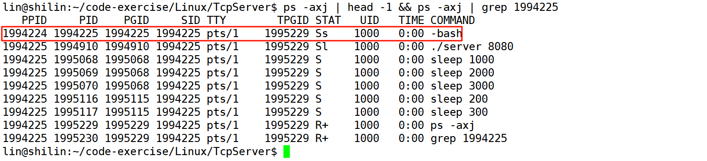

**& 以后端方式起任务**

```shell
jobs # 查看当前会话
```


```shell
fg 4   # 4号任务放前台
```


一个任务在前台暂停了，立马会被放到后台

键盘按下：`ctrl+z`

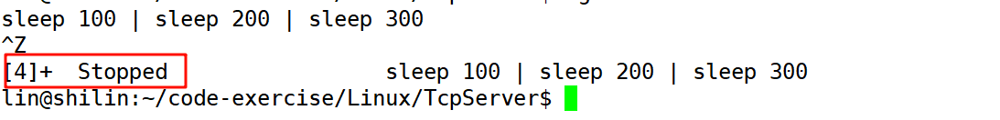

然后发现bash又回来了，这证明了有且只有一个前台任务。

把一个任务放前台，bash自动变后台，这也说明以前我们自己在以`./`启动任务，是把任务放到前台了，所以输入其他指令根本没用


```shell
bg 4  # 启动4号任务
```

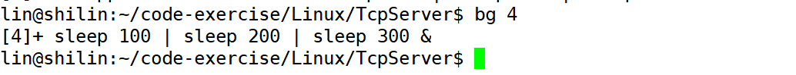

所以我们得到的结论就是，**作业是可以前台转化的**

这就是会话进程组作业之间的关系。

xshell登录的时候会建立这么一堆东西，那退出登录呢？是不是所有任务都会自动清理。

刚刚我们谈到了进程组的概念， 那么会话又是什么呢？ 会话其实和进程组息息相关， 会话可以看成是一个或多个进程组的集合， 一个会话可以包含多个进程组。每一个会话也有一个会话ID(SID)

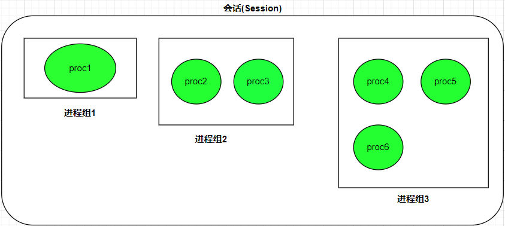

所以我们要想不受用户登录注销的影响，当这个会话要派生任务的时候，我们只把任务放在后台是不够的，我们需要把任务独立出来，让它自成会话，自成进程组，和终端设备无关。

这样的任务以进程方式呈现，我们叫它**守护进程**！不受用户登录注销的影响，可以一直在进行运行，除非未来不想让它运行了。

# 服务器进程守护进程化
守护进程化有n多种方式，系统提供了一个函数。不过自己我们自己实现一个。  
以后也建议用自己的。

系统提供的：

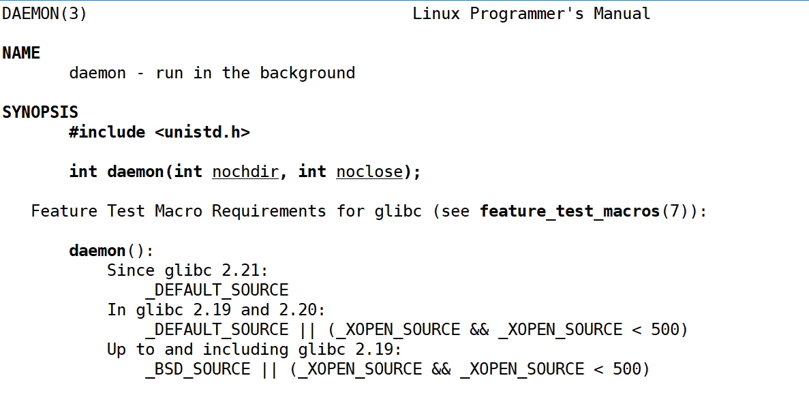

一个进行想要自己变成守护进程，一定要调用`setsid`

可以调用`setseid`函数来创建一个会话， 前提是调用进程不能是一个进程组的组长。

+ 调用进程会变成新会话的会话首进程。 此时， 新会话中只有唯一的一个进程
+ 调用进程会变成进程组组长。 新进程组ID就是当前调用进程ID
+ 该进程没有控制终端。 如果在调用setsid之前该进程存在控制终端， 则调用之后会切断联系

需要注意的是： 这个接口如果调用进程原来是进程组组长， 则会报错， 为了避免这种情况， 我们通常的使用方法是先调用fork创建子进程， 父进程终止， 子进程继续执行， 因为子进程会继承父进程的进程组ID，而进程ID则是新分配的，就不会出现错误的情况。

上边我们提到了会话ID， 那么会话ID是什么呢？ 我们可以先说一下会话首进程， 会话首进程是具有唯一进程ID的单个进程， 那么我们可以将会话首进程的进程ID当做是会话ID。注意：会话ID在有些地方也被称为 会话首进程的进程组ID， 因为会话首进程总是一个进程组的组长进程， 所以两者是等价的。

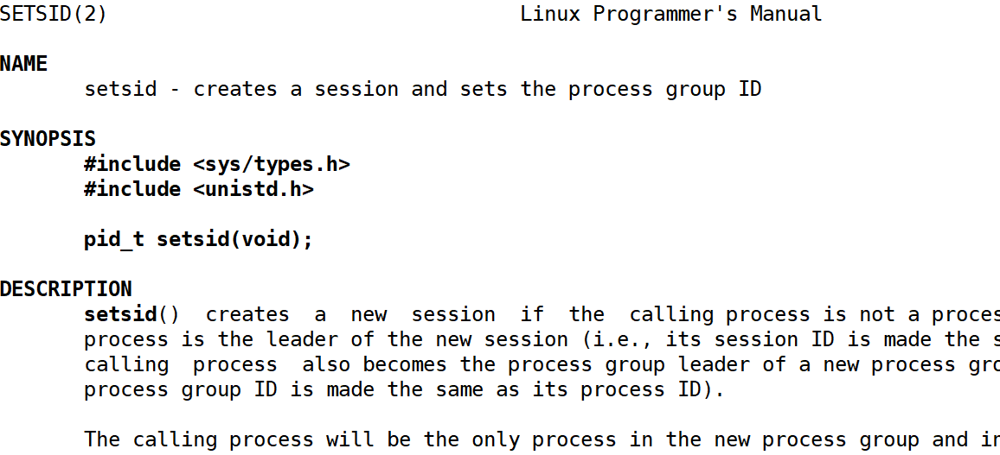

但是这里调用setsid不能随便调，要求**调用setsid的进程不能是进程组组长。**

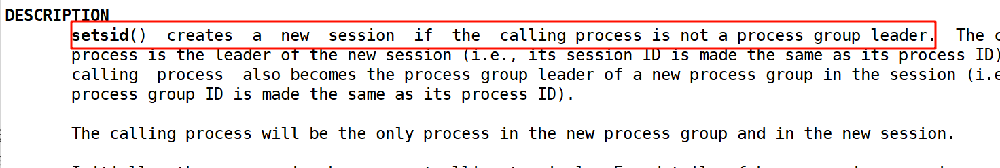

```cpp
void myDaemon()
{
    // 1.让调用进程忽略掉异常的信号

    // 2.如何让自己不是组长, setsid

    // 3.守护进程是脱离终端的,关闭或者重定向以前进程默认打开的文件

    // 4.进程执行路径发送更改
}
```

比如客户端给服务端发了一个消息，服务端收到消息然后请求完要给客户端回过去，可是正准备写回去客户端奔溃了，那么服务端此时就是像一个以及被关闭的文件描述符写入，这就如同读端关闭，写端再写没用意义，写端会收到`SIGPIPE`信号退出。

```cpp
void myDaemon()
{
    // 1.让调用进程忽略掉异常的信号
    signal(SIGPIPE, SIG_IGN);
    signal(SIGCHLD, SIG_IGN);

    // 2.如何让自己不是组长, setsid
    if(fork() > 0)
        exit(0);
    
    setsid(); // 守护进程也叫精灵进程，本质就是孤儿进程的一种
    
    // 3.守护进程是脱离终端的,关闭或者重定向以前进程默认打开的文件

    // 4.进程执行路径发送更改
}
```

守护进程是脱离终端的，关闭或者重定向以前进程默认打开的文件。

守护进程和显示器和键盘等已经没关系了，它就是一个独立的在后端运行，只有通过网络端口的方式进行访问。默认会打开0，1，2，可以直接close但是特别简单除暴不合理万一有些日志没写到文件中而打印到显示器但是我们关闭了那不就出问题了吗，进程之间挂掉了。因此我们选择重定向。

linux中存在一个特殊的文件，这个文件就像一个黑洞 ，默认处理方式，凡是向这个文件中写入都统统都丢弃掉。你读我也不阻塞你什么也读不到

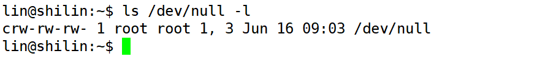  
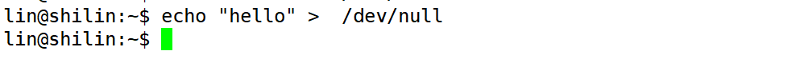

## daemon.hpp
```cpp
#ifndef DAEMON_HPP
#define DAEMON_HPP

#include <cstdlib>
#include <sys/types.h>
#include <unistd.h>
#include <sys/signal.h>
#include <sys/stat.h>
#include <fcntl.h>

void myDaemon()
{
    // 1.让调用进程忽略掉异常的信号
    signal(SIGPIPE, SIG_IGN);
    signal(SIGCHLD, SIG_IGN);

    // 2.如何让自己不是组长, setsid
    if (fork() > 0)
        exit(0);

    setsid(); // 守护进程也叫精灵进程，本质就是孤儿进程的一种

    // 3.守护进程是脱离终端的,关闭或者重定向以前进程默认打开的文件
    int fd = open("/dev/null", O_RDWR);
    if (fd > 0)
    {
        dup2(fd, 0);
        dup2(fd, 1);
        dup2(fd, 2);
    }
    else
    {
        close(0);
        close(1);
        close(2);
    }

    // 4.进程执行路径发送更改
    chdir("/");
}
#endif
```


## server.cc
```cpp
#include <memory>

#include "TcpServer.hpp" // Tcp
#include "Parser.hpp"    // 序列化与分序列化
#include "Calculator.hpp"// 计算
#include "daemon.hpp"    // 守护进程

void Usage(std::string proc)
{
    std::cerr << "Usage : " << proc << " <prot>" << std::endl;
}

int main(int argc, char *argv[])
{
    if (argc != 2)
    {
        Usage(argv[0]);
        exit(0);
    }

    myDaemon(); // 守护进程化
    
    // 计算器模块
    std::unique_ptr<Calculator> cal = std::make_unique<Calculator>();

    // 协议解析模块
    std::unique_ptr<Parser> parser = std::make_unique<Parser>([&cal](Request &req) -> Response
                                                              { return cal->Exec(req); });

    uint16_t port = std::stoi(argv[1]);
    // 网络通信模块
    std::unique_ptr<TcpServer> tsock = std::make_unique<TcpServer>(port, [&parser](std::string &inbuffer) -> std::string
                                                                   { return parser->Parse(inbuffer); });

    tsock->Run();

    return 0;
}
```

现在这个服务端进程就变成守护进程了

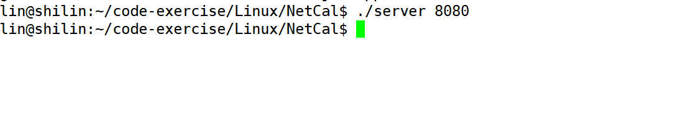

调用setsid，自建一个会话，自己就是会话的话首进程，组长进程，以及进程组组长

通过查询可以看到：`ps -axj | grep server`


然后客户端随意访问，服务端没有任何反应，在后端自动给我们反应

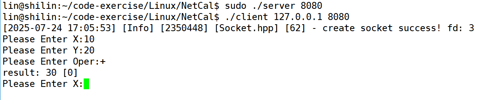

修改默认日志目录

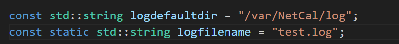

这个时候就需要使用sudo来进行启动服务器

而且日志信息也打印到对应的文件中

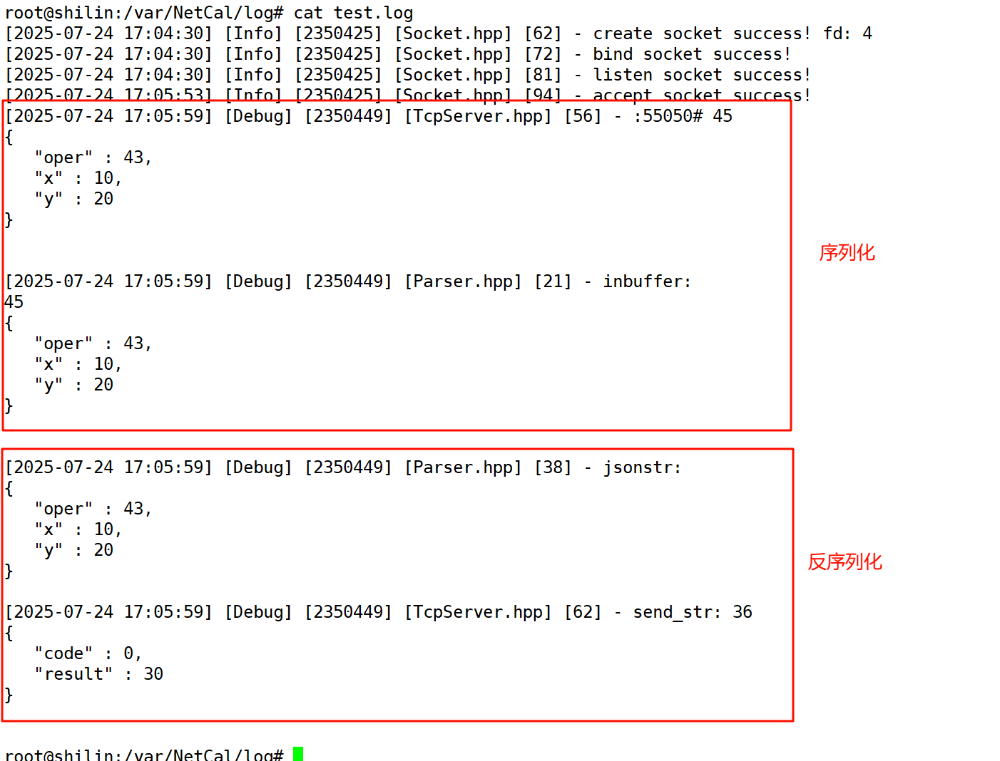

把xshell关掉，还可以连接到这个服务器，这就把端口暴露给外部，自己写的业务别人就可以直接进行返回了。

这个服务器除非自己主动退出，不然一直在后台运行。

# TCP协议通讯流程
下图是基于TCP协议的客户端/服务器程序的一般流程:

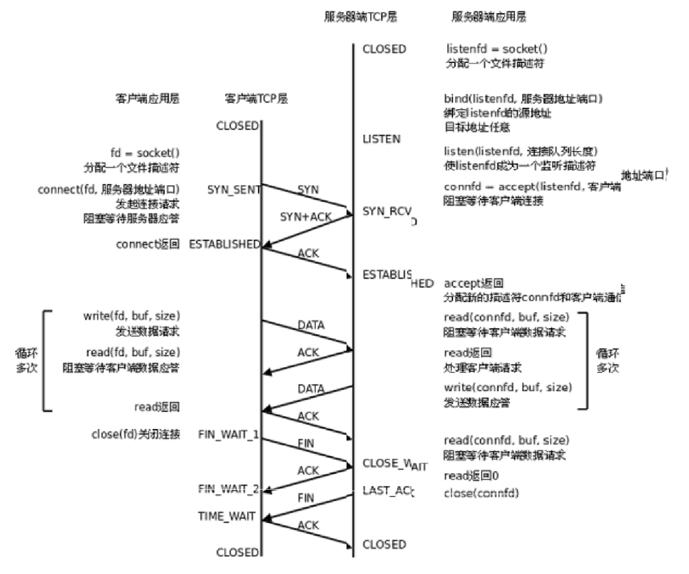  
**服务端：**

服务端首先创建套接字，bind绑定ip和port，然后调用listen设置sock为监听状态，一旦调用listen服务器就由关闭状态变成监听状态就允许客户端来连接了，然后调用accept获取连接。在TCP我们有两套文件描述符，一个创建套接字返回上来的listenfd只用来获取新连接，一个accept返回上来connfd是未来IOfd用它作为IO读取。

这里有个细节，**accept是获取连接，并不是创建连接**，所谓获取连接前提是底层已经帮我创建好了连接，然后在应用层调用accept把连接拿上来，仅此而已。

**客户端：**

客户端首先创建套接字，然后调用connect发起链接请求，并且在调用connect的时候OS自动帮我们绑定ip和port。

在TCP这里我们采用链接的方案叫做**三次握手**。

**connect是发起三次握手链接请求的，而真正三次握手建立链接是双方的OS自动完成的。**

**accept是获取链接的，链接建立好了才能获取链接，因此accept并不参与三次握手的任何细节。**  
**也就是说上层不调用accept，三次握手依旧能完成。**

获取链接了，然后客户端和服务端调用read，write等接口进行IO通信，而TCP是可靠性的，所以在发信息后对方会给ACK确认。

**TCP保证可靠性和调用read、write没有任何关系，一方发信息对方给ACK确认是双方OS去完成的。** 甚至这个发信息也和write和read没关系这个后面说。

曾经建立了连接，才会有未来断开连接。断开连接在TCP这里采用的是**四次挥手**。

而**四次挥手的工作也是由双方OS自动完成的**，和我们没用半毛钱关系，而我们决定的是什么时候四次挥手。close是上层调用触发四次挥手。

下面再进一步感性认识三次握手，四次挥手

所谓建立链接是什么？  
就如一个男生喜欢一个女生，并不是喜欢他们就在一起了，男生要想和女生在一起就必须先去尝试追求一下。因此男生首先主动发起追求（主动发起连接），他问女生：你愿意做我女朋友吗？女生回答说：好啊，什么时候开始呢？ 男生说：就现在把。自此双方三次握手建立成功。

那现实中男生女生在一起了，知道各自是对方男朋友女朋友究竟是在干什么呢？  
一定是记下来了一些东西，比如知道他是你的男朋友，她是你的女朋友。所以双方才知道他是我的女朋友，她是我的女朋友。

**因此建立链接并不是简单的做了这个动作，它是手段，真正的目的是在双方要各自维护好链接建立好相关的属性信息 。**

现在有一个男生有很多女朋友，他要有记录每一个女朋友属性信息。那怎么办呢？  
他就需要对每一个女朋友对象先描述，在组织起来。弄一个链接结构管理这些女朋友们。

**一个服务器可能有很多客户端发起链接，服务端也需要对这些客户端的链接先描述，在组织！对这些链接用特定的数据结构管理起来。**

**链接的总结：建立链接是双方OS自动完成的，建立链接过程是双方为了维护链接而创立的内核数据结构，这个内核数据结构对象是要有成本的，这个成本体现在创建的时候要花的时间和空间。**

**断开链接：是把曾经建立好的链接信息释放掉**

断开链接为什么叫四次挥手呢？可以这样理解。男女朋友在一起最后结婚了一起生活了10年，但最终被现实打败了，男生说：我们离婚把。女生说：好啊。然后过了3秒，女生说：你跟我离婚，我也要跟你离婚。男生说：好。这种叫做协商。建立链接是一方主动，所以我们需要三次握手建立链接。断开链接是双方的事情，就必须争得双方的同意。你跟我断开链接，我也要和你断开链接，这叫做协商少了任何一方都只能叫通知。又因为TCP是保证可靠性的，我给你说的话要保证你听到了，你给我说的话要保证我听到了，所以我给你协商时你给我做应答保证我给你做协商时你听到了，反之也一样。所以需要4次，也就是四次挥手。

