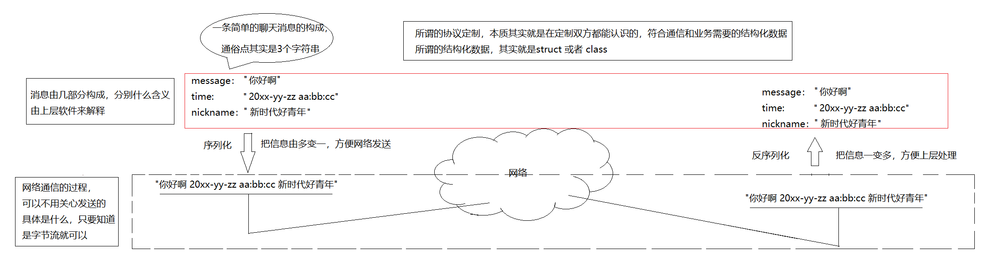
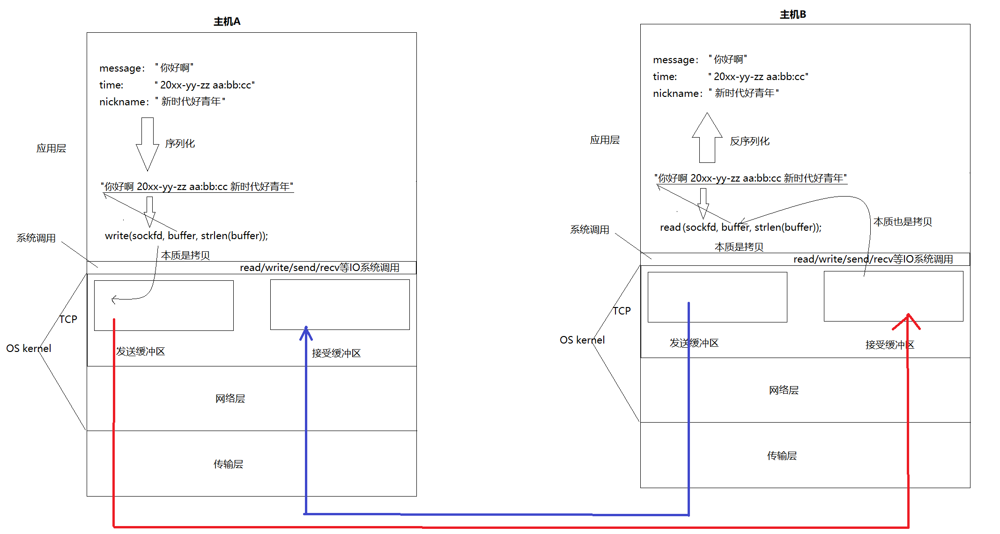
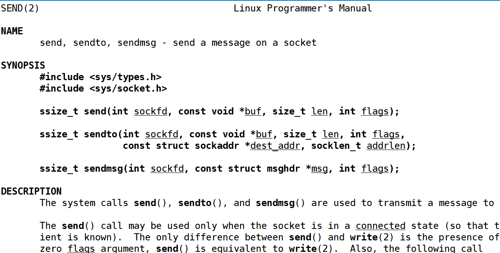
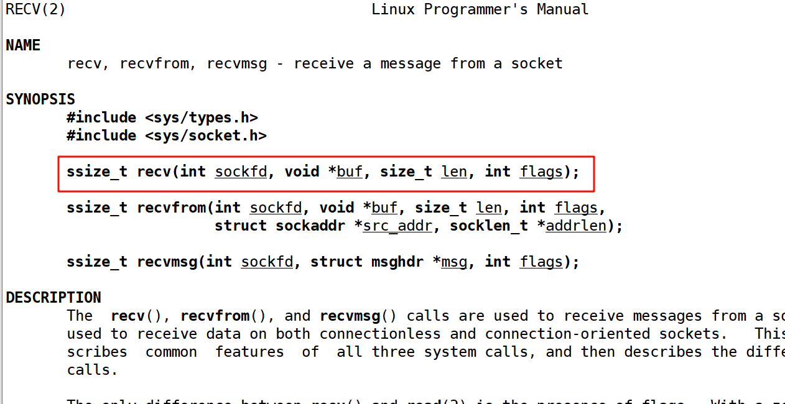
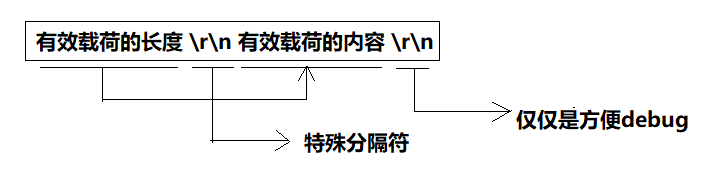
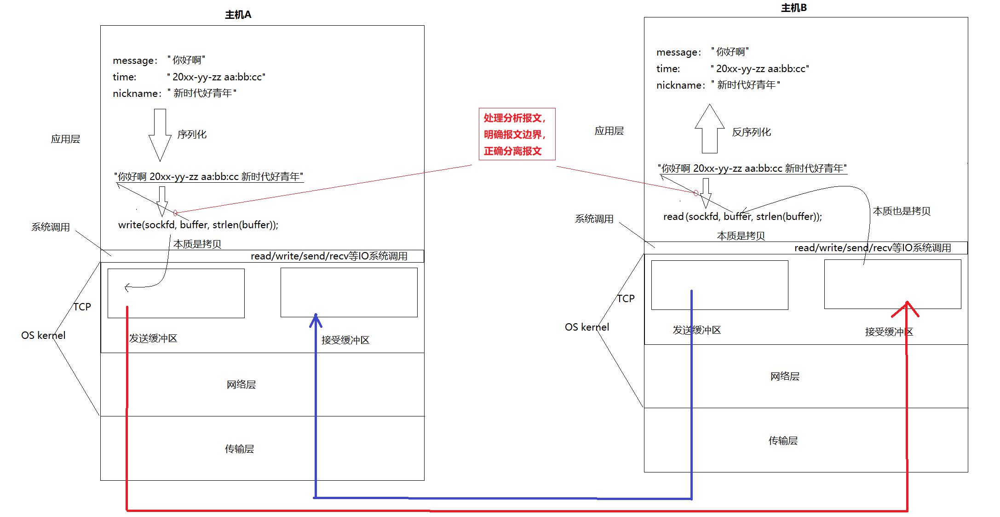
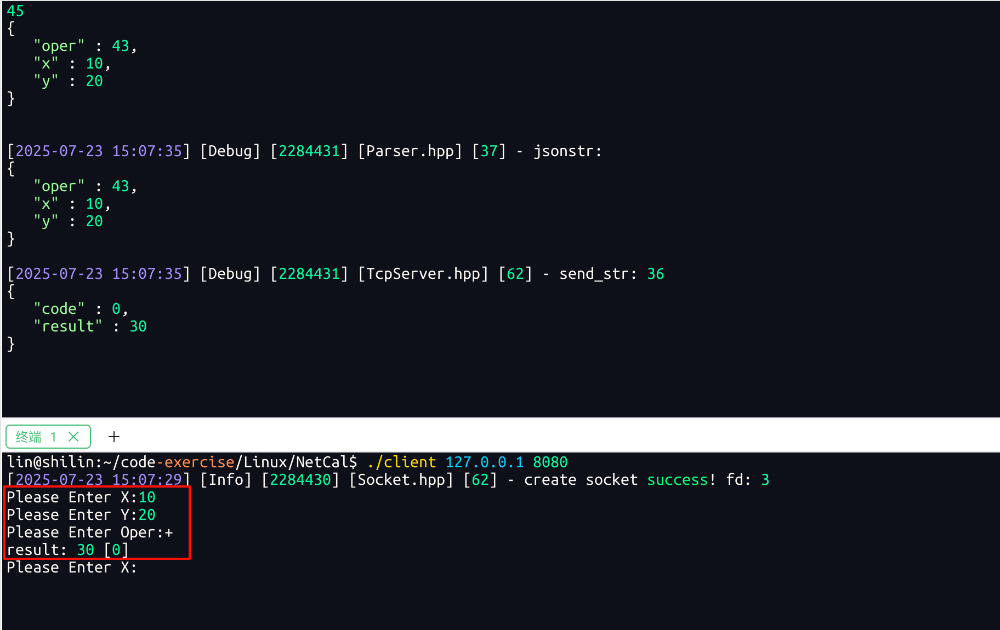
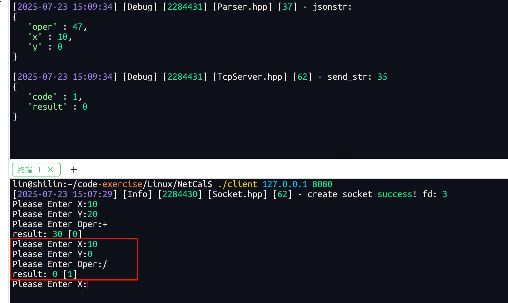
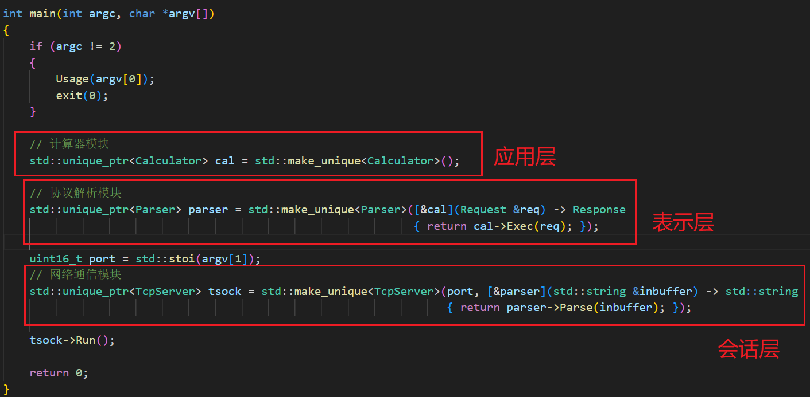

# 应用层自定义协议【序列化+反序列化】
# 再谈 “协议”
协议是一种 “约定”。在前面我们说过父亲和儿子约定打电话的例子，不过这是感性的认识，今天我们理性的认识一下协议。 `socket api`的接口， 在读写数据时，都是按 “字符串”(其实TCP是字节流，这里是为了理解) 的方式来发送接收的。如果我们要传输一些 “结构化的数据” 怎么办呢?

> <font style="color:rgb(31,35,41);">其实，协议就是双方约定好的结构化的数据</font>
>

约定：

> 定义结构体来表示我们需要交互的信息，发送数据时将这个结构体按照⼀个规则转换成字符串, 接收到数据的时候再按照相同的规则把字符串转化回结构体;
>

结构化的数据就比如说我们在使用QQ群聊时除了消息本身、还能看见头像、时间、昵称。这些东西都要发给对方。这些东西都是一个个字符串，难道是把消息、头像、时间、昵称都单独发给对方吗？那分开发的时候，未来群里有成百上千名人大家都发，全都分开发，接收方还要确定每一部分是谁的进行匹配，那这样太恶心了。

实际上这些信息可不是一个个独立个体的而是一个整体。为了理解暂时当作多个字符串。把多个字符串形成一个报文或者说打包成一个字符串(方便理解，其实是一个字节流)然后在网络中发送。多变一方便未来在网络里整体发送。而把**多变一的过程，我们称之为序列化**。

---

经过序列化的过程变成一个整体后发到网络里，经过网络传输发送给对方，发是整体当作一个字符串发的。接收方收的也是整体收的，所以收到一个报文或者说字符串。但是收到的字符串有什么东西我怎么知道，qq作为上层要的是谁发的、什么时候、发的什么具体的信息，所以接收方收到这个整体字符串后，必须把它转成多个字符串，这种**一变多的过程，我们称之为反序列化**。



**业务结构数据在发送网络中的时候，先序列化在发送，收到的一定是序列字节流，要先进行反序列化，然后才能使用。**

刚才说过这里用多个字符串不太对只是为了理解，实际上未来多个字符串实际是一个结构体。是以结构体(结构化的数据)作为体现的，然后把这个结构体转成一个字符串，同理对方收到字符串然后转成对应的结构化的数据。

为什么要把字符串转成结构化数据呢？未来这个结构化的数据一定是一个对象，然后使用它的时候，直接对象`.url`、对象`.time`拿到。

而这里的结构体如`message`就是传说中的**业务协议**。
因为它规定了我们聊天时网络通信的数据。

**未来我们在应用层定协议就是这种结构体类型，目的就是把结构化的对象转换成序列化结构发送到网络里，然后再把序列化结构转成对应的结构体对象，然后上层直接使用对象进行操作！** 这是业务协议，底层协议有自己的特点。

这样光说还是不太理解，下面找一个应用场景加深理解刚才的知识。所以我们写一个网络版计数器。里面体现出业务协议，序列化，反序列化，在写TCP时要注意TCP时面向字节流的，接收方如何保证拿到的是一个完整的报文呢？而不是半个、多个？这里我们都通过下面写代码的时候解决。而UDP是面向数据报的接收方收到的一定是一个完整的报文，因此不考虑刚才的问题。

# 重新理解read、write、recv、send和tcp为什么支持全双工
为什么说保证你读到的消息是 【一个】完整的请求？因为TCP是面向字节流的，我们保证不了，所以要明确报文和报文的边界。

TCP有自己内核级别的发送缓冲区和接收缓冲区，而应用层也有自己的缓冲区，我们自己写的代码调用read，write发送读取使用的buffer就是对应缓冲区。其实**我们调用的所有的发送函数，根本就不是把数据发送到网络中！**

> **发送函数，本质是拷贝函数！！！**

write只是把数据从应用层缓冲区拷贝到TCP发送缓冲区，由TCP协议决定什么时候把数据发送到网络，发多少，出错了怎么办。所以TCP协议叫做传输控制协议！！

最终数据经过网络发送被服务端放到自己的接收缓冲区里，然后我们在应用层调用read，实际在等接收缓冲区里有没有数据，有数据就把数据拷贝应用层的缓冲区。没有数据就是说接收缓冲区是空的，read就会被阻塞。

总结：

> 所以网络发送的本质：
>
> C->S: tcp发送的本质，其实就是将数据从c的发送缓冲区，拷贝到s的接收缓冲区。  
S->C: tcp发送的本质，其实就是将数据从s的发送缓冲区，拷贝到c的接收缓冲区。
>
> C->S发，并不影响S->C发，因为用的是不同的成对的缓冲区，所以tcp是全双工的！
>

这里主要想说的是，tcp在进行发送数据的时候，发收方一直发数据但是对方正在做其他事情来不及读数据，所以导致接收方的接收缓冲区里面存在很多的报文，因为是TCP面向字节流的所以这些报文是挨在一起，最终读的时候怎么保证读到的是一个完整的报文交给上层处理，而不是半个，多个。就是因为我们有接收缓冲区的存在，因此首先我们要解决读取的问题。



解决方法： 
明确报文和报文的边界：

1. 定长
2. 特殊符号
3. 自描述方式

我们给每个报文前面带一个有效载荷长度的字段，未来我先读到这个长度，根据这个长度在读取若干字节，这样就能读取到一个报文，一个能读到，n个也能读到。有效载荷里面是请求或者响应序列化的结果。

## Server.cc
每个模块都独立出来，进行解耦

```cpp
#include <memory>

#include "TcpServer.hpp"
#include "Parser.hpp"

void Usage(std::string proc)
{
    std::cerr << "Usage : " << proc << " <prot>" << std::endl;
}

int main(int argc, char *argv[])
{
    if (argc != 2)
    {
        Usage(argv[0]);
        exit(0);
    }

    // 计算器模块
    std::unique_ptr<Calculator> cal = std::make_unique<Calculator>();

    // 协议解析模块
    std::unique_ptr<Parser> parser = std::make_unique<Parser>([&cal](Request &req) -> Response
                                                              { return cal->Exec(req); });

    uint16_t port = std::stoi(argv[1]);
    // 网络通信模块
    std::unique_ptr<TcpServer> tsock = std::make_unique<TcpServer>
        (port, [&parser](std::string &inbuffer) -> std::string 
         { return parser->Parse(inbuffer); });

    tsock->Run();

    return 0;
}
```

# 网络版计算机实现
这里采用一个设计模式-->模版方法

## Socket封装（模板方法类）
```cpp
const static int gbacklog = 16;

class Socket
{
public:
    virtual ~Socket() {}
    virtual void CreateSocketOrDie() = 0;
    virtual void BindSocketOrDie(int port) = 0;
    virtual void ListenSocketOrDie(int gbacklog) = 0;
    virtual std::shared_ptr<Socket> Accept(InetAddr *clientaddr) = 0;
    virtual int SockFd() = 0;
    virtual void Close() = 0;
    virtual ssize_t Recv(std::string *out) = 0;
    virtual ssize_t Send(const std::string &in) = 0;
    virtual bool Connect(InetAddr &peer) = 0;

public:
    void BuildListenSocketMethod(int port)
    {
        CreateSocketOrDie();
        BindSocketOrDie(port);
        ListenSocketOrDie(gbacklog);
    }
    void BuildClientSocketMethod()
    {
        CreateSocketOrDie();
    }
};
```

## socket.hpp
新的接口函数send和write一模一样，不过多了一个参数flags





```cpp
#ifndef __SOCKET_HPP__
#define __SOCKET_HPP__

#include <sys/types.h>
#include <sys/socket.h>

#include "Logger.hpp"
#include "InetAddr.hpp"

enum
{
    OK,
    CREATE_ERR,
    BIND_ERR,
    LISTEN_ERR,
    ACCEPT_ERR
};

const static int gbacklog = 16;

class Socket
{
public:
    virtual ~Socket() {}
    virtual void CreateSocketOrDie() = 0;
    virtual void BindSocketOrDie(int port) = 0;
    virtual void ListenSocketOrDie(int gbacklog) = 0;
    virtual std::shared_ptr<Socket> Accept(InetAddr *clientaddr) = 0;
    virtual int SockFd() = 0;
    virtual void Close() = 0;
    virtual ssize_t Recv(std::string *out) = 0;
    virtual ssize_t Send(const std::string &in) = 0;
    virtual bool Connect(InetAddr &peer) = 0;

public:
    void BuildListenSocketMethod(int port)
    {
        CreateSocketOrDie();
        BindSocketOrDie(port);
        ListenSocketOrDie(gbacklog);
    }
    void BuildClientSocketMethod()
    {
        CreateSocketOrDie();
    }
};

class TcpSocket : public Socket
{
public:
    TcpSocket() {}
    TcpSocket(int sockfd) : _sockfd(sockfd) {}

    void CreateSocketOrDie() override
    {
        _sockfd = socket(AF_INET, SOCK_STREAM, 0);
        if (_sockfd < 0)
        {
            LOG(LogLevel::FATAL) << "create socket error!";
            exit(CREATE_ERR);
        }
        LOG(LogLevel::INFO) << "create socket success! fd: " << _sockfd;
    }
    void BindSocketOrDie(int port) override
    {
        InetAddr local(port);
        if (bind(_sockfd, local.Addr(), local.Length()))
        {
            LOG(LogLevel::FATAL) << "bind socket error!";
            exit(BIND_ERR);
        }
        LOG(LogLevel::INFO) << "bind socket success!";
    }
    void ListenSocketOrDie(int backlog) override
    {
        if (listen(_sockfd, backlog) != 0)
        {
            LOG(LogLevel::FATAL) << "listen socket error!";
            exit(LISTEN_ERR);
        }
        LOG(LogLevel::INFO) << "listen socket success!";
    }

    std::shared_ptr<Socket> Accept(InetAddr *clientaddr) override
    {
        struct sockaddr_in peer;
        socklen_t len = sizeof(peer);
        int fd = accept(_sockfd, (struct sockaddr *)&peer, &len);
        if (fd < 0)
        {
            LOG(LogLevel::FATAL) << "accept socket error!";
            exit(ACCEPT_ERR);
        }
        LOG(LogLevel::INFO) << "accept socket success!";
        clientaddr->Init(peer); // 设置
        return std::make_shared<TcpSocket>(fd);
    }
    int SockFd() override
    {
        return _sockfd;
    }
    void Close() override
    {
        if (_sockfd >= 0)
            close(_sockfd);
    }
    ssize_t Recv(std::string *out) override
    {
        char buffer[1024];
        ssize_t n = recv(_sockfd, buffer, sizeof(buffer) - 1, 0);
        if (n > 0)
        {
            buffer[n] = 0;
            *out = buffer;
        }
        return n;
    }
    ssize_t Send(const std::string &in) override
    {
        return send(_sockfd, in.c_str(), in.size(), 0);
    }
    bool Connect(InetAddr &peer) override
    {
        int n = connect(_sockfd, peer.Addr(), peer.Length());
        if (n >= 0)
            return true;
        else
            return false;
    }

    ~TcpSocket() {}

private:
    int _sockfd;
};

#endif
```

## 定制协议
定制基本的结构化字段，这个就是协议

```cpp
class Request
{
public:
   
private:
    int _x;
    int _y;
    char _oper;
};


class Response
{
public:
    
private:
    int _result;
    int _code;
};
```

关于这个序列化我们可以自己写，也可以用现成的，这里我就使用现成的（Json），在最后再自己手写一个

## Json
Json其实就是一个字符串风格数据交换格式

### Json安装
Jsoncpp 是一个用于处理 JSON 数据的 C++ 库。

里面属性是以K和V的形式呈现出来的键值对，未来我们可以以KV形式设置，提取可以以KV形式提取。

安装Json库
ubuntu：

```shell
sudo apt-get install -y libjsoncpp-dev

```
Centos: 
```shell
sudo yum install -y jsoncpp-devel
```


自定义协议说人话就是定义一个结构化的对象，有了这个结构化的对象，未来客户端和服务端可以进行来回的发送。约定体现在这个结构化对象里面的成员变量都代表了什么意思。为什么一定是这样的格式而不能是其他格式。如op为什么一定是`±*/`不能是其他，这些都是约定好的。拿到结果先看哪一个后看哪一个。`exitcode`为0是什么意思，不为0是什么意思。都是规定好的。这就是协议。

## 定义一个期望的报文格式


## Protocol.hpp
```cpp
#pragma once

#include <iostream>
#include <string>
#include <jsoncpp/json/json.h>

class Request
{
public:
    Request():_x(0), _y(0), _oper(0)
    {
    }

    bool Serialize(std::string *out)
    {
        Json::Value root;
        root["x"] = _x;
        root["y"] = _y;
        root["oper"] = _oper;

        Json::StyledWriter writer;
        *out = writer.write(root);

        if (out->empty())
            return false;
        return true;
    }

    bool Deserialize(std::string &in)
    {
        Json::Reader reader;
        Json::Value root;
        if (!reader.parse(in, root))
            return false;

        _x = root["x"].asInt();
        _y = root["y"].asInt();
        _oper = root["oper"].asInt();
        return true;
    }

    int GetX()
    {
        return _x;
    }

    int GetY()
    {
        return _y;
    }
    
    char GetOper()
    {
        return _oper;
    }

    void SetX(int x)
    {
        _x = x;
    }

    void SetY(int y)
    {
        _y = y;
    }

    void SetOper(char oper)
    {
        _oper = oper;
    }

    ~Request() {}

private:
    int _x;
    int _y;
    char _oper;
};

class Response
{
public:
    Response():_result(0), _code(0)
    {
    }

    bool Serialize(std::string *out)
    {
        Json::Value root;
        root["result"] = _result;
        root["code"] = _code;

        Json::StyledWriter writer;
        *out = writer.write(root);

        if (out->empty())
            return false;
        return true;
    }

    bool Deserialize(std::string &in)
    {
        Json::Reader reader;
        Json::Value root;
        if (!reader.parse(in, root))
            return false;

        _result = root["result"].asInt();
        _code = root["code"].asInt();
        return true;
    }

    void Print()
    {
        std::cout << "result: " << _result << " [" << _code << "]" << std::endl;
    }

    int GetResult()
    {
        return _result;
    }

    int GetCode()
    {
        return _code;
    }

    void SetResult(int result)
    {
        _result = result;
    }

    void SetCode(int code)
    {
        _code = code;
    }

    ~Response() {}

private:
    int _result;
    int _code;
};

static const std::string sep = "\r\n";

class ProtoCol
{
public:
    static std::string Package(const std::string &jsonstr)
    {
        if (jsonstr.empty())
            return std::string();

        std::string json_len = std::to_string(jsonstr.size());

        return json_len + sep + jsonstr + sep; // 有效载荷长度\r\n有效载荷内容\r\n
    }

    /**
     *  返回值说明：
     *              0:表示没有内容
     *             -1:表示错误字符
     *             <0: 表示解包后的字符串的长度
     */
    static int Unpack(std::string &origin_str, std::string *package)
    {
        if (!package)
            return 0;
        auto pos = origin_str.find(sep); // 查找\r\n
        if (pos == std::string::npos)
            return 0;

        std::string len_str = origin_str.substr(0, pos); // 截取有效载荷字符串
        if (!DigitSafeCheck(len_str))
            return -1;

        int digit_len = std::stoi(len_str);                                    // 获取有效载荷长度
        int target_len = len_str.size() + sep.size() + digit_len + sep.size(); // eg:  3 \r\n *** \r\n

        if (origin_str.size() < target_len)
            return 0;

        *package = origin_str.substr(pos + sep.size(), digit_len); // 把有效载荷长度带出去
        origin_str.erase(0, target_len);                           // 删除前面的数据

        return package->size();
    }

private:
    static bool DigitSafeCheck(const std::string str)
    {
        for (const auto &ch : str)
        {
            if (!(ch >= '0' && ch <= '9'))
                return false;
        }
        return true;
    }
};
```

## Parser.hpp
继续封装，服务端调用到上层进行解析报文

```cpp
#pragma once

#include <functional>

#include "Parser.hpp"
#include "Calculator.hpp"
#include "Protocol.hpp"
#include "Logger.hpp"

using handler_t = std::function<Response(Request &req)>;

class Parser
{
public:
    Parser(handler_t handler) : _handler(handler)
    {
    }

    std::string Parse(std::string &inbuffer)
    {
        LOG(LogLevel::DEBUG) << "inbuffer: \r\n"
                             << inbuffer;

        std::string send_str;
        for (;;) // 获取到的数据不一定是全部的，需要循环获取, 当获取完一个整个报文后回掉回去进行发送
        {
            std::string jsonstr;
            // 解析报文
            int n = ProtoCol::Unpack(inbuffer, &jsonstr);
            if (n < 0)
                exit(0); // 解包错误
            else if (n == 0)
            {
                break; // 已经处理完毕了
            }
            else if (n > 0)
            {
                LOG(LogLevel::DEBUG) << "jsonstr: \r\n"
                                     << jsonstr;

                // 反序列化
                Request req;
                if (!req.Deserialize(jsonstr))
                {
                    return std::string();
                }

                Response resp = _handler(req); // 回掉函数到上层处理业务

                // 序列化
                std::string resp_json;
                if (!resp.Serialize(&resp_json))
                {
                    return std::string();
                }

                // 打包
                send_str += ProtoCol::Package(resp_json);
            }
            else
            {
                exit(-1); // 未知错误
            }
        }

        return send_str; // 回掉回去然后进行发送数据
    }

private:
    handler_t _handler;
};
```

## Calculator.hpp
业务处理（计算）

```cpp
#pragma once

#include "Protocol.hpp"

class Calculator
{
public:
    /**
     * code: 0 计算正确
     * code: 1 除零错误
     * code: 2 取模错误
     * code: 3 未支持
     */
    Response Exec(Request &req)
    {
        Response resp;
        switch (req.GetOper())
        {
        case '+':
            resp.SetResult(req.GetX() + req.GetY());
            break;
        case '-':
            resp.SetResult(req.GetX() - req.GetY());
            break;
        case '*':
            resp.SetResult(req.GetX() * req.GetY());
            break;
        case '/':
        {
            if (req.GetY() == 0)
            {
                resp.SetCode(1);
            }
            else
            {
                resp.SetResult(req.GetX() / req.GetY());
            }
        }
        break;
        case '%':
        {
            if (req.GetY() == 0)
            {
                resp.SetCode(2);
            }
            else
            {
                resp.SetResult(req.GetX() % req.GetY());
            }
        }
        break;
        case '^':
            resp.SetResult(req.GetX() ^ req.GetY());
            break;
        case '|':
            resp.SetResult(req.GetX() | req.GetY());
            break;
        case '&':
            resp.SetResult(req.GetX() & req.GetY());
            break;
        default:
            resp.SetCode(3);
            break;
        }
        return resp;
    }
    ~Calculator() {}
};
```

### 完整的处理过程



## Client.cc
客户端需要进行下面的步骤

1. 构建请求
2. 序列化
3. 打包
4. 发送
5. 接收
6. 反序列化

```cpp
#include <iostream>
#include <string>
#include <memory>

#include "Socket.hpp"
#include "InetAddr.hpp"
#include "Protocol.hpp"

void Usage(std::string proc)
{
    std::cerr << "Usage: " << proc << " <serverip> <serverport>" << std::endl;
}

int main(int argc, char *argv[])
{
    if (argc != 3)
    {
        Usage(argv[0]);
        exit(0);
    }

    std::string serverip = argv[1];
    uint16_t serverport = std::stoi(argv[2]);

    std::unique_ptr<Socket> sockptr = std::make_unique<TcpSocket>();
    sockptr->BuildClientSocketMethod();

    InetAddr server(serverport, serverip);
    if (sockptr->Connect(server)) // 连接
    {
        std::string inbuffer;
        for (;;)
        {
            // 1. 构建请求
            Request req;
            int x, y;
            char oper;

            std::cout << "Please Enter X:";
            std::cin >> x;
            req.SetX(x);

            std::cout << "Please Enter Y:";
            std::cin >> y;
            req.SetY(y);

            std::cout << "Please Enter Oper:";
            std::cin >> oper;
            req.SetOper(oper);

            // 2. 序列化
            std::string jsonstr;
            req.Serialize(&jsonstr);
            // std::cout << "jsonstr: \r\n" << jsonstr << std::endl;

            // 3 打包
            std::string sendstr = ProtoCol::Package(jsonstr);
            // std::cout << "sendstr: \r\n" << sendstr << std::endl;

            // 4. 发送
            sockptr->Send(sendstr);

            // 5. 接收
            sockptr->Recv(&inbuffer);

            // 6. 反序列化
            std::string package;
            int n = ProtoCol::Unpack(inbuffer, &package);
            if (n > 0)
            {
                Response resp;
                bool r = resp.Deserialize(package);
                if (r)
                {
                    resp.Print();
                }
            }
        }
    }
    return 0;
}
```

UDP是面向数据报的，因此只需要序列化和反序列化。  
TCP是面向字节流的，需要考虑保证读到的是一个完整报文、获取有效载荷、序列化、反序列化。

测试：





---

## 三层解释
第一层获取链接多进程或者多线程或线程池进行处理

第二层进行读取完整报文、提取有效载荷、序列化反序列化等一系列工作

第三层进行业务处理callback。

其实我们自己写的的第一层就是会话层，第二层就是表示层，第三层callback进行对应的业务逻辑处理就是应用层。



未来客户端可能有非常多的协议

解决方法就是：我们就可以在协议中添加协议编号！...end...

## 手写序列化与反序列化
```cpp
#pragma once

#include <iostream>
#include <memory>
#include <jsoncpp/json/json.h>

// #define SelfDefine 1

namespace Protocol
{
    // 问题
    // 1. 结构化数据的序列和反序列化
    // 2. 还要解决用户区分报文边界 --- 数据包粘报问题

    // 总结：
    // 我们今天定义了几组协议呢？？我们可以同时存在多个协议吗？？？可以
    // "protocol_code\r\nlen\r\nx op y\r\n" : \r\n不属于报文的一部分，约定

    const std::string ProtSep = " ";
    const std::string LineBreakSep = "\r\n";

    // "len\r\nx op y\r\n" : \r\n不属于报文的一部分，约定
    std::string Encode(const std::string &message)
    {
        std::string len = std::to_string(message.size());
        std::string package = len + LineBreakSep + message + LineBreakSep;
        return package;
    }
    bool Decode(std::string &package, std::string *message)
    {
        // 除了解包，我还想判断报文的完整性, 能否正确处理具有"边界"的报文
        auto pos = package.find(LineBreakSep);
        if (pos == std::string::npos)
            return false;
        std::string lens = package.substr(0, pos);
        int messagelen = std::stoi(lens);
        int total = lens.size() + messagelen + 2 * LineBreakSep.size();
        if (package.size() < total)
            return false;
        // 至少package内部一定有一个完整的报文了！
        *message = package.substr(pos + LineBreakSep.size(), messagelen);
        package.erase(0, total);
        return true;
    }

    class Request
    {
    public:
        Request() : _data_x(0), _data_y(0), _oper(0)
        {
        }
        Request(int x, int y, char op) : _data_x(x), _data_y(y), _oper(op)
        {
        }
        void Debug()
        {
            std::cout << "_data_x: " << _data_x << std::endl;
            std::cout << "_data_y: " << _data_y << std::endl;
            std::cout << "_oper: " << _oper << std::endl;
        }
        void Inc()
        {
            _data_x++;
            _data_y++;
        }
        // 结构化数据->字符串
        bool Serialize(std::string *out)
        {
#ifdef SelfDefine // 条件编译
            *out = std::to_string(_data_x) + ProtSep + _oper + ProtSep + std::to_string(_data_y);
            return true;
#else
            Json::Value root;
            root["datax"] = _data_x;
            root["datay"] = _data_y;
            root["oper"] = _oper;
            Json::FastWriter writer;
            *out = writer.write(root);
            return true;
#endif
        }
        bool Deserialize(std::string &in) // "x op y" [)
        {
#ifdef SelfDefine
            auto left = in.find(ProtSep);
            if (left == std::string::npos)
                return false;
            auto right = in.rfind(ProtSep);
            if (right == std::string::npos)
                return false;

            _data_x = std::stoi(in.substr(0, left));
            _data_y = std::stoi(in.substr(right + ProtSep.size()));
            std::string oper = in.substr(left + ProtSep.size(), right - (left + ProtSep.size()));
            if (oper.size() != 1)
                return false;
            _oper = oper[0];
            return true;
#else
            Json::Value root;
            Json::Reader reader;
            bool res = reader.parse(in, root);
            if(res)
            {
                _data_x = root["datax"].asInt();
                _data_y = root["datay"].asInt();
                _oper = root["oper"].asInt();
            }
            return res;
#endif
        }
        int GetX() { return _data_x; }
        int GetY() { return _data_y; }
        char GetOper() { return _oper; }

    private:
        // _data_x _oper _data_y
        // 报文的自描述字段
        // "len\nx op y\n" : \n不属于报文的一部分，约定
        // 很多工作都是在做字符串处理！
        int _data_x; // 第一个参数
        int _data_y; // 第二个参数
        char _oper;  // + - * / %
    };

    class Response
    {
    public:
        Response() : _result(0), _code(0)
        {
        }
        Response(int result, int code) : _result(result), _code(code)
        {
        }
        bool Serialize(std::string *out)
        {
#ifdef SelfDefine

            *out = std::to_string(_result) + ProtSep + std::to_string(_code);
            return true;
#else
            Json::Value root;
            root["result"] = _result;
            root["code"] = _code;
            Json::FastWriter writer;
            *out = writer.write(root);
            return true;
#endif
        }
        bool Deserialize(std::string &in) // "_result _code" [)
        {
#ifdef SelfDefine
            auto pos = in.find(ProtSep);
            if (pos == std::string::npos)
                return false;
            _result = std::stoi(in.substr(0, pos));
            _code = std::stoi(in.substr(pos + ProtSep.size()));
            return true;
#else
            Json::Value root;
            Json::Reader reader;
            bool res = reader.parse(in, root);
            if(res)
            {
                _result = root["result"].asInt();
                _code = root["code"].asInt();
            }
            return res;
#endif
        }
        void SetResult(int res) { _result = res; }
        void SetCode(int code) { _code = code; }
        int GetResult() { return _result; }
        int GetCode() { return _code; }

    private:
        // "len\n_result _code\n"
        int _result; // 运算结果
        int _code;   // 运算状态
    };

    // 简单的工厂模式，建造类设计模式
    class Factory
    {
    public:
        std::shared_ptr<Request> BuildRequest()
        {
            std::shared_ptr<Request> req = std::make_shared<Request>();
            return req;
        }
        std::shared_ptr<Request> BuildRequest(int x, int y, char op)
        {
            std::shared_ptr<Request> req = std::make_shared<Request>(x, y, op);
            return req;
        }
        std::shared_ptr<Response> BuildResponse()
        {
            std::shared_ptr<Response> resp = std::make_shared<Response>();
            return resp;
        }
        std::shared_ptr<Response> BuildResponse(int result, int code)
        {
            std::shared_ptr<Response> req = std::make_shared<Response>(result, code);
            return req;
        }
    };
}
```


