# 数据链路层
在IP协议说过在路由器上是确实根据IP报文目的IP路由的， 但其实真正在网络上跑的并不是IP报文，而是**MAC帧**。
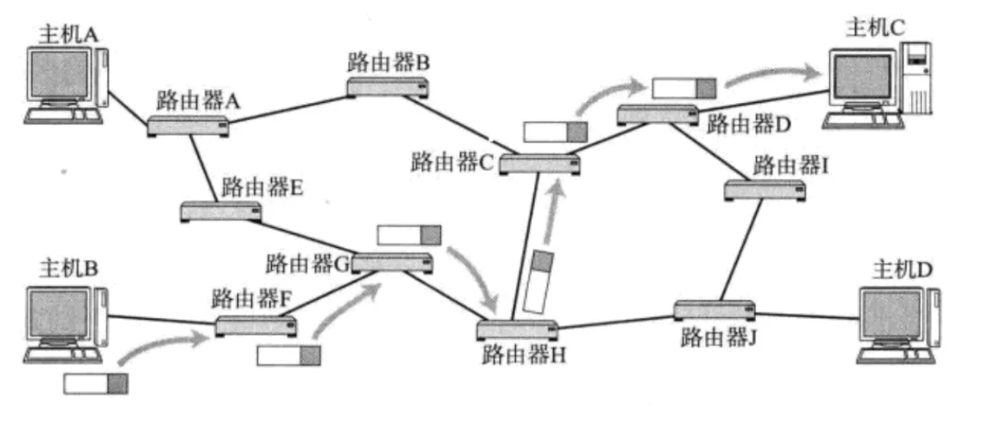 
现在我们已经知道数据可以经过路由选择从主机B跨网络送到主机C，路上有运营商搞的内网，有运营商搞的公网，整个网络按照子网掩码以及运营商划分好的网络区块构建的拓扑结构帮我们进行路由，路由器中配有路由表。整个路由转发的过程我们已经很清楚了。

现在的问题是：要把数据跨网络送到主机C，要先经过路径选择，把数据交给主机B直接相连的下一跳路由器，虽然这个路由器也要进行路由选择，但是在怎么路径选择它也依旧要将路由器中的数据在交付给和它直接相连的下一跳路由器，同理，每一个设备都是如此。所以你要把数据跨网络路径选择送到主机C，你首先要解决的是要先把数据从主机B交给和它直接相连的某一个节点，至于为什么不是路由器E，路由G，因为我们有路径选择。一旦我们选择好了那怎么把数据交给路由器F呢？所以我们就需要有另一个协议了。另外把数据从主机B交给路由器F前提是两者属于同一个网端，同理从某个路由器交给下一跳路由器，两者都需要在同一个网段。

所以你要进行跨网络传输，你要先解决在同一个局域网内将主机B中的数据交给路由器F，然后路由器F在交给路由器G等等。所以**跨网络传输的本质，是无数个局域网(子网)转发的结果！！！** **所以要彻底理解跨网络转发，首先要理解局域网中报文的转发原理！**

---

这里我们首先要有一个共识，在同一个局域网的主机，可以直接通信！

我们在局域网中通信就像在一间教室里，老师叫张三说你昨天作业怎么没交，同一间教室的其他同学都可以听到但是不会反应因为老师叫的是张三，张三听到之后，这不是在叫我吗，站起来说老师我昨天交的晚但是已经交过去了，张三说这句话同一间教室的同学都能听到，但是其他同学也都不会处理这个信息。因为这句话是给老师说的，也就是这句话里面包含的目的名称是老师，所以其他同学一经对比就把这个报文丢弃了，老师听到说那好吧。

在这所公共场所教室里面信的时候，老师认不认为在和张三直接通信呢？当然认为。老师认不认为在和张三一对一直接通信呢？老师认为！

所以实际在局域网看起来两台主机在一对一直接通信，但是其他主机也都会收到，但是经过比对发现不是给我发的，数据链路层就把该报文丢弃。所以看起来就是两台主机在一对一直接通信！

从上面故事我们还可以提出一条消息，**每台主机都要有唯一的标识符**，因为有了这个唯一标识符才能区分这个消息是否是转给我的。

# 以太网帧格式
数据在经过路由选择发现它要去该局域网的出口路由器中，所以它要重新封装MAC帧，那IP就要把报文交给它的下一层以太网遵守的协议MAC帧。
所以IP报文要封装成MAC帧，所以接下来了解MAC帧的报头

以太网的帧格式如下所示：

很明显前面`6 6 2`以及后面4字节属于MAC帧报头，一头一尾夹在中间的数据是有效载荷(IP报头+有效载荷)
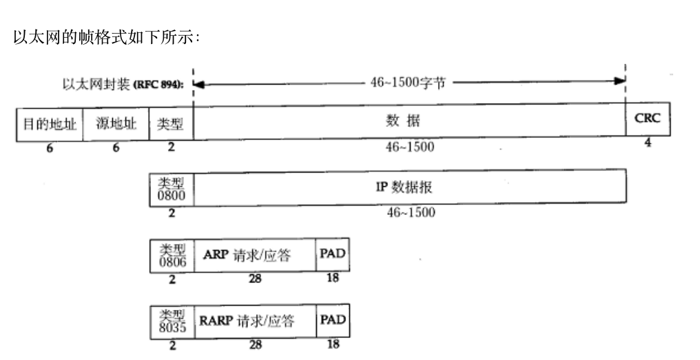

**如何将报头和有效载荷分离？**
MAC帧采用固定大小报头。收到一个MAC帧只需要将前面14字节后面4字节去掉，剩下的就是有效载荷。

**如何分用**
MAC帧有个类型字段，类型是`0800`代表有效载荷是IP数据报、`0806`代表ARP请求/应答 、`8035`代表RARP请求/应答，所以有帧类型就可以区分。

刚才说**每台主机都必须要有唯一标识**，这个标识如何理解？
每台机器至少配一个网卡，每张网卡都要有唯一的一个序列号，这个序列号称为该网卡的MAC地址，这个MAC地址在全球范围内具有唯一性，长度是48位，是在网卡出厂时固化的。源地址和目的地址指的就是网卡的硬件地址(也叫MAC地址)，表示从哪来到哪去。

帧末尾是CRC校验码。

# 重谈局域网转发的原理(基于协议)
现在一个局域网有7台主机，地址从m1到m7，现在m1想把数据发给m8怎么做呢？它一定要自己封装MAC帧。数据上层交付下来到了数据链路层封装MAC帧，  
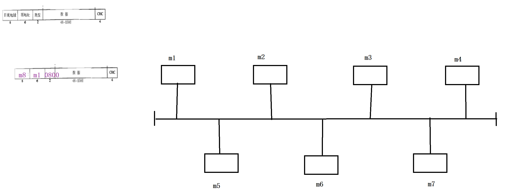 
然后发送到局域网中，问题来了，m2，m3，m4，m5，m6，m7每一台主机都能收到这个MAC帧，**那每一台主机数据链路层要不要接收这个发出去的MAC帧呢**？**要**！每一台主机数据链路层也都要做报头和有效载荷分离，当想向上交付时，首先要确认这个报文是不是要发给自己的，以m2为例，它首先确认这个MAC帧的目的MAC地址，发现是m8，但自己是m2，所以m2在自己的数据链路层直接把该报文丢弃，当丢弃了它也没有向上交付的动作，所以上层也不知道m2曾经收到MAC帧。同理m2，m3，m4，m5，m6都会把帧拿上去然后对比之后发现不是发给自己的都会丢弃。

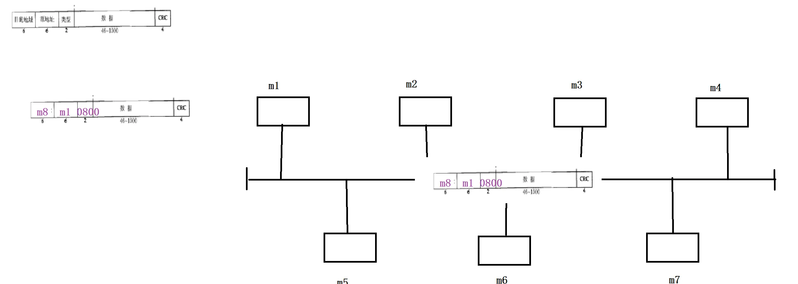

同理m7作为当前局域网中的一台主机，它也会收到这个MAC帧，然后数据链路层做报头和有效载荷分离，然后识别到目的MAC地址是自己，然后根据帧类型把有效载荷向上交付。至此m1给m7发送消息，m7收到了。  
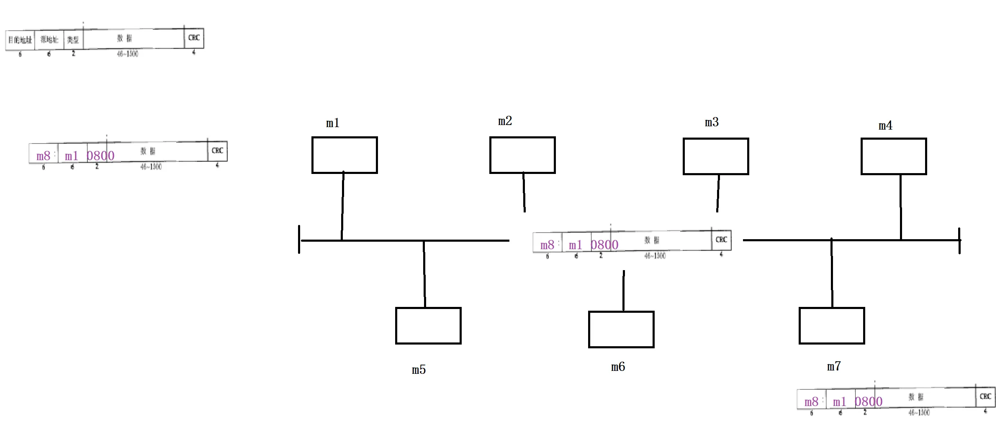  
然后m7向上解包分用直到交付给应用层，应用层处理好之后在向下交付到TCP层，IP层，直到在到数据链路层封装成MAC帧，给m1应答。

---

封装MAC帧之后，同样也是发送到局域网里，同理m1，m2，m3，m4，m5，m6都会收到，除m1之后，其他在数据链路层在报头和有效载荷分离发现目的mac地址不是自己就给扔掉了上层也不知道自己曾经收到了MAC帧。同理m1收到后也做报头和有效载荷分离，对比之后发现目的mac地址是自己，然后就把有效载荷交付给上一层，然后解包分用直到交给应用层，这样m7给m1应答完成。

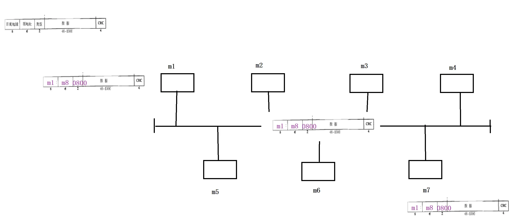  
所以以太网通信原理非常简单，所有的信息其实都会被局域网所有主机收到，只不过绝大部分主机在数据链路层对比目的mac地址发现不是自己，所有主机把数据报文全部丢弃。只有是自己的才会向上交付，至此就完成了局域网通信的一般原理。

## 结论
局域网中所有的主机其实都能收到对应mac，只不过大部分主机在自己的数据链路层通过对比数据帧中的目的mac地址和自己的mac地址是否相等，来决策要不要进行后序处理！

在局域网中网卡有一种模式，称之为**混杂模式**，默认网卡是没有开启混杂模式的，特点：不放弃任何数据帧直接向上交付。这也是大部分局域网抓包工具原理！

一个局域网中，这个网络是被所有主机共享的，所有主机都能够发信息，m1发，m3也可以发，m5也可以发，如果同一时间大家都发就会导致很严重的数据碰撞问题。

所以**在局域网中，任何时刻，只能有一个主机发信息，如果多个消息被同时发送，会导致局域网中的数据发生碰撞，这个数据就成了无效数据。**

那m1发送的，m1如何知道发送碰撞了？m1发送的时候自己也能收到，它发现自己发的和收的不一样，那`CRC`校验通不过，不就是数据发送碰撞了嘛。

> **所以一个局域网，也称为一个碰撞域！**
>

那如何保证在任何一个时刻只允许一个主机发送呢？
不同的局域网标准有不同的实现方案，有一种叫**令牌环**，就好比在局域网中流转一部分令牌数据，只有持有令牌的人才可以发信息。一个主机发信息需要把令牌发送到局域网中转给下一台主机。另一种是**以太网**，发数据如果监测到碰撞了就暂时不发数据等一等，然后在发送。所以重传可不只有tcp，在数据链路层发送碰撞了也要进行重传。这种策略我们称为主机的**碰撞检测和碰撞避免**。

**如何重新看待局域网(以系统角度)**：局域网本质要被该局域网所有主机共享，而为了保证正常通信任何时刻只能有一台主机能够进行通信，所以局域网在我看来就是一种**临界资源**，碰撞检测+碰撞避免，**任何一个时刻只有一台主机能够向临界资源中写入数据**，就是**临界区**！**令牌环**不就是**锁**吗。

那现在有一个问题：
**局域网能不能很大？为什么？**
不能，局域网太大意味着主机很多，也就意味着任何时刻发送碰撞的概率就增加了！

**如果局域网就是很大，有没有办法缓解碰撞概率呢？**
在网络中可以有一种设备叫做**交换机**，工作在数据链路层。
比如m1给m7发送消息，m2同时刻给m6发送消息，在交换机的一侧发生了碰撞，那**交换机能够识别局部性的碰撞，对碰撞数据不做转发**。一旦把这个数据转发过去了那所有主机都识别到数据发生碰撞，然后执行碰撞检测和碰撞避免，所以会影响交换机右侧对应的数据发送。所以交换机识别碰撞了对碰撞数据不转发，但交换机另一侧没有问题，所以另一侧正常发送数据。所以交换机就有效的对碰撞域做了分割。其次如果是交换机一侧在互相发送消息，比如m1给m6发送消息，交换机能够识别出来当前通信的两台主机是我交换机划分碰撞域的左侧，所以**不对正常数据做转发**，也就说不把数据转发到我交换机右侧。也就是说右侧的主机正常通信把，右侧的碰撞概率也就降低了。**交换机的核心工作：划分碰撞域！**

**因为有碰撞域，所以一台主机发送数据的时候，发送数据量长了好，还是短了好？为什么？**
如果发送数据量非常长，这意味在转发的数据在网络的时间很长，发送碰撞概率增大。如果发送数据量很短，一个数据发送很多次，发送碰撞概率也会增大。所以数据帧有一个传输数据大小的范围。规定有效载荷长度最大不超过1500字节。最小不超过46字节（不够MAC帧做填充）。
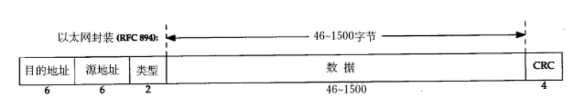 
由于有这个规定，所以导致IP报文可能要分片。

**对比理解MAC地址和IP地址**

+ IP地址描述的是路途总体的**起点**和**终点**
+ MAC地址描述的是路途上的每一个区间的**起点**和**终点**

**主机将数据交付给下一跳(下一跳的是主机还是路由器等其他节点)，前提一定是该数据帧被路由过，因为网络层在数据链路层的上层。**

# 认识MTU
MTU相当于发快递时对包裹尺寸的限制. 这个限制是不同的数据链路对应的物理层, 产生的限制.

+ 以太网帧中的数据长度规定最小46字节,最大1500字节,ARP数据包的长度不够46字节,要在后面补填充位;
+ 最大值1500称为以太网的最大传输单元(MTU),不同的网络类型有不同的MTU;
+ 如果一个数据包从以太网路由到拨号链路上,数据包长度大于拨号链路的MTU了,则需要对数据包进行分片(fragmentation);
+ 不同的数据链路层标准的MTU是不同的;

## MTU对IP协议的影响
由于数据链路层MTU的限制, 对于较大的IP数据包要进行分包.

+ 将较大的IP包分成多个小包, 并给每个小包打上标签;
+ 每个小包IP协议头的 16位标识(id) 都是相同的;
+ 每个小包的IP协议头的3位标志字段中, 第2位置为0, 表示允许分片, 第3位来表示结束标记(当前是否是最后一个小包, 是的话置为1, 否则置为0);
+ 到达对端时再将这些小包, 会按顺序重组, 拼装到一起返回给传输层;
+ 一旦这些小包中任意一个小包丢失, 接收端的重组就会失败. 但是IP层不会负责重新传输数据;

IP报文如何分片和组装，在IP协议我们学过这里不再细说。

现在有一个问题，**是不是只有发送端主机来分片，路上的其他节点(路由器)会不会也对数据做分片呢？**  
有可能！大家用的都是TCP/IP，中间的路由器也是工作在网络层也有分片的能力，可能MTU也有分片的需求。可能发送方主机规定MTU1500，不排除有些路由器MTU规定是500。所以IP报头的16位标识，3位标记，13位片偏移量同样也支持在路上进行分片，然后组装。

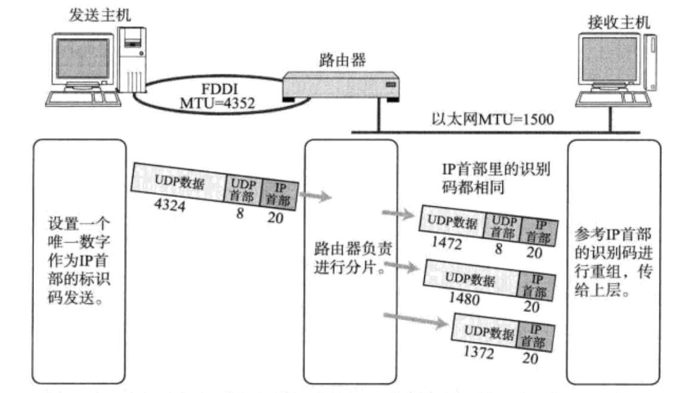

从主机A把数据跨网络送到主机D可能并不是只有一条路径供选择，但是如果主机A在发送数据时将IP报文按1500字节分好片之后，并且将分片后的IP报头中3个标记中第二个标记设为1表示不可分片，在进行转发这些分片的时候，一旦遇到路由器想要在把分片在进行分片的时候，但是我不让它进行分片，那么这个路由器就把这个分片就直接丢弃了，那发送方就要进行超时重传，就要重新进行路径选择，就可能找到一条允许我直接按照1500字节从头发到尾的路径，所以就能找到一个叫做 “**最大吞吐量**” 的路径。 所以，曾经说过IP报头里有一个禁止分片的标记位，这玩意可以在路上确定是否有些路由器抠抠搜搜，这样在这个转发的路上只会选择能够转发1500字节的路由器了。这个标记位是支持我们进行各种路由选择策略之一的选项。

## MTU对UDP协议的影响
+ 一旦UDP携带的数据超过1472(1500 - 20(IP首部) - 8(UDP首部)), 那么就会在网络层分成多个IP数据报.
+ 这多个IP数据报有任意一个丢失, 都会引起接收端网络层重组失败. 那么这就意味着, 如果UDP数据报在网络层被分片, 整个数据被丢失的概率就大大增加了.

## MTU对于TCP协议的影响
在IP协议说过，分片并不好，那如何在进行数据包转发中不要出现分片问题呢？前面说过**IP不能决定单个报文大小**，**真正在网络中决定单个报文大小的是TCP**。那TCP是如何做到减少IP出现分片情况的呢？

MAC规定有效载荷最大不超过1500字节，那IP交给MAC的IP报文：**IP报头+有效载荷 = 1500**，IP标准报头长度20字节，那有效载荷就是1480。这个有效载荷是上层TCP报文：**TCP报头+有效载荷 = 1480**，TCP标准报头长度也是20字节，那有效载荷是1460。

MAC规定有效载荷最大不超过1500字节，所以从根上要从TCP来解决，TCP你自己发送报文时，规定**单个报文有效载荷大小不要超过1460**。这样添加TCP报头，IP报头到MAC帧就不会超过1500。

所以**滑动窗口=min(拥塞窗口，对方接收能力)，那为什么不直接一次打包发送，而是把滑动窗口范围分成多个报文段发送？**

**原因是网络不允许一次发送太大的单个数据段！**

所以这些协议之间会互相影响！  
我们把基于MTU1500字节的规定，最后影响了TCP发送数据时最多发送1460这样的数据报文，我们叫做**MSS**(**最大段尺寸**)，就是TCP它的有效载荷最大是多少。

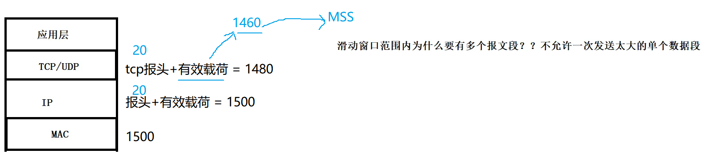

+ TCP的一个数据报也不能无限大, 还是受制于MTU. TCP的单个数据报的最大消息长度, 称为MSS(Max Segment Size);
+ TCP在建立连接的过程中, 通信双方会进行MSS协商.
+ 最理想的情况下, MSS的值正好是在IP不会被分片处理的最大长度(这个长度仍然是受制于数据链路层的MTU).
+ 双方在发送SYN的时候会在TCP头部写入自己能支持的MSS值.
+ 然后双方得知对方的MSS值之后, 选择较小的作为最终MSS.
+ MSS的值就是在TCP首部的40字节变长选项中(kind=2);

MSS和MTU的关系  
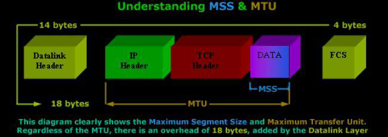  
查看硬件地址(MAC地址)和MTU  
使用ifconfig命令, 即可查看ip地址, mac地址, 和MTU;

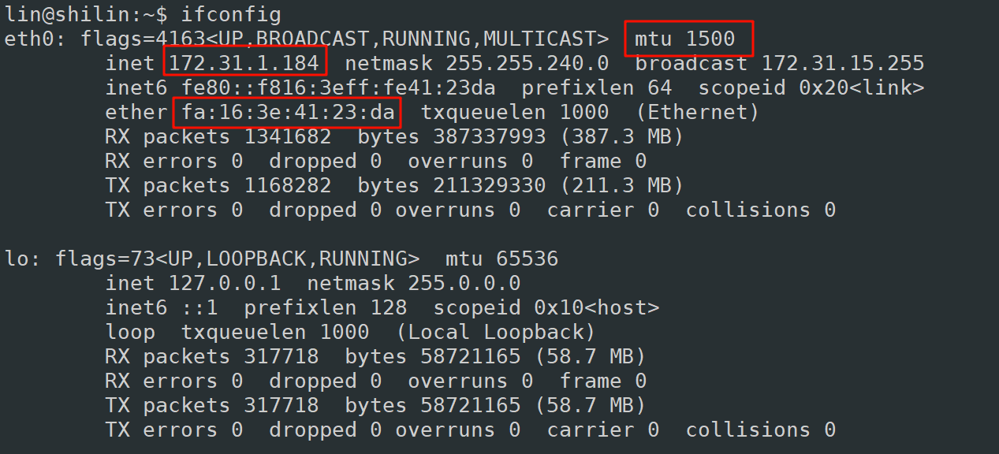

关于MAC帧协议所有内容到此结束。  
我们现在整个网络的思想结构以及建立好了，下面就是对这个结构进行缝缝补补。

在此之前我们结合前面学的知识把整个网络发送过程串一下。然后引出下一个话题。

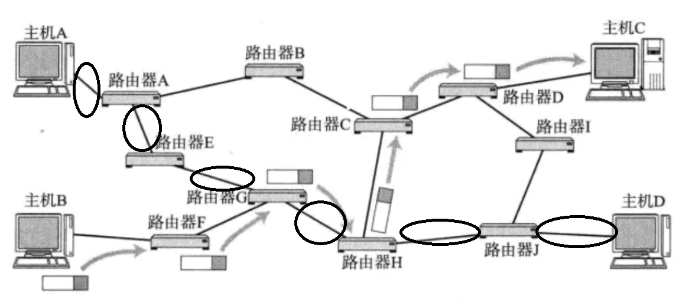

在整个网络发送过程，难道没有发现一个问题吗？把数据从主机A跨网络送到主机D，要经过各种路由选择。但先别跨网络了并且也不能凭空飞过去，网线只要在物理层上，就必须把数据从最上层交给物理层，然后要解决数据从A跨网络到D，要先解决数据从主机A送到路由器A，然后再从路由器A送到路由器E，所以在局部上任何一个主机进行下一跳的时候，它和它下一跳一定属于同一个局域网，所以跨网络通信的本质，不就是在一个一个局域网跳转吗，也正是在一个一个局域网跳转最终才构成了宏观的大的跨网络传输效果。

IP协议的讲张三去清华大学的故事在继续，张三要去清华大学，不断的问，最后问到清华大学门口保安大爷，大爷说这就是清华大学，曾经说过数据经过路由目的是找到目标网络吗？并不是，IP=目标网络+目的主机，所以你要去的其实主机，只不过为了到达主机你要先到达目标网络，现在你已经到达了要去的目标网络的入口路由器处，接下来你问保安大爷，那我现在19号宿舍楼怎么走，大爷说你先这样走在那样走就到了。所以此时数据包千里迢迢把自己送到了另一个子网中的入口路由器处

---

现在要把这个数据包交给这个目标网络中的目标主机了，根据我们所学一定能保证我要去的目标主机一定在对应的子网中，因为我们的网络号是一样的。可是入口路由器要把数据交给和它在同一网段的主机Ｄ，注定了这是一个局域网通信，路由器在自己的网络层拿到该数据报文后，查看路由表发现你要去的主机就在当前局域网，就注定了这个报文**要被封装成MAC帧然后发送给目标主机D**，可是要封装成MAC帧，**我们必须要知道主机D的MAC地址**！可是在前面再说MAC帧的时候我们默认了知道每台主机的MAC帧地址，这是站在上帝视角知道的，可是局域网不止一台机器，你凭什么知道主机D的MAC地址呢？并且从上到下所传的报文里也根本没有主机D的MAC地址！你知道主机D的IP地址！所以你想从你收到的报文中拿是不可能的。一般而言路由器是一定认识主机D的，但是凭什么？所以此时**需要有一个过程，让路由器设备，认识主机D，本质上是获取主机D的MAC地址！** 因为只有知道主机D的MAC地址才能够把我收到的数据包向下封装成MAC帧发送给主机D。

所以路由器凭什么认识和它处在同一个网络其他主机的MAC地址，包括之前说的m1给m7发送消息，凭什么m1就知道m7的mac地址呢？

所以我们此时需要局域网通信的又一种协议，该协议叫做ARP协议！

# ARP协议
虽然我们在这里介绍ARP协议, 但是需要强调, ARP不是一个单纯的数据链路层的协议, 而是一个**介于数据链路层和网络层**之间的协议;

**ARP数据报的格式**  
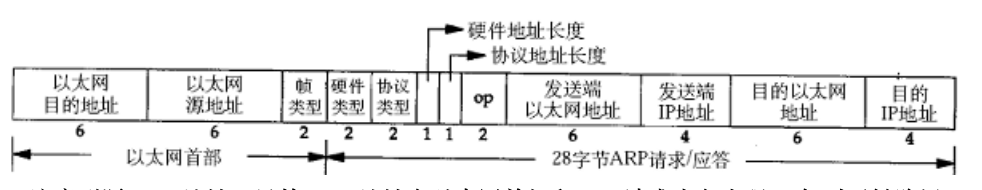

ARP协议是在一个局域网中，对一个陌生的主机，让路由器获取目标主机的MAC地址的协议。

**ARP协议，根据目的IP地址，得到目标主机的MAC地址，获得对方主机的MAC地址之后，在发送MAC帧！**

所以ARP协议的原理是什么呢？还是先讲故事，在画图理解。

假设今天还是在一间教室里，新来的张三老师目前手里就只有同学的学号， 那张三老师不能以后就按照学号叫某个同学，12学，43同学这样叫不合理。张三不想通过学号和同学沟通，想要名字来和同学沟通，所以张三说各位同学现在我念一个学号念到的人站起来把你的名字给我，以后就用名字来和大家沟通。所以张三这样说，10号同学，我是张三，请你把你对应的名字告诉我。所有坐在教室的其他同学也都听到这句话了，只有10号同学站起来说我，老师我是10号，我叫李四。张三听到后在小本本上记录 10：李四，所以就建立了一个学号和姓名的映射关系。从此之后张三就认识了李四。同样张三想知道11号同学名字把刚才的工作在做一遍。有一天校长拿一个奖状上面写着学号为12号同学获得计算机省级一等奖。校长把奖状交给张三老师，让张三老师交给12号同学，张三老师不认识12号同学，没办法只能先问12号同学是谁啊，王五说是我，然后张三老师把奖状给王五了。

在学校层面上管理学生不用名字用的是学号，在教室层面上用的是名字，所以校长拿过来一份奖状这就是数据报文，数据报文只包含目标学生的学号，可是我要在教室里把奖状颁发给某个同学我必须得知道他得名字，所以我首先得在教室里喊一声12号同学是谁啊，王五说12号是他，然后我就知道12号同学得名字，进而把奖状给他。

从刚才得故事我们得到一个简单得结构，当得到一个数据报文想要交给目标主机的时候，我得先做一次根据IP地址得到MAC地址的过程。因为路由器收到一个千里迢迢来的数据报文，路由器只知道这个数据包要去的IP地址，并不清楚目的主机的MAC地址。路由器必须要知道目的主机MAC地址，因为路由器要把IP报文重新封装MAC帧。必须要添加源MAC地址和目的MAC地址，然后将MAC帧交付给目标主机。

下面具体了解**ARP协议工作流程**。

假设主机1是一个路由器，其实它也是一个局域网中的设备，连接一个外网，其中有数据从外网中转发到路由器中。现在路由器收到一个报文，这个报文只包含它要去的目的IP，比如说IP7，可是路由器不一定能认识整个局域网所有主机。所以可能它并不认识IP7，怎么办呢？没关系，路由器在数据链路层封装一个ARP请求，向局域网**广播**一条消息，我是主机1，在座各位谁是IP7，如果你是就把你的MAC地址给我。所有人都收到，但是只有主机7的IP地址是IP7，所有主机7把ARP请求处理之后在响应一个ARP应答，我是主机7，我的IP地址是IP7，我的MAC地址是M7，现在我告诉你了，我就直接发送给路由器。进而路由器知道IP7的MAC地址，然后把IP报文封装成MAC帧发给主机7。

1. ARP请求阶段，先在局域网内广播
2. ARP应答，目标主机一对一发送给请求方主机

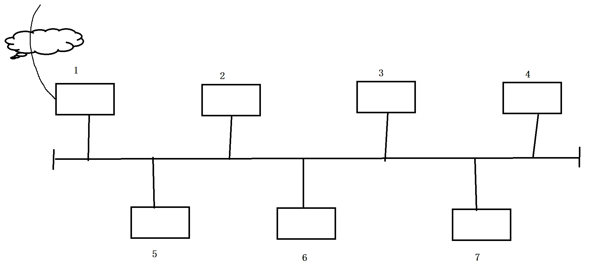

ARP协议是在MAC帧上面的，所以MAC帧有效载荷里面不仅能包含IP数据报文，也能包含ARP请求/应答

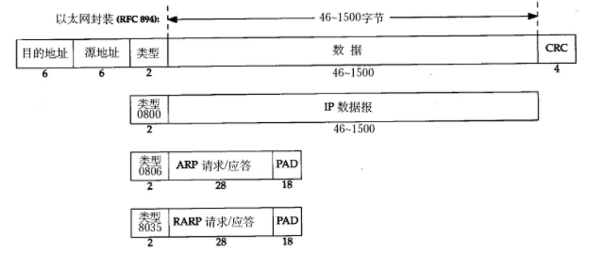

下面具体认识一下**ARP报文的格式**

+ 注意到源MAC地址、目的MAC地址在以太网首部和ARP请求中各出现一次,对于链路层为以太网的情况是多余的,但如果链路层是其它类型的网络则有可能是必要的。
+ 硬件类型指链路层网络类型,1为以太网;
+ 协议类型指要转换的地址类型,0x0800为IP地址;
+ 硬件地址长度对于以太网地址为6字节(MAC地址长度);
+ 协议地址长度对于和IP地址为4字节(IP地址长度);
+ op字段为**1表示ARP请求**,op字段为**2表示ARP应答**。

这里可能会有一些疑惑，为什么会有目的以太网地址，我为什么要发起ARP请求，因为我不知道你的MAC地址是多少，当前不认识，那这个目的以太网地址填多少呢？所以在ARP请求的时候并不知道对方MAC地址，但目的IP地址可以填。目以太网地址没办法填了，但没关系，**可以填充全F**，代表你并不知道对方MAC地址是多少。所以一般用全F表示该字段并为设置概念。

下面结合ARP数据包格式再来理解一下工作流程

ARP上面没有了，MAC帧可能把ARP请求直接交给ARP，也有可能直接把数据帧直接交给IP  
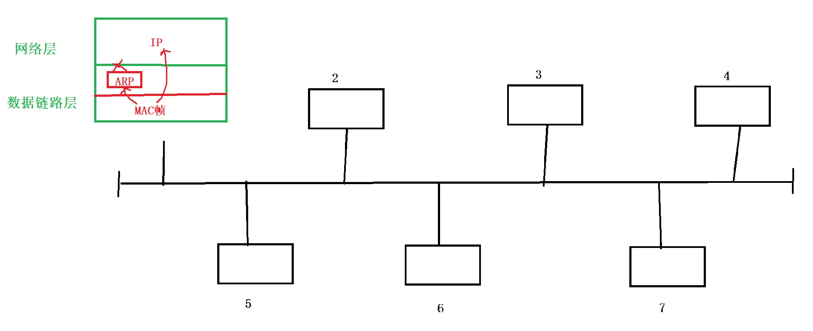

现在一个数据包千里迢迢送到主机1(路由器)，但主机1只知道数据包目的IP是IP7，它想把数据包发送给IP7，可是这个报文向下交付必须要经过MAC帧要重新添加IP7对应的MAC地址，可是目前主机1并不知道IP7的MAC地址。所以上层网络层来发起ARP请求，这个发起仅仅是调用了一下函数，不交给它数据。  
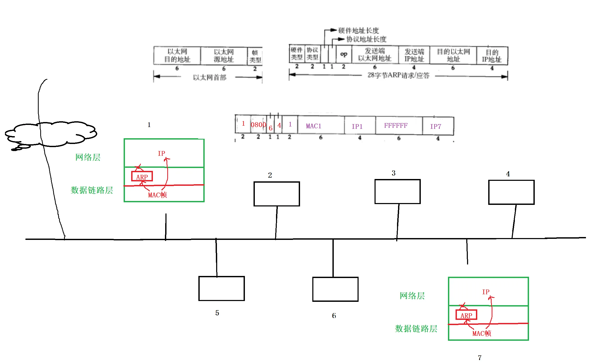  
**构建好ARP请求是把ARP请求直接发送到网络中吗？** 并不是，虽然ARP属于链路层，但是它其实是属于MAC帧协议的上层协议，所以ARP请求发送到局域网中，必须将ARP向下交付到数据链路层的MAC帧协议。添加MAC帧的报头。形成MAC帧然后才能发送到局域网。这才是在网络中发送的ARP请求。  
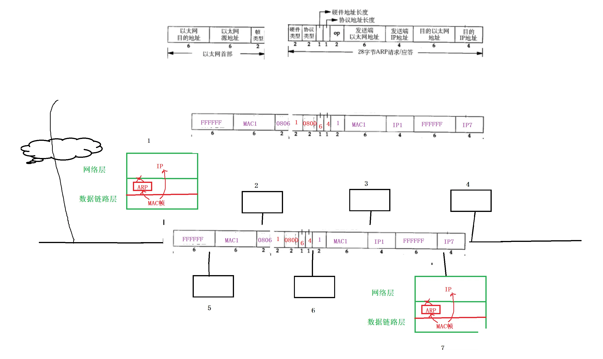

**这个ARP请求最终都会被局域网中的所有主机在MAC帧层全部都要收到， 问题是：收到之后要不要处理报文(解包+向上交付)呢？**  
**要！**，因为这个目标MAC地址是全F，所以所有主机全部都能收到，收到之后这个MAC帧之后，提取MAC报头的目的MAC地址发它是广播的，然后去掉MAC报头，根据帧类型0806向上交付给ARP。所以结论是局域网内所有主机都要处理这个ARP请求！

那交付给ARP之后，**主机要先看ARP数据报那个字段呢？**  
先看目的IP？那就先看目的IP，发现这个目的IP和我自己IP地址不一样，就把这个请求直接丢弃， 我这样干，局域网中所有不是目的IP7的所有主机这样干。在ARP层把这个请求丢弃。  
问题是：主机1可能向主机7发信息，注定主机1要知道主机7MAC地址。主机7未来也可能向主机1发信息，所有主机7也可能要知道主机1的MAC地址。所以主机7也可能向主机1发送ARP请求，所以主机7可能

1. 收到ARP请求
2. 曾经向别人发起过ARP请求，所以别人也可以会主机7进行ARP应答

换句话说，任何一台主机**收到一个ARP，可能是ARP请求，可能是ARP应答**。

我们发现MAC帧协议的设计，ARP请求和应答类型都设计成0806.  
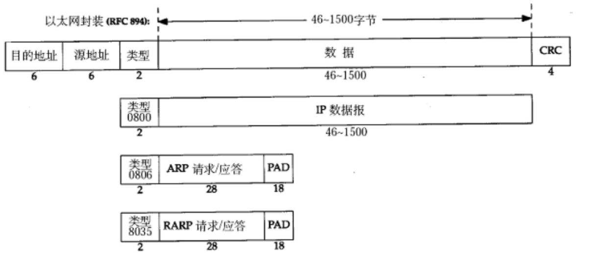

所以先看目的IP主机，你怎么知道这个ARP是请求还是应答？？  
所以先看目的IP不对！任何一台主机在进行**ARP请求**时我们永远都是**先看op，op是1说明是ARP请求，然后再看目的IP，不是我就丢弃。**

所以现在目的IP不是IP7的局域网中所有主机都先看op，发现op是1，说明是ARP请求 ，然后再看目的IP不是我，就直接丢弃。  
主机7数据链路层先收到这个ARP请求，发现目的MAC是广播的，所以报头和有效载荷分离，再看帧类型发现是0806，然后交给ARP。主机7先看op是1，说明是请求，然后看目的IP是IP7，不就是说自己吗，发现MAC1向我发起请求了。接下来就是给MAC1 ARP应答。  
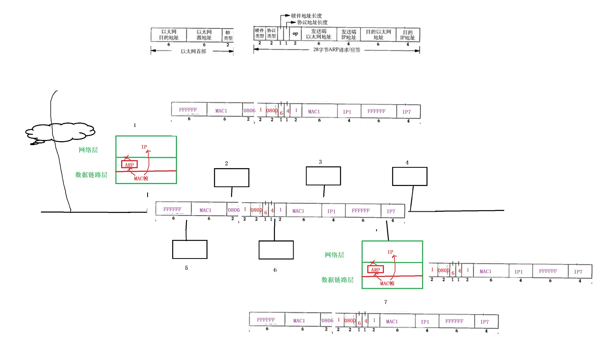

前四个字段不变，op填2表示是ARP应答，发送端MAC地址是我自己MAC7，发收端IP地址也是我IP7，目的以太网地址现在知不知道？当然知道，我现在是在做ARP应答，一定是我曾经收到ARP请求了，而请求的时候对方早已经把它的MAC地址和IP地址给了我，所以目的以太网地址直接填MAC1，目的IP地址直接填IP1。至此构建好一个ARP应答。然后向下交付给数据链路层，添加MAC帧报头，这个时候已经知道给谁应答，知道对方MAC地址，IP地址等其他。直接在MAC帧报头填上即可。这样MAC帧报头就填加好了。然后再发送到局域网中。

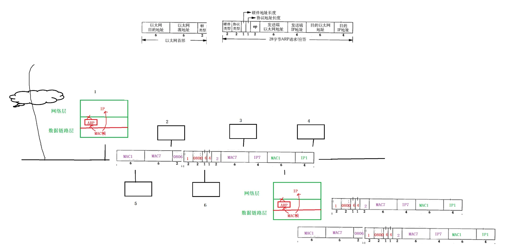  
**这个应答所有主机都能收到吗？都能！收到之后会不会做处理(对报文解析后向上交付)？**  
**不会！**，因为主机在数据链路层判断时发现目的MAC地址不是自己就直接丢弃。最后只有主机1收到了。收到做报头和有效载荷解析，发现目的MAC地址不就是我吗，然后帧类型是0806，然后将有效载荷交给上层ARP。  
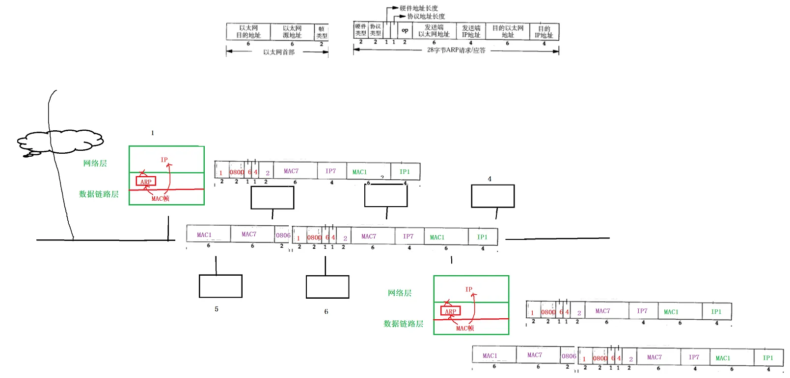

**主机1先看op发现是2，说明是ARP应答，然后直接提取ARP中发送端MAC地址。** 并且这个MAC地址对应的IP地址是IP7。自此主机1就得知了IP7所对应MAC地址是MAC7。自此完成一次ARP请求和响应整个过程。

---

所以ARP协议在整个局域网里，所有主机做法都一样，抓取数据包先看帧类型， 帧类型0806交给ARP，每一个主机在自己ARP层永远只先看op，先确认是请求还是应答，如果是请求并且是给我的就给别人构建ARP响应，否则就丢弃。如果是应答就直接提取发送端以太网地址和发送端IP地址，构建对应关系，就知道对方的MAC和IP地址了。

现在一个主机得到另一个主机的IP和MAC地址，那局域网上所有主机想要互相通信时，在通信之前都可以这样做得到对方MAC地址。

所以回到刚才场景，数据包到达入口路由器主机1，可是入口路由器并不知道IP7的MAC地址是谁，所以进行ARP之后，现在知道IP7对应的MAC地址了，所以自此对IP数据包重新封装成真正的数据帧，帧类型是0800，然后发送给主机7。

---

现在我们在把**整个网络发送拉通一下**：

当一个数据经过路由选择到入口路由器处， 入口路由器只知道目的主机的IP地址，我们能确定的是路由器里面配的有目的网络和子网掩码，而且对应的网络和路由器是直接相连的，拿着目的主机的目的IP和路由器的子网掩码按位与，发现你这个主机一定在这个局域网，可是路由器只知道目的IP，没关系在局域网内ARP找到你的MAC地址，然后封装成数据帧，单向的交给主机D，就完成了找到目标网络和目标主机，数据就可以交付了。  
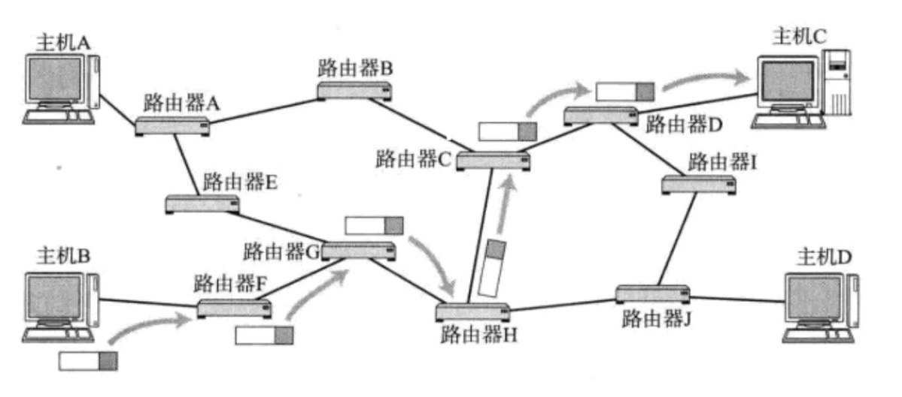

**难道整个网络就只会在最后入口路由器发生吗？**  
刚开始的时候，主机A要把数据交给路由器A，那主机A可能不知道路由器A  
的MAC地址，只知道路由器A的IP地址，所以当主机A想转发一个数据包时，主机Ａ也工作在网络层，也有自己的目的网络和子网掩码，从上面交过来的报文也有自己的目的IP，所以在主机A在自己的路由表查的时候并不认识这个目的IP是谁，但是根据目的IP和子网掩码按位与，对比和自己直连的局域网发现两个目标网络不相等，立马判断我要发送的目的主机和我不再同一个局域网，所以虽然我不知道你在哪，但我知道谁知道，路由器知道。在我的路由表中也配置了下一跳路由IP地址，但是我并不知道路由器的MAC地址，所以封装ARP请求得到路由器的MAC地址，然后封装成MAC帧交给路由器。路由器在转发的时候发现也可能去某个目标网络，找到下一跳路由器，但是也不认识下一跳路由器MAC地址，没关系在路由器和路由器之间也可以ARP找到目标路由器。

**所以ARP过程可以在网络通信过程中，伴随着网络通信一直在进行。**

其次一个局域网顶多上百台机器，只要我有子网掩码那局域网所有可能的IP地址都能构建起来，所以作为一个路由器是不是可以简单粗暴向和我处在同一个局域网所有主机，全部发起ARP请求，最终路由器不就得到了和我之间相连的所有主机的IP地址和MAC地址，所以在路由器中就能够知道周边所有主机的情况。

因为有ARP的存在，所以允许路由器，如果是一堆路由器可以彼此发现，然后结合对应的IP地址构建出更加详细的网络转发路由表结构。

现在我知道主机D对应目标MAC地址了，下一次来的数据包去的还是主机D，**难道每一次都要进行ARP请求吗**？  
ARP过程是一个稍微繁琐的过程，所有并不是，**ARP的结果，会被暂时缓存起来的。** 第一次不认识，进行ARP，第二次直接查缓存表，就找到MAC地址直接发就行了。  
这个缓存，一是暂时，二叫缓存说明可能被丢弃。

每台主机都维护一个ARP缓存表,可以用`arp -a`命令查看。缓存表中的表项有过期时间(一般为20分钟),如果20分钟内没有再次使用某个表项,则该表项失效,下次还要发ARP请求来获得目的主机的硬件地址

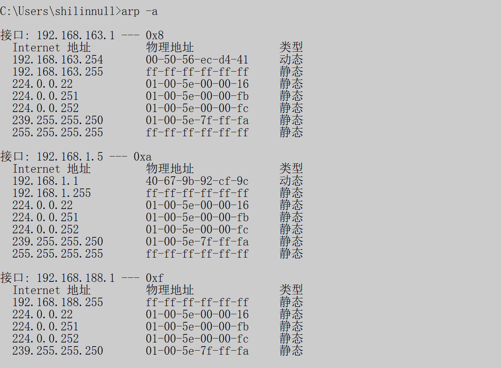

为什么会自动清掉？  
因为局域网中IP地址会变的，可能这个主机你关机了下次重新申请时IP地址就变了，所以IP和MAC地址映射关系就变了。 如果你愿意可能网卡换了那MAC地址也就换了，如果永久性保存ARP缓存，那么这个主机换完网卡就可能永远上不了网了。

其实还有一种情况，**可能我们只知道对方MAC地址，不知道IP地址。**  
**RARP逆地址解析**，一定比ARP更简单，因为已经知道对方MAC地址了，直接给对方发让它把自己的IP地址给我。MAC->IP。

再谈最后一个话题 ，ARP是可以缓存的。主机1要把数据跨网络送到另一台主机，首先要先把数据送到路由器。 ARP缓存会定期更新，并且有一个特点，当**ARP收到多个ARP应答时，ARP会以最新的为主**！

## ARP欺骗
假设今天主机1已经缓存过了知道路由器IP和MAC对应关系了。 现在有一个中间人主机3偷偷摸摸来到这个局域网，主机3伪造了一种ARP应答，ARP没有记忆，它也不知道自己请求多少次，所以主机3直接给主机1直接应答，我是IP4，我的MAC地址是MAC3。IP地址和MAC地址都是一堆数字本身并不能辨别。所以主机3给主机1发送大量的ARP应答。  
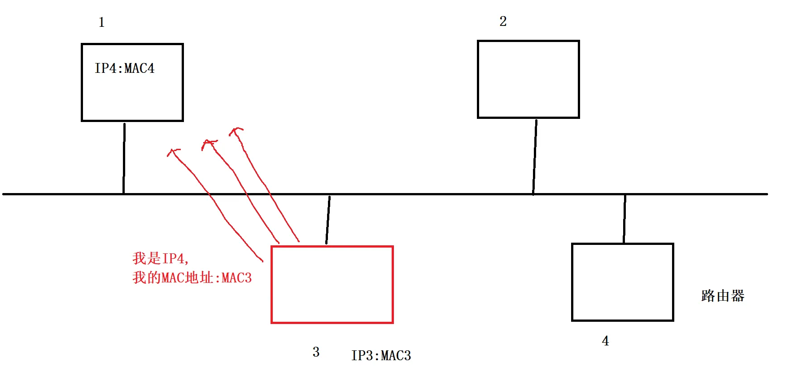  
主机1扛不住了最后就更新了ARP缓存，IP4:MAC3。路由器内部肯定也维护了更多的主机对应的IP地址和MAC地址信息。  
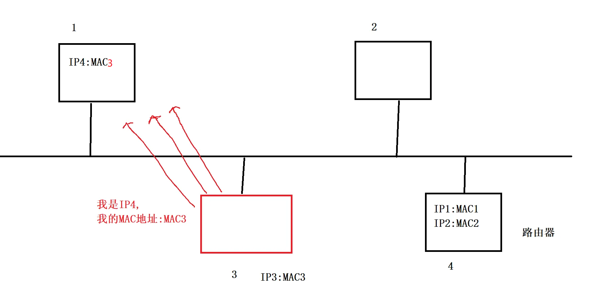  
同理，主机3向路由器发起大量ARP应答，我是IP1，我的MAC地址是MAC3。路由器也扛不住了，也更新了ARP缓存，把IP1对应的MAC1换成MAC3。  
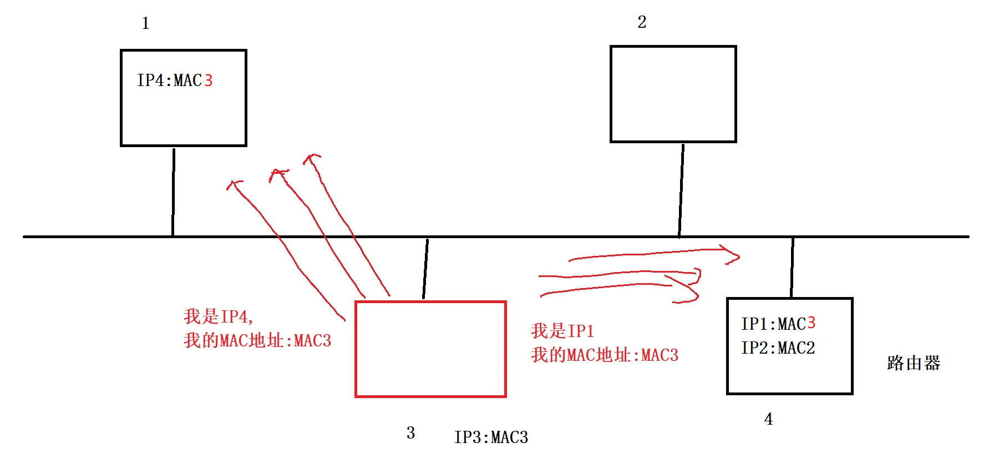  
所以从此往后，主机1想向外网发信息，它把自己的数据发给路由器，它ARP缓存里有对应路由器的IP和MAC对应关系，IP4：MAC3，所以直接在数据链路层封装MAC帧，不过目的MAC变成了MAC3，所以数据直接就交给了中间人主机3  
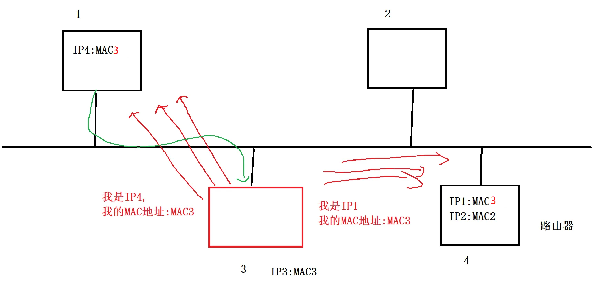  
中间人主机3，冒充主机1，IP地址不变把数据包转发给路由器，  
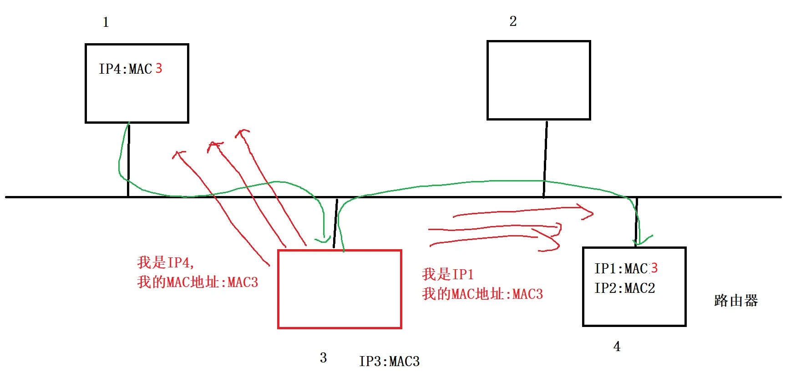  
因为路由器在自己IP层之上包括IP层已经将MAC帧报头去掉了，所以其实在网络层及往上看到的报文完全都是一样的，就好像这个报文直接从主机1过来了。同理当外网来的应答到了路由器发现是要给IP1的，然后查ARP缓存发现IP1：MAC3，所以封装成MAC帧交给主机3，主机3收到报文之后再把报文交给主机1。自此主机收到应答，主机1和路由器就正常通信，因为IP及其以上的报文完全一样。可是它们俩并不知道在局域网中隔墙有耳，有人成功的成为你们两个人的**中间人**，这就叫做**ARP欺骗**。

最后主要图为：

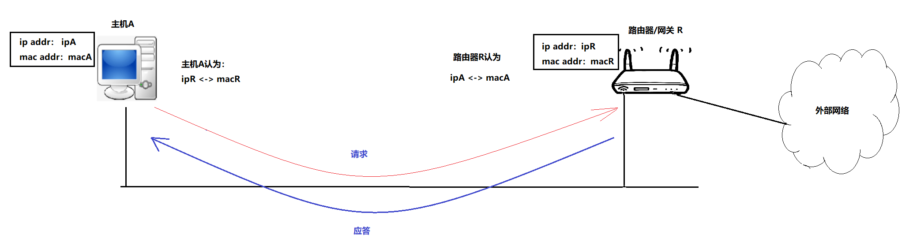

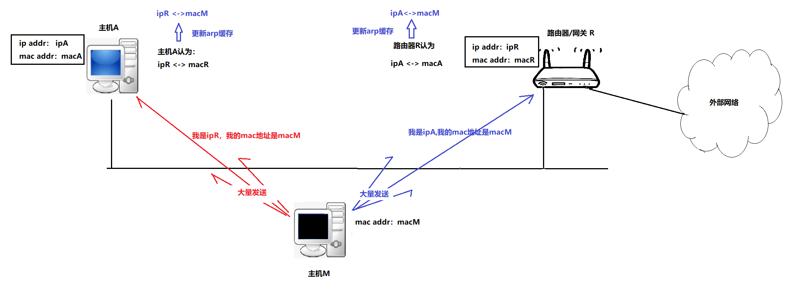

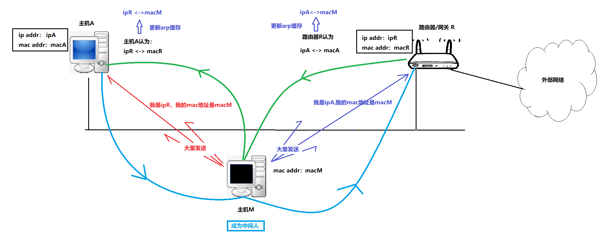

---

所有上层所有的http的数据，各个报文最终不就是发送到网络里的数据帧吗，所有只要把你欺骗了， 最终你所有报文我都能收到，包括http里面的数据。然后中间人当然了篡改了，所以需要有证书，对称密钥，非对称密钥，数字摘要让中间人即便拿到了也没办法。

**现在为止我们已经懂了不同层的有不同的功能就表现出不同特性解决不同的问题，数据链路层+网络层+传输层，下三层组合就已经能保证数据从主机A可靠的跨网络送到主机D，可是送完还不够，还要把数据用起来，所以还需要应用层，根据TCP的端口号交付给应用层，而应用层是以进程为表现形式的，所以就可以做到把一个进程的数据经过网络可靠的转发到另一个主机上特定的进程来完成网络通信的进程间通信原理！** 这就是TCP/IP。

---

TCP/IP是脱胎于OSI七层标准模型的。OSI七层标准定的非常完善！

会话层主要是用来进行连接管理，以前我们在写网络版本计数器套接字的时候，建立好的连接当不通信了上层就把它关了，有没有一种可能连接建立好了但长时间不用，那应用层是不是要自己做一些连接管理。所以连接管理的工作在会话层是需要的，一般由应用层来做，只不过我们没直接做罢了。所以会话层对连接负责我们要需要有的。只不过在TCP/IP没有体现出来，因为由应用层完成。其实表示层我们也曾经学过，什么是固有格式，这不就是自己定义好的协议字段吗，请求request，响应response，然后序列化+反序列化，这不就是表示层吗。当数据反序列化拿到结构化数据之后，然后才在上面应用，针对特定应用的协议完成特定的功能。这叫做应用层。

