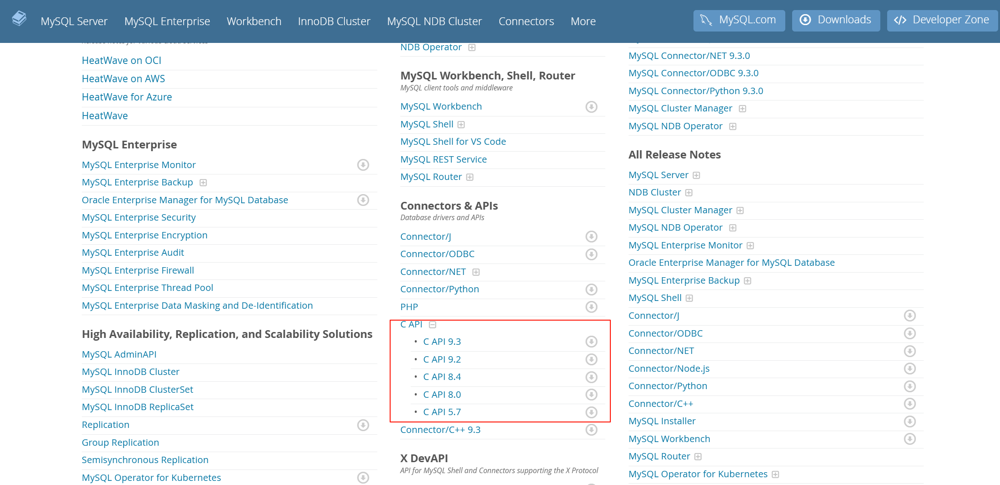

官网下载`mysql`库：[https://dev.mysql.com/downloads/](https://dev.mysql.com/downloads/)

## 版本查看以及编译
通过`mysql_get_client_info()`函数，来验证我们的引入是否成功

```c
#include <iostream>
#include <mysql/mysql.h>

using namespace std;


int main()
{
    printf("mysql client version: %s\n", mysql_get_client_info());
    return 0;
}
```

使用mysql8.0编译

```c
g++ testmysql.cc $(mysql_config --cflags --libs)
```

输出：

```powershell
lin@shilin:~/code-exercise/mysql$ ./a.out 
mysql client version: 8.0.42
```

使用mysql5.7编译

```shell
g++ -o testmysql testmysql.c -L/lib64/mysql -lmysqlclient
```

## mysql接口介绍
## 初始化
```c
MYSQL *mysql_init(MYSQL *mysql);
```

## 链接数据库
```c
MYSQL *mysql_real_connect(MYSQL *mysql,
                   const char *host,
                   const char *user,
                   const char *passwd,
                   const char *db,
                   unsigned int port,
                   const char *unix_socket,
                   unsigned long client_flag)
```

建立好链接之后，获取英文没有问题，如果获取中文是乱码：

设置链接的默认字符集是utf8，原始默认是latin1

```c
mysql_set_character_set(myfd, "utf8");
```

第一个参数 MYSQL是`C api`中一个非常重要的变量（mysql_init的返回值），里面内存非常丰富，有port，dbname，charset等连接基本参数。它也包含了一个叫`st_mysql_methods`的结构体变量，该变量 里面保存着很多函数指针，这些函数指针将会在数据库连接成功以后的各种数据操作中被调用。 `mysql_real_connect`函数中各参数，基本都是顾名思意。

## 下发mysql命令mysql_query
```c
int mysql_query(MYSQL *mysql, const char *q);
```

第一个参数上面已经介绍过，第二个参数为要执行的sql语句,如`select * from table`

## 获取执行结果mysql_store_result
sql执行完以后，如果是查询语句，我们当然还要读取数据，如果update，insert等语句，那么就看下操作成功与否即可。我们来看看如何获取查询结果： 如果mysql_query返回成功，那么我们就通过 `mysql_store_result`这个函数来读取结果。原型如下：

```c
MYSQL_RES *mysql_store_result(MYSQL *mysql);
```

该函数会调用MYSQL变量中的`st_mysql_methods`中的`read_rows`函数指针来获取查询的结果。同时该 函数会返回`MYSQL_RES`这样一个变量，该变量主要用于保存查询的结果。同时该函数malloc了一片内存空间来存储查询过来的数据，所以我们一定要记的`free(result)`，不然是肯定会造成内存泄漏的。 执行完`mysql_store_result`以后，其实数据都已经在`MYSQL_RES`变量中了，下面的api基本就是读取 `MYSQL_RES`中的数据。

## 获取结果行数mysql_num_rows
```c
my_ulonglong mysql_num_rows(MYSQL_RES *res);
```

## 获取结果列数mysql_num_fields
```c
unsigned int mysql_num_fields(MYSQL_RES *res);
```

## 获取列名mysql_fetch_fields
```c
MYSQL_FIELD *mysql_fetch_fields(MYSQL_RES *res);
```

## 获取结果内容mysql_fetch_row
```c
MYSQL_ROW mysql_fetch_row(MYSQL_RES *result);
```

它会返回一个MYSQL_ROW变量，MYSQL_ROW其实就是`char **`。

## 关闭mysql链接mysql_close
```c
void mysql_close(MYSQL *sock);
```

`mysql C api`还支持事务等常用操作

```c
my_bool STDCALL mysql_autocommit(MYSQL * mysql, my_bool auto_mode);
my_bool STDCALL mysql_commit(MYSQL * mysql);
my_bool STDCALL mysql_rollback(MYSQL * mysql);
```

其他接口可以查看官方[文档](https://dev.mysql.com/doc/)



## C语言操作mysql
+ 使用root用户创建数据库

```sql
mysql> create database conn;
```

+ 创建表

```sql
create table user( id bigint primary key auto_increment, 
                  name varchar(32) not null, 
                  age int not nulll, 
                  tel varchar(32) unique 
                 );
```

```sql
mysql> desc user;
+-------+-------------+------+-----+---------+----------------+
| Field | Type        | Null | Key | Default | Extra          |
+-------+-------------+------+-----+---------+----------------+
| id    | bigint      | NO   | PRI | NULL    | auto_increment |
| name  | varchar(32) | NO   |     | NULL    |                |
| age   | int         | NO   |     | NULL    |                |
| tel   | varchar(32) | YES  | UNI | NULL    |                |
+-------+-------------+------+-----+---------+----------------+
```

+ 创建用户

```sql
create user '用户名'@'登陆主机/ip' identified by '密码';
```

+ 给予lsl用户权限

```c
mysql> grant all on conn.* to 'lsl'@'%';
```

+ 刷新一下

```c
flush privileges;
```

### 查看连接数
```cpp
int main()
{
    // 初始化数据库
    MYSQL *my = mysql_init(nullptr);
    if(!my)
    {
        std::cerr << "init mysql error" << std::endl;
        return 1;
    }
    // 连接数据库
    if(!mysql_real_connect(my, host.c_str(), user.c_str(), passwd.c_str(), db.c_str(), port, nullptr, 0))
    {
        std::cerr << "connect MySQL error" << std::endl;
    }

    std::cout << "mysql success" << std::endl;

    sleep(100);

    mysql_close(my);
    return 0;
}
```

+ 在没有使用C语言连接的时候查看链接数

```sql
mysql> show processlist;
+-----+------+-----------+------+---------+------+-------+------------------+
| Id  | User | Host      | db   | Command | Time | State | Info             |
+-----+------+-----------+------+---------+------+-------+------------------+
| 200 | lsl  | localhost | conn | Query   |    0 | init  | show processlist |
+-----+------+-----------+------+---------+------+-------+------------------+
```

+ 使用C语言连接后查看

```sql
mysql> show processlist;
+-----+------+-----------------+------+---------+------+-------+------------------+
| Id  | User | Host            | db   | Command | Time | State | Info             |
+-----+------+-----------------+------+---------+------+-------+------------------+
| 200 | lsl  | localhost       | conn | Query   |    0 | init  | show processlist |
| 201 | lsl  | localhost:50824 | conn | Sleep   |    4 |       | NULL             |
+-----+------+-----------------+------+---------+------+-------+------------------+
```

## 代码样例
```cpp
#include <iostream>
#include <unistd.h>
#include <mysql/mysql.h>

using namespace std;

// const std::string host = "127.0.0.0"; // 默认
const std::string host = "0.0.0.0"; // 这里是我自己修改的
const std::string user = "lsl";
const std::string passwd = "123456";
const std::string db = "conn";
const unsigned int port = 3306;

int main()
{
    // 初始化数据库
    MYSQL *my = mysql_init(nullptr);
    if (!my)
    {
        std::cerr << "init mysql error" << std::endl;
        return 1;
    }

    // 连接数据库
    if (!mysql_real_connect(my, host.c_str(), user.c_str(), passwd.c_str(), db.c_str(), port, nullptr, 0))
    {
        std::cerr << "connect MySQL error" << std::endl;
        return 2;
    }

    std::cout << "mysql success" << std::endl;
    
    // 设置字符集
    mysql_set_character_set(my, "utf8");

    // 插入数据
    std::string sql_insert = "insert into user (name, age, tel) values ('王五', 22, '222222');";
    int n = mysql_query(my, sql_insert.c_str());
    if (!n)
        std::cout << sql_insert << " success!" << std::endl;
    else
    {
        std::cerr << sql_insert << " failed: " << n << std::endl;
        return 3;
    }

    // 修改数据
    std::string sql_update = "update user set name='李四' where id=1;";
    int n = mysql_query(my, sql_update.c_str());
    if (!n)
        std::cout << sql_update << " success!" << std::endl;
    else
    {
        std::cerr << sql_update << " failed: " << n << std::endl;
        return 4;
    }

    // 查询数据
    std::string sql_select = "select * from user;";
    int n = mysql_query(my, sql_select.c_str());
    if (n != 0)
    {
        std::cerr << "mysql_query error: " << mysql_error(my) << std::endl;
        return 5;
    }

    MYSQL_RES *res = mysql_store_result(my);
    if (!res)
    {
        std::cerr << "mysql_store_result error: " << mysql_error(my) << std::endl;
        return 6;
    }

    // 获取行列
    int rows = mysql_num_rows(res);
    int fields = mysql_num_fields(res);
    std::cout << "行：" << rows << std::endl;
    std::cout << "列：" << fields << std::endl;

    // 获取属性
    MYSQL_FIELD *fields_array = mysql_fetch_field(res);
    for (int i = 0; i < fields; i++)
    {
        std::cout << fields_array[i].name << "\t";
    }
    std::cout << "\n";

    // 获取具体元素
    for (int i = 0; i < rows; i++)
    {
        MYSQL_ROW row = mysql_fetch_row(res);
        for (int j = 0; j < fields; j++)
        {
            std::cout << row[j] << "\t";
        }
        std::cout << "\n";
    }

    /* 手动插入数据
    std::string sql;
    while(true)
    {
        std::cout << "MySQL>>> ";
        if(!std::getline(std::cin, sql) || sql == "quit" || sql == "exit")
        {
            std::cout << "Bye Bye~" << std::endl;
            break;
        }
        // 插入数据
        int n = mysql_query(my, sql.c_str());
        if(!n)
            std::cout << sql << "success!" << std::endl;
        else
            std::cerr << sql << "failed: " << n << std::endl;
    }
    */
    mysql_free_result(res); // 不要忘记free
    mysql_close(my);
    return 0;
}

// 版本测试
// int main()
// {
//     printf("mysql client version: %s\n", mysql_get_client_info());
//     return 0;
// }
```


