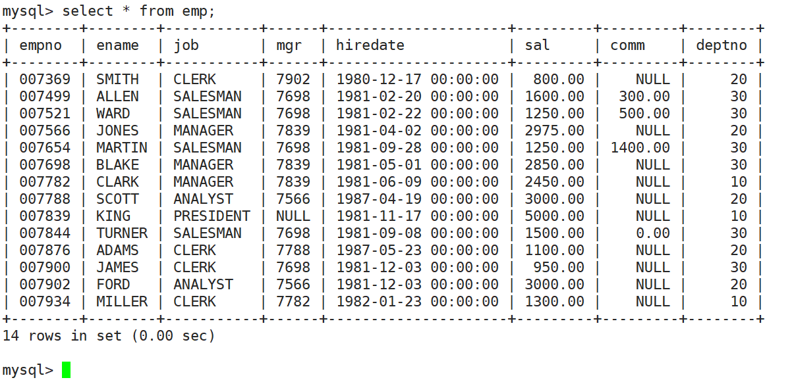
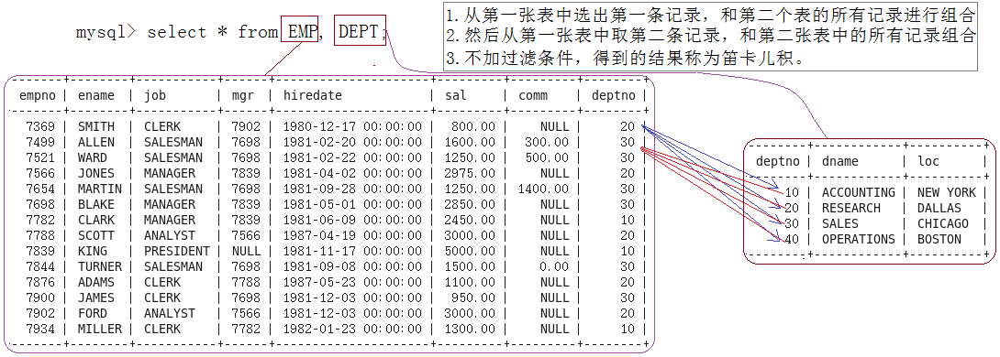

+ 数据库

[scott_data.sql](https://www.yuque.com/attachments/yuque/0/2025/sql/36043961/1749723788718-06bc1007-3f51-4be5-a7c3-f37e73ddef7d.sql)



# 基本查询练习
查询工资高于500或岗位为MANAGER的雇员，同时还要满足他们的姓名首字母为大写的J

```sql
mysql> select * from emp where (sal>500 or job='MANAGER') and ename like 'J%';
+--------+-------+---------+------+---------------------+---------+------+--------+
| empno  | ename | job     | mgr  | hiredate            | sal     | comm | deptno |
+--------+-------+---------+------+---------------------+---------+------+--------+
| 007566 | JONES | MANAGER | 7839 | 1981-04-02 00:00:00 | 2975.00 | NULL |     20 |
| 007900 | JAMES | CLERK   | 7698 | 1981-12-03 00:00:00 |  950.00 | NULL |     30 |
+--------+-------+---------+------+---------------------+---------+------+--------+
2 rows in set (0.00 sec)
```

按照部门号升序而雇员的工资降序排序

```sql

mysql> select deptno, ename, sal from emp order by deptno asc, sal desc;
+--------+--------+---------+
| deptno | ename  | sal     |
+--------+--------+---------+
|     10 | KING   | 5000.00 |
|     10 | CLARK  | 2450.00 |
|     10 | MILLER | 1300.00 |
|     20 | SCOTT  | 3000.00 |
|     20 | FORD   | 3000.00 |
|     20 | JONES  | 2975.00 |
|     20 | ADAMS  | 1100.00 |
|     20 | SMITH  |  800.00 |
|     30 | BLAKE  | 2850.00 |
|     30 | ALLEN  | 1600.00 |
|     30 | TURNER | 1500.00 |
|     30 | WARD   | 1250.00 |
|     30 | MARTIN | 1250.00 |
|     30 | JAMES  |  950.00 |
+--------+--------+---------+
14 rows in set (0.00 sec)

```

使用年薪进行降序排序

```sql
mysql> select ename, sal*12+ifnull(comm,0) as 年薪 from emp order by 年薪 desc;
+--------+----------+
| ename  | 年薪     |
+--------+----------+
| KING   | 60000.00 |
| SCOTT  | 36000.00 |
| FORD   | 36000.00 |
| JONES  | 35700.00 |
| BLAKE  | 34200.00 |
| CLARK  | 29400.00 |
| ALLEN  | 19500.00 |
| TURNER | 18000.00 |
| MARTIN | 16400.00 |
| MILLER | 15600.00 |
| WARD   | 15500.00 |
| ADAMS  | 13200.00 |
| JAMES  | 11400.00 |
| SMITH  |  9600.00 |
+--------+----------+
14 rows in set (0.01 sec)
```

显示工资最高的员工的名字和工作岗位

```sql
mysql> select ename, job, sal from emp where sal=(select max(sal) from emp);
+-------+-----------+---------+
| ename | job       | sal     |
+-------+-----------+---------+
| KING  | PRESIDENT | 5000.00 |
+-------+-----------+---------+
1 row in set (0.00 sec)

```

显示工资高于平均工资的员工信息

```sql
mysql> select ename, sal from emp where sal>(select avg(sal) from emp);
+-------+---------+
| ename | sal     |
+-------+---------+
| JONES | 2975.00 |
| BLAKE | 2850.00 |
| CLARK | 2450.00 |
| SCOTT | 3000.00 |
| KING  | 5000.00 |
| FORD  | 3000.00 |
+-------+---------+
6 rows in set (0.00 sec)
```

显示每个部门的平均工资和最高工资

```sql
mysql> select deptno, format(avg(sal),2) , format(max(sal),2) from emp group by deptno;
+--------+--------------------+--------------------+
| deptno | format(avg(sal),2) | format(max(sal),2) |
+--------+--------------------+--------------------+
|     20 | 2,175.00           | 3,000.00           |
|     30 | 1,566.67           | 2,850.00           |
|     10 | 2,916.67           | 5,000.00           |
+--------+--------------------+--------------------+
3 rows in set (0.00 sec)
```

显示平均工资低于2000的部门号和它的平均工资

```sql
mysql> select deptno, avg(sal) as avg_sal from emp group by deptno having avg_sal<2000;
+--------+-------------+
| deptno | avg_sal     |
+--------+-------------+
|     30 | 1566.666667 |
+--------+-------------+
1 row in set (0.00 sec)
```

显示每种岗位的雇员总数，平均工资

```sql
mysql> select job, count(*) count, format(avg(sal),2) avg_sal from emp group by job;
+-----------+-------+----------+
| job       | count | avg_sal  |
+-----------+-------+----------+
| CLERK     |     4 | 1,037.50 |
| SALESMAN  |     4 | 1,400.00 |
| MANAGER   |     3 | 2,758.33 |
| ANALYST   |     2 | 3,000.00 |
| PRESIDENT |     1 | 5,000.00 |
+-----------+-------+----------+
5 rows in set (0.00 sec)
```

# 多表查询
显示雇员名、雇员工资以及所在部门的名字因为上面的数据来自EMP和DEPT表，因此要联合查询



只要emp表中的`deptno = dept`表中的deptno字段的记录

```sql
mysql> select emp.ename, emp.sal, dept.dname from emp, dept where emp.deptno=dept.deptno;
+--------+---------+------------+
| ename  | sal     | dname      |
+--------+---------+------------+
| SMITH  |  800.00 | RESEARCH   |
| ALLEN  | 1600.00 | SALES      |
| WARD   | 1250.00 | SALES      |
| JONES  | 2975.00 | RESEARCH   |
| MARTIN | 1250.00 | SALES      |
| BLAKE  | 2850.00 | SALES      |
| CLARK  | 2450.00 | ACCOUNTING |
| SCOTT  | 3000.00 | RESEARCH   |
| KING   | 5000.00 | ACCOUNTING |
| TURNER | 1500.00 | SALES      |
| ADAMS  | 1100.00 | RESEARCH   |
| JAMES  |  950.00 | SALES      |
| FORD   | 3000.00 | RESEARCH   |
| MILLER | 1300.00 | ACCOUNTING |
+--------+---------+------------+
14 rows in set (0.00 sec)
```

显示部门号为10的部门名，员工名和工资

```sql
mysql> select dname,ename,sal from emp,dept where emp.deptno=dept.deptno and dept.deptno=10;
+------------+--------+---------+
| dname      | ename  | sal     |
+------------+--------+---------+
| ACCOUNTING | CLARK  | 2450.00 |
| ACCOUNTING | KING   | 5000.00 |
| ACCOUNTING | MILLER | 1300.00 |
+------------+--------+---------+
3 rows in set (0.00 sec)
```

显示各个员工的姓名，工资，及工资级别

```sql
mysql> select ename, sal, grade from emp, salgrade where emp.sal between losal and hisal order by grade asc;
+--------+---------+-------+
| ename  | sal     | grade |
+--------+---------+-------+
| SMITH  |  800.00 |     1 |
| ADAMS  | 1100.00 |     1 |
| JAMES  |  950.00 |     1 |
| WARD   | 1250.00 |     2 |
| MARTIN | 1250.00 |     2 |
| MILLER | 1300.00 |     2 |
| ALLEN  | 1600.00 |     3 |
| TURNER | 1500.00 |     3 |
| JONES  | 2975.00 |     4 |
| BLAKE  | 2850.00 |     4 |
| CLARK  | 2450.00 |     4 |
| SCOTT  | 3000.00 |     4 |
| FORD   | 3000.00 |     4 |
| KING   | 5000.00 |     5 |
+--------+---------+-------+
14 rows in set (0.00 sec)
```

# 自连接
自连接是指在同一张表连接查询

显示员工FORD的上级领导的编号和姓名（mgr是员工领导的编号--empno）

+ 使用的子查询：

```sql
mysql> select empno, ename from emp where emp.empno=(select mgr from emp where ename='FORD');
+--------+-------+
| empno  | ename |
+--------+-------+
| 007566 | JONES |
+--------+-------+
1 row in set (0.00 sec)
```

+ 使用多表查询（自查询）
+ 使用到表的别名
+ from emp leader, emp worker，给自己的表起别名，因为要先做笛卡尔积，所以别名可以先识别

```sql
mysql> select leader.empno, leader.ename from emp leader, emp worker where leader.empno=worker.mgr and worker.ename='FORD';
+--------+-------+
| empno  | ename |
+--------+-------+
| 007566 | JONES |
+--------+-------+
1 row in set (0.00 sec)
```

# 子查询
子查询是指嵌入在其他sql语句中的select语句，也叫嵌套查询

## 单行子查询
返回一行记录的子查询

显示SMITH同一部门的员工

```sql
mysql> select * from emp where deptno=(select deptno from emp where ename='SMITH');
+--------+-------+---------+------+---------------------+---------+------+--------+
| empno  | ename | job     | mgr  | hiredate            | sal     | comm | deptno |
+--------+-------+---------+------+---------------------+---------+------+--------+
| 007369 | SMITH | CLERK   | 7902 | 1980-12-17 00:00:00 |  800.00 | NULL |     20 |
| 007566 | JONES | MANAGER | 7839 | 1981-04-02 00:00:00 | 2975.00 | NULL |     20 |
| 007788 | SCOTT | ANALYST | 7566 | 1987-04-19 00:00:00 | 3000.00 | NULL |     20 |
| 007876 | ADAMS | CLERK   | 7788 | 1987-05-23 00:00:00 | 1100.00 | NULL |     20 |
| 007902 | FORD  | ANALYST | 7566 | 1981-12-03 00:00:00 | 3000.00 | NULL |     20 |
+--------+-------+---------+------+---------------------+---------+------+--------+
5 rows in set (0.00 sec)
```

## 多行子查询
in关键字；查询和10号部门的工作岗位相同的雇员的名字，岗位，工资，部门号，但是不包含10自己的

```sql
mysql> select ename, job, sal, deptno from emp where job in (select distinct job from emp where deptno=10) and deptno<>10;
+-------+---------+---------+--------+
| ename | job     | sal     | deptno |
+-------+---------+---------+--------+
| SMITH | CLERK   |  800.00 |     20 |
| JONES | MANAGER | 2975.00 |     20 |
| BLAKE | MANAGER | 2850.00 |     30 |
| ADAMS | CLERK   | 1100.00 |     20 |
| JAMES | CLERK   |  950.00 |     30 |
+-------+---------+---------+--------+
5 rows in set (0.00 sec)
```

查询和10号部门的工作岗位相同的雇员的名字，岗位，工资，部门号，但是不包含10自己的，并且知道对应员工属于哪一个部门

```sql
mysql> select ename, job, sal, dname 
->from dept, (select ename, job, sal, deptno 
            ->from emp wheree job 
            ->in (select distinct job from emp where deptno=10) and deptno<>10) as tmp 
->where dept.deptno=tmp.deptno;
+-------+---------+---------+----------+
| ename | job     | sal     | dname    |
+-------+---------+---------+----------+
| ADAMS | CLERK   | 1100.00 | RESEARCH |
| JONES | MANAGER | 2975.00 | RESEARCH |
| SMITH | CLERK   |  800.00 | RESEARCH |
| JAMES | CLERK   |  950.00 | SALES    |
| BLAKE | MANAGER | 2850.00 | SALES    |
+-------+---------+---------+----------+
5 rows in set (0.00 sec)
```

all关键字；显示工资比部门30的所有员工的工资高的员工的姓名、工资和部门号

```sql
mysql> select ename, sal, deptno from emp where sal > all(select sal from emp where deptnoo=30);
+-------+---------+--------+
| ename | sal     | deptno |
+-------+---------+--------+
| JONES | 2975.00 |     20 |
| SCOTT | 3000.00 |     20 |
| KING  | 5000.00 |     10 |
| FORD  | 3000.00 |     20 |
+-------+---------+--------+
4 rows in set (0.00 sec)

```

any关键字；显示工资比部门30的任意员工的工资高的员工的姓名、工资和部门号（包含自己部门的员工）

```sql
mysql> select ename, sal, deptno from emp where sal > any(select sal from emp where deptnoo=30);
+--------+---------+--------+
| ename  | sal     | deptno |
+--------+---------+--------+
| ALLEN  | 1600.00 |     30 |
| WARD   | 1250.00 |     30 |
| JONES  | 2975.00 |     20 |
| MARTIN | 1250.00 |     30 |
| BLAKE  | 2850.00 |     30 |
| CLARK  | 2450.00 |     10 |
| SCOTT  | 3000.00 |     20 |
| KING   | 5000.00 |     10 |
| TURNER | 1500.00 |     30 |
| ADAMS  | 1100.00 |     20 |
| FORD   | 3000.00 |     20 |
| MILLER | 1300.00 |     10 |
+--------+---------+--------+
12 rows in set (0.00 sec)
```

## 多列子查询
单行子查询是指子查询只返回单列，单行数据；多行子查询是指返回单列多行数据，都是针对单列而言的，而多列子查询则是指查询返回多个列数据的子查询语句

查询和SMITH的部门和岗位完全相同的所有雇员，不含SMITH本人

```sql
mysql> select ename 
-> from emp 
-> where (deptno, job)=(select deptno, job from emp where ename='SMITH') and ename<>'SMITH';
+-------+
| ename |
+-------+
| ADAMS |
+-------+
1 row in set (0.00 sec)
```

## 在from子句中使用子查询
显示每个高于自己部门平均工资的员工的姓名、部门、工资、平均工资

```sql
mysql> select ename, deptno, sal, format(avg_sal, 2) avg_sal 
  ->from emp,(select avg(sal) avg_sall, deptno dt from emp group by deptno) tmp 
  ->where emp.sal>tmp.avg_sal and emp.deptno=tmp.dt;

+-------+--------+---------+----------+
| ename | deptno | sal     | avg_sal  |
+-------+--------+---------+----------+
| FORD  |     20 | 3000.00 | 2,175.00 |
| SCOTT |     20 | 3000.00 | 2,175.00 |
| JONES |     20 | 2975.00 | 2,175.00 |
| BLAKE |     30 | 2850.00 | 1,566.67 |
| ALLEN |     30 | 1600.00 | 1,566.67 |
| KING  |     10 | 5000.00 | 2,916.67 |
+-------+--------+---------+----------+
6 rows in set (0.00 sec)
```

显示每个高于自己部门平均工资的员工的姓名、部门、工资、平均工资，办公地点

```sql
mysql> select t1.ename, dept.loc, t1.deptno 
->from dept, (select ename, emp.deptno 
            ->from emp, (select deptno,avg(sal) avg_sal from emp group by deptno) tmp 
            ->where emp.deptno=tmp.deptno and emp.sal>tmp.avg_sal
            ->) t1 
-> where t1.deptno=dept.deptno;
+-------+----------+--------+
| ename | loc      | deptno |
+-------+----------+--------+
| ALLEN | CHICAGO  |     30 |
| JONES | DALLAS   |     20 |
| BLAKE | CHICAGO  |     30 |
| SCOTT | DALLAS   |     20 |
| KING  | NEW YORK |     10 |
| FORD  | DALLAS   |     20 |
+-------+----------+--------+
6 rows in set (0.00 sec)
```

查找每个部门工资最高的人的姓名、工资、部门、最高工资

```sql
mysql> select emp.ename, emp.sal, emp.deptno, max_sal  
->from emp, (select deptno, max(sal) max_sal from emp group by deptno) tmp 
->where emp.deptno=tmp.deptno and emp.sal=tmp.max_sal;
+-------+---------+--------+---------+
| ename | sal     | deptno | max_sal |
+-------+---------+--------+---------+
| BLAKE | 2850.00 |     30 | 2850.00 |
| SCOTT | 3000.00 |     20 | 3000.00 |
| KING  | 5000.00 |     10 | 5000.00 |
| FORD  | 3000.00 |     20 | 3000.00 |
+-------+---------+--------+---------+
4 rows in set (0.00 sec)
```

显示每个部门的信息（部门名，编号，地址）和人员数量

+ 方法1：使用多表

```sql
mysql> select dept.dname, dept.deptno, dept.loc, count(*) sum 
-> from emp,dept 
-> where emp.deptno=ddept.deptno 
-> group by dept.dname, dept.deptno, dept.loc;
+------------+--------+----------+-----+
| dname      | deptno | loc      | sum |
+------------+--------+----------+-----+
| RESEARCH   |     20 | DALLAS   |   5 |
| SALES      |     30 | CHICAGO  |   6 |
| ACCOUNTING |     10 | NEW YORK |   3 |
+------------+--------+----------+-----+
3 rows in set (0.00 sec)
```

+ 方法2：使用子查询

```sql
mysql> select dname, dept.deptno, loc, sum 
-> from dept,(select count(*) sum,deptno from emp grouup by deptno) tmp 
-> where dept.deptno=tmp.deptno;
+------------+--------+----------+-----+
| dname      | deptno | loc      | sum |
+------------+--------+----------+-----+
| ACCOUNTING |     10 | NEW YORK |   3 |
| RESEARCH   |     20 | DALLAS   |   5 |
| SALES      |     30 | CHICAGO  |   6 |
+------------+--------+----------+-----+
3 rows in set (0.00 sec)

```

## 合并查询
在实际应用中，为了合并多个select的执行结果，可以使用集合操作符 union，union all

### union
该操作符用于取得两个结果集的并集。当使用该操作符时，会自动去掉结果集中的重复行。

将工资大于2500或职位是MANAGER的人找出来

```sql
mysql> select ename, sal, job from emp where sal>2500 
-> union select ename, sal, job from emp where job='MANAGER';
+-------+---------+-----------+
| ename | sal     | job       |
+-------+---------+-----------+
| JONES | 2975.00 | MANAGER   |
| BLAKE | 2850.00 | MANAGER   |
| SCOTT | 3000.00 | ANALYST   |
| KING  | 5000.00 | PRESIDENT |
| FORD  | 3000.00 | ANALYST   |
| CLARK | 2450.00 | MANAGER   |
+-------+---------+-----------+
6 rows in set (0.00 sec)
```

### union all
该操作符用于取得两个结果集的并集。当使用该操作符时，不会去掉结果集中的重复行。

将工资大于25000或职位是MANAGER的人找出来

```sql
mysql> select ename, sal, job from emp where sal>2500 
-> union all  select ename, sal, job fromemp where job='MANAGER';
+-------+---------+-----------+
| ename | sal     | job       |
+-------+---------+-----------+
| JONES | 2975.00 | MANAGER   |
| BLAKE | 2850.00 | MANAGER   |
| SCOTT | 3000.00 | ANALYST   |
| KING  | 5000.00 | PRESIDENT |
| FORD  | 3000.00 | ANALYST   |
| JONES | 2975.00 | MANAGER   |
| BLAKE | 2850.00 | MANAGER   |
| CLARK | 2450.00 | MANAGER   |
+-------+---------+-----------+
8 rows in set (0.00 sec)
```

# 表的内连和外连
## 内连接
内连接实际上就是利用where子句对两种表形成的笛卡儿积进行筛选，我们前面学习的查询都是内连接，也是在开发过程中使用的最多的连接查询。

语法：

```sql
select 字段 from 表1 inner join 表2 on 连接条件 and 其他条件；
```

+ 前面学习的都是内连接
+ 前面学的写法：

```sql
mysql> select ename, dname 
->from emp, dept 
->where emp.deptno=dept.deptno and ename='SMITH';
+-------+----------+
| ename | dname    |
+-------+----------+
| SMITH | RESEARCH |
+-------+----------+
1 row in set (0.00 sec)
```

+ 标准写法

```sql
mysql> select ename, dname 
->from emp inner join dept on 
->emp.deptno=dept.deptno and ename='SMITH';
+-------+----------+
| ename | dname    |
+-------+----------+
| SMITH | RESEARCH |
+-------+----------+
1 row in set (0.00 sec)
```

## 外连接
## 左外连接
如果联合查询，左侧的表完全显示我们就说是左外连接。

语法：

```sql
select 字段名 from 表名1 left join 表名2 on 连接条件
```

案例：

```sql
mysql> create table stu (id int, name varchar(30));
Query OK, 0 rows affected (0.08 sec)

mysql> insert into stu values(1,'jack'),(2,'tom'),(3,'kity'),(4,'nono');
Query OK, 4 rows affected (0.01 sec)
Records: 4  Duplicates: 0  Warnings: 0

mysql> create table exam (id int, grade int);
Query OK, 0 rows affected (0.04 sec)

mysql> insert into exam values(1, 56),(2,76),(11, 8);
Query OK, 3 rows affected (0.00 sec)
Records: 3  Duplicates: 0  Warnings: 0
```

+ 查询所有学生的成绩，如果这个学生没有成绩，也要将学生的个人信息显示出来
+ 当左边表和右边表没有匹配时，也会显示左边表的数据

```sql
mysql> select * from stu left join exam on stu.id=exam.id;
+------+------+------+-------+
| id   | name | id   | grade |
+------+------+------+-------+
|    1 | jack |    1 |    56 |
|    2 | tom  |    2 |    76 |
|    3 | kity | NULL |  NULL |
|    4 | nono | NULL |  NULL |
+------+------+------+-------+
4 rows in set (0.00 sec)
```

## 右外连接
如果联合查询，右侧的表完全显示我们就说是右外连接。

语法：

```sql
select 字段 from 表名1 right join 表名2 on 连接条件；
```

案例：

对stu表和exam表联合查询，把所有的成绩都显示出来，即使这个成绩没有学生与它对应，也要显示出来

```sql
mysql> select * from stu right join exam on stu.id=exam.id;
+------+------+------+-------+
| id   | name | id   | grade |
+------+------+------+-------+
|    1 | jack |    1 |    56 |
|    2 | tom  |    2 |    76 |
| NULL | NULL |   11 |     8 |
+------+------+------+-------+
3 rows in set (0.00 sec)
```

+ 练习

列出部门名称和这些部门的员工信息，同时列出没有员工的部门

方法一：

```sql
mysql> select d.dname, e.* from dept d left join emp e on d.deptno=e.deptno;
+------------+--------+--------+-----------+------+---------------------+---------+---------+--------+
| dname      | empno  | ename  | job       | mgr  | hiredate            | sal     | comm    | deptno |
+------------+--------+--------+-----------+------+---------------------+---------+---------+--------+
| ACCOUNTING | 007934 | MILLER | CLERK     | 7782 | 1982-01-23 00:00:00 | 1300.00 |    NULL |     10 |
| ACCOUNTING | 007839 | KING   | PRESIDENT | NULL | 1981-11-17 00:00:00 | 5000.00 |    NULL |     10 |
| ACCOUNTING | 007782 | CLARK  | MANAGER   | 7839 | 1981-06-09 00:00:00 | 2450.00 |    NULL |     10 |
| RESEARCH   | 007902 | FORD   | ANALYST   | 7566 | 1981-12-03 00:00:00 | 3000.00 |    NULL |     20 |
| RESEARCH   | 007876 | ADAMS  | CLERK     | 7788 | 1987-05-23 00:00:00 | 1100.00 |    NULL |     20 |
| RESEARCH   | 007788 | SCOTT  | ANALYST   | 7566 | 1987-04-19 00:00:00 | 3000.00 |    NULL |     20 |
| RESEARCH   | 007566 | JONES  | MANAGER   | 7839 | 1981-04-02 00:00:00 | 2975.00 |    NULL |     20 |
| RESEARCH   | 007369 | SMITH  | CLERK     | 7902 | 1980-12-17 00:00:00 |  800.00 |    NULL |     20 |
| SALES      | 007900 | JAMES  | CLERK     | 7698 | 1981-12-03 00:00:00 |  950.00 |    NULL |     30 |
| SALES      | 007844 | TURNER | SALESMAN  | 7698 | 1981-09-08 00:00:00 | 1500.00 |    0.00 |     30 |
| SALES      | 007698 | BLAKE  | MANAGER   | 7839 | 1981-05-01 00:00:00 | 2850.00 |    NULL |     30 |
| SALES      | 007654 | MARTIN | SALESMAN  | 7698 | 1981-09-28 00:00:00 | 1250.00 | 1400.00 |     30 |
| SALES      | 007521 | WARD   | SALESMAN  | 7698 | 1981-02-22 00:00:00 | 1250.00 |  500.00 |     30 |
| SALES      | 007499 | ALLEN  | SALESMAN  | 7698 | 1981-02-20 00:00:00 | 1600.00 |  300.00 |     30 |
| OPERATIONS |   NULL | NULL   | NULL      | NULL | NULL                |    NULL |    NULL |   NULL |
+------------+--------+--------+-----------+------+---------------------+---------+---------+--------+
15 rows in set (0.00 sec)
```

方法二：

```sql
mysql> select d.dname, e.* from emp e right join dept d on d.deptno=e.deptno;
+------------+--------+--------+-----------+------+---------------------+---------+---------+--------+
| dname      | empno  | ename  | job       | mgr  | hiredate            | sal     | comm    | deptno |
+------------+--------+--------+-----------+------+---------------------+---------+---------+--------+
| ACCOUNTING | 007934 | MILLER | CLERK     | 7782 | 1982-01-23 00:00:00 | 1300.00 |    NULL |     10 |
| ACCOUNTING | 007839 | KING   | PRESIDENT | NULL | 1981-11-17 00:00:00 | 5000.00 |    NULL |     10 |
| ACCOUNTING | 007782 | CLARK  | MANAGER   | 7839 | 1981-06-09 00:00:00 | 2450.00 |    NULL |     10 |
| RESEARCH   | 007902 | FORD   | ANALYST   | 7566 | 1981-12-03 00:00:00 | 3000.00 |    NULL |     20 |
| RESEARCH   | 007876 | ADAMS  | CLERK     | 7788 | 1987-05-23 00:00:00 | 1100.00 |    NULL |     20 |
| RESEARCH   | 007788 | SCOTT  | ANALYST   | 7566 | 1987-04-19 00:00:00 | 3000.00 |    NULL |     20 |
| RESEARCH   | 007566 | JONES  | MANAGER   | 7839 | 1981-04-02 00:00:00 | 2975.00 |    NULL |     20 |
| RESEARCH   | 007369 | SMITH  | CLERK     | 7902 | 1980-12-17 00:00:00 |  800.00 |    NULL |     20 |
| SALES      | 007900 | JAMES  | CLERK     | 7698 | 1981-12-03 00:00:00 |  950.00 |    NULL |     30 |
| SALES      | 007844 | TURNER | SALESMAN  | 7698 | 1981-09-08 00:00:00 | 1500.00 |    0.00 |     30 |
| SALES      | 007698 | BLAKE  | MANAGER   | 7839 | 1981-05-01 00:00:00 | 2850.00 |    NULL |     30 |
| SALES      | 007654 | MARTIN | SALESMAN  | 7698 | 1981-09-28 00:00:00 | 1250.00 | 1400.00 |     30 |
| SALES      | 007521 | WARD   | SALESMAN  | 7698 | 1981-02-22 00:00:00 | 1250.00 |  500.00 |     30 |
| SALES      | 007499 | ALLEN  | SALESMAN  | 7698 | 1981-02-20 00:00:00 | 1600.00 |  300.00 |     30 |
| OPERATIONS |   NULL | NULL   | NULL      | NULL | NULL                |    NULL |    NULL |   NULL |
+------------+--------+--------+-----------+------+---------------------+---------+---------+--------+
15 rows in set (0.00 sec)
```

