# 一、MySql的介绍
## 1. 什么是数据库？
+ 啥事数据库，和数据结构有什么关系？
    - 数据结构是一门学科，研究了数据如何组织~~
    - 对于少量的数据，不需要组织，如果是大量的数据，就得好好组织起来。以便后续进行`增删改查`！
+ 数据库，是一类软件，这个软件就是用来组织/保存/管理数据的。  
组织这些数据也是为了后续的`增删改查`~~
+ 数据库被实现的过程中，也应用到了很多的数据结构！！！

## 2. 常见的数据库软件：
1. oracle（数据库圈子里的带头大哥！！！）（也就是甲骨文）
2. MySQL （当前使用最广泛的数据库）
3. SQLSever（微软搞的一个数据库）
4. SQLite（轻量级数据库）  
上面说的数据库都有一个统称`关系型数据库`
+ 关系型数据库，对于数据库中的数据格式，要求比较严格~~
+ 非关系型数据库，代表的软件有：redis,MongoDB,HBase（功能相比于关系型数据库要少一些，但是性能更高，同时更适合当下大数据分布式，这样的时代背景）

## 3. MySql重要学啥？
1. SQL编程语言：
+ 通过SQL来完成对数据库数据的增删改查~~，不同的数据库软件，肯对于sql的语法支持的略有差异，但是整体都是一样的。
2. 数据库背后的一些典型原理（面试题）
3. 通过java代码来操作数据库【至关重要】

## 4. MySql用什么来操作？
mysql主要使用命令行来操作的，市面上也存在很多的图形化界面的程序~~

mysql中文数据库软件，是一个“客户端服务器”结构的程序~~  
一组重要的概念：

> 客户端（Client）  
服务器（Server）  
请求（Request）：客户端给服务器发的数据，就是请求  
响应（Response）：服务器返回给客户端的数据，就是响应
>

在安装mysql的时候，其实同时安装了mysql的服务器和mysql的客户端（这两程序都在你的电脑上）

+ 服务器：在服务里可以查看


+ 客户端：在开始菜单的时候可以看到


+ 点击客户端后，出现这个界面，就成功了，这个时候就需要你输入密码进行登录


+ mysql的客户端和服务器通过网络进行通信！！！
+ 客户端和服务器可以在同一个主机上（现在大家使用的是）
+ 也可以在不同的主机上（以后工作中基本是这个情况）

有的时候开始菜单没有这两个界面：

+ 可以直接在cmd里输入mysql命令启动也行
+ 客户端本体是这个mysql命令
+ 开始菜单里只不过是这个命令的快捷方式~~


数据是存储到客户端还是服务器上的呢？  
服务器~~，服务器是mysql的本体！！！重要性和复杂程度，远远超过客户端的，客户端是非常简单的，也有各种形态

mysql具体是使用啥样的硬件设备来保存的呢？  
mysql其他的关系型数据库，都是使用**硬盘**来保存数据的~~

**重要的知识点！！！**

内存和外存（硬盘）区别，对于程序设计，有深远的影响！

1. 内存访问速度快，外存访问速度慢，速度能差3~4个数量级！！
2. 内存的空间比较小，外存的空间更大
3. 内存陈本贵，外存成本便宜！
4. 内存的数据断电后会丢失，外存的数据，断电后数据还在
+ 内存存储的数据是**易失**的
+ 外存存储的数据是**持久**的  
“持久化”这样的词，意思就是把数据写在硬盘上

数据库的本体：

+ 数据库本体是**服务器**，服务器使用硬盘来存储管理数据~~  
上述硬盘的特点，在数据库这里也是成立的

## 6. 数据库服务器如何组织数据？
数据库服务器如何组织数据的？

1. mysql服务器为了更好的组织数据，把上面的数据逻辑上划分出了很多个数据集合
2. 每个数据库里，使用“表”这样的结构来组织数据  
其中的表就相当于excel表格，有很多行，每一行有很多列，最上面一行是表头（描述每一个列是啥意思）
3. 每个表里有很多条记录，每个记录也就是易行（record）
4. 每一行这路又有很多列，每个列（column）也称为一个字段（field）

## 7. mysql是什么服务器结构的？
MySQL是一个客户端服务器的结构程序！！同时服务器是数据库的本体（数据是在服务器这里组织和存储的）

数据是在服务器是如何组织的呢？

数据库（逻辑上的数据集合）->  
数据表->  
有很多行->  
每一行是一个“记录”->  
针对每一行，还有很多列，每一列称为一个字段

## 8. 使用MySql客户端
后续的sql都是通过自带的mysql客户端来进行编写的

+ 在安装的时候，有一个环节，让你设置密码~~

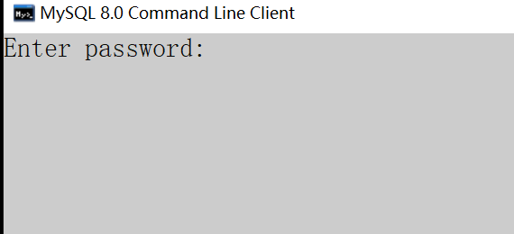

如果看到这一段就代表成功了  
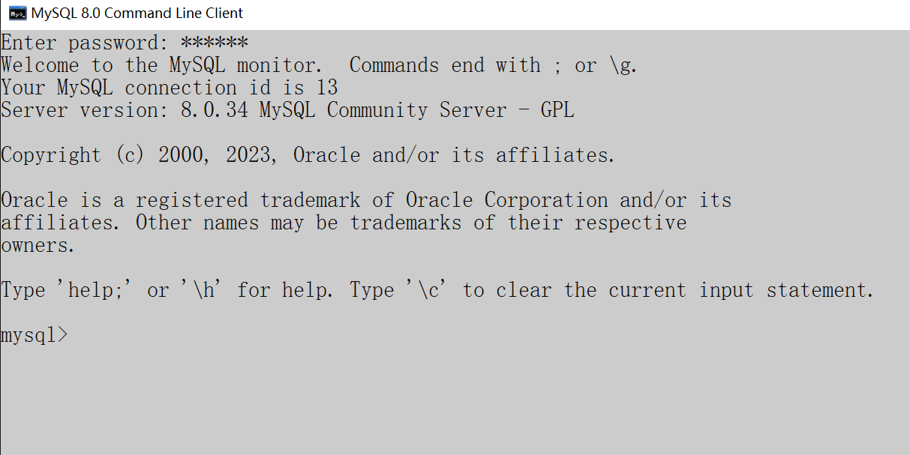

如果输入密码后就闪退了，闪退的原因有很多种，那么我们可以这样查看闪退原因

+ 打开cmd

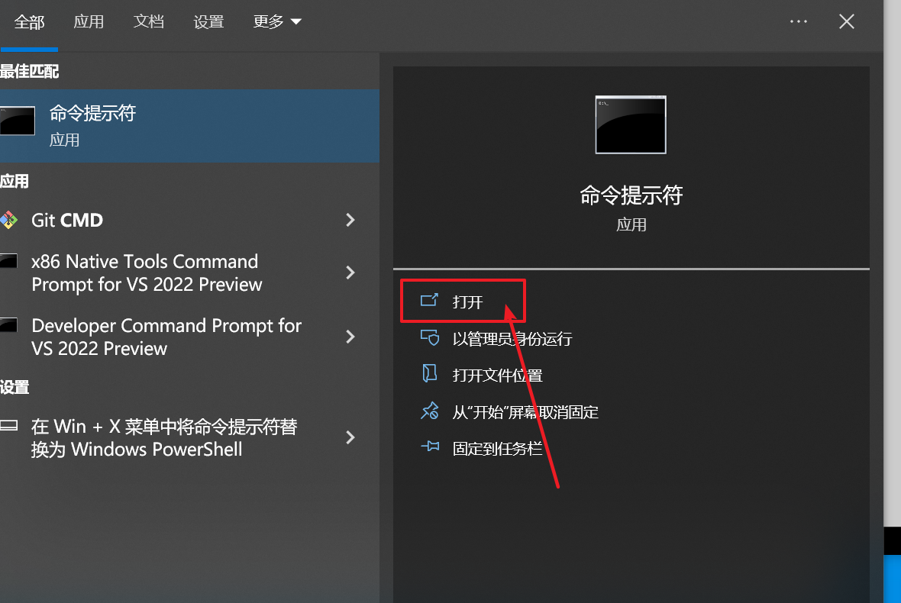

+ 打开安装mysql路径的位置

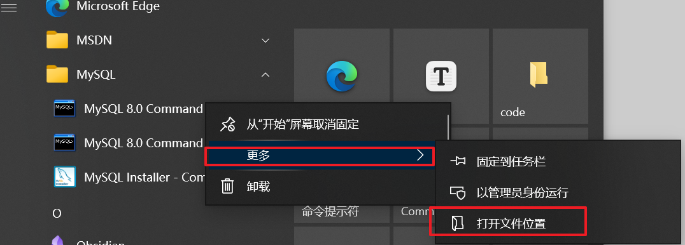

+ 将图标拖进去后回车，会提示输入密码

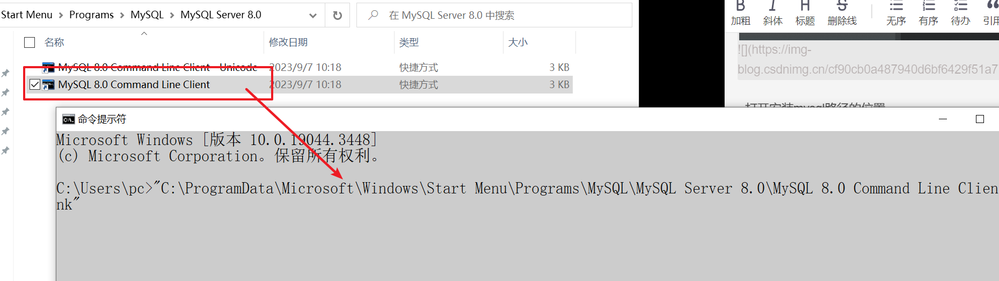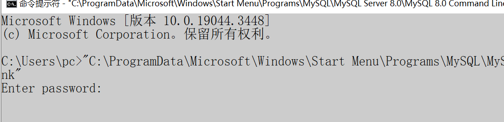

+ 如果提示这个就是密码错误了（定位为题，查看报错信息）
+ 其中`Access denied`就是访问被拒绝，原因基本就是密码错了（密码设置的太复杂了，输入就容易错，或者字母大小写，英文中文标点，numlock...）

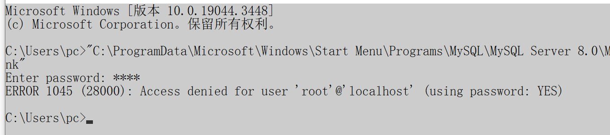

+ 另一个典型的问题，服务器没有启动


+ 在服务这里可以启动


# 二、Ubuntu 20.04安装MySql
需要使用`root`用户安装：

1. 首先更新软件包索引运行 sudo apt update 命令。
2. 然后运行`sudo apt install mysql-server`安装MySQL服务器。
3. 安装完成后，MySQL服务将作为systemd服务自动启动。
4. 输入如下命令进行检验是否安装mysql成功：`sudo netstat -tap | grep mysql`

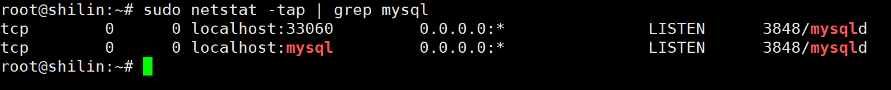

<font style="color:rgb(77, 77, 77);">使用命令查看mysql数据库自动设置的随机账户与密码</font>

```shell
sudo cat /etc/mysql/debian.cnf
```

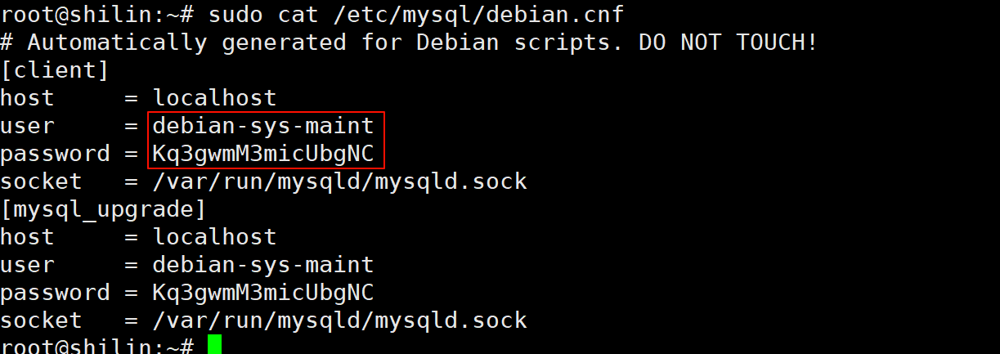

然后就可以使用这组账户和密码进行登录

```shell
mysql -udebian-sys-maint -p
```

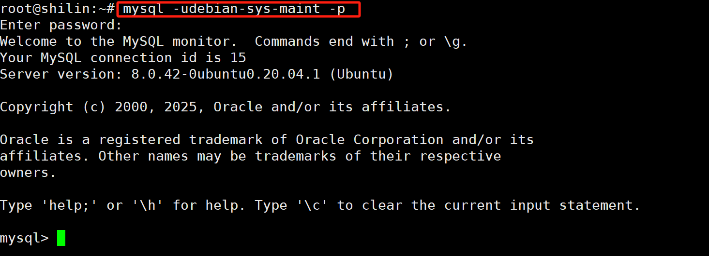

## 修改成免密码登录
```shell
sudo vim /etc/mysql/mysql.conf.d/mysqld.cnf
```

<font style="color:rgb(77, 77, 77);">找到</font><font style="color:rgb(243, 59, 69);">[mysqld]</font>

<font style="color:rgb(77, 77, 77);">添加如下内容：</font>

```bash
skip-grant-tables
```

<font style="color:rgb(77, 77, 77);">保存退出后重启mysql服务</font>

```bash
service mysql restart
```

<font style="color:rgb(77, 77, 77);">登录mysql</font>

```css
mysql -uroot -p
```

## <font style="color:rgb(79, 79, 79);">修改mysql用户密码</font>
1. <font style="color:rgb(77, 77, 77);">切换数据库</font>

```bash
use mysql
```

2. <font style="color:rgb(77, 77, 77);">修改root用户密码</font>

<font style="color:rgb(77, 77, 77);">MySql从8.0开始修改密码有了变化，在</font>`<font style="color:rgb(77, 77, 77);">user</font>`<font style="color:rgb(77, 77, 77);">表加了字段</font>`<font style="color:rgb(77, 77, 77);">authentication_string</font>`<font style="color:rgb(77, 77, 77);">，修改密码前先检查</font>`<font style="color:rgb(77, 77, 77);">authentication_string</font>`<font style="color:rgb(77, 77, 77);">是否为空</font>

<font style="color:rgb(77, 77, 77);">如果不为空，先置空字段在修改密码</font>

1. 将字段置为空
2. 修改密码为123456

```sql
update user set authentication_string='' where user='root';
```

<font style="color:rgb(77, 77, 77);">如果为空，则直接修改密码、 修改密码为123456</font>

```sql
alter user 'root'@'localhost' identified with mysql_native_password by '123456';
```

<font style="color:rgb(77, 77, 77);">如果出现下列错误：</font>

```sql
ERROR 1290 (HY000): The MySQL server is running with the --skip-grant-tables option so it cannot execute this statement
```

<font style="color:rgb(77, 77, 77);">这是由于你上面如果用的第二种方法设置绕过密码登录，这时root用户是无密码状态，会报这个错误，这时，先执行</font>

```sql
flush privileges;
```

<font style="color:rgb(77, 77, 77);">然后再执行修改密码命令就行了</font>

```sql
alter user 'root'@'localhost' identified with mysql_native_password by '123456';      --修改密码为123456
```

---

通过`which`命令查看

1. `mysql`是数据库的客户端
2. `mysqld`是数据库的服务端
3. `mysql`本质是基于`C(mysql)``S(mysqld)`模式的一种网络服务


既然是网络服务就能查看绑定的


mysql是一套给我提供数据存取的服务的网络程序

> 数据库一般指的是：在磁盘或者内存中存储的特定结构组织的数据，将来在磁盘上存储的一套数据库方式
>

+ 数据库服务-->mysqld

一般的文件确实提供了数据的存储功能，但是文件并没有提供非常好的数据管理能力(用户角度)

**数据库本质：对数据内容存储的一套解决方案，你给我字段或者要求，我直接给你结果就行**

---

数据库文件是在这个目录下`/var/lib/mysql`，

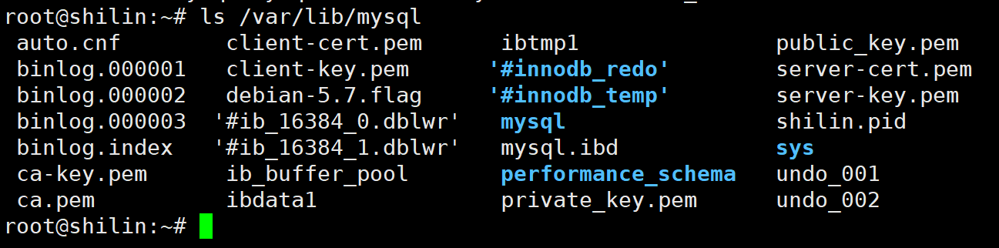

在创建出一个数据库后，发现在这里面多了一个文件夹

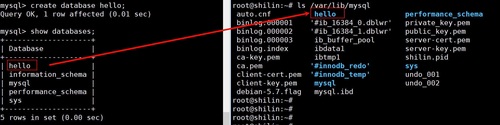

首先`use hello;`然后创建表`create table student( id int, name varchar(32), gender varchar(2) );`

向表里插入数据：

`insert into student (id, name, gender) values (1, '张三', '男');`

在创建出表后，在目录下多出一个文件

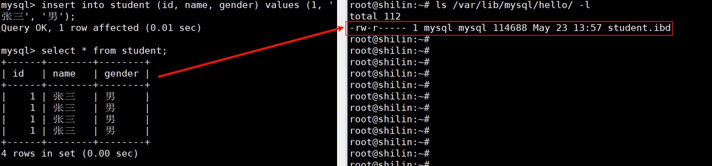

相反，如果在`/var/lib/mysql`这个目录下创建新目录，那么在查看数据库也是可以看到的！（但是这样做是非常不合理的！！！）

结论：

1. 建立数据库，本质就是`Linux`下的一个目录。
2. 在数据库内建立表，本质就是在`Linux`下创建对应的文件即可！
3. 数据库本质其实也是文件，只不过这些文件并不由程序员直接操作，而是由数据库服务帮我们进行操作。

以上工作是谁做的？`mysqld`服务帮我们做的！

