# 数值类型
| 类型 | 大小 | 范围（有符号） | 范围（无符号） | 用途 |
| :--- | :--- | :--- | :--- | :--- |
| TINYINT | 1 Bytes | (-128，127) | (0，255) | 小整数值 |
| SMALLINT | 2 Bytes | (-32 768，32 767) | (0，65 535) | 大整数值 |
| MEDIUMINT | 3 Bytes | (-8 388 608，8 388 607) | (0，16 777 215) | 大整数值 |
| INT或INTEGER | 4 Bytes | (-2 147 483 648，2 147 483 647) | (0，4 294 967 295) | 大整数值 |
| BIGINT | 8 Bytes | (-9,223,372,036,854,775,808，9 223 372 036 854 775 807) | (0，18 446 744 073 709 551 615) | 极大整数值 |
| FLOAT | 4 Bytes | (-3.402 823 466 E+38，-1.175 494 351 E-38)，0，(1.175 494 351 E-38，3.402 823 466 351 E+38) | 0，(1.175 494 351 E-38，3.402 823 466 E+38) | 单精度 浮点数值 |
| DOUBLE | 8 Bytes | (-1.797 693 134 862 315 7 E+308，-2.225 073 858 507 201 4 E-308)，0，(2.225 073 858 507 201 4 E-308，1.797 693 134 862 315 7 E+308) | 0，(2.225 073 858 507 201 4 E-308，1.797 693 134 862 315 7 E+308) | 双精度 浮点数值 |
| DECIMAL | 对DECIMAL(M,D) ，如果M>D，为M+2否则为D+2 | 依赖于M和D的值 | 依赖于M和D的值 | 小数值 |


## tinyint类型
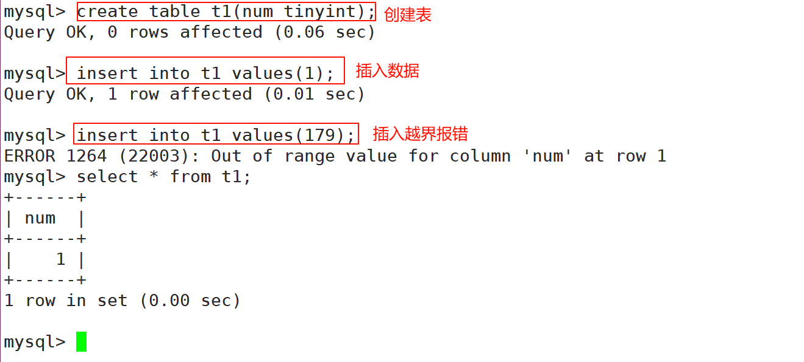

说明：

+ 在MySQL中，整型可以指定是有符号的和无符号的，默认是有符号的。
+ 可以通过`unsigned`来说明某个字段是无符号的

例如：

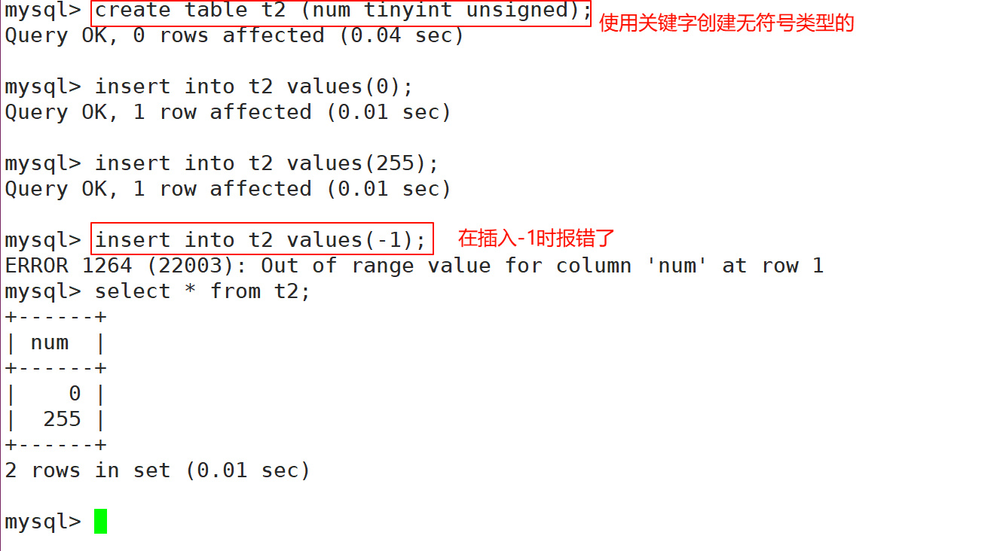

注意：尽量不使用`unsigned`，还不如设计时，将int类型提升为`bigint`类型。

## bit类型
基本语法：

```sql
bit[(M)] : 位字段类型。M表示每个值的位数，范围从1到64。如果M被忽略，默认为1。
```

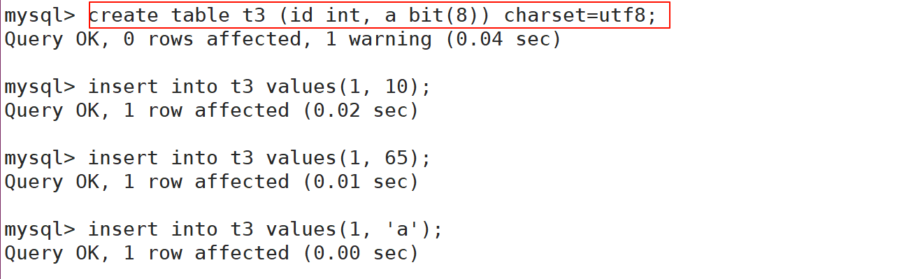

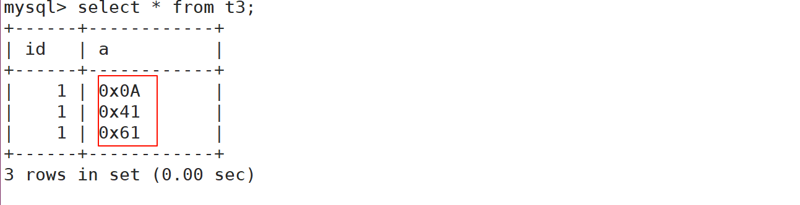

如果我们有这样的值，只存放0或1，这时可以定义bit(1)。这样可以节省空间。

## 小数类型
语法：

```sql
float[(m, d)] [unsigned] : M指定显示长度，d指定小数位数，占用空间4个字节
```

小数：float(4,2)表示的范围是-99.99 ~ 99.99，MySQL在保存值时会进行四舍五入。

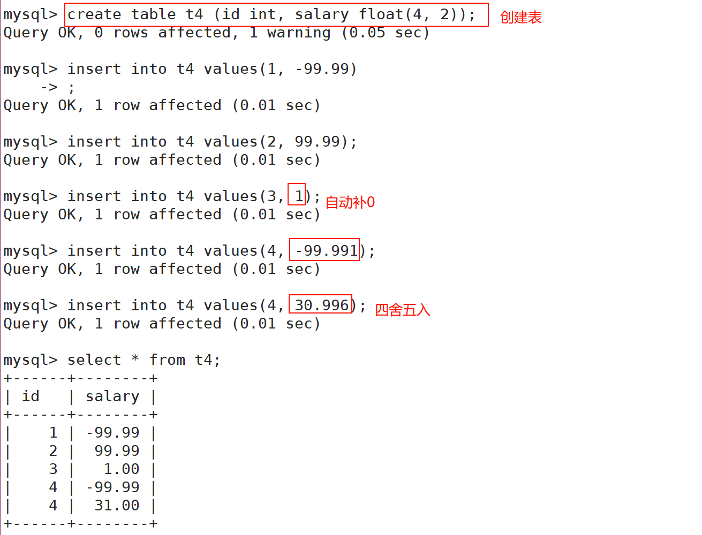

+ 如果为无符号的

例如：

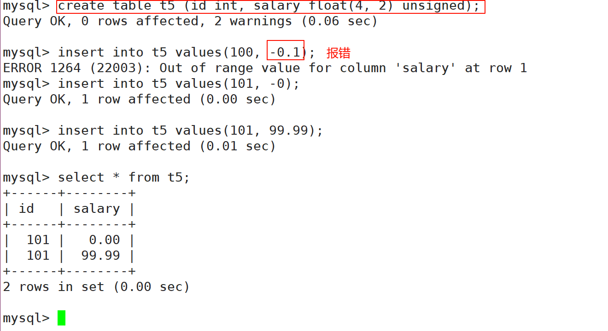

## decimal
语法：

```sql
decimal(m, d) [unsigned] : 定点数m指定长度，d表示小数点的位数
```

+ decimal(5,2) 表示的范围是 -999.99 ~ 999.99
+ decimal(5,2) unsigned 表示的范围 0 ~ 999.99
+ decimal和float很像，但是有区别：
    - float和decimal表示的精度不一样

例如：

```sql
create table t6 (id int, salary float(10, 8), salary2 decimal(10, 8));
```

+ 发现`decimal`的精度更准确，因此如果我们希望某 个数据表示高精度，选择`decimal`。

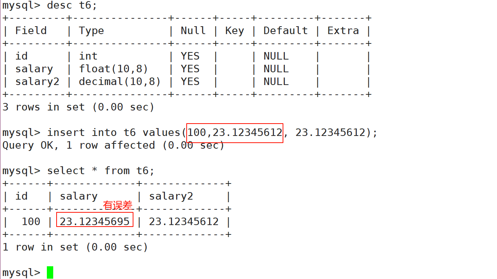

说明：float表示的精度大约是7位。

+ decimal整数最大位数m为65。支持小数最大位数d是30。如果d被省略，默认为0。如果m被省略，默认是10。

> 建议：如果希望小数的精度高，推荐使用decimal。
>

# 日期类型
> 表示时间值的日期和时间类型为DATETIME、DATE、TIMESTAMP、TIME和YEAR。  
每个时间类型有一个有效值范围和一个"零"值，当指定不合法的MySQL不能表示的值时使用"零"值。
>

| 类型 | 大小 ( bytes) | 范围 | 格式 | 用途 |
| :--- | :--- | :--- | :--- | :--- |
| DATE | 3 | 1000-01-01/9999-12-31 | YYYY-MM-DD | 日期值 |
| TIME | 3 | '-838:59:59'/'838:59:59' | HH:MM:SS | 时间值或持续时间 |
| YEAR | 1 | 1901/2155 | YYYY | 年份值 |
| DATETIME | 8 | '1000-01-01 00:00:00' 到 '9999-12-31 23:59:59' | YYYY-MM-DD hh:mm:ss | 混合日期和时间值 |
| TIMESTAMP | 4 | '1970-01-01 00:00:01' UTC 到 '2038-01-19 03:14:07' UTC结束时间是第 **2147483647** 秒，北京时间 **2038-1-19 11:14:07**，格林尼治时间 2038年1月19日 凌晨 03:14:07 | YYYY-MM-DD hh:mm:ss | 混合日期和时间值，时间戳 |


## 日期和时间类型
常用的日期有如下三个：

**date**：日期 'yyyy-mm-dd' ，占用三字节

**datetime：** 时间日期格式 'yyyy-mm-dd HH:ii:ss' 表示范围从 1000 到 9999 ，占用八字节

**timestamp**：时间戳，从1970年开始的 yyyy-mm-dd HH:ii:ss 格式和 datetime 完全一致，占用四字节

+ 插入指定时间

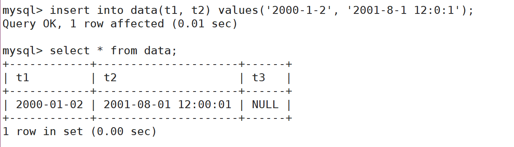

+ 时间戳

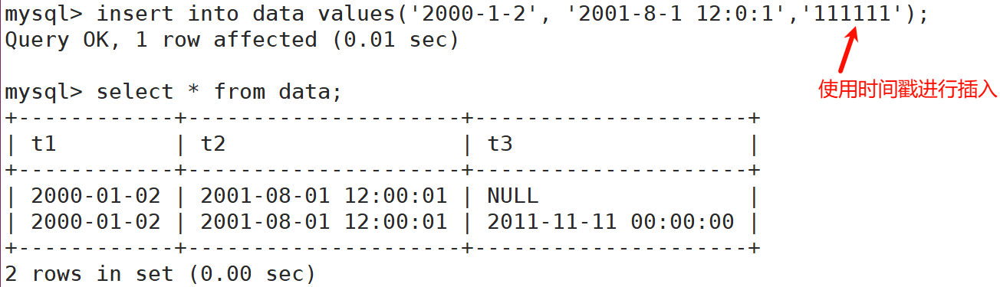

+ 使用现在的时间

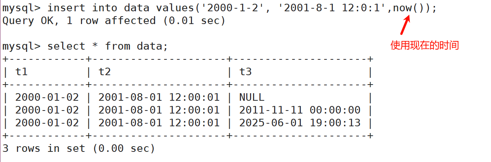

# 字符串类型
| 类型 | 大小 | 用途 |
| :--- | :--- | :--- |
| CHAR | 0-255 bytes | 定长字符串 |
| VARCHAR | 0-65535 bytes | 变长字符串 |
| TINYBLOB | 0-255 bytes | 不超过 255 个字符的二进制字符串 |
| TINYTEXT | 0-255 bytes | 短文本字符串 |
| BLOB | 0-65 535 bytes | 二进制形式的长文本数据 |
| TEXT | 0-65 535 bytes | 长文本数据 |
| MEDIUMBLOB | 0-16 777 215 bytes | 二进制形式的中等长度文本数据 |
| MEDIUMTEXT | 0-16 777 215 bytes | 中等长度文本数据 |
| LONGBLOB | 0-4 294 967 295 bytes | 二进制形式的极大文本数据 |
| LONGTEXT | 0-4 294 967 295 bytes | 极大文本数据 |


## char
语法：

```sql
char(L): 固定长度字符串，L是可以存储的长度，单位为字符，最大长度值可以为255
```

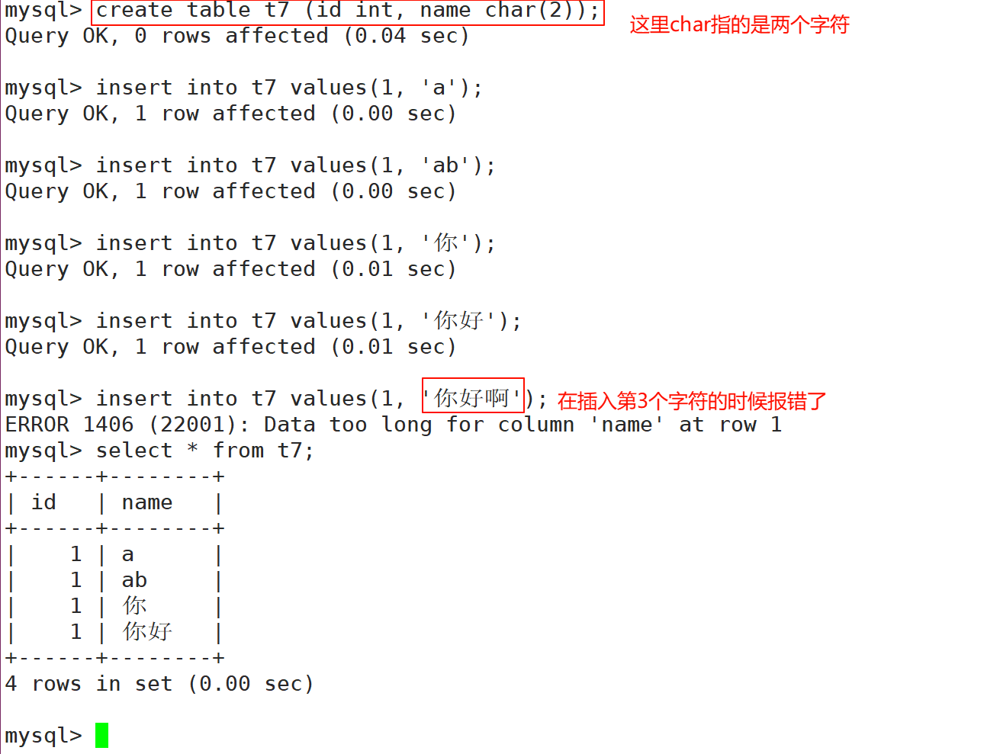

说明：

+ `char(2)`表示可以存放两个字符，可以是字母或汉字，但是不能超过2个， 最多只能是255

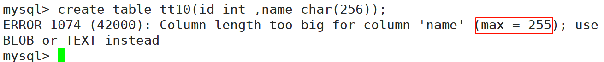

## varchar
语法：

```sql
varchar(L): 可变长度字符串，L表示字符长度，最大长度65535个字节
```

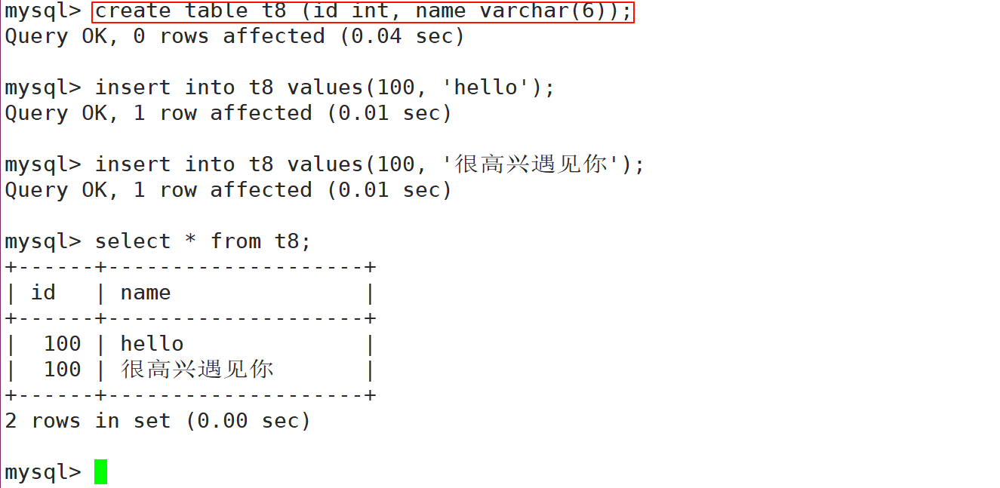

说明：

+ 关于`varchar(len)`，len到底是多大，这个len值，和表的编码密切相关：

varchar长度可以指定为0到65535之间的值，但是有`1 - 3`个字节用于记录数据大小，所以说有效字节数是65532。

当我们的表的编码是`utf8`时，`varchar(n)`的参数n最大值是`65532/3=21844`（因为utf中，一个字符占用3个字节），如果编码是`gbk`，`varchar(n)`的参数n最大是`65532/2=32766`（因为gbk中，一个字符占用2字节）。

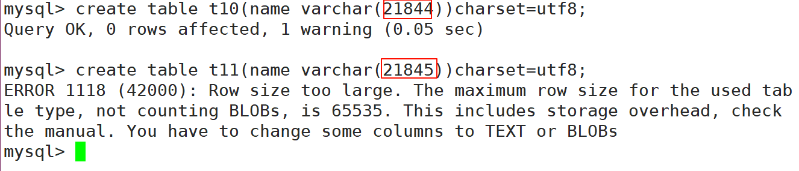

# enum和set
语法：

enum：枚举，“单选”类型；

enum('选项1','选项2','选项3',...);

该设定只是提供了若干个选项的值，最终一个单元格中，实际只存储了其中一个值；而且出于效率考 虑，这些值实际存储的是“数字”，因为这些选项的每个选项值依次对应如下数字：1,2,3,....最多`65535 `个；当我们添加枚举值时，也可以添加对应的数字编号。

语法：

set：集合，“多选”类型； 

set('选项值1','选项值2','选项值3', ...);

该设定只是提供了若干个选项的值，最终一个单元格中，设计可存储了其中任意多个值；而且出于效率考虑，这些值实际存储的是“数字”，因为这些选项的每个选项值依次对应如下数字：1,2,4,8,16,32，.... 最多64个。

> 说明：不建议在添加枚举值，集合值的时候采用数字的方式，因为不利于阅读。
>

例如：

+ gender可以单选（enum）
+ 爱好可以多选（set）


```sql
create table stu(
  name varchar(6), 
  gender enum('男','女'), 
  hobby set('写代码', '打羽毛球', '篮球', '跑步')
);
```

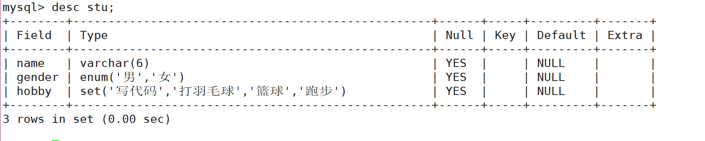

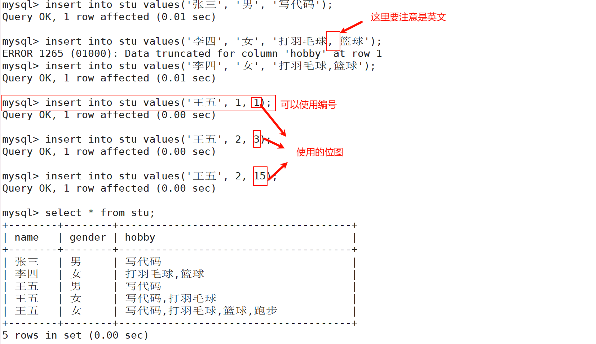

+ 查找爱好只有写代码的人

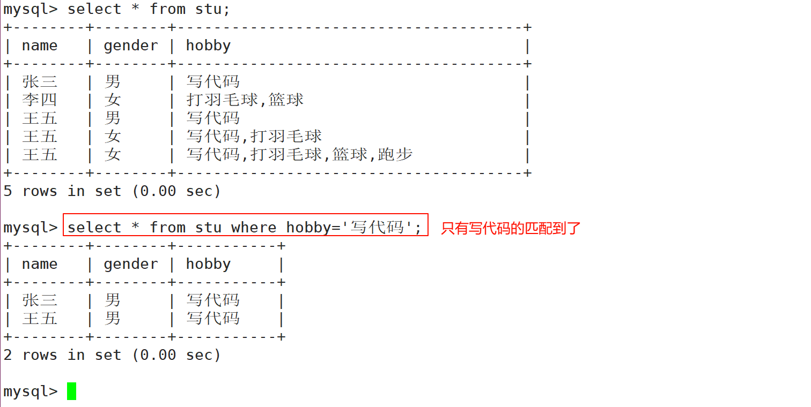

+ 但是不能查询出所有爱好写代码的人，就可以使用`find_in_set`函数

`find_in_set(sub,str_list) `：如果`sub`在`str_list`中，则返回下标；如果不在，返回0；`str_list`用逗号分隔的字符串。

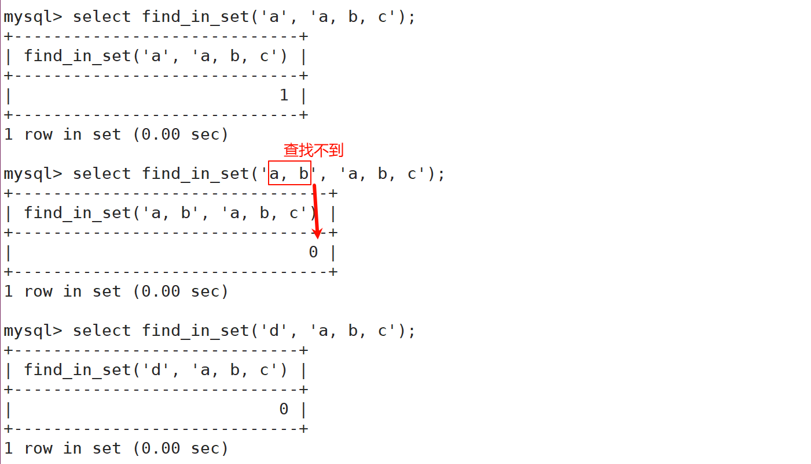

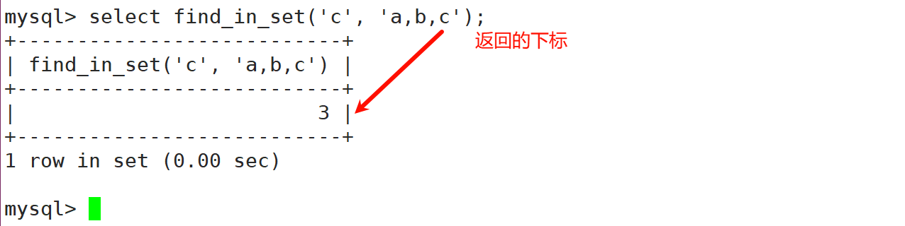

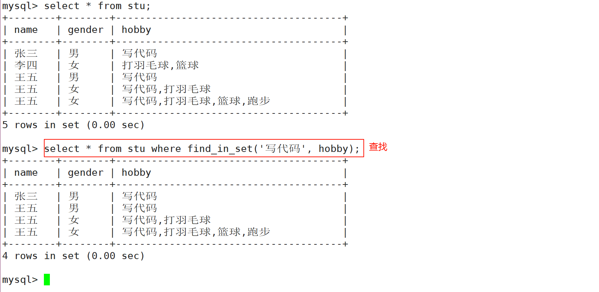

总结：

+ 如果我们向mysql特定的类型中插入不合法的数据，MySQL一般都是直接拦截我们，不让我们做对应的操作！
+ 反过来，如果我们已经有数据被成功插入到mysql中了，一定插入的时候是合法的！
+ 所以，mysq中，一般而言，数据类型本身也是一种：**约束**

---

+ mysql是否有无符号类型呢？
+ 答案是有的！但是mysql官方文档里明确说，不建议使用无符号类型，而且会在未来的般版本中就不支持了

