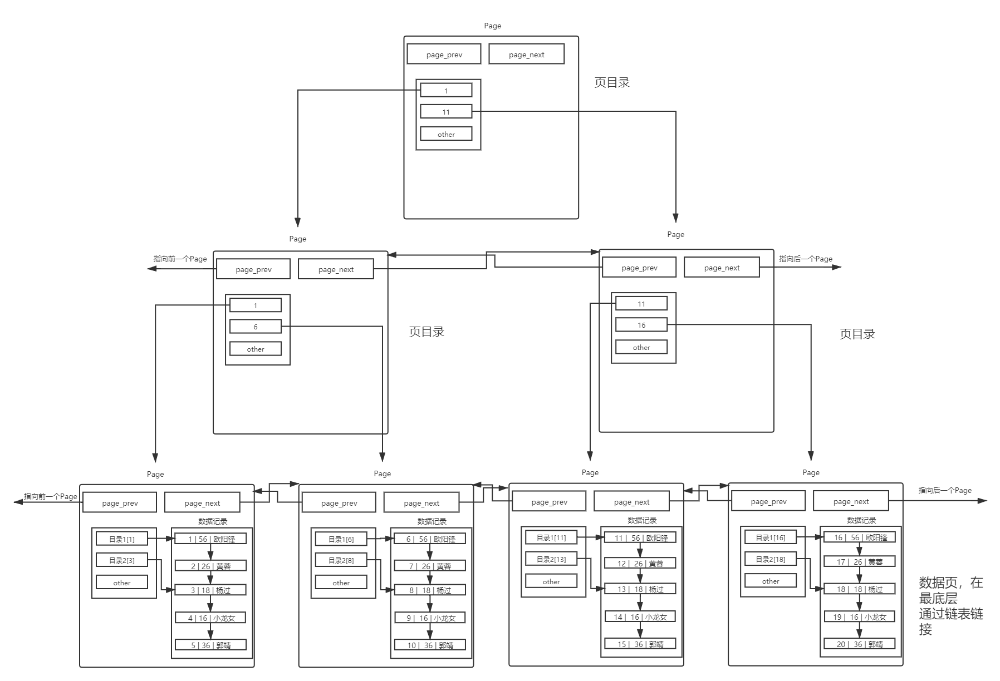

# 索引概念
+ 创建表

```sql
create table if not exists user (
  id int primary key, --一定要添加主键哦，只有这样才会默认生成主键索引 
  age int not null,
  name varchar(16) not null 
);
```

+ 查看

```sql
mysql> show create table user \G
*************************** 1. row ***************************
       Table: user
Create Table: CREATE TABLE `user` (
  `id` int NOT NULL,
  `age` int NOT NULL,
  `name` varchar(16) NOT NULL,
  PRIMARY KEY (`id`)
) ENGINE=InnoDB DEFAULT CHARSET=utf8mb3
```

+ 插入记录
+ 没有按照主键的大小顺序插入

```sql
mysql> insert into user (id, age, name) values(3, 18, '杨过');
Query OK, 1 row affected (0.00 sec)

mysql> insert into user (id, age, name) values(4, 16, '小龙女');
Query OK, 1 row affected (0.00 sec)

mysql> insert into user (id, age, name) values(2, 26, '黄蓉');
Query OK, 1 row affected (0.00 sec)

mysql> insert into user (id, age, name) values(5, 36, '郭靖');
Query OK, 1 row affected (0.00 sec)

mysql> insert into user (id, age, name) values(1, 56, '欧阳锋');
Query OK, 1 row affected (0.00 sec)
```

+ 查询
+ 发现竟然默认是有序的！

```sql
mysql> select * from user;
+----+-----+-----------+
| id | age | name      |
+----+-----+-----------+
|  1 |  56 | 欧阳锋    |
|  2 |  26 | 黄蓉      |
|  3 |  18 | 杨过      |
|  4 |  16 | 小龙女    |
|  5 |  36 | 郭靖      |
+----+-----+-----------+
5 rows in set (0.00 sec)
```

+ 因为有主键的问题， MySQL 会默认按照主键给我们的数据进行排序。

为什么数据库在插入数据时要对其进行排序呢？我们按正常顺序插入数据不是也挺好的吗？ 

插入数据时排序的目的，就是优化查询的效率。 页内部存放数据的模块，实质上也是一个链表的结构，链表的特点也就是增删快，查询修改慢，所以优化查询的效率是必须的。 正式因为有序，在查找的时候，从头到后都是有效查找，没有任何一个查找是浪费的，而且，如果运气好，是可以提前结束查找过程的。

在查询某条数据的时候直接将一 整页的数据加载到内存中，以减少硬盘IO次数，从而提高性能

+ IO交互是`Page`

不同的 Page ，在 MySQL 中，都是 16KB ，使用 prev 和 next 构成双向链表

MySQL 中每一页的大小只有 16KB ，单个Page大小固定，所以随着数据量不断增大， 16KB 不可能存下所有的数据，那么必定会有多个页来存储数据。

在Page之间，也是需要 MySQL 遍历的，给Page也带上目录

+ 使用一个目录项来指向某一页，而这个目录项存放的就是将要指向的页中存放的最小数据的键值。
+ 和页内目录不同的地方在于，这种目录管理的级别是页，而页内目录管理的级别是行。
+ 其中，每个目录项的构成是：键值+指针。

存在一个目录页来管理页目录，目录页中的数据存放的就是指向的那一页中最小的数据。有数据，就可通过比较，找到该访问那个Page，进而通过指针，找到下一个Page。



其实目录页的本质也是页，普通页中存的数据是用户数据，而目录页中存的数据是普通页的地址。

Page分为目录页和数据页。目录页只放各个下级Page的最小键值。

查找的时候，自定向下找，只需要加载部分目录页到内存，即可完成算法的整个查找过程，大大减少了IO次数

这就是B+树！！！

为何选择B+

+ 节点不存储data，这样一个节点就可以存储更多的key。可以使得树更矮，所以IO操作次数更少。
+ 叶子节点相连，更便于进行范围查找

# 索引操作
## 创建主键索引
### 第一种方式
+ 在创建表的时候，直接在字段名后指定 primary key

```sql
create table user1(id int primary key, name varchar(30));
```

### 第二种方式
+ 在创建表的最后，指定某列或某几列为主键索引

```sql
create table user2(id int, name varchar(30), primary key(id));
```

### 第三种方式
+ 创建表以后再添加主键

```sql
create table user3(id int, name varchar(30));
alter table user3 add primary key(id);
```

## 主键索引的特点
+ 一个表中，最多有一个主键索引，当然可以使符合主键
+ 主键索引的效率高（主键不可重复）
+ 创建主键索引的列，它的值不能为null，且不能重复
+ 主键索引的列基本上是int

## 唯一索引的创建
### 第一种方式
+ 在表定义时，在某列后直接指定unique唯一属性。

```sql
create table user4(id int primary key, name varchar(30) unique);
```

### 第二种方式
+ 创建表时，在表的后面指定某列或某几列为unique

```sql
create table user5(id int primary key, name varchar(30), unique(name));
```

### 第三种方式
+ 创建表以后再添加主键

```sql
create table user6(id int primary key, name varchar(30));
alter table user6 add unique(name);
```

## 唯一索引的特点
+ 一个表中，可以有多个唯一索引
+ 查询效率高
+ 如果在某一列建立唯一索引，必须保证这列不能有重复数据
+ 如果一个唯一索引上指定not null，等价于主键索引

## 普通索引的创建
### 第一种方式
```sql
create table user8(id int primary key,
  name varchar(20),
  email varchar(30),
  index(name) --在表的定义最后，指定某列为索引
);
```

### 第二种方式
```sql
create table user9(id int primary key, name varchar(20), email varchar(30));
alter table user9 add index(name); --创建完表以后指定某列为普通索引
```

### 第三种方式
```sql
create table user10(id int primary key, name varchar(20), email varchar(30));
-- 创建一个索引名为 idx_name 的索引
create index idx_name on user10(name);
```

### 普通索引的特点
+ 一个表中可以有多个普通索引，普通索引在实际开发中用的比较多
+ 如果某列需要创建索引，但是该列有重复的值，那么我们就应该使用普通索引

## 全文索引的创建
当对文章字段或有大量文字的字段进行检索时，会使用到全文索引。MySQL提供全文索引机制，但是有要求，要求表的存储引擎必须是MyISAM，而且默认的全文索引支持英文，不支持中文。如果对中文进行全文检索，可以使用sphinx的中文版(coreseek)。

```sql
CREATE TABLE articles (
  id INT UNSIGNED AUTO_INCREMENT NOT NULL PRIMARY KEY,
  title VARCHAR(200),
  body TEXT,
  FULLTEXT (title,body)
)engine=MyISAM;
```

```sql
INSERT INTO articles (title,body) VALUES
('MySQL Tutorial','DBMS stands for DataBase ...'),
('How To Use MySQL Well','After you went through a ...'),
('Optimizing MySQL','In this tutorial we will show ...'),
('1001 MySQL Tricks','1. Never run mysqld as root. 2. ...'),
('MySQL vs. YourSQL','In the following database comparison ...'),
('MySQL Security','When configured properly, MySQL ...');
```

查询有没有database数据

如果使用如下查询方式，虽然查询出数据，但是没有使用到全文索引

```sql
mysql> select * from articles where body like '%database%';
+----+-------------------+------------------------------------------+
| id | title             | body                                     |
+----+-------------------+------------------------------------------+
|  1 | MySQL Tutorial    | DBMS stands for DataBase ...             |
|  5 | MySQL vs. YourSQL | In the following database comparison ... |
+----+-------------------+------------------------------------------+
```

可以用explain工具看一下，是否使用到索引

```sql
mysql> explain select * from articles where body like '%database%'\G
*************************** 1. row ***************************
           id: 1
  select_type: SIMPLE
        table: articles
   partitions: NULL
         type: ALL
possible_keys: NULL
          key: NULL    <== key为null表示没有用到索引
      key_len: NULL
          ref: NULL
         rows: 6
     filtered: 16.67
        Extra: Using where
```

使用全文索引

```sql
mysql> SELECT * FROM articles WHERE MATCH (title,body) AGAINST ('database');
+----+-------------------+------------------------------------------+
| id | title             | body                                     |
+----+-------------------+------------------------------------------+
|  5 | MySQL vs. YourSQL | In the following database comparison ... |
|  1 | MySQL Tutorial    | DBMS stands for DataBase ...             |
+----+-------------------+------------------------------------------+
2 rows in set (0.00 sec)
```

通过explain来分析这个sql语句

```sql
mysql> explain SELECT * FROM articles WHERE MATCH (title,body) AGAINST ('database')\G
*************************** 1. row ***************************
           id: 1
  select_type: SIMPLE
        table: articles
   partitions: NULL
         type: fulltext
possible_keys: title
          key: title  <= key用到了title
      key_len: 0
          ref: const
         rows: 1
     filtered: 100.00
        Extra: Using where
1 row in set, 1 warning (0.00 sec)
```

## 查询索引
第一种方法：`show keys from 表名`

第二种方法：`show index from 表名;`

第三种方法（信息比较简略）：`desc 表名;`

## 删除索引
第一种方法-删除主键索引： `alter table 表名 drop primary key;`

第二种方法-其他索引的删除： `alter table 表名 drop index 索引名;` 索引名就是`show keys from` 表名中的`Key_name`字段

mysql> `alter table user10 drop index idx_name;`

第三种方法方法： `drop index 索引名 on 表名`

mysql> `drop index name on user8`

## 索引创建原则
比较频繁作为查询条件的字段应该创建索引

唯一性太差的字段不适合单独创建索引，即使频繁作为查询条件

更新非常频繁的字段不适合作创建索引

不会出现在where子句中的字段不该创建索引


