约束，就是数据库针对里面的数据能写啥，给出的一组"检验规则"

这样的约束，可以是程序猿人工来保证的，也可以是程序自动保证的

约束，就是为了提高效率，提高准确性，让数据库这个软件集成一个针对数据效验的功能

## NULL约束
创建表时，可以指定某列不为空：

+ 正常插入

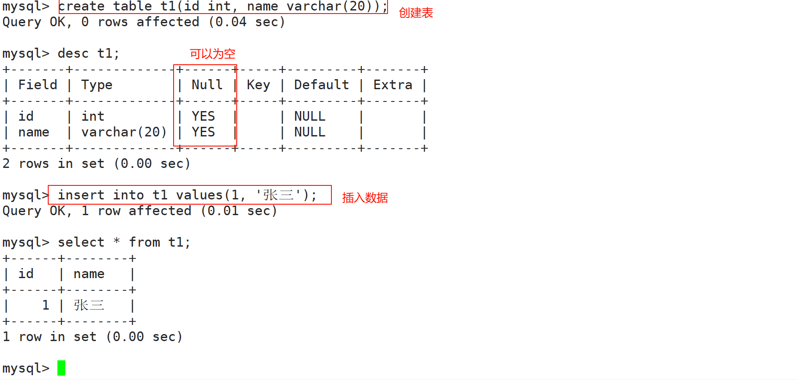

+ 在没有约束的时候，此时表中可以插入空值！

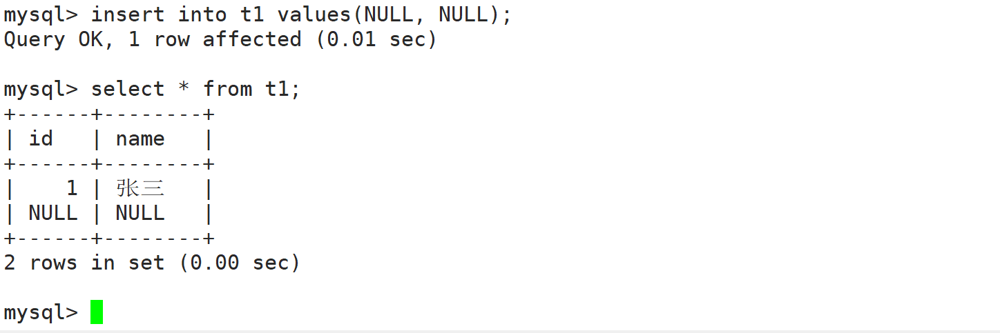

+ 这里我们重新创建一个表，设置成不能为空

```sql
create table student (id int not null, name varchar(20) not null);
```

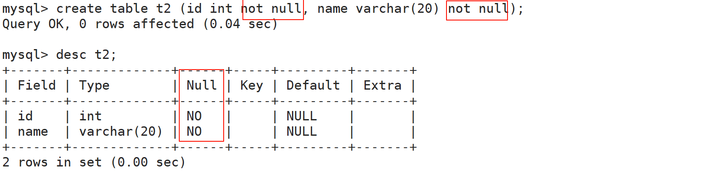

+ 非空约束也就生效了~~

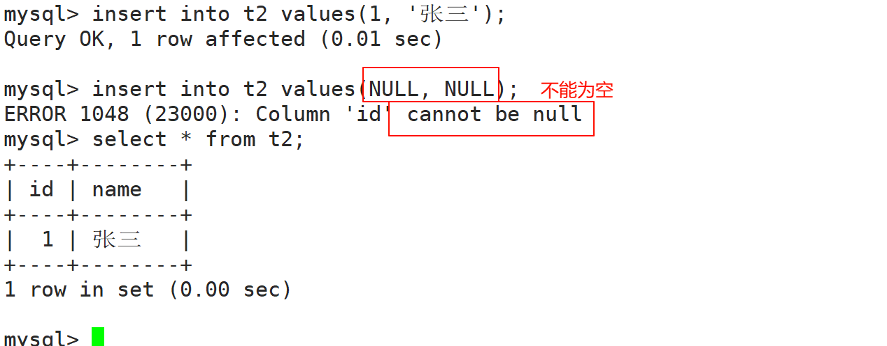

## DEFAULT：默认值
+ 创建表的时候指定默认值

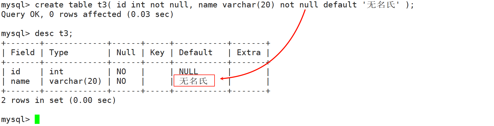

+ 这里设置了默认值为`无名氏`，再次插入不指定默认列

```sql
create table student (id int,name varchar(20) default '无名氏');
```

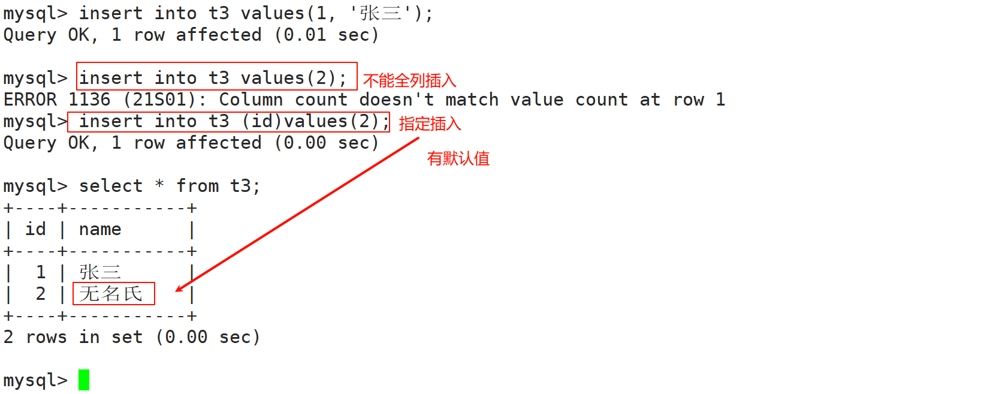

注意：not null和defalut一般不需要同时出现，因为default本身有默认值，不会为空


## PRIMARY KEY：主键
+ 主键，一条记录，在表中的身份标识
+ 也是要求唯一的，并且不能为空~~
+ 主键 = **unique + not null**
+ mysql要求一个表中只能有一个主键
    - 创建主键的时候，可以使用一个列作为主键，也可以使用多个列作为主键（**复合主键**），这个很少见。

```sql
create table student (id int primary key, name varchar(20));
```

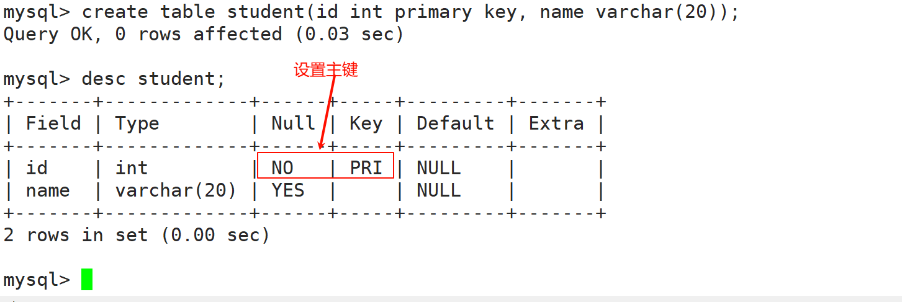

+ 当我插入一次数据后，再次插入，就不能了，看起来就是和`not null + unique`是类似的

```sql
insert into student values (1,'张三');
```

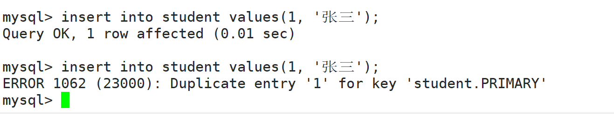

一个重要的问题：

+ 如何给这个记录安排一个主键呢？
    - mysql自身只是能够检查是否重复，设置的时候还是靠程序猿来设置
    - 在这里，mysql提供了一个简单粗暴的办法，自增主键。

## auto_increment：自增主键
```c
create table student(id int primary key auto_increment, name varchar(20));
```

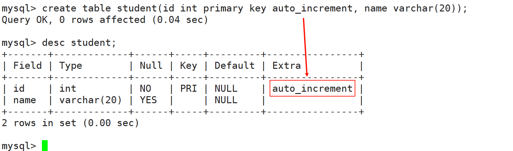

给自增主键插入数据的时候，可以手动指定一个值，也可以让mysql自己分配，如果让他自己分配，就在insert语句的时候，把id设为null即可

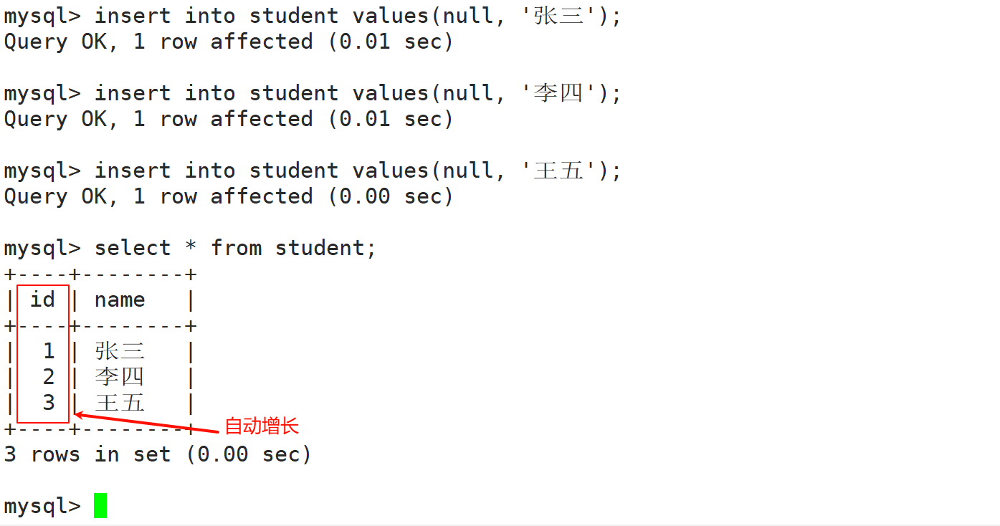

+ 这里还可以手动分配

```sql
insert into student values(100,'赵六');
insert into student (name)values('田七');
```

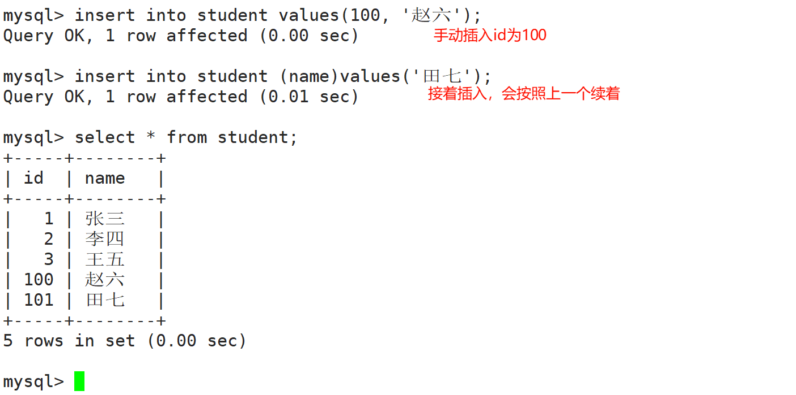

+ 可以看到，这里mysql还是继续默认浪费了~~
+ 那么这里空间有浪费了吗？
    - 这里分配的时候把这些序号跳过了，浪费了一部分序号，没有浪费空间。

在插入后获取上次插入的 AUTO_INCREMENT 的值（批量插入获取的是第一个值）

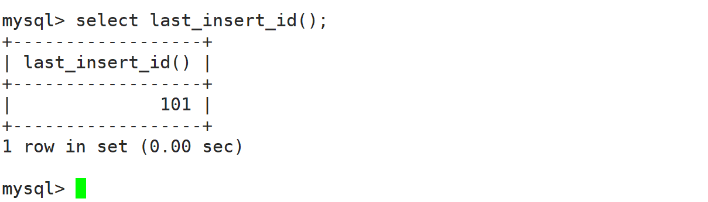

### 删除主键
```sql
alter table 表名 drop primary key;
```

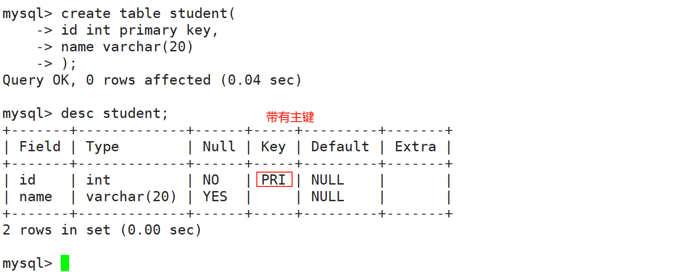

+ 删除主键

```sql
alter table student drop primary key;
```

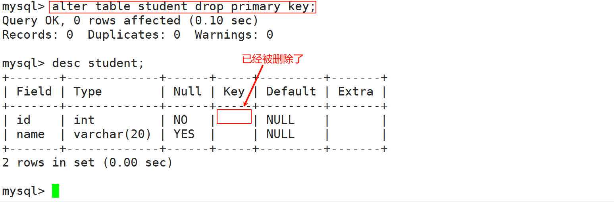

### 复合主键
在创建表的时候，在所有字段之后，使用primary key(主键字段列表)来创建主键，如果有多个字段作为主键，可以使用复合主键。

```sql
create table t8(
  id int unsigned,
  course char(10),
  score tinyint unsigned default 60,
  primary key(id, score)
);
```

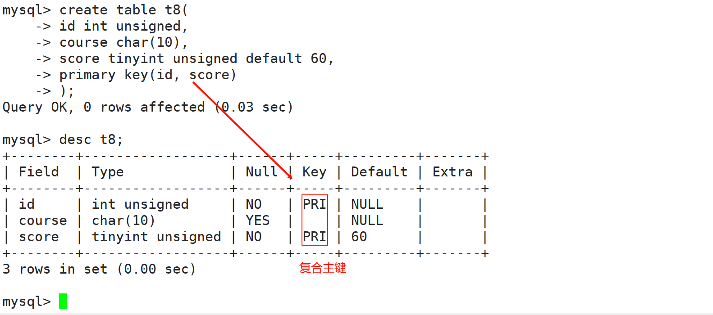

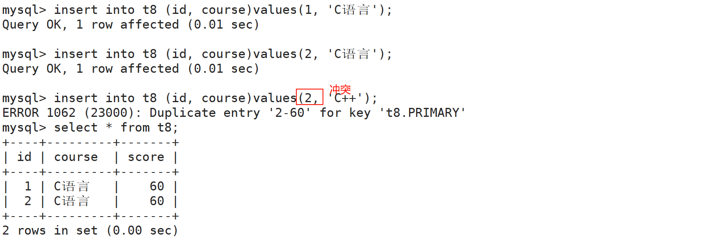

## UNIQUE：唯一键
+ 一张表中有往往有很多字段需要唯一性，数据不能重复，但是一张表中只能有一个主键：唯一键就可以解决表中有多个字段需要唯一性约束的问题。
+ 插入/修改数据的时候，会先查询，先看看数据是否已经存在，如果不存在，就能插入/修改成功，如果存在，则插入/修改失败！
+ 可以看到数据已经插入了一次，就不能插入了

```sql
create table student (id int unique, name varchar(20));
```

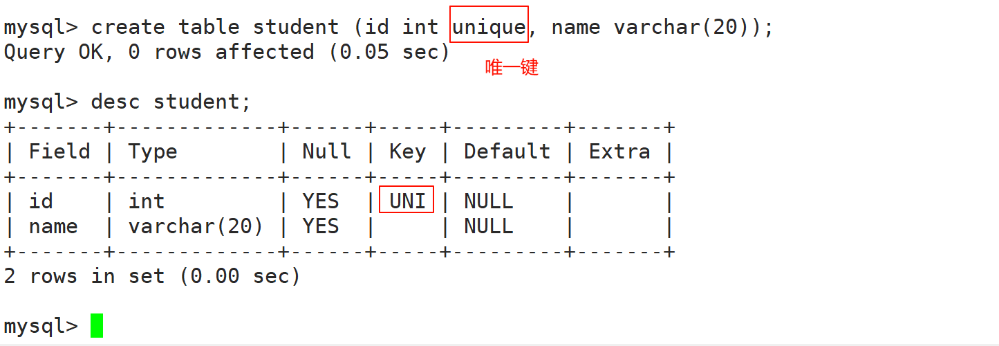

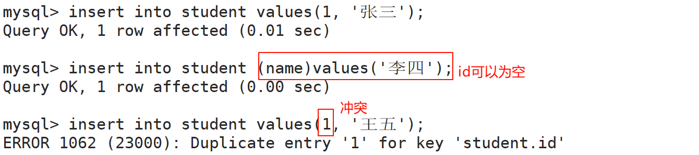

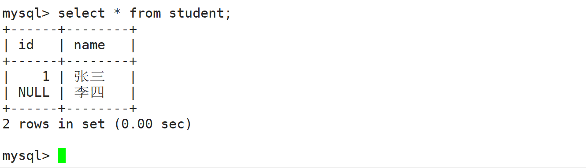

## FOREIGN KEY：外键
外键用于定义主表和从表之间的关系：外键约束主要定义在从表上，主表则必须是有主键约束或unique约束。当定义外键后，要求外键列数据必须在主表的主键列存在或为null。

语法：

```sql
foreign key (字段名) references 主表(列)
```

+ 两张表之间相互关联

```sql
create table class(
  class_id int primary key auto_increment,
  class_name varchar(20)
);
```

```sql
create table student(
  student_id int primary key auto_increment,
  name varchar(20),
  class_id int,
  foreign key (class_id) references class(class_id)
);
```

+ 此时就要求student表中的每个记录的class_id得在class表的class_id中存在！

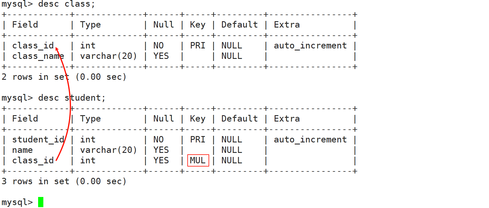

+ 这个时候插入数据就会失败

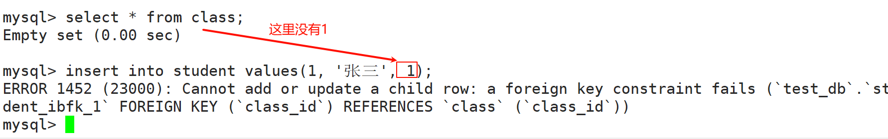

+ 这里写的是不能新增或者修改
+ 这里我们插入点班级数据

```sql
insert into class values(null,'cls1');
insert into class values(null,'cls2');
insert into class values(null,'cls3');
```

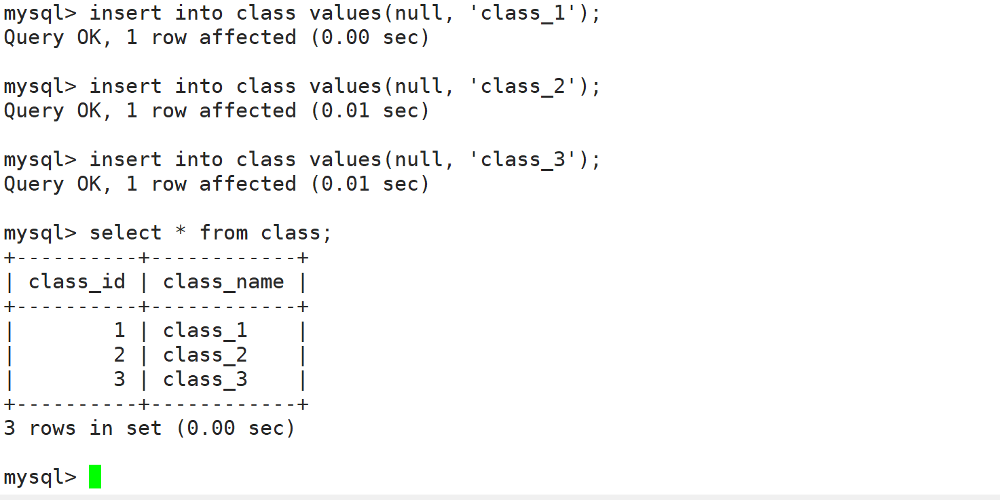

+ 再次插入数据，就成功了

```sql
insert into student values(null,'张三',1);
```

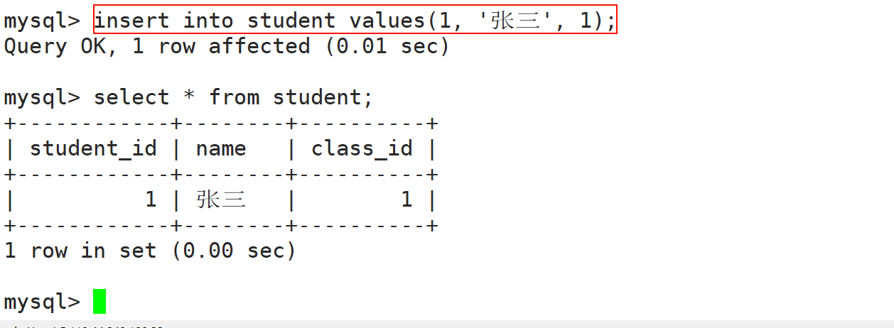

+ 换句话说student表插入数据的时候，mysql先会做一件事，会拿着这个记录的class_id去class表中看看有没有~~
+ 不仅是插入，修改也会有约束

```sql
update student set class_id = 10 where student_id = 1;
```

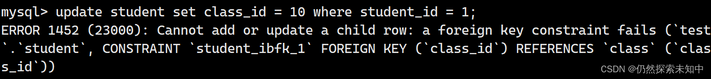

+ 那我们尝试把班级表中的class_id为1的记录给删了，会不会报错呢？
    - 可以看到是不能删除的~~

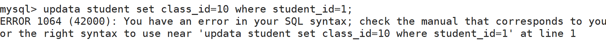

+ 这里因为`class_id`没有10！

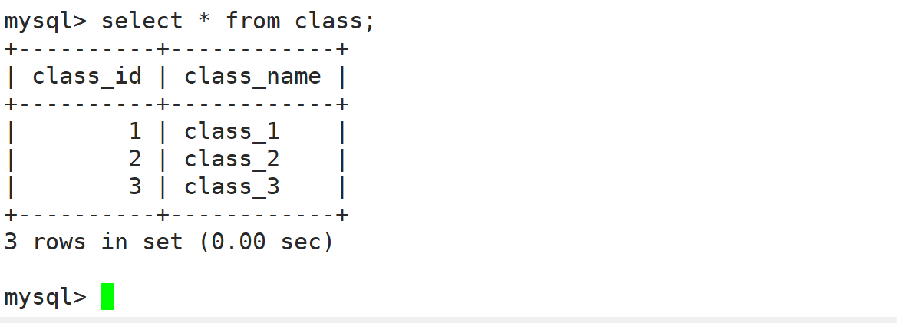

## 列描述
通过desc查看不到注释信息

通过show可以看到

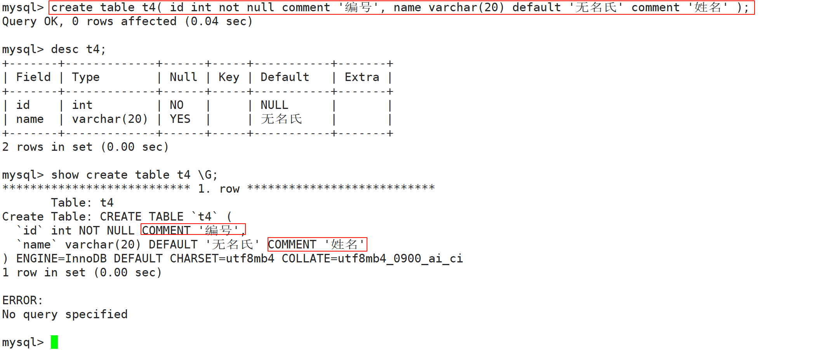

## zerofill
+ 对前面进行补0

```sql
create table t7( a int(10) zerofill, b int(10) zerofill);
```

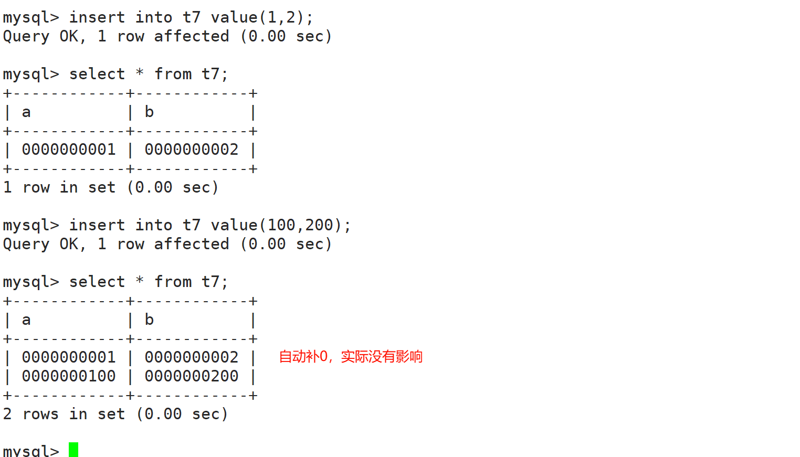

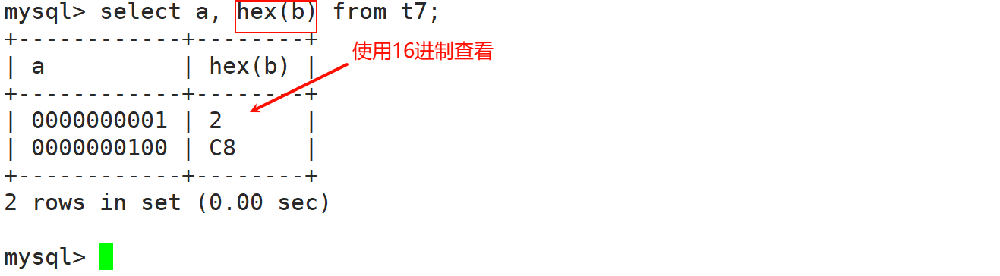

