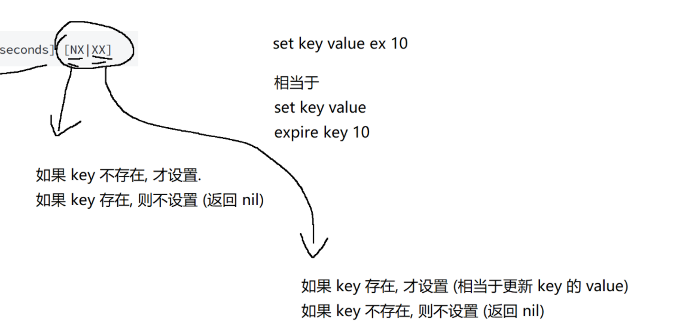

# Redis基础

## 常用命令总结

| 命令                             | 说明                               | 时间复杂度           |
| -------------------------------- | ---------------------------------- | -------------------- |
| `SET key value`                  | 设置键 `key` 的值为 `value`        | O(1)                 |
| `GET key`                        | 获取键 `key` 的值                  | O(1)                 |
| `DEL key [key ...]`              | 删除一个或多个键                   | O(k)，k 为键的数量   |
| `MSET key value [key value ...]` | 批量设置键值对                     | O(k)，k 为键值对数量 |
| `MGET key [key ...]`             | 批量获取键的值                     | O(k)，k 为键的数量   |
| `INCR key`                       | 将键 `key` 的值加 1                | O(1)                 |
| `DECR key`                       | 将键 `key` 的值减 1                | O(1)                 |
| `INCRBY key n`                   | 将键 `key` 的值加 `n`（整数）      | O(1)                 |
| `DECRBY key n`                   | 将键 `key` 的值减 `n`（整数）      | O(1)                 |
| `INCRBYFLOAT key n`              | 将键 `key` 的值加 `n`（浮点数）    | O(1)                 |
| `APPEND key value`               | 将 `value` 追加到键 `key` 的值末尾 | O(1)                 |
| `STRLEN key`                     | 获取键 `key` 值的长度              | O(1)                 |
| `SETRANGE key offset value`      | 从偏移量 `offset` 开始覆盖值       | O(n)，通常视为 O(1)  |
| `GETRANGE key start end`         | 获取从 `start` 到 `end` 的子字符串 | O(n)，通常视为 O(1)  |

### SET

将string类型的value设置到key中。如果key之前存在，则覆盖，无论原来的数据类型是什么。之前关于此key的TTL也全部失效。

```SQL
SET key value [expiration EX seconds|PX milliseconds] [NX|XX]
```

选项：
SET 命令支持多种选项来影响它的行为：
EX seconds —— 使用秒作为单位设置 key 的过期时间。
PX milliseconds —— 使用毫秒作为单位设置 key 的过期时间。
NX —— 只在 key 不存在时才进行设置，即如果 key 之前已经存在，设置不执行。
XX —— 只在 key 存在时才进行设置，即如果 key 之前不存在，设置不执行。
注意：由于带选项的 SET 命令可以被 SETNX 、SETEX 、PSETEX 等命令代替，所以之后的版本中，Redis 可能进行合并。

返回值：
如果设置成功，返回 OK。
如果由于 SET 指定了 NX 或者 XX 但条件不满足，SET 不会执行，并返回 (nil)。


`[]`相当于一个独立的单元，表示可选项 (可有可无的)其中`|`表示“或者”的意思，多个只能出现一个
`[]` 和 `[]` 之间,是可以同时存在的

如果 key 不存在，创建新的键值对。
如果 key存在，则是让新的value覆盖旧的value.可能会改变原来的数据类型原来这个key的`ttl`(生存时间)也会失效



`FLUSHALL` 可以把 redis 上所有的键值对都带走

### GET

获取 key 对应的 value。如果 key 不存在，返回 nil。如果 value 的数据类型不是 string，会报错。

```sql
GET key
```

返回值：key 对应的 value，或者 nil 当 key 不存在。

### MGET

一次性获取多个 key 的值。如果对应的 key 不存在或者对应的数据类型不是 string，返回 nil。

```sql
MGET key [key ...]
```

### MSET

一次性设置多个 key 的值。

```sql
MSET key value 1 [key value ...]
```

### SETNX

设置 key-value 但只允许在 key 之前不存在的情况下。

```sql
SETNX key value
```

返回值：1 表示设置成功。0 表示没有设置。

### INCR

将 key 对应的 string 表示的数字加一。如果 key 不存在，则视为 key 对应的 value 是 0。如果 key 对
应的 string 不是一个整型或者范围超过了 64 位有符号整型，则报错。

```sql
INCR key
```

返回值：integer 类型的加完后的数值。

### INCRBY

将 key 对应的 string 表示的数字加上对应的值。如果 key 不存在，则视为 key 对应的 value 是 0。如果 key 对应的 string 不是一个整型或者范围超过了 64 位有符号整型，则报错。

```sql
INCRBY key decrement
```

返回值：integer 类型的加完后的数值。

### DECR

将 key 对应的 string 表示的数字减一。如果 key 不存在，则视为 key 对应的 value 是 0。如果 key 对应的 string 不是一个整型或者范围超过了 64 位有符号整型，则报错。
```sql
DECR key
```

返回值：integer 类型的减完后的数值。

### DECYBY

将 key 对应的 string 表示的数字减去对应的值。如果 key 不存在，则视为 key 对应的 value 是 0。如果 key 对应的 string 不是一个整型或者范围超过了 64 位有符号整型，则报错。

```sql
DECRBY key decrement
```

返回值：integer 类型的减完后的数值。

### INCRBYFLOAT

将 key 对应的 string 表示的浮点数加上对应的值。如果对应的值是负数，则视为减去对应的值。如果 key 不存在，则视为 key 对应的 value 是 0。如果 key 对应的不是 string，或者不是一个浮点数，则报错。允许采用科学计数法表示浮点数。

```sql
INCRBYFLOAT 1 key increment
```

返回值：加/减完后的数值。

很多存储系统和编程语言内部使用 CAS 机制实现计数功能，会有一定的 CPU 开销，但在 Redis 中完全不存在这个问题，因为 Redis 是单线程架构，任何命令到了 Redis 服务端都要顺序执行。

### APPEND

如果 key 已经存在并且是一个 string，命令会将 value 追加到原有 string 的后边。如果 key 不存在，则效果等同于 SET 命令。

```sql
APPEND KEY VALUE
```

返回值：追加完成之后 string 的长度。

### GETRANGE

返回 key 对应的 string 的子串，由 start 和 end 确定（**左闭右闭**）。可以使用负数表示倒数。-1 代表倒数第一个字符，-2 代表倒数第二个，其他的与此类似。超过范围的偏移量会根据 string 的长度调整成正确的值。

```sql
GETRANGE 1 key start end
```

返回值：string 类型的子串

### SETRANGE

覆盖字符串的一部分，从指定的偏移开始。

```sql
SETRANGE  key offset value
```

返回值：替换后的 string 的长度。

### STRLEN

获取 key 对应的 string 的长度。当 key 存放的类似不是 string 时，报错。

```sql
STRLEN key
```

返回值：string 的长度。或者当 key 不存在时，返回 0。


