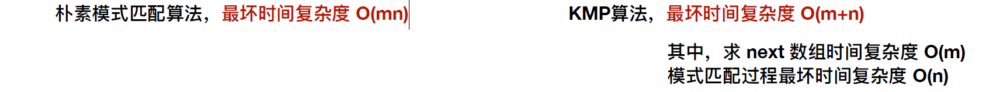
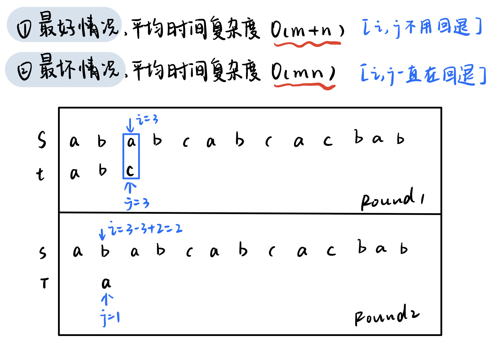
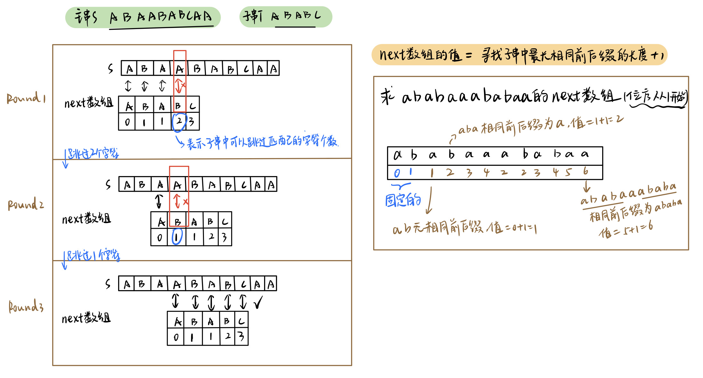

# 暴力匹配算法BF





## 代码实现
```cpp
int Index_BF(string s, string t)
{
    int i = 1, j = 1;
    int lens = s.length();
    int lent = t.length();
    while (i < lens && j < lent)
    {
        if (s[i] == t[j])
        {
            i++, j++;
            continue;
        }
        else
        {
            i = i - j + 2; // i指示主串S正在比较的字符位置
            j = 1; // j指示子串t正在比较的字符位置
        }
    }
    if (j == lent)
    {
        return i - j;
    }
    return -1;
}
```


# 模式匹配算法KMP




模式匹配：<font style="color:#e84c22;">子串的定位操作，求的是子串（模式串）在主串中的位置</font>


## next数组求解
求出PM值后向右移动一位，然后左边补-1

+ 如果计算的是下标从0开始的字符串此时就是next数组
+ 如果计算的是下标从1开始的字符串需要进行**每一位+1**

## nextval
首先nextval的求解需要借助next数组，其次nextval是靠自己推导自己

+ 第一个字符的nextval永远是next的第一个值
+ 以next的值充当模式串的下标，标出对应的字符
    - 如果对应字符不同，nextval值就是next值
    - 如果对应字符相同，则以next的值充当字符下标，对应nextval值即为当前字符所求

如果是下标从0开始就是**每个数字-1**


## 代码实现
```cpp
void get_next(String T, int next[])  //计算next数组
{
    int i = 1, j = 0;
    next[1] = 0;
    while (i < T.length)
    {
        if (j == 0 || T.ch[i] == T.ch[j])
        {
            ++i;
            ++j;
            next[i] = j;
        }
        else
            j = next[j];
    }
}
int Index_KMP(String S, String T, int next[])
{
    int i = 1, j = 1;
    while (i <= S.length && j <= T.length)  //i永远不递减
    {
        if (j == 0 || S.ch[i] == T.ch[j]) //字符匹配成功,指针后移
        {
            ++i;
            ++j;
        }
        else  //字符匹配失败, 根据next跳过前面的一些字符
            j = next[j];
    }
    if (j > T.length)  // 匹配成功
        return i - T.length;
    else
        return 0;
}
```


