# 一、树
## 树的概念与结构
树是一种非线性的数据结构，它是由`n（n>=0）`个有限结点组成一个具有层次关系的集合。把它叫做树是因为它看起来像一棵倒挂的树，也就是说它是根朝上，而叶朝下的。

+ 有一个特殊的结点，称为根结点，根结点没有前驱结点。
+ 除根结点外，其余结点被分成M(M>0) 个互不相交的集合T1、T2、……、Tm ，其中每一个集合Ti(1 <= i <= m) 又是一棵结构与树类似的子树。每棵子树的根结点有且只有一个前驱，可以有0个或多个后继。因此，树是递归定义的。

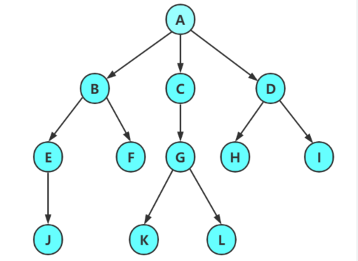

树形结构中，子树之间不能有交集，否则就不是树形结构

非树形结构：

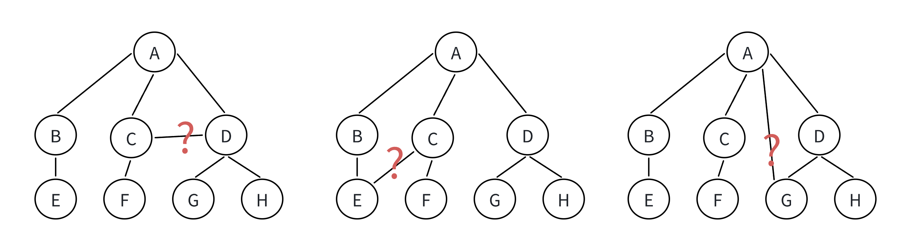

+ 子树是不相交的（如果存在相交就是图了）
+ 除了根结点外，每个结点有且仅有一个父结点
+ 一棵N个结点的树有N-1条边

## 树的相关
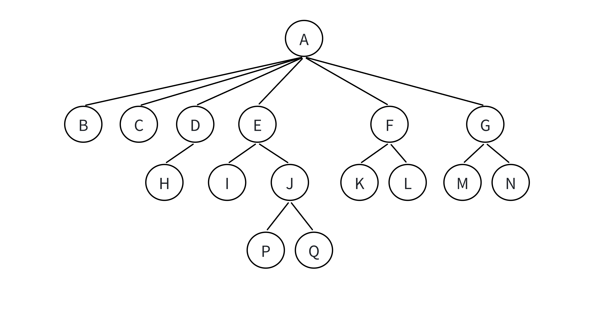

**父结点/双亲结点**：若一个结点含有子结点，则这个结点称为其子结点的父结点； 如上图：A是B的父结点

**子结点/孩子结点**：一个结点含有的子树的根结点称为该结点的子结点； 如上图：B是A的孩子结点

**结点的度**：一个结点有几个孩子，他的度就是多少；比如A的度为6，F的度为2，K的度为0

**树的度**：一棵树中，最大的结点的度称为树的度； 如上图：树的度为6

**叶子结点/终端结点**：度为0 的结点称为叶结点； 如上图： B、C、H、I... 等结点为叶结点

**分支结点/非终端结点**：度不为0 的结点； 如上图： D、E、F、G... 等结点为分支结点

**兄弟结点**：具有相同父结点的结点互称为兄弟结点(亲兄弟)； 如上图： B、C 是兄弟结点

**结点的层次**：从根开始定义起，根为第1 层，根的子结点为第2 层，以此类推；

**树的高度或深度**：树中结点的最大层次； 如上图：树的高度为4

**结点的祖先**：从根到该结点所经分支上的所有结点；如上图： A 是所有结点的祖先

**路径**：一条从树中任意节点出发，沿父节点-子节点连接，达到任意节点的序列；比如A到Q的路径为：A-E-J-Q；H到Q的路径H-D-A-E-J-Q

**子孙**：以某结点为根的子树中任一结点都称为该结点的子孙。如上图：所有结点都是A的子孙

**森林**：由`m（m>0）`棵互不相交的树的集合称为森林；

## 树的表示
孩子兄弟表示法：

树结构相对线性表就比较复杂了，要存储表示起来就比较麻烦了，既然保存值域，也要保存结点和结点之间的关系，实际中树有很多种表示方式如：双亲表示法，孩子表示法、孩子双亲表示法以及孩子兄弟表示法等。我们这里就简单的了解其中最常用的孩子兄弟表示法

```c
struct TreeNode
{
    struct Node* child; // 左边开始的第一个孩子结点
    struct Node* brother; // 指向其右边的下一个兄弟结点
    int data; // 结点中的数据域
};
```

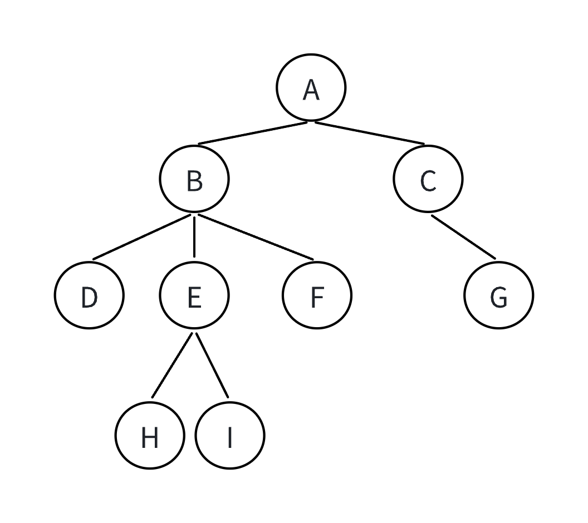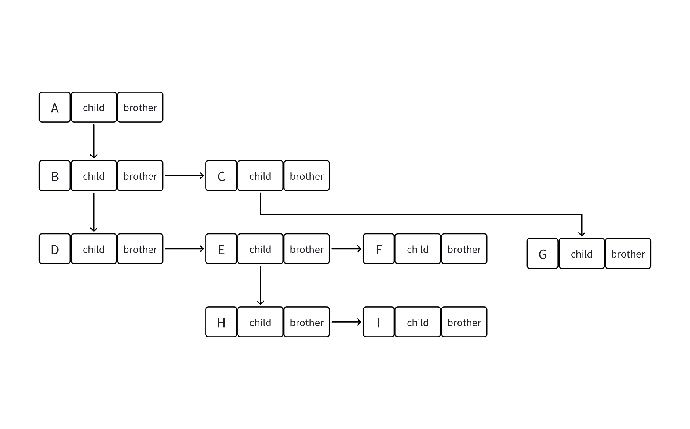

# 二、二叉树
在树形结构中，我们最常用的就是二叉树，一棵二叉树是结点的一个有限集合，该集合由一个根结点加上两棵别称为左子树和右子树的二叉树组成或者为空。

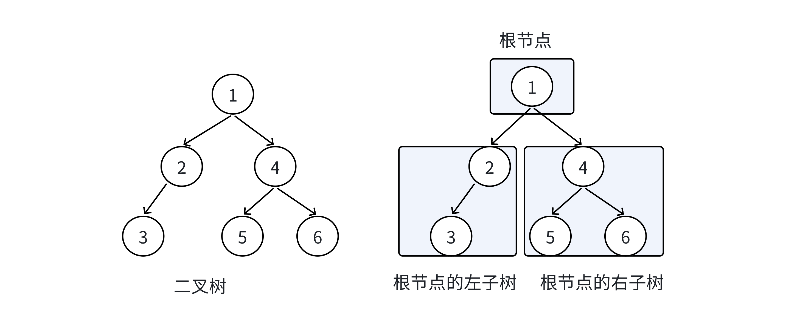

从上图可以看出二叉树具备以下特点：

1. 二叉树不存在度大于2 的结点
2. 二叉树的子树有左右之分，次序不能颠倒，因此二叉树是有序树  
注意：对于任意的二叉树都是由以下几种情况复合而成的

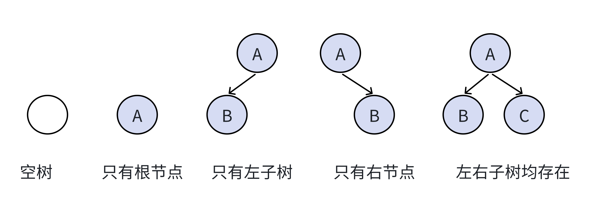

## 满二叉树
一个二叉树，如果每一个层的结点数都达到最大值，则这个二叉树就是满二叉树。也就是说，如果一个二叉树的层数为K ，且结点总数是 `2k − 1`，则它就是满二叉树。

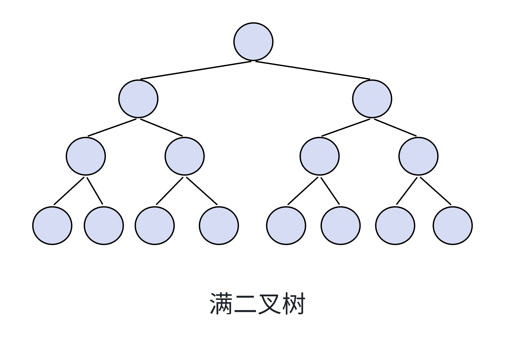

## 完全二叉树
完全二叉树是效率很高的数据结构，完全二叉树是由满二叉树而引出来的。对于深度为`K`的，有`n`个结点的二叉树，当且仅当其每一个结点都与深度为K的满二叉树中编号从`1 至 n`的结点一一对应时称之为完全二叉树。要注意的是满二叉树是一种特殊的完全二叉树。

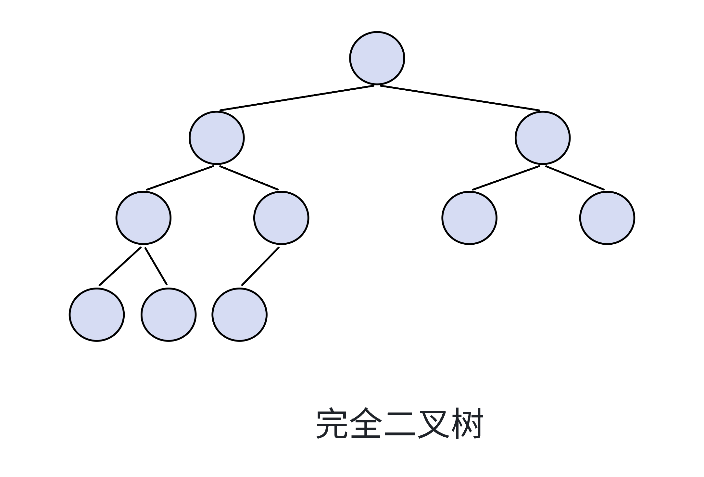

## 二叉树性质
<font style="color:#DF2A3F;background-color:#FBDE28;">1）若规定根结点的层数为</font>**<font style="color:#DF2A3F;background-color:#FBDE28;">1</font>**<font style="color:#DF2A3F;background-color:#FBDE28;"> ，则一棵非空二叉树的第i层上最多有</font><font style="color:#DF2A3F;background-color:#FBDE28;">个结点</font>

<font style="color:#DF2A3F;background-color:#FBDE28;">2）若规定根结点的层数为</font>**<font style="color:#DF2A3F;background-color:#FBDE28;">1</font>**<font style="color:#DF2A3F;background-color:#FBDE28;"> ，则深度为 h 的二叉树的最大结点数是</font>

<font style="color:#DF2A3F;background-color:#FBDE28;">3）若规定根结点的层数为</font>**<font style="color:#DF2A3F;background-color:#FBDE28;">1</font>**<font style="color:#DF2A3F;background-color:#FBDE28;"> ，具有n 个结点的满二叉树的深度</font><font style="color:#DF2A3F;background-color:#FBDE28;">( log以2为底， n+1 为对数)</font>

## 二叉树存储结构
二叉树一般可以使用两种结构存储，一种顺序结构，一种链式结构。

顺序结构存储就是使用数组来存储，一般使用数组只适合表示完全二叉树，因为不是完全二叉树会有

空间的浪费，完全二叉树更适合使用顺序结构存储。

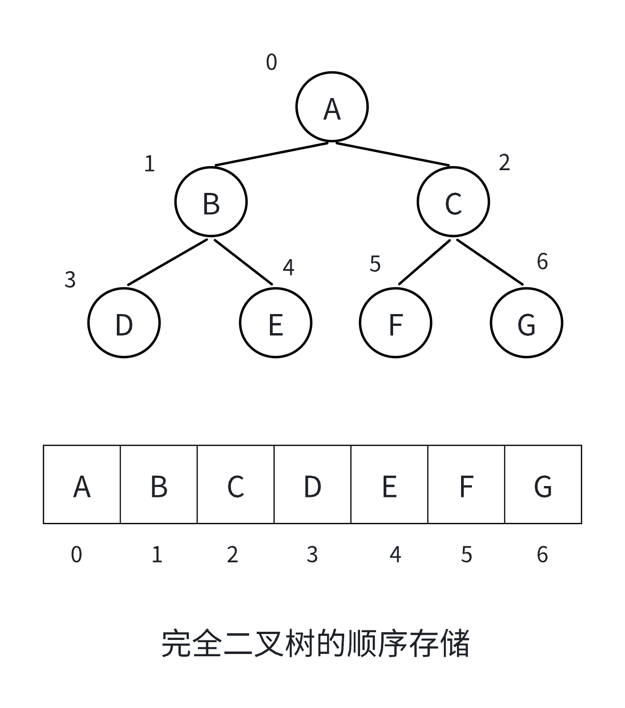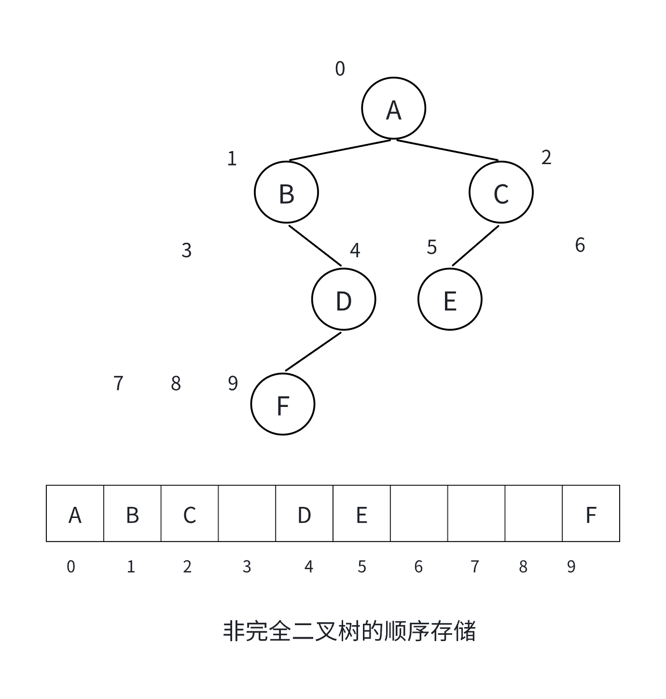

现实中我们通常把堆（一种二叉树）使用顺序结构的数组来存储，需要注意的是这里的堆和操作系统虚拟进程地址空间中的堆是两回事，一个是数据结构，一个是操作系统中管理内存的一块区域分段。

---

二叉树的链式存储结构是指，用链表来表示一棵二叉树，即用链来指示元素的逻辑关系。 通常的方法是链表中每个结点由三个域组成，数据域和左右指针域，左右指针分别用来给出该结点左孩子和右孩子所在的链结点的存储地址 。链式结构又分为二叉链和三叉链，当前我们学习中一般都是二叉链。

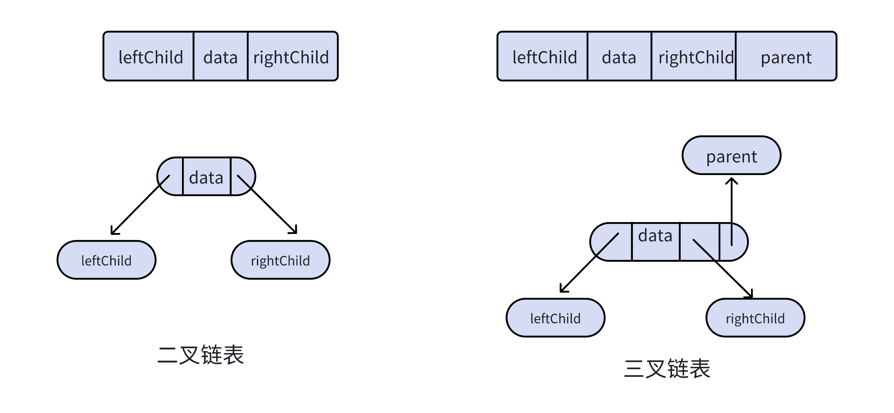

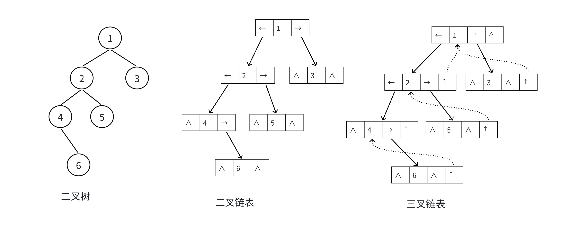

## 实现顺序结构二叉树
一般堆使用顺序结构的数组来存储数据，堆是一种特殊的二叉树，具有二叉树的特性的同时，还具备其他的特性。

如果有一个关键码的集合，把它的所有元素按完全二叉树的顺序存储方式存储，在一个一维数组中，并满足：，`i = 0、1、2...`，则称为小堆(或大堆)。将根结点最大的堆叫做最大堆或大根堆，根结点最小的堆叫做最小堆或小根堆。

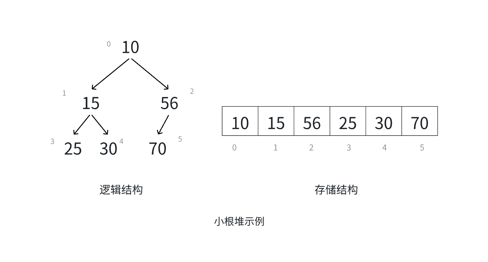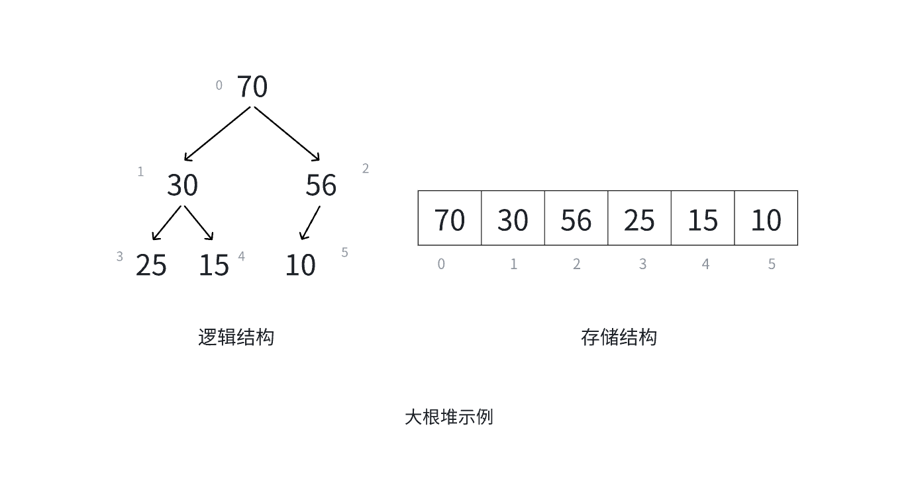

## 堆的性质
+ 堆中某个结点的值总是不大于或不小于其父结点的值；
+ 堆总是一棵完全二叉树。

**二叉树性质**

对于具有n 个结点的完全二叉树，如果按照从上至下从左至右的数组顺序对所有结点从`0`开始编号，则对于序号为`i`的结点有：

1. 若i>0 ， i 位置结点的双亲序号： `(i-1)/2` ；` i=0` ， `i` 为根结点编号，无双亲结点
2. 若`2i+1<n` ，左孩子序号： `2i+1` ， `2i+1>=n` 否则无左孩子
3. 若`2i+2<n` ，右孩子序号： `2i+2` ， `2i+2>=n` 否则无右孩子

# 三、堆的实现
## Heap.h
```c
#pragma once

#include<stdio.h>
#include<stdlib.h>
#include<assert.h>
#include<stdbool.h>

typedef int HPDataType;

typedef struct Heap
{
    HPDataType* a;
    int size;
    int capacity;
}Heap;

// 堆的构建
void HeapInit(Heap* hp);
// 堆的插入
void HeapPush(Heap* hp, HPDataType x);
// 堆的删除
void HeapPop(Heap* hp);
// 取堆顶的数据
HPDataType HeapTop(Heap* hp);
// 堆的数据个数
int HeapSize(Heap* hp);
// 堆的判空
bool HeapEmpty(Heap* hp);
// 堆的销毁
void HeapDestory(Heap* hp);
```

### 堆的初始化
```c
void HeapInit(Heap* hp)
{
    assert(hp);
    hp->a = NULL;
    hp->capacity = hp->size = 0;
}
```

### 堆的插入【重点】
+ 检查空间是否满了，满了就扩容
+ 然后将值插入到最后
+ 最后**向上调整**

> 向上调整算法，依次pk
>

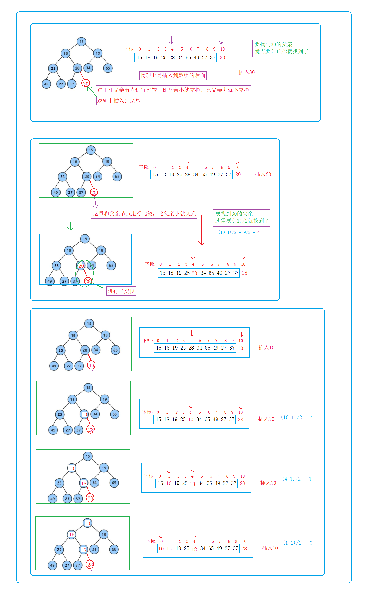

+ 这里的`size`是`size-1`，而不是`size`，因为是放完数据后`size++`了一下，然后要取`size-1`的位置
+ 如果孩子节点小于父亲节点就交换
+ 然后再将父亲节点给了孩子节点，再进行`(-1)/2`
+ 如果大于等于父亲就跳出循环
+ 跳出的条件是`child > 0`
+ 这里的向上时间复杂度是`O(logN)`

```c
//交换
void Swap(int* p1, int* p2)
{
    HPDataType tmp = *p1;
    *p1 = *p2;
    *p2 = tmp;
}
//向上调整
void AjustUp(HPDataType* a, HPDataType child)
{
    HPDataType parent = (child - 1) / 2;
    while (child > 0)
    {
        if (a[child] < a[parent])
        {
            Swap(&a[child], &a[parent]);
            child = parent;
            parent = (parent - 1) / 2;
        }
        else
        {
            break;
        }
    }
}

// 堆的插入
void HeapPush(Heap* hp, HPDataType x)
{
    assert(hp);
    if (hp->capacity == hp->size)
    {
        HPDataType newcapacity = hp->capacity == 0 ? 4 : hp->capacity * 2;
        HPDataType* tmp = (HPDataType*)realloc(hp->a, sizeof(HPDataType) * newcapacity);
        if (tmp == NULL)
        {
            perror("realloc fail\n");
            exit(-1);
        }
        hp->a = tmp;
        hp->capacity = newcapacity;
    }

    hp->a[hp->size] = x;
    hp->size++;

    AjustUp(hp->a, hp->size - 1);
}
```

```c
int main()
{
    Heap hp;
    int a[] = { 27,15,19,18,28,34,65,49,25,37 };
    HeapInit(&hp);
    int sz = sizeof(a) / sizeof(a[0]);
    
    for (int i = 0; i < sz; i++)
    {
        HeapPush(&hp, a[i]);
    }
    return 0;
}
```

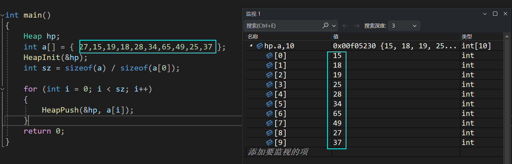

### 堆的删除【重点】
+ 堆的删除是**堆顶**上的数据，而不是删除根节点，删除最下面的那个数据是没有意义的~~
+ 删除后要进行调整

**步骤一：**

> 交换
>

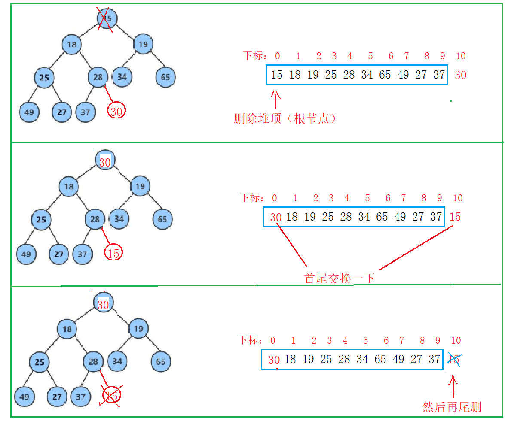

**步骤二：**

> 向下调整算法
>

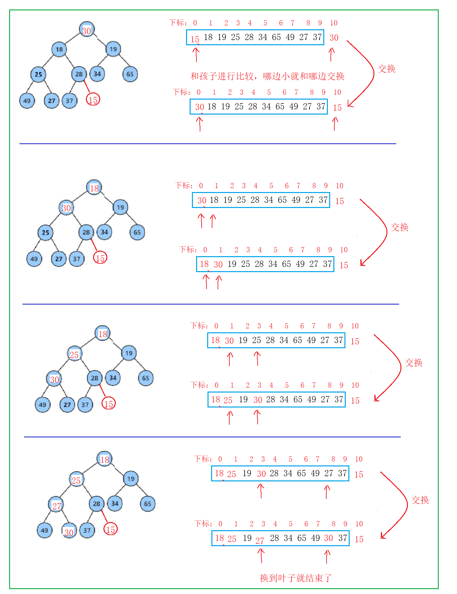

> 这里的向下时间复杂度是`O(logN)`，和向上一样，调整高度次
>

```c
//向下调整
void AdjustDown(int* a, int size, int parent)
{
    //假设左孩子小，假设错了就更新
    int child = parent * 2 + 1;
    while (child < size)
    {
        if (child + 1 < size && a[child + 1] > a[child])
        {
            ++child;
        }
        
        if (a[child] < a[parent])
        {
            Swap(&a[child], &a[parent]);
            parent = child;
            child = parent * 2 + 1;
        }
        else
        {
            break;
        }
    }
}
// 堆的删除
void HeapPop(Heap* hp)
{
    assert(hp);
    assert(hp->size > 0);

    //首尾交换
    Swap(&hp->a[0], &hp->a[hp->size - 1]);
    hp->size--;

    //从根向下调整
    AdjustDown(hp->a, hp->size, 0);
}
```

### 取堆顶的数据
+ 这里直接取数组第一个元素就可以了

```c
HPDataType HeapTop(Heap* hp)
{
    assert(hp);
    assert(hp->size > 0);

    return hp->a[0];
}
```

### 堆的数据个数
```c
int HeapSize(Heap* hp)
{
    assert(hp);
    return hp->size;
}
```

### 堆的判空
+ 判断size是否为0

```c
bool HeapEmpty(Heap* hp)
{
    assert(hp);
    return hp->size == 0;
}
```

### 堆的销毁
```c
void HeapDestory(Heap* hp)
{
    assert(hp);
    if(hp->a) 
        free(hp->a);
    hp->capacity = hp->size = 0;
}
```

## 全部代码
```c
//小堆算法
// 堆的构建
void HeapInit(Heap* hp)
{
    assert(hp);
    hp->a = NULL;
    hp->capacity = hp->size = 0;
}

//交换
void Swap(int* p1, int* p2)
{
    HPDataType tmp = *p1;
    *p1 = *p2;
    *p2 = tmp;
}


//向上调整
void AdjustUp(HPDataType* a, HPDataType child)
{
    HPDataType parent = (child - 1) / 2;
    while (child > 0)
    {
        if (a[child] < a[parent])
        {
            Swap(&a[child], &a[parent]);
            child = parent;
            parent = (parent - 1) / 2;
        }
        else
        {
            break;
        }
    }
}

// 堆的插入
void HeapPush(Heap* hp, HPDataType x)
{
    assert(hp);
    if (hp->capacity == hp->size)
    {
        int newcapacity = hp->capacity == 0 ? 4 : hp->capacity * 2;
        HPDataType* tmp = (HPDataType*)realloc(hp->a, sizeof(HPDataType) * newcapacity);
        if (tmp == NULL)
        {
            perror("realloc fail\n");
            exit(-1);
        }
        hp->a = tmp;
        hp->capacity = newcapacity;
    }

    hp->a[hp->size] = x;
    hp->size++;

    AdjustUp(hp->a, hp->size - 1);
}

//向下调整
void AdjustDown(int* a, int size, int parent)
{
    //假设左孩子小，假设错了就更新
    int child = parent * 2 + 1;
    while (child < size)
    {
        if (child + 1 < size && a[child + 1] < a[child])
        {
            ++child;
        }
        if (a[child] < a[parent])
        {
            Swap(&a[child], &a[parent]);
            parent = child;
            child = parent * 2 + 1;
        }
        else
        {
            break;
        }
    }
}
// 堆的删除
void HeapPop(Heap* hp)
{
    assert(hp);
    assert(hp->size > 0);

    //首尾交换
    Swap(&hp->a[0], &hp->a[hp->size - 1]);
    hp->size--;

    //从根向下调整
    AdjustDown(hp->a, hp->size, 0);
}
// 取堆顶的数据
HPDataType HeapTop(Heap* hp)
{
    assert(hp);
    assert(hp->size > 0);

    return hp->a[0];
}
// 堆的数据个数
int HeapSize(Heap* hp)
{
    assert(hp);

    return hp->size;
}
// 堆的判空
bool HeapEmpty(Heap* hp)
{
    assert(hp);

    return hp->size == 0;
}

// 堆的销毁
void HeapDestory(Heap* hp)
{
    assert(hp);
    if(hp->a) 
        free(hp->a);
    hp->capacity = hp->size = 0;
}
```

> 以上是小堆的算法实现，大堆也是相似的，只需要改一改大小于号就可以
>

