## 一、树概念及结构
 下面内容来自[百度百科](https://baike.baidu.com/item/%E4%BA%8C%E5%8F%89%E6%A0%91/1602879?fr=ge_ala)

二叉树（Binary tree）是树形结构的一个重要类型。许多实际问题抽象出来的数据结构往往是二叉树形式，即使是一般的树也能简单地转换为二叉树，而且二叉树的存储结构及其算法都较为简单，因此二叉树显得特别重要。二叉树特点是每个节点最多只能有两棵子树，且有左右之分 。

二叉树是n个有限元素的集合，该集合或者为空、或者由一个称为根（root）的元素及两个不相交的、被分别称为左子树和右子树的二叉树组成，是有序树。当集合为空时，称该二叉树为空二叉树。在二叉树中，一个元素也称作一个节点 。

常见的树结构包括二叉树（Binary Tree）、二叉搜索树（Binary Search Tree）、AVL树、红黑树等。树的应用非常广泛，例如在数据库中的索引结构、文件系统的组织、图形算法中的优先队列等。


**注意：** 树形结构中，子树之间不能有交集，否则就不是树形结构

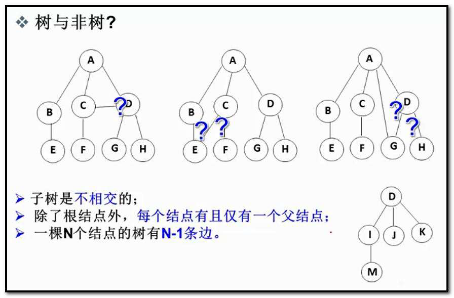

### 1.1 树的相关概念
> 树（Tree）是一种重要的数据结构，它在计算机科学中被广泛应用。树是由节点（Node）和边（Edge）组成的集合，节点之间通过边相连。树的一个特点是它是一个层次结构，顶部的节点称为根节（Root），最底部的节点称为叶节点（Leaf），中间的节点称为内部节点（Internal Node）。
>

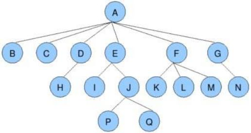


> **节点的度：** 一个节点含有的子树的个数称为该节点的度； 如上图：A的为6  
**叶节点或终端节点：** 度为0的节点称为叶节点； 如上图：B、C、H、I...等节点为叶节点  
**非终端节点或分支节点：** 度不为0的节点； 如上图：D、E、F、G...等节点为分支节点  
**双亲节点或父节点：** 若一个节点含有子节点，则这个节点称为其子节点的父节点； 如上图：A是B的父节点  
**孩子节点或子节点：** 一个节点含有的子树的根节点称为该节点的子节点； 如上图：B是A的孩子节点  
**兄弟节点：** 具有相同父节点的节点互称为兄弟节点； 如上图：B、C是兄弟节点  
**树的度：** 一棵树中，最大的节点的度称为树的度； 如上图：树的度为6  
**节点的层次：** 从根开始定义起，根为第1层，根的子节点为第2层，以此类推；  
**树的高度或深度：** 树中节点的最大层次； 如上图：树的高度为4  
**堂兄弟节点：** 双亲在同一层的节点互为堂兄弟；如上图：H、I互为兄弟节点  
**节点的祖先：** 从根到该节点所经分支上的所有节点；如上图：A是所有节点的祖先  
**子孙：** 以某节点为根的子树中任一节点都称为该节点的子孙。如上图：所有节点都是A的子孙  
**森林：** 由m（m>0）棵互不相交的树的集合称为森林；
>

## 二、树的表示
+ 有多种方法可以表示树，其中两种主要的表示方法是：儿子表示法（Child Representation）和父母表示法（Parent Representation）。此外，对于二叉树，还有更特定的表示方法，如数组表示法和链接表示法。

**儿子表示法（Child Representation）：**

+ 在儿子表示法中，每个节点包含一个指向其所有子节点的指针。这种表示方法通常用于多叉树，其中一个节点可以有多个子节点。

```c
    A
   / \
  B   C
 / \
D   E
```

**父母表示法（Parent Representation）：**

+ 在父母表示法中，每个节点包含一个指向其父节点的指针。这种表示方法通常用于树的深度优先遍历。

```csharp
codeA -> NULL
B -> A
C -> A
D -> B
E -> B
```

### 2.2 树在实际中的运用（表示文件系统的目录树结构）
+ 树结构在实际中广泛应用，而表示文件系统的目录树结构是树结构的一个典型应用之一。文件系统的目录结构可以很自然地用树来表示
+ 比如学过`Linux`的同学就知道这个linux是一个树状结构，**根**就是`/`

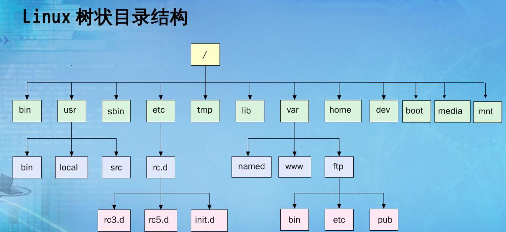

## 三、二叉树概念及结构
+ 二叉树（Binary Tree）是一种特殊的树结构，每个节点最多有两个子节点，分别称为左子节点和右子节点。二叉树的结构和性质使得它在计算机科学中有着广泛的应用。

### 3.1 二叉树的基本概念
+ **节点（Node）：** 二叉树的基本单元，每个节点包含一个数据元素和指向左右两个子节点的指针。
+ **根节点（Root）：** 二叉树的顶端节点，是树的起始点，没有父节点。
+ **叶节点（Leaf）：** 没有子节点的节点称为叶节点，位于树的末端。
+ **内部节点（Internal Node）：** 除了根和叶节点之外的节点，有至少一个子节点的节点称为内部节点。
+ **子节点（Child）：** 一个节点的直接下层节点称为其子节点。
+ **父节点（Parent）：** 一个节点的直接上层节点称为其父节点。
+ **兄弟节点（Sibling）：** 具有相同父节点的节点称为兄弟节点。
+ **深度（Depth）：** 一个节点到根节点的路径长度称为节点的深度，根节点的深度为0。
+ **高度（Height）：** 一个节点到其最远叶节点的路径长度称为节点的高度，树的高度是根节点的高度。

### 3.2 二叉树的结构：
#### a. 满二叉树（Full Binary Tree）：
+ 在满二叉树中，除了叶节点，每个节点都有两个子节点。所有叶节点都在同一层上。

```c
        1
      /   \
     2     3
    / \   / \
   4   5 6   7
```

#### b. 完全二叉树（Complete Binary Tree）：
+ 在完全二叉树中，除了最后一层的叶节点外，其他层都是满的，且最后一层的叶节点都靠左排列。

```c
        1
      /   \
     2     3
    / \   /
   4   5 6
```

#### c. 二叉搜索树（Binary Search Tree，BST）：
+ 在二叉搜索树中，每个节点的左子树都比该节点小，右子树都比该节点大，这使得查找、插入和删除等操作非常高效。

```c
        4
      /   \
     2     6
    / \   / \
   1   3 5   7
```

## 四、二叉树的应用
1. **搜索和排序：** 二叉搜索树用于实现快速的搜索和排序操作。
2. **表达式树：** 用于表示数学表达式，方便进行求值。
3. **文件系统：** 用于表示文件目录的层次结构。
4. **编译器：** 在语法分析阶段，使用语法树（通常是二叉树）表示程序的语法结构。
5. **哈夫曼树：** 用于数据压缩算法中构建最优的编码树。
6. **游戏树：** 在博弈论中，用于表示游戏的决策树。

## 五、二叉树的性质
1. **每个节点最多有两个子节点：** 每个节点最多有两个子节点，左子节点和右子节点。
2. **每个节点有零个、一个或两个子节点：** 这意味着一个节点可以是叶节点（没有子节点）、有一个子节点，或者有两个子节点。
3. **左子树和右子树是有序的：** 对于二叉搜索树（BST），左子树中的每个节点的值都小于该节点的值，右子树中的每个节点的值都大于该节点的值。
4. **树的高度：** 树的高度是从根节点到最深叶节点的最长路径。一棵有n个节点的二叉树的高度最多为n，最少为log₂(n+1)。
5. **最后一层节点集中在左侧：** 在完全二叉树中，最后一层的节点从左到右排列，缺失的位置只会出现在最右边。
6. **满二叉树：** 一棵高度为h且有2^h - 1个节点的二叉树被称为满二叉树。
7. **完全二叉树：** 一棵有n个节点的二叉树，如果从根节点到倒数第二层是一棵满二叉树，最后一层的节点都集中在左侧，那么它就是一棵完全二叉树。
8. **节点的编号：** 对于一棵二叉树，可以给每个节点按照从上到下、从左到右的顺序进行编号，编号从1开始。如果一个节点的编号为i，则它的左子节点的编号为2i，右子节点的编号为2i+1。

## 六、二叉树的存储结构
### 6.1 顺序存储结构
+ 在顺序存储结构中，使用数组来表示二叉树。具体的方式是按照从上到下、从左到右的顺序将二叉树的节点依次存储在数组中。如果一个节点的编号为i，则其左子节点的编号为2i，右子节点的编号为2i+1。

**例如：**

```c
        1
       / \
      2   3
     / \ / \
    4  5 6  7
```

+ 对应的顺序存储结构为：

```c
[1, 2, 3, 4, 5, 6, 7]
```

+ 这里数组的索引从1开始，根节点对应索引1，而左子节点和右子节点的关系则按照 2i 和 2i+1 的规则排列。

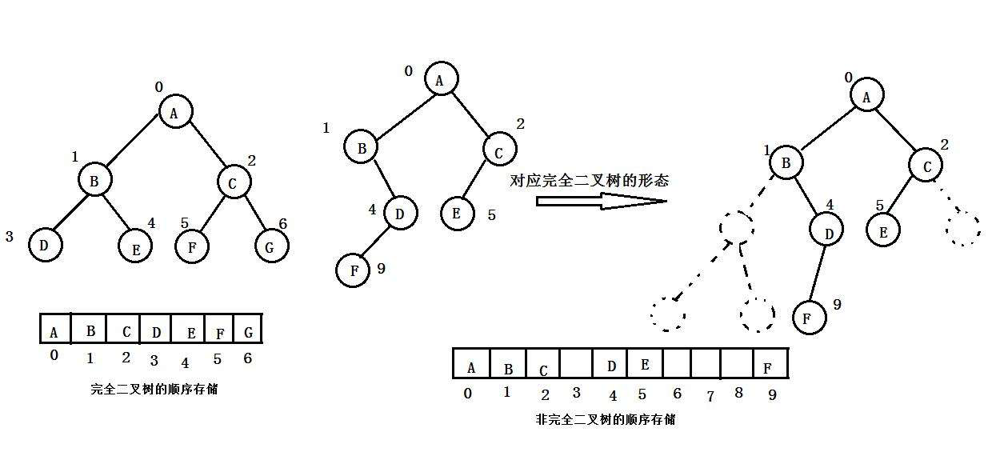

### 6.2 链式存储结构
+ 在链式存储结构中，每个节点通过指针或引用指向其左子节点和右子节点。这样的存储结构更加直观，也更容易实现。节点的定义如下：

```c
struct TreeNode {
    int data; // 节点的数据
    TreeNode* left; // 指向左子节点的指针
    TreeNode* right; // 指向右子节点的指针
};
```

```c
        1
       / \
      2   3
     / \ / \
    4  5 6  7
```

每个节点的 `left` 和 `right` 指针分别指向其左子节点和右子节点。这种存储结构更直观，但相对于顺序存储结构，可能会占用更多的内存空间。

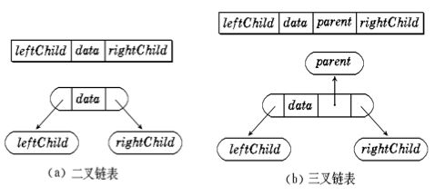

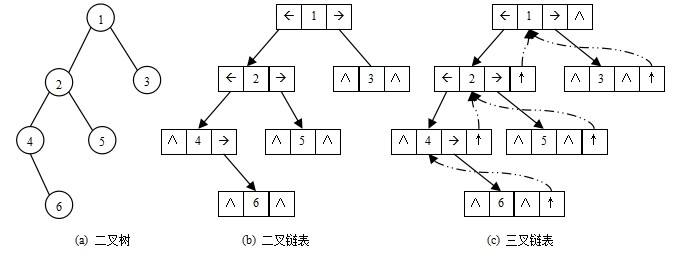

```c
typedef int BTDataType;
// 二叉链
struct BinaryTreeNode
{
    struct BinTreeNode* _pLeft; // 指向当前节点左孩子
    struct BinTreeNode* _pRight; // 指向当前节点右孩子
    BTDataType _data; // 当前节点值域
}
// 三叉链
struct BinaryTreeNode
{
    struct BinTreeNode* _pParent; // 指向当前节点的双亲
    struct BinTreeNode* _pLeft; // 指向当前节点左孩子
    struct BinTreeNode* _pRight; // 指向当前节点右孩子
    BTDataType _data; // 当前节点值域
}；
```

### 6.3 二叉树的顺序结构及实现
+ 普通的二叉树是不适合用数组来存储的，因为可能会存在大量的空间浪费。而完全二叉树更适合使用顺序结构存储。现实中我们通常把堆(一种二叉树)使用顺序结构的数组来存储，需要注意的是这里的堆和操作系统虚拟进程地址空间中的堆是两回事，一个是数据结构，一个是操作系统中管理内存的一块区域分段。


## 七、二叉树链式结构的实现
+ 在学习二叉树的基本操作前，需先要创建一棵二叉树，然后才能学习其相关的基本操作。由于现在大家对二叉树结构掌握还不够深入，为了降低大家学习成本，此处手动快速创建一棵简单的二叉树，快速进入二叉树操作学习，等二叉树结构了解的差不多时，我们反过头再来研究二叉树真正的创建方式。
+ 我们先回顾一下二叉树的概念：

> 1. 空树
> 2. 非空：根节点，根节点的左子树、根节点的右子树组成的。
>

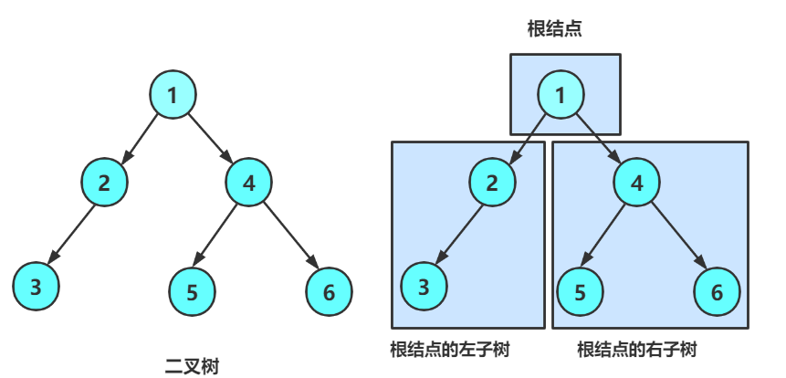

> 从概念中可以看出，二叉树定义是递归式的，因此后序基本操作中基本都是按照该概念实现的。
>

## 八、二叉树的遍历【重点】
### 8.1 前序、中序以及后序遍历
1. 前序遍历(Preorder Traversal 亦称先序遍历)——访问根结点的操作发生在遍历其左右子树之前。简单来说就是**访问顺序就是**`根`** **`左子树`** **`右子树`
2. 中序遍历(Inorder Traversal)——访问根结点的操作发生在遍历其左右子树之中（间）。简单来说就是**访问顺序就是 **`左子树`** **`根`** **`右子树`
3. 后序遍历(Postorder Traversal)——访问根结点的操作发生在遍历其左右子树之后。简单来说就是**访问顺序就是 **`左子树`**  **`右子树`** **`根`

## 九、实现链式结构二叉树
### 9.1 Tree.h
```c
#pragma once

#include<stdio.h>
#include<stdlib.h>
#include<assert.h>
typedef int BTDataType;

typedef struct BinaryTreeNode
{
    BTDataType data;
    struct BinaryTreeNode* left;
    struct BinaryTreeNode* right;
}BTNode;

//创建节点
BTNode* BuyTreeNode(int x);
//创建树
BTNode* CreateTree();
// 二叉树销毁
void BinaryTreeDestory(BTNode** root);
// 二叉树节点个数
int BinaryTreeSize(BTNode* root);
// 二叉树叶子节点个数
int BinaryTreeLeafSize(BTNode* root);
// 二叉树第k层节点个数
int BinaryTreeLevelKSize(BTNode* root, int k);
// 二叉树查找值为x的节点
BTNode* BinaryTreeFind(BTNode* root, BTDataType x);
// 二叉树前序遍历 
void BinaryTreePrevOrder(BTNode* root);
// 二叉树中序遍历
void BinaryTreeInOrder(BTNode* root);
// 二叉树后序遍历
void BinaryTreePostOrder(BTNode* root);
// 层序遍历
void BinaryTreeLevelOrder(BTNode* root);
// 判断二叉树是否是完全二叉树
int BinaryTreeComplete(BTNode* root);
// 求树的高度
int TreeHeight(BTNode* root);
//⼆叉树的深度/⾼度
int BinaryTreeDepth(BTNode* root);
```

### 9.2 创建节点 && 创建树
```c
//创建节点
BTNode* BuyTreeNode(int x)
{
    BTNode* root = (BTNode*)malloc(sizeof(BTNode));
    if (root == NULL)
    {
        perror("malloc fail\n");
        exit(-1);
    }
    root->data = x;
    root->left = NULL;
    root->right = NULL;
    return root;
}
//创建树
BTNode* CreateTree()
{
    BTNode* node1 = BuyTreeNode(1);
    BTNode* node2 = BuyTreeNode(2);
    BTNode* node3 = BuyTreeNode(3);
    BTNode* node4 = BuyTreeNode(4);
    BTNode* node5 = BuyTreeNode(5);
    BTNode* node6 = BuyTreeNode(6);
    BTNode* node7 = BuyTreeNode(7);

    node1->left = node2;
    node1->right = node4;
    node2->left = node3;
    node4->left = node5;
    node4->right = node6;
    node5->right = node7;

    return node1;
}
```

### 9.3 二叉树的前中后序遍历
+ 这里也是很简单，也可以看做下图这样遍历，或者画一下递归展开图

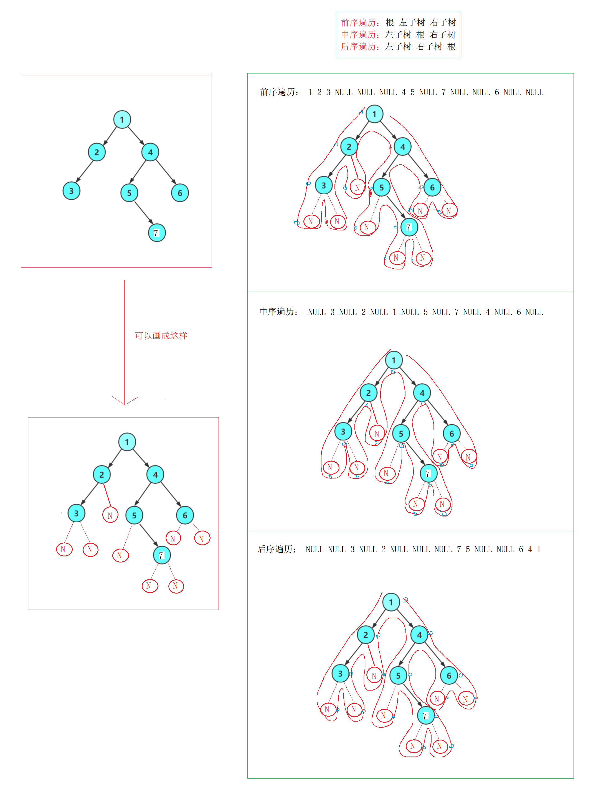

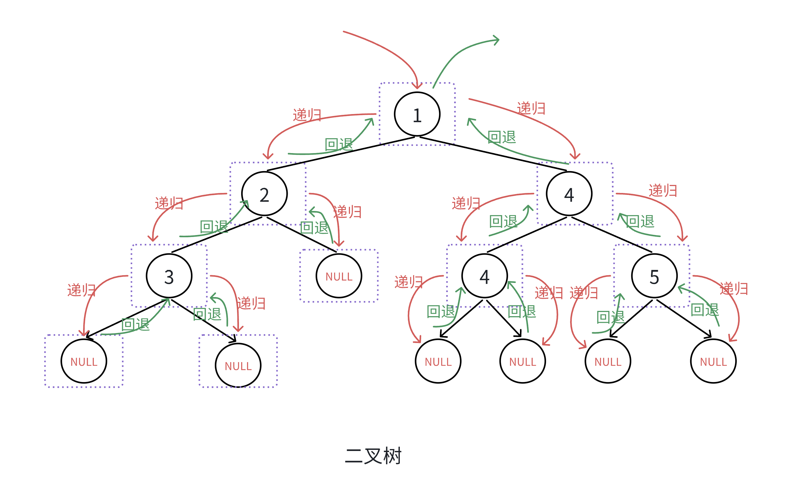

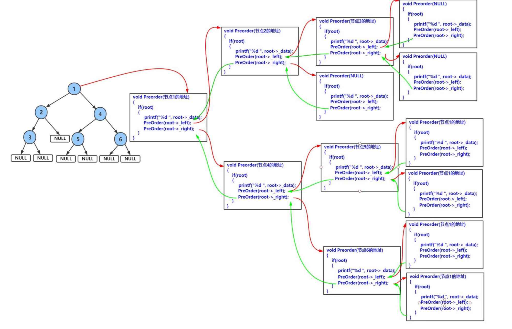

```c
// 二叉树前序遍历 
void BinaryTreePrevOrder(BTNode* root)
{
    if (root == NULL)
    {
        printf("NULL ");
        return;
    }

    printf("%d ", root->data);
    BinaryTreePrevOrder(root->left);
    BinaryTreePrevOrder(root->right);
}
// 二叉树中序遍历
void BinaryTreeInOrder(BTNode* root)
{
    if (root == NULL)
    {
        printf("NULL ");
        return;
    }

    BinaryTreeInOrder(root->left);
    printf("%d ", root->data);
    BinaryTreeInOrder(root->right);
}
// 二叉树后序遍历
void BinaryTreePostOrder(BTNode* root)
{
    if (root == NULL)
    {
        printf("NULL ");
        return;
    }

    BinaryTreePostOrder(root->left);
    BinaryTreePostOrder(root->right);
    printf("%d ", root->data);
}
```

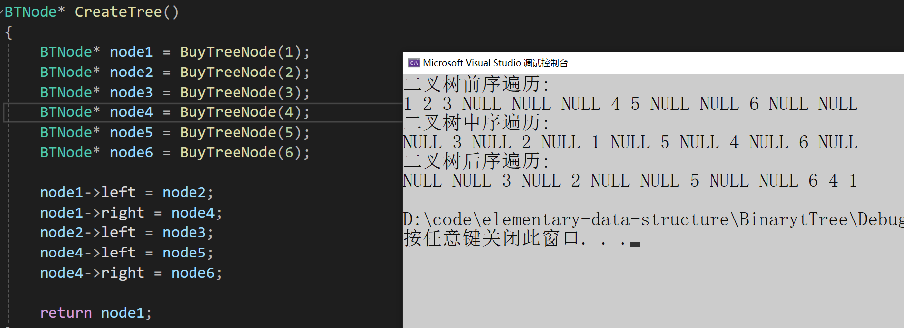

### 9.4 二叉树节点个数
+ 我们这里看一下递归展开图

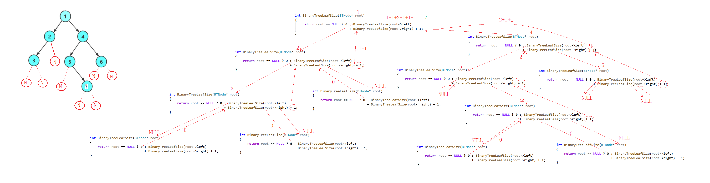

```c
int BinaryTreeSize(BTNode* root)
{
    return root == NULL ? 0 : BinaryTreeSize(root->left)
                            + BinaryTreeSize(root->right);
}
```

### 9.5 二叉树叶子节点个数
+ 为空就返回0
+ 不是空，是叶子，返回1
+ 不是空，也不是叶子，就递归左子树和右子树

```c
int BinaryTreeLeafSize(BTNode* root)
{
    // 为空返回0
    if (root == NULL)
        return 0;
    //不是空，是叶子 返回1
    if (root->left == NULL && root->right == NULL)
        return 1;
    // 不是空 也不是叶子  分治=左右子树叶子之和
    return BinaryTreeLeafSize(root->left)
       	 + BinaryTreeLeafSize(root->right);
}
```

### 9.6 二叉树第k层节点个数
+ k是1的时候就是一层，就返回1
+ 递归左子树加右子树，每次递归k-1

```c
int BinaryTreeLevelKSize(BTNode* root, int k)
{
    if (root == NULL)
        return NULL;

    if (k == 1)
        return 1;

    //递归左子树加右子树，每次递归k-1
    return BinaryTreeLevelKSize(root->left, k - 1)
     	 + BinaryTreeLevelKSize(root->right, k - 1);
}
```

### 9.7 二叉树查找值为x的节点
+ 先看根节点是不是要找的
+ 然后递归左子树和右子树

```c
BTNode* BinaryTreeFind(BTNode* root, BTDataType x)
{
    if (root == NULL)
        return NULL;
    //根
    if (root->data == x)
        return root;

    //左子树
    BTNode* ret1 = BinaryTreeFind(root->left, x);
    if (ret1)
        return ret1;
    
    //右子树
    BTNode* ret2 = BinaryTreeFind(root->right, x);
    if (ret2)
        return ret2;

    return NULL;
}
```

### 9.8 二叉树求树的高度
+ 遍历左子树和右子树（每次遍历都要保存值）
+ 返回最高的那个子树然后加1（根）

```c
int TreeHeight(BTNode* root)
{
    if (root == NULL)
        return NULL;

    //遍历左子树和右子树
    int left = TreeHeight(root->left);
    int right = TreeHeight(root->right);

    //返回最高的那个子树然后加1（根）
    return left > right ? left + 1 : right + 1;
}
```

### 9.9 二叉树的层序遍历
除了先序遍历、中序遍历、后序遍历外，还可以对二叉树进行层序遍历。设二叉树的根结点所在层数为1，层序遍历就是从所在二叉树的根结点出发，首先访问第一层的树根结点，然后从左到右访问第2层上的结点，接着是第三层的结点，以此类推，自上而下，自左至右逐层访问树的结点的过程就是层序遍历

实现层序遍历需要额外借助数据结构：队列

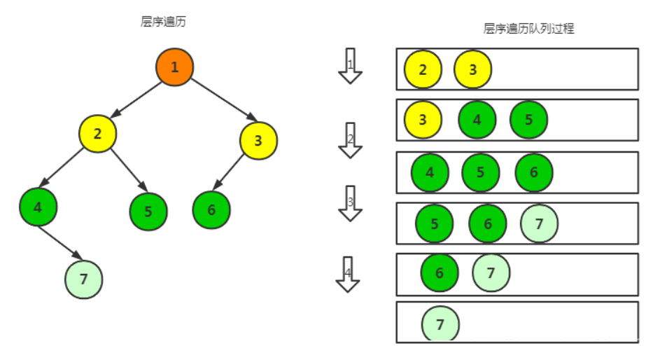

```c
void BinaryTreeLevelOrder(BTNode* root)
{
    Queue q;
    QueueInit(&q);
    //先入根
    if (root)
        QueuePush(&q, root);

    while (!QueueEmpty(&q))
    {
        //取队头的数据
        BTNode* front = QueueFront(&q);
        QueuePop(&q);

        //打印数据
        printf("%d ", front->data);

        //将左子树和右子树代入进队列
        if (front->left)
            QueuePush(&q, front->left);

        if (front->right)
            QueuePush(&q, front->right);
    }
    printf("\n");

    QueueDestroy(&q);
}
```

+ 那如果要一层一层的打印，代码改怎么改呢？

一层一层的带，一层一层的出

```c
// 层序遍历(一层一层的打印)
void _BinaryTreeLevelOrder(BTNode* root)
{
    Queue q;
    QueueInit(&q);
    //先入根
    if (root)
        QueuePush(&q, root);

    int leveSize = 1;
    while (!QueueEmpty(&q))
    {
        while (leveSize--)
        {
            //取队头的数据
            BTNode* front = QueueFront(&q);
            QueuePop(&q);

            printf("%d ", front->data);

            if (front->left)
                QueuePush(&q, front->left);

            if (front->right)
                QueuePush(&q, front->right);
        }
        printf("\n");
        leveSize = QueueSize(&q);
    }
    QueueDestroy(&q);
}
```

### 9.10 判断二叉树是否是完全二叉树
+ 和上面的代码基本一样，取数据如果遇到空就跳出
+ 如果前面遇到空以后，后面还有非空就不是完全二叉树

```c
// 判断二叉树是否是完全二叉树
bool BinaryTreeComplete(BTNode* root)
{
    Queue q;
    QueueInit(&q);
    //先入根
    if (root)
        QueuePush(&q, root);

    while (!QueueEmpty(&q))
    {
        // 取队头的数据
        BTNode* front = QueueFront(&q);
        QueuePop(&q);

        //等于空了就跳出，然后检查后面还有节点没有
        if (front == NULL)
            break;

        // 将左子树和右子树代入进队列
        QueuePush(&q, front->left);
        QueuePush(&q, front->right);

    }

    // 前面遇到空以后，后面还有非空就不是完全二叉树
    while (!QueueEmpty(&q))
    {
        BTNode* front = QueueFront(&q);
        QueuePop(&q);

        // 如果是不是空就 return false;
        if (front)
        {
            QueueDestroy(&q);
            return false;
        }
    }

    QueueDestroy(&q);
    return true;
}
```

### 9.11 二叉树的深度度/高度
```c
int BinaryTreeDepth(BTNode* root) {
    if (root == NULL)
        return 0;
    int left = BinaryTreeDepth(root->left);
    int right = BinaryTreeDepth(root->right);
    return 1 + (left > right ? left : right);
}
```

### 9.12 销毁二叉树
```c
void BinaryTreeDestory(BTNode** root) {
    if (*root == NULL)
        return;
    BinaryTreeDestory(&(*root)->left);
    BinaryTreeDestory(&(*root)->right);
    free(*root);
    *root = NULL;
}
```

## 十、OJ练习
### 10.1 单值二叉树
[965. 单值二叉树 - 力扣（LeetCode）](https://leetcode.cn/problems/univalued-binary-tree/description/)

```c
bool isUnivalTree(struct TreeNode* root) {
    if (root == NULL)
        return true;

    if ((root->left && root->val != root->left->val) ||
        (root->right && root->val != root->right->val))
        return false;

    return isUnivalTree(root->left) && isUnivalTree(root->right);
}
```

### 10.2 相同的树
[100. 相同的树 - 力扣（LeetCode）](https://leetcode.cn/problems/same-tree/description/)

```c
bool isSameTree(struct TreeNode* p, struct TreeNode* q) {
    if (p == NULL && q == NULL)
        return true;
    if (p == NULL || q == NULL)
        return false;
    if (p->val != q->val)
        return false;

    return isSameTree(p->left, q->left) && isSameTree(p->right, q->right);
}
```

### 10.3 对称二叉树
[101. 对称二叉树 - 力扣（LeetCode）](https://leetcode.cn/problems/symmetric-tree/description/)

```c
bool _isSymmetric(struct TreeNode* root1, struct TreeNode* root2) {
    // 如果两个都相等为空，就返回true
    if (root1 == NULL && root2 == NULL)
        return true;

    // 一个为空，一个不为空
    if (root1 == NULL || root2 == NULL)
        return false;

    // 都不为空,就比较值
    if (root1->val != root2->val)
        return false;

    // 遍历root1的左，和2右
    // 1的右和2的左
    return _isSymmetric(root1->left, root2->right) &&
           _isSymmetric(root1->right, root2->left);
}

bool isSymmetric(struct TreeNode* root) {
    return _isSymmetric(root->left, root->right);
}
```

### 10.4 另一棵树的子树
[572. 另一棵树的子树 - 力扣（LeetCode）](https://leetcode.cn/problems/subtree-of-another-tree/description/)

```c
bool isSameTree(struct TreeNode* p, struct TreeNode* q) {
    if (p == NULL && q == NULL)
        return true;
    if (p == NULL || q == NULL)
        return false;
    if (p->val != q->val)
        return false;

    return isSameTree(p->left, q->left) && isSameTree(p->right, q->right);
}
bool isSubtree(struct TreeNode* root, struct TreeNode* subRoot) {
    if (root == NULL)
        return false;

    return isSameTree(root, subRoot) || isSubtree(root->left, subRoot) ||
           isSubtree(root->right, subRoot);
}
```

### 10.5 二叉树遍历
#### 前序遍历：
[144. 二叉树的前序遍历 - 力扣（LeetCode）](https://leetcode.cn/problems/binary-tree-preorder-traversal/description/)

```c
int TreeSize(struct TreeNode* root) {
    if (root == NULL)
        return 0;
    return 1 + TreeSize(root->left) + TreeSize(root->right);
}

void PreOrder(struct TreeNode* root, int* a, int* pi) {
    if (root == NULL)
        return;

    a[(*pi)++] = root->val;
    PreOrder(root->left, a, pi);
    PreOrder(root->right, a, pi);
}

int* preorderTraversal(struct TreeNode* root, int* returnSize) {
    // 查看树有多少个节点
    *returnSize = TreeSize(root);
    int* a = (int*)malloc(sizeof(int) * *returnSize);
    int i = 0;
    PreOrder(root, a, &i);
    return a;
}
```

#### 中序遍历：
[94. 二叉树的中序遍历 - 力扣（LeetCode）](https://leetcode.cn/problems/binary-tree-inorder-traversal/description/)

```c
int TreeSize(struct TreeNode* root) {
    if (root == NULL)
        return 0;
    return 1 + TreeSize(root->left) + TreeSize(root->right);
}

void PreOrder(struct TreeNode* root, int* a, int* pi) {
    if (root == NULL)
        return;

    PreOrder(root->left, a, pi);
    a[(*pi)++] = root->val;
    PreOrder(root->right, a, pi);
}

int* inorderTraversal(struct TreeNode* root, int* returnSize) {
    // 查看树有多少个节点
    *returnSize = TreeSize(root);
    int* a = (int*)malloc(sizeof(int) * *returnSize);
    int i = 0;
    PreOrder(root, a, &i);
    return a;
}
```

#### 后序遍历：
[145. 二叉树的后序遍历 - 力扣（LeetCode）](https://leetcode.cn/problems/binary-tree-postorder-traversal/description/)

```c
int TreeSize(struct TreeNode* root) {
    if (root == NULL)
        return 0;
    return 1 + TreeSize(root->left) + TreeSize(root->right);
}

void PreOrder(struct TreeNode* root, int* a, int* pi) {
    if (root == NULL)
        return;

    PreOrder(root->left, a, pi);
    PreOrder(root->right, a, pi);
    a[(*pi)++] = root->val;
}

int* postorderTraversal(struct TreeNode* root, int* returnSize) {
    // 查看树有多少个节点
    *returnSize = TreeSize(root);
    int* a = (int*)malloc(sizeof(int) * *returnSize);
    int i = 0;
    PreOrder(root, a, &i);
    return a;
}
```

### 10.6 二叉树的构建及遍历
[二叉树遍历_牛客题霸_牛客网](https://www.nowcoder.com/practice/4b91205483694f449f94c179883c1fef)

```c
#include <stdio.h>
#include <stdlib.h>

typedef struct ListNode {
    char val;
    struct ListNode* left;
    struct ListNode* right;
} ListNode;

ListNode* ListBuyNode(char* a, int* pi) {
    if (a[*pi] == '#') {
        (*pi)++;
        return NULL;
    }

    ListNode* root = (ListNode*)malloc(sizeof(ListNode));
    root->val = a[*pi];
    (*pi)++;
    root->left = ListBuyNode(a, pi);
    root->right = ListBuyNode(a, pi);
    return root;
}

void PreOrder(ListNode* root) {
    if (root == NULL)
        return;
    PreOrder(root->left);
    printf("%c ", root->val);
    PreOrder(root->right);
}

int main() {
    char ch[100];
    scanf("%s", ch);
    int i = 0;
    ListNode* root = ListBuyNode(ch, &i);
    PreOrder(root);
    return 0;
}
```

## 十一、二叉树选择题
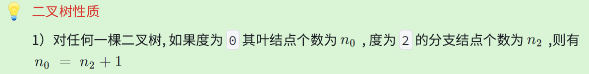

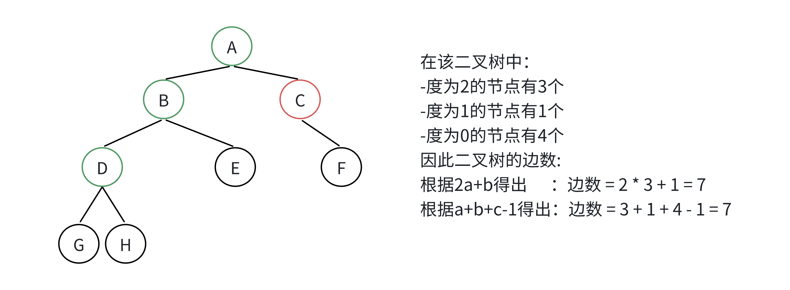

证明上述性质：

假设一个二叉树有a个度为2的节点， b 个度为1的节点， c 个叶节点，则这个二叉树的边数是`2a+b`

另一方面，由于共有`a+b+c`个节点，所以边数等于`a+b+c-1`

结合上面两个公式：`2a+b = a+b+c-1` ，即： `a = c-1`

### 根据二叉树的性质完成以下选择题：
1. 某二叉树共有 399 个结点，其中有 199 个度为 2 的结点，则该二叉树中的叶子结点数为（ ）

> A 不存在这样的二叉树             B 200                 C 198                D 199
>

n0 = n2 + 1 ---> 200 = 199 + 1

2.在具有 2n 个结点的完全二叉树中，叶子结点个数为（ ）

> A n                    B n+1                           C n-1                     D n/2
>

n0 + n1 + n2 = 2n

2n0 + n1 - 1 = 2n

2n0 - 1=2n--->n0=n+1/2  ❌

2n0 = 2n --->n0 = n

3.一棵完全二叉树的结点数位为531个，那么这棵树的高度为（ ）

> A 11                     B 10                               C 8                        D 12
>

n = 2^h-1 ---> h = log(n+1) = log(532) ---> 2^10

4.一个具有767个结点的完全二叉树，其叶子结点个数为（）

> A 383                 B 384                                 C 385                  D 386
>

n1 = 1：2n0 = 797 ---> n0 = 383.5 ❌

n1 = 0：2n0 = 768 ---> n0 = 384

---

答案：

> 1.B                         2.A                                      3.B                       4.B
>

### 链式二叉树遍历选择题
1.某完全二叉树按层次输出（同一层从左到右）的序列为 ABCDEFGH 。该完全二叉树的前序序列为（）

> A ABDHECFG              B ABCDEFGH              C HDBEAFCG                  D HDEBFGCA
>

2.二叉树的先序遍历和中序遍历如下：先序遍历：EFHIGJK;中序遍历：HFIEJKG.则二叉树根结点为（）

> A E                              B F                             C G                                     D H
>

3.设一课二叉树的中序遍历序列：badce，后序遍历序列：bdeca，则二叉树前序遍历序列为____。

> A adbce                     B decab                       C debac                         D abcde
>

4.某二叉树的后序遍历序列与中序遍历序列相同，均为 ABCDEF ，则按层次输出（同一层从左到右）的序列为

> A FEDCBA                  B CBAFED                   C DEFCBA                      D ABCDEF
>

---

答案：

> 1.A                                 2.A                                 3.D                                4.A
>


