常见的排序算法：

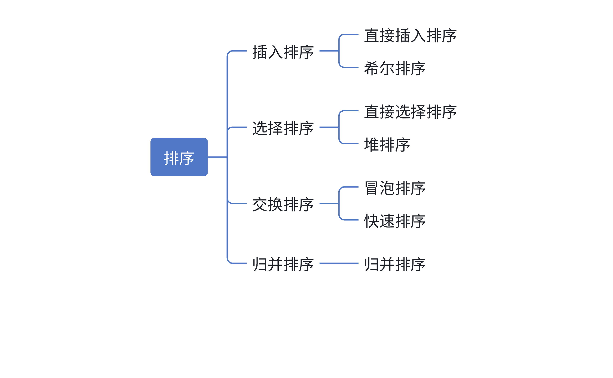

排序算法是一种将一组数据按照特定顺序排列的算法。数据结构排序算法的选择取决于数据的特征、规模和性能需求。

```c
#include<stdio.h>
#include<stdlib.h>
#include<string.h>
#include<stdbool.h>
#include<time.h>
// 打印
void Print_a(int* a, int sz);
// 交换
void Swap(int* p1, int* p2);
// 插入排序
void InsertSort(int* a, int n);
// 冒泡排序
void BubbleSort(int* a, int n);
// 希尔排序
void ShellSort(int* a, int n);
// 堆排序
void AdjustDwon(int* a, int n, int root);
void HeapSort(int* a, int n);
// 选择排序
void SelectSort(int* a, int n);
// ------------------------------------------------------
// 快速排序hoare版本 
int PartSort1(int* a, int begin, int end);
// 快速排序挖坑法
int PartSort2(int* a, int begin, int end);
// 快速排序前后指针法 
int PartSort3(int* a, int begin, int end);
// 排序函数
void QuickSort(int* a, int begin, int end);
//------------------------------------------------------
// 快速排序 非递归实现 
void QuickSortNonR(int* a, int begin, int end);
// 归并排序递归实现 
void MergeSort(int* a, int n);
// 归并排序非递归实现 
void MergeSortNonR(int* a, int n);
// 非比较排序
void CountSort(int* a, int n);
```

# 冒泡排序
冒泡排序是一种基本的排序算法，其核心思想是通过多次交换相邻元素的位置，使得每一轮循环都将最大（或最小）的元素移动到序列的最后。这个过程就像气泡逐渐上升到表面一样，因而得名"冒泡排序"。

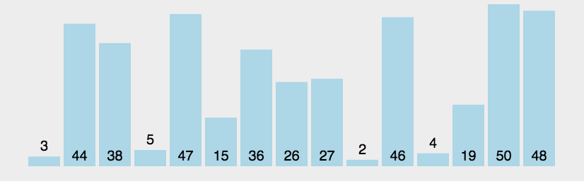

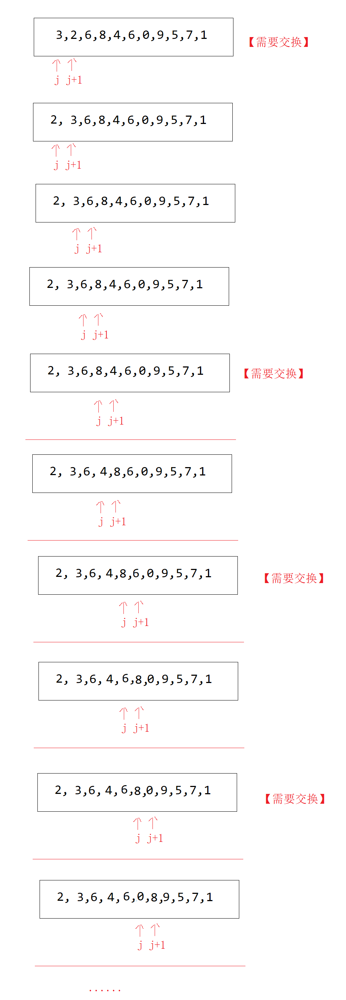  
**代码实现：**

```c
void bubbleSort(int* a,int n)
{
    for (int i = 0; i < n-1; i++)
    {
        for (int j = 0; j < n - 1 - i; j++)
        {
            if (a[j] > a[j + 1])
            {
                Swap(&a[j], &a[j + 1]);
            }
        }
    }
}
```

1. 时间复杂度： O(N^2)
2. 空间复杂度： O(1)

# 插入排序
插入排序是一种简单直观的排序算法，其核心思想是将一个元素插入到已经排好序的数组（或子数组）中的合适位置，以达到整体有序的效果。插入排序的工作方式类似于整理扑克牌的过程：手里的牌是已经有序的部分，新摸到的牌则需要插入到适当的位置，保持有序性。

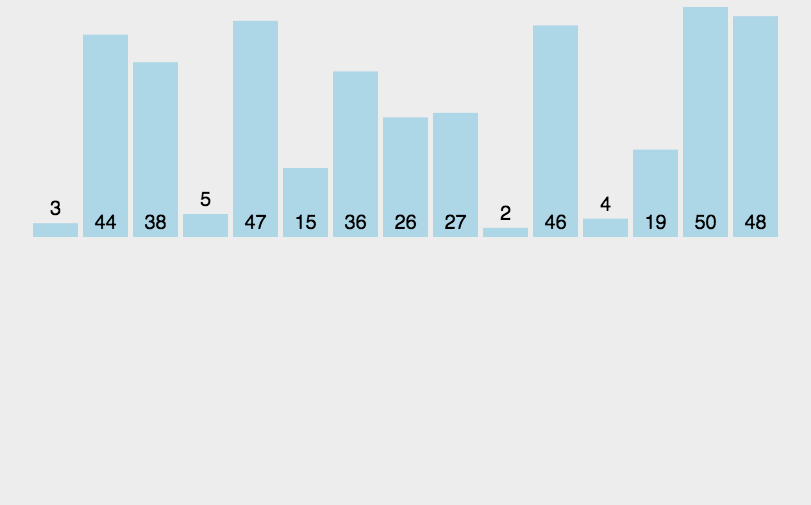

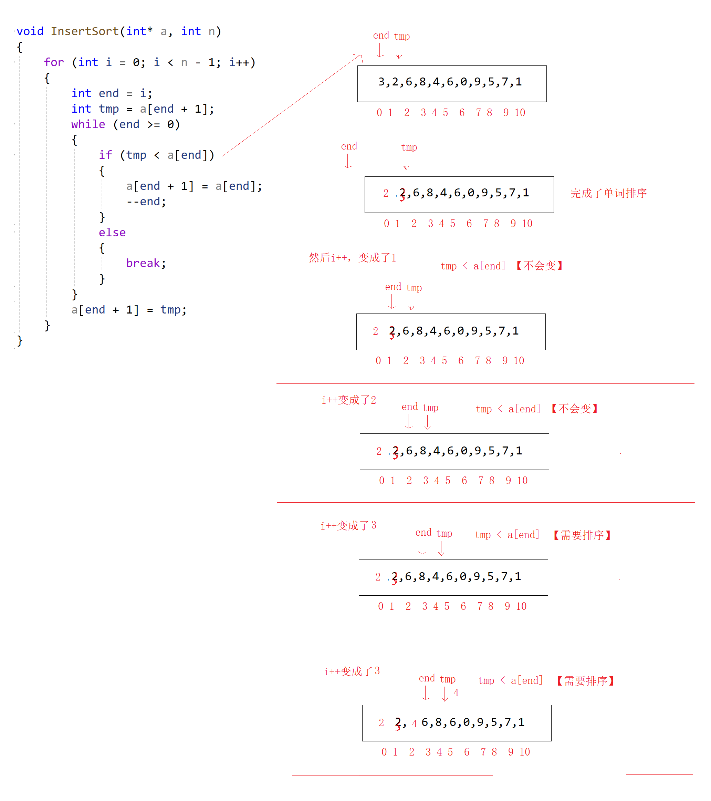  
**代码实现：**

```c
void InsertSort(int* a, int n)
{
    for (int i = 0; i < n - 1; i++)
    {
        // 记录每次i的位置
        int end = i;
        // 将i+1的位置保存
        int tmp = a[end + 1];
        // 一次排序
        while (end >= 0)
        {
            // 如果后面的数字小于前面的那一个就进行往后覆盖，
            // 然后end--，继续排序
            if (tmp < a[end])
            {
                a[end + 1] = a[end];
                --end;
            }
            else
            {
                // 如果大于或者等于了就跳出
                break;
            }
        }
        // 因为--end了，所以就要在end+1的位置放刚刚保存的值tmp
        a[end + 1] = tmp;
    }
}
```

1. 元素集合越接近有序，直接插入排序算法的时间效率越高
2. 时间复杂度：O(N^2)
3. 空间复杂度：O(1)

# 希尔排序
希尔排序法又称缩小增量法。希尔排序法的基本思想是：先选定一个整数（通常是gap = n/3+1），把待排序文件所有记录分成各组，所有的距离相等的记录分在同一组内，并对每一组内的记录进行排序，然后gap=gap/3+1得到下一个整数，再将数组分成各组，进行插入排序，当gap=1时，就相当于直接插入排序。

它是在直接插入排序算法的基础上进行改进而来的，综合来说它的效率肯定是要高于直接插入排序算法的。

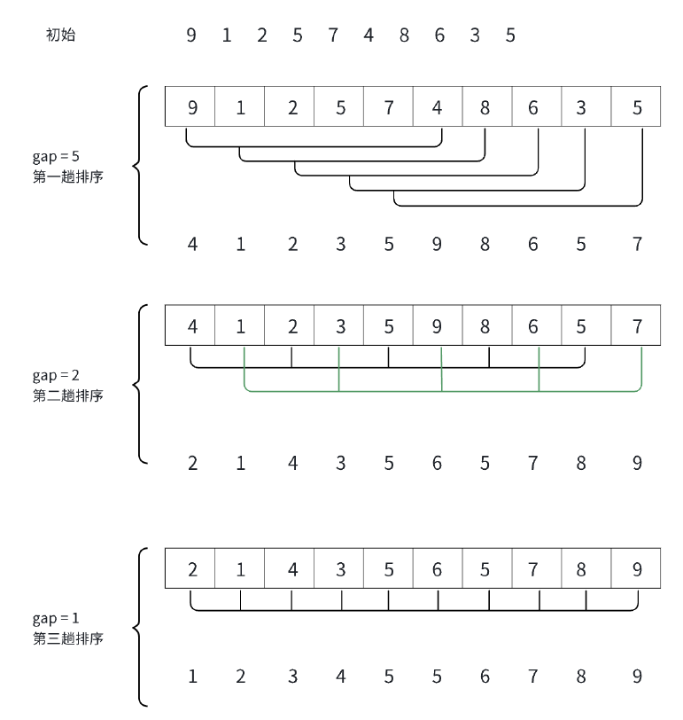

**代码实现：**

```c
void ShellSort(int* a, int n)
{
    int gap = n;
    
    // gap > 1时是预排序，目的让他接近有序
    // gap == 1是直接插入排序，目的是让他有序
    while (gap > 1)
    {
        // gap = gap / 2; // log 2 N
        gap = gap / 3 + 1; // log 3 N

        //每次排gap次
        for (int j = 0; j < n - gap; j++)
        {
            //插入排序
            int end = j;
            int tmp = a[end + gap];
            while (end >= 0)
            {
                if (tmp < a[end])
                {
                    a[end + gap] = a[end];
                    end -= gap;
                }
                else
                {
                    break;
                }
            }
            a[end + gap] = tmp;
        }
    }
}
```

1. 希尔排序是对直接插入排序的优化。
2. 当gap > 1 时都是预排序，目的是让数组更接近于有序。当gap == 1 时，数组已经接近有序的了，这样就会很快。这样整体而言，可以达到优化的效果。

> 希尔排序的时间复杂度估算：
>

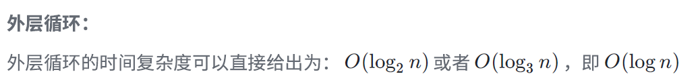

**内层循环：**

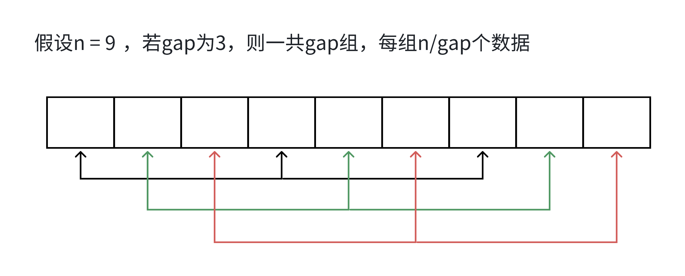

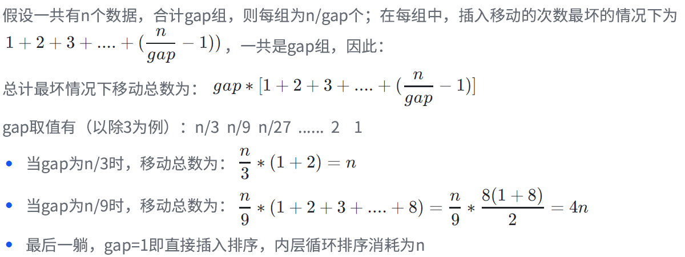

通过以上的分析，可以画出这样的曲线图：

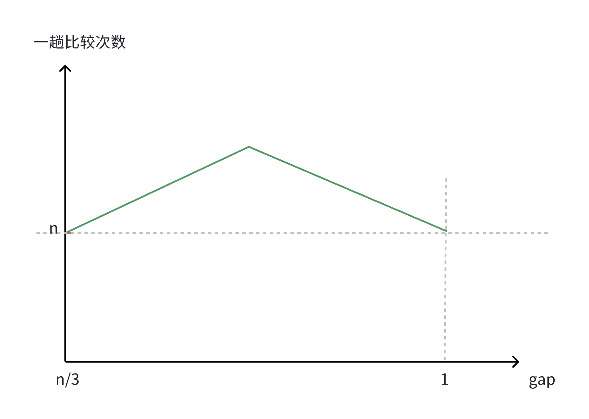因此，希尔排序在最初和最后的排序的次数都为n，即前一阶段排序次数是逐渐上升的状态，当到达某一顶点时，排序次数逐渐下降至n，而该顶点的计算暂时无法给出具体的计算过程

希尔排序时间复杂度不好计算，因为gap 的取值很多，导致很难去计算，因此很多书中给出的希尔排序的时间复杂度都不固定。《数据结构(C语言版)》--- 严蔚敏书中给出的时间复杂度为：

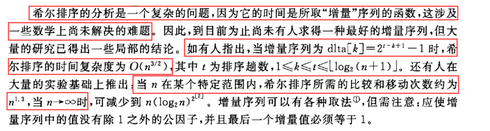

# 选择排序
+ 选择排序（Selection Sort）是一种简单直观的排序算法，其基本思想是通过不断选择未排序序列中的最小（或最大）元素，将其与未排序序列的第一个元素交换，从而逐步构建有序序列。


**代码实现：**

```c
// 选择排序
void SelectSort(int* a, int n)
{
    int begin = 0, end = n - 1;
    while (begin < end)
    {
        // 两头找
        int mini = begin, maxi = begin;
        for (int i = begin + 1; i <= end; i++)
        {
            // 如果i的位置比mini小就更新一下
            if (a[i] < a[mini])
            {
                mini = i;
            }
            //如果i的位置比maxi大就更新一下
            if (a[i] > a[maxi])
            {
                maxi = i;
            }
        }
        // 走到这里就说明小的要和左边交换一下
        Swap(&a[mini], &a[begin]);
        // 注意：这里Eugene左边的和maxi相等了要更新一下maxi
        if (begin == maxi)
        {
            maxi = mini;
        }
        // 然后交换maxi和end
        Swap(&a[end], &a[maxi]);
        ++begin;
        --end;
    }
}
```

1. 直接选择排序思考非常好理解，但是效率不是很好。实际中很少使用
2. 时间复杂度： O(N^2)
3. 空间复杂度： O(1)

# 堆排序
+ 堆排序是一种基于二叉堆数据结构的排序算法。它利用了堆的性质来进行排序，其中堆分为最大堆和最小堆两种类型。在最大堆中，父节点的值大于或等于其子节点的值；在最小堆中，父节点的值小于或等于其子节点的值。

需要注意的是排升序要建大堆，排降序建小堆。

**代码实现：**

```c
void AdjustDwon(int* a, int n, int root)
{
    int parent = root;
    int child = parent * 2 + 1;
    while (child < n)
    {
        if (child + 1 < n && a[child + 1] > a[child])
            ++child;

        if (a[child] > a[parent])
        {
            Swap(&a[child], &a[parent]);

            parent = child;
            child = parent * 2 + 1;
        }
        else
        {
            break;
        }
    }
}

void HeapSort(int* a, int n)
{
    for (int i = (n - 1 - 1) / 2; i >= 0; i--)
    {
        AdjustDwon(a, n, i);
    }

    int end = n - 1;
    while (end > 0)
    {
        Swap(&a[0], &a[end]);
        AdjustDwon(a, end, 0);
        --end;
    }
}
```

# 快速排序-->交换排序
## 三数取中
```c
int GetMidi(int* a, int left, int right)
{
    //int midi = (begin + end) / 2;
    int mid = (left + right) >> 1;
    if (a[left] < a[mid])
    {
        if (a[mid] < a[right])
            return mid;
        else if (a[left] > a[right])
            return left;
        else
            return right;
    }
    else // a[left] > a[mid]
    {
        if (a[mid] > a[right])
            return mid;
        else if (a[left] < a[right])
            return left;
        else
            return right;
    }
}
```

## 快速排序hoare版本
快速排序是一种常用的排序算法，Hoare版本是其中一种实现方式，由[Tony Hoare](https://zh.wikipedia.org/wiki/%E6%9D%B1%E5%B0%BC%C2%B7%E9%9C%8D%E7%88%BE)提出。

1）创建左右指针，确定基准值

2）从右向左找出比基准值小的数据，从左向右找出比基准值大的数据，左右指针数据交换，进入下次循环

> 问题1：为什么跳出循环后right位置的值一定不大于key？
>

当left > right 时，即right走到left的左侧，而left扫描过的数据均不大于key，因此right此时指向的数据一定不大于key

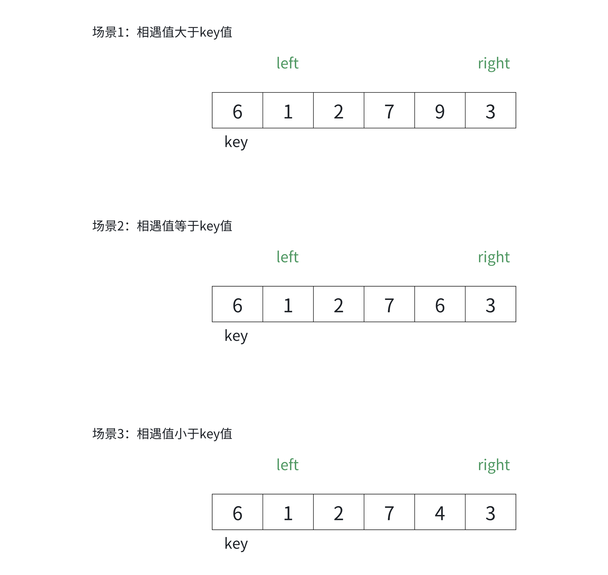

> 问题2：为什么left 和 right指定的数据和key值相等时也要交换？
>

相等的值参与交换确实有一些额外消耗。实际还有各种复杂的场景，假设数组中的数据大量重复时，无法进行有效的分割排序。

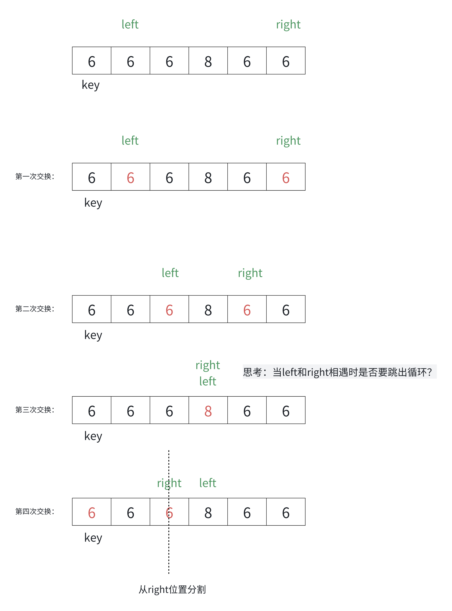

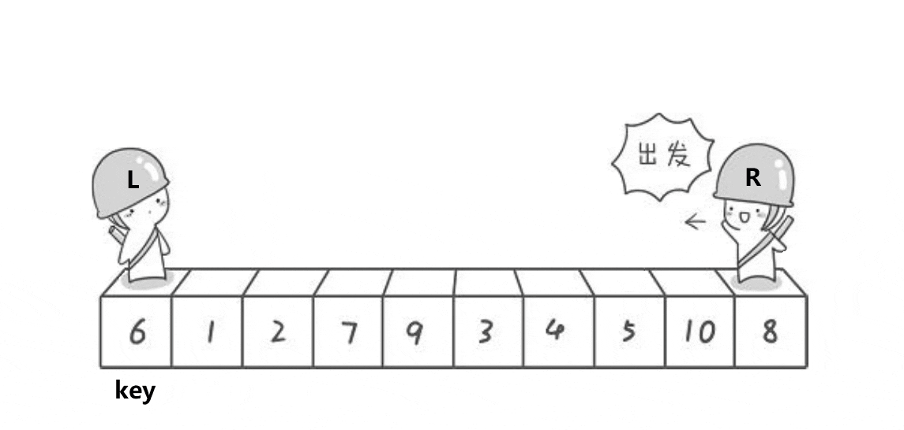

**代码实现：**

```c
int PartSort1(int* a, int begin, int end)
{
    // 三数取中
    int midi = GetMidi(a, begin, end);
    Swap(&a[midi], &a[begin]);

    // 要在最左边开始
    int left = begin, right = end;
    int keyi = begin;

    while (left < right)
    {
        // 右边找小
        while (left < right && a[right] >= a[keyi])
        {
            --right;
        }
        // 左边找大
        while (left < right && a[left] <= a[keyi])
        {
            ++left;
        }

        // 找到了，就交换
        Swap(&a[left], &a[right]);
    }

    // 交换的左边的和keyi，然后更新一下keyi
    Swap(&a[left], &a[keyi]);
    return left;
}

void QuickSort(int* a, int begin, int end)
{
    if (begin >= end)
        return;

    // 小区间
    if (end - begin + 1 < 10)
    {
        InsertSort(a + begin, end - begin + 1);
    }
    else
    {
        int keyi = PartSort1(a, begin, end);

        QuickSort(a, begin, keyi - 1);
        QuickSort(a, keyi + 1, end);
    }
}
```

## 快速排序挖坑法
快速排序的挖坑法（也称为Lomuto分区方案）是快速排序的一种实现方式。在挖坑法中，选择一个基准元素，通过不断交换元素将数组分成两个部分，左边的部分都小于基准元素，右边的部分都大于基准元素。接着，对左右两个部分分别递归进行同样的操作。

思路：创建左右指针。首先从右向左找出比基准小的数据，找到后立即放入左边坑中，当前位置变为的"坑"，然后从左向右找出比基准大的数据，找到后立即放入右边坑中，当前位置变为新的"坑"，结束循环后将最开始存储的分界值放入当前的"坑"中，返回当前"坑"下标（即分界值下标）


**代码实现：**

```c
int PartSort2(int* a, int begin, int end)
{
    int midi = GetMidi(a, begin, end);
    Swap(&a[midi], &a[begin]);

    int key = a[begin];
    int holei = begin;

    while (begin < end)
    {
        // 右边找小
        while (begin < end && a[end] >= key)
        {
            --end;
        }

        a[holei] = a[end];
        holei = end;

        // 左边找大
        while (begin < end && a[begin] <= key)
        {
            ++begin;
        }
        a[holei] = a[begin];
        holei = begin;
    }

    a[holei] = key;
    return holei;
}

void QuickSort(int* a, int begin, int end)
{
    if (begin >= end)
        return;

    // 小区间
    if (end - begin + 1 < 10)
    {
        InsertSort(a + begin, end - begin + 1);
    }
    else
    {
        int keyi = PartSort2(a, begin, end);

        QuickSort(a, begin, keyi - 1);
        QuickSort(a, keyi + 1, end);
    }
}
```

## 快速排序前后指针法
快速排序的前后指针法（也称为Hoare分区方案）是另一种实现方式。在这个方法中，通过两个指针从数组的两端分别向中间移动，交换不符合排序条件的元素，最终将数组分为两个部分，左边部分小于基准元素，右边部分大于基准元素。

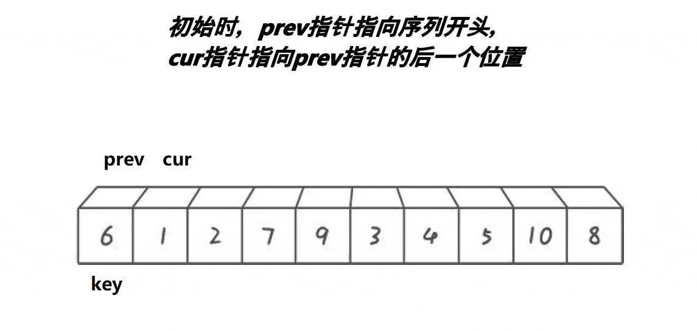

**代码实现：**

```c
int PartSort3(int* a, int begin, int end)
{
    int midi = GetMidi(a, begin, end);
    Swap(&a[begin], &a[midi]);

    int prev = begin;
    int cur = prev + 1;
    int keyi = begin;
    while (cur <= end)
    {
        if (a[cur] < a[keyi] && ++prev != cur)
            Swap(&a[prev], &a[cur]);

        ++cur;
    }

    Swap(&a[keyi], &a[prev]);
    keyi = prev;
    return keyi;
}

void QuickSort(int* a, int begin, int end)
{
    if (begin >= end)
        return;

    // 小区间
    if (end - begin + 1 < 10)
    {
        InsertSort(a + begin, end - begin + 1);
    }
    else
    {
        int keyi = PartSort3(a, begin, end);

        QuickSort(a, begin, keyi - 1);
        QuickSort(a, keyi + 1, end);
    }
}
```

快速排序特性总结：

1. 时间复杂度： O(nlogn)
2. 空间复杂度： O(logn)

# 快速排序--非递归实现
先入栈，然后再进行分割

+ **注意：** 如果是先入右后入左，那么出的时候就要先出左后出右
+ 栈不为空就继续，然后分割排左边和右边

**代码实现：**

```c
#include"Stack.h"
// 快速排序 非递归实现 
void QuickSortNonR(int* a, int begin, int end)
{
    ST s;
    StackInit(&s);
    // 先入右后入左
    StackPush(&s, end);
    StackPush(&s, begin);

    while (!StackEmpty(&s))
    {
        // 先出左后出右
        int left = StackTop(&s);
        StackPop(&s);
        int right = StackTop(&s);
        StackPop(&s);

        // 排序
        int keyi = PartSort3(a, left, right);
        // [left keyi-1] keyi [keyi+1 right]
        if (left < keyi - 1)
        {
            StackPush(&s, keyi - 1);
            StackPush(&s, left);
        }
        if (keyi + 1 < right)
        {
            StackPush(&s, right);
            StackPush(&s, keyi + 1);
        }
    }

    StackDestroy(&s);
}
```

# 归并排序
归并排序（Merge Sort）是一种分治算法，它的基本思想是将待排序的数组分成两个相等大小的子数组，然后分别对这两个子数组进行排序，最后将排序好的子数组合并成一个有序的数组。

归并排序算法思想：归并排序（MERGE-SORT）是建立在归并操作上的一种有效的排序算法,该算法是采用分治法（Divideand Conquer）的一个非常典型的应用。将已有序的子序列合并，得到完全有序的序列；即先使每个子序列有序，再使子序列段间有序。若将两个有序表合并成一个有序表，称为二路归并。 归并排序核心步骤：


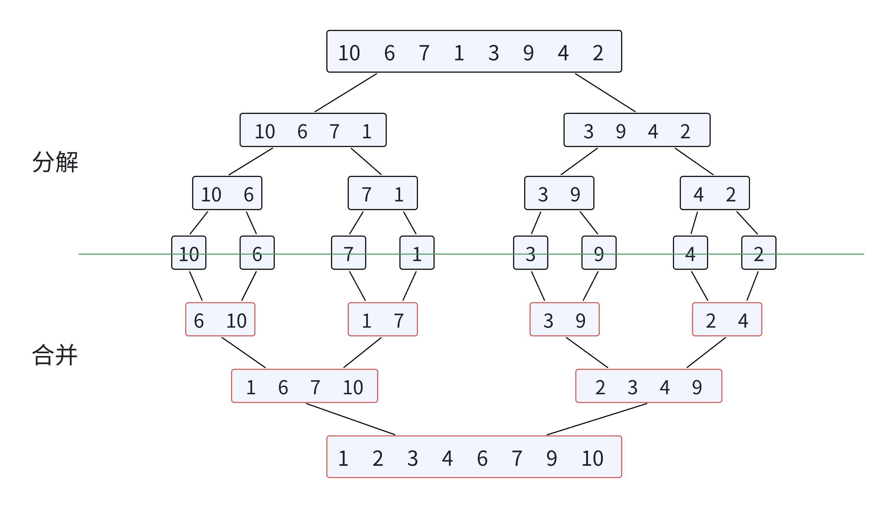

**代码实现：**

```c
void _MergeSort(int* a, int begin, int end, int* tmp)
{
    if (begin >= end)
        return;

    // 分割  // 这里右移一位相当于 /2 
    int mid = (begin + end) >> 1; 
    
    // 递归
    _MergeSort(a, begin, mid, tmp);
    _MergeSort(a, mid + 1, end, tmp);

    // [begin mid][mid+1 end]  归并
    int begin1 = begin, end1 = mid;
    int begin2 = mid + 1, end2 = end;
    int i = begin;

    while (begin1 <= end1 && begin2 <= end2)
    {
        if (a[begin1] < a[begin2])
        {
            tmp[i++] = a[begin1++];
        }
        else
        {
            tmp[i++] = a[begin2++];
        }
    }

    while (begin1 <= end1)
    {
        tmp[i++] = a[begin1++];
    }
    while (begin2 <= end2)
    {
        tmp[i++] = a[begin2++];
    }

    // 拷贝回原数组

    for (int i = begin; i <= end; ++i)
    {
        a[i] = tmp[i];
    }

    //memcpy(a + begin, tmp + begin, sizeof(int) * (end - begin) + 1);
}

// 归并排序递归实现 
void MergeSort(int* a, int n)
{
    int* tmp = (int*)malloc(sizeof(int) * n);
    if (tmp == NULL)
    {
        perror("malloc fail!\n");
        return;
    }

    _MergeSort(a, 0, n - 1, tmp);

    free(tmp);
}
```

归并排序特性总结：

1. 时间复杂度： O(nlogn)
2. 空间复杂度： O(n)

## 归并排序非递归实现
**代码实现：**

```c
void MergeSortNonR(int* a, int n)
{
    int* tmp = (int*)malloc(sizeof(int) * n);

    int gap = 1; // 每组数据个数
    while (gap < n)
    {
        for (int i = 0; i < n; i += 2 * gap)
        {
            // [i, i+gap-1] [i+gap,i+2*gap-1]
            int begin1 = i, end1 = i + gap - 1;
            int begin2 = i + gap, end2 = i + 2 * gap - 1;

            // 归并过程中右半区间可能就不存在
            if (begin2 >= n)
                break;

            // 归并过程中右半区间算多了, 修正一下
            if (end2 >= n)
            {
                end2 = n - 1;
            }

            int index = i;
            while (begin1 <= end1 && begin2 <= end2)
            {
                if (a[begin1] < a[begin2])
                {
                    tmp[index++] = a[begin1++];
                }
                else
                {
                    tmp[index++] = a[begin2++];
                }
            }

            while (begin1 <= end1)
            {
                tmp[index++] = a[begin1++];
            }

            while (begin2 <= end2)
            {
                tmp[index++] = a[begin2++];
            }

            // 归并一组，拷贝一组
            for (int j = i; j <= end2; ++j)
            {
                a[j] = tmp[j];
            }
        }
        gap *= 2;
    }

    free(tmp);
}
```

# 非比较排序【计数排序】
计数排序又称为鸽巢原理，是对哈希直接定址法的变形应用。 操作步骤：

1）统计相同元素出现次数

2）根据统计的结果将序列回收到原来的序列中

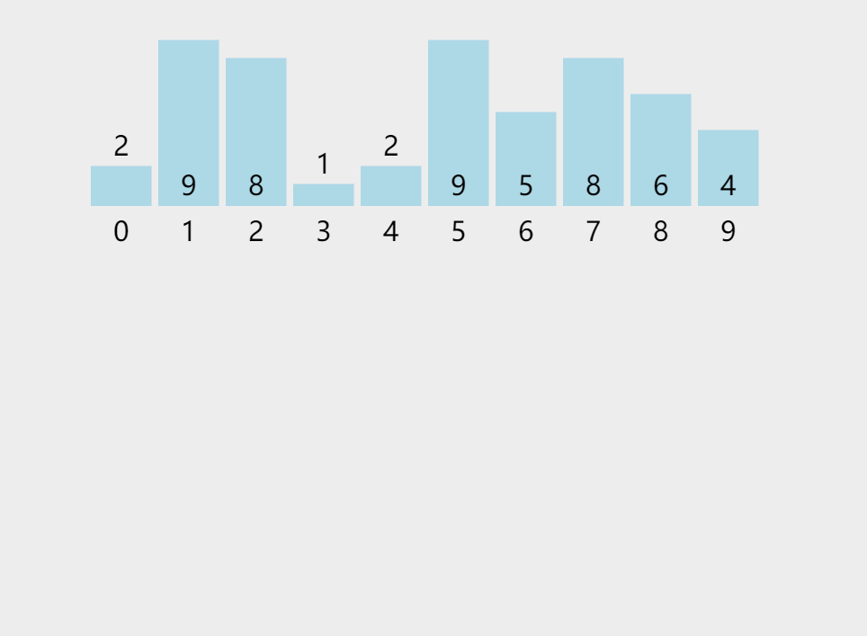

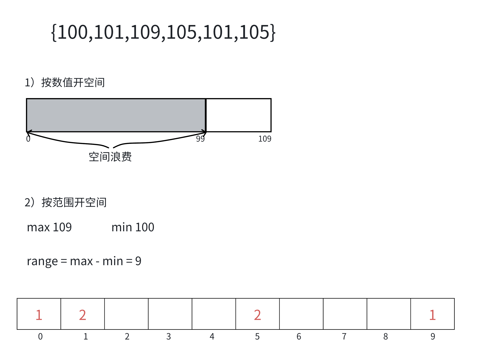

**代码实现：**

```c
void CountSort(int* a, int n)
{
    int max = a[0], min = a[0];
    for (int i = 0; i < n; i++)
    {
        if (a[i] > max)
            max = a[i];
        if (a[i] < min)
            min = a[i];
    }
    int range = max - min + 1;

    int* count = (int*)malloc(sizeof(int) * range);
    if (count == NULL)
    {
        perror("malloc fail!\n");
        return;
    }

    memset(count, 0, sizeof(int) * range);
    //统计次数
    for (int i = 0; i < n; i++)
    {
        count[a[i] - min]++;
    }

	int k = 0;
	for (int j = 0; j < range; j++)
	{
		while (count[j]--)
		{
			a[k++] = j + min;
		}
	}

    free(count);
}
```

# 基数排序
基数排序是一种非比较性的排序算法，它根据关键字的每一位来排序数据。

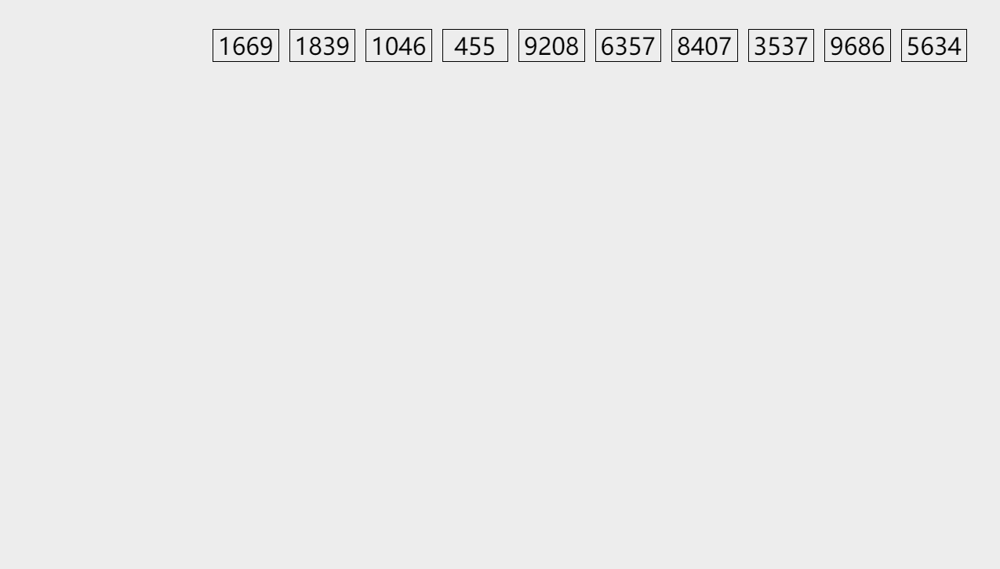

# 三路划分
当面对有大量跟key相同的值时，三路划分的核心思想有点类似hoare的左右指针和lomuto的前后指针的结合。核心思想是把数组中的数据分为三段【比key小的值】 【跟key相等的值】【比key大的值】，所以叫做三路划分算法。

1. key默认取left位置的值。
2. left指向区间最左边，right指向区间最后边，cur指向left+1位置。
3. cur遇到比key小的值后跟left位置交换，换到左边，left++，cur++。
4. cur遇到比key大的值后跟right位置交换，换到右边，right--。
5. cur遇到跟key相等的值后，cur++。
6. 直到`cur>right`结束

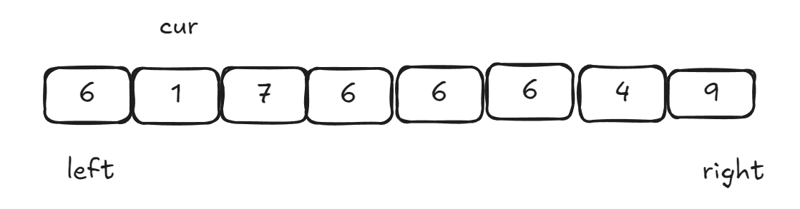

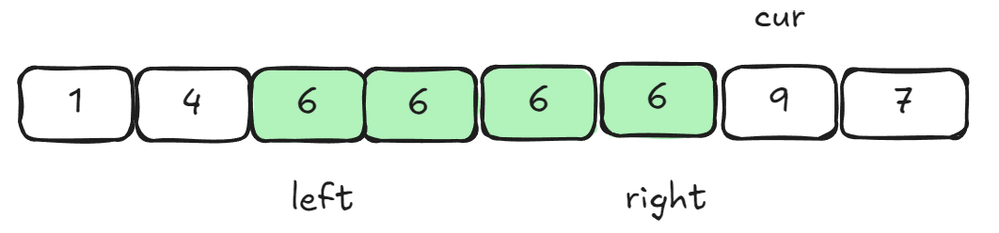

```cpp
KeyWayIndex PartSort3Way(int* a, int left, int right)
{
	int key = a[left];

	// left和right指向就是跟key相等的区间
	// [开始, left-1][left, right][right+1, 结束]

	int cur = left + 1;
	while (cur <= right)
	{
		// 1、cur遇到比key小，小的换到左边，同时把key换到中间位置
		// 2、cur遇到比key大，大的换到右边

		if (a[cur] < key)
		{
			Swap(&a[left], &a[cur]);
			++cur;
			++left;
		}
		else if (a[cur] > key)
		{
			Swap(&a[right], &a[cur]);
			--right;
		}
		else
		{
			++cur;
		}
	}

	KeyWayIndex kwi;
	kwi.leftKeyi = left;
	kwi.rightKeyi = right;
	return kwi;
}
```

# 外排序
## 创建随机数据文件的代码
```c
// 创建N个随机数，写到文件中
void CreateNDate()
{
    // 造数据
    int n = 10000000;
    srand(time(0));
    const char* file = "data.txt";
    FILE* fin = fopen(file, "w");
    if (fin == NULL)
    {
        perror("fopen error");
        return;
    }

    for (int i = 0; i < n; ++i)
    {
        int x = rand() + i;
        fprintf(fin, "%d\n", x);
    }

    fclose(fin);
}
```

## 文件归并排序思路分析
1. 读取n个值排序后写到file1，再读取n个值排序后写到file2
2. file1和file2利用归并排序的思想，依次读取比较，取小的尾插到mfile，mfile归并为一个有序文件
3. 将file1和file2删掉，mfile重命名为file1
4. 再次读取n个数据排序后写到file2
5. 继续走file1和file2归并，重复步骤2，直到文件中无法读出数据。最后归并出的有序数据放到了file1中

```c
// file1文件的数据和file2文件的数据归并到mfile文件中
void MergeFile(const char* file1, const char* file2, const char* mfile)
{
	FILE* fout1 = fopen(file1, "r");
	if (fout1 == NULL)
	{
		printf("打开文件失败\n");
		exit(-1);
	}
	FILE* fout2 = fopen(file2, "r");
	if (fout2 == NULL)
	{
		printf("打开文件失败\n");
		exit(-1);
	}
	FILE* fin = fopen(mfile, "w");
	if (fin == NULL)
	{
		printf("打开文件失败\n");
		exit(-1);
	}
	// 这里跟内存中数组归并的思想完全类似，只是数据在硬盘文件中而已
	// 依次读取file1和file2的数据，谁的数据小，谁就往mfile文件中去写
	// file1和file2其中一个文件结束后，再把另一个文件未结束文件数据，
	// 依次写到mfile的后面
	int num1, num2;
	int ret1 = fscanf(fout1, "%d\n", &num1);
	int ret2 = fscanf(fout2, "%d\n", &num2);
	while (ret1 != EOF && ret2 != EOF)
	{
		if (num1 < num2)
		{
			fprintf(fin, "%d\n", num1);
			ret1 = fscanf(fout1, "%d\n", &num1);
		}
		else
		{
			fprintf(fin, "%d\n", num2);
			ret2 = fscanf(fout2, "%d\n", &num2);
		}
	}
	while (ret1 != EOF)
	{
		fprintf(fin, "%d\n", num1);
		ret1 = fscanf(fout1, "%d\n", &num1);
	}
	while (ret2 != EOF)
	{
		fprintf(fin, "%d\n", num2);
		ret2 = fscanf(fout2, "%d\n", &num2);
	}
	fclose(fout1);
	fclose(fout2);
	fclose(fin);
}

// 返回读取到的数据个数
int ReadNNumSortToFile(FILE* fout, int* a, int n, const char* file)
{
	int x = 0;
	// 读取n个数据放到file
	int i = 0;
	while (i < n && fscanf(fout, "%d", &x) != EOF)
	{
		a[i++] = x;
	}
	// 一个数据都没有读到，则说明文件已经读到结尾了
	if (i == 0)
		return i;
	// 排序
	HeapSort(a, i);
	FILE* fin = fopen(file, "w");
	if (fout == NULL)
	{
		printf("打开文件%s失败\n", file);
		exit(-1);
	}
	for (int j = 0; j < i; j++)
	{
		fprintf(fin, "%d\n", a[j]);
	}
	fclose(fin);
	return i;
}

// MergeSortFile的第二个是每次取多少个数据到内存中排序，然后写到一个小文件进行归并
// 这个n给多少取决于我们有多少合理的内存可以利用，相对而言n越大，更多数据到内存中排序后，
// 再走文件归并排序，整体程序会越快一些。
void MergeSortFile(const char* file, int n)
{
	FILE* fout = fopen(file, "r");
	if (fout == NULL)
	{
		printf("打开文件%s失败\n", file);
		exit(-1);
	}
	int i = 0;
	int x = 0;
	const char* file1 = "file1";
	const char* file2 = "file2";
	const char* mfile = "mfile";
	// 分割成一段一段数据，内存排序后写到，小文件，
	int* a = (int*)malloc(sizeof(int) * n);
	if (a == NULL)
	{
		perror("malloc fail");
		return;
	}
	// 分别读取前n个数据排序后，写到file1和file2文件
	ReadNNumSortToFile(fout, a, n, file1);
	ReadNNumSortToFile(fout, a, n, file2);
	while (1)
	{
		// file1和file2文件归并到mfile文件中
		MergeFile(file1, file2, mfile);
		// 删除file1和file2
		if (remove(file1) != 0 || remove(file2) != 0)
		{
			perror("Error deleting file");
			return;
		}
		// 将mfile重命名为file1
		if (rename(mfile, file1) != 0)
		{
			perror("Error renaming file");
			return;
		}
		// 读取N个数据到file2，继续走归并
		// 如果一个数据都没读到，则归并结束了
		if (ReadNNumSortToFile(fout, a, n, file2) == 0)
		{
			break;
		}
	}
	printf("%s文件成功排序到%s\n", file, file1);
	fclose(fout);
	free(a);
}
```

# 排序算法复杂度及稳定性分析
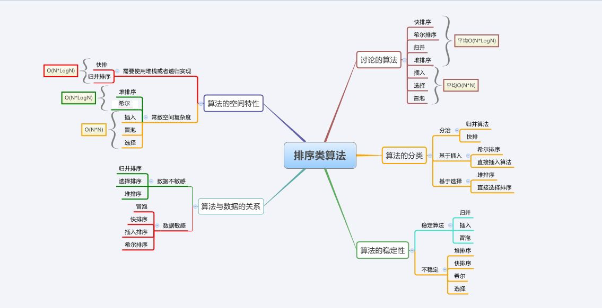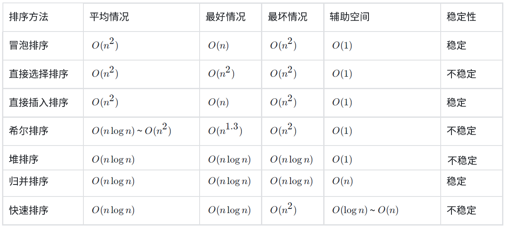

