> 顺序表遗留下来的问题：
>

1. 中间/头部的插⼊删除，时间复杂度为O(N)
2. 增容需要申请新空间，拷贝数据，释放旧空间。会有不小的消耗。
3. 增容⼀般是呈2倍的增长，势必会有⼀定的空间浪费。例如当前容量为100，满了以后增容到  
200，我们再继续插入了5个数据，后⾯没有数据插入了，那么就浪费了95个数据空间。

## 一、链表的概念及结构
> 概念：链表是一种物理存储结构上非连续、非顺序的存储结构，数据元素的逻辑顺序是通过链表  
中的指针链接次序实现的 。
>

+ 链表的结构跟火车车厢相似，淡季时车次的车厢会相应减少，旺季时车次的车厢会额外增加几节。只需要将火车里的某节车厢去掉/加上，不会影响其他车厢，每节车厢都是独立存在的。
+ 车厢是独立存在的，且每节车厢都有车门。想象一下这样的场景，假设每节车厢的车门都是锁上的状态，需要不同的钥匙才能解锁，每次只能携带一把钥匙的情况下如何从车头走到车尾？  
最简单的做法：每节车厢里都放一把下一节车厢的钥匙。

在链表里，每节“车厢”是什么样的呢？我们来看下面：

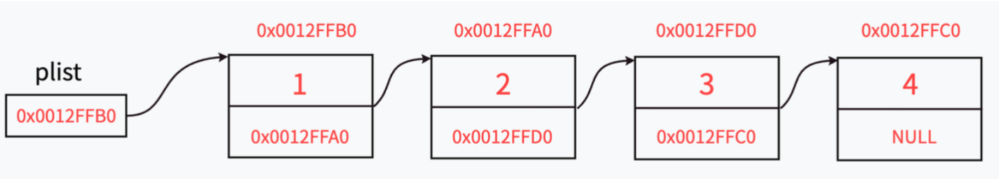

+ 与顺序表不同的是，链表里的每节"车厢"都是独立申请下来的空间，我们称之为“结点/节点”
+ 节点的组成主要有两个部分：当前节点要保存的数据和保存下一个节点的地址（指针变量）。
+ 图中指针变量 plist保存的是第一个节点的地址，我们称plist此时“指向”第一个节点，如果我们希望plist“指向”第二个节点时，只需要修改plist保存的内容为0x0012FFA0。

> 为什么还需要指针变量来保存下一个节点的位置？
>

+ 链表中每个节点都是独立申请的（即需要插入数据时才去申请一块节点的空间），我们需要通过指针变量来保存下一个节点位置才能从当前节点找到下一个节点。

结合前面学到的结构体知识，我们可以给出每个节点对应的结构体代码：

假设当前保存的节点为整型：

```c
struct SListNode
{
    int val;
    struct SListNode* next;
}
```

+ 当我们想要保存一个整型数据时，实际是向操作系统申请了一块内存，这个内存不仅要保存整型数据，也需要保存下一个节点的地址（当下一个节点为空时保存的地址为空）。
+ 当我们想要从第一个节点走到最后一个节点时，只需要在前一个节点拿上下一个节点的地址（下一个节点的钥匙）就可以了。

> 给定的链表结构中，如何实现节点从头到尾的打印？
>

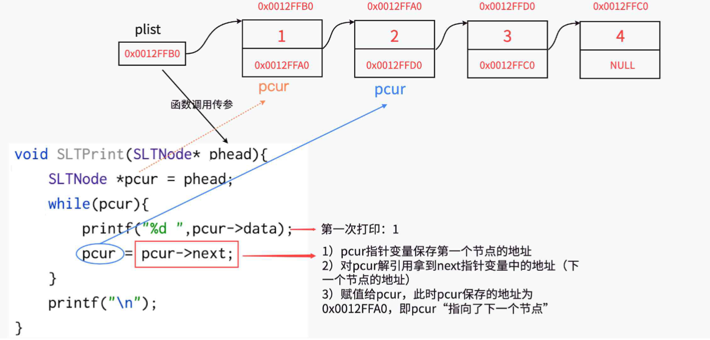

思考：当我们想保存的数据类型为字符型、浮点型或者其他自定义的类型时，该如何修改？

补充说明：  
1、链式机构在逻辑上是连续的，在物理结构上不一定连续  
2、节点一般是从堆上申请的  
3、从堆上申请来的空间，是按照一定策略分配出来的，每次申请的空间可能连续，可能不连续

## 二、单链表的实现
### 头文件
`SList`

```c
#include<stdio.h>
#include<stdlib.h>
#include<assert.h>
#include<stdbool.h>

typedef int SLNDataType;

typedef struct SListNode
{
    SLNDataType val;
    struct SListNode* next;
}SLNode;
```

我们要实现哪些功能呢？

```c
//打印
void SLTPrint(SLNode* phead);

//尾插
void SLTPushBack(SLNode** pphead, SLNDataType x);

//头插
void SLTPushFront(SLNode** pphead, SLNDataType x);

//尾删
void SLTPopBack(SLNode** pphead);

//头删
void SLTPopFront(SLNode** pphead);

//查找
SLNode* SListFind(SLNode** phead, SLNDataType x);

//在指定位置之前插入数据
void SLTInsert(SLNode** pphead, SLNode* pos, SLNDataType x);

//删除pos节点
void SLTErase(SLNode** pphead, SLNode* pos);

//在指定位置之后插入数据
void SLTInsertAfter(SLNode* pos, SLNDataType x);

//删除pos之后的节点
void SLTEraseAfter(SLNode* pos);

//销毁链表
void SListDesTroy(SLNode** pphead);
```

`SList.c`

### 打印
+ 这个很好实现，直接循环打印就可以

```c
void SLTPrint(SLNode* phead)
{
    //将头节点的地址保存到cur中
    SLNode* cur = phead;
    while (cur != NULL)
    {
        printf("%d-> ", cur->val);
        //cur是保存下一个节点的地址
        cur = cur->next;
    }
    printf("NULL\n");
}
```

+ 我们来测试一下，这里链表中什么都没有，我们可以自己手动创造几个数据

```c
slttest1()
{
    //测试打印
    SLNode* node1 = (SLNode*)malloc(sizeof(SLNode));
    node1->val = 1;
    SLNode* node2 = (SLNode*)malloc(sizeof(SLNode));
    node2->val = 2;
    SLNode* node3 = (SLNode*)malloc(sizeof(SLNode));
    node3->val = 3;
    SLNode* node4 = (SLNode*)malloc(sizeof(SLNode));
    node4->val = 4;

    node1->next = node2;
    node2->next = node3;
    node3->next = node4;
    node4->next = NULL;

    SLNode* plist = node1;
    SLTPrint(plist);
}
```

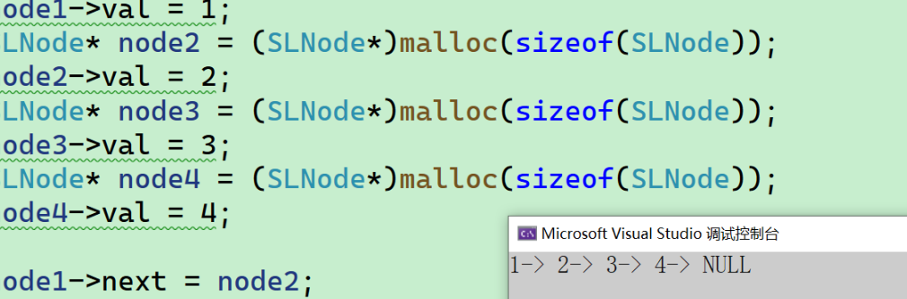

### 尾插
+ 这里的尾插是不是需要先申请空间，然后再将申请出来的空间赋值
+ 还需要先判断链表为不为空，如果是空，就将新开辟的空间赋给头

下面是代码：

+ 扩容我们后面可能还要用，所以我们就给他封装成一个函数

```c
//开辟空间
SLNode* CreateNode(SLNDataType x)
{
    //malloc一个新的空间
    SLNode* newnode = (SLNode*)malloc(sizeof(SLNode));
    if (newnode == NULL)
    {
        perror("malloc fail");
        exit(-1);
    }
    //申请出来的空间直接赋值
    newnode->val = x;
    //下一个next赋值为空
    newnode->next = NULL;
    //返回一个新的空间
    return newnode;
}
```

```c
void SLTPushBack(SLNode** pphead, SLNDataType x)
{
    assert(pphead);
    //这里申请空间
    SLNode* newnode = CreateNode(x);
    //判断头是否为空，如果为空，就将新开辟的空间赋给头
    if (*pphead == NULL)
    {
        *pphead = newnode;
    }
    else
    {
        //将头指向变量尾
        SLNode* tail = *pphead;
        //找尾
        while (tail->next != NULL)
        {
            //找到了尾然后继续
            tail = tail->next;
        }
        //把那个返回的空间赋值给尾的next
        tail->next = newnode;
    }
}
```

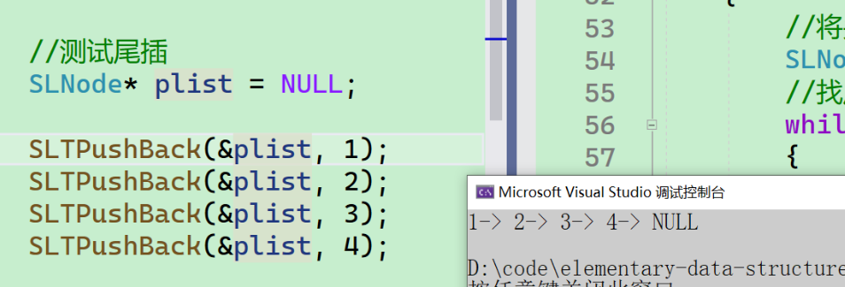

### 头插
+ 这里先申请节点，然后让新的节点和头节点连接起来，最后再让新的节点成为头节点
+ 这里如果链表为空也是可以完成任务的

```c
void SLTPushFront(SLNode** pphead, SLNDataType x)
{
    //申请节点
    SLNode* newnode = CreateNode(x);
    //让新节点跟头节点连接起来
    newnode->next = *pphead;
    //让新的节点成为头节点
    *pphead = newnode;	
}
```

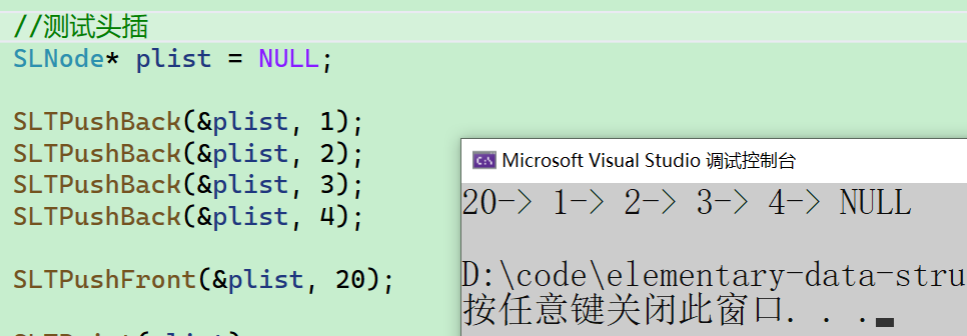

### 尾删
+ 首先找尾，然而找尾就要找到前一个节点，掷为空，然后再进行`free`
+ 链表为空的时候不能尾删

```c
void SLTPopBack(SLNode** pphead)
{
    assert(pphead);
    assert(*pphead);
    //当前链表只有一个节点的时候
    if ((*pphead)->next == NULL)
    {
        free(*pphead);
        *pphead = NULL;
    }
    else
    {
        //定义一个快慢指针
        SLNode* ptail = *pphead;
        SLNode* prev = NULL;
        //ptail的next不等于NULL就一直找
        while (ptail->next != NULL)
        {
            //将ptail的地址赋给慢指针prev
            prev = ptail;
            //ptail继续往下找
            ptail = ptail->next;
        }
        free(ptail);
        prev->next = NULL;
    }
}
```

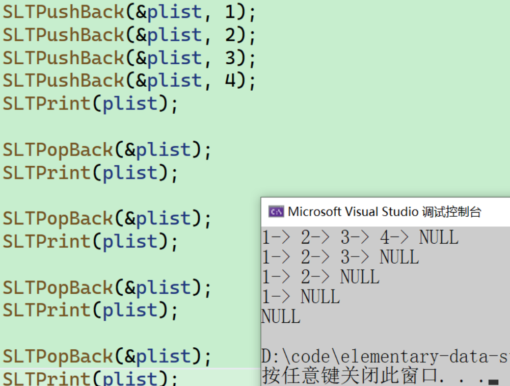

### 头删
+ 使用临时节点指向头节点
+ 然后将头节点指向新的头
+ 把临时指针指向的节点释放掉

```c
void SLTPopFront(SLNode** pphead)
{
    assert(pphead);
    assert(*pphead);
    //定义一个临时指针，将第二个节点赋值给临时指针
    SLNode* next = (*pphead)->next;
    //释放头节点
    free(*pphead);
    //将临时节点变成头节点
    *pphead = next;
}
```

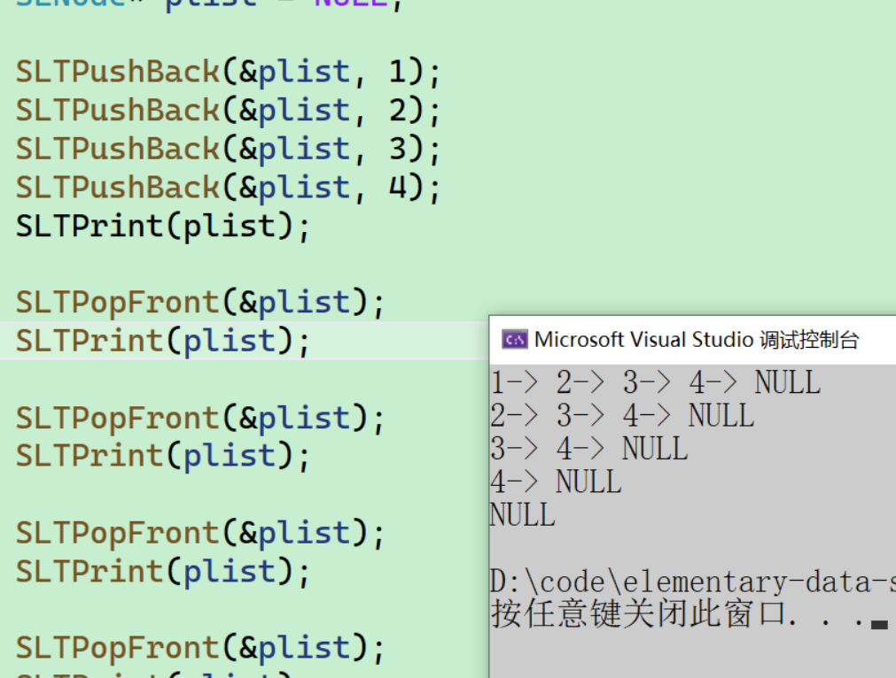

### 查找
+ 这里我们传地址就是要保持接口的一致性
+ 所以我们这里写二级指针

```c
SLNode* SListFind(SLNode** pphead, SLNDataType x)
{
    assert(phead);
    SLNode* pcur = *phead;
    while (pcur != NULL)
    {
        if (pcur->val == x)
        {
            return pcur;
        }
        pcur = pcur->next;
    }
    return NULL;
}

```

### 在指定位置之前插入数据
+ 在插入前，我们要向申请一块空间
+ 先找到要插入的地方前一个节点
+ 处理前一个和后一个的连接关系
+ 链表不能为空，pos也不能为空
+ 还要处理只有一个节点和只有一个节点的情况下，直接将新申请下来的节点赋给头

```c
void SLTInsert(SLNode** pphead, SLNode* pos, SLNDataType x)
{
    assert(pphead);
    //链表不能为空，pos也不能为空
    assert(pos);
    assert(*pphead);
    SLNode* node = CreateNode(x);
    //处理只有一个节点和只有一个节点的情况下，直接将新申请下来的节点赋给头
    if ((*pphead)->next == NULL || pos == *pphead)
    {
        node->next = *pphead;
        *pphead = node;
        return;
    }
    SLNode* prev = *pphead;
    //找pos的前一个节点
    while (prev->next != pos)
    {
        prev = prev->next;
    }
    //连接
    node->next = pos;
    prev->next = node;
}
```

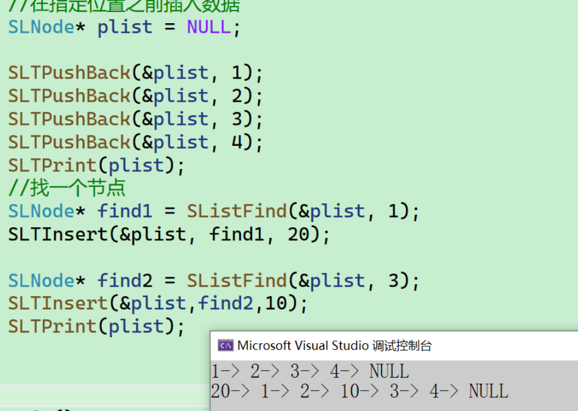

### 在指定位置之后插入数据
+ 这里可以直接申请空间后赋值，然后直接连接

```c
void SLTInsertAfter(SLNode* pos, SLNDataType x)
{
    assert(pos);
    SLNode* node = CreateNode(x);
    //连接
    node->next = pos->next;
    pos->next = node;
}
```

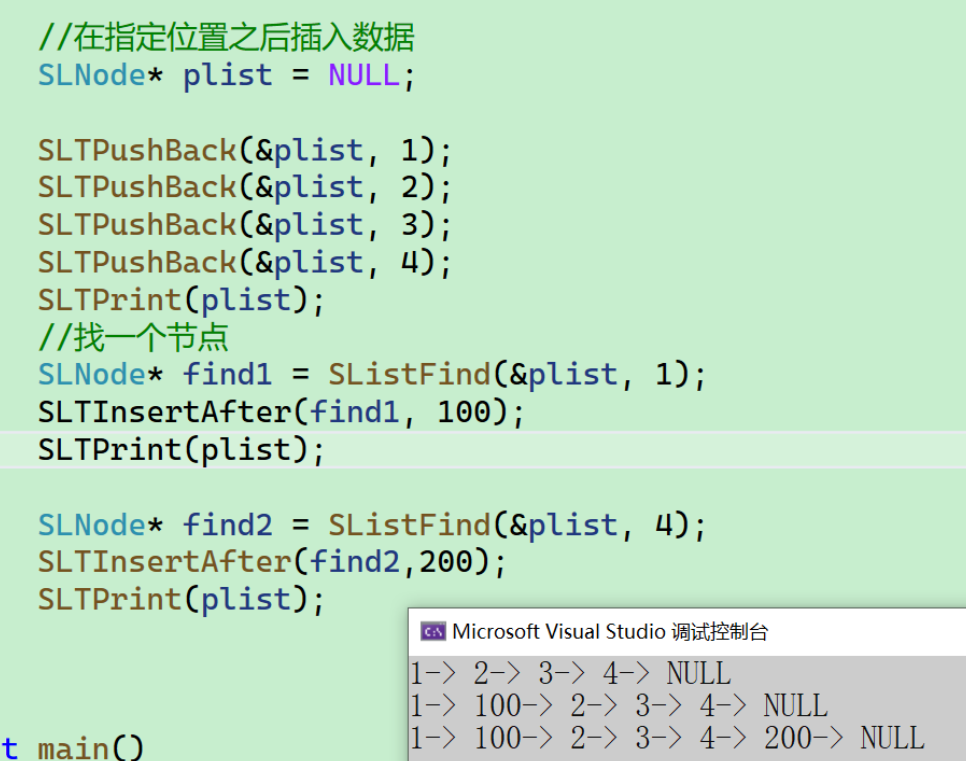

### 删除pos节点
+ 首先找到前一个节点，将next的指针指向下一个，再把pos的节点删除
+ 当也要判断pos是不是头

```c
void SLTErase(SLNode** pphead, SLNode* pos)
{
    assert(pphead);
    assert(*pphead);
    assert(pos);
    //判断pos是不是头
    if (pos == *pphead)
    {
        *pphead = (*pphead)->next;
        free(pos);
        return;
    }
    //找pos的前一个节点
    SLNode* prev = *pphead;
    while (prev->next != pos)
    {
        prev = prev->next;
    }
    prev->next = pos->next;
    free(pos);
    pos = NULL;
}
```

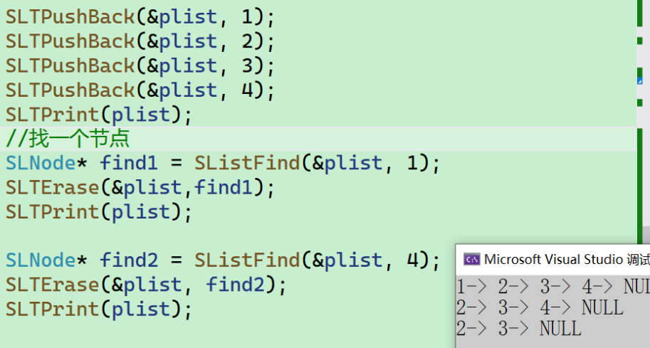

### 删除pos之后的节点
+ 首先要将pos的节点保存下来，然后改变pos的指向，最后释放

```c
void SLTEraseAfter(SLNode* pos)
{
    assert(pos && pos->next);
    SLNode* del = pos->next;
    pos->next = del->next;
    free(del);
    del = NULL;
}
```

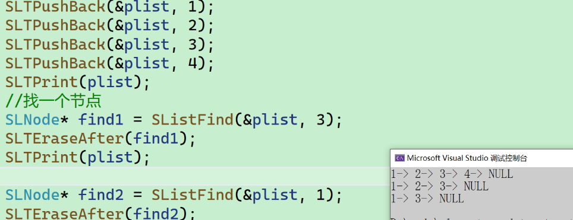

### 销毁链表
+ 销毁节点之前，要把下一个节点保存起来，然后找下一个free，句许循环

```c
void SListDesTroy(SLNode** pphead)
{
    assert(pphead);
    SLNode* pcur = *pphead;

    while (pcur != NULL)
    {
        SLNode* next = pcur->next;
        free(pcur);
        pcur = next;
    }
    *pphead = NULL;
}

```

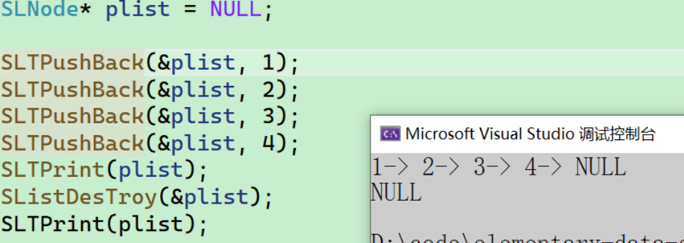

## 三、源码
```c
#define _CRT_SECURE_NO_WARNINGS 1
#include "SList.h"


void SLTPrint(SLTNode* phead) {
	SLTNode* pcur = phead;
	while (pcur)
	{
		printf("%d->", pcur->val);
		pcur = pcur->next;
	}
	printf("NULL\n");
}

SLTNode* SLTBuyNode(SLTDataType x) {
	SLTNode* newnode = (SLTNode*)malloc(sizeof(SLTNode));
	if (!newnode) {
		perror("malloc fail!\n");
		exit(-1);
	}
	newnode->val = x;
	newnode->next = NULL;
	return newnode;
}

//尾插
void SLTPushBack(SLTNode** pphead, SLTDataType x) {
	assert(pphead);
	SLTNode* node = SLTBuyNode(x);
	if (*pphead == NULL) {
		*pphead = node;
	}
	else {
		// 找尾
		SLTNode* ptail = *pphead;
		while (ptail->next)
		{
			ptail = ptail->next;
		}
		ptail->next = node;
	}
}
//头插
void SLTPushFront(SLTNode** pphead, SLTDataType x) {
	assert(pphead);
	SLTNode* node = SLTBuyNode(x);
	node->next = *pphead;
	*pphead = node;
}
//尾删
void SLTPopBack(SLTNode** pphead) {
	assert(*pphead && pphead);
	
	if ((*pphead)->next == NULL) {
		free(*pphead);
		*pphead = NULL;
	}
	else {
		// 找尾
		SLTNode* ptail = *pphead, * prev = NULL;
		while (ptail->next)
		{
			prev = ptail;
			ptail = ptail->next;
		}

		prev->next = NULL;
		free(ptail);
		ptail = NULL;
	}
}

//头删
void SLTPopFront(SLTNode** pphead) {
	assert(*pphead && pphead);
	SLTNode* next = (*pphead)->next;
	free(*pphead);
	*pphead = next;
}

//查找
SLTNode* SLTFind(SLTNode* phead, SLTDataType x) {
	assert(phead);
	SLTNode* pcur = phead;
	while (pcur)
	{
		if (pcur->val == x)
			return pcur;
		pcur = pcur->next;
	}
	return NULL;
}

//在指定位置之前插⼊数据
void SLTInsert(SLTNode** pphead, SLTNode* pos, SLTDataType x) {
	assert(*pphead && pphead);
	SLTNode* node = SLTBuyNode(x);
	if (pos == *pphead) {
		SLTPushFront(pphead, x);
	}
	else {
		// 找前一个
		SLTNode* prev = *pphead;
		while (prev->next != pos)
		{
			prev = prev->next;
		}
		node->next = pos;
		prev->next = node;
	}
}
//在指定位置之后插⼊数据
void SLTInsertAfter(SLTNode* pos, SLTDataType x) {
	assert(pos);
	SLTNode* node = SLTBuyNode(x);
	node->next = pos->next;
	pos->next = node;
}

//删除pos结点
void SLTErase(SLTNode** pphead, SLTNode* pos) {
	assert(pos && pphead && *pphead);
	if (pos == *pphead) {
		// 头删
		SLTPopFront(pphead);
	}
	else {
		// 找前一个
		SLTNode* prev = *pphead;
		while (prev->next != pos)
		{
			prev = prev->next;
		}
		prev->next = pos->next;

		free(pos);
		pos = NULL;
	}
}
//删除pos之后的结点
void SLTEraseAfter(SLTNode* pos) {
	assert(pos && pos->next);
	SLTNode* del = pos->next;
	pos->next = del->next;
	free(del);
	del = NULL;
}

//销毁链表
void SListDestroy(SLTNode** pphead) {
	assert(*pphead && pphead);
	SLTNode* del = *pphead;
	while (del)
	{
		SLTNode* next = del->next;
		free(del);
		del = next;
	}
	*pphead = NULL;
}
```

## 四、OJ练习
### 移除链表元素
[OJ链接](https://leetcode.cn/problems/remove-linked-list-elements/description/)

思路一：从头节点开始进行元素删除，每删除一个元素，需要重新链接节点

```c
struct ListNode* removeElements(struct ListNode* head, int val) {
    if(head == NULL)
        return NULL;

    struct ListNode* cur = head,* prev = NULL;

    while(cur)
    {
        //如果当前节点是需要删除的节点
        if(cur->val == val)
        {
            //首先保存下一个节点
            struct ListNode* next = cur->next;
            //如果删除的为头节点，更新头节点
            //否则让当前节点的前趋节点链接next节点
            if(prev == NULL)
                head = cur->next;
            else
                prev->next = cur->next;  
            //释放当前节点，让cur指向next
            free(cur);
            cur = next;
        }
        else
        {
            //如果cur不是需要删除的节点，则更新prev,cur
            prev = cur;
            cur = cur->next;
        }
    }
    return head;
}
```

思路二：定义新的指针，不等于val尾插

```c
struct ListNode* removeElements(struct ListNode* head, int val) {
    struct ListNode *newHead = NULL, *newTail = NULL, *cur = head;
    while (cur) {
        if (cur->val != val) {
            if (newHead == NULL) {
                newHead = newTail = cur;
            } else {
                // 尾插
                newTail->next = cur;
                newTail = newTail->next;
            }
        }
        cur = cur->next;
    }
    if (newTail)
        newTail->next = NULL;
    return newHead;
}
```

### 反转链表
[206. 反转链表 - 力扣（LeetCode）](https://leetcode.cn/problems/reverse-linked-list/)

```c
struct ListNode* reverseList(struct ListNode* head) {
    if (head == NULL)
        return NULL;
    struct ListNode *n1 = NULL, *n2 = head, *n3 = head->next;
    while (n2) {
        n2->next = n1;
        n1 = n2;
        n2 = n3;
        if (n3)
            n3 = n3->next;
    }
    return n1;
}
```

### 链表的中间结点
[876. 链表的中间结点 - 力扣（LeetCode）](https://leetcode.cn/problems/middle-of-the-linked-list/)

```c
struct ListNode* middleNode(struct ListNode* head) {
    struct ListNode *fast = head, *slow = head;
    while (fast && fast->next) { // 不能这样写fast->next && fast
        fast = fast->next->next;
        slow = slow->next;
    }
    return slow;
}
```

### 合并两个有序链表
[21. 合并两个有序链表 - 力扣（LeetCode）](https://leetcode.cn/problems/merge-two-sorted-lists/)

```c
struct ListNode* mergeTwoLists(struct ListNode* list1, struct ListNode* list2) {
    // 如果其中一个链表为空，直接返回另一个链表
    if (list1 == NULL)
        return list2;
    if (list2 == NULL)
        return list1;
    // 比较两个链表值的大小进行尾插
    struct ListNode *newHead = NULL, *pcur = newHead;
    while (list1 && list2) {
        if (list1->val < list2->val) {
            if (newHead == NULL)
                newHead = pcur = list1;
            else {
                pcur->next = list1;
                pcur = pcur->next;
            }
            list1 = list1->next;
        } else {
            if (newHead == NULL)
                newHead = pcur = list2;
            else {
                pcur->next = list2;
                pcur = pcur->next;
            }
            list2 = list2->next;
        }
    }
    // 其中有一个链表还有数据，需要进行尾插
    if (list1)
        pcur->next = list1;
    if (list2)
        pcur->next = list2;
    return newHead;
}
```

### 链表分割
[链表分割_牛客题霸_牛客网](https://www.nowcoder.com/practice/0e27e0b064de4eacac178676ef9c9d70)

```cpp
class Partition {
  public:
    ListNode* partition(ListNode* pHead, int x) {
        if (pHead == nullptr) return nullptr;
        ListNode* lessHead = (ListNode*)malloc(sizeof(ListNode)),
                  *greateHead = (ListNode*)malloc(sizeof(ListNode));
        ListNode* pcur = pHead, *l1 = lessHead, *l2 = greateHead;
        while (pcur) {
            if (pcur->val < x) {
                l1->next = pcur;
                l1 = l1->next;
            } else {
                l2->next = pcur;
                l2 = l2->next;
            }
            pcur = pcur->next;
        }
        // 连接
        l1->next = greateHead->next;
        ListNode* ret = lessHead->next;
        // 尾置为空
        l2->next = nullptr;
        free(lessHead);
        free(greateHead);
        lessHead = greateHead = nullptr;
        return ret;
    }
};
```

### 链表的回文结构
[链表的回文结构_牛客题霸_牛客网](https://www.nowcoder.com/practice/d281619e4b3e4a60a2cc66ea32855bfa)

```cpp
class PalindromeList {
  public:
    bool chkPalindrome(ListNode* A) {
        //1. 使用快慢指针找到中间的节点
        ListNode* mid = nullptr;
        ListNode* fast = A, *slow = A;
        while (fast && fast->next) {
            fast = fast->next->next;
            slow = slow->next;
        }
        mid = slow;
        // 2. 反转mid后面的链表
        ListNode* n1 = nullptr, *n2 = mid, *n3 = mid->next;
        while (n2) {
            n2->next = n1;
            n1 = n2;
            n2 = n3;
            if (n3) n3 = n3->next;
        }
        // 3. 遍历链表
        ListNode* left = A, *right = n1;
        while (right) {
            if (left->val != right->val)
                return false;
            left = left->next;
            right = right->next;
        }
        return true;
    }
};
```

### 相交链表
[160. 相交链表 - 力扣（LeetCode）](https://leetcode.cn/problems/intersection-of-two-linked-lists/)

```c
struct ListNode* getIntersectionNode(struct ListNode* headA,
                                     struct ListNode* headB) {
    // 找两个链表的相差的距离
    struct ListNode *pcurA = headA, *pcurB = headB;
    size_t distanceA = 0, distanceB = 0;
    while (pcurA) {
        pcurA = pcurA->next;
        distanceA++;
    }
    while (pcurB) {
        pcurB = pcurB->next;
        distanceB++;
    }
    int gap = abs(distanceA - distanceB);
    // 让长的先走
    struct ListNode *shortList = headA, *longList = headB;
    if (distanceA > distanceB) {
        shortList = headB;
        longList = headA;
    }
    while (gap--) {
        longList = longList->next;
    }
    // 最后一起走
    while (shortList != longList) {
        shortList = shortList->next;
        longList = longList->next;
    }
    return shortList;
}
```

### 环形链表1
[141. 环形链表 - 力扣（LeetCode）](https://leetcode.cn/problems/linked-list-cycle/)

<font style="color:#DF2A3F;background-color:#FBDE28;">使用快慢指针</font>

+ 快慢指针，即慢指针一次走一步，快指针一次走两步，两个指针从链表起始位置开始运行
+ 如果链表带环则一定会在环中相遇，否则快指针率先走到链表的未尾

思考1：为什么快指针每次走两步，慢指针走一步可以相遇，有没有可能遇不上，请推理证明！

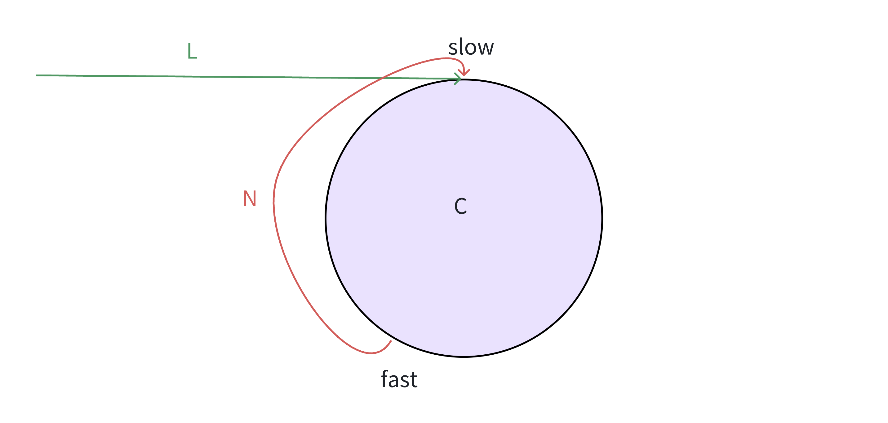

slow一次走一步，fast一次走2步，fast先进环，假设slow也走完入环前的距离，准备进环，此时fast和slow之间的距离为N，接下来的追逐过程中，每追击一次，他们之间的距离缩小1步追击过程中fast和slow之间的距离变化：

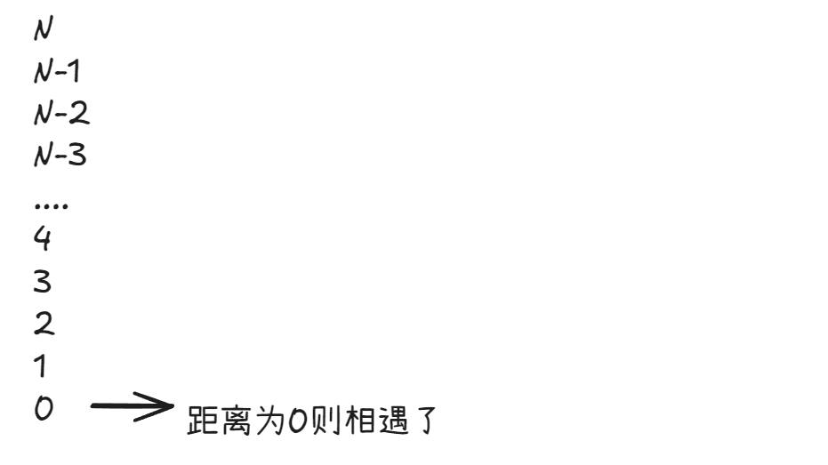

因此，在带环链表中慢指针走一步，快指针走两步最终一定会相遇。

思考2：快指针一次走3步，走4步，...n步行吗?

step1:

按照上面的分析，慢指针每次走一步，快指针每次走三步，此时快慢指针的最大距离为N，接下来的追逐过程中，每追击一次，他们之间的距离缩小2步追击过程中fast和slow之间的距离变化：

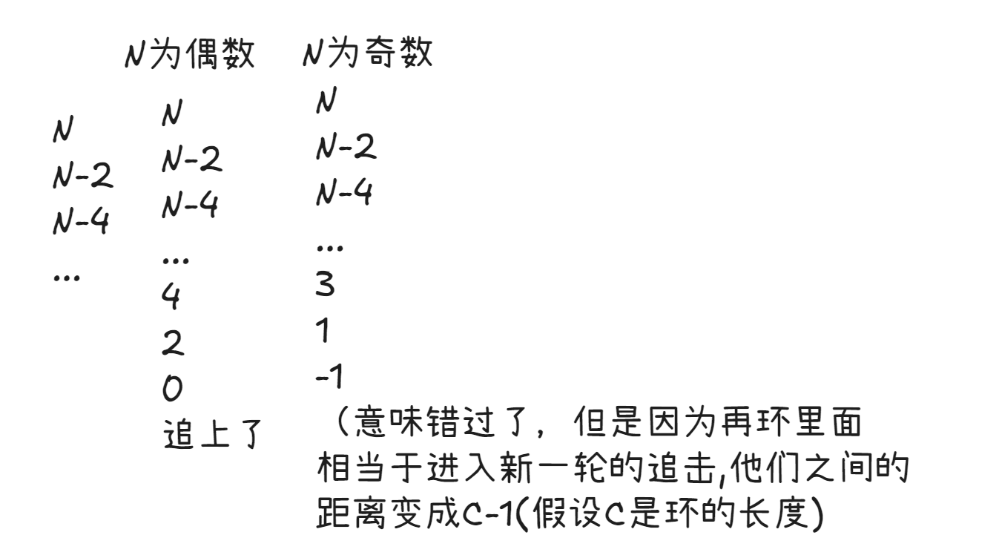

分析:

1、如果N是偶数，第一轮就追上了

2、如果，第一轮追不上，快追上，错过了N是奇数 ，距离变成-1，即C-1，进入新的一轮追击

a、**<font style="color:#DF2A3F;background-color:#FBDE28;">C-1如果是偶数，那么下一轮就追上了</font>**

b、**<font style="color:#DF2A3F;background-color:#FBDE28;">C-1如果是奇数，那么就永远都追不上</font>**

总结一下追不上的前提条件：**N是奇数，C是偶数**

step2：

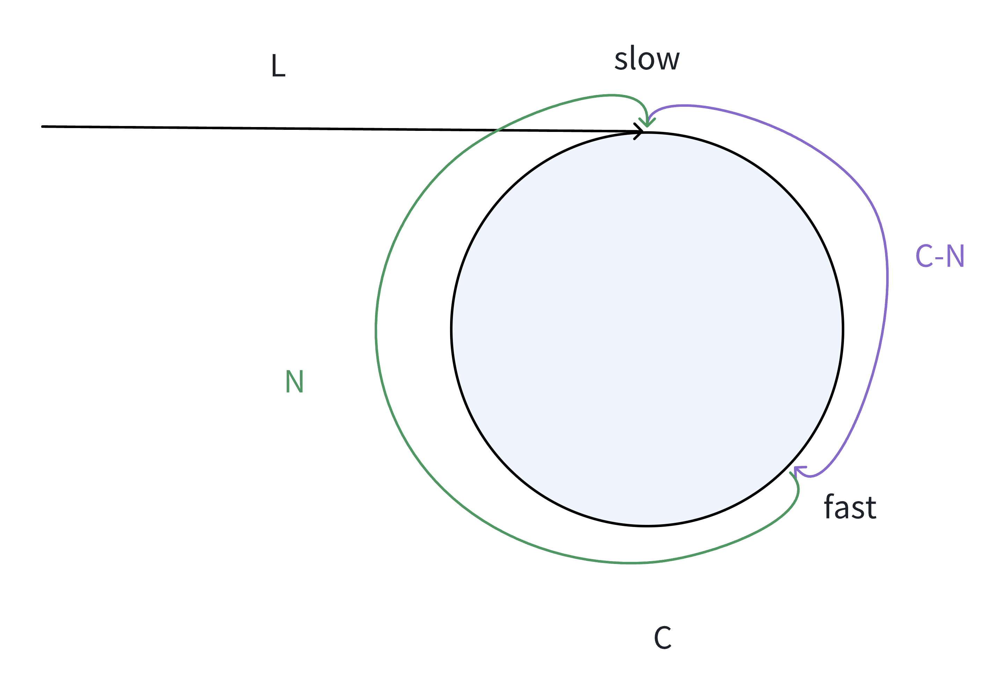

假设：

环的周长为C，头结点到slow结点的长度为L，slow走一步，fast走三步，当slow指针入环后，slow和fast指针在环中开始进行追逐，假设此时fast指针已经绕环x周。

在追逐过程中，快慢指针相遇时所走的路径长度:

`fast: L+xC+C-N`

`slow：L`

由于慢指针走一步，快指针要走三步，因此得出： `3 * 慢指针路程 = 快指针路程`，即：


对上述公式继续分析：由于偶数乘以任何数都为偶数，因此 一定为偶数，则可推导出可能得情况：

情况1：`偶数 = 偶数 - 偶数`

情况2：`偶数 = 奇数 - 奇数`

由step1中（1）得出的结论，如果N是偶数，则第一圈快慢指针就相遇了。

由step1中（2）得出的结论，如果N是奇数，则fast指针和slow指针在第一轮的时候套圈了，开始进行下一轮的追逐；当N是奇数，要满足以上的公式，则(x+1)C 必须也要为奇数，即C为奇数，满足（2）a中的结论，则快慢指针会相遇

因此， **<font style="color:#DF2A3F;background-color:#FBDE28;">step1 中的N是奇数，C是偶数，既然不存在该情况</font>**，则快指针一次走3步最终一定也可以相遇。快指针一次走4、5.....步最终也会相遇!

```c
bool hasCycle(struct ListNode* head) {
    struct ListNode *fast = head, *slow = head;
    while (fast && fast->next) {
        fast = fast->next->next;
        slow = slow->next;
        if (fast == slow)
            return true;
    }
    return false;
}
```

### 环形链表2
[142. 环形链表 II - 力扣（LeetCode）](https://leetcode.cn/problems/linked-list-cycle-ii/)

让一个指针从链表起始位置开始遍历链表,同时让一个指针从判环时相遇点的位置开始绕环运行,两个指针都是每次均走一步,最终肯定会在入口点的位置相遇。

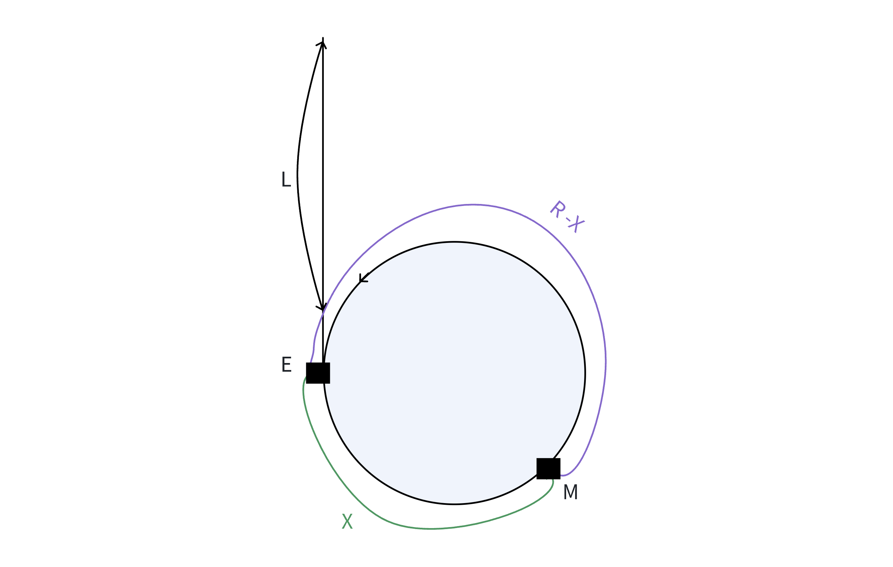

说明:

H为链表的起始点，E为环入口点，M与判环时候相遇点

设:

环的长度为R，H到E的距离为L，E到M的距离为X ，则：M到E的距离为`R-X`在判环时,快慢指针相遇时所走的路径长度:

`fast: L+X + nR`

`slow：L+X`

注意：

1. 当慢指针进入环时，快指针可能已经在环中绕了n圈了，n至少为1

因为：快指针先进环走到M的位置,，最后又在M的位置与慢指针相遇

2. 慢指针进环之后，快指针肯定会在慢指针走一圈之内追上慢指针，因为：慢指针进环后,快慢指针之间的距离最多就是环的长度,而两个指针在移动时,每次它们至今的距离都缩减一步，因此在慢指针移动一圈之前快，指针肯定是可以追上慢指针的，而快指针速度是满指针的两倍，因此有如下关系是：


(n为1,2,3,4......，n的大小取决于环的大小，环越小n越大)

极端情况下，假设n=1，此时： `L=R-X`

即：一个指针从链表起始位置运行，一个指针从相遇点位置绕环，每次都走一步，两个指针最终会在入口点的位置相遇

```c
struct ListNode* detectCycle(struct ListNode* head) {
    struct ListNode *fast = head, *slow = head;
    while (fast && fast->next) {
        fast = fast->next->next;
        slow = slow->next;
        
        if (fast == slow) {
            struct ListNode* meet = fast;
            struct ListNode* start = head;
            while (start != meet) {
                start = start->next;
                meet = meet->next;
            }
            return meet;
        }
    }
    return NULL;
}
```

### 随机链表的复制
[138. 随机链表的复制 - 力扣（LeetCode）](https://leetcode.cn/problems/copy-list-with-random-pointer/)

1. 拷贝原链表的每个节点，然后连接到每个节点之后
2. 再把random调整`copy->random = pcur->random->next;`
3. 断开原链表，得到拷贝的新链表

```c
struct Node* copyRandomList(struct Node* head) {
    if (head == NULL)
        return head;
    struct Node* pcur = head;
    // 拷贝原链表
    while (pcur) {
        struct Node* next = pcur->next;
        struct Node* newnode = (struct Node*)malloc(sizeof(struct Node));
        newnode->val = pcur->val;
        newnode->next = pcur->next;
        newnode->random = NULL;
        pcur->next = newnode;
        pcur = next;
    }
    // 设置random
    pcur = head;
    while (pcur) {
        struct Node* copy = pcur->next;
        if (pcur->random)
            copy->random = pcur->random->next;
        pcur = copy->next;
    }
    // 断开原链表
    pcur = head;
    struct Node *newhead = head->next, *newtail = head->next;
    while (newtail->next) {
        pcur = newtail->next;
        newtail->next = pcur->next;
        newtail = newtail->next;
    }
    return newhead;
}
```

