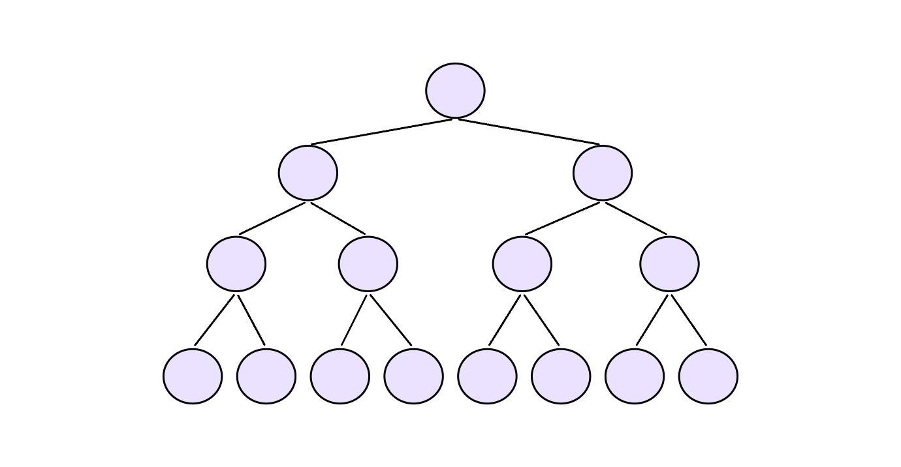
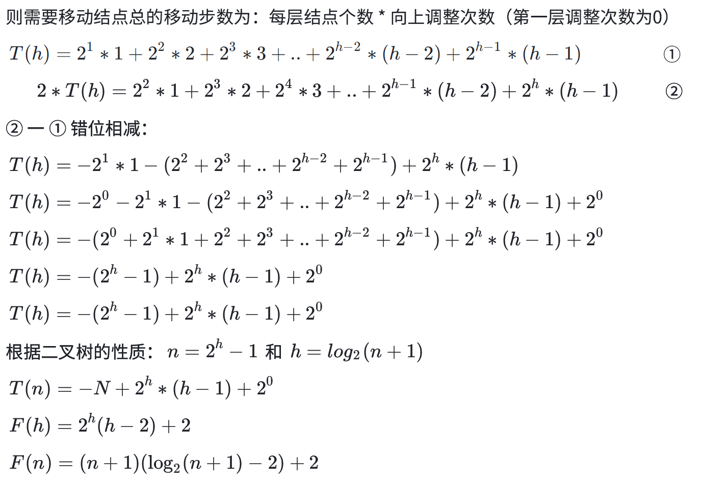
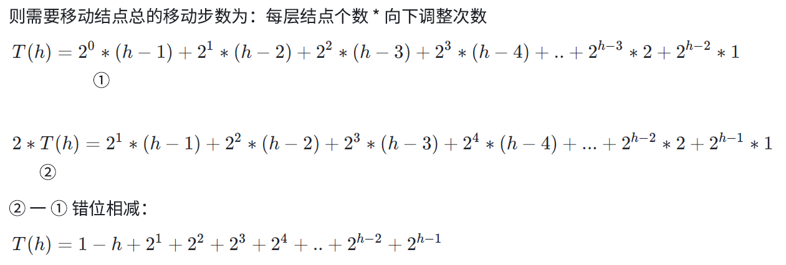
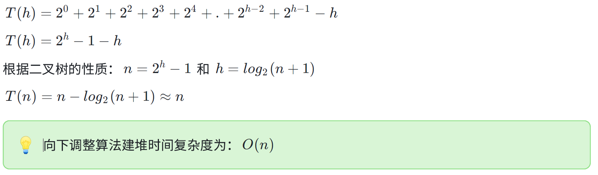
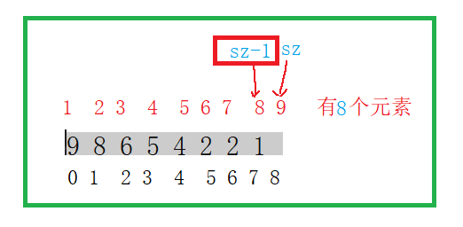
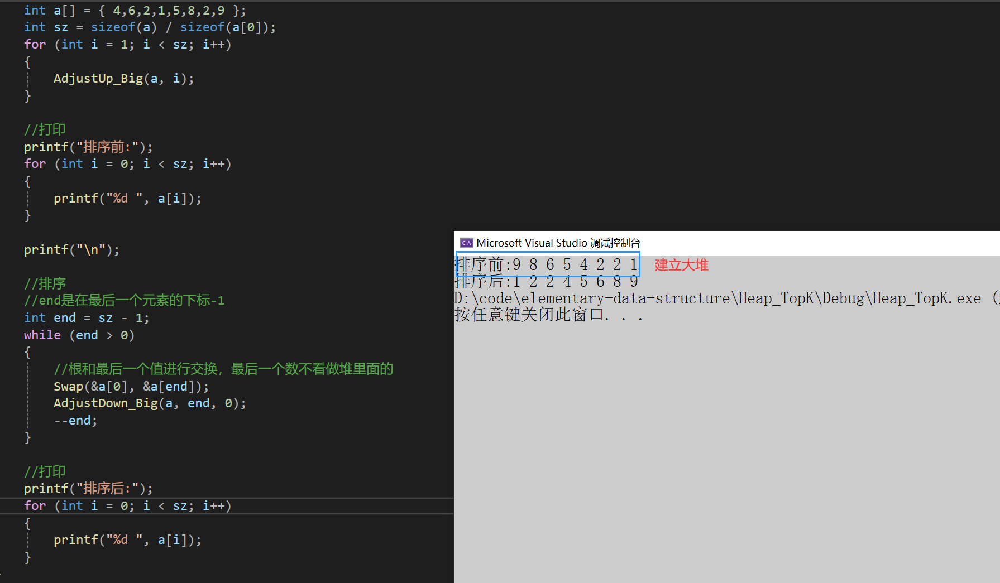
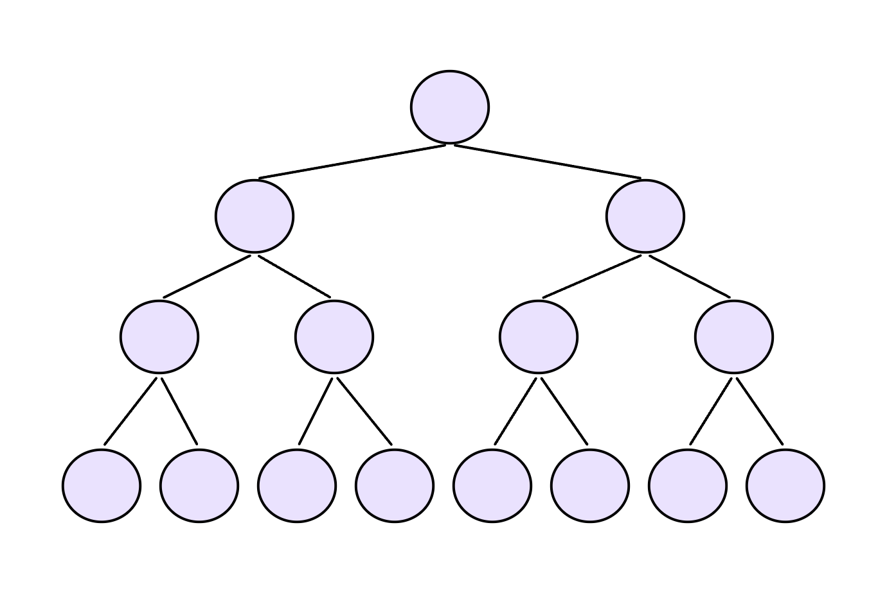
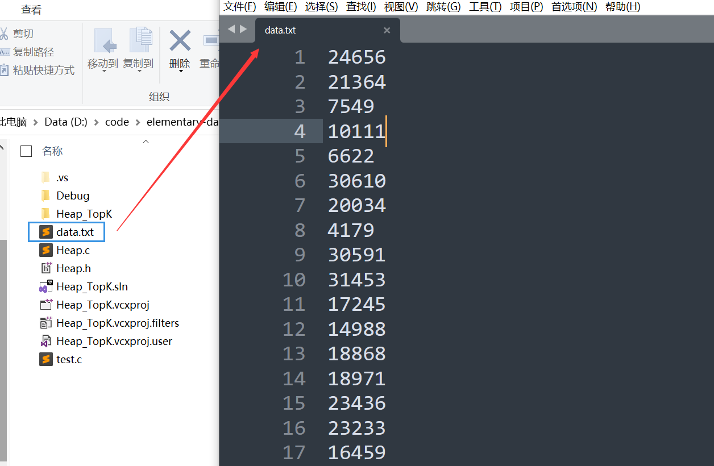
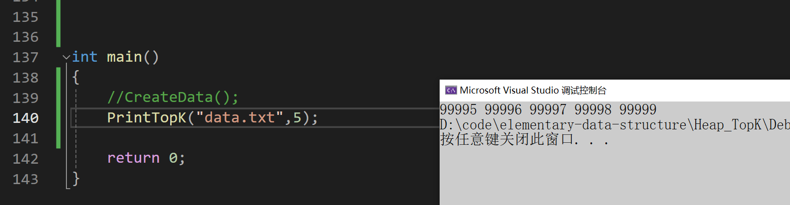
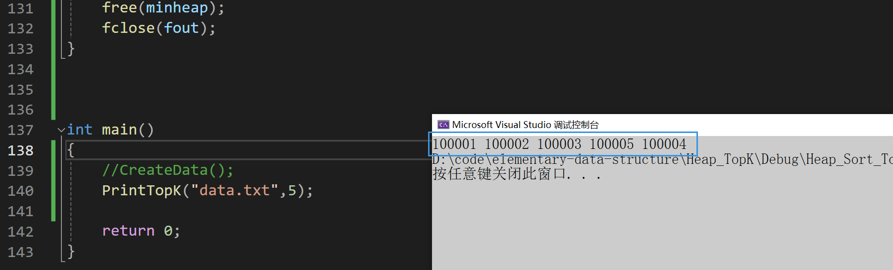

# 一、堆排序
这里堆排序首先建堆，建堆是要建小堆还是大堆呢？

在堆排序算法中，建立大顶堆的过程是为了确保堆的根节点是整个堆中最大的元素。  
当你需要进行**升序排序**时，希望**最大的元素排在序列的最后**。

堆排序的基本思想是首先将待排序的序列构建成一个大顶堆，然后将堆顶元素（最大元素）与堆的最后一个元素交换，接着对剩余的元素重新构建大顶堆，然后再次交换堆顶元素与堆的最后一个元素，如此往复，直到整个序列有序。

建立大顶堆的目的是为了每次交换后，将最大的元素沉到序列的末尾，逐步形成有序的序列。希望是升序排序，建立大顶堆是符合这一目标的。

那么是用向下调整建堆好还是向上调整建堆好，这个得具体分析一下时间复杂度

## 1.1 计算向上调整算法建堆时间复杂度
因为堆是完全二叉树，而满二叉树也是完全二叉树，此处为了简化使用满二叉树来证明(时间复杂度本来看的就是近似值，多几个结点不影响最终结果)



分析：

> 第1层， 2^0 个结点，需要向上移动0层
>
> 第2层， 2^1 个结点，需要向上移动1层
>
> 第3层， 2^2 个结点，需要向上移动2层
>
> 第4层， 2^3 个结点，需要向上移动3层
>
> ......
>
> 第h层， 2^h−1 个结点，需要向上移动h-1层
>




## 1.2 计算向下调整算法建堆时间复杂度


分析：

> 第1层， 2^0 个结点，需要向下移动h-1层
>
> 第2层， 2^1 个结点，需要向下移动h-2层
>
> 第3层， 2^2 个结点，需要向下移动h-3层
>
> 第4层， 2^3 个结点，需要向下移动h-4层
>
> ......
>
> 第h-1层， 2^h−2 个结点，需要向下移动1层
>





### 1.3 建立大堆
```c
void Swap(HPDataType* p1, HPDataType* p2)
{
    HPDataType tmp = *p1;
    *p1 = *p2;
    *p2 = tmp;
}
void AdjustUp_Big(HPDataType* a, int child)
{
    int parent = (child - 1) / 2;
    while (child > 0)
    {
        if (a[child] > a[parent])
        {
            Swap(&a[child], &a[parent]);

            child = parent;
            parent = (child - 1) / 2;
        }
        else
        {
            break;
        }
    }
}
```

**测试一下：**

```c
int a[] = { 4,6,2,1,5,8,2,9 };
int sz = sizeof(a) / sizeof(a[0]);
for (int i = 1; i < sz; i++)
{
    AdjustUp_Big(a, i);
}
```

### 1.4 排序
```c
void AdjustDown_Big(HPDataType* a, int size, int parent)
{
    int child = parent * 2 + 1;
    while (child < size)
    {
        if (child + 1 < size && a[child + 1] > a[child])
            ++child;
        
        if (a[child] > a[parent])
        {
            Swap(&a[child], &a[parent]);

            parent = child;
            child = parent * 2 + 1;
        }
        else
        {
            break;
        }
    }
}
```



```c
//end是在最后一个元素的下标-1
int end = sz - 1;
while (end > 0)
{
    //根和最后一个值进行交换，最后一个数不看做堆里面的
    Swap(&a[0], &a[end]);
    AdjustDown_Big(a, end, 0);
    --end;
}
```

### 1.5 结果以及全部代码
```c
void Swap(HPDataType* p1, HPDataType* p2)
{
    HPDataType tmp = *p1;
    *p1 = *p2;
    *p2 = tmp;
}
void AdjustUp_Big(HPDataType* a, int child)
{
    int parent = (child - 1) / 2;
    while (child > 0)
    {
        if (a[child] > a[parent])
        {
            Swap(&a[child], &a[parent]);

            child = parent;
            parent = (child - 1) / 2;
        }
        else
        {
            break;
        }
    }
}
void AdjustDown_Big(HPDataType* a, int size, int parent)
{
    int child = parent * 2 + 1;
    while (child < size)
    {
        if (child + 1 < size && a[child + 1] > a[child])
            ++child;
        
        if (a[child] > a[parent])
        {
            Swap(&a[child], &a[parent]);

            parent = child;
            child = parent * 2 + 1;
        }
        else
        {
            break;
        }
    }
}

void HeapSort()
{
    //建大堆
    int a[] = { 4,6,2,1,5,8,2,9 };
    int sz = sizeof(a) / sizeof(a[0]);
    /*for (int i = 1; i < sz; i++)
    {
        AdjustUp_Big(a, i);
    }*/
    
    // 向下调整建堆，这样效率更高，上面那个也可以
    // 从最后一个节点的父亲开始调整
    for (int i = (sz - 1 - 1) / 2; i >= 0; --i)
    {
        AdjustDown_Big(a, sz, i);
    }

    //打印
    printf("排序前:");
    for (int i = 0; i < sz; i++)
    {
        printf("%d ", a[i]);
    }
    
    printf("\n");

    //排序
    //end是在最后一个元素的下标-1
    int end = sz - 1;
    while (end > 0)
    {
        //根和最后一个值进行交换，最后一个数不看做堆里面的
        Swap(&a[0], &a[end]);
        AdjustDown_Big(a, end, 0);
        --end;
    }

    //打印
    printf("排序后:");
    for (int i = 0; i < sz; i++)
    {
        printf("%d ", a[i]);
    }
}
```



### 1.6 堆排序时间复杂度计算


分析：

第1层， 2^0个结点，交换到根结点后，需要向下移动0层

第2层， 2^1个结点，交换到根结点后，需要向下移动1层

第3层， 2^2个结点，交换到根结点后，需要向下移动2层

第4层， 2^3个结点，交换到根结点后，需要向下移动3层

......

第h层，2^h-1个结点，交换到根结点后，需要向下移动h-1层


# 二、TOP-K问题
TOP-K问题：即求数据结合中前K个最大的元素或者最小的元素，一般情况下数据量都比较大。就是从N个数里面找最大前K个（N远大于K）

**思路一：**

+ N个数插入到堆里面，PopK次

> 时间复杂度是`O(N*logN) + K*logN` == `O(N*logN)`
>

+ N很大很大，假设N是100亿，K是10  
100亿个整数大概需要40G左右

> 所以这个思路很不好
>

**思路二：**

+ 读取前K个值，建立K个数的小堆  
依次再取后面的值，跟堆顶比较，如果比堆顶大，替换堆顶进堆（替换对顶值，再向下调整）

> 时间复杂度是`O(N*logK)`
>


**1）用数据集合中前K个元素来建堆**

前k个最大的元素，则建小堆

前k个最小的元素，则建大堆

**2）用剩余的N-K个元素依次与堆顶元素来比较，不满足则替换堆顶元素**

将剩余N-K个元素依次与堆顶元素比完之后，堆中剩余的K个元素就是所求的前K个最小或者最大的元素

### 2.1 随机生成一些数据，找前k个最大值
+ 那么我们就先要造数据，**随机生成**

```c
void CreateData()
{
    //造数据
    int n = 100000;
    srand(time(0));
    const char* file = "data.txt";
    FILE* fin = fopen(file, "w");
    if (fin == NULL)
    {
        perror("fopen error");
        return;
    }
    for (int i = 0; i < n; i++)
    {
        int x = (rand() + i) % 100000;
        fprintf(fin, "%d\n", x);
    }
    fclose(fin);
}
```

+ 打开项目的源文件所在的文件夹，就会有这个data.txt的文件，里面已经随机生成了10万个数字



### 2.2 进行取前k个值建堆
1. 我们先从文件中读数据
2. 然后取前k个进行建立一个小堆
3. 读取前k个数，边读边建立小堆
4. 如果读取的整数 x 大于堆顶元素，将堆顶元素替换为 x，然后进行向下调整

```c
void PrintTopK(const char* file, int k)
{
    //读文件
    FILE* fout = fopen(file, "r");
    if (fout == NULL)
    {
        perror("fopen error");
        return;
    }

    //建立一个k个数的小堆
    int* minheap = (int*)malloc(sizeof(int) * k);
    if (minheap == NULL)
    {
        perror("malloc error");
        return;
    }

    //读取前k个数
    //边读边建小堆
    /*for (int i = 0; i < k; i++)
    {
        fscanf(fout, "%d", &minheap[i]);
        AdjustUp(minheap, i);
    }*/
    
    // 建小堆
    for (int i = (k-1-1)/2; i >= 0; i--)
    {
        AdjustDown(minheap, k, i);
    }
    //读取剩余的值，读到x里
    int x = 0;
    while (fscanf(fout, "%d", &x) != EOF)
    {
        if (x > minheap[0])
        {
            minheap[0] = x;
            //向下调整
            AdjustDown(minheap, k, 0);
        }
    }

    for (int i = 0; i < k; i++)
    {
        printf("%d ", minheap[i]);
    }
    
    free(minheap);
    fclose(fout);
}
```

### 2.3 找到了前k个结果以及全部代码
比如我取前5个最大的：

```c
void AdjustUp(HPDataType* a, int child)
{
    int parent = (child - 1) / 2;
    while (child > 0)
    {
        if (a[child] < a[parent])
        {
            Swap(&a[child], &a[parent]);

            child = parent;
            parent = (child - 1) / 2;
        }
        else
        {
            break;
        }
    }
}
void AdjustDown(HPDataType* a, int size, int parent)
{
    int child = parent * 2 + 1;
    while (child < size)
    {
        if (child + 1 < size && a[child + 1] < a[child])
            ++child;
        
        if (a[child] < a[parent])
        {
            Swap(&a[child], &a[parent]);

            parent = child;
            child = parent * 2 + 1;
        }
        else
        {
            break;
        }
    }
}

void CreateData()
{
    //造数据
    int n = 100000;
    srand(time(0));
    const char* file = "data.txt";
    FILE* fin = fopen(file, "w");
    if (fin == NULL)
    {
        perror("fopen error");
        return;
    }
    for (int i = 0; i < n; i++)
    {
        int x = (rand() + i) % 100000;
        fprintf(fin, "%d\n", x);
    }
    fclose(fin);
}


void PrintTopK(const char* file, int k)
{
    //读文件
    FILE* fout = fopen(file, "r");
    if (fout == NULL)
    {
        perror("fopen error");
        return;
    }

    //建立一个k个数的小堆

    int* minheap = (int*)malloc(sizeof(int) * k);
    if (minheap == NULL)
    {
        perror("malloc error");
        return;
    }

    //读取前k个数
    for (int i = 0; i < k; i++)
    {
        fscanf(fout, "%d", &minheap[i]);
        //向上调整
        AdjustUp(minheap, i);
    }

    //边读边建小堆
    //读取剩余的值，读到x里
    int x = 0;
    while (fscanf(fout, "%d", &x) != EOF)
    {
        //如果堆里的元素小于x就继续调整
        if (minheap[0] < x)
        {
            //将x搞到堆顶
            minheap[0] = x;
            //向下调整
            AdjustDown(minheap, k, 0);
        }
    }

    for (int i = 0; i < k; i++)
    {
        printf("%d ", minheap[i]);
    }

    free(minheap);
    fclose(fout);
}

int main()
{
    //CreateData();
    PrintTopK("data.txt",5);

    return 0;
}
```



+ 那么我们知道这前5个是最大的吗？
+ 这个时候就要加入我们的**密探**，手动从文件里加入5个最大的数
    - 加入这几个数`100001` `100002` `100003` `100005` `100004`
    - 然后再执行代码，可以看到已经完美的出来了




