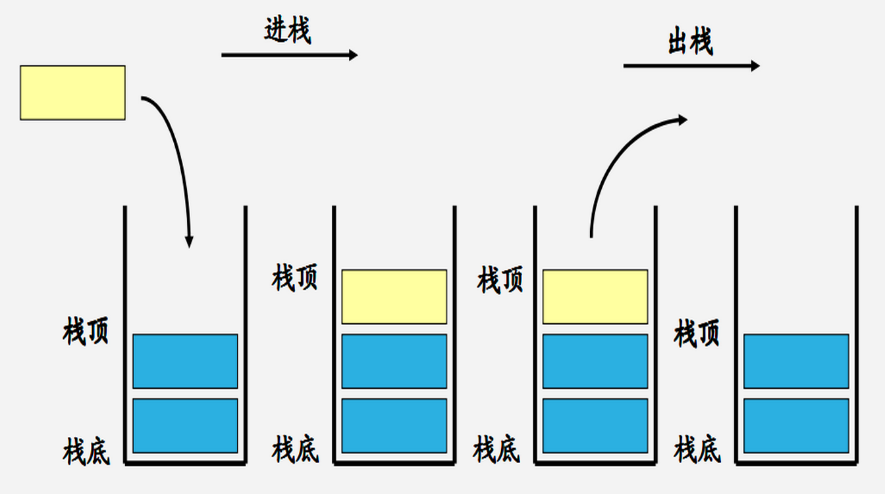
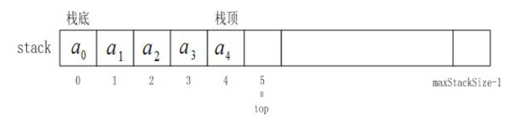
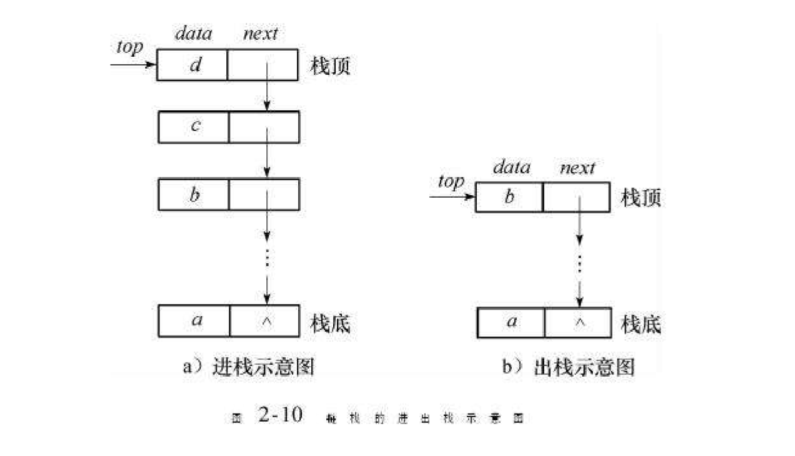
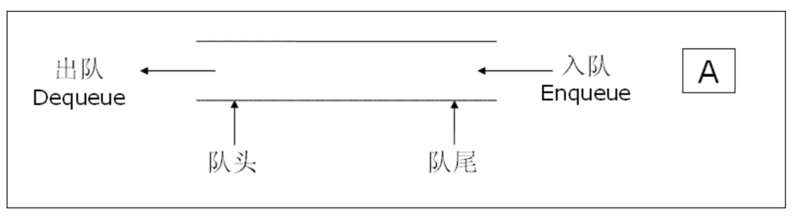
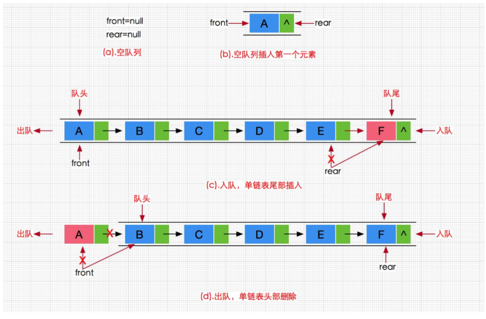
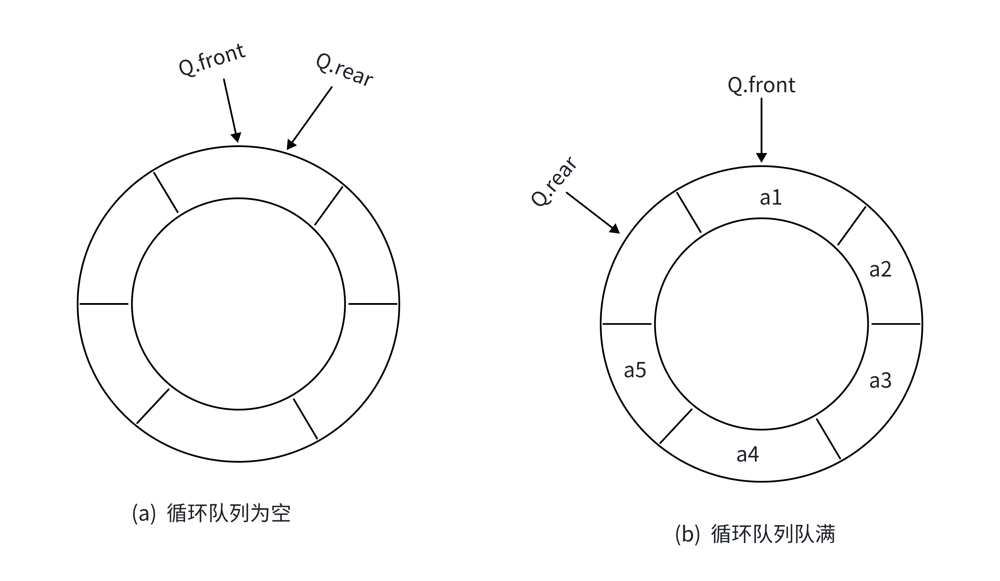

# 一、栈的概念及结构
+ 栈：一种特殊的线性表，其只允许在固定的一端进行插入和删除元素操作。进行数据插入和删除操作的一端称为栈顶，另一端称为栈底。栈中的数据元素遵守后进先出`LIFO`（Last In First Out）的原则。
+ 压栈：栈的插入操作叫做进栈/压栈/入栈，入数据在栈顶。
+ 出栈：栈的删除操作叫做出栈。出数据也在栈顶。



## 1.1 栈的实现
栈的实现一般可以使用数组或者链表实现，相对而言数组的结构实现更优一些。因为数组在尾上插入数据的代价比较小。





## 1.2 Stack.h
```c
#pragma once

#include<stdio.h>
#include<assert.h>
#include<stdlib.h>
#include<stdbool.h>

typedef int STDataType;

typedef struct Stack
{
    STDataType* a;
    int top;
    int capacity;
}ST;

// 初始化栈
void StackInit(ST* ps);
// 入栈
void StackPush(ST* ps, STDataType x);
// 出栈
void StackPop(ST* ps);
// 获取栈顶元素
STDataType StackTop(ST* ps);
// 获取栈中有效元素个数
int StackSize(ST* ps);
// 检测栈是否为空，如果为空返回非零结果，如果不为空返回0
bool StackEmpty(ST* ps);
// 销毁栈
void StackDestroy(ST* ps);
```

### 初始化栈
```c
void StackInit(ST* ps)
{
    assert(ps);
    ps->a = NULL;
    ps->capacity = 0;
    ps->top = 0;
}
```

### 入栈
```c
void StackPush(ST* ps, STDataType x)
{
    assert(ps);
    if (ps->capacity == ps->top)
    {
        STDataType newcapacity = ps->capacity == 0 ? 4 : ps->capacity * 2;
        STDataType* tmp = (STDataType*)realloc(ps->a, sizeof(STDataType) * newcapacity);
        if (tmp == NULL)
        {
            perror("relloc fail!\n");
            exit(-1);
        }
        ps->a = tmp;
        ps->capacity = newcapacity;
    }
    ps->a[ps->top] = x;
    ps->top++;
}
```

### 出栈
```c
void StackPop(ST* ps)
{
    assert(ps);
    assert(ps->top > 0);
    ps->top--;
}
```

### 获取栈顶元素
```c
STDataType StackTop(ST* ps)
{
    assert(ps);
    assert(ps->top > 0);
    return ps->a[ps->top - 1];
}
```

### 获取栈中有效元素个数
```c
int StackSize(ST* ps)
{
    assert(ps);
    return ps->top;
}
```

### 检测栈是否为空
```c
bool StackEmpty(ST* ps)
{
    assert(ps);
    return ps->top == 0;
}
```

### 销毁栈
```c
void StackDestroy(ST* ps)
{
    assert(ps);
    ps->a = NULL;
    ps->capacity = ps->top = 0;
}
```

## 1.3 Stack.c
```c
#define _CRT_SECURE_NO_WARNINGS 1

#include"Stack.h"

// 初始化栈
void StackInit(ST* ps)
{
    assert(ps);
    ps->a = NULL;
    ps->capacity = 0;
    //top 表示指向栈顶元素
    //ps->top = -1;
    //top 表示指向栈顶元素的下一个
    ps->top = 0;
}
// 入栈
void StackPush(ST* ps, STDataType x)
{
    assert(ps);
    if (ps->capacity == ps->top)
    {
        STDataType newcapacity = ps->capacity == 0 ? 4 : ps->capacity * 2;
        STDataType* tmp = (STDataType*)realloc(ps->a, sizeof(STDataType) * newcapacity);
        if (tmp == NULL)
        {
            perror("relloc fail!\n");
            exit(-1);
        }
        ps->a = tmp;
        ps->capacity = newcapacity;
    }
    ps->a[ps->top] = x;
    ps->top++;
}
// 出栈
void StackPop(ST* ps)
{
    assert(ps);
    assert(ps->top > 0);
    ps->top--;
}
// 获取栈顶元素
STDataType StackTop(ST* ps)
{
    assert(ps);
    assert(ps->top > 0);
    return ps->a[ps->top - 1];
}
// 获取栈中有效元素个数
int StackSize(ST* ps)
{
    assert(ps);
    return ps->top;
}
// 检测栈是否为空，如果为空返回非零结果，如果不为空返回0
bool StackEmpty(ST* ps)
{
    assert(ps);
    return ps->top == 0;
}
// 销毁栈
void StackDestroy(ST* ps)
{
    assert(ps);
    ps->a = NULL;
    ps->capacity = ps->top = 0;
}
```

# 二、队列的概念及结构
+ 队列：只允许在一端进行插入数据操作，在另一端进行删除数据操作的特殊线性表，队列具有先进先出`FIFO(First In First Out)` 
+ 入队列：进行插入操作的一端称为队尾 出队列：进行删除操作的一端称为队头



## 2.1 队列的实现
+ 队列也可以数组和链表的结构实现，使用链表的结构实现更优一些，因为如果使用数组的结构， 出队列在数组头上出数据，效率会比较低。



## 2.2 Queue.h
```c
#pragma once
#include<stdio.h>
#include<assert.h>
#include<stdlib.h>
#include<stdbool.h>

typedef int QDataType;

typedef struct QListNode
{
    QDataType val;
    struct QListNode* next;
}QNode;
// 队列的结构
typedef struct Queue
{
    QNode* phead;
    QNode* ptail;
    QDataType size;
}Queue;
// 初始化队列
void QueueInit(Queue* pq);
// 队尾入队列
void QueuePush(Queue* pq, QDataType x);
// 队头出队列
void QueuePop(Queue* pq);
// 获取队列头部元素
QDataType QueueFront(Queue* pq);
// 获取队列队尾元素
QDataType QueueBack(Queue* pq);
// 获取队列中有效元素个数
int QueueSize(Queue* pq);
// 检测队列是否为空，如果为空返回非零结果，如果非空返回0
int QueueEmpty(Queue* pq);
// 销毁队列
void QueueDestroy(Queue* pq);
```

### 初始化队列
```c
void QueueInit(Queue* pq)
{
    assert(pq);
    pq->phead = pq->ptail = NULL;
    pq->size = 0;
}
```

### 队尾入队列【重点】
```c
void QueuePush(Queue* pq, QDataType x)
{
    assert(pq);
    QNode* newnode = (QNode*)malloc(sizeof(QNode));
    if (newnode == NULL)
    {
        perror("malloc fail!\n");
        return;
    }
    
    newnode->val = x;
    newnode->next = NULL;

    if (pq->ptail == NULL)
    {
        pq->phead = pq->ptail = newnode;
    }
    else
    {
        pq->ptail->next = newnode;
        pq->ptail = newnode;
    }
    pq->size++;
}
```

### 队头出队列【重点】
```c
void QueuePop(Queue* pq)
{
    assert(pq);
    assert(pq->phead);
    QNode* del = pq->phead;
    pq->phead = pq->phead->next;
    free(del);
    del = NULL;

    if (pq->phead == NULL)
        pq->ptail = NULL;
    pq->size--;
}
```

### 获取队列头部元素
```c
QDataType QueueFront(Queue* pq)
{
    assert(pq);
    assert(pq->phead);
    return pq->phead->val;
}
```

### 获取队列队尾元素
```c
QDataType QueueBack(Queue* pq)
{
    assert(pq);
    assert(pq->ptail);
    return pq->ptail->val;
}
```

### 获取队列中有效元素个数
```c
int QueueSize(Queue* pq)
{
    assert(pq);
    return pq->size;
}
```

### 检测队列是否为空
```c
int QueueEmpty(Queue* pq)
{
    assert(pq);
    return pq->size == 0;
}
```

### 销毁队列
```c
void QueueDestroy(Queue* pq)
{
    assert(pq);
    QNode* cur = pq->phead;
    while (cur != NULL)
    {
        QNode* next = cur->next;
        free(cur);
        cur = next;
    }
    pq->phead = pq->ptail = NULL;
    pq->size = 0;
}
```

## 2.3 Queue.c
```c
#include"Queue.h"

// 初始化队列
void QueueInit(Queue* pq)
{
    assert(pq);
    pq->phead = pq->ptail = NULL;
    pq->size = 0;
}
// 队尾入队列
void QueuePush(Queue* pq, QDataType x)
{
    assert(pq);
    QNode* newnode = (QNode*)malloc(sizeof(QNode));
    if (newnode == NULL)
    {
        perror("malloc fail!\n");
        return;
    }
    
    newnode->val = x;
    newnode->next = NULL;

    if (pq->ptail == NULL)
    {
        pq->phead = pq->ptail = newnode;
    }
    else
    {
        pq->ptail->next = newnode;
        pq->ptail = newnode;
    }
    pq->size++;
}
// 队头出队列
void QueuePop(Queue* pq)
{
    assert(pq);
    assert(pq->phead);
    QNode* del = pq->phead;
    pq->phead = pq->phead->next;
    free(del);
    del = NULL;

    if (pq->phead == NULL)
        pq->ptail = NULL;
    pq->size--;
}
// 获取队列头部元素
QDataType QueueFront(Queue* pq)
{
    assert(pq);
    assert(pq->phead);
    return pq->phead->val;
}
// 获取队列队尾元素
QDataType QueueBack(Queue* pq)
{
    assert(pq);
    assert(pq->ptail);
    return pq->ptail->val;
}
// 获取队列中有效元素个数
int QueueSize(Queue* pq)
{
    assert(pq);
    return pq->size;
}
// 检测队列是否为空，如果为空返回非零结果，如果非空返回0
int QueueEmpty(Queue* pq)
{
    assert(pq);
    return pq->size == 0;
}
// 销毁队列
void QueueDestroy(Queue* pq)
{
    assert(pq);
    QNode* cur = pq->phead;
    while (cur != NULL)
    {
        QNode* next = cur->next;
        free(cur);
        cur = next;
    }
    pq->phead = pq->ptail = NULL;
    pq->size = 0;
}
```

# 三、OJ题
## 有效的括号
[20. 有效的括号 - 力扣（LeetCode）](https://leetcode.cn/problems/valid-parentheses/)

```cpp
class Solution {
public:
    bool isValid(string s) {
        std::stack<char> st;
        int i = 0;
        char t;
        for (auto e : s) {
            if (e == '(' || e == '{' || e == '[')
                st.push(e);
            else {
                if (st.empty())
                    return false;
                t = st.top();
                if (t == '(' && e != ')' || t == '[' && e != ']' ||
                    t == '{' && e != '}')
                    return false;
                st.pop();
            }
        }
        return st.empty();
    }
};
```

## 用队列实现栈
[225. 用队列实现栈 - 力扣（LeetCode）](https://leetcode.cn/problems/implement-stack-using-queues/)

法1：使用两个队列

1. 先入其中一个空队列
2. 要取元素就需要把元素倒到另外一个队列，直到剩下一个，就是要返回的值
3. 这样反复即可实现

```cpp
class MyStack {
private:
    queue<int> q1;
    queue<int> q2;

public:
    MyStack() {}

    void push(int x) {
        if (!q1.empty()) {
            q1.push(x);
        } else {
            q2.push(x);
        }
    }

    int pop() {
        // 假设q1为空，q2不为空
        queue<int>* emp = &q1;
        queue<int>* noemp = &q2;
        if (!q1.empty()) {
            noemp = &q1;
            emp = &q2;
        }
        // 移动size-1个元素到空队列里
        while (noemp->size() > 1) {
            emp->push(noemp->front());
            noemp->pop();
        }
        // 取剩下一个元素了，直接返回
        int top = noemp->front();
        noemp->pop();
        return top;
    }

    int top() {
        if (!q1.empty())
            return q1.back();
        else
            return q2.back();
    }

    bool empty() { return q1.empty() && q2.empty(); }
};
```

法2：使用一个队列

1. 直接把size-1个元素push到自己的队列里
2. 再取第一个元素就是要返回的值

```cpp
class MyStack {
private:
    queue<int> q;
public:
    MyStack() {}

    void push(int x) { q.push(x); }

    int pop() {
        // 先取队列的所有元素
        int size = q.size();
        // 然后再把size-1个元素全部再重新入队
        while (size-- > 1) {
            q.push(q.front());
            q.pop();
        }
        // 剩下的一个就是要返回的值
        int top = q.front();
        q.pop();
        return top;
    }

    int top() { return q.back(); }

    bool empty() { return q.empty(); }
};
```

## 用栈实现队列
[232. 用栈实现队列 - 力扣（LeetCode）](https://leetcode.cn/problems/implement-queue-using-stacks/)

一个栈只push，一个栈只pop

```cpp
class MyQueue {
private:
    stack<int> pushst;
    stack<int> popst;

public:
    MyQueue() {}

    void push(int x) { pushst.push(x); }

    int pop() {
        int top = peek();
        popst.pop();
        return top;
    }
    // 取队头
    int peek() {
        if (popst.empty()) {
            while (!pushst.empty()) {
                popst.push(pushst.top());
                pushst.pop();
            }
        }
        int top = popst.top();
        return top;
    }

    bool empty() { return pushst.empty() && popst.empty(); }
};
```

## 设计循环队列
[622. 设计循环队列 - 力扣（LeetCode）](https://leetcode.cn/problems/design-circular-queue/)

实际中还有一种特殊的队列叫循环队列，环形队列首尾相连成环，环形队列可以使用数组实现，也可以使用循环链表实现



```cpp
class MyCircularQueue {
private:
    int* a;
    int front;
    int rear;
    int capacity;

public:
    MyCircularQueue(int k) {
        a = new int[k + 1];
        front = rear = 0;
        capacity = k;
    }
    bool isEmpty() { return front == rear; }

    bool isFull() { return (rear + 1) % (capacity + 1) == front; }

    bool enQueue(int value) {
        if (isFull())
            return false;
        a[rear++] = value;
        rear %= capacity + 1;
        return true;
    }

    bool deQueue() {
        if (isEmpty())
            return false;
        front++; // 删除
        front %= capacity + 1;
        return true;
    }

    int Front() {
        if (isEmpty())
            return -1;
        return a[front];
    }

    int Rear() {
        if (isEmpty())
            return -1;
        if (rear == 0)
            return a[capacity];
        else
            return a[rear - 1];
    }
};
```

