# 一、准备
## 数据结构相关概念
+ 什么是数据结构？

数据结构是由“数据”和“结构”两词组合而来。

+ 什么是数据？

常见的数值1、2、3、4.....、教务系统里保存的用户信息（姓名、性别、年龄、学历等等）、网页肉眼可以看到的信息（文字、图片、视频等等），这些都是数据.

+ 什么是结构？

当我们想要使用大量使用同一类型的数据时，通过手动定义大量的独立的变量对于程序来说，可读性非常差，我们可以借助数组这样的数据结构将大量的数据组织在一起，结构也可以理解为组织数据的方式。想要找到草原上名叫“咩咩”的羊很难，但是从羊圈里找到1号羊就很简单，羊圈这样的结构有效将羊群组织起来。

+ 概念：数据结构是计算机**存储**、**组织数据**的方式。数据结构是指相互之间存在⼀种或多种特定关系的数据元素的集合。数据结构反映数据的内部构成，即数据由那部分构成，以什么方式构成，以及数据元素之间呈现的结构。

**总结：**

1）能够存储数据（如顺序表、链表等结构）  
2）存储的数据能够方便查找

+ 通过数据结构，能够有效将数据组织和管理在⼀起。按照我们的方式任意对数据进行增删改查等操作。

最基础的数据结构：数组

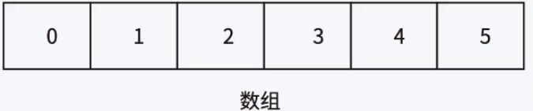

【思考】有了数组，为什么还要学习其他的数据结构？  
假定数组有10个空间，已经使用了5个，向数组中插入数据步骤：

+ 求数组的长度，求数组的有效数据个数，向下标为数据有效个数的位置插⼊数据（注意：这里是否要判断数组是否满了，满了还能继续插入吗）.....
+ 假设数据量非常庞大，频繁的获取数组有效数据个数会影响程序执行效率。

> 结论：最基础的数据结构能够提供的操作已经不能完全满足复杂算法实现
>

# 二、开始顺序表
## 1. 顺序表的概念及结构
 **线性表的概念：**

+ 线性表（linear list）是n个具有相同特性的数据元素的有限序列。 线性表是⼀种在实际中广泛使用的数据结构，常见的线性表：顺序表、链表、栈、队列、字符串... 线性表在逻辑上是线性结构，也就说是连续的⼀条直线。但是在物理结构上并不一定是连续的，线性表在物理上存储时，通常以数组和链式结构的形式存储。

## 2. 顺序表分类
+ 顺序表和数组的区别
    - 顺序表的底层结构是数组,所以顺序表在逻辑结构上是线性的,在物理结构上也是线性的
    - 数组分为定长数组和动态数组
+ 顺序表分类
    - 静态顺序表
    - 动态顺序表
+ 概念:使用定长数组存储元素

静态顺序表

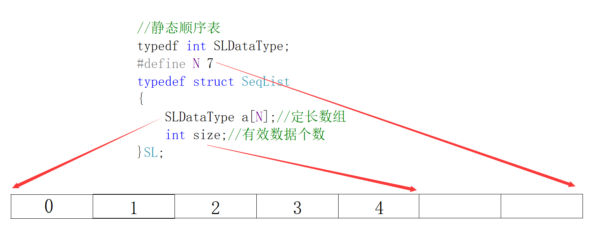

+ 静态顺序表缺陷：空间给少了不够用，给多了造成空间浪费

动态顺序表

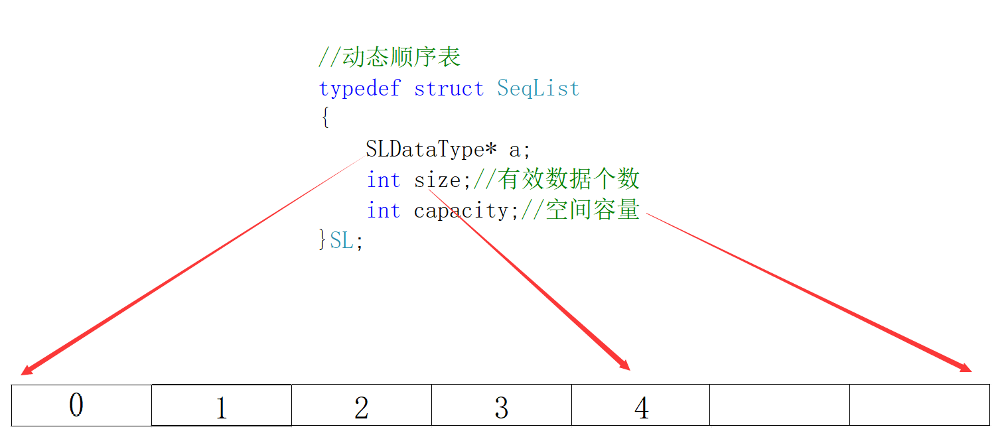

## 3. 动态顺序表的实现
在我们实现顺序表的时候，首先定义出结构体，还有数据类型的定义

头文件：`SeqList.h`

其中`size`是记录多少个有效数据，为什么要定义这个`capacity`呢？因为是动态的顺序表，今天100的空间，明天200的空间，所以就是`capacity`空间有多大，空间容量

我们可以看到我们当前的顺序表只能存储的是整形的数据，假如我把顺序表实现好了，我给其他人使用的时候，那我这里是整形，那能不能是char类型，double型...，我这里为什么一定要定义int类型？

那么我们这里就要使用`typedef`来定义类型

那我们也给这个结构体也重命名一个名字

```c
#pragma once
//头文件
#include<stdio.h>

//数据类型的定义
typedef int SLDataType;

//结构体的定义
typedef struct SeqList
{
    SLDataType* a;
    int size;
    int capacity;
}SL;
```

### 初始化顺序表
函数的声明:`SeqList.h`

```c
//初始化顺序表
void SLInit(SL s);
```

函数的实现:`SeqList.c`

```c
//初始化顺序表
void SLInit(SL* ps)
{
    assert(ps);
    ps->a = NULL;
    ps->capacity = ps->size = 0;
}
```

+ 这里需要指针来初始化
+ 可以看到已经初始化成功了

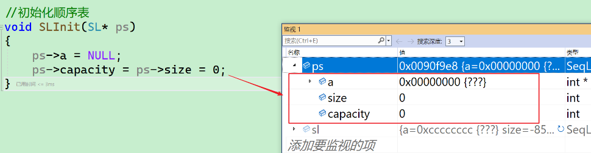

### 顺序表的销毁
函数的声明:`SeqList.h`

```c
//销毁顺序表
void SLDestroy(SL* ps);
```

函数的实现:`SeqList.c`

+ 我们首先要判断这个顺序表为有没有开辟空间，如果没有开辟空间就不需要释放，开辟了再`free`
+ 将顺序表连续的空间的首地址指向空，有效数据个数和容量均置为0。
+ 这里的ps有没有可能传过来的是`NULL`所以我们就需要断言

```c
void SeqListDestroy(SeqList* ps)
{
    assert(ps);
    free(ps->a);
    ps->a = NULL;
    ps->capacity = ps->size = 0;
}
```

### 检查容量
```c
void SLCheckCapacity(SL* ps)
{
    assert(ps);
    if (ps->size == ps->capacity) {
        int newCapacity = ps->capacity == 0 ? 4 : 2 * ps->capacity;
        //空间不够，需要扩容
        SLDataType* tmp = (SLDataType*)realloc(ps->a, newCapacity * sizeof(SLDataType));
        if (tmp == NULL) {
            perror("realloc fail!");
            return;
        }
        ps->a = tmp;
        ps->capacity = newCapacity;
    }
}
```

### 顺序表的尾插
尾插有两种情况

第一种是空间足够可以直接插入

第二种就是空间不够，需要先检查扩容，再插入

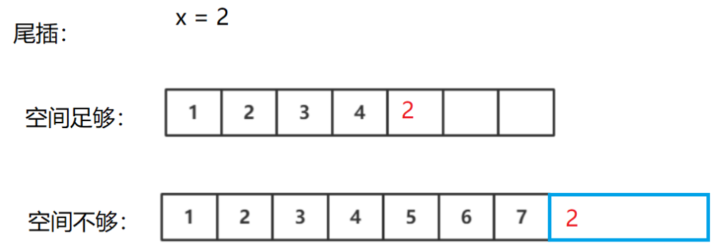


+ 所以我们的做法是：
1. 判断顺序表是否有足够的空间，如果有，直接插入
2. 空间不够，需要扩容，扩容怎么扩？需要申请多少个空间？
    - 增容：一般以2倍或者1.5倍进行扩容~~

函数的声明:`SeqList.h`

```c
//尾插
void SLPushBack(SL* ps, SLDataType x);
```

函数的实现:`SeqList.c`

```c
//尾插
void SLPushBack(SL* ps, SLDataType x)
{
    assert(ps);
    SLCheckCapacity(ps);
    //直接插入数据
    ps->a[ps->size++] = x;
}
```

### 顺序表的头插
+ 头插也是需要顺序表的空间检查
+ 那么也是需要检查容量的，和上面代码一样了，我们就将上面的代码分装成一个函数，直接调用就可以了

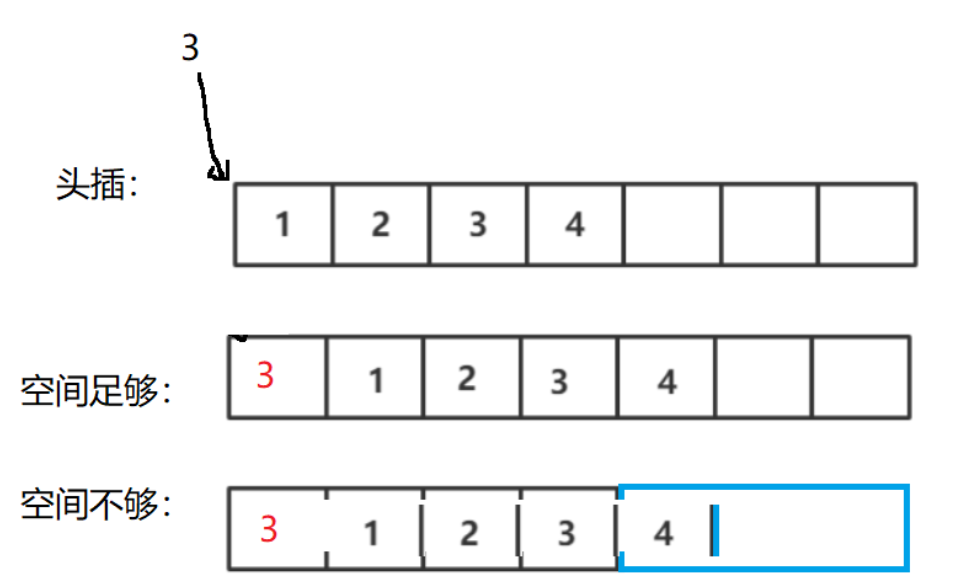

函数的声明:`SeqList.h`

```c
void SLPushFront(SL* ps, SLDataType x);
```

函数的实现:`SeqList.c`

```c
//头插
void SLPushFront(SL* ps, SLDataType x)
{
    assert(ps);
    //判断空间是否足够，不够则扩容
    SLCheckCapacity(ps);
    //空间足够，历史数据后移一位
    // 挪动数据
    int end = ps->size - 1;
    while (end >= 0)
    {
        ps->a[end + 1] = ps->a[end];
        --end;
    }
    ps->a[0] = x;
    ps->size++;
}
```

+ 这个时候我们可以看到，已经头插进去了

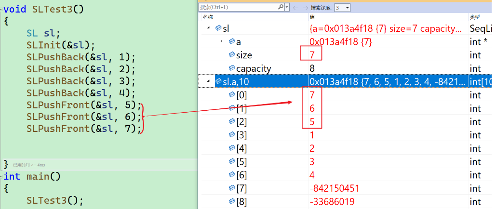

### 顺序表的尾删
+ 首先这里还要判断顺序表的有效数据是否为空
+ 这里我们再分装一个函数来判断是否为空

函数的声明:`SeqList.h`

```c
bool SLIsEmpty(SL* ps);
```

函数的声明:`SeqList.h`

```c
bool SLIsEmpty(SL* ps)
{
    assert(ps);
    return ps->size == 0;
}
```

+ 尾删没有其他操作直接有效数据减减就可以了

函数的声明:`SeqList.h`

```c
void SLPopBack(SL* ps);
```

函数的实现:`SeqList.c`

```c
//尾删
void SLPopBack(SL* ps)
{
    assert(ps);
    assert(!SLIsEmpty(ps));
    ps->size--;
}
```

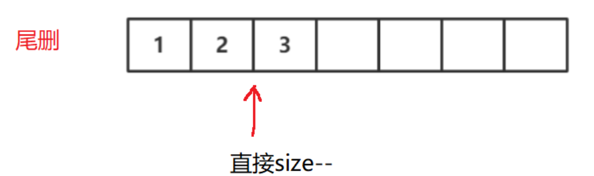

### 打印顺序表
函数的声明:`SeqList.h`

```c
void SeqListPrint(SeqList* ps);
```

函数的实现:`SeqList.c`

+ assert函数断言传过来的指针是否为空，若为空就直接结束程序 。

```c
void SeqListPrint(SeqList* ps)
{
    assert(ps);
    for (int i = 0; i < ps->size; i++)
    {
        printf("%d ", ps->a[i]);
    }
    printf("\n");
}
```

### 顺序表的头删
+ 需不需要先把第一个位置的数据置为默认值呢？
    - 不需要，只需将后面的数据向左挪动一位，直接覆盖就可以了

函数的声明:`SeqList.h`

```c
void SLPopFront(SL* ps);
```

函数的实现:`SeqList.c`

```c

//顺序表的头删
//头删
void SLPopFront(SL* ps)
{
    assert(ps);
    assert(!SLIsEmpty(ps)); 
    //让后面的数据往前挪动一位
    for (int i = 0; i < ps->size - 1; i++)
    {
        ps->a[i] = ps->a[i + 1];
    }
    ps->size--;
}
```

+ 可以看到头删已经成功了

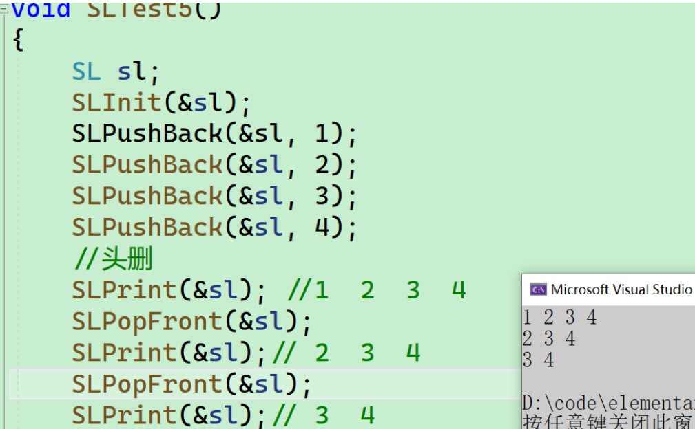

### 在顺序表的指定位置插入数据
+ 情况一：检查容量，容量足够，直接插入
+ 情况二：检查容量，容量不够，需要扩容，扩容完毕，直接插入

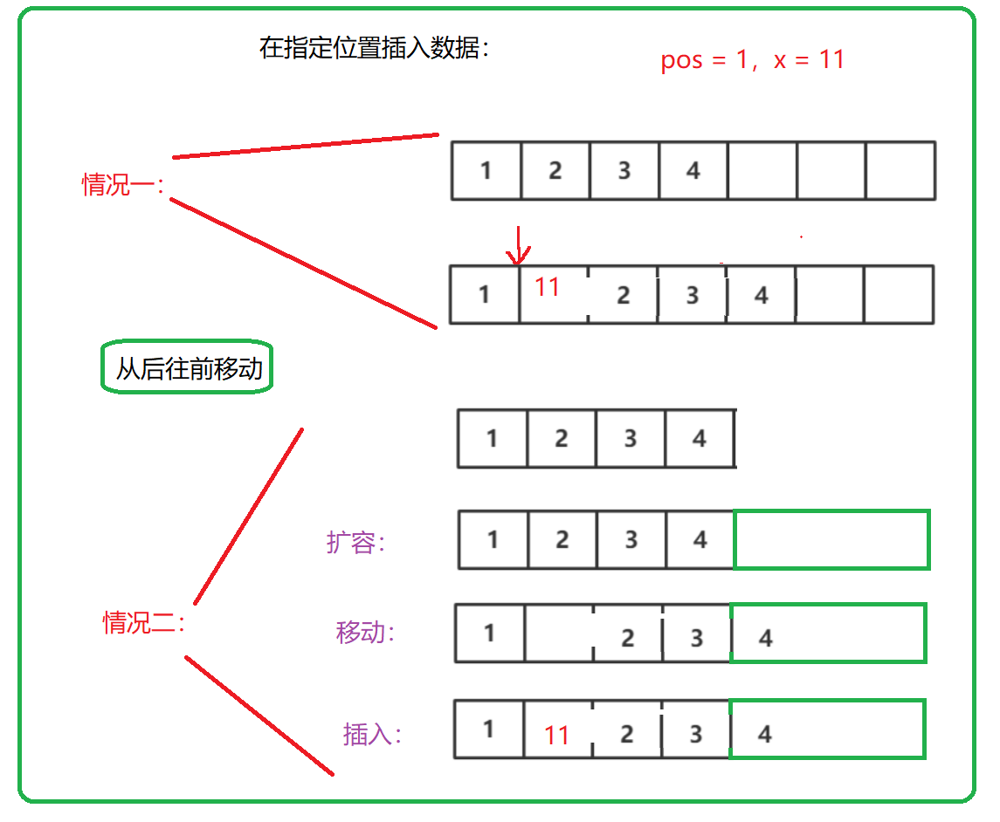

函数的声明:`SeqList.h`

```c
void SLInsert(SL* ps, int pos, SLDataType x);
```

+ 这里需要注意，pos要检查范围，不能不能负数和超出有效数据的范围

函数的实现:`SeqList.c`

```c
//在顺序表pos位置插入x
void SLInsert(SL* ps, int pos, SLDataType x)
{
    assert(ps);
    //需要限制范围
    assert(pos >= 0 && pos <= ps->size);
    //检查容量
    SLCheckCapacity(ps);
    
    for (int i = ps->size; i > pos; i--)
    {
        ps->a[i] = ps->a[i - 1];
    }
    ps->a[pos] = x;
    ps->size++;
}
```

+ 可以看到已经插入了~~

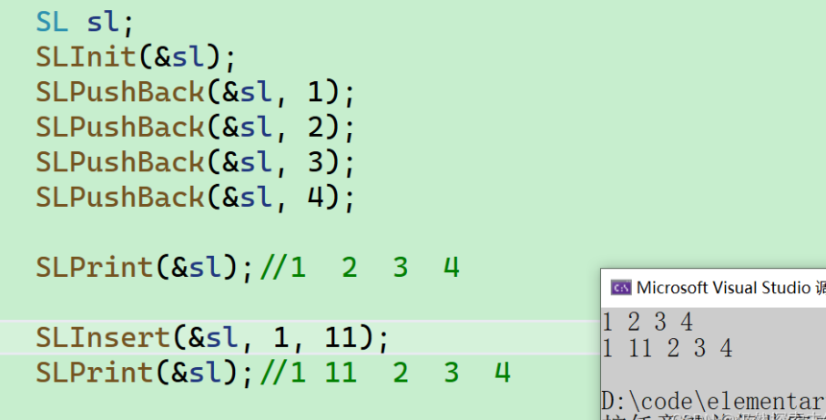


+ 有了指定位置之前插入数据之后，就可以在头插尾插口中直接调用该函数即可~~

---

### 在顺序表的指定位置删除数据
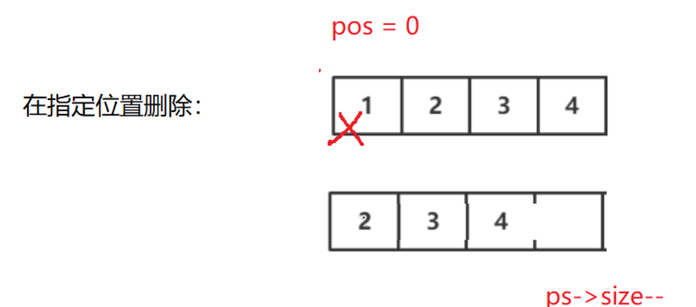


函数的声明:`SeqList.h`

```c
void SLErase(SL* ps, int pos);
```

+ 一样，需要先检查顺序表有没有有效数据，照样限制范围~~

函数的实现:`SeqList.c`

```c
void SLErase(SL* ps, int pos)
{
    assert(ps);
    assert(!SLIsEmpty(ps));
    assert(pos >= 0 && pos <= ps->size);
    for (int i = pos - 1; i < ps->size - 1; i++)
    {
        ps->a[i] = ps->a[i + 1];
    }
    ps->size--;
}
```


### 顺序表的查找
+ 这里很简单直接遍历查找就可以了

函数的声明:`SeqList.h`

```c
bool SLFind(SL* ps, SLDataType x);
```

函数的实现:`SeqList.c`

```c
bool SLFind(SL* ps, SLDataType x)
{
    assert(ps);
    assert(!SLIsEmpty(ps));
    for (int i = 0; i < ps->size; i++)
    {
        if (ps->a[i] == x) 
            return true;
    }
    return false;
}
```

## 三、源码~~
> `SepList.h`
>

```c
#pragma once

#include<stdio.h>
#include<stdlib.h>
#include<assert.h>
#include<stdbool.h>

//类型重命名
typedef int SLDataType;

//结构体的定义
typedef struct SeqList
{
    SLDataType* a;
    int size;//记录多少个有效数据
    int capacity;//空间容量
}SL;


//初始化顺序表
void SLInit(SL* ps);

//销毁顺序表
void SLDestroy(SL* ps);

//尾插
void SLPushBack(SL* ps, SLDataType x);

//头插
void SLPushFront(SL* ps, SLDataType x);

//尾删
void SLPopBack(SL* ps);

//头删
void SLPopFront(SL* ps);

//打印顺序表
void SLPrint(SL* ps);

//判断是否为空
bool SLIsEmpty(SL* ps);

//在任意位置之前插入
void SLInsert(SL* ps, int pos, SLDataType x);

//在任意位置之前删除
void SLErase(SL* ps, int pos);

//查找顺序表
bool SLFind(SL* ps, SLDataType x);
```

> `SepList.c`
>

```c
#include"SepList.h"

//初始化顺序表
void SLInit(SL* ps)
{
    assert(ps);
    ps->a = NULL;
    ps->capacity = ps->size = 0;
}

//销毁顺序表
void SLDestroy(SL* ps)
{
    if(ps->a)
        free(ps->a);
    ps->capacity = ps->size = 0;
}

//检查容量
void SLCheckCapacity(SL* ps)
{
    assert(ps);
    if (ps->size == ps->capacity) {
        int newCapacity = ps->capacity == 0 ? 4 : 2 * ps->capacity;
        //空间不够，需要扩容
        SLDataType* tmp = (SLDataType*)realloc(ps->a, newCapacity * sizeof(SLDataType));
        if (tmp == NULL) {
            perror("realloc fail!");
            return;
        }
        ps->a = tmp;
        ps->capacity = newCapacity;
    }
}

//尾插
void SLPushBack(SL* ps, SLDataType x)
{
    assert(ps);
    //判断空间够不够？
    SLCheckCapacity(ps);
    //直接插入数据
    ps->a[ps->size++] = x;
}

//头插
void SLPushFront(SL* ps, SLDataType x)
{
    assert(ps);
    //判断空间是否足够，不够则扩容
    SLCheckCapacity(ps);
    //空间足够，历史数据后移一位
    // 挪动数据
    int end = ps->size - 1;
    while (end >= 0)
    {
        ps->a[end + 1] = ps->a[end];
        --end;
    }
    ps->a[0] = x;
    ps->size++;
}

//尾删
void SLPopBack(SL* ps)
{
    assert(ps);
    assert(!SLIsEmpty(ps));
    ps->size--;
}

//头删
void SLPopFront(SL* ps)
{
    assert(ps);
    assert(!SLIsEmpty(ps));
    //让后面的数据往前挪动一位
    for (int i = 0; i < ps->size - 1; i++)
    {
        ps->a[i] = ps->a[i + 1];
    }
    ps->size--;
}

//打印顺序表
void SLPrint(SL* ps)
{
    assert(ps);
    assert(!SLIsEmpty(ps));
    for (int i = 0; i < ps->size; i++)
    {
        printf("%d ", ps->a[i]);
    }
    printf("\n");
}

//判断空间是否为空
bool SLIsEmpty(SL* ps)
{
    assert(ps);
    return ps->size == 0;
}


//在任意位置之前插入
void SLInsert(SL* ps, int pos, SLDataType x)
{
    assert(ps);
    //需要限制范围
    assert(pos >= 0 && pos <= ps->size);
    //检查容量
    SLCheckCapacity(ps);
    
    for (int i = ps->size; i > pos; i--)
    {
        ps->a[i] = ps->a[i - 1];
    }
    ps->a[pos] = x;
    ps->size++;
}

//在任意位置之前删除
void SLErase(SL* ps, int pos)
{
    assert(ps);
    assert(!SLIsEmpty(ps));
    assert(pos >= 0 && pos < ps->size);
    for (int i = pos - 1; i < ps->size - 1; i++)
    {
        ps->a[i] = ps->a[i + 1];
    }
    ps->size--;
}

//查找顺序表
bool SLFind(SL* ps, SLDataType x)
{
    assert(ps);
    for (int i = 0; i < ps->size; i++)
    {
        if (ps->a[i] == x) 
            return true;
    }
    return false;
}
```

## 四、OJ练习
### 移除元素
[https://leetcode.cn/problems/remove-element/description/](https://leetcode.cn/problems/remove-element/description/)

```c
int removeElement(int* nums, int numsSize, int val) {
    int l1 = 0, l2 = 0;
    while (l2 < numsSize) {
        if (nums[l2] != val) {
            nums[l1++] = nums[l2++];
        } else
            l2++;
    }
    return l1;
}
```

### 删除有序数组中的重复项
[https://leetcode.cn/problems/remove-duplicates-from-sorted-array/description/](https://leetcode.cn/problems/remove-duplicates-from-sorted-array/description/)

```c
int removeDuplicates(int* nums, int numsSize) {
    int src = 0, dest = src + 1;
    while (dest < numsSize) {
        if (nums[src] != nums[dest]) {
            nums[++src] = nums[dest++];
        } else
            dest++;
    }
    return src + 1;
}
```

### 合并两个有序数组
[https://leetcode.cn/problems/merge-sorted-array/description/](https://leetcode.cn/problems/merge-sorted-array/description/)

```c
void merge(int* nums1, int nums1Size, int m, int* nums2, int nums2Size, int n) {
    int src = m - 1, dest = n - 1, k = m + n - 1;
    while (dest >= 0 && src >= 0) {
        if (nums1[src] > nums2[dest])
            nums1[k--] = nums1[src--];
        else
            nums1[k--] = nums2[dest--];
    }
    while (dest >= 0) // 把剩下的拷贝过去
        nums1[k--] = nums2[dest--];
}
```


